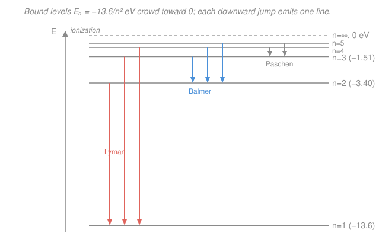

# Physical Chemistry · Lesson 4.4: The hydrogen atom and atomic spectra

> ⏱ ~15 min · Module 4: Statistical thermodynamics and molecular spectroscopy · Builds on: [4.3 Molecular energy levels: box, oscillator, rotor](04-03-molecular-energy-levels-box-oscillator-rotor.md), [quantum-mechanics](../../quantum-mechanics/syllabus.md) (the H-atom solution) · Unlocks: [4.5 Rotational–vibrational spectroscopy](04-05-rotational-vibrational-spectroscopy.md)

## Why this matters

Point a spectrometer at a glowing hydrogen tube and you don't get a smooth rainbow — you get a handful of sharp, colored lines at fixed wavelengths, the same every time, anywhere in the universe. Those lines are a barcode: they told us atoms have *quantized* energy levels decades before quantum mechanics could explain why, and today they let us read the composition, temperature, and velocity of a star from its light alone. This lesson connects the energy levels quantum mechanics hands us to the actual lines you measure — and to the rule that decides which jumps are allowed. It's the template for every spectroscopy method in the rest of this module.

## The idea

An electron bound to a proton can only occupy certain discrete energy levels — like rungs on a ladder, not a ramp. The lowest rung ($n=1$) is deepest; higher rungs crowd together as they approach the top of the ladder, which is the point where the electron breaks free (ionization). Feed the atom energy and the electron hops up; let it fall back and the surplus energy leaves as a single photon whose color is fixed by the *gap* between the two rungs. A big gap (deep fall) means a high-energy, short-wavelength photon; a small gap means a low-energy, long-wavelength one.

Because the rungs are at fixed heights, the gaps are at fixed sizes, so the emitted colors are at fixed wavelengths — the sharp lines. Group all the jumps that land on the *same* bottom rung and you get a family of lines, a **series**: everything falling to $n=1$ lands in the ultraviolet (the Lyman series), everything falling to $n=2$ lands in the visible (the Balmer series — those are the lines your eye sees), everything to $n=3$ in the infrared (Paschen). One ladder, three neighborhoods of the spectrum.

But not every pair of rungs is connected by a line. The photon carries away one unit of angular momentum, so it can only bridge levels whose angular-momentum quantum numbers differ by exactly one. That bookkeeping rule — the **selection rule** — is why the spectrum is a clean barcode and not a dense thicket.

## The formal version

**Hydrogenic energy levels (from quantum mechanics).** Solving the Schrödinger equation for one electron bound to a nucleus of charge $+Ze$ gives energies that depend only on the **principal quantum number** $n = 1, 2, 3, \dots$:

$$E_n = -\frac{Z^2\, R_H\, hc}{n^2} \;=\; -13.6\,\frac{Z^2}{n^2}\ \mathrm{eV}.$$

*In words: the levels are negative (bound), deepest at $n=1$, and climb toward $0$ as $n\to\infty$ (ionization).* Here $Z$ is the nuclear charge ($Z=1$ for H, $2$ for $\ce{He+}$, …), $h$ is Planck's constant, $c$ the speed of light, and $R_H$ is the **Rydberg constant**. It's most useful as a wavenumber, $R_H = 1.097\times10^7\ \mathrm{m^{-1}} = 109{,}677\ \mathrm{cm^{-1}}$; multiplying by $hc$ turns it into an energy, $R_H hc = 2.18\times10^{-18}\ \mathrm{J} = 13.6\ \mathrm{eV}$. This is the same $-1/n^2$ ladder quantum mechanics derives — here we *apply* it, we don't re-solve it.

**The Rydberg formula.** A transition between levels $n_1 < n_2$ emits (falling) or absorbs (rising) a photon whose energy is the gap $\Delta E = E_{n_2}-E_{n_1}$. Dividing by $hc$ gives the photon's **wavenumber** $\tilde\nu = 1/\lambda$ (in $\mathrm{cm^{-1}}$ or $\mathrm{m^{-1}}$):

$$\tilde\nu = \frac{1}{\lambda} = R_H\, Z^2\left(\frac{1}{n_1^{2}} - \frac{1}{n_2^{2}}\right), \qquad n_1 < n_2.$$

*In words: the line's inverse wavelength is the difference of two "$1/n^2$" terms, scaled by $R_H Z^2$.* Fix the lower level $n_1$ and let $n_2$ run — you sweep out one **series**:

| Series | Lands on $n_1=$ | Region |
|---|---|---|
| Lyman | 1 | ultraviolet |
| Balmer | 2 | visible |
| Paschen | 3 | infrared |

**Quantum numbers.** A hydrogenic state needs four labels (the energy depends only on $n$, but the *state* needs all four):

- $n = 1,2,3,\dots$ — principal; sets the energy and the shell.
- $\ell = 0,1,\dots,n-1$ — orbital angular momentum; the letters $s,p,d,f$ for $\ell=0,1,2,3$. Magnitude $\sqrt{\ell(\ell+1)}\,\hbar$.
- $m_\ell = -\ell,\dots,+\ell$ — the $z$-projection of orbital angular momentum ($2\ell+1$ values).
- $m_s = \pm\tfrac12$ — the spin projection.

So "$2p$" means $n=2,\ \ell=1$.

**Selection rules.** A photon carries exactly one unit ($\hbar$) of angular momentum, so an *electric-dipole* transition can only connect states obeying

$$\Delta\ell = \pm 1, \qquad \Delta m_\ell = 0,\ \pm 1.$$

*In words: allowed jumps change the orbital label by exactly one step ($s\leftrightarrow p\leftrightarrow d\leftrightarrow f$), never $s\to s$ or $s\to d$.* There is no restriction on $\Delta n$. This is why not every level pair produces a line — a $3s\to 2s$ jump is forbidden, but $3p\to 2s$ and $3s\to 2p$ are fine.

**Term symbols and fine structure.** To label the *total* angular-momentum state of an atom we combine electrons into a **term symbol**

$$^{2S+1}L_J,$$

where $S$ is the total spin (from summing the electron spins), $L$ the total orbital angular momentum (written $S,P,D,F$ for $L=0,1,2,3$ — capital letters for the whole atom), and $J$ the total, which ranges $J = |L-S|,\dots,L+S$. The superscript $2S+1$ is the **multiplicity**. For a single valence electron $s=\tfrac12$, so $2S+1=2$ (a "doublet"). Ground-state hydrogen ($1s^1$): $L=0,\ S=\tfrac12,\ J=\tfrac12$, giving $^2S_{1/2}$.

**Spin–orbit coupling** — the electron's spin magnetic moment interacting with the magnetic field it sees from its own orbital motion — splits a term with $\ell>0$ into slightly different-energy $J$ levels (**fine structure**). One spectral line then splits into a close **doublet**. The classic example is the yellow **sodium D line**: the $3p\to 3s$ transition. The upper $3p$ term ($L=1,S=\tfrac12$) splits into $^2P_{3/2}$ and $^2P_{1/2}$, so instead of one line you see two — $\text{D}_2$ at 589.0 nm and $\text{D}_1$ at 589.6 nm, split by about $17\ \mathrm{cm^{-1}}$.

## Picture

## Worked examples

**Example 1 (mechanical — one line).** Where is the $n=3\to 2$ line of hydrogen? Use the Rydberg formula with $Z=1$, $n_1=2$, $n_2=3$:

$$\tilde\nu = R_H\left(\frac1{2^2}-\frac1{3^2}\right) = 1.097\times10^7\left(\tfrac14-\tfrac19\right)\mathrm{m^{-1}} = 1.097\times10^7 \times 0.1389 = 1.524\times10^{6}\ \mathrm{m^{-1}}.$$

$$\lambda = \frac1{\tilde\nu} = \frac1{1.524\times10^{6}\ \mathrm{m^{-1}}} = 6.56\times10^{-7}\ \mathrm{m} = 656\ \mathrm{nm}.$$

That's the red H$\alpha$ line — the brightest Balmer line and the signature red of hydrogen nebulae. It lands on $n_1=2$, so it's Balmer, hence visible. ✓

**Example 2 (why you'd care — ionization from the ladder).** The ionization energy is the work to lift the electron from the ground state to the top of the ladder, $n=1\to\infty$. Since $E_\infty = 0$,

$$\Delta E = E_\infty - E_1 = 0 - (-13.6\ \mathrm{eV}) = 13.6\ \mathrm{eV} = R_H hc.$$

Per mole, $13.6\ \mathrm{eV}\times 96.485\ \mathrm{kJ\,mol^{-1}\,eV^{-1}} = 1312\ \mathrm{kJ/mol}$ — the measured ionization energy of hydrogen, straight from the spectroscopic constant. Notice the *series limit*: as $n_2\to\infty$ the lines in a series pile up and converge to $\tilde\nu = R_H/n_1^2$, and the position of that convergence *is* the ionization energy from level $n_1$. The spectrum literally shows you where the ladder ends.

## Watch out

- **You might think the lines are evenly spaced.** They aren't — within a series they crowd together toward the high-energy (series-limit) end, because the $1/n^2$ levels themselves bunch up near $n=\infty$. Equal spacing is a feature of the *rigid rotor* and *harmonic oscillator* from [4.3](04-03-molecular-energy-levels-box-oscillator-rotor.md), not of the $1/n^2$ Coulomb ladder.
- **You might read $E_n = -13.6/n^2$ as "the energy released."** It's the energy *of the level* (negative = bound). A line's energy is a *difference*, $E_{n_2}-E_{n_1}$ — always compute the gap, never a single level.
- **You might apply the H formula to a neutral many-electron atom.** The clean $-Z^2/n^2$ ladder is exact only for *one-electron* systems: H, $\ce{He+}$, $\ce{Li^2+}$, …. In multi-electron atoms other electrons screen the nucleus and the energy starts depending on $\ell$ too — which is exactly why sodium's levels split into terms and need the $^{2S+1}L_J$ machinery.
- **You might think spin–orbit splitting means the atom absorbed twice.** No — it's *one* electronic transition whose upper (or lower) level is split into two nearby $J$ levels, so the single line resolves into a doublet.

## One-liner

> Quantized levels $E_n=-13.6\,Z^2/n^2$ eV make the gaps — and thus the emitted colors — discrete; the Rydberg formula names each line, and $\Delta\ell=\pm1$ says which ones actually appear.

## Problems

**P1 (🟢)** Compute the wavelength of the hydrogen line for the $n=4\to 2$ transition. Which series does it belong to, and in what region of the spectrum does it fall? (Use $R_H = 1.097\times10^7\ \mathrm{m^{-1}}$.)

**P2 (🟡)** Compute the ground-state ionization energy of the hydrogenic ion $\ce{He+}$ ($Z=2$), in eV and in kJ/mol, and compare it to hydrogen's $1312\ \mathrm{kJ/mol}$. Why is it larger by exactly the factor you find?

**P3 (🔴)** (a) Of the transitions $3p\to 2s$, $3s\to 2s$, $3d\to 2p$, and $3d\to 2s$, which are allowed by the selection rule $\Delta\ell=\pm1$? (b) The sodium D line comes from the $3p\to 3s$ transition, yet appears as *two* closely spaced lines. Explain the origin of the doublet using term symbols.

Solutions

**P1** Rydberg formula, $Z=1$, $n_1=2$, $n_2=4$:

$$\tilde\nu = 1.097\times10^7\left(\frac1{4}-\frac1{16}\right) = 1.097\times10^7 \times \frac{3}{16} = 1.097\times10^7 \times 0.1875 = 2.057\times10^{6}\ \mathrm{m^{-1}}.$$

$$\lambda = \frac1{\tilde\nu} = 4.86\times10^{-7}\ \mathrm{m} = 486\ \mathrm{nm}.$$

It lands on $n_1=2$, so it's the **Balmer** series — the blue-green H$\beta$ line, in the **visible**. ✓ (Shorter wavelength than the 656 nm H$\alpha$ of Example 1, as it should be: a bigger drop, bluer light.)

**P2** For $\ce{He+}$, $Z=2$, ionization is $n=1\to\infty$:

$$\Delta E = 13.6\,\frac{Z^2}{1^2} = 13.6\times 4 = 54.4\ \mathrm{eV}.$$

Per mole: $54.4\times 96.485 = 5248\ \mathrm{kJ/mol}$. That is exactly $4\times$ hydrogen's $1312\ \mathrm{kJ/mol}$. The factor is $Z^2 = 4$: every energy level scales as $Z^2$ because the electron sits in the field of a $2\times$ stronger nucleus, so it is pulled in tighter (the $\ce{He+}$ ground-state orbital is also half the radius) and bound four times as deeply. ✓

**P3** (a) Compute $\Delta\ell$ for each ($s\!:\ell{=}0,\ p\!:\ell{=}1,\ d\!:\ell{=}2$):

- $3p\to 2s$: $\Delta\ell = 0-1 = -1$ → **allowed**.
- $3s\to 2s$: $\Delta\ell = 0-0 = 0$ → **forbidden**.
- $3d\to 2p$: $\Delta\ell = 1-2 = -1$ → **allowed**.
- $3d\to 2s$: $\Delta\ell = 0-2 = -2$ → **forbidden**.

Only the jumps that change the orbital label by exactly one step appear. (b) The lower level $3s$ is $^2S_{1/2}$: $L=0,S=\tfrac12$, so $J=\tfrac12$ only — no splitting. The upper level $3p$ has $L=1, S=\tfrac12$, so $J$ can be $|L-S|=\tfrac12$ or $L+S=\tfrac32$, giving two spin–orbit-split terms, $^2P_{1/2}$ and $^2P_{3/2}$, at slightly different energies. The single "$3p\to3s$" transition is therefore really two transitions — $^2P_{3/2}\to{}^2S_{1/2}$ (the $\text{D}_2$ line, 589.0 nm) and $^2P_{1/2}\to{}^2S_{1/2}$ (the $\text{D}_1$ line, 589.6 nm) — the sodium D doublet. ✓

## Flashback

**From Lesson 4.3 (Molecular energy levels: box, oscillator, rotor):** A rigid diatomic rotor has rotational energy levels $E_J = B\,J(J+1)$ with $J = 0,1,2,\dots$ and rotational constant $B = 2.0\times10^{-23}\ \mathrm{J}$. Find the energy gap between the $J=1$ and $J=2$ levels, and compare it to the $J=0\to1$ gap. Are rotational levels evenly spaced?

Solution

Level energies: $E_J = BJ(J+1)$.

$$E_0 = 0,\quad E_1 = B(1)(2) = 2B,\quad E_2 = B(2)(3) = 6B.$$

Gaps:

$$\Delta E_{0\to1} = 2B = 2\times(2.0\times10^{-23}) = 4.0\times10^{-23}\ \mathrm{J},$$
$$\Delta E_{1\to2} = 6B - 2B = 4B = 8.0\times10^{-23}\ \mathrm{J}.$$

The $1\to2$ gap is *twice* the $0\to1$ gap, so rotational levels are **not** evenly spaced — they spread apart as $J$ grows (gap between $J$ and $J{+}1$ is $2B(J{+}1)$, increasing with $J$). This is the mirror image of today's warning about the H atom: there the $1/n^2$ levels *bunch up*, here the $J(J+1)$ levels *fan out*. The transition wavenumbers of the rotor, spaced by a constant $2B$, are what make the rotational spectrum of [4.5](04-05-rotational-vibrational-spectroscopy.md) a ladder of equally spaced lines. ✓

## Connections

- **Backward:** the $E_n = -13.6\,Z^2/n^2$ ladder is the [quantum-mechanics](../../quantum-mechanics/syllabus.md) hydrogen-atom solution applied wholesale, and it sits beside the box/oscillator/rotor ladders of [4.3](04-03-molecular-energy-levels-box-oscillator-rotor.md) — same "energy differences make spectral lines" logic, different level formula.
- **Forward:** [4.5 Rotational–vibrational spectroscopy](04-05-rotational-vibrational-spectroscopy.md) carries the selection-rule idea to molecules ($\Delta J=\pm1$, $\Delta v=\pm1$), and [4.6 electronic spectroscopy](04-06-electronic-spectroscopy.md) puts electronic transitions like these together with vibrational structure. Term symbols return there for molecular states.
- **Sideways (stat mech):** which levels are actually *populated* — and so how bright each line is — is set by the Boltzmann factor and degeneracies from [4.1](04-01-boltzmann-partition-function.md); the same $-1/n^2$ energies that fix line *positions* feed the partition function that fixes line *intensities*.
