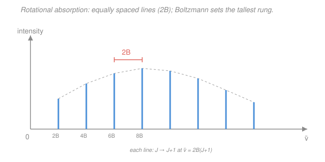

# Physical Chemistry · Lesson 4.5: Rotational and vibrational spectroscopy

> ⏱ ~15 min · Module 4: Statistical thermodynamics and molecular spectroscopy · Builds on: [4.3 Molecular energy levels: box, oscillator, rotor](04-03-molecular-energy-levels-box-oscillator-rotor.md) · Unlocks: [4.6 Electronic spectroscopy](04-06-electronic-spectroscopy.md)

## Why this matters

In [4.3](04-03-molecular-energy-levels-box-oscillator-rotor.md) you built a diatomic's energy ladders — the rigid rotor's $J(J+1)$ rungs and the harmonic oscillator's evenly-spaced steps — straight out of the quantum mechanics of the [rigid rotor and oscillator](../../quantum-mechanics/syllabus.md). But those were *predictions*. This lesson is where you **measure** them. Shine light at a gas, watch which colors it swallows, and the pattern of absorbed frequencies hands you two numbers, $B$ and $\omega_e$, that convert directly into the two things you actually want to know about a bond: **how long it is** and **how stiff it is**. Spectroscopy is how we learned bond lengths to four significant figures without ever seeing a molecule.

## The idea

A molecule can only absorb a photon whose energy *exactly* matches a gap between two of its levels — that's $\Delta E = h\nu$, resonance, nothing new. So the absorption spectrum is a photograph of the level ladder. But two extra rules decide which gaps actually light up.

**Rule 1 — the jump must be small and specific.** A molecule doesn't leap randomly. Rotation obeys $\Delta J = \pm1$: you can only climb one rotational rung at a time. Vibration obeys $\Delta v = \pm1$: one vibrational step. These **selection rules** come from the quantum mechanics of how a photon's field couples to the molecule.

**Rule 2 — the molecule must have a "handle" for light to grab.** Light is a wiggling electric field; to push a molecule it needs a *dipole* to push on. So pure rotation shows up only if the molecule has a **permanent dipole** (HCl yes, N₂ no), and vibration shows up only if the stretch **changes the dipole** (heteronuclear bonds yes, homonuclear no). No dipole handle, no absorption — the molecule is invisible in that region.

The payoff is geometric. Rotational levels *fan out* ($\propto J(J+1)$), but the *gaps between them* grow linearly, so the absorption lines land at $2B, 4B, 6B, \dots$ — a perfectly **even comb**. Measure one tooth-spacing and you have $B$, hence the moment of inertia, hence the bond length. Vibrational absorption sits near a single big frequency $\omega_e$, and $\omega_e = \frac{1}{2\pi c}\sqrt{k/\mu}$ — the very same $\sqrt{\text{stiffness}/\text{mass}}$ that sets a mass-on-a-spring's frequency in classical mechanics — so it reads out the force constant $k$.

## The formal version

Work in **wavenumbers** $\tilde\nu = 1/\lambda = \nu/c$ (units $\mathrm{cm^{-1}}$), spectroscopy's native currency: a level's energy divided by $hc$. Here $h$ is Planck's constant, $c$ the speed of light (in cm/s), $\mu$ the reduced mass, and $r$ the bond length.

**Rotational (microwave) spectroscopy.** From [4.3](04-03-molecular-energy-levels-box-oscillator-rotor.md), the rigid-rotor term values are

$$F(J) = B\,J(J+1), \qquad B = \frac{h}{8\pi^2 c\, I}, \qquad I = \mu r^2,$$

where $J = 0,1,2,\dots$ is the rotational quantum number, $B$ is the **rotational constant** ($\mathrm{cm^{-1}}$), and $I$ is the moment of inertia. *In words: $B$ is just the moment of inertia in disguise — a fat, slow-rotating molecule has small $B$.* Absorption ($\Delta J = +1$) from level $J$ to $J+1$ costs

$$\tilde\nu_{J\to J+1} = F(J{+}1) - F(J) = B\big[(J{+}1)(J{+}2) - J(J{+}1)\big] = 2B(J+1).$$

*In words: lines appear at $2B, 4B, 6B,\dots$ — equally spaced by $2B$.* So **the spacing between neighboring lines is $2B$**, full stop. Line *intensities* follow the population of the starting level, which is the Boltzmann factor from [4.1](04-01-boltzmann-partition-function.md) times the rotational degeneracy $g_J = 2J+1$:

$$\text{intensity} \propto (2J+1)\,e^{-hcB J(J+1)/k_BT}.$$

*In words: the degeneracy pushes intensity up at high $J$, the Boltzmann factor drags it down — so the tallest line is at an intermediate $J$, not $J=0$* (the comb rises then falls, as in the figure). This Boltzmann weighting is the [statistical-mechanics](../../stat-mech/syllabus.md) bridge into spectroscopy.

**Vibrational (IR) spectroscopy.** The harmonic oscillator of [4.3](04-03-molecular-energy-levels-box-oscillator-rotor.md) has evenly spaced levels $G(v) = \omega_e\,(v+\tfrac12)$, so the $\Delta v = +1$ **fundamental** absorbs at a single wavenumber

$$\tilde\nu = \omega_e = \frac{1}{2\pi c}\sqrt{\frac{k}{\mu}} \quad\Longrightarrow\quad k = \mu\,(2\pi c\,\omega_e)^2,$$

where $\omega_e$ is the **vibrational wavenumber** ($\mathrm{cm^{-1}}$) and $k$ is the bond **force constant** (N/m). *In words: a stiffer bond or a lighter pair of atoms vibrates at higher frequency — identical to the spring law $\omega=\sqrt{k/m}$.*

**Fine structure — P and R branches.** A real vibrational transition also changes $J$ (the molecule is rotating while it stretches), and $\Delta J = \pm1$ still holds. So each vibrational band splits into two combs of lines flanking the origin $\omega_e$:

- **R branch** ($\Delta J = +1$): lines *above* $\omega_e$,
- **P branch** ($\Delta J = -1$): lines *below* $\omega_e$,
- and a conspicuous **gap at $\omega_e$ itself** — the "missing Q branch," because $\Delta J = 0$ is forbidden for a simple diatomic stretch.

*In words: the band looks like two picket fences with a hole in the middle where the pure vibration would sit.*

**Anharmonicity (the Morse correction).** Real bonds aren't perfect springs — stretch far enough and they break. The Morse potential bends the ladder so rungs **converge** as $v$ rises (eventually meeting at dissociation). Two consequences: the strict $\Delta v = \pm1$ rule relaxes just enough to make weak **overtones** ($\Delta v = \pm2, \pm3$) faintly visible, and the level spacing shrinks with $v$ instead of staying at $\omega_e$.

## Picture

## Worked examples

**Example 1 (rotational → bond length).** Carbon monoxide's microwave spectrum is an even comb with lines spaced $3.84\ \mathrm{cm^{-1}}$ apart. The spacing *is* $2B$, so $B = 1.92\ \mathrm{cm^{-1}}$. Then

$$I = \frac{h}{8\pi^2 c B} = \frac{6.626\times10^{-34}}{8\pi^2(2.998\times10^{10})(1.92)} = 1.46\times10^{-46}\ \mathrm{kg\,m^2}.$$

With $\mu_{\ce{CO}} = \dfrac{(12.00)(15.995)}{27.995}\times1.6605\times10^{-27} = 1.139\times10^{-26}\ \mathrm{kg}$,

$$r = \sqrt{I/\mu} = \sqrt{\frac{1.46\times10^{-46}}{1.139\times10^{-26}}} = 1.13\times10^{-10}\ \mathrm{m} = 113\ \mathrm{pm}.$$

A ruler for a molecule, built from a light spectrum. (The accepted value is 112.8 pm.)

**Example 2 (vibrational → stiffness).** CO's IR fundamental sits at $\omega_e = 2170\ \mathrm{cm^{-1}}$. Then $\omega = 2\pi c\,\omega_e = 2\pi(2.998\times10^{10})(2170) = 4.09\times10^{14}\ \mathrm{s^{-1}}$, and

$$k = \mu\,\omega^2 = (1.139\times10^{-26})(4.09\times10^{14})^2 \approx 1.90\times10^{3}\ \mathrm{N/m}.$$

Nearly 1900 N/m — about ten times stiffer than a typical single bond, exactly what you'd expect for CO's triple bond. Same molecule, two spectra, two independent bond facts.

## Watch out

- **You might read the first line as $B$.** The lowest rotational line ($J{=}0\to1$) sits at $2B$, *not* $B$ — and the spacing between neighbors is also $2B$. Don't halve twice: get $B$ once from the spacing, then stop.
- **You might expect every molecule to have a rotational spectrum.** Homonuclear diatomics (N₂, O₂, H₂) have **no permanent dipole**, so they're microwave-silent and IR-silent — invisible to these techniques despite rotating and vibrating happily. Absorption needs a dipole handle.
- **You might think the tallest line is $J=0$.** No — the $(2J+1)$ degeneracy makes intermediate-$J$ levels the most populated, so the comb peaks in the middle. The most crowded rung, not the lowest, gives the strongest line.
- **You might treat the vibrational band as one sharp line.** At any real temperature it splits into P and R branches (rotation riding along), with a gap where the forbidden Q branch would be.

## One-liner

> Absorbed light photographs the level ladder: even rotational lines spaced $2B$ give the bond length ($I=\mu r^2$), and the vibrational line at $\omega_e=\frac{1}{2\pi c}\sqrt{k/\mu}$ gives the bond stiffness.

## Problems

**P1 (🟢)** The pure-rotational spectrum of a diatomic shows absorption lines evenly spaced by $2.00\ \mathrm{cm^{-1}}$. Find $B$, the moment of inertia $I$, and — given reduced mass $\mu = 1.14\times10^{-26}\ \mathrm{kg}$ — the bond length $r$.

**P2 (🟡)** A C–H stretch absorbs at $\omega_e = 3000\ \mathrm{cm^{-1}}$. Taking the reduced mass of a C–H pair as $\mu = 1.53\times10^{-27}\ \mathrm{kg}$, compute the force constant $k$ from $\omega_e = \frac{1}{2\pi c}\sqrt{k/\mu}$.

**P3 (🔴, Boss-4 rehearsal)** For $\ce{^1H^35Cl}$ the rotational constant is $B = 10.59\ \mathrm{cm^{-1}}$ and $\mu = 1.627\times10^{-27}\ \mathrm{kg}$. (a) Find the moment of inertia and the bond length. (b) Its vibrational wavenumber is $\omega_e = 2990\ \mathrm{cm^{-1}}$. Compute the rotational and vibrational characteristic temperatures $\theta_R = hcB/k_B$ and $\theta_V = hc\omega_e/k_B$, and use them to say which motion is thermally active at $300\ \mathrm{K}$.

Solutions

**P1** The spacing equals $2B$, so $B = 1.00\ \mathrm{cm^{-1}}$. Then

$$I = \frac{h}{8\pi^2 c B} = \frac{6.626\times10^{-34}}{8\pi^2(2.998\times10^{10})(1.00)} = 2.80\times10^{-46}\ \mathrm{kg\,m^2}.$$

Bond length from $I = \mu r^2$:

$$r = \sqrt{\frac{I}{\mu}} = \sqrt{\frac{2.80\times10^{-46}}{1.14\times10^{-26}}} = \sqrt{2.46\times10^{-20}} = 1.57\times10^{-10}\ \mathrm{m} = 157\ \mathrm{pm}.$$

*Check.* Units of $I$: $\mathrm{(J\,s)/(cm\,s^{-1}\cdot cm^{-1})} = \mathrm{J\,s^2} = \mathrm{kg\,m^2}$ ✓ (the two cm cancel). Smaller $B$ than CO's $1.92\ \mathrm{cm^{-1}}$, so a bigger $I$ and longer bond — consistent.

**P2** Rearrange $\omega_e = \frac{1}{2\pi c}\sqrt{k/\mu}$ to $k = \mu(2\pi c\,\omega_e)^2$. First the angular frequency:

$$2\pi c\,\omega_e = 2\pi(2.998\times10^{10})(3000) = 5.65\times10^{14}\ \mathrm{s^{-1}}.$$

Then

$$k = (1.53\times10^{-27})(5.65\times10^{14})^2 = (1.53\times10^{-27})(3.19\times10^{29}) \approx 489\ \mathrm{N/m}.$$

*Check.* Units: $\mathrm{kg\cdot s^{-2}} = \mathrm{kg\,m\,s^{-2}/m} = \mathrm{N/m}$ ✓. A few hundred N/m is a sensible single-bond force constant — softer than CO's triple bond (Example 2), as it should be.

**P3 (a)** Moment of inertia:

$$I = \frac{h}{8\pi^2 c B} = \frac{6.626\times10^{-34}}{8\pi^2(2.998\times10^{10})(10.59)} = 2.64\times10^{-47}\ \mathrm{kg\,m^2}.$$

Bond length:

$$r = \sqrt{\frac{I}{\mu}} = \sqrt{\frac{2.64\times10^{-47}}{1.627\times10^{-27}}} = \sqrt{1.62\times10^{-20}} = 1.27\times10^{-10}\ \mathrm{m} = 127\ \mathrm{pm}.$$

(Accepted HCl bond length: 127.5 pm — spot on.)

**(b)** Using $hc = (6.626\times10^{-34})(2.998\times10^{10}) = 1.986\times10^{-23}\ \mathrm{J\,cm}$ and $k_B = 1.381\times10^{-23}\ \mathrm{J/K}$:

$$\theta_R = \frac{hcB}{k_B} = \frac{(1.986\times10^{-23})(10.59)}{1.381\times10^{-23}} = 15.2\ \mathrm{K},$$

$$\theta_V = \frac{hc\,\omega_e}{k_B} = \frac{(1.986\times10^{-23})(2990)}{1.381\times10^{-23}} = 4.30\times10^{3}\ \mathrm{K}.$$

At $T = 300\ \mathrm{K}$: since $\theta_R = 15\ \mathrm{K} \ll 300\ \mathrm{K}$, **rotation is fully thermally active** — thermal energy easily populates many $J$ levels (that's why you see a whole rotational comb). Since $\theta_V = 4300\ \mathrm{K} \gg 300\ \mathrm{K}$, **vibration is frozen out** — essentially every molecule sits in $v=0$, and vibration contributes almost nothing to the heat capacity at room temperature. This is exactly the equipartition story from [4.2](04-02-partition-functions-to-thermodynamics.md): a mode "switches on" only once $T \gtrsim \theta$.

*Check.* The ordering $\theta_R \ll \theta_V$ mirrors the level spacings — rotational gaps ($\sim\!\mathrm{cm^{-1}}$, microwave) are tiny next to vibrational gaps ($\sim\!10^3\,\mathrm{cm^{-1}}$, infrared), so it takes far more thermal energy to excite vibration. ✓

## Flashback

**From Lesson 4.3 (Molecular energy levels — the harmonic oscillator):** A diatomic modeled as a harmonic oscillator has vibrational wavenumber $\omega_e = 1580\ \mathrm{cm^{-1}}$. Its energy levels are $G(v) = \omega_e(v+\tfrac12)$ in wavenumbers. Find (a) the zero-point energy (the $v=0$ level) in $\mathrm{cm^{-1}}$, and (b) the spacing between adjacent levels. (Fresh variant — a different molecule and both quantities.)

Solution

(a) The zero-point energy is the $v=0$ term value:

$$G(0) = \omega_e\left(0 + \tfrac12\right) = \tfrac12(1580) = 790\ \mathrm{cm^{-1}}.$$

The oscillator can never sit still — even its ground state holds half a quantum, a direct consequence of the uncertainty principle from quantum mechanics.

(b) For a harmonic oscillator the spacing is constant:

$$G(v{+}1) - G(v) = \omega_e\left[(v{+}\tfrac32) - (v{+}\tfrac12)\right] = \omega_e = 1580\ \mathrm{cm^{-1}}.$$

*Check.* Equal spacing is exactly why the vibrational fundamental in this lesson lands at a single wavenumber $\omega_e$ — every $\Delta v = +1$ step costs the same. (Anharmonicity is what later makes the real steps shrink.) ✓

## Connections

- **Backward:** the whole lesson is [4.3](04-03-molecular-energy-levels-box-oscillator-rotor.md) turned into an instrument — rigid-rotor $F(J)=BJ(J+1)$ becomes the $2B$ comb, harmonic $G(v)=\omega_e(v+\tfrac12)$ becomes the IR fundamental. Line intensities ride on the Boltzmann populations of [4.1](04-01-boltzmann-partition-function.md), and the "which mode is active" verdict is the equipartition/characteristic-temperature argument of [4.2](04-02-partition-functions-to-thermodynamics.md).
- **Forward:** [4.6 Electronic spectroscopy](04-06-electronic-spectroscopy.md) moves up to transitions between electronic states, where vibrational and rotational structure ride along as fine detail (Franck–Condon). These same $B$ and $\omega_e$ readouts feed [quantum chemistry](../../quantum-chemistry/syllabus.md), where they benchmark computed potential-energy surfaces.
- **Sideways:** $\omega_e = \frac{1}{2\pi c}\sqrt{k/\mu}$ is the classical simple-harmonic-motion frequency $\omega=\sqrt{k/m}$ wearing a spectroscopist's units — the same physics that governs a mass on a spring or a pendulum's small swing, now sizing a chemical bond's stiffness.
