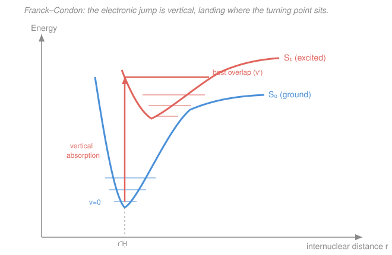

# Physical Chemistry · Lesson 4.6: Electronic spectroscopy

> ⏱ ~15 min · Module 4: Statistical thermodynamics and molecular spectroscopy · Builds on: [4.5 Rotational & vibrational spectroscopy](04-05-rotational-vibrational-spectroscopy.md), [4.4 Hydrogen atom & atomic spectra](04-04-hydrogen-atom-atomic-spectra.md) · Unlocks: **course complete** → feeds [quantum chemistry](../../quantum-chemistry/syllabus.md)

## Why this matters

Why is chlorophyll green, blood red, a carrot orange? Color is electronic spectroscopy you can see. Where microwaves probe rotation and infrared probes vibration ([4.5](04-05-rotational-vibrational-spectroscopy.md)), **ultraviolet–visible (UV–vis) light** carries enough energy to kick an electron between molecular orbitals — the largest of the three gaps, and the one that governs which visible wavelengths a molecule swallows. This lesson is where the quantum energy levels of Module 4 finally cash out as something on a lab bench (an absorbance readout, a fluorescent glow) and as the last stop before you study those orbitals for real in quantum chemistry.

## The idea

Rotation, vibration, electronic: three ladders, three rung spacings. Rotational rungs are whispers (microwave), vibrational rungs are a step up (infrared), and **electronic rungs are a full flight of stairs** — promoting an electron from a filled orbital to an empty one costs a few electron-volts, which lands squarely in the near-UV and visible. A molecule absorbs a photon exactly when the photon's energy matches one of these electronic gaps, and $E = hc/\lambda$ then tells you the color that goes missing.

Which electrons move? The loosely held ones. A carbon–carbon double bond has a $\pi$ electron sitting in a $\pi$ **bonding** orbital; light can promote it to the empty $\pi^*$ **antibonding** orbital — a $\pi\to\pi^*$ transition. A lone pair on oxygen or nitrogen sits a bit higher and can jump to $\pi^*$ too — an $n\to\pi^*$ transition. The chunk of a molecule responsible for a given absorption is its **chromophore** ("color-carrier"). And here is the punchline that explains every dye: **string double bonds together (conjugation) and the gap shrinks**, sliding the absorption from invisible UV toward visible — longer conjugation, longer wavelength, more color.

## The formal version

**The transition and its wavelength.** An electronic transition promotes one electron across the **HOMO–LUMO** gap (highest occupied → lowest unoccupied molecular orbital), of size $\Delta E$. It absorbs a photon of exactly that energy:

$$\Delta E = h\nu = \frac{hc}{\lambda}.$$

*In words: the absorbed wavelength is set by the orbital energy gap — bigger gap, bluer (shorter $\lambda$); smaller gap, redder (longer $\lambda$).* Typical $\Delta E \approx 2$–$6\ \mathrm{eV}$, i.e. $\lambda \approx 200$–$700\ \mathrm{nm}$.

**Beer–Lambert law (how much is absorbed).** For quantifying concentration, the absorbance is

$$A = \varepsilon\, c\, \ell,$$

with $\varepsilon$ the molar absorptivity ($\mathrm{L\,mol^{-1}\,cm^{-1}}$), $c$ the concentration ($\mathrm{mol\,L^{-1}}$), and $\ell$ the path length (cm). *In words: absorbance grows linearly with how much chromophore the light passes through* — the workhorse of quantitative UV–vis.

**Chromophores and conjugation.** The gap shrinks as a conjugated $\pi$ system extends. The cleanest way to see why is the **particle in a box** ([4.3](04-03-molecular-energy-levels-box-oscillator-rotor.md)): treat the delocalized $\pi$ electrons as trapped in a box of length $L$ (the conjugation length). Its levels are $E_n = n^2 h^2/(8m_e L^2)$, so the HOMO–LUMO gap scales as

$$\Delta E \propto \frac{1}{L^2}.$$

*In words: make the conjugated chain longer and the gap collapses like $1/L^2$, pushing absorption to longer wavelength.* This is the physical reason a long polyene like $\beta$-carotene absorbs blue light (and looks orange), while an isolated C=C absorbs deep in the UV — the direct payoff of the conjugation and aromaticity you met in [organic chemistry](../../organic-chemistry/syllabus.md).

**Vibronic structure and the Franck–Condon principle.** An electronic transition never happens alone: the molecule also changes vibrational level, so each electronic band is really a comb of **vibronic** ("vibrational + electronic") sub-bands. Their *intensities* follow the **Franck–Condon principle**:

> Electronic transitions are **vertical**: the electron rearranges so fast (~$10^{-15}\ \mathrm{s}$) that the heavy nuclei are effectively frozen during the jump.

*In words: absorption is a straight-up arrow on an energy-vs-bond-length plot — the bond length can't change mid-jump.* Because the electron redistribution usually changes bonding, the excited-state potential well typically sits at a **longer** equilibrium bond length than the ground state. A vertical arrow launched from the ground $v=0$ geometry therefore lands not on the excited $v'=0$ level but on some higher $v'$ whose vibrational wavefunction has a **turning point** (a lobe of large $|\psi|^2$) right above the ground-state geometry. That best-overlap level gets the most intense band; the surrounding ones tail off — the whole intensity envelope of a UV–vis band is a map of the geometry shift.

**Excited-state fates (a Jablonski sketch).** Once up in the excited singlet $S_1$, the molecule sheds energy. Two radiative escapes:

- **Fluorescence:** $S_1 \to S_0$ emission — same spin (singlet→singlet), so **spin-allowed** and **fast**, lifetimes $\sim 10^{-9}$–$10^{-7}\ \mathrm{s}$ (nanoseconds).
- **Phosphorescence:** after **intersystem crossing** flips a spin to the triplet $T_1$, emission $T_1 \to S_0$ is **spin-forbidden**, so it leaks out slowly — lifetimes $\sim 10^{-6}$ s up to **seconds** (glow-in-the-dark).

*In words: fluorescence is a quick, spin-preserving bounce back down; phosphorescence is a slow, spin-flipped trickle — which is why one stops the instant you turn off the lamp and the other keeps glowing.*

## Picture

## Worked examples

**Example 1 (color from a gap).** A dye absorbs maximally at $\lambda = 500\ \mathrm{nm}$ (green light — so it looks red/purple). What is the HOMO–LUMO gap per molecule and per mole?

$$\Delta E = \frac{hc}{\lambda} = \frac{(6.626\times10^{-34})(3.00\times10^8)}{500\times10^{-9}} = 3.98\times10^{-19}\ \mathrm{J}.$$

Per mole, $\times N_A$: $\Delta E = 3.98\times10^{-19}\times6.022\times10^{23} = 2.40\times10^5\ \mathrm{J/mol} = 240\ \mathrm{kJ/mol}$ (about $2.5\ \mathrm{eV}$). A few hundred kJ/mol — an order of magnitude above vibrational quanta, exactly as promised.

**Example 2 (Franck–Condon reasoning).** Molecule A's excited-state equilibrium bond length is almost identical to its ground state; molecule B's excited state is much longer-bonded. Which shows a strong sharp $0$–$0$ band, and which shows a broad progression peaking at high $v'$? A vertical arrow in A lands right on $v'=0$ (the wells sit atop each other), so the $0$–$0$ band dominates and the spectrum is sharp. In B the displaced upper well means the vertical arrow reaches a high-$v'$ turning point, so intensity spreads over many vibronic lines and peaks well above $v'=0$ — a broad band. *The width of a UV–vis band reports how much the geometry changes on excitation.*

## Watch out

- **You might think the strongest vibronic band is always $0$–$0$ (the lowest-energy one).** Only if the excited-state geometry matches the ground state. When the excited state is displaced, the vertical Franck–Condon arrow favors a *higher* $v'$ — the peak of the envelope moves up.
- **You might think fluorescence and phosphorescence differ only in speed.** The root difference is **spin**: fluorescence is spin-allowed (singlet→singlet), phosphorescence is spin-forbidden (triplet→singlet). The slowness is a *consequence* of the forbiddenness.
- **You might read $\varepsilon$ as a probability.** In Beer–Lambert $A = \varepsilon c\ell$, $\varepsilon$ is molar absorptivity with units $\mathrm{L\,mol^{-1}\,cm^{-1}}$; $A$ itself is dimensionless (a log ratio of intensities). Keep $c$ in $\mathrm{mol\,L^{-1}}$ and $\ell$ in cm or the units won't cancel.

## One-liner

> UV–vis light bridges the HOMO–LUMO gap; conjugation shrinks that gap ($\Delta E \propto 1/L^2$) to make dyes colored, Franck–Condon's vertical jump sets which vibronic band is brightest, and the molecule falls back by fast spin-allowed fluorescence or slow spin-forbidden phosphorescence.

## Problems

**P1 (🟢)** A solution of a chromophore in a $1.00\ \mathrm{cm}$ cell gives absorbance $A = 0.62$ at its $\lambda_{\max}$, where $\varepsilon = 1.5\times10^4\ \mathrm{L\,mol^{-1}\,cm^{-1}}$. (a) Find the concentration. (b) That $\lambda_{\max}$ is $450\ \mathrm{nm}$; find the transition energy in $\mathrm{kJ/mol}$.

**P2 (🟡)** Ethylene (one C=C) absorbs near $165\ \mathrm{nm}$; 1,3-butadiene (two conjugated C=C) near $217\ \mathrm{nm}$; $\beta$-carotene (eleven conjugated C=C) near $450\ \mathrm{nm}$ and looks orange. Explain the trend using the HOMO–LUMO gap, and connect it to the particle-in-a-box scaling.

**P3 (🔴)** A diatomic's excited electronic state has an equilibrium bond length noticeably longer than the ground state. (a) Using the Franck–Condon principle, predict whether the most intense absorption band is the $0$–$0$ band or a transition to a higher $v'$, and say why. (b) After absorption, contrast the two radiative decay routes back to $S_0$ by spin selection rule and timescale.

Solutions

**P1** (a) Rearrange Beer–Lambert $A = \varepsilon c\ell$:

$$c = \frac{A}{\varepsilon\,\ell} = \frac{0.62}{(1.5\times10^4)(1.00)} = 4.1\times10^{-5}\ \mathrm{mol\,L^{-1}}.$$

(b) Per molecule, $\Delta E = hc/\lambda$:

$$\Delta E = \frac{(6.626\times10^{-34})(3.00\times10^8)}{450\times10^{-9}} = 4.42\times10^{-19}\ \mathrm{J}.$$

Per mole, $\times N_A = 6.022\times10^{23}$:

$$\Delta E = 4.42\times10^{-19}\times6.022\times10^{23} = 2.66\times10^{5}\ \mathrm{J/mol} = 266\ \mathrm{kJ/mol}.$$

*Check.* $A$, $\varepsilon\ell$ dimensionless-consistent gives $\mathrm{mol\,L^{-1}}$ ✓; $266\ \mathrm{kJ/mol}\approx2.8\ \mathrm{eV}$, a normal visible-light electronic gap ✓.

**P2** Absorption wavelength is $\lambda = hc/\Delta E$, so a **longer** wavelength means a **smaller** HOMO–LUMO gap. As you conjugate more C=C bonds, the $\pi$ electrons delocalize over a longer stretch of the molecule. Modeling that stretch as a particle-in-a-box of length $L$ ([4.3](04-03-molecular-energy-levels-box-oscillator-rotor.md)), the levels are $E_n = n^2h^2/(8m_e L^2)$ and the HOMO–LUMO gap scales as $\Delta E \propto 1/L^2$. Longer conjugation → larger $L$ → smaller $\Delta E$ → longer $\lambda$. Ethylene's single bond keeps the electron in a short box (deep-UV, $165\ \mathrm{nm}$); butadiene's two conjugated bonds lengthen the box ($217\ \mathrm{nm}$); $\beta$-carotene's eleven push the gap all the way down into the visible ($450\ \mathrm{nm}$), so it absorbs blue and transmits orange. This is exactly why extended conjugation and aromaticity from organic chemistry produce colored compounds. *Check:* $1/L^2$ scaling predicts wavelength should climb steeply as bonds are added — matching $165\to217\to450\ \mathrm{nm}$ ✓.

**P3** (a) A **higher-$v'$** band is most intense. The electronic jump is **vertical** (Franck–Condon: nuclei frozen during the fast electronic transition), so the transition starts from the ground $v=0$ geometry and goes straight up. Because the excited-state well is displaced to longer bond length, the vertical arrow does not reach the excited $v'=0$ minimum; it terminates on a higher vibrational level whose classical turning point (large $|\psi|^2$) lies directly above the ground-state bond length. That level has the best wavefunction overlap and thus the strongest band; the $0$–$0$ band is weak. (b) **Fluorescence** ($S_1\to S_0$) is spin-allowed (singlet→singlet), hence fast: $\sim10^{-9}$–$10^{-7}\ \mathrm{s}$. **Phosphorescence** requires intersystem crossing to the triplet $T_1$ first, so $T_1\to S_0$ is spin-forbidden (triplet→singlet) and slow: $\sim10^{-6}\ \mathrm{s}$ to seconds. Same downhill energy, opposite spin bookkeeping — that spin flip is the whole reason phosphorescence lingers.

## Flashback

**From Lesson 4.5 (Rotational & vibrational spectroscopy):** The rotational constant of carbon monoxide is $B = 1.93\ \mathrm{cm^{-1}}$. Taking the reduced mass of $\ce{^{12}C^{16}O}$ and $B = \dfrac{h}{8\pi^2 c I}$ with $I = \mu r^2$, find the C–O bond length. (Fresh variant — a different molecule and constant than the worked lesson.)

Solution

Reduced mass ($1\ \mathrm{u} = 1.6605\times10^{-27}\ \mathrm{kg}$):

$$\mu = \frac{m_\ce{C} m_\ce{O}}{m_\ce{C}+m_\ce{O}} = \frac{12\times16}{28}\ \mathrm{u} = 6.857\ \mathrm{u} = 1.139\times10^{-26}\ \mathrm{kg}.$$

Solve $B = h/(8\pi^2 c I)$ for the moment of inertia, with $c$ in $\mathrm{cm\,s^{-1}}$ so $B$'s $\mathrm{cm^{-1}}$ cancels:

$$I = \frac{h}{8\pi^2 c B} = \frac{6.626\times10^{-34}}{(78.96)(2.998\times10^{10})(1.93)} = 1.45\times10^{-46}\ \mathrm{kg\,m^2}.$$

Then $r = \sqrt{I/\mu}$:

$$r = \sqrt{\frac{1.45\times10^{-46}}{1.139\times10^{-26}}} = \sqrt{1.27\times10^{-20}} = 1.13\times10^{-10}\ \mathrm{m} = 113\ \mathrm{pm}.$$

*Check.* The accepted CO bond length is $112.8\ \mathrm{pm}$ ✓ — spectroscopy weighs a molecule's geometry from a single line spacing.

## Connections

- **Backward:** this closes the spectroscopy arc of [4.5](04-05-rotational-vibrational-spectroscopy.md) — rotation (microwave) → vibration (IR) → electronic (UV–vis), each a bigger rung. The chromophore/conjugation argument reuses the particle-in-a-box levels of [4.3](04-03-molecular-energy-levels-box-oscillator-rotor.md), and vibronic structure is the vibrational oscillator of [4.3](04-03-molecular-energy-levels-box-oscillator-rotor.md) riding on an electronic jump.
- **Sideways (organic chemistry):** conjugation and aromaticity are the reason dyes, pigments, and indicators absorb visible light — the HOMO–LUMO gap you can literally see.
- **Course wrap-up.** Step back over the whole course. Module 1 asked **whether and how far** a change goes — the first and second laws, and $G$ as the arbiter of spontaneity ([1.3](01-03-gibbs-helmholtz-energies.md)). Module 2 applied that to **where** matter settles: phases, solutions, and the equilibrium constant. Module 3 asked **how fast** — rate laws, mechanisms, and the Arrhenius/transition-state picture ([3.4](03-04-arrhenius-transition-state-theory.md)). Module 4 supplied the **bridge and the ruler**: the Boltzmann distribution and the partition function ([4.1](04-01-boltzmann-partition-function.md), [4.2](04-02-partition-functions-to-thermodynamics.md)) connect the *molecular* energy levels — box, oscillator, rotor, atom — to the *bulk* thermodynamics of Modules 1–2, and spectroscopy (4.4–4.6) is how we *measure* those levels directly. Thermodynamics tells you the destination, kinetics the travel time, and statistical/quantum mechanics tells you what the molecules are doing to make it all true.
- **Forward:** those molecular orbitals we only sketched ($\pi$, $\pi^*$, $n$, HOMO, LUMO) are the subject of [quantum chemistry](../../quantum-chemistry/syllabus.md) — where you compute them from the Schrödinger equation instead of taking them as given. That is your next course.
