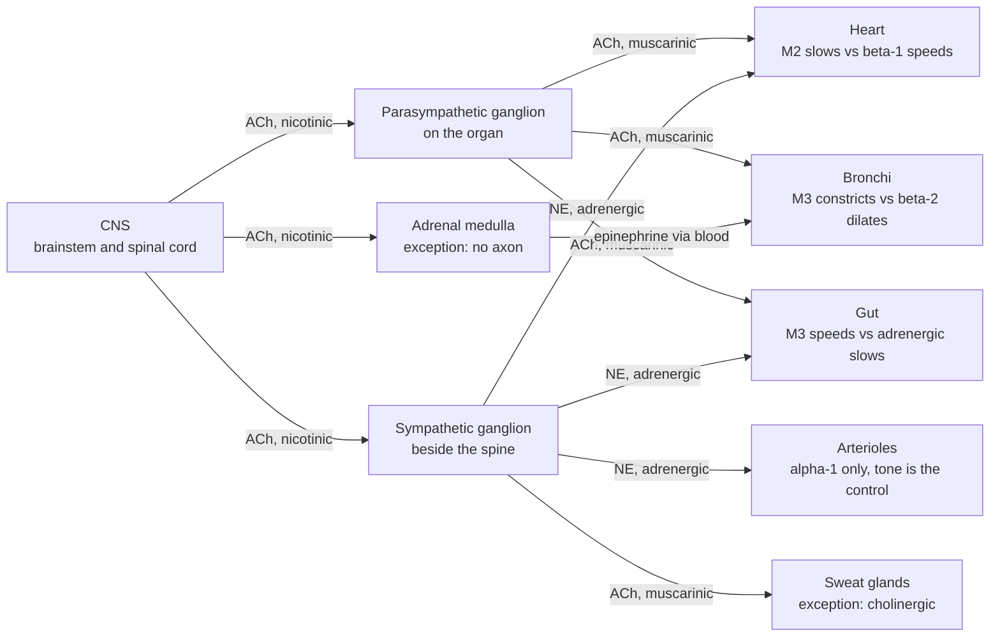

# Human Physiology · Lesson 1.5: Synaptic transmission — the neuromuscular junction and autonomic control

> ⏱ ~15 min · Module 1: Homeostasis, cells, and excitable tissue · Builds on: [1.4](01-04-action-potential.md), [1.3](01-03-resting-membrane-potential.md) · Unlocks: 1.6 (muscle contraction), and every effector arm in Modules 2–4

## Why this matters

[1.4](01-04-action-potential.md) got a signal to the end of an axon. It stops there — the axon terminal and its target are separated by a gap that no current crosses. Everything the nervous system does to the *body* happens at that gap, and this lesson is about the two crossings physiology actually runs on.

The first is the **neuromuscular junction (NMJ)**, and it is the most reliable synapse in the body — deliberately so. The second is **autonomic transmission**, the two-neuron chain that carries commands to heart, vessels, airways, gut, glands and sweat. Nearly every control loop in Modules 2–4 ends in an autonomic receptor: the baroreflex ([2.3](02-03-hemodynamics-blood-pressure.md)) works through $\alpha_1$ and $\beta_1$; the pacemaker ([2.1](02-01-cardiac-electrophysiology.md)) is set by $M_2$ versus $\beta_1$; bronchial tone ([2.4](02-04-ventilation-lung-mechanics.md)) by $M_3$ versus $\beta_2$; sweating ([4.2](04-02-thermoregulation.md)) by an exception to the whole scheme. **Learn the five receptors here and half of Modules 2–4 becomes predictable instead of memorized.**

The generic chemical synapse — vesicle biophysics, transmitter zoology, dendritic integration — belongs to [neuroscience 2.1](../../neuroscience/lessons/02-01-chemical-synaptic-transmission.md) and [neuroscience 2.3](../../neuroscience/lessons/02-03-synaptic-integration.md). We take one compact pass over it, extract the one principle physiology needs, and spend the rest of the lesson on the two junctions this course uses.

## The idea

**The generic synapse, in one pass.** An action potential invades the presynaptic terminal. Depolarization opens **voltage-gated $\text{Ca}^{2+}$ channels** — the same family as the $\text{Na}^+$ channels of [1.4](01-04-action-potential.md), just slower and tuned to a different ion. $\text{Ca}^{2+}$ rushes in down an enormous gradient (extracellular $\text{Ca}^{2+}$ is about $10^{4}$ times the resting cytosolic level), and local $\text{Ca}^{2+}$ near the channel mouth triggers **vesicle fusion**. Transmitter diffuses across a 20–50 nm cleft in a few microseconds, binds postsynaptic receptors, and opens (or modulates) ion channels. The result is a **postsynaptic current**.

**Two facts about this chain are worth carrying forward.**

*Where the delay lives.* Total synaptic delay is 0.5–1 ms. Diffusion across the cleft is fast — tens of microseconds — and binding is fast. **Almost the entire delay is the $\text{Ca}^{2+}$-entry-to-fusion step**, the slowest link in the chain. This is not an engineering flaw; it is what a chemically-gated, $\text{Ca}^{2+}$-amplified step costs.

*Release is quantal.* Transmitter leaves in **packets** — one vesicle's worth each, of fairly stereotyped size. The postsynaptic response to a single spontaneously-fused vesicle is a **miniature end-plate potential (MEPP)**; the evoked response is an integer multiple of it, plus noise.

**The principle physiology needs.** The presynaptic action potential is **all-or-none** — digital. The postsynaptic response is **graded** — analogue. Its amplitude depends on how many quanta were released, how many receptors are there to catch them, and how big the driving force is at that moment.

$$\boxed{\;\textbf{A synapse is a digital-to-analogue converter.}\;}$$

**This conversion is what makes integration possible at all.** You cannot sum all-or-none events; you *can* sum graded currents, in space and in time, which is exactly what a neuron's dendritic tree does ([neuroscience 2.3](../../neuroscience/lessons/02-03-synaptic-integration.md)). Every synapse in the CNS exploits it: no single input decides anything, and a thousand small analogue votes are added before the axon hillock re-digitizes the total into a spike.

**The neuromuscular junction throws that away on purpose.** A motor command that arrives at a muscle fibre must not be voted on. So the NMJ takes the same machinery and **over-builds it** until one presynaptic spike guarantees one muscle spike. That deliberate redundancy has a name — the **safety factor** — and the diseases and drugs of the junction are all stories about eroding it.

**The autonomic nervous system does something different again.** It runs *two* chemical lines to most organs, keeps **both permanently active**, and controls the organ by shifting the balance between them rather than by switching one on. That is why a heart with no nerve traffic at all beats *faster* than a resting heart.

## The formal version

### Quantal release

$$\text{EPP} = m \, q, \qquad m = n\,p$$

*In words: the end-plate potential equals the number of quanta released ($m$, the **quantal content**) times the postsynaptic response to one quantum ($q$, the **quantal size**, measured as the MEPP amplitude); and $m$ itself is the number of release-ready vesicles $n$ times the probability $p$ that each one fuses.*

$p$ rises steeply with presynaptic $\text{Ca}^{2+}$ entry (roughly as its fourth power), which is why lowering extracellular $\text{Ca}^{2+}$ or raising $\text{Mg}^{2+}$ — a competitive blocker at the channel — silences release. When $m$ is small, fusion is Poisson: the fraction of stimuli that produce *no* response is

$$P(0) = e^{-m} \quad\Longrightarrow\quad m = \ln\!\left(\frac{N_{\text{trials}}}{N_{\text{failures}}}\right),$$

which lets you count vesicles with a voltmeter.

### The nicotinic receptor and the end-plate potential

Motor neurons release **acetylcholine (ACh)** onto **nicotinic** receptors. A nicotinic receptor is not a G-protein receptor — it is a **ligand-gated cation channel**: two ACh molecules bind, the pore opens, and $\text{Na}^+$ and $\text{K}^+$ pass through it almost equally well. Because it passes both, its reversal potential sits *between* their equilibrium potentials, near zero:

$$V_{\text{rev}} = 61\;\text{mV}\cdot\log_{10}\frac{P_{Na}[\text{Na}^+]_o + P_K[\text{K}^+]_o}{P_{Na}[\text{Na}^+]_i + P_K[\text{K}^+]_i} \;\approx\; 0\ \text{mV} \quad (P_{Na}\approx P_K)$$

*In words: a channel that lets both cations through equally settles where their opposing pushes cancel, which is far above the muscle's resting potential — so opening it always depolarizes.* The end-plate current is

$$I = g_{\text{ACh}}\,(V_m - V_{\text{rev}}) \approx g_{\text{ACh}}\,V_m,$$

a large inward current at $V_m = -90$ mV that **shrinks as the end plate depolarizes** — the driving force is being spent. The resulting local depolarization is the **end-plate potential (EPP)**. It is graded, it does not propagate, and it is only a trigger: the fibre's own voltage-gated $\text{Na}^+$ channels, clustered in the folds just beside the receptors, fire the actual muscle action potential.

### The safety factor

$$\boxed{\;\text{SF} = \frac{\text{EPP amplitude}}{\Delta V \text{ needed to reach threshold}}\;}$$

*In words: how many times larger the synaptic depolarization is than the depolarization the muscle actually requires.* At a healthy mammalian NMJ, $\text{SF} \approx 2\text{–}5$. **A central synapse has a safety factor far below 1 — that is the point of a central synapse.** The NMJ's is above 1 by construction, and the construction is visible: an enormous terminal with many active zones, a huge quantal content ($m \sim 100$ at a mammalian end plate versus $m \sim 1$ centrally), a receptor density near the physical packing limit, and junctional folds that put the $\text{Na}^+$ channels within nanometres of the current source.

### Clearing the cleft: acetylcholinesterase

**Acetylcholinesterase (AChE)** is anchored in the basal lamina of the cleft and hydrolyses ACh at close to the diffusion limit — roughly $10^{4}$ molecules per second per active site. It clears the cleft in well under a millisecond, so **each ACh molecule typically binds one receptor and is then destroyed.**

**This speed is not housekeeping; it is what makes the junction repeatable.** A motor neuron in a sustained contraction fires at 20–50 Hz, so the junction has 20–50 ms to reset. A synapse that could not clear its transmitter could not repeat: residual ACh would keep receptors occupied, desensitize them, and hold the end plate depolarized — which, as we will see, is exactly what happens when you poison AChE.

### The autonomic chain

**Two neurons in series, every time**, unlike the single motor neuron running from spinal cord to muscle:

$$\text{CNS} \xrightarrow[\text{ACh, nicotinic}]{\text{preganglionic}} \text{ganglion} \xrightarrow[\text{ACh or NE}]{\text{postganglionic}} \text{target}$$

- **Every ganglionic synapse, in *both* divisions, is ACh onto nicotinic receptors.** The ganglionic (neuronal, $\text{N}_N$) subtype differs from the muscle ($\text{N}_M$) subtype at the NMJ — which is why a muscle relaxant does not shut down your autonomic system.
- **Parasympathetic postganglionic: ACh onto muscarinic receptors.** Ganglia sit *on or near* the target organ, so postganglionic fibres are short and the output is targeted, organ by organ.
- **Sympathetic postganglionic: norepinephrine (NE) onto adrenergic receptors.** Ganglia sit in a chain beside the spine, so postganglionic fibres are long and one preganglionic neuron diverges onto many — the sympathetic output is broadcast.
- **Two famous exceptions.** (i) **Sweat glands** are sympathetic but *cholinergic*, acting on muscarinic receptors — which is why an anticholinergic drug makes you hot and dry. (ii) The **adrenal medulla** is a modified sympathetic ganglion whose "postganglionic neurons" are chromaffin cells with no axons: stimulated by preganglionic ACh at nicotinic receptors, they dump **epinephrine** into the blood. The bloodstream then does what an axon would have done, more slowly and to everything at once.

### The five receptors that run Modules 2–4

| Receptor | Transmitter | G protein | Main tissue | Effect |
|---|---|---|---|---|
| $\alpha_1$ | NE (sympathetic) | $G_q$ | arteriolar and venous smooth muscle | **vasoconstriction**; raises TPR and blood pressure |
| $\beta_1$ | NE (sympathetic) | $G_s$ | SA node, myocardium; kidney JG cells | **↑ heart rate, ↑ contractility**; renin release |
| $\beta_2$ | epinephrine (mostly hormonal) | $G_s$ | bronchial smooth muscle; skeletal-muscle arterioles; liver | **bronchodilation**, vasodilation, glycogenolysis |
| $M_2$ | ACh (parasympathetic) | $G_i$ | SA and AV node | **↓ heart rate**, slows AV conduction (opens GIRK $\text{K}^+$ channels) |
| $M_3$ | ACh (parasympathetic) | $G_q$ | smooth muscle and glands generally | **bronchoconstriction**, ↑ gut motility and secretion, pupil constriction |

**Notice the asymmetry in row 3.** $\beta_2$ responds much better to circulating epinephrine than to neural NE — so bronchodilation and muscle-bed vasodilation are largely *hormonal* sympathetic effects, arriving with the adrenal surge rather than down a nerve.

**All five are metabotropic**, i.e. G-protein-coupled — so unlike the nicotinic receptor they are **slow and amplified**: milliseconds-to-seconds instead of a millisecond, and one bound transmitter molecule activates many G proteins, each producing many second-messenger molecules. The cascade itself is [molecular-cell-biology 2.1](../../molecular-cell-biology/lessons/02-01-receptors-reading-outside-world.md) and [2.2](../../molecular-cell-biology/lessons/02-02-second-messengers-amplification.md). The physiological consequence: **autonomic effects have gain but not speed** — with one instructive exception, $M_2$, which opens $\text{K}^+$ channels through $G_{\beta\gamma}$ directly, without a second messenger, and is therefore fast enough to change heart rate between beats.

### Tone

**Both divisions are tonically active.** Control is exercised by shifting the balance, not by switching a division on.

$$\text{Output} = \text{intrinsic activity} + (\text{sympathetic drive}) - (\text{parasympathetic drive})$$

*In words: the organ sits at a set point produced by two opposing signals that are both already running, so either one can be raised or lowered to move it.* Three things follow:

1. **Bidirectional control from a single effector.** Arterioles have essentially only sympathetic $\alpha_1$ innervation, yet blood flow goes both up and down — because the baseline is a *nonzero* constriction. Vasodilation is not a dilator command; it is **withdrawal of vasoconstrictor tone**.
2. **Speed.** Removing an existing signal is as fast as its decay and needs no ramp-up. At the onset of exercise, the first thing that happens to heart rate is not sympathetic activation — it is **vagal withdrawal**, which acts within a beat or two ([4.3](04-03-exercise-integrative-physiology.md)).
3. **Resting tone is measurable.** Block both divisions and the heart runs at its **intrinsic rate**, about 100 min⁻¹ — well above a resting 70. **A resting heart is a braked heart**, and Problem 3 measures by how much.

This is the general control-theoretic gain of push–pull architecture from [1.1](01-01-homeostasis-feedback-control.md): two opposed one-directional actuators buy you a bidirectional one with a faster response than either alone.

## Picture

## Worked examples

**Example 1 (mechanical — counting vesicles with a voltmeter).** An end plate is bathed in low $\text{Ca}^{2+}$ / high $\text{Mg}^{2+}$ to cut release probability until single quanta are resolvable. Of 200 nerve stimuli, **18 produce no response at all**. Spontaneous MEPPs recorded from the same junction average $q = 0.9$ mV. (a) Estimate the quantal content. (b) Predict the mean EPP. (c) Restore normal $\text{Ca}^{2+}$, which raises $m$ to about 100 — what does that predict, and why is the real EPP smaller than the prediction?

(a) Failures are the zero class of a Poisson distribution with mean $m$:

$$e^{-m} = \frac{18}{200} = 0.09 \quad\Longrightarrow\quad m = \ln\!\frac{200}{18} = \ln 11.11 = \mathbf{2.41\ \text{quanta}}.$$

**Nothing about vesicles was measured — only how often nothing happened.** That the failure statistics and the amplitude statistics give the *same* $m$ is the original evidence that transmitter is packaged, not poured.

(b) $$\text{EPP} = m\,q = 2.41 \times 0.9 = \mathbf{2.2\ \text{mV}}.$$

(c) Naively, $m q = 100 \times 0.9 = 90$ mV. **The real EPP is much smaller — around 40–60 mV — and the reason is the driving force.** Each quantum's current is $g(V_m - V_{\text{rev}})$ with $V_{\text{rev}}\approx 0$. The first quantum acts on a driving force of 90 mV; by the time the end plate has climbed to $-30$ mV, the next quantum sees only 30 mV and delivers a third as much current. **Quanta do not sum linearly, because each one spends the currency the next one needs.**

This is called *nonlinear summation*, and it is a saturating nonlinearity built into the physics of any conductance-based synapse. It is also why the safety factor must be defined on the *measured* EPP, never on $mq$.

**Example 2 (why you'd care — one enzyme, two opposite clinical uses).** AChE is the pharmacological lever at every cholinergic synapse in the body. Inhibit it and ACh lingers, so **every** ACh effect is amplified: nicotinic at the NMJ and in all ganglia, muscarinic at every parasympathetic target and at the sweat glands.

**Used gently, this is a treatment.** In myasthenia gravis, antibodies destroy nicotinic receptors, so quantal size $q$ collapses and the safety factor falls toward 1. Neostigmine inhibits AChE reversibly; each released ACh molecule now survives long enough to find one of the *surviving* receptors, which raises the effective $q$ and pushes the EPP back over threshold. **The drug does not replace the missing receptors — it makes the transmitter try harder.**

**Used as a weapon, the same mechanism is lethal.** Organophosphate nerve agents inhibit AChE essentially irreversibly. ACh now accumulates at all four cholinergic sites at once:

| Site | Receptor | Consequence |
|---|---|---|
| Parasympathetic targets | muscarinic | bronchoconstriction and bronchorrhoea, bradycardia, vomiting, incontinence, pinpoint pupils |
| Sweat glands | muscarinic | drenching sweat |
| Autonomic ganglia | nicotinic ($\text{N}_N$) | chaotic, both-divisions-at-once output |
| NMJ | nicotinic ($\text{N}_M$) | fasciculation, then **depolarizing block** and paralysis |

Death is respiratory — airways flooded and constricted, diaphragm paralysed.

**And the treatment follows straight from the receptor table.** **Atropine** blocks muscarinic receptors, so it dries the airway and lifts the bradycardia — and does **nothing whatever for the paralysis**, because the NMJ is nicotinic. That is why the second drug, **pralidoxime**, is needed: it prises the organophosphate off AChE and restores the enzyme itself. **You cannot treat this poisoning with one drug, and the reason is precisely that "cholinergic" names two unrelated receptor families.**

**One last twist, worth knowing because it inverts the naive rule.** AChE inhibitors *reverse* a **non-depolarizing** block (curare, rocuronium — competitive nicotinic antagonists, out-competed by more ACh) but *deepen* a **depolarizing** block (succinylcholine — a nicotinic agonist that AChE cannot hydrolyse, so it holds the end plate depolarized until the fibre's $\text{Na}^+$ channels inactivate and the muscle goes silent while its receptors are still being stimulated). **More ACh does not always mean more transmission; past a point it means less.**

## Watch out

- **You might think the EPP is just a big EPSP.** It is quantitatively different in a way that changes its function. A central synapse contributes a fraction of a millivolt and is *meant* to be outvoted; the NMJ contributes tens of millivolts and is *meant* to be decisive. **A synapse with a safety factor above 1 cannot compute anything — and that is the design goal, not a limitation.**
- **You might sum quanta linearly.** $mq$ overestimates the real EPP badly, because as the end plate climbs toward $V_{\text{rev}} \approx 0$ the driving force collapses. Always define the safety factor on the measured EPP.
- **You might think sympathetic means adrenergic.** Every ganglion in *both* divisions is cholinergic-nicotinic, sweat glands are sympathetic-cholinergic-muscarinic, and the adrenal medulla is a ganglion that secretes a hormone instead of growing an axon.
- **You might expect atropine to block ganglia, or hexamethonium to block the NMJ.** Atropine is muscarinic-only, so it leaves every nicotinic synapse untouched. Hexamethonium blocks ganglionic $\text{N}_N$ in *both* divisions — it takes the whole autonomic nervous system offline — while leaving muscle $\text{N}_M$ alone. Curare does the reverse. **Receptor subtype, not transmitter, determines what a drug does.**
- **You might think of the autonomic divisions as on/off switches.** Both run continuously. Resting heart rate is *below* the intrinsic rate because vagal tone dominates, and the fastest way to speed the heart is to release that brake rather than press the accelerator.

## One-liner

> A synapse converts an all-or-none spike into a graded current, which is what makes summation possible — the neuromuscular junction then deliberately overbuilds that current until summation is unnecessary and every spike gets through, while the autonomic system keeps two opposing chemical lines permanently live so it can move any organ in either direction from a single resting balance.

## Problems

**P1 (🟢)** A muscle fibre rests at $V_m = -90$ mV. ACh opens a patch of nicotinic conductance $g_{\text{ACh}} = 20$ nS. Take the reversal potential as 0 mV for parts (a)–(c).
(a) Compute the driving force and state the current's direction.
(b) Compute the end-plate current in pA. (Recall $1\ \text{nS}\times1\ \text{mV} = 1\ \text{pA}$.)
(c) Recompute the current once the end plate has depolarized to $-20$ mV, and say what this implies about how the EPP grows.
(d) Verify that $V_{\text{rev}}\approx 0$: with $[\text{Na}^+]_o=145$, $[\text{Na}^+]_i=10$, $[\text{K}^+]_o=4$, $[\text{K}^+]_i=155$ (all mM), $P_{Na}=P_K$, and the constant $61\,\text{mV}\cdot\log_{10}$, compute the channel's reversal potential.

**P2 (🟡)** A muscle fibre rests at $-85$ mV and reaches threshold at $-55$ mV. Its measured EPP (recorded with the muscle action potential pharmacologically blocked) is 60 mV.
(a) Compute the safety factor.
(b) Myasthenia gravis destroys half the fibre's nicotinic receptors. Taking the EPP to scale with receptor number, recompute the safety factor.
(c) Even a healthy terminal shows presynaptic run-down: by the fifth stimulus of a train, quantal content has fallen to 70 percent of the first. Compute the fifth EPP in both fibres and say what happens to each. Then explain why myasthenic weakness is *fatigable* rather than constant, and what a clinician would see on repetitive nerve stimulation.
(d) Explain how neostigmine helps, in terms of $m$ and $q$ — and name the danger of too much of it.

**P3 (🔴, optional — bridges to [2.1](02-01-cardiac-electrophysiology.md) and [4.3](04-03-exercise-integrative-physiology.md))** A resting subject has a heart rate of 70 min⁻¹. Atropine alone raises it to 105. Propranolol alone lowers it to 60. Given both drugs, the rate is 95.
(a) Name the receptor each drug blocks, the cell type it sits on, and which autonomic division each drug is therefore silencing.
(b) Using $\text{HR} = \text{intrinsic} + S - P$, extract the intrinsic rate and the two tonic contributions $S$ and $P$ in beats per minute, and check them against the resting rate.
(c) Which division dominates at rest? Predict the fastest available mechanism for raising heart rate at the onset of exercise, and justify the speed claim from the receptor mechanisms in this lesson.
(d) State one reason the additive model in (b) is an approximation.

Solutions

**P1 (a)** $$V_m - V_{\text{rev}} = -90 - 0 = \mathbf{-90\ \text{mV}}.$$

The sign is negative, so by the usual convention (outward positive) this is an **inward current** — net positive charge entering, depolarizing the fibre. Physically, $\text{Na}^+$ is far from equilibrium and floods in while $\text{K}^+$ trickles out; the $\text{Na}^+$ influx wins overwhelmingly at this voltage.

**(b)** $$I = g_{\text{ACh}}(V_m - V_{\text{rev}}) = 20\ \text{nS}\times(-90\ \text{mV}) = \mathbf{-1800\ \text{pA} = -1.8\ \text{nA}}\ \text{(inward)}.$$

**(c)** $$I = 20\ \text{nS}\times(-20\ \text{mV}) = \mathbf{-400\ \text{pA}}.$$

The same open channels now carry **4.5 times less current**, purely because the driving force fell from 90 mV to 20 mV.

**Implication: the EPP is self-limiting.** It grows fast at first and then flattens as $V_m$ approaches $V_{\text{rev}}$, so the end plate can never be driven past about 0 mV no matter how much ACh arrives. This is the nonlinear summation of Example 1 seen from the current side, and it is also why the muscle *action potential* — which overshoots to positive voltages — has to be generated by separate voltage-gated $\text{Na}^+$ channels rather than by the receptors themselves.

**(d)** With $P_{Na} = P_K$ the permeabilities cancel out of the ratio:

$$V_{\text{rev}} = 61\log_{10}\frac{145 + 4}{10 + 155} = 61\log_{10}\frac{149}{165} = 61\log_{10}(0.9030) = 61\times(-0.0443) = \mathbf{-2.7\ \text{mV}}.$$

For comparison, the individual equilibrium potentials of this fibre are

$$E_{Na} = 61\log_{10}\frac{145}{10} = 61\times1.161 = +70.8\ \text{mV}, \qquad E_K = 61\log_{10}\frac{4}{155} = 61\times(-1.588) = -96.9\ \text{mV}.$$

**A channel that passes both settles almost exactly halfway between two potentials 168 mV apart** — and "halfway" happens to land next to zero. Note it is not the plain average ($-13$ mV): the GHK expression weights by concentration, not by voltage.

**P2 (a)** Depolarization required: $-55 - (-85) = 30$ mV.

$$\text{SF} = \frac{60\ \text{mV}}{30\ \text{mV}} = \mathbf{2.0}.$$

**The junction delivers twice the signal it needs.** Every spike gets through, and the redundancy is the whole point.

**(b)** Half the receptors means roughly half the response per quantum, so the EPP falls to $0.5\times60 = 30$ mV:

$$\text{SF} = \frac{30}{30} = \mathbf{1.0}.$$

**Exactly marginal.** The first stimulus still works, so the patient is not paralysed — at rest they may look and feel normal.

**(c)** With quantal content at 70 percent by the fifth stimulus:

| | EPP #1 | EPP #5 | Threshold | Fifth stimulus |
|---|---|---|---|---|
| Healthy | 60 mV | $0.7\times60 = 42$ mV | 30 mV | **fires** (SF still 1.4) |
| Myasthenic | 30 mV | $0.7\times30 = 21$ mV | 30 mV | **fails** |

**Presynaptic run-down is normal and universal.** Every NMJ releases less on its fifth spike than its first — the readily-releasable vesicle pool is being depleted faster than it refills. **In a healthy junction this is invisible, because the safety factor absorbs it.** That is what a safety factor is *for*: it buys tolerance to the ordinary degradation the system experiences all the time.

Strip the margin away and the same ordinary run-down becomes a failure. Hence **fatigable weakness**: strength is near-normal on the first effort and decays over seconds of sustained or repeated use, recovering with rest as the vesicle pool refills. Clinically it is worse at the end of the day, and the classic sign is ptosis appearing on sustained upgaze.

**On repetitive nerve stimulation** at 2–3 Hz, the clinician records the compound muscle action potential — the summed response of all the fibres. As successive stimuli fail in more and more fibres, the recorded amplitude falls: a **decremental response**, conventionally significant beyond about 10 percent by the fourth or fifth stimulus. A healthy muscle shows essentially no decrement.

**(d)** Myasthenia is a **postsynaptic** disease: $m$ (the number of quanta released) is normal — the nerve is fine — while $q$ (the response per quantum) has collapsed. Neostigmine cannot restore receptors, so it cannot restore $q$ directly. What it does is inhibit AChE, so each released ACh molecule survives longer in the cleft and gets more chances to find one of the surviving receptors before being destroyed. **Effectively it raises $q$ by extending each quantum's dwell time**, pushing $mq$ back above threshold.

*The danger:* too much AChE inhibition produces a **cholinergic crisis** — ACh accumulates until the end plate is held depolarized, the fibre's $\text{Na}^+$ channels inactivate, and you get a **depolarizing block** (the succinylcholine mechanism, arrived at pharmacologically). This presents as weakness, i.e. **it looks exactly like the disease getting worse**, and the reflexive response — more drug — is precisely wrong. The muscarinic side effects (sweating, salivation, pinpoint pupils, bradycardia, cramping) are the tell that distinguishes them.

**P3 (a)** **Atropine** is a muscarinic antagonist, blocking $M_2$ receptors on SA-nodal cells — it silences the **parasympathetic** (vagal) input. **Propranolol** is a $\beta$-blocker, blocking $\beta_1$ receptors on the same cells — it silences the **sympathetic** input.

**(b)** Both blocked gives the unopposed intrinsic rate directly:

$$\text{intrinsic} = \mathbf{95\ \text{min}^{-1}}.$$

Atropine alone removes $P$: $\;\text{intrinsic} + S = 105 \Rightarrow S = 105 - 95 = \mathbf{10\ \text{min}^{-1}}.$

Propranolol alone removes $S$: $\;\text{intrinsic} - P = 60 \Rightarrow P = 95 - 60 = \mathbf{35\ \text{min}^{-1}}.$

Check against rest: $95 + 10 - 35 = \mathbf{70}$ ✓.

**(c)** **Parasympathetic, and not narrowly** — the vagal brake is 35 min⁻¹ against a sympathetic push of 10. The resting heart is running well *below* its own pacemaker rate, held down by tonic vagal activity.

**Prediction: the first thing that happens at exercise onset is vagal withdrawal**, and it can supply about 35 min⁻¹ — from 70 up toward the intrinsic 95 — before sympathetic drive contributes anything at all.

*Why it is fast, mechanistically:* the vagal effect runs through $M_2$, which acts on GIRK $\text{K}^+$ channels via $G_{\beta\gamma}$ **directly** — no second messenger, no cascade, so onset and offset are of order 100 ms and the response is beat-to-beat. The sympathetic effect runs $\beta_1 \to G_s \to$ adenylyl cyclase $\to$ cAMP $\to$ PKA, a multi-step cascade with seconds of latency, and NE clearance from the cleft is slow too. **Removing the fast signal beats adding the slow one.** Above roughly the intrinsic rate, sympathetic drive necessarily takes over — there is no vagal tone left to release — which is why the heart-rate response to exercise has two visibly different phases ([4.3](04-03-exercise-integrative-physiology.md)).

**(d)** The two divisions are not independent: vagal activity **suppresses NE release** presynaptically (via $M_2$ autoreceptors on sympathetic terminals) and blunts the response to cAMP downstream. So the vagal brake is *more* effective when sympathetic tone is high than the additive model predicts — the phenomenon is called **accentuated antagonism**. The model is a linearization around one operating point, useful for extracting tone from a blockade experiment and not to be extrapolated far from it.

## Flashback

**From Lesson 1.3 (the resting membrane potential):** A cell sits at $V_m = -75$ mV with $[\text{K}^+]_i = 150$, $[\text{K}^+]_o = 5$, $[\text{Na}^+]_i = 12$, $[\text{Na}^+]_o = 145$ (all mM). Use $61\,\text{mV}\cdot\log_{10}$.
(a) Compute $E_K$ and $E_{Na}$.
(b) The cell's resting leak conductances are $g_K = 3$ nS and $g_{Na} = 0.3$ nS. Compute the driving force, the direction, and the size of the current carried by each, and comment on the net.
(c) Now open a nicotinic receptor on this same cell ($V_{\text{rev}} = 0$). Compute its driving force and say why the current it carries dwarfs both leaks.

Solution

**(a)** $$E_K = 61\log_{10}\frac{5}{150} = 61\log_{10}(0.03333) = 61\times(-1.4771) = \mathbf{-90.1\ \text{mV}}.$$

$$E_{Na} = 61\log_{10}\frac{145}{12} = 61\log_{10}(12.083) = 61\times1.0821 = \mathbf{+66.0\ \text{mV}}.$$

**(b)** Driving forces, $V_m - E_{\text{ion}}$:

$$\text{K}^+: \; -75 - (-90.1) = +15.1\ \text{mV} \quad\Longrightarrow\quad I_K = 3\times15.1 = \mathbf{+45\ \text{pA, outward}}.$$

$$\text{Na}^+: \; -75 - 66.0 = -141.0\ \text{mV} \quad\Longrightarrow\quad I_{Na} = 0.3\times(-141.0) = \mathbf{-42\ \text{pA, inward}}.$$

**Net: $+3$ pA outward** — nearly, but not exactly, zero. **Two points worth extracting.**

First, note how the cell achieves balance. The $\text{Na}^+$ driving force is *nine times* the $\text{K}^+$ driving force, and the currents still nearly cancel — because the resting membrane's $\text{K}^+$ conductance is ten times its $\text{Na}^+$ conductance. **The resting potential is set by permeability ratios fighting against gradient ratios**, which is the whole content of the Goldman equation ([biophysics 4.4](../../biophysics/lessons/04-04-membrane-potentials-nernst-goldman.md)).

Second, the residual 3 pA outward tells you $-75$ mV is very slightly positive of this cell's true zero-current point, which sits a fraction of a millivolt lower. In a real cell the last residue is handled by the electrogenic $\text{Na}^+/\text{K}^+$-ATPase, which exports 3 $\text{Na}^+$ for every 2 $\text{K}^+$ imported and so carries a small standing outward current of its own.

**(c)** $$V_m - V_{\text{rev}} = -75 - 0 = \mathbf{-75\ \text{mV}}, \ \text{inward}.$$

Per unit conductance that is **five times** the $\text{K}^+$ leak's driving force of 15.1 mV. But the driving force is the smaller half of the story: **the real difference is conductance.** The leaks together amount to 3.3 nS spread over the whole cell, while a single activated end plate switches on hundreds of nanosiemens in under a millisecond.

**Large driving force times large conductance, appearing suddenly** — that product is the end-plate current, and it is why the EPP swamps everything the resting membrane is doing.

## Connections

- **Backward:** the terminal's voltage-gated $\text{Ca}^{2+}$ channels are the same gating machinery as [1.4](01-04-action-potential.md)'s $\text{Na}^+$ channels, tuned to a different ion; every current in this lesson is $g(V_m - E)$ from [1.3](01-03-resting-membrane-potential.md); autonomic tone is the push–pull controller of [1.1](01-01-homeostasis-feedback-control.md), with the set point living in the *balance* rather than in either signal.
- **Forward:** [1.6](01-06-muscle-contraction.md) picks up exactly where the muscle action potential begins and turns it into force. Then the receptor table runs the rest of the course: $M_2$ and $\beta_1$ set the pacemaker in [2.1](02-01-cardiac-electrophysiology.md); $\alpha_1$ and $\beta_1$ are the effector arms of the baroreflex in [2.3](02-03-hemodynamics-blood-pressure.md); $M_3$ and $\beta_2$ set airway calibre in [2.4](02-04-ventilation-lung-mechanics.md); $\beta_1$ on juxtaglomerular cells starts the RAAS cascade in [3.3](03-03-fluid-electrolyte-acid-base.md); the enteric nervous system in [4.1](04-01-gastrointestinal-system.md) is a semi-autonomous network the autonomics only modulate; sympathetic cholinergic sweating is the effector of [4.2](04-02-thermoregulation.md); and [4.3](04-03-exercise-integrative-physiology.md) is vagal withdrawal followed by sympathetic drive, in every organ at once.
- **Sideways:** the central synapse in full — vesicle cycling, transmitter diversity, EPSP/IPSP summation and dendritic integration — is [neuroscience 2.1](../../neuroscience/lessons/02-01-chemical-synaptic-transmission.md) and [neuroscience 2.3](../../neuroscience/lessons/02-03-synaptic-integration.md). The G-protein cascade behind every muscarinic and adrenergic effect here is [molecular-cell-biology 2.1](../../molecular-cell-biology/lessons/02-01-receptors-reading-outside-world.md) and [2.2](../../molecular-cell-biology/lessons/02-02-second-messengers-amplification.md). The Nernst and GHK expressions used throughout are derived in [biophysics 4.4](../../biophysics/lessons/04-04-membrane-potentials-nernst-goldman.md).
