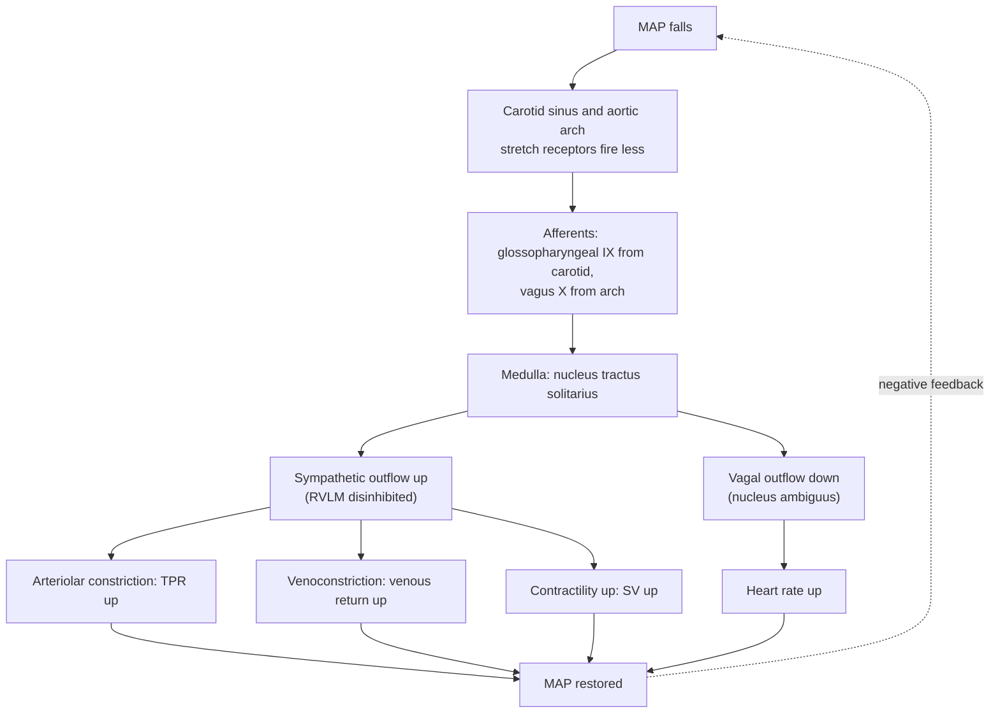

# Human Physiology · Lesson 2.3: Hemodynamics and blood pressure regulation

> ⏱ ~15 min · Module 2: The cardiovascular and respiratory systems · Builds on: [2.2](02-02-cardiac-cycle-and-output.md), [1.1](01-01-homeostasis-feedback-control.md) · Unlocks: 2.4 (ventilation and lung mechanics), 3.1 (glomerular filtration)

## Why this matters

[2.2](02-02-cardiac-cycle-and-output.md) built the pump. This lesson builds the plumbing the pump drives — and the plumbing turns out to be where almost all the control lives.

The circulation is a **driven resistive network with a compliant reservoir**, and that one sentence buys you nearly everything: why blood pressure has two numbers instead of one, why the arterioles and not the heart set organ blood flow, why a barely-visible change in a vessel's radius is a catastrophic change in flow, why blood slows to a crawl exactly where it needs to exchange, and why fluid leaks out of capillaries by design. Every calculation in this lesson is Ohm's law or a pressure balance.

The physiological punchline is a division of labour that runs through the rest of the course. **The baroreflex defends blood pressure over seconds and gives up over days; the kidney sets it over weeks and never gives up.** Get that split right and hypertension stops being mysterious.

## The idea

**Blood flow obeys Ohm's law.** Push a fluid across a pressure difference through something that resists it:

$$Q = \frac{\Delta P}{R}$$

where $Q$ is volume flow (L/min), $\Delta P$ is the pressure difference driving it (mmHg), and $R$ is resistance (mmHg·min/L). The analogy to [circuits 1.2](../../circuits/lessons/01-02-ohms-law-equivalent-resistance.md) is exact, not loose:

| Electrical | Hemodynamic |
|---|---|
| Voltage $V$ | Pressure $\Delta P$ (mmHg) |
| Current $I$ | Blood flow $Q$ (L/min) |
| Resistance $R$ | Vascular resistance (mmHg·min/L) |
| Capacitance $C$ | Compliance $C = \Delta V/\Delta P$ (mL/mmHg) |
| Battery | The heart |

**Every series/parallel rule you know transfers unchanged**, and so does the RC time constant — which, as we'll see, is what makes diastolic pressure what it is.

**The whole circuit runs on about 90 mmHg.** Mean arterial pressure is roughly 95 mmHg and right atrial pressure roughly 5, so the entire systemic circulation is driven by a pressure difference smaller than the height of a column of water you could jump over. Everything downstream is a fight over how to spend those 90 mmHg.

**The arterioles do the spending, because resistance goes as the fourth power of radius.** This is the single most important number in the lesson. A vessel that narrows by 10 percent — invisible on any image — raises its resistance by 52 percent. **A vessel that dilates by 19 percent doubles its flow.** Nothing else in physiology has a control gain like that, which is why arterioles are wrapped in smooth muscle, richly innervated, and drenched in local metabolites: they are the body's flow-control valves, and they barely have to move.

**Organs hang in parallel, and that is a design choice.** The kidney, brain, gut, muscle and skin all take off from the aorta and all dump into the vena cava. Two consequences follow immediately: total peripheral resistance is **less than the resistance of any single organ**, and an organ can open its own valve without dragging the rest of the body with it.

**Pressure is pulsatile at the aorta and steady at the capillary**, because the aorta is a compliant reservoir. The heart ejects in bursts; the aorta swells to absorb the burst and recoils during diastole to keep flow going. This is the **Windkessel** (German for "air chamber", after the air-cushioned fire pumps that smoothed a hand-pumped jet into a steady stream), and it is just an RC low-pass filter made of elastin.

**Fluid leaks out of capillaries on purpose.** Hydrostatic pressure inside pushes water out; plasma proteins pull it back. The two nearly balance, filtration slightly wins, and the lymphatics carry off the surplus. Break any one of those terms and you get swelling.

## The formal version

### Poiseuille's law and the fourth power

For steady laminar flow of a Newtonian fluid through a rigid cylindrical tube of radius $r$ and length $L$, with fluid viscosity $\eta$:

$$Q = \frac{\pi\, \Delta P\, r^{4}}{8\,\eta\, L} \qquad\Longleftrightarrow\qquad R = \frac{8\,\eta\, L}{\pi\, r^{4}}$$

*In words: flow rises with the fourth power of radius and falls with length and viscosity.* This is derived from the Navier–Stokes equations in [fluid-dynamics 3.2](../../fluid-dynamics/lessons/03-02-couette-poiseuille.md); here we use the result.

**Read the exponents.** Doubling $L$ halves flow. Doubling $\eta$ halves flow. Doubling $r$ multiplies flow by $2^4 = 16$.

| Radius change | $R$ multiplied by | $Q$ multiplied by |
|---|---|---|
| $-20\%$ ($r \to 0.8r$) | $2.44$ | $0.41$ |
| $-10\%$ | $1.52$ | $0.66$ |
| $+10\%$ | $0.68$ | $1.46$ |
| $+19\%$ | $0.50$ | $2.00$ |
| $+100\%$ | $0.0625$ | $16.0$ |

**A 20 percent constriction cuts flow by 59 percent.** No other actuator in the body has that leverage, and it explains a pile of otherwise unrelated facts: why blushing is fast, why a coronary narrowing becomes symptomatic abruptly rather than gradually, why cold fingers go white, and why arteriolar tone rather than cardiac output is the variable the nervous system reaches for first.

### Series and parallel

Along one pathway (artery → arteriole → capillary → venule → vein), resistances add:

$$R_{\text{series}} = R_1 + R_2 + \cdots$$

Across organs, **conductances** add:

$$\frac{1}{R_{\text{total}}} = \frac{1}{R_1} + \frac{1}{R_2} + \cdots$$

*In words: adding another parallel organ bed can only lower total resistance.* Since every organ sees essentially the same $\Delta P$, an organ's share of cardiac output is exactly its share of total conductance, and

$$\boxed{\;\text{TPR} = \frac{\text{MAP} - \text{RAP}}{\text{CO}}\;}$$

with MAP mean arterial pressure, RAP right atrial pressure, CO cardiac output.

**Here is the design point.** If organ $i$ carries fraction $f_i$ of cardiac output and changes its own conductance by a fractional amount $\delta$, total conductance changes by exactly $f_i\delta$. The coronary bed takes 5 percent of cardiac output, so **doubling coronary flow raises total conductance by 5 percent** — the heart can quadruple its own perfusion during exercise and barely perturb the systemic circuit. Parallel wiring decouples the organs from each other. A series circulation could not do this, and the one place the body *does* use a series arrangement — the portal circulation, gut then liver — is exactly where flow to the second organ is hostage to the first.

### The pressure profile around the circuit

Mean pressure falls monotonically from aorta to right atrium, but not evenly:

| Segment | Mean pressure (mmHg) | Drop across it |
|---|---|---|
| Aorta | 95 | — |
| Large arteries | 92 | 3 |
| Arterioles (in → out) | 85 → 32 | **53** |
| Capillaries | 32 → 15 | 17 |
| Venules and veins | 15 → 6 | 9 |
| Venae cavae / right atrium | 3 | 3 |

**About 55 of the available 92 mmHg — roughly 60 percent — is spent across the arterioles**, which is the same statement as "the arterioles are the resistance vessels", now with a number on it.

Two things fall out. First, **capillary pressure is set by the arteriolar valve upstream**, so dilating an arteriole raises capillary pressure and therefore filtration (this is why inflamed tissue swells). Second, **pressure at the right atrium is near zero**, which is what makes venous return so sensitive to posture, to intrathoracic pressure, and to anything squeezing the abdomen.

### Velocity, area, and continuity

Flow is conserved; velocity is not. For a bed of total cross-sectional area $A$ carrying flow $Q$,

$$v = \frac{Q}{A}$$

*In words: the same volume per second squeezed through more total cross-section must move slower.* This is the continuity equation of [fluid-dynamics 1.3](../../fluid-dynamics/lessons/01-03-continuity-equation.md) applied to a branching network.

At rest, $Q \approx 5$ L/min $= 83.3$ cm³/s. The aorta has radius $\approx 1.25$ cm, so $A = \pi (1.25)^2 = 4.9$ cm² and

$$v_{\text{aorta}} = \frac{83.3\ \text{cm}^3/\text{s}}{4.9\ \text{cm}^2} = 17\ \text{cm/s}.$$

The capillaries number in the billions and total roughly $2500$ cm², so

$$v_{\text{cap}} = \frac{83.3}{2500} = 0.033\ \text{cm/s} = 0.33\ \text{mm/s},$$

**about 500 times slower.** A capillary is roughly 0.5 mm long, so a red cell spends

$$t = \frac{0.5\ \text{mm}}{0.33\ \text{mm/s}} \approx 1.5\ \text{s}$$

in it. **The circulation's slowest point is exactly its exchange surface, and that is not an accident** — it is the only place diffusion has time to finish. Then the venae cavae ($\approx 8$ cm² combined) bring velocity back up to about 10 cm/s.

### Where Poiseuille fails, and one place we exploit the failure

Poiseuille assumes a Newtonian fluid, steady flow, laminar flow, a rigid straight cylinder, and fully developed parabolic profile. **Blood violates every one of these.**

- **Non-Newtonian.** Blood is a suspension of deformable cells; its apparent viscosity falls as shear rate rises (shear-thinning) and depends strongly on hematocrit. Relative to water it is about 3.5-fold more viscous at normal hematocrit, and polycythemia can roughly double resistance without a single vessel changing radius. In tubes below about 300 µm the apparent viscosity *falls* (the Fåhraeus–Lindqvist effect: red cells stream axially, leaving a lubricating plasma layer at the wall) — which conveniently rescues microcirculatory flow.
- **Pulsatile, not steady.** In large arteries inertia matters and the velocity profile is blunted, not parabolic. The correct treatment is Womersley's, not Poiseuille's.
- **Branching.** Vessels bifurcate every few diameters, so flow never becomes fully developed; entrance effects dominate.
- **Compliant, not rigid.** $r$ itself depends on transmural pressure, so $R$ is pressure-dependent — which is the basis of both autoregulation and vascular collapse.
- **Turbulent at high Reynolds number.** From [fluid-dynamics 3.1](../../fluid-dynamics/lessons/03-01-reynolds-number.md), $\mathrm{Re} = \rho v d/\eta$. With $\rho = 1060$ kg/m³ and $\eta = 3.5\times10^{-3}$ Pa·s, peak systolic flow in the aorta ($v \approx 1$ m/s, $d = 0.025$ m) gives

$$\mathrm{Re} = \frac{1060 \times 1.0 \times 0.025}{3.5\times10^{-3}} \approx 7.6\times10^{3},$$

comfortably past the transition, while a capillary ($v = 3.3\times10^{-4}$ m/s, $d = 8$ µm) gives $\mathrm{Re} \approx 8\times10^{-4}$ — deep Stokes flow. **The same fluid spans seven orders of magnitude of Reynolds number inside one body.**

**Korotkoff sounds are turbulence induced on purpose.** A cuff inflated above systolic pressure occludes the brachial artery: no flow, silence. Deflate it just below systolic and blood squirts through a partly collapsed lumen — small $d$, large $v$, $\mathrm{Re}$ over the transition — and the turbulence is audible as tapping. That first tap is the **systolic** pressure. Deflate below diastolic and the artery stays open all cycle, flow returns to laminar, and the sound disappears: that is the **diastolic** pressure. Measuring blood pressure with a stethoscope is listening for a deliberately manufactured instability.

### Compliance, pulse pressure, and MAP

Compliance is the reservoir's give:

$$C = \frac{\Delta V}{\Delta P}$$

*In words: how many millilitres you must add to raise the pressure by one mmHg.* **Veins are roughly 20 times more compliant than arteries**, which is why about two-thirds of blood volume sits in the venous side at low pressure — the veins are the body's volume reservoir, the arteries its pressure reservoir.

During systole the ventricle ejects a stroke volume $SV$ into the aorta faster than the arterioles can drain it. The arterial tree stores the surplus and its pressure rises; during diastole it recoils and discharges. To a first approximation,

$$\boxed{\;PP \approx \frac{SV}{C_{\text{art}}}\;}$$

where $PP = P_{\text{sys}} - P_{\text{dia}}$. *In words: pulse pressure is stroke volume divided by arterial compliance.* At $SV = 70$ mL and $PP = 40$ mmHg, $C_{\text{art}} = 70/40 = 1.75$ mL/mmHg.

**Two clinical readings drop out immediately.** A *narrow* pulse pressure with tachycardia means small stroke volume — hemorrhage or tamponade. A *wide* pulse pressure in an older person means stiff arteries, not a strong heart.

**Arterial stiffening with age raises systolic pressure while lowering diastolic**, and once you have $PP = SV/C$ that is obvious rather than paradoxical. Hold MAP and $SV$ fixed and halve $C$: $PP$ doubles, and it does so *around* the unchanged mean — systolic climbs and diastolic falls. **Isolated systolic hypertension is a compliance disease, not a pump disease**, and treating it by lowering diastolic further is the trap.

**Mean arterial pressure is a time-weighted average, and the weights are not equal:**

$$\text{MAP} = \frac{1}{T}\int_0^{T} P(t)\,dt \;\approx\; P_{\text{dia}} + \tfrac{1}{3} PP$$

*In words: MAP sits one-third of the way from diastolic up to systolic, not halfway.* **The reason is that at resting heart rates the heart spends about two-thirds of each cycle in diastole**, so the low pressure gets twice the weight. At 75 beats/min the cycle is 0.8 s, of which systole is roughly 0.3 s and diastole 0.5 s. For 120/80 this gives $80 + 40/3 = 93$ mmHg.

The one-third rule is a resting approximation. **At high heart rates diastole shortens far more than systole**, the weights approach equality, and MAP drifts toward $(P_{\text{sys}} + P_{\text{dia}})/2$ and beyond.

MAP is the pressure that matters for perfusion — it is the $\Delta P$ in Ohm's law. Systolic and diastolic matter for wall stress and coronary filling respectively.

### The Windkessel as an RC circuit

Model the arterial tree as a capacitor $C_{\text{art}}$ in parallel with a resistor (TPR), charged by pulses from the heart. In diastole the source is off and the capacitor discharges through the resistor:

$$P(t) = P_{\text{RA}} + (P_0 - P_{\text{RA}})\,e^{-t/\tau}, \qquad \tau = \text{TPR} \times C_{\text{art}}$$

With TPR $= 18$ mmHg·min/L $= 1.08$ mmHg·s/mL and $C_{\text{art}} = 1.75$ mL/mmHg, $\tau = 1.9$ s. Diastole lasts only about 0.5 s $\approx 0.26\tau$, so pressure decays by only about a quarter before the next beat arrives. **That is the whole trick: the RC time constant is several times the cardiac cycle, so the filter smooths the pulse instead of following it.** It is the same first-order response as [circuits 3.2](../../circuits/lessons/03-02-first-order-rc-rl-transients.md), with elastin for the capacitor.

### The baroreflex: the fast controller

The [1.1](01-01-homeostasis-feedback-control.md) template — sensor, controller, effector — applied to pressure:

**The sensors are stretch receptors, not pressure receptors.** They report wall deformation, which is why a stiff artery reports less stretch for the same pressure — one reason baroreflex sensitivity declines with age.

Three properties worth holding on to:

1. **Maximum gain sits at the normal operating point.** Carotid firing rate versus pressure is a sigmoid with threshold near 50–60 mmHg and saturation near 180. Its steepest segment is around 90–100 mmHg — **the controller is most sensitive exactly where it normally lives**, which is what you would design.
2. **It is rate-sensitive.** Firing depends on $dP/dt$ as well as $P$, so a rapid fall provokes a bigger response than a slow one of the same size. That is a derivative term, in the sense of [control-systems 4.1](../../control-systems/lessons/04-01-pid-control.md), and it buys speed.
3. **The output is reciprocal.** Sympathetic up and vagal down together, from one nucleus. This doubles the effective gain on heart rate and makes the response fast: vagal withdrawal changes heart rate within one beat, because acetylcholine is hydrolysed in milliseconds; sympathetic effects take seconds.

**The reflex resets.** Held at a new pressure for hours to days, baroreceptors shift their operating range to centre on the new pressure and firing returns to baseline. **The baroreflex therefore has high gain against transients and essentially zero gain against sustained changes** — in the language of [1.1](01-01-homeostasis-feedback-control.md), it corrects error but does not set the set point. It cannot cause chronic hypertension and cannot cure it. **Long-term pressure is set by the kidney's control of blood volume through pressure natriuresis** ([3.3](03-03-fluid-electrolyte-acid-base.md)), a loop with effectively infinite steady-state gain because it keeps excreting salt and water until pressure returns to its target.

### Starling forces at the capillary

Four pressures act across the capillary wall. Two hydrostatic, two oncotic (the osmotic pull of plasma proteins, chiefly albumin, which cannot cross freely):

$$\text{NFP} = \underbrace{(P_c - P_{if})}_{\text{hydrostatic}} - \sigma\underbrace{(\pi_c - \pi_{if})}_{\text{oncotic}}, \qquad J_v = K_f \cdot \text{NFP}$$

Here $P_c$ is capillary hydrostatic pressure, $P_{if}$ interstitial hydrostatic pressure, $\pi_c$ plasma oncotic pressure, $\pi_{if}$ interstitial oncotic pressure, $\sigma$ the reflection coefficient (1 if the wall is perfectly protein-tight, 0 if freely leaky), $K_f$ the filtration coefficient (wall permeability × surface area), and $J_v$ the volume flux. **NFP positive means filtration out; negative means reabsorption in.**

Taking $P_{if} = 0$, $\pi_c = 25$, $\pi_{if} = 5$ mmHg and $\sigma = 1$, the oncotic pull inward is a constant 20 mmHg while $P_c$ falls along the capillary:

$$\text{arterial end:}\quad (35 - 0) - 20 = \mathbf{+15\ \text{mmHg}} \;\Rightarrow\; \text{filtration}$$
$$\text{venous end:}\quad (15 - 0) - 20 = \mathbf{-5\ \text{mmHg}} \;\Rightarrow\; \text{reabsorption}$$

**The only term that varies along the length is $P_c$**, so the crossover is wherever $P_c$ passes 20 mmHg — about three-quarters of the way along.

Filtration slightly exceeds reabsorption, and **the lymphatics carry the residual back to the great veins** — roughly 2 to 4 litres a day, together with any protein that escaped. That last job is essential: without lymphatic protein clearance, $\pi_{if}$ would climb until filtration ran away.

**Four independent ways to get edema, one per term:**

| Mechanism | What changes | Examples |
|---|---|---|
| ↑ capillary hydrostatic | $P_c$ up | heart failure, venous obstruction, standing still, arteriolar dilation |
| ↓ plasma oncotic | $\pi_c$ down | nephrotic syndrome, liver failure, protein malnutrition |
| ↑ permeability | $K_f$ up, $\sigma$ down, $\pi_{if}$ up | burns, sepsis, histamine and inflammation |
| ↓ lymphatic drainage | residual not removed | filariasis, node dissection, tumour obstruction |

**They are independent because they are different terms in one equation**, which is the whole reason for writing the equation down.

### Local control, in one paragraph

Superimposed on all of the above, tissues largely set their own flow. **Autoregulation** holds organ flow nearly constant across a wide MAP range (roughly 60–160 mmHg in brain and kidney) by two mechanisms: the **myogenic response** — vascular smooth muscle contracts when stretched, so a pressure rise triggers constriction that cancels it — and metabolic washout. **Active hyperemia** is flow rising with metabolic rate; **reactive hyperemia** is the overshoot after an occlusion is released, as accumulated metabolites are cleared. The **metabolic vasodilators** are the by-products of work itself — adenosine, $\text{K}^+$, $\text{CO}_2$ and $\text{H}^+$, lactate, and falling $P_{O_2}$ — so a tissue that works harder automatically opens its own valve. The endothelium adds shear-triggered **nitric oxide** and prostacyclin (dilators) and **endothelin** (a constrictor). **This is feedback with the sensor, controller and effector all inside the tissue**, and it explains why the sympathetic nervous system can shut down the gut and skin during exercise without shutting down working muscle: local dilators override sympathetic tone where metabolism is high.

## Picture

![Panel a shows three plots stacked on a common horizontal axis running from aorta through arteries, arterioles, capillaries, venules and veins to the venae cavae. The top plot is pressure, with a shaded band spanning diastolic to systolic that is wide in the aorta and narrows to a single line by the capillaries, and the steepest fall occurring across the arterioles. The middle plot is total cross-sectional area on a log scale, peaking sharply at the capillaries. The bottom plot is mean velocity on a log scale, which is the exact mirror image of the area curve, dipping to a minimum of about 0.33 millimetres per second at the capillaries. Panel b shows one capillary with four Starling pressure arrows drawn at the arterial end and again at the venous end, coral arrows pointing out of the vessel for capillary hydrostatic and interstitial oncotic pressure and blue arrows pointing in for plasma oncotic and interstitial hydrostatic pressure, giving a net filtration of plus 15 millimetres of mercury at the arterial end and a net reabsorption of minus 5 at the venous end, with a green lymphatic vessel below returning the surplus.](assets/02-03-fig1.svg)

## Worked examples

**Example 1 (mechanical — resistance, parallel beds, and the fourth power).** A resting adult has MAP $= 95$ mmHg, RAP $= 5$ mmHg, CO $= 5.0$ L/min, distributed as: splanchnic 1.4, skeletal muscle 1.2, kidneys 1.1, brain 0.75, skin and other 0.30, coronary 0.25 L/min. (a) Compute TPR, in physiological and SI units. (b) Compute each organ's resistance and verify the parallel rule. (c) By how much must every arteriole narrow to double TPR, if arterioles carry half of it?

**(a)** The driving pressure is $\Delta P = 95 - 5 = 90$ mmHg:

$$\text{TPR} = \frac{90\ \text{mmHg}}{5.0\ \text{L/min}} = \mathbf{18.0\ \text{mmHg}\cdot\text{min}/\text{L}}.$$

In SI, using 1 mmHg $= 133.3$ Pa and 1 L/min $= 1.667\times10^{-5}$ m³/s:

$$R = \frac{90 \times 133.3\ \text{Pa}}{8.333\times10^{-5}\ \text{m}^3/\text{s}} = \frac{1.200\times10^{4}}{8.333\times10^{-5}} = \mathbf{1.44\times10^{8}\ \text{Pa}\cdot\text{s}/\text{m}^3}.$$

**(b)** Each organ sees the same 90 mmHg, so $R_i = 90/Q_i$:

| Organ | $Q_i$ (L/min) | $R_i$ (mmHg·min/L) | Conductance $1/R_i$ |
|---|---|---|---|
| Splanchnic | 1.40 | 64.3 | 0.01556 |
| Skeletal muscle | 1.20 | 75.0 | 0.01333 |
| Kidneys | 1.10 | 81.8 | 0.01222 |
| Brain | 0.75 | 120.0 | 0.00833 |
| Skin and other | 0.30 | 300.0 | 0.00333 |
| Coronary | 0.25 | 360.0 | 0.00278 |

$$\sum \frac{1}{R_i} = 0.05555 \quad\Longrightarrow\quad R_{\text{total}} = \frac{1}{0.05555} = \mathbf{18.0\ \text{mmHg}\cdot\text{min}/\text{L}}\ \checkmark$$

**TPR (18.0) is smaller than the smallest single organ resistance (64.3).** Now let the coronary bed halve its resistance, $360 \to 180$: its conductance goes $0.00278 \to 0.00556$, total conductance $0.05555 \to 0.05833$, a rise of exactly **5.0 percent** — the coronary share of cardiac output. **Coronary flow doubles and TPR moves by one part in twenty.** Parallel wiring is what buys that independence.

**(c)** Arterioles contribute $0.5 \times 18.0 = 9.0$ and everything else 9.0. To reach $R_{\text{total}} = 36$ with the rest fixed, arteriolar resistance must go to $36 - 9 = 27$, i.e. **triple**. Since $R \propto r^{-4}$:

$$\frac{r_{\text{new}}}{r_{\text{old}}} = 3^{-1/4} = 0.760.$$

**A 24 percent narrowing of every arteriole doubles total peripheral resistance** — and at fixed cardiac output would drive MAP from 95 to $2(90) + 5 = 185$ mmHg. Malignant hypertension from a change you could not see on an angiogram.

**Example 2 (why you'd care — standing up, with the baroreflex switched off and on).** Take the person from Example 1: HR $= 70$/min, SV $= 70$ mL, so CO $= 4.90$ L/min, TPR $= 18$, RAP $= 5$, and MAP $= 4.90(18) + 5 = 93.2$ mmHg. They stand. Gravity pools roughly 600 mL in the legs; venous return falls and, by Frank–Starling ([2.2](02-02-cardiac-cycle-and-output.md)), SV falls to 50 mL.

**Open loop (imagine no reflex).** HR and TPR unchanged:

$$\text{CO} = 70 \times 0.050 = 3.50\ \text{L/min}, \qquad \text{MAP} = 3.50(18) + 5 = \mathbf{68.0\ \text{mmHg}}.$$

**A 25 mmHg fall.** Cerebral perfusion pressure at head level is already about 30 mmHg below heart level when upright; drop MAP another 25 and you faint. Every one of us would faint on standing, several times a day.

**Closed loop.** Carotid stretch falls within one beat. Vagal withdrawal takes HR to 85/min; venoconstriction of the capacitance vessels holds SV at 50 mL against further pooling; arteriolar constriction raises TPR by 10 percent to 19.8:

$$\text{CO} = 85 \times 0.050 = 4.25\ \text{L/min}, \qquad \text{MAP} = 4.25(19.8) + 5 = \mathbf{89.2\ \text{mmHg}}.$$

**The loop gain, in the [1.1](01-01-homeostasis-feedback-control.md) sense.**

$$\text{correction} = 89.2 - 68.0 = 21.2\ \text{mmHg}, \qquad \text{residual error} = 93.2 - 89.2 = 4.0\ \text{mmHg}$$

$$G = \frac{\text{correction}}{\text{residual error}} = \frac{21.2}{4.0} = \mathbf{5.3}$$

**The reflex removes 84 percent of the disturbance and leaves 16 percent** — a residual error, never zero, exactly as proportional feedback always does.

**How hard did the arterioles have to work?** A 10 percent rise in TPR, with arterioles carrying half of it, means arteriolar resistance rose 20 percent:

$$\frac{r_{\text{new}}}{r_{\text{old}}} = 1.20^{-1/4} = 0.955 \quad\Rightarrow\quad \textbf{a 4.5 percent narrowing.}$$

**Contrast that with part (c) above: 4.5 percent of narrowing is a normal reflex, 24 percent is a hypertensive emergency.** The fourth power is a very sharp knife, and the reflex uses only the tip of it.

**One more reading.** Pulse pressure is now $PP = SV/C = 50/1.75 = 28.6$ mmHg, down from 40. **Tachycardia plus a narrow pulse pressure is the bedside signature of low stroke volume**, and it appears before MAP falls — because MAP is the defended variable and is therefore the *last* thing to change. That is a general and underrated lesson: in a well-controlled loop, the controlled variable is the least informative thing you can measure.

## Watch out

- **You might think the heart sets organ blood flow.** It sets total flow and pressure; the arterioles set the distribution. During exercise cardiac output triples but muscle flow rises twenty-fold, because muscle arterioles dilate while splanchnic and renal arterioles constrict. Flow is a local decision made against a shared pressure.
- **You might treat the fourth power as an approximation.** It is exact in the Poiseuille limit and it is the reason microscopic vascular changes have macroscopic consequences. A 10 percent radius change is a 52 percent resistance change. Reason about $r^4$, not $r$.
- **You might take MAP as the average of systolic and diastolic.** It is closer to $P_{\text{dia}} + PP/3$ at rest, because diastole occupies about two-thirds of the cycle. The one-third weight is a resting approximation only, and it fails at high heart rate — where the weights approach equality.
- **You might expect stiffening to raise both numbers.** $PP = SV/C$ means a stiffer tree widens the pulse *around* the mean: systolic up, diastolic **down**. A wide pulse pressure in an older person is a compliance finding, not a strong heart.
- **You might think the baroreflex sets long-term blood pressure.** It resets within days and then has essentially zero steady-state gain. Chronic pressure is renal: pressure natriuresis ([3.3](03-03-fluid-electrolyte-acid-base.md)). Denervating the baroreceptors makes pressure *labile*, not high.
- **You might read the textbook Starling profile as literal in every tissue.** The classic "filter at the arterial end, reabsorb at the venous end" picture is a teaching idealisation. In most tissues the revised Starling principle holds: filtration is small but positive along nearly the whole length, protein under the endothelial glycocalyx (not in the bulk interstitium) sets the effective $\pi_{if}$, and **the lymphatics return essentially all of it**. Sustained reabsorption happens only in special beds — renal peritubular capillaries and intestinal mucosa. The four-term equation and the four edema mechanisms survive intact; only the along-the-length profile changes.
- **You might assume pulse pressure shrinks as you move away from the heart.** Mean pressure falls, but pulse pressure actually *rises* in the distal arteries — wave reflection and tapering stiffness amplify it — before it collapses across the arterioles. Only the mean declines monotonically.

## One-liner

> The circulation is Ohm's law with a capacitor: arterioles spend 60 percent of the pressure and control flow through $r^4$, the aorta's compliance turns a pulsatile pump into steady capillary flow so $PP = SV/C$, velocity bottoms out exactly where exchange happens because area peaks there, and the baroreflex defends the pressure for seconds while the kidney owns it for good.

## Problems

**P1 (🟢)** A patient has MAP $= 100$ mmHg, RAP $= 4$ mmHg, CO $= 6.0$ L/min, with renal blood flow $1.2$ L/min. (a) Compute TPR. (b) Compute renal vascular resistance and explain the ratio to TPR in one sentence. (c) Renal arterioles constrict so that renal vessel radius falls 15 percent. With MAP unchanged, compute the new renal resistance and renal blood flow.

**P2 (🟡, bridges to 3.1)** A capillary bed has $P_c = 32$ mmHg at the arterial end falling linearly to $14$ at the venous end, $P_{if} = -1$ mmHg, $\pi_c = 26$ mmHg, $\pi_{if} = 6$ mmHg, $\sigma = 1$, and $K_f = 0.008$ mL/(min·mmHg). (a) Compute NFP at each end. (b) Where along the capillary does NFP cross zero? (c) Compute net filtration per minute using the mean NFP. (d) Nephrotic syndrome drops $\pi_c$ to 16 mmHg. Recompute NFP at both ends and the net filtration, state the extra daily lymph load, and name which part of the kidney has failed.

**P3 (🔴, optional — bridges to circuits)** A 30-year-old has 118/78 mmHg, HR $= 60$/min, SV $= 75$ mL, TPR $= 16$ mmHg·min/L. (a) Compute pulse pressure, MAP, and arterial compliance. (b) At age 70 compliance has fallen to $0.85$ mL/mmHg; with SV and MAP unchanged, compute the new systolic and diastolic pressures. (c) Compute the Windkessel time constant $\tau$ at age 30 and use it to predict diastolic pressure from systolic, given that diastole lasts 0.68 s and RAP is 4 mmHg. Compare with the measured value.

Solutions

**P1 (a)** $$\Delta P = 100 - 4 = 96\ \text{mmHg}, \qquad \text{TPR} = \frac{96}{6.0} = \mathbf{16.0\ \text{mmHg}\cdot\text{min}/\text{L}}.$$

**(b)** $$R_{\text{renal}} = \frac{96\ \text{mmHg}}{1.2\ \text{L/min}} = \mathbf{80.0\ \text{mmHg}\cdot\text{min}/\text{L}}.$$

That is exactly $5\times$ TPR because the kidneys take $1.2/6.0 = 1/5$ of cardiac output — **in a parallel network, an organ's resistance is TPR divided by its share of the flow.**

**(c)** With $R \propto r^{-4}$ and $r \to 0.85r$:

$$0.85^{4} = 0.5220 \quad\Rightarrow\quad \frac{R_{\text{new}}}{R_{\text{old}}} = \frac{1}{0.5220} = 1.916.$$

$$R_{\text{new}} = 80.0 \times 1.916 = \mathbf{153.3\ \text{mmHg}\cdot\text{min}/\text{L}}, \qquad Q_{\text{new}} = \frac{96}{153.3} = \mathbf{0.626\ \text{L/min}}.$$

Flow falls to $0.626/1.2 = 52.2$ percent of baseline — which is just $0.85^4$ again. **A 15 percent narrowing halves renal blood flow.** (Real kidneys resist this via autoregulation and the myogenic response; the calculation shows what autoregulation is up against.)

**P2 (a)** The oncotic difference is constant: $\pi_c - \pi_{if} = 26 - 6 = 20$ mmHg.

$$\text{arterial:}\quad (32 - (-1)) - 20 = 33 - 20 = \mathbf{+13\ \text{mmHg}} \ \text{(filtration)}$$
$$\text{venous:}\quad (14 - (-1)) - 20 = 15 - 20 = \mathbf{-5\ \text{mmHg}} \ \text{(reabsorption)}$$

**(b)** NFP $= 0$ requires $P_c - (-1) = 20$, i.e. $P_c = 19$ mmHg. With $P_c$ falling linearly from 32 to 14 over the length:

$$\text{fraction along} = \frac{32 - 19}{32 - 14} = \frac{13}{18} = \mathbf{0.72},$$

**72 percent of the way along** — filtration over most of the length, reabsorption only in the last quarter.

**(c)** Mean $P_c = (32+14)/2 = 23$ mmHg, so mean NFP $= (23+1) - 20 = 4$ mmHg.

$$J_v = 0.008 \times 4 = \mathbf{0.032\ \text{mL/min}}.$$

This is the lymph load for this bed: $0.032 \times 1440 = 46$ mL/day.

**(d)** Now $\pi_c - \pi_{if} = 16 - 6 = 10$ mmHg:

$$\text{arterial:}\quad 33 - 10 = \mathbf{+23\ \text{mmHg}}, \qquad \text{venous:}\quad 15 - 10 = \mathbf{+5\ \text{mmHg}}.$$

**NFP is positive at both ends: there is no reabsorption anywhere along the capillary.** Mean NFP $= 24 - 10 = 14$ mmHg:

$$J_v = 0.008 \times 14 = \mathbf{0.112\ \text{mL/min}}, \qquad \text{a } 3.5\text{-fold rise}.$$

$$\text{extra daily load} = (0.112 - 0.032) \times 1440 = 0.080 \times 1440 = \mathbf{115\ \text{mL/day for this bed alone}}.$$

Lymphatics can up-regulate several-fold, but not indefinitely; once the load exceeds capacity, interstitial volume grows until the rising $P_{if}$ restores balance — which is edema, and the swelling *is* the new equilibrium.

**What failed:** the **glomerular filtration barrier** — specifically the podocyte slit diaphragm and the anionic charge barrier that normally keep albumin in the plasma ([3.1](03-01-glomerular-filtration-clearance.md)). Albumin lost in urine lowers $\pi_c$ body-wide. Note the loop closes on itself: falling plasma volume triggers renin–angiotensin–aldosterone, the kidney retains salt and water, $P_c$ rises too, and the edema worsens. **Two of the four mechanisms are now firing at once.**

**P3 (a)** $$PP = 118 - 78 = \mathbf{40\ \text{mmHg}}, \qquad \text{MAP} = 78 + \tfrac{40}{3} = 78 + 13.3 = \mathbf{91.3\ \text{mmHg}}.$$

$$C_{\text{art}} = \frac{SV}{PP} = \frac{75\ \text{mL}}{40\ \text{mmHg}} = \mathbf{1.875\ \text{mL/mmHg}}.$$

**(b)** $$PP_{70} = \frac{75}{0.85} = \mathbf{88.2\ \text{mmHg}}.$$

MAP is held at 91.3 by the kidney, and MAP sits one-third of the way up the pulse, so $P_{\text{sys}} = \text{MAP} + \tfrac{2}{3}PP$ and $P_{\text{dia}} = \text{MAP} - \tfrac{1}{3}PP$:

$$P_{\text{sys}} = 91.3 + \tfrac{2}{3}(88.2) = 91.3 + 58.8 = \mathbf{150\ \text{mmHg}}$$
$$P_{\text{dia}} = 91.3 - \tfrac{1}{3}(88.2) = 91.3 - 29.4 = \mathbf{62\ \text{mmHg}}$$

**150/62 versus 118/78.** Systolic rose 32 mmHg and diastolic *fell* 16, with mean arterial pressure unchanged and the heart doing exactly the same work per beat. **The disease is in the wall, not the pump** — and note that a drug pushing diastolic down further would worsen coronary perfusion, which happens during diastole.

**(c)** Convert TPR to per-millilitre-per-second units:

$$16\ \frac{\text{mmHg}\cdot\text{min}}{\text{L}} = 0.016\ \frac{\text{mmHg}\cdot\text{min}}{\text{mL}} = 0.96\ \frac{\text{mmHg}\cdot\text{s}}{\text{mL}}.$$

$$\tau = R\,C = 0.96 \times 1.875 = \mathbf{1.80\ \text{s}}.$$

Diastole is 0.68 s $= 0.378\tau$, so

$$P_{\text{dia}} = 4 + (118 - 4)e^{-0.378} = 4 + 114(0.685) = 4 + 78.1 = \mathbf{82\ \text{mmHg}}.$$

**Predicted 82, measured 78 — a two-element Windkessel gets within about 4 mmHg from two parameters and one exponential.** The residual is why three- and four-element Windkessels exist: they add the aorta's characteristic impedance and blood's inertia, which the pure RC model omits.

Note also that $\tau = 1.80$ s while the cardiac cycle is 1.00 s. **The filter's time constant is nearly twice the forcing period, which is precisely the condition for a low-pass filter to smooth rather than follow its input** ([circuits 3.2](../../circuits/lessons/03-02-first-order-rc-rl-transients.md)). Stiffening the arteries shortens $\tau$, the filter follows the pulse more closely, and the pressure waveform becomes spikier — the same result as part (b), arrived at from the frequency-domain side.

## Flashback

**From Lesson 1.1 (homeostasis and feedback control):**

**(a)** Classify each loop as stabilizing (negative) or runaway (positive), and say in one clause what closes it:

1. Platelet activation at a wound releases thromboxane, which activates nearby platelets.
2. A stretched arteriole's smooth muscle contracts, narrowing the vessel.
3. In advanced heart failure, low cardiac output causes renal hypoperfusion, the kidney retains salt and water, the ventricle dilates further, and output falls again.

**(b)** A homeostatic controller has open-loop gain $G = 9$. A disturbance that would move the regulated variable by 45 units without feedback: what is the residual error with feedback, and what fraction of the disturbance is corrected?

**(c)** What gain would be required to hold the residual error to 1 unit?

Solution

**(a)**

1. **Positive / runaway** — each activated platelet recruits more. It is closed not by feedback but by an **external stop condition**: the plug physically seals the breach, and antithrombotic signals from intact endothelium (nitric oxide, prostacyclin) confine it to the injured patch. **Positive feedback is used deliberately where you want speed and a definite endpoint**, not stability.
2. **Negative / stabilizing** — the myogenic response. Rising pressure stretches the wall, the muscle contracts, radius falls, and by $R \propto r^{-4}$ resistance rises enough to hold flow roughly constant. Sensor, controller and effector are the same cell.
3. **Positive / runaway** — the decompensation spiral of heart failure. Note the trap: **every individual step is a normal, correctly-functioning homeostatic response.** The kidney is doing exactly what it should do when it detects low perfusion pressure. The pathology is that the loop's sign has flipped because the ventricle can no longer convert extra preload into extra output — the Frank–Starling curve has gone flat ([2.2](02-02-cardiac-cycle-and-output.md)). This is why diuretics help: they break the loop.

**(b)** With Guyton-style gain $G = \text{correction}/\text{error}$, a disturbance $D$ splits into corrected and residual parts, $D = E(1+G)$:

$$E = \frac{D}{1+G} = \frac{45}{1+9} = \mathbf{4.5\ \text{units}}.$$

$$\text{correction} = 45 - 4.5 = 40.5\ \text{units} = \mathbf{90\ \text{percent of the disturbance}}.$$

**(c)** $$1 = \frac{45}{1+G} \;\Longrightarrow\; 1 + G = 45 \;\Longrightarrow\; G = \mathbf{44}.$$

**Notice the shape of that.** Going from 90 percent correction to 98 percent required nearly a fivefold increase in gain. **Proportional feedback buys the last of the error very expensively, and can never buy all of it** — the residual $D/(1+G)$ is zero only for infinite gain, which is unstable. This is exactly the steady-state error of [control-systems 2.3](../../control-systems/lessons/02-03-steady-state-error-system-type.md).

**And this is why the kidney beats the baroreflex on long-term pressure control.** The renal loop is not proportional: pressure natriuresis keeps excreting salt and water for as long as any error persists, which is an **integral** controller, and an integrator drives steady-state error to zero at any gain. The baroreflex, with $G \approx 5$ acutely and effectively 0 after resetting, cannot ([3.3](03-03-fluid-electrolyte-acid-base.md)).

## Connections

- **Backward:** [2.2](02-02-cardiac-cycle-and-output.md) supplied cardiac output and the Frank–Starling law that makes stroke volume depend on venous return — the input to every calculation here. [1.1](01-01-homeostasis-feedback-control.md)'s sensor–controller–effector template is instantiated twice in this lesson, as the baroreflex and as the myogenic response. [1.6](01-06-muscle-contraction.md)'s cross-bridge cycle is the actuator inside every arteriole; smooth muscle differs in its calcium handling but not in its mechanism.
- **Forward:** [2.4](02-04-ventilation-lung-mechanics.md) reuses compliance and resistance for air instead of blood, with the same $\Delta P = QR$ and the same $C = \Delta V/\Delta P$ — the lung is a Windkessel too. [3.1](03-01-glomerular-filtration-clearance.md) is Starling forces applied to the glomerulus, where $P_c$ is deliberately held high and $\pi_c$ rises along the capillary. [3.3](03-03-fluid-electrolyte-acid-base.md) is the long-term pressure controller this lesson keeps pointing at. [4.3](04-03-exercise-integrative-physiology.md) runs the whole network at four times the flow with local dilators overriding sympathetic tone.
- **Sideways:** the electrical analogy is literal — series and parallel resistance is [circuits 1.2](../../circuits/lessons/01-02-ohms-law-equivalent-resistance.md), and the Windkessel is the RC transient of [circuits 3.2](../../circuits/lessons/03-02-first-order-rc-rl-transients.md). Poiseuille flow is derived in [fluid-dynamics 3.2](../../fluid-dynamics/lessons/03-02-couette-poiseuille.md), continuity in [fluid-dynamics 1.3](../../fluid-dynamics/lessons/01-03-continuity-equation.md), and the laminar–turbulent transition behind Korotkoff sounds in [fluid-dynamics 3.1](../../fluid-dynamics/lessons/03-01-reynolds-number.md). The proportional-versus-integral distinction between baroreflex and kidney is [control-systems 2.3](../../control-systems/lessons/02-03-steady-state-error-system-type.md), and the baroreceptors' rate-sensitivity is the derivative term of [control-systems 4.1](../../control-systems/lessons/04-01-pid-control.md).
