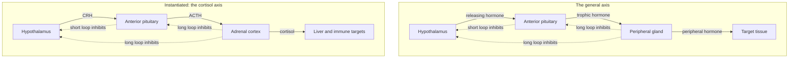

# Human Physiology · Lesson 3.4: Endocrine control — hormone action and the major axes

> ⏱ ~15 min · Module 3: Renal and endocrine regulation · Builds on: [3.3](03-03-fluid-electrolyte-acid-base.md), [1.1](01-01-homeostasis-feedback-control.md) · Unlocks: 4.1 (the gastrointestinal system), 4.3 (exercise physiology)

## Why this matters

The nervous system sends private letters; the endocrine system takes out billboards. Every cell in your body is bathed in every hormone you secrete, all the time — and yet aldosterone changes the behaviour of a few thousand kidney cells and nothing else. **Specificity in the endocrine system is not achieved by delivery. It is achieved by who is listening.** That single inversion explains most of what follows.

The second idea is that endocrine control is almost entirely [1.1](01-01-homeostasis-feedback-control.md)'s negative feedback, drawn at organ scale — which means you can *read* an axis you have never seen before. By the end of this lesson two numbers will tell you where a broken hormonal loop is broken, and the loop diagram alone will predict why a steroid prescription cannot be stopped abruptly. Neither of those is a fact to memorize; both fall out of the structure.

## The idea

**A hormone is a broadcast.** A gland releases a molecule into the blood, the blood distributes it everywhere within a circulation time, and cells that happen to carry the matching receptor respond. Nothing is addressed. The "wiring diagram" of the endocrine system is not anatomical — **it is a map of receptor expression**, and it can be rewritten by changing which genes a cell transcribes.

Compare the two signalling systems side by side, because the contrasts are all mechanical consequences of the delivery route:

| | Neural | Endocrine |
|---|---|---|
| Route | private wire, synapse to target | bloodstream, everywhere |
| Addressing | anatomical connection | **receptor expression on the target** |
| Latency | ~1 ms | seconds (adrenaline) to days (thyroid) |
| Duration | milliseconds | minutes to weeks |
| Reach | one target per terminal | every cell simultaneously |
| Graded by | firing rate | concentration and receptor number |
| Good for | fast, precise, local | slow, global, sustained |

**The two systems are not made of different stuff.** Norepinephrine released from a sympathetic terminal onto a blood vessel is a neurotransmitter; the same molecule released from the adrenal medulla into the blood is a hormone ([1.5](01-05-neuromuscular-autonomic-transmission.md)). The molecule is identical. **Only the delivery route differs, and that is the entire distinction.**

**Solubility is destiny.** There are three hormone classes, but the class label is not what matters — what matters is whether the molecule dissolves in water or in lipid, because everything else follows:

| | Peptide / protein | Steroid | Amine |
|---|---|---|---|
| Examples | insulin, ACTH, TSH, PTH, ADH | cortisol, aldosterone, estradiol | catecholamines; thyroid hormone |
| Soluble in | water | lipid | **split — see below** |
| Stored? | yes, in vesicles, pre-made | no; made on demand from cholesterol | catecholamines yes, thyroid yes (in colloid) |
| Receptor sits | on the cell surface | inside the cell, on DNA | surface (catecholamine), nuclear (thyroid) |
| Carrier protein in blood | not needed | required (CBG, SHBG, albumin) | TBG for thyroid; none for catecholamines |
| Response speed | seconds–minutes | hours | seconds / days |
| Half-life | minutes | ~1 hour | ~1 min / ~7 days |
| Orally active? | **no** — digested | **yes** (prednisone is a pill) | yes for thyroxine |

**The amine row is the one that proves the point.** Catecholamines and thyroid hormone are both made from tyrosine, in the same chemical family — and they behave like opposite classes. Epinephrine is water-soluble, so it needs a surface receptor, needs no carrier, acts in seconds and is gone in a minute. Thyroxine is lipid-soluble, so it rides a carrier protein, walks into the nucleus, changes transcription, and has a half-life of a week. **Do not memorize the class; ask whether it dissolves in water, and derive the rest.**

**Only free hormone counts.** A lipophilic hormone travels mostly stuck to a binding protein. The bound fraction cannot cross a capillary wall, cannot reach a receptor, cannot be cleared, and cannot feed back. It is a reservoir in rapid equilibrium with the free pool — which is exactly why lipophilic hormones have long half-lives, and exactly why **a total-hormone measurement is a measurement of binding protein as much as of signal**. That trap is worked below.

**Amplification is why the concentrations are absurd.** Plasma glucose sits near $5\times10^{-3}$ M; plasma cortisol near $4\times10^{-7}$ M; free thyroxine near $2\times10^{-11}$ M. A hormone can be a hundred million times rarer than a metabolite and still run the cell, because one bound receptor launches a cascade whose downstream product is counted in the millions ([molecular-cell-biology 2.2](../../molecular-cell-biology/lessons/02-02-second-messengers-amplification.md) owns that cascade; we use its gain and move on).

The consequence is structural, not just quantitative: **when the ligand is that scarce and that amplified, the receptor becomes the more useful dial.** Chronic high ligand triggers receptor internalization and degradation (down-regulation), chronic low ligand triggers up-regulation, and continuous stimulation triggers desensitization ([molecular-cell-biology 2.4](../../molecular-cell-biology/lessons/02-04-circuits-feedback-adaptation.md)). Sensitivity is a regulated variable, and it is often the one that has actually changed.

## The formal version

**Axis architecture.** The canonical endocrine controller is a three-storey cascade:

$$\text{hypothalamus} \xrightarrow{\ \text{releasing hormone}\ } \text{anterior pituitary} \xrightarrow{\ \text{trophic hormone}\ } \text{gland} \xrightarrow{\ \text{peripheral hormone}\ } \text{target}$$

*In words: a tiny hypothalamic signal is amplified twice on its way to the tissue, and the tissue's hormone reports back to both levels above it.*

The first arrow is unusual. Hypothalamic neurons do not project into the pituitary; they dump their releasing hormones into a capillary bed in the median eminence, which drains into **portal veins** that run down the stalk and break into a *second* capillary bed in the anterior pituitary. Blood therefore reaches the pituitary having passed through no other tissue.

**This is the whole lesson in one piece of plumbing.** Broadcast delivery would dilute a hypothalamic hormone into five litres of blood and deliver it to everything; the portal system delivers it undiluted, to one tissue, in nanogram quantities. **The portal system is how a broadcast medium fakes a private wire.**

Feedback then closes at two radii:

- **Long loop:** the peripheral hormone inhibits both the pituitary and the hypothalamus.
- **Short loop:** the trophic hormone inhibits the hypothalamus.

**The posterior pituitary is not a gland at all.** It is a terminal field. Magnocellular neurons in the supraoptic and paraventricular nuclei make ADH and oxytocin, transport them down their own axons through the stalk, and release them from nerve terminals straight into systemic capillaries. There is no releasing hormone, no trophic hormone, no portal system, no gland — just a neuron using the bloodstream as its output cable.

That architectural difference makes a prediction: cutting the pituitary stalk should cause **diabetes insipidus** (ADH never reaches its exit) while leaving the posterior lobe itself intact — and it does. ADH's action on the collecting duct is [3.2](03-02-tubular-transport-concentrating-urine.md)'s aquaporin story.

**Oxytocin is the standing exception to "endocrine control is negative feedback."** In labour, cervical stretch drives oxytocin release, oxytocin drives uterine contraction, contraction increases cervical stretch. That is [1.1](01-01-homeostasis-feedback-control.md)'s positive feedback: explosive, self-amplifying, and — critically — **terminated not by a brake but by removal of the stimulus** when the baby is delivered.

**The HPT (thyroid) axis.** TRH → TSH → thyroid follicle → T4 and a little T3. T4 is largely a prohormone; most circulating T3 is made by deiodination in peripheral tissues, including inside the pituitary thyrotroph itself, which is what the feedback actually senses.

The feedback is startlingly steep: **TSH varies roughly log-linearly with free T4**, so halving free T4 can raise TSH a hundredfold. *In words: the pituitary is a high-gain amplifier of thyroid error.* This is why TSH, a hormone that does nothing to your metabolism, is the single best test of your thyroid state — it is the loop's error signal, pre-amplified.

**The HPA (cortisol) axis.** CRH → ACTH → adrenal cortex → cortisol, with cortisol inhibiting both levels above. Two details pay off later:

- ACTH is cleaved from a precursor, POMC, which also yields melanocyte-stimulating fragments. So **a very high ACTH darkens the skin** — a visible readout of a trophic hormone.
- The adrenal cortex has three layers with three different bosses. The *zona fasciculata* (cortisol) answers to ACTH. The *zona glomerulosa* (aldosterone) answers to angiotensin II and plasma $\text{K}^+$ — RAAS, from [3.3](03-03-fluid-electrolyte-acid-base.md) — **not to ACTH.** Remember this; it does diagnostic work in the problems.

**Cortisol's diurnal rhythm is feedforward, not feedback.** Cortisol peaks in the hour after waking and troughs near midnight, driven by the suprachiasmatic clock. Nothing has gone wrong at 6 a.m. that cortisol is correcting — the set point itself is being moved on a schedule, in anticipation of the day's demands. That is exactly [1.1](01-01-homeostasis-feedback-control.md)'s feedforward: act before the disturbance, not after the error. The practical consequence is blunt: **a cortisol value without a time of day is uninterpretable.**

$$\boxed{\;\text{Low peripheral hormone} + \textbf{high}\ \text{trophic} \Rightarrow \text{the gland failed (primary)}\;}$$
$$\boxed{\;\text{Low peripheral hormone} + \textbf{low or normal}\ \text{trophic} \Rightarrow \text{the controller failed (central)}\;}$$

*In words: ask whether the controller is doing what a working controller would do. If the peripheral hormone is low and the trophic hormone is shouting, the loop is intact and the effector is broken. If the peripheral hormone is low and the trophic hormone is relaxed, the loop itself is broken.*

**This is a thermostat argument and it generalizes to any feedback system.** A cold room with the boiler call-signal on means the boiler is broken; a cold room with the call-signal off means the thermostat is. **A "normal" controller output in the presence of a large error is not reassuring — it is the abnormality.** Endocrinologists call this "inappropriately normal," which is the best two-word summary of feedback reasoning in medicine.

**Two loops that skip the pituitary entirely.**

*Glucose — a push–pull pair.* Pancreatic β cells sense glucose and release insulin; α cells, millimetres away in the same islet, release glucagon when glucose falls. There is no hypothalamus, no trophic hormone: **the sensor, controller and effector are the same cell, and the controlled variable is its own input.** Insulin drives glucose into muscle and fat, stores glycogen, and shuts off hepatic glucose output; glucagon does the reverse, switching the liver from glycolysis to gluconeogenesis ([biochemistry 3.5](../../biochemistry/lessons/03-05-gluconeogenesis-reciprocal-regulation.md)). The liver reads **the insulin-to-glucagon ratio**, not either level alone.

Why a *pair*? Because a single effector can only push one way — it can reduce its own output to zero and no further. **Two opposing effectors give bidirectional correction and let the resting operating point sit in the middle with both partly active**, so a correction in either direction is immediate. It is the same design as antagonist muscle pairs and as dual sympathetic/parasympathetic innervation ([1.5](01-05-neuromuscular-autonomic-transmission.md)).

*Calcium — three organs, one variable.* Parathyroid chief cells carry a calcium-sensing receptor, so again sensor and secretor are one cell. When ionized $\text{Ca}^{2+}$ falls, PTH rises and acts on three fronts:

| Organ | PTH's action | Effect on plasma $\text{Ca}^{2+}$ |
|---|---|---|
| Bone | drives osteoclastic resorption | releases Ca and phosphate |
| Kidney | increases distal $\text{Ca}^{2+}$ reabsorption; **decreases** proximal phosphate reabsorption | raises Ca, dumps phosphate |
| Gut | *indirect* — activates renal 1α-hydroxylase → calcitriol → gut Ca absorption | raises Ca over hours to days |

The kidney line is [3.2](03-02-tubular-transport-concentrating-urine.md)'s tubular handling doing endocrine work. Note the reciprocity: **PTH raises calcium and lowers phosphate on purpose.** Raising both would push their product past the solubility limit and precipitate calcium phosphate in soft tissue, so the phosphaturia is not a side effect — it is what makes the calcium rise usable.

The gut arm is a hormone whose job is to make another hormone: vitamin D from skin or diet → 25-hydroxylation in liver → **1α-hydroxylation in kidney, the regulated step** → calcitriol, a lipophilic hormone with a nuclear receptor that behaves in every way like a steroid.

Calcitonin, from thyroid C cells, lowers plasma calcium — and is honestly minor in adult humans; removing the thyroid does not cause hypercalcaemia. **The loop is deliberately asymmetric: evolution defended hard against low calcium and barely at all against high**, which is what you would expect for a variable whose acute danger is tetany.

**Hormones modify each other's effects**, three ways worth naming:

- **Permissive** — hormone A does little alone but is required for B to work. Cortisol upregulates vascular α₁ receptors, so **catecholamines cannot maintain blood pressure without it.**
- **Synergistic** — the combination exceeds the sum. Glucagon, epinephrine and cortisol together raise hepatic glucose output by more than their individual effects added.
- **Antagonistic** — insulin against glucagon, PTH against calcitonin.

**The lesson: a hormone's effect is not a property of the hormone. It is a property of the hormone plus the target's current state.**

## Picture

The general axis, and the same skeleton instantiated for cortisol. Dashed arrows are inhibition; note that the long loop reaches back two levels while the short loop reaches back one.

## Worked examples

**Example 1 (mechanical — amplification, and why the receptor is the dial).** A target cell carries $20{,}000$ receptors for a hormone with dissociation constant $K_d = 10^{-10}$ M. Free hormone in plasma is $0.1$ nmol/L. Each occupied receptor generates $10^{5}$ molecules of downstream product during the response. The cell's volume is $1000\ \mu\text{m}^3$.

(a) How many product molecules are made, and what intracellular concentration is that? (b) The cell down-regulates to $5000$ receptors. Can raising hormone concentration restore the response?

(a) Fractional occupancy — the standard binding result from [biophysics 2.3](../../biophysics/lessons/02-03-ligand-binding-occupancy.md):

$$f = \frac{[H]}{[H] + K_d} = \frac{10^{-10}}{10^{-10} + 10^{-10}} = 0.5$$

$$N_{\text{occupied}} = 0.5 \times 20{,}000 = 10{,}000 \ \text{receptors}$$

$$N_{\text{product}} = 10{,}000 \times 10^{5} = \mathbf{10^{9}\ \text{molecules}}$$

Convert to concentration. A cell of $1000\ \mu\text{m}^3$ has volume $10^{-12}$ L (since $1\ \mu\text{m}^3 = 10^{-15}$ L):

$$n = \frac{10^{9}}{6.022\times10^{23}} = 1.66\times10^{-15}\ \text{mol}, \qquad c = \frac{1.66\times10^{-15}}{10^{-12}} = 1.66\times10^{-3}\ \text{M} \approx \mathbf{1.7\ mM}$$

$$\text{amplification} = \frac{1.66\times10^{-3}}{10^{-10}} \approx \mathbf{1.7\times10^{7}\text{-fold in concentration}}$$

**A 0.1 nanomolar whisper outside becomes a millimolar shout inside** — the same order as glucose. That is why hormones can circulate at picomolar to nanomolar levels at all.

(b) Occupancy is unchanged at $0.5$, so occupied receptors fall to $2500$ and the response falls fourfold. To recover it we would need occupancy $4 \times 0.5 = 2.0$ — **and occupancy cannot exceed 1.** Even infinite hormone raises $f$ from $0.5$ to $1.0$, a factor of two:

$$\text{maximum recoverable} = \frac{f_{\max}}{f_{\text{current}}} = \frac{1.0}{0.5} = 2 < 4$$

**A fourfold loss of receptors cannot be overcome by any amount of hormone.** This is the structural reason receptor number is so often the regulated quantity, and a first-principles sketch of why hyperinsulinaemia only partly compensates for insulin resistance. (Real systems soften this with *spare* receptors — a maximal response at well under full occupancy — which buys tolerance for modest receptor loss and no more.)

**Example 2 (why you'd care — locating the lesion, and a prediction the loop makes on its own).** A woman has fatigue, weight loss, nausea and low blood pressure. Two numbers, drawn at 8 a.m.:

$$\text{cortisol} = 70\ \text{nmol/L} \ (\text{ref } 140\text{–}500), \qquad \text{ACTH} = 90\ \text{pmol/L}\ (\text{ref } 2\text{–}11)$$

**Step 1 — apply the rule.** Peripheral hormone low, trophic hormone very high. The pituitary has correctly detected the error and is screaming; the loop above is intact and the effector has failed. **Primary adrenal failure.** The pituitary is not the problem — it is the alarm bell working.

**Step 2 — what else the structure predicts.** Because the whole cortex is destroyed, the *zona glomerulosa* goes with it, so aldosterone is lost too. From [3.3](03-03-fluid-electrolyte-acid-base.md), no aldosterone means $\text{Na}^+$ wasting with $\text{K}^+$ and $\text{H}^+$ retention: hyponatraemia, **hyperkalaemia**, volume depletion, mild acidosis. And because ACTH comes from POMC, the huge ACTH darkens her skin. Every one of those is derivable; none needs memorizing.

**Step 3 — now change one thing.** Suppose instead she has been taking prednisone daily for eight months and stopped last week. Same symptoms, and cortisol again $70$ nmol/L — but ACTH is $2$ pmol/L, low-normal. The rule now points *upstream*, and the loop diagram explains exactly why:

1. Prednisone binds the same glucocorticoid receptor as cortisol. **The hypothalamus and pituitary cannot tell a drug from a hormone — they measure the signal, not its source.**
2. Seeing a large, unrelenting glucocorticoid signal, they shut down CRH and ACTH. Long-loop feedback did its job perfectly.
3. Without ACTH, the *zona fasciculata* atrophies over weeks. The adrenal is now not merely quiet but structurally unable to respond.
4. Stopping the drug removes the exogenous hormone in a day and leaves an axis that needs **weeks to months** to re-inflate. The gap is adrenal crisis.

**Hence the taper.** Withdrawing the drug slowly keeps the total glucocorticoid signal falling gently enough that CRH and ACTH recover and the cortex regrows before the drug is gone. **This is not a pharmacology fact bolted onto the physiology — it is a prediction of the loop diagram**, and the same argument tells you that anyone on long-term steroid needs *more* during illness or surgery, because their feedforward stress surge no longer exists.

And note the one discriminator between the two cases: here $\text{K}^+$ is **normal**, because aldosterone answers to RAAS and potassium, not ACTH ([3.3](03-03-fluid-electrolyte-acid-base.md)). Zonal anatomy shows up in an electrolyte panel.

## Watch out

- **You might think a hormone's target is where the hormone goes.** It goes everywhere within a minute. The target is defined entirely by which cells express the receptor — which is why the same aldosterone molecule that bathes your cornea only changes the behaviour of collecting-duct principal cells.
- **You might read a high total hormone as too much hormone.** Only free hormone is active, cleared, and sensed. Raise the binding protein — pregnancy, oral oestrogen — and total hormone rises permanently while free hormone and the trophic hormone come back to normal. Lower it — nephrotic syndrome, liver failure — and total falls with nothing wrong. **Measure free hormone, or measure the trophic hormone.**
- **You might think a low peripheral hormone means the gland failed.** It means the gland *or anything above it* failed. One extra number decides which, and a normal trophic hormone alongside a badly abnormal peripheral one is not reassuring — it is the finding.
- **You might think stopping a drug just removes the drug.** For a hormone, stopping it also exposes the atrophied axis that the drug suppressed. The loop cannot distinguish exogenous from endogenous.
- **You might interpret a single cortisol number.** Without the time of day it means nothing: the rhythm is feedforward, so the set point itself has moved.
- **You might assume more stimulation gives more response.** Continuous GnRH desensitizes and *shuts down* the gonadal axis, while pulsatile GnRH drives it — the information is carried in the pulse frequency, and a constant signal reads as no signal at all.

## One-liner

> A hormone is broadcast to every cell and heard only by cells that own the receptor, amplified so violently that the receptor rather than the ligand becomes the real dial — and because every axis is a negative-feedback loop, the trophic hormone tells you where the loop is broken, and the loop diagram itself tells you why an exogenous steroid can never be stopped abruptly.

## Problems

**P1 (🟢)** A woman on oral oestrogen has thyroid tests: total T4 $190$ nmol/L (ref $60$–$140$), free T4 $16$ pmol/L (ref $10$–$22$), TSH $1.9$ mIU/L (ref $0.4$–$4.0$). (a) Is she hyperthyroid? (b) Oestrogen raised her thyroxine-binding globulin. Trace the sequence of events from that moment to the numbers above, and say why the final state has a high total and a normal free level. (c) If you could order only one of these three tests, which, and why?

**P2 (🟡)** Three patients, same two tests (free T4 ref $10$–$22$ pmol/L; TSH ref $0.4$–$4.0$ mIU/L):

| | free T4 | TSH |
|---|---|---|
| A | 5 | 48 |
| B | 6 | 1.1 |
| C | 34 | less than 0.01 |

(a) Localize each lesion. (b) For B, name one other pituitary axis you would check immediately, and why. (c) For C, give one further observation that would distinguish a thyroid making too much hormone from a person swallowing too much thyroxine — and say which principle from this lesson predicts it.

**P3 (🔴, bridges to [3.3](03-03-fluid-electrolyte-acid-base.md) and to [4.3](04-03-exercise-integrative-physiology.md))** A man who took prednisone for six months stopped it abruptly ten days ago. He is weak, nauseated and hypotensive. Labs: 8 a.m. cortisol $60$ nmol/L (ref $140$–$500$), ACTH $2$ pmol/L (ref $2$–$11$), $\text{Na}^+$ $134$ mmol/L, $\text{K}^+$ $4.2$ mmol/L (normal), glucose $3.4$ mmol/L (low). (a) Localize the lesion from the two hormone numbers. (b) Explain from the loop diagram why six months of drug produced this, and why tapering prevents it. (c) His $\text{K}^+$ is normal, whereas in primary adrenal failure it would be high. Explain, naming the adrenal zone and its actual controller. (d) He plans to resume hard training next week. Name two reasons his axis will fail him under that load.

Solutions

**P1 (a)** **No — she is euthyroid.** Free T4 is mid-range and TSH is normal, and TSH is normal only when the pituitary judges the free signal adequate. The elevated total T4 is a binding-protein artefact.

**(b)** Step by step:

1. Oestrogen raises hepatic TBG production, so binding capacity rises.
2. Free T4 partitions onto the new binding sites, so **free T4 transiently falls**.
3. The pituitary senses the fall. Because TSH is log-linear in free T4, even a small dip raises TSH substantially.
4. TSH drives the thyroid to secrete more T4 than it is clearing.
5. Secretion continues until the free pool is restored to the set point — at which point TSH returns to normal and the drive stops.
6. All the extra hormone secreted along the way is now sitting on the extra TBG. **Total T4 is permanently elevated; free T4 and TSH are normal.**

The general statement: the loop regulates the *free* concentration, and total is whatever free-plus-bound happens to equal once the binding protein has been fixed. **Total hormone is a measurement of the reservoir, not of the signal.**

**(c)** **TSH.** It is the loop's error signal after the pituitary's own high-gain amplification, so it is more sensitive to a real thyroid disturbance than the hormone itself, and — as this case shows — it is immune to binding-protein artefacts because it responds only to free hormone. (The exception is precisely case B in P2: TSH is useless when the pituitary is the broken part, which is why "TSH alone" is a screening rule, not a law.)

**P2 (a)**

- **A: free T4 low ($5$), TSH very high ($48$) → primary hypothyroidism.** The thyroid has failed; the pituitary has detected it and is driving hard. Loop intact, effector broken.
- **B: free T4 low ($6$), TSH normal ($1.1$) → central hypothyroidism** (pituitary or hypothalamic). $1.1$ is only "normal" in the sense that it would be fine in someone with a normal free T4. Facing a free T4 of $6$, a working pituitary would be producing a TSH like patient A's. **This is the "inappropriately normal" reading, and it is the entire point of taking two numbers instead of one.**
- **C: free T4 high ($34$), TSH suppressed (less than $0.01$) → primary hyperthyroidism.** The thyroid is producing autonomously and the intact long loop has shut TSH off. Suppressed TSH confirms the feedback is working, which is what localizes the problem downstream of it.

**(b)** **The HPA axis — check ACTH and an 8 a.m. cortisol.** If the pituitary has failed for TSH, there is no reason it has spared the others, and of the pituitary's outputs **cortisol deficiency is the one that kills**. There is also an ordering trap: giving thyroxine to someone with unrecognized adrenal insufficiency raises metabolic rate and cortisol clearance and can precipitate a crisis, so **cortisol is replaced first, thyroxine second.**

**(c)** **Ask whether the gland itself is active** — a radioiodine uptake scan, or a serum thyroglobulin.

- Thyroid overproducing: uptake **high**, thyroglobulin **high** — the gland is working.
- Exogenous thyroxine: uptake **low**, thyroglobulin **low** — the hormone is arriving from a bottle.

**The principle is the one from Example 2: exogenous hormone is indistinguishable from endogenous to the feedback loop, so it suppresses the gland that makes it.** The suppressed gland is the fingerprint. It is the same physics as steroid-induced adrenal atrophy, read as a diagnostic test instead of a hazard.

**P3 (a)** Cortisol low, ACTH low-normal — **inappropriately normal for that degree of cortisol deficiency.** The controller is not responding to a large error, so the lesion is **central**: secondary adrenal insufficiency from suppression of the HPA axis by exogenous glucocorticoid.

**(b)** Four steps, all from the diagram:

1. Prednisone acts at the glucocorticoid receptor, so hypothalamus and pituitary register a persistently high glucocorticoid signal. **They measure signal, not source.**
2. Long-loop negative feedback suppresses CRH and then ACTH — correct behaviour by a working loop.
3. ACTH is trophic in the literal sense: without it the *zona fasciculata* atrophies over weeks. The adrenal becomes structurally incapable, not merely quiet.
4. Stopping the drug removes the glucocorticoid within roughly a day; rebuilding CRH drive, ACTH drive and adrenal mass takes weeks to months. **The mismatch of timescales is the crisis.**

**A taper works because it makes the exogenous signal fall on the axis's recovery timescale rather than the drug's clearance timescale**, so each small decrement leaves a small error that CRH and ACTH can answer, and the cortex regrows in step with the withdrawal. Nothing about this is specific to steroids: it is what any feedback loop requires after its actuator has been bypassed and allowed to waste.

**(c)** **The zona glomerulosa is intact and it was never ACTH-driven.** Aldosterone is controlled by angiotensin II and by plasma $\text{K}^+$ directly ([3.3](03-03-fluid-electrolyte-acid-base.md)); ACTH contributes almost nothing. Suppressing ACTH therefore starves the *fasciculata* of its trophic drive while leaving the *glomerulosa* fully supplied, so aldosterone continues, $\text{K}^+$ secretion in the collecting duct continues, and $\text{K}^+$ stays normal.

In primary adrenal failure the whole cortex is destroyed, so aldosterone goes too and $\text{K}^+$ rises. **One electrolyte separates "the gland is gone" from "the drive is gone," purely because the two zones have two different controllers.**

His mild hyponatraemia is not a contradiction: cortisol deficiency alone permits excess ADH release, so he retains water without wasting sodium — low $\text{Na}^+$ with a normal $\text{K}^+$, which is exactly the pattern shown.

**(d)** Two reasons, both about the missing surge rather than the missing baseline:

1. **No stress response.** Exercise, like illness, normally triggers a large CRH–ACTH–cortisol surge that mobilizes hepatic glucose output and maintains vascular tone. His axis cannot generate it, so a load that a normal axis absorbs becomes an acute failure — hypoglycaemia and hypotension mid-session ([4.3](04-03-exercise-integrative-physiology.md)).
2. **No permissiveness for catecholamines.** Cortisol upregulates vascular α₁ receptors, so without it the sympathetic outflow of exercise cannot produce normal vasoconstriction. He is catecholamine-resistant precisely when catecholamines are supposed to defend his blood pressure — the same mechanism that makes his resting pressure low, amplified by the demand.

His fasting glucose of $3.4$ is the resting version of point 1: cortisol maintains gluconeogenic capacity ([biochemistry 3.5](../../biochemistry/lessons/03-05-gluconeogenesis-reciprocal-regulation.md)), and without it the liver's overnight output falls short.

## Flashback

**From Lesson 1.1 (homeostasis and feedback control):** A homeostatic loop holds a variable at a set point of $100$ units. A disturbance is applied which, with the loop disabled, would drive the variable to $160$. With the loop intact it settles at $112$.

(a) Compute the loop gain $G$. (b) The controller is upgraded so $G$ triples. Where does the variable settle, and what fraction of the previous residual error remains? (c) The upgraded controller also carries a $20$-second delay between sensing and acting. State what raising the gain now does to the loop's behaviour, and name a physiological example.

Solution

**(a)** For a proportional negative-feedback loop, a disturbance producing open-loop error $E_0$ leaves residual error

$$E = \frac{E_0}{1+G}$$

Here $E_0 = 160 - 100 = 60$ and $E = 112 - 100 = 12$, so

$$1 + G = \frac{60}{12} = 5 \quad\Longrightarrow\quad \boxed{G = 4}$$

Check it the other way: the loop corrected $48$ units and left $12$, and $G$ is exactly the ratio of correction to residual error, $48/12 = 4$. ✓

**(b)** With $G = 12$:

$$E = \frac{60}{13} = 4.62 \quad\Longrightarrow\quad \text{settles at } \mathbf{104.6}$$

$$\frac{4.62}{12} = \mathbf{0.385} \ \text{— about 38 percent of the previous error remains.}$$

**Notice the diminishing return.** Tripling the gain removed only about $62$ percent of the remaining error, because $E \propto 1/(1+G)$ — and **no finite gain drives the error to zero.** Every proportional homeostatic loop runs with a permanent residual offset; the body tolerates a slightly wrong value forever rather than paying for infinite gain. (Making the error truly zero requires an integrating controller — the kidney's slow volume control is the physiological example, and [control-systems 2.3](../../control-systems/lessons/02-03-steady-state-error-system-type.md) is the general theory.)

**(c)** With a delay, the controller is always acting on information about a state the system has already left. Raising the gain makes each stale correction *larger*, so the loop **overshoots, then over-corrects the overshoot: ringing, then sustained oscillation, and past a critical gain, instability.** High gain and long delay are individually tolerable and jointly dangerous — the formal statement is the phase margin ([control-systems 3.4](../../control-systems/lessons/03-04-gain-and-phase-margins.md)).

**Physiological example: Cheyne–Stokes respiration.** In heart failure the circulation time from lung to chemoreceptor lengthens, so the ventilatory loop's delay grows while its chemoreceptor gain stays high; ventilation then cycles between hyperpnoea and apnoea rather than settling. Periodic breathing at altitude is the same instability driven from the gain side. **The parameter that broke the loop was not the sensor or the effector — it was the transport time between them.**

## Connections

- **Backward:** this whole lesson is [1.1](01-01-homeostasis-feedback-control.md) drawn at organ scale — sensor, controller, effector, negative feedback, feedforward and one genuine positive-feedback loop in parturition. ADH's target is [3.2](03-02-tubular-transport-concentrating-urine.md)'s aquaporins and PTH's kidney arm is its tubular transport; aldosterone, RAAS and the potassium logic behind the Addison discriminator are [3.3](03-03-fluid-electrolyte-acid-base.md). The adrenal medulla as a sympathetic ganglion that secretes into blood is [1.5](01-05-neuromuscular-autonomic-transmission.md).
- **Forward:** [4.1](04-01-gastrointestinal-system.md) meets the largest endocrine organ in the body — gastrin, secretin, CCK and the incretins, all peptide hormones obeying the rules derived here. [4.3](04-03-exercise-integrative-physiology.md) runs every axis at once: catecholamines and glucagon up, insulin down, cortisol and growth hormone surging, with the insulin-to-glucagon ratio setting hepatic fuel output.
- **Sideways:** the receptors and cascades this lesson deliberately black-boxed are [molecular-cell-biology 2.1](../../molecular-cell-biology/lessons/02-01-receptors-reading-outside-world.md) and [2.2](../../molecular-cell-biology/lessons/02-02-second-messengers-amplification.md), with desensitization and adaptation in [2.4](../../molecular-cell-biology/lessons/02-04-circuits-feedback-adaptation.md); the occupancy algebra is [biophysics 2.3](../../biophysics/lessons/02-03-ligand-binding-occupancy.md); insulin and glucagon's reciprocal control of the liver is [biochemistry 3.5](../../biochemistry/lessons/03-05-gluconeogenesis-reciprocal-regulation.md). The residual-error result and the gain-versus-delay tradeoff in the flashback are [control-systems 2.3](../../control-systems/lessons/02-03-steady-state-error-system-type.md) and [3.4](../../control-systems/lessons/03-04-gain-and-phase-margins.md) — the same mathematics that describes the baroreflex, a thermostat, and a PID loop.
