# Planetary Science · Lesson 3.1: Mass, density and the moment of inertia

> ⏱ ~15 min · Module 3: Measuring a planet · Builds on: [2.1](02-01-differentiation-interior-structure.md), [2.7](02-07-moon-earth-moon-system.md) · Unlocks: [3.2](03-02-gravity-topography-tidal-response.md), [4.1](04-01-atmospheric-structure.md), [6.1](06-01-exoplanet-detection.md)

## Why this matters

Module 2 used two numbers relentlessly — a planet's mean density and its moment-of-inertia factor — and never said where either comes from. This lesson supplies them, and the answer is more interesting than "we measured it", because **every one of these quantities is inferred from the motion of something else**. Nothing is weighed. Orbits are timed, spin axes are watched to wobble, and radio signals are Doppler-shifted, and out of that comes the interior of a world.

It is also where you learn what is *not* measured. The mass of a planet is not known to anything like the precision you would guess, for a reason that has nothing to do with planetary science.

## The idea

**Mass comes from watching something orbit.** Kepler's third law, in Newton's form, connects a satellite's period and orbital radius to the central mass. Time the orbit, measure its size, and $GM$ falls out. This works for any planet with a moon, and for one without you fly a spacecraft past and measure how much its trajectory bends — the Doppler shift of its radio carrier gives velocity changes to fractions of a millimetre per second.

**But notice what you actually get: $GM$, not $M$.** The dynamics only ever involves the product. To extract $M$ you must divide by the gravitational constant — and $G$ is by far the worst-known fundamental constant in physics, uncertain at about 2 parts in $10^{5}$. **Earth's $GM$ is known to two parts in $10^{9}$; Earth's mass is known to two parts in $10^{5}$, ten thousand times worse.** This is why planetary scientists quote $GM$ and treat masses as derived. It also means that any *ratio* of planetary masses is far better determined than either mass.

**Radius comes from geometry.** For a body with a sharp limb, angular size plus distance. Better: watch it pass in front of a star (a stellar occultation) and time the disappearance — this gives radii to sub-kilometre precision and is how we know the sizes of Kuiper belt objects. Better still: radar ranging, or a spacecraft altimeter.

**Mean density is then just $M/\frac43\pi R^3$** — and it is the single most informative number about a planet, because it separates rock from ice from gas immediately.

**The moment of inertia is harder, and it is measured through the planet's response to torques.** A rotating planet is not a sphere: it bulges at the equator. The Sun and moons pull on that bulge, which exerts a torque, which makes the spin axis precess like a top. **How fast it precesses depends on how the mass is distributed** — specifically on $(C-A)/C$, where $C$ and $A$ are the polar and equatorial moments. Separately, the bulge produces a measurable distortion of the planet's gravity field, quantified by the coefficient $J_2 = (C-A)/MR^2$. Divide one by the other and the $(C-A)$ cancels:

$$\frac{J_2}{(C-A)/C} = \frac{C}{MR^2}.$$

**Two measurements of quite different kinds — one from gravity, one from rotation — combine to give the number you want.**

**For a body whose precession has not been measured, there is a shortcut, and a trap.** If the planet is in hydrostatic equilibrium, its shape and its gravity field are both determined by its internal density distribution, so $J_2$ alone suffices via the **Radau–Darwin relation**. It works beautifully for Earth. It fails badly for Mars — and the failure is itself a discovery, because it says Mars's shape is *not* hydrostatic, which is Tharsis: a volcanic province so massive it distorts the whole planet's figure.

## The formal version

**Mass from an orbit.** For a satellite of negligible mass at semi-major axis $a$ with period $P$:

$$GM = \frac{4\pi^2a^3}{P^2}.$$

For a two-body system where the satellite is not negligible, this gives $G(M+m)$; separating the two requires observing the primary's own wobble about the barycentre — which is exactly the radial-velocity method of [6.1](06-01-exoplanet-detection.md).

**Mass from a flyby.** A spacecraft passing at impact parameter $b$ with speed $v_\infty$ is deflected through

$$\tan\frac{\theta}{2} = \frac{GM}{b\,v_\infty^2},$$

and the along-track velocity change is measured by Doppler tracking to $\sim0.1\ \mathrm{mm\,s^{-1}}$. **This is how the masses of asteroids, comets and moons without satellites are obtained.**

**The gravitational potential of a non-spherical body.** Expanded in Legendre polynomials, with $\theta$ the colatitude:

$$V(r,\theta) = -\frac{GM}{r}\left[1 - \sum_{n\ge2}J_n\left(\frac{R}{r}\right)^n P_n(\cos\theta)\right],$$

$$\boxed{\ J_2 = \frac{C-A}{MR^2}\ }$$

*In words: $J_2$ measures how much more mass sits around the equator than over the poles.* It is obtained by tracking a spacecraft's orbit around the planet and watching the orbit plane precess.

**Precession.** Solar (and satellite) torques on the equatorial bulge make the spin axis precess at a rate

$$\dot\psi \propto \frac{C-A}{C}\cos\varepsilon,$$

with $\varepsilon$ the obliquity. Earth's precession period is 25,772 yr; Mars's is 171,000 yr, measured by tracking landers and orbiters.

**Combining.**

$$\frac{C}{MR^2} = J_2\Big/\frac{C-A}{C}.$$

**The Radau–Darwin relation.** For a hydrostatic body with flattening $f = (R_{\text{eq}}-R_{\text{pol}})/R_{\text{eq}}$ and rotation parameter

$$q = \frac{\omega^2R^3}{GM},$$

$$\frac{C}{MR^2} \approx \frac{2}{3}\left[1 - \frac{2}{5}\sqrt{\frac{5q}{2f}-1}\right].$$

*In words: for a body shaped only by its own rotation and gravity, shape alone reveals the interior.*

| Body | $q$ | $f$ used | Radau–Darwin | Observed |
|---|---|---|---|---|
| Earth | $3.450\times10^{-3}$ | $1/298.3$ (observed) | 0.3323 | 0.3307 |
| Mars | $4.570\times10^{-3}$ | $1/169.8$ (observed) | **0.4081** | 0.3644 |
| Mars | $4.570\times10^{-3}$ | $1/197$ (hydrostatic) | 0.3684 | 0.3644 |

**Read those last two rows carefully.** Using Mars's *observed* shape gives 0.408 — an answer above 0.4, which is physically impossible for a centrally condensed body and would imply mass concentrated toward the *surface*. Stripping out the non-hydrostatic contribution of Tharsis and using the hydrostatic flattening gives 0.368, right to one percent. **Radau–Darwin does not fail on Mars; it correctly reports that Mars is not in hydrostatic equilibrium.**

**Precision summary.**

| Quantity | How | Typical precision |
|---|---|---|
| $GM$ | orbit timing, Doppler tracking | $10^{-9}$ (Earth), $10^{-6}$ (outer planets) |
| $M$ | $GM/G$ | $2\times10^{-5}$ — **limited by $G$** |
| $R$ | occultation, radar, altimetry | $10^{-4}$–$10^{-3}$ |
| $\bar\rho$ | $M/V$ | $10^{-3}$, dominated by $R^3$ |
| $J_2$ | orbiter tracking | $10^{-6}$ |
| $C/MR^2$ | $J_2$ + precession | $10^{-3}$ |

## Picture

```mermaid
flowchart TD
    OBS1["<b>Time a satellite&#8217;s orbit</b><br/>or Doppler-track a flyby"] --> GM["<b>GM</b><br/>known to 1 part in 10&#8313;"]
    GM -->|"divide by G"| M["<b>M</b><br/>known only to 2 parts in 10&#8309;<br/><i>G is the bottleneck, not the orbit</i>"]
    OBS2["<b>Stellar occultation</b><br/>radar, or altimetry"] --> R["<b>R</b>"]
    M --> RHO["<b>mean density &#961;</b><br/>rock? ice? gas?"]
    R --> RHO
    OBS3["<b>Track an orbiter&#8217;s<br/>orbit-plane precession</b>"] --> J2["<b>J&#8322; = (C&#8722;A)/MR&#178;</b>"]
    OBS4["<b>Watch the spin axis<br/>precess</b> (25,772 yr for Earth)"] --> CA["<b>(C&#8722;A)/C</b>"]
    J2 --> CMR["<b>C/MR&#178;</b><br/>divide: (C&#8722;A) cancels"]
    CA --> CMR
    R --> SHAPE["<b>flattening f</b>"]
    SHAPE -.->|"Radau&#8211;Darwin,<br/>ONLY if hydrostatic"| CMR
    RHO --> MODEL["<b>interior model</b><br/>core size and density"]
    CMR --> MODEL
    MODEL --> DEG["<b>still degenerate</b><br/>one number, two unknowns &#8212;<br/>needs k&#8322;, libration or seismology"]

    style M fill:#fdeee0,stroke:#c9871f
    style CMR fill:#e8f0fb,stroke:#1a6fb5
    style DEG fill:#fdeee0,stroke:#c9871f
```

Every box on the left is something in motion being timed. Nothing on this chart is a direct measurement of a planet.

## Worked examples

**Example 1 (mechanical — weighing Mars with a moon).** Phobos orbits Mars with $a = 9376$ km and $P = 7.653$ h. Find $GM$, $M$, and Mars's mean density given $R = 3390$ km.

$$P = 7.653\times3600 = 2.755\times10^{4}\ \mathrm{s}, \qquad a = 9.376\times10^{6}\ \mathrm{m}.$$

$$GM = \frac{4\pi^2a^3}{P^2} = \frac{4\pi^2\times(9.376\times10^{6})^3}{(2.755\times10^{4})^2} = \frac{39.478\times8.243\times10^{20}}{7.590\times10^{8}}.$$

$$GM = \frac{3.254\times10^{22}}{7.590\times10^{8}} = 4.287\times10^{13}\ \mathrm{m^3\,s^{-2}}.$$

(The accepted value is $4.283\times10^{13}$ — agreement to one part in $10^{3}$, limited by the rounded inputs.)

$$M = \frac{GM}{G} = \frac{4.287\times10^{13}}{6.674\times10^{-11}} = 6.42\times10^{23}\ \mathrm{kg}.$$

$$\bar\rho = \frac{M}{\frac43\pi R^3} = \frac{6.42\times10^{23}}{\frac43\pi(3.39\times10^{6})^3} = \frac{6.42\times10^{23}}{1.632\times10^{20}} = 3934\ \mathrm{kg\,m^{-3}}.$$

**Below Earth's 5513 but above pure silicate rock at ~3300**, so Mars has an iron core — but a proportionally smaller one than Earth's. That conclusion follows from timing a moon and knowing a radius, and nothing else.

**Example 2 (why you'd care — what Tharsis does to Mars's figure).** Run Radau–Darwin on Mars using its observed shape, then using its hydrostatic shape, and interpret.

*Observed flattening,* $f = 1/169.8 = 5.889\times10^{-3}$, with $q = 4.570\times10^{-3}$:

$$\frac{5q}{2f} = \frac{5\times4.570\times10^{-3}}{2\times5.889\times10^{-3}} = \frac{2.285\times10^{-2}}{1.178\times10^{-2}} = 1.940,$$
$$\sqrt{1.940-1} = \sqrt{0.940} = 0.9695,$$
$$\frac{C}{MR^2} = \frac23\left[1 - 0.4\times0.9695\right] = \frac23\left[1-0.3878\right] = \frac23(0.6122) = 0.4081.$$

**0.408 — greater than 0.4.** That is not a small error; it is an impossibility. A value above 0.4 means mass concentrated toward the *outside*, like a hollow shell, which no self-gravitating planet can be.

*Hydrostatic flattening,* $f = 1/197 = 5.076\times10^{-3}$:

$$\frac{5q}{2f} = \frac{2.285\times10^{-2}}{1.015\times10^{-2}} = 2.251, \qquad \sqrt{1.251} = 1.1185,$$
$$\frac{C}{MR^2} = \frac23\left[1-0.4\times1.1185\right] = \frac23(0.5526) = 0.3684.$$

Against the true 0.3644 — **agreement to 1 percent.**

*The interpretation.* Mars is measurably more oblate than rotation alone can account for. The excess is a *load*: the Tharsis rise, some $10^{21}$ kg of volcanic construct piled onto one hemisphere, supported by the strength of a thick lithosphere rather than floating in equilibrium. Its gravitational and topographic signature is large enough to dominate $J_2$ and to shift the whole planet's figure.

**So the "failure" of Radau–Darwin is the detection.** The disagreement between the hydrostatic prediction and the observed shape is a quantitative measurement of a non-hydrostatic load — and this is the general method: **the residual after removing the expected hydrostatic response is where every interesting geophysical signal lives.** [3.2](03-02-gravity-topography-tidal-response.md) makes a whole technique out of it.

## Watch out

- **You might think we measure planetary masses, but we measure $GM$**, and the conversion is limited by the worst-determined constant in physics. Never quote a planetary mass to more than five significant figures; do quote $GM$ to nine.
- **You might think Radau–Darwin gives $C/MR^2$ from shape, but it assumes hydrostatic equilibrium.** For Mars it returns an unphysical answer, and for any body with a large non-hydrostatic load — Tharsis, a large impact basin, a frozen-in tidal bulge — it must not be used with the observed flattening.
- **You might think $J_2$ alone determines the interior, but $J_2 = (C-A)/MR^2$ contains the difference of the moments, not the moment itself.** You need a second, independent measurement — precession, or a Radau-type assumption — to get from the difference to $C$.
- **You might think a mean density identifies a composition, but the compositions are degenerate.** A density of $3000\ \mathrm{kg\,m^{-3}}$ is consistent with pure silicate rock, with a mixture of ice and iron, and with rock plus a large porous void fraction. Density constrains; it does not identify.

## One-liner

> Nothing about a planet is weighed — orbits are timed, axes are watched to wobble, and everything else is inference.

## Problems

**P1 (🟢)** A moon orbits an asteroid at $a = 1180$ km with $P = 1.19$ d. (a) Compute $GM$. (b) Compute $M$. (c) The asteroid's mean radius is 88 km; compute its mean density and say what it suggests.

**P2 (🟡)** For a body with $J_2 = 1.083\times10^{-3}$ (Earth) and a measured $(C-A)/C = 3.274\times10^{-3}$: (a) Compute $C/MR^2$. (b) Compare with the accepted 0.3307. (c) If $(C-A)/C$ were measured 3 percent higher, what $C/MR^2$ would result, and what does that say about the precision needed?

**P3 (🔴, optional)** A newly found icy moon has $R = 800$ km, $GM = 2.3\times10^{11}\ \mathrm{m^3\,s^{-2}}$, and is synchronously rotating with period 3.0 days. (a) Compute its mean density. (b) Compute $q = \omega^2R^3/GM$ and comment on whether rotational flattening is measurable. (c) A tidally locked satellite is distorted by tides, not just rotation, and the leading tidal distortion is about $3\times$ the rotational one for a synchronous body. Explain why Radau–Darwin as stated cannot be applied here, and name the measurement that should be made instead.

Solutions

**P1** (a) $$P = 1.19\times86400 = 1.028\times10^{5}\ \mathrm{s}, \qquad a = 1.180\times10^{6}\ \mathrm{m}.$$
$$GM = \frac{4\pi^2a^3}{P^2} = \frac{39.478\times(1.180\times10^{6})^3}{(1.028\times10^{5})^2} = \frac{39.478\times1.643\times10^{18}}{1.057\times10^{10}}.$$
$$GM = \frac{6.487\times10^{19}}{1.057\times10^{10}} = 6.14\times10^{9}\ \mathrm{m^3\,s^{-2}}.$$

(b) $$M = \frac{6.14\times10^{9}}{6.674\times10^{-11}} = 9.20\times10^{19}\ \mathrm{kg}.$$

(c) $$\bar\rho = \frac{9.20\times10^{19}}{\frac43\pi(8.8\times10^{4})^3} = \frac{9.20\times10^{19}}{2.855\times10^{15}} = 3223\ \mathrm{kg\,m^{-3}}.$$

About $3200\ \mathrm{kg\,m^{-3}}$ — close to solid, unfractured silicate rock. That suggests a **coherent rocky body with little porosity**, unlike many asteroids of this size which are rubble piles with 20–40 percent void space and densities near 2000. (These are roughly Ida and Dactyl's numbers.)

**P2** (a) $$\frac{C}{MR^2} = \frac{J_2}{(C-A)/C} = \frac{1.083\times10^{-3}}{3.274\times10^{-3}} = 0.3308.$$

(b) The accepted value is 0.3307 — agreement to 3 parts in $10^{4}$.

(c) $(C-A)/C = 3.274\times10^{-3}\times1.03 = 3.372\times10^{-3}$:

$$\frac{C}{MR^2} = \frac{1.083\times10^{-3}}{3.372\times10^{-3}} = 0.3212.$$

A 3 percent error in the precession-derived quantity gives a 3 percent error in $C/MR^2$ — the relation is a simple ratio, so errors propagate one-for-one.

**And 3 percent is a lot here.** Recall from [2.1](02-01-differentiation-interior-structure.md) that the interesting range of $C/MR^2$ for rocky planets spans only 0.33 to 0.39, so a shift of 0.010 moves Earth's value a sixth of the way to Mars's. Two-layer core radii inferred from it would move by several percent. **The astronomy has to be good to a fraction of a percent for the geophysics to be worth anything**, which is why lunar laser ranging and multi-year orbiter tracking campaigns exist.

**P3** (a) $$M = \frac{2.3\times10^{11}}{6.674\times10^{-11}} = 3.446\times10^{21}\ \mathrm{kg},$$
$$\bar\rho = \frac{3.446\times10^{21}}{\frac43\pi(8.0\times10^{5})^3} = \frac{3.446\times10^{21}}{2.145\times10^{18}} = 1607\ \mathrm{kg\,m^{-3}}.$$

Between water ice (917) and rock (~3000), so roughly a half-and-half rock–ice mixture — typical of the mid-sized outer-planet satellites.

(b) $$\omega = \frac{2\pi}{3.0\times86400} = \frac{6.2832}{2.592\times10^{5}} = 2.424\times10^{-5}\ \mathrm{s^{-1}},$$
$$q = \frac{\omega^2R^3}{GM} = \frac{(2.424\times10^{-5})^2\times(8.0\times10^{5})^3}{2.3\times10^{11}} = \frac{5.876\times10^{-10}\times5.12\times10^{17}}{2.3\times10^{11}}.$$
$$q = \frac{3.009\times10^{8}}{2.3\times10^{11}} = 1.31\times10^{-3}.$$

Since $f$ is of order $q$, the flattening is around $10^{-3}$, i.e. an equatorial-polar radius difference of about $0.0013\times800 = 1$ km. **Marginally measurable** — it needs limb profiling or altimetry with good global coverage and sub-kilometre control, which in practice means a dedicated orbiter rather than a flyby.

(c) Radau–Darwin as stated assumes the *only* distortion is rotational, so that the flattening $f$ and the rotation parameter $q$ are the whole story. A synchronously rotating satellite is also distorted by the permanent tide raised by its primary, which is not small — for a synchronous body the tidal distortion along the planet-facing axis is about three times the rotational distortion. The body is therefore **triaxial**, with three distinct principal radii $a > b > c$, and a single scalar "flattening" does not describe it.

Using the observed polar flattening in the two-parameter relation would attribute the entire distortion to rotation and so badly overestimate the response for a given $q$ — returning, as with Mars in Example 2, a spuriously large $C/MR^2$.

**The right measurement is the forced physical libration**, or equivalently the degree-2 gravity coefficients $C_{22}$ and $J_2$ measured separately. For a synchronous body in hydrostatic equilibrium these satisfy $J_2 = \frac{10}{3}C_{22}$, which is itself a testable consistency check, and either coefficient can then be inverted for $C/MR^2$ using the triaxial generalization of Radau–Darwin. The libration amplitude has the further enormous advantage of being sensitive to whether the outer shell is decoupled from the interior by a liquid layer — which is [3.2](03-02-gravity-topography-tidal-response.md)'s ocean detector.

## Flashback

**From Lesson 2.7 (The Moon and the Earth–Moon system):** The Earth–Moon system has $L_{\text{tot}} = 3.48\times10^{34}\ \mathrm{kg\,m^2\,s^{-1}}$, $C_\oplus = 8.04\times10^{37}\ \mathrm{kg\,m^2}$, $M_m = 7.346\times10^{22}$ kg, $G(M_\oplus+M_m) = 4.035\times10^{14}\ \mathrm{m^3\,s^{-2}}$, $R_\oplus = 6.371\times10^{6}$ m. (a) Compute the Moon's orbital angular momentum at $a = 20\,R_\oplus$. (b) Find Earth's rotation period at that epoch. (c) Compare with the present 24 h and the 4.1 h all-spin limit, and say what the trend shows.

Solution

(a) $a = 20\times6.371\times10^{6} = 1.274\times10^{8}$ m.

$$L_{\text{orb}} = M_m\sqrt{G(M_\oplus+M_m)a} = 7.346\times10^{22}\sqrt{4.035\times10^{14}\times1.274\times10^{8}}.$$
$$= 7.346\times10^{22}\sqrt{5.141\times10^{22}} = 7.346\times10^{22}\times2.268\times10^{11} = 1.666\times10^{34}\ \mathrm{kg\,m^2\,s^{-1}}.$$

(b) $$L_{\text{spin}} = 3.48\times10^{34} - 1.666\times10^{34} = 1.814\times10^{34},$$
$$\omega = \frac{1.814\times10^{34}}{8.04\times10^{37}} = 2.256\times10^{-4}\ \mathrm{s^{-1}}, \qquad T = \frac{2\pi}{2.256\times10^{-4}} = 2.785\times10^{4}\ \mathrm{s} = 7.7\ \mathrm{h}.$$

(c) The sequence, from the earliest state outward:

| $a$ | Day length |
|---|---|
| $0$ (all spin) | 4.1 h |
| $4\,R_\oplus$ | 5.1 h |
| $10\,R_\oplus$ | 6.1 h |
| $20\,R_\oplus$ | 7.7 h |
| $60.3\,R_\oplus$ (today) | 24 h |

**Angular momentum is being steadily transferred from Earth's spin into the Moon's orbit**, and the total is conserved throughout — which is why every row can be computed from the same $L_{\text{tot}}$. Notice the transfer is heavily weighted toward the recent past: the Moon spent most of its journey from 4 to 20 Earth radii while the day lengthened by only 2.6 hours, and the remaining trip to 60 Earth radii cost 16 more. That is the $\dot a\propto a^{-11/2}$ law again — the orbit expands fast when close and slowly when far — and it is exactly why the naive backward extrapolation of today's recession rate collapses the whole history into 1.56 Gyr.

## Connections

- **Backward:** [2.1](02-01-differentiation-interior-structure.md) used $\bar\rho$ and $C/MR^2$ to build interior models and showed they leave a degeneracy; this lesson shows where those numbers come from and how precisely. [2.7](02-07-moon-earth-moon-system.md) is the case where lunar laser ranging supplies both.
- **Forward:** [3.2](03-02-gravity-topography-tidal-response.md) breaks the degeneracy with tidal response and libration; [4.1](04-01-atmospheric-structure.md) needs the surface gravity computed here; [6.1](06-01-exoplanet-detection.md) runs the same orbit-timing logic on stars instead of planets, with the same $GM$-not-$M$ caveat.
- **Sideways:** [`geophysics`](../../geophysics/syllabus.md) 2.1–2.2 owns Earth's figure, $J_2$ and gravity reductions in detail, and space geodesy generally; this lesson owns the comparative and remote versions. The Legendre expansion of the potential is [`mathematical-methods-physics`](../../mathematical-methods-physics/syllabus.md)'s, and the "fit the expected response, then study the residual" strategy is the same one that runs through all of signal analysis.
