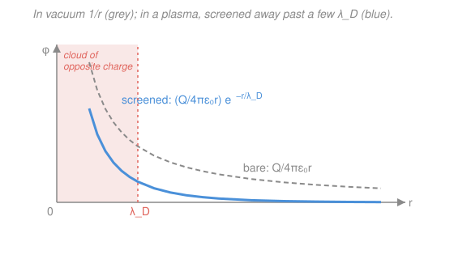

# Plasma Physics · Lesson 1.1: What is a plasma? Quasineutrality & Debye shielding

> ⏱ ~15 min · Module 1: Plasma basics & single-particle motion · Builds on: [`em-refresher` syllabus](../../em-refresher/syllabus.md), [`stat-mech` syllabus](../../stat-mech/syllabus.md) · Unlocks: [1.2 Plasma frequency & the plasma parameter](01-02-plasma-frequency-parameter.md)

## Why this matters

Over 99% of the visible universe — stars, the solar wind, interstellar gas, the ionosphere, every fusion device — is **plasma**, the fourth state of matter. Heat a gas until its atoms ionize and you get a soup of free electrons and ions. But a plasma is *not* just "a hot gas with charges in it." The charges carry their own electric and magnetic fields, and those fields reach across the whole medium and push the charges back. That feedback loop — matter and field steering each other — is what makes plasma its own subject, and it starts with the simplest question you can ask: how does a plasma respond when you disturb it? The answer, **Debye shielding**, is the first idea in the field and the one that tells you when an ionized gas has actually *become* a plasma.

## The idea

Drop a positive test charge into a plasma. In a vacuum its potential falls off slowly, as $1/r$ — its influence reaches forever. But a plasma has mobile electrons, and they *react*: a swarm of them drifts inward and clusters around the intruder, while positive ions are pushed slightly away. That cloud of net-negative charge wraps the test charge like a coat. Stand a little way off and you see the intruder *plus its coat* — and the two nearly cancel. The plasma has hidden the charge.

How far away is "a little way off"? There's a competition. Electrons *want* to pile onto the positive charge (electric attraction), but their own thermal jostling *wants* to scatter them back out (heat resists order). The distance at which these balance is the **Debye length** $\lambda_D$. Inside a few $\lambda_D$ you feel the bare charge; beyond it, the charge is screened away to nothing.

This is also the answer to a puzzle: why is a plasma **quasineutral** — why does it keep electrons and ions equal in number almost everywhere? Because any charge imbalance builds a potential, that potential summons a screening cloud, and the cloud erases the imbalance — all within $\lambda_D$. On scales much bigger than $\lambda_D$, the plasma has no choice but to look neutral. On scales smaller than $\lambda_D$, charge separation is perfectly allowed. So $\lambda_D$ is the ruler that separates "neutral" from "not."

## The formal version

Put a point test charge $Q$ (coulombs) at the origin of a plasma with uniform background density $n_0$ (particles per m³) and electron temperature $T$ (kelvin). We want the electrostatic potential $\varphi(r)$ (volts) it produces. Two ingredients:

**1. Poisson's equation** (from [`em-refresher`](../../em-refresher/syllabus.md)) relates potential to charge density $\rho$:

$$\nabla^2\varphi = -\frac{\rho}{\varepsilon_0},$$

with $\varepsilon_0 = 8.85\times10^{-12}\ \mathrm{F/m}$ the vacuum permittivity. *In words: curvature of the potential is set by the charge sitting there.*

**2. The Boltzmann response** (from [`stat-mech`](../../stat-mech/syllabus.md)). Electrons are light and fast, so they reach thermal equilibrium in the potential almost instantly. A gas in equilibrium at temperature $T$ follows the Boltzmann law: density is highest where potential energy is lowest. An electron (charge $-e$, with $e = 1.60\times10^{-19}\ \mathrm{C}$) has potential energy $-e\varphi$, so

$$n_e = n_0\,\exp\!\left(\frac{e\varphi}{k_B T}\right),\qquad k_B = 1.38\times10^{-23}\ \mathrm{J/K}.$$

*In words: electrons crowd toward the positive test charge (where $\varphi>0$), exponentially.* The heavy ions barely move on this timescale, so we hold them fixed at $n_i = n_0$.

Now assemble the charge density. Away from the test charge, $\rho = e(n_i - n_e) = e\,n_0\big(1 - e^{e\varphi/k_BT}\big)$. This is nonlinear — but far enough out the potential is weak, $e\varphi \ll k_B T$, so we **linearize** with $e^x \approx 1 + x$:

$$\rho \approx e\,n_0\left(1 - 1 - \frac{e\varphi}{k_BT}\right) = -\frac{n_0 e^2}{k_B T}\,\varphi.$$

Feed this into Poisson's equation:

$$\nabla^2\varphi = \frac{n_0 e^2}{\varepsilon_0 k_B T}\,\varphi \equiv \frac{\varphi}{\lambda_D^2},\qquad\boxed{\ \lambda_D = \sqrt{\dfrac{\varepsilon_0 k_B T}{n_0 e^2}}\ }$$

where the collection of constants defines the **Debye length** $\lambda_D$ (meters). *In words: the potential is its own second derivative, with a length scale $\lambda_D$ baked in — the signature of exponential decay.*

Solve it. With spherical symmetry, substitute $\varphi = u(r)/r$; then $\nabla^2\varphi = u''/r$, and $\nabla^2\varphi = \varphi/\lambda_D^2$ becomes simply

$$u'' = \frac{u}{\lambda_D^2}\quad\Longrightarrow\quad u = A\,e^{-r/\lambda_D}$$

(keeping the decaying solution — the potential must vanish far away, not blow up). So $\varphi = A e^{-r/\lambda_D}/r$. To fix $A$, note that as $r\to 0$ the screening cloud hasn't kicked in yet and the potential must match the bare Coulomb value $Q/4\pi\varepsilon_0 r$, giving $A = Q/4\pi\varepsilon_0$. The result:

$$\boxed{\ \varphi(r) = \frac{Q}{4\pi\varepsilon_0\, r}\,e^{-r/\lambda_D}\ }$$

*In words: the ordinary Coulomb potential, but multiplied by an exponential cutoff that switches it off past $\lambda_D$.* This is the **screened** (or **Yukawa**) potential. Beyond a few Debye lengths, $e^{-r/\lambda_D}$ has crushed the field to nothing: the test charge is invisible.

The **first criterion for an ionized gas to be a plasma** falls right out: the system must be much larger than the screening length,

$$\lambda_D \ll L,$$

so that shielding has room to work and the bulk is quasineutral. Where it *fails* — right up against a wall or probe — you get a thin non-neutral boundary layer a few $\lambda_D$ thick called the **plasma sheath** (the subject of a later lesson; it's why a wall in a plasma charges up).

## Picture

## Worked examples

**Example 1 (compute a Debye length).** A lab plasma has $n_0 = 10^{16}\ \mathrm{m^{-3}}$ and electron temperature $T = 2\ \mathrm{eV}$. Find $\lambda_D$.

Plasma temperatures are usually quoted as energies $k_B T$ in electron-volts: $1\ \mathrm{eV} = 1.60\times10^{-19}\ \mathrm{J}$, i.e. $k_B T = e\,T_{\rm eV}$. Substituting $k_B T = e T_{\rm eV}$ into the definition,

$$\lambda_D = \sqrt{\frac{\varepsilon_0 \,T_{\rm eV}}{n_0\, e}} = 7.43\times10^{3}\,\sqrt{\frac{T_{\rm eV}}{n_0}}\ \mathrm{m}$$

is a handy engineering form (with $T_{\rm eV}$ in volts, $n_0$ in m⁻³). Plugging in:

$$\lambda_D = 7.43\times10^{3}\sqrt{\frac{2}{10^{16}}} = 7.43\times10^{3}\times1.41\times10^{-8} \approx 1.0\times10^{-4}\ \mathrm{m} = 0.1\ \mathrm{mm}.$$

A tenth of a millimeter — far smaller than any lab chamber (tens of cm), so $\lambda_D\ll L$ holds with room to spare: this is a genuine plasma. Space plasmas span a huge range: the ionosphere sits near $\lambda_D\sim$ mm, the solar wind near $\lambda_D\sim 10$ m — yet each is dwarfed by its system size.

**Example 2 (how good is the screening?).** By what factor is the potential of a test charge reduced, relative to vacuum, at $r = 3\lambda_D$?

The screened potential is the bare one times $e^{-r/\lambda_D}$, so the ratio is exactly that exponential:

$$\frac{\varphi_{\rm screened}}{\varphi_{\rm bare}} = e^{-r/\lambda_D} = e^{-3} \approx 0.050.$$

At three Debye lengths the plasma has knocked the potential down to **5%** of its vacuum value; at $r=5\lambda_D$ it's $e^{-5}\approx 0.7\%$. This is why we can treat the bulk as neutral: charges simply cannot broadcast their presence past a few $\lambda_D$.

## Watch out

- **You might think quasineutral means exactly neutral.** It doesn't — it means neutral *on scales larger than* $\lambda_D$. Inside a Debye sphere, charge separation is real and essential; that local imbalance is precisely what does the shielding. "Quasineutral" and "supports internal electric fields" are both true at once, at different scales.
- **You might think screening is perfect right at the charge.** The exponential is $\approx 1$ for $r\ll\lambda_D$, so *close in* you feel the full bare Coulomb field; screening only bites near and beyond $\lambda_D$. That's exactly why the boundary condition $\varphi\to Q/4\pi\varepsilon_0 r$ as $r\to0$ is the right one.
- **You might use the wrong temperature.** We linearized with $e\varphi\ll k_BT$ and let only the electrons respond; the $T$ in $\lambda_D$ is then the electron temperature. If the ions are mobile and comparably warm they screen too, and the lengths combine as $\lambda_D^{-2}=\lambda_{D,e}^{-2}+\lambda_{D,i}^{-2}$ — a *smaller* net Debye length. Know which one your formula assumes.

## One-liner

> A plasma hides any charge behind a cloud of opposite charge over one Debye length $\lambda_D=\sqrt{\varepsilon_0 k_B T/n e^2}$, turning the bare $1/r$ Coulomb potential into the exponentially screened $ (Q/4\pi\varepsilon_0 r)\,e^{-r/\lambda_D}$ — so any blob much bigger than $\lambda_D$ is quasineutral.

## Problems

**P1 (🟢)** Earth's ionosphere has roughly $n_0 = 10^{12}\ \mathrm{m^{-3}}$ and $T = 1000\ \mathrm{K}$. Compute the Debye length. (Use $\lambda_D = 69\sqrt{T[\mathrm{K}]/n_0}\ \mathrm{m}$, the Kelvin form of the same formula, or work from the definition.)

**P2 (🟡)** In a plasma, at what distance $r$ (in units of $\lambda_D$) has a test charge's potential been screened down to 1% of its bare vacuum value? Compare with the value at $r=\lambda_D$.

**P3 (🔴, optional)** The solar wind near Earth has $n_0 \approx 5\times10^{6}\ \mathrm{m^{-3}}$ and $T\approx 10^{5}\ \mathrm{K}$. Find $\lambda_D$, then decide whether a parcel of solar wind the size of the Earth ($L\approx 1.3\times10^{7}\ \mathrm{m}$) can be treated as quasineutral. Roughly how many Debye lengths fit across it?

Solutions

**P1** Using the Kelvin engineering form $\lambda_D = 69\sqrt{T/n_0}$ m:

$$\lambda_D = 69\sqrt{\frac{1000}{10^{12}}} = 69\sqrt{10^{-9}} = 69\times3.16\times10^{-5} \approx 2.2\times10^{-3}\ \mathrm{m} \approx 2\ \mathrm{mm}.$$

*Check.* Cross-check with the eV form: $T = 1000\ \mathrm{K}$ is $k_BT/e = (1.38\times10^{-23}\times1000)/1.60\times10^{-19} = 0.086\ \mathrm{eV}$, so $\lambda_D = 7.43\times10^3\sqrt{0.086/10^{12}} = 7.43\times10^3\times2.94\times10^{-7} \approx 2.2\times10^{-3}\ \mathrm{m}$ ✓. Millimeter-scale, and the ionosphere is hundreds of km thick, so $\lambda_D\ll L$ — solidly a plasma.

**P2** The screening factor is $e^{-r/\lambda_D}$. Set it to $0.01$:

$$e^{-r/\lambda_D} = 0.01 \;\Longrightarrow\; \frac{r}{\lambda_D} = -\ln(0.01) = \ln(100) \approx 4.6.$$

So by $r\approx4.6\,\lambda_D$ the potential is down to 1%. For comparison, at $r=\lambda_D$ the factor is $e^{-1}\approx0.37$ — the potential is still 37% of bare at one Debye length, confirming that $\lambda_D$ marks the *onset* of screening, not its completion.

*Check.* $4.6 > 1$ as it must be (falling to 1% takes longer than the $e$-folding scale), and the numbers bracket Example 2's $r=3\lambda_D\to5\%$ nicely: $0.37$ (1λ), $0.05$ (3λ), $0.01$ (4.6λ). ✓

**P3** Debye length, Kelvin form:

$$\lambda_D = 69\sqrt{\frac{10^{5}}{5\times10^{6}}} = 69\sqrt{0.02} = 69\times0.141 \approx 9.8\ \mathrm{m} \approx 10\ \mathrm{m}.$$

Number of Debye lengths across an Earth-sized parcel:

$$\frac{L}{\lambda_D} = \frac{1.3\times10^{7}}{9.8} \approx 1.3\times10^{6}.$$

Over a million Debye lengths fit across it, so $\lambda_D\ll L$ overwhelmingly — the parcel is quasineutral, and treating the solar wind as a neutral conducting fluid (the MHD picture of Module 3) is fully justified.

*Check.* Units: $\sqrt{\mathrm{K}/\mathrm{m^{-3}}}$ scaled by the constant $69$ (which carries $\mathrm{m}\cdot\sqrt{\mathrm{m^{-3}/K}}$) returns meters ✓. Order of magnitude $\lambda_D\sim10$ m matches the value quoted for the solar wind in Example 1. ✓

## Connections

- **Backward:** the whole derivation is [`em-refresher`](../../em-refresher/syllabus.md)'s Poisson equation married to [`stat-mech`](../../stat-mech/syllabus.md)'s Boltzmann factor — the plasma's defining move is exactly this coupling of Maxwell's fields to a thermal distribution. Linearizing $e^x\approx1+x$ for a small disturbance is the same "small oscillation about equilibrium" trick used throughout physics.
- **Forward:** [1.2 Plasma frequency & the plasma parameter](01-02-plasma-frequency-parameter.md) asks the companion question — not *how far* the plasma screens but *how fast* — giving the plasma frequency $\omega_p$, with $\lambda_D$ and $\omega_p$ linked by the electron thermal speed. The count of particles inside a Debye sphere becomes the plasma parameter, the second criterion for plasma-hood.
- **Sideways:** the screened $e^{-r/\lambda_D}/r$ form is the **Yukawa potential** — mathematically identical to how a massive mediator gives a short-ranged force in [`nuclear-particle-physics`](../../nuclear-particle-physics/syllabus.md) (the pion's range plays the role of $\lambda_D$). Same equation $\nabla^2\varphi=\varphi/\lambda^2$, same exponential cutoff, different physics wearing it.
