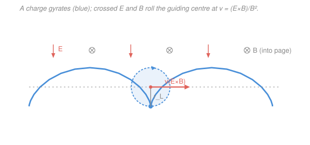

# Plasma Physics · Lesson 1.3: Gyration & the E×B drift

> ⏱ ~15 min · Module 1: Plasma basics & single-particle motion · Builds on: [1.2 Plasma frequency & the plasma parameter](01-02-plasma-frequency-parameter.md), [`em-refresher` syllabus](../../em-refresher/syllabus.md) · Unlocks: [1.4 Grad-B, curvature & polarization drifts](01-04-gradb-curvature-polarization-drifts.md)

## Why this matters

A magnetic field is how you hold a plasma still without touching it — the whole premise of fusion, and the reason the Earth's field traps the radiation belts. But $\mathbf{B}$ does no work and can't push a particle *along* itself, so "confinement" is subtler than a wall. The first thing to understand is what a single charge actually *does* in given fields: it spirals. Every collective phenomenon in the course — waves, instabilities, MHD equilibria — is built on top of this one orbit. And the punchline of this lesson, the $\mathbf{E}\times\mathbf{B}$ drift, is the rare plasma result that's both exact and astonishingly simple: it doesn't care about charge, mass, or energy, so the *entire* plasma slides together as one.

## The idea

Put a charge in a uniform magnetic field with no electric field. The magnetic force $q\mathbf{v}\times\mathbf{B}$ is always perpendicular to the velocity, so it never speeds the particle up or slows it down — it only bends it. A force that's always sideways to the motion and constant in strength does exactly one thing: it makes a circle. So the particle **gyrates** in the plane perpendicular to $\mathbf{B}$, while sliding freely along $\mathbf{B}$ (nothing resists that). The net path is a helix wrapped around a field line.

Two numbers describe the circle: how *fast* it goes around (the cyclotron frequency) and how *big* the circle is (the Larmor radius). Because the frequency is set by $|q|B/m$, light electrons whirl about 1836 times faster than protons in the same field.

Now the key trick of all orbit theory: **split the motion into a fast gyration plus the slow drift of the circle's centre.** That centre is the **guiding centre**. If nothing else acts, the guiding centre just sits there (or streams along $\mathbf{B}$). But add a steady electric field pointing *across* $\mathbf{B}$, and the circle starts to roll sideways — tracing a **cycloid**, like a dot on a rolling wheel. Why? On the half of the orbit where $\mathbf{E}$ speeds the particle up, it gains energy and its circle gets wider; on the other half $\mathbf{E}$ slows it and the circle tightens. Fat arc on one side, thin arc on the other — the loop doesn't close, it walks. That steady walk is the drift, and it's perpendicular to *both* $\mathbf{E}$ and $\mathbf{B}$.

## The formal version

**Gyration.** With $\mathbf{E}=0$ and uniform $\mathbf{B}$, Newton's law is $m\,d\mathbf{v}/dt = q\,\mathbf{v}\times\mathbf{B}$, where $m$ is mass (kg), $q$ the signed charge (C), and $\mathbf{v}$ the velocity (m/s). Split $\mathbf{v}$ into $v_\parallel$ (along $\mathbf{B}$) and $\mathbf{v}_\perp$ (across it). The parallel part feels no force: $v_\parallel = \text{const}$. The perpendicular part turns at the **cyclotron (gyro) frequency**

$$\Omega_c = \frac{|q|B}{m},$$

on a circle of radius the **Larmor (gyro) radius**

$$r_L = \frac{m v_\perp}{|q|B} = \frac{v_\perp}{\Omega_c}.$$

*In words: $\Omega_c$ is how many radians per second the particle sweeps around the field line; $r_L$ is the radius of that circle — bigger for a faster or heavier particle, smaller in a stronger field.* Since $\Omega_c \propto 1/m$, an electron gyrates $m_p/m_e \approx 1836$ times faster than a proton in the same $B$; since $r_L \propto m$ at fixed speed, its orbit is $1836$ times smaller. The sense of rotation is **opposite** for positive and negative charges — but in both cases the little current loop points its magnetic moment *against* $\mathbf{B}$ (a plasma is **diamagnetic**: it weakens the field it sits in).

**Guiding centre.** Write the true position as $\mathbf{r} = \mathbf{R}_{gc} + \boldsymbol{\rho}$, where $\boldsymbol{\rho}$ is the fast gyration (a vector of length $r_L$ spinning at $\Omega_c$) and $\mathbf{R}_{gc}$ is the slowly-moving **guiding centre**. *In words: stop watching the blur of the orbit and watch where its centre goes.* All of Module 1 is a hunt for how $\mathbf{R}_{gc}$ moves.

**The $\mathbf{E}\times\mathbf{B}$ drift — derived.** Now keep uniform $\mathbf{B}$ but add a uniform $\mathbf{E}\perp\mathbf{B}$:

$$m\frac{d\mathbf{v}}{dt} = q\,(\mathbf{E} + \mathbf{v}\times\mathbf{B}).$$

Guess that the motion is a gyration on top of a constant drift: $\mathbf{v} = \mathbf{v}_E + \mathbf{v}'$, with $\mathbf{v}_E$ constant. Substituting,

$$m\frac{d\mathbf{v}'}{dt} = q\big(\mathbf{E} + \mathbf{v}_E\times\mathbf{B}\big) + q\,\mathbf{v}'\times\mathbf{B}.$$

Choose $\mathbf{v}_E$ to **kill the constant bracket**, $\mathbf{E} + \mathbf{v}_E\times\mathbf{B} = 0$ — then $\mathbf{v}'$ obeys the plain gyration equation and just spins. To solve for $\mathbf{v}_E$, cross the bracket with $\mathbf{B}$ and use $(\mathbf{E}\times\mathbf{B})\times\mathbf{B} = -\mathbf{E}B^2$ (valid because $\mathbf{E}\perp\mathbf{B}$):

$$\boxed{\;\mathbf{v}_E = \frac{\mathbf{E}\times\mathbf{B}}{B^2}\;}\qquad \text{speed } v_E = \frac{E}{B}\ (\mathbf{E}\perp\mathbf{B}).$$

*In words: there is one special constant velocity — pointing along $\mathbf{E}\times\mathbf{B}$ — in whose frame the perpendicular electric field vanishes; ride along at that velocity and all you see is gyration.* Back in the lab, the guiding centre marches steadily at $\mathbf{v}_E$.

**The remarkable part:** $\mathbf{v}_E$ contains **no $q$, no $m$, no $v_\perp$**. Electrons and ions — light and heavy, positive and negative, fast and slow — all drift *together*, at the same velocity. So $\mathbf{E}\times\mathbf{B}$ moves no net charge relative to itself: **no current, no charge separation.** (Contrast every other drift in [1.4](01-04-gradb-curvature-polarization-drifts.md), which *do* depend on charge and therefore *do* drive currents.)

**Any perpendicular force.** Nothing in the derivation used that the force was electric. Replace $q\mathbf{E}$ by a general force $\mathbf{F}\perp\mathbf{B}$ and the same algebra gives

$$\mathbf{v}_F = \frac{\mathbf{F}\times\mathbf{B}}{qB^2}.$$

*In words: a sideways force drifts the guiding centre perpendicular to both the force and $\mathbf{B}$.* Now the $q$ is back — so a non-electric force (gravity, $\mathbf{F}=m\mathbf{g}$) drifts ions and electrons in **opposite** directions and drives a real current. That gravitational drift is the seed of Boss problem 1.

## Picture

The cusped cycloid drawn here is the clean case where the particle is released from rest: it accelerates along $\mathbf{E}$, curves back under $\mathbf{B}$, and stalls at each cusp. Give it a large initial $v_\perp$ instead and the loops fatten into near-circles that drift gently — but the guiding centre still slides at exactly $\mathbf{v}_E$.

## Worked examples

**Example 1 (gyration — electron vs. proton).** Take $B = 0.1\ \mathrm{T}$ and a perpendicular speed $v_\perp = 1\times10^6\ \mathrm{m/s}$ for each species. Constants: $e = 1.602\times10^{-19}\ \mathrm{C}$, $m_e = 9.11\times10^{-31}\ \mathrm{kg}$, $m_p = 1.673\times10^{-27}\ \mathrm{kg}$.

Electron:

$$\Omega_{ce} = \frac{eB}{m_e} = \frac{(1.602\times10^{-19})(0.1)}{9.11\times10^{-31}} \approx 1.76\times10^{10}\ \mathrm{rad/s}, \qquad r_{Le} = \frac{v_\perp}{\Omega_{ce}} = \frac{10^6}{1.76\times10^{10}} \approx 5.7\times10^{-5}\ \mathrm{m}\ (57\ \mu\mathrm{m}).$$

Proton (same $B$, same $v_\perp$):

$$\Omega_{cp} = \frac{eB}{m_p} \approx 9.58\times10^{6}\ \mathrm{rad/s}, \qquad r_{Lp} = \frac{10^6}{9.58\times10^{6}} \approx 0.10\ \mathrm{m}\ (10\ \mathrm{cm}).$$

The proton whirls $\Omega_{ce}/\Omega_{cp} = m_p/m_e \approx 1836$ times slower on an orbit $1836$ times larger. This is why magnetic confinement is really about confining ions — their orbits are the fat ones that touch the walls.

**Example 2 (the $\mathbf{E}\times\mathbf{B}$ drift).** Add a perpendicular field $E = 100\ \mathrm{V/m}$ to the same $B = 0.1\ \mathrm{T}$. The drift speed is

$$v_E = \frac{E}{B} = \frac{100}{0.1} = 1000\ \mathrm{m/s},$$

directed along $\mathbf{E}\times\mathbf{B}$ — in the figure's geometry ($\mathbf{E}$ down, $\mathbf{B}$ into the page) that's to the *right*. The same $1000\ \mathrm{m/s}$ applies to the electron *and* the proton of Example 1, identically: the whole plasma sheet slides right at 1 km/s while each species spins at its own rate on top. Notice $v_E = 1000\ \mathrm{m/s}$ is tiny next to the gyration speed $v_\perp = 10^6\ \mathrm{m/s}$, so the real orbit is a barely-tilted circle inching sideways — the drift is a *slow* correction to a *fast* spin, which is exactly why the guiding-centre split is useful.

## Watch out

- **You might think a stronger $\mathbf{E}$ makes ions drift faster than electrons.** It doesn't — $\mathbf{v}_E = (\mathbf{E}\times\mathbf{B})/B^2$ has no mass or charge in it, so *both species drift at the same velocity*, together. That's special to the electric force. A *mechanical* force like gravity, $\mathbf{v}_F=(\mathbf{F}\times\mathbf{B})/qB^2$, keeps the $q$ and does separate them.
- **You might think a bigger $B$ makes the $\mathbf{E}\times\mathbf{B}$ drift faster.** Backwards: $v_E = E/B$ *decreases* with $B$. Stronger field, tighter and slower-drifting orbit. (What $B$ speeds up is the gyration $\Omega_c$, not the drift.)
- **You might drop the sign of $q$ in $\Omega_c$ or $r_L$.** They carry $|q|$ — magnitudes are always positive. The sign of $q$ lives in the *sense of rotation* (clockwise vs. counter-clockwise about $\mathbf{B}$), not in how fast or how big the orbit is.

## One-liner

> A charge spirals at $\Omega_c=|q|B/m$ on a circle $r_L=v_\perp/\Omega_c$, and a crossed $\mathbf{E}$ rolls its guiding centre at $\mathbf{v}_E=(\mathbf{E}\times\mathbf{B})/B^2$ — the one drift that ignores charge, mass, and energy, so the whole plasma moves as one.

## Problems

**P1 (🟢)** In a field $B = 0.2\ \mathrm{T}$, both an electron and a proton have perpendicular speed $v_\perp = 5\times10^{5}\ \mathrm{m/s}$. Find $\Omega_c$ and $r_L$ for each, and state the ratio of their gyro-radii.

**P2 (🟡)** A uniform $\mathbf{E} = 50\ \mathrm{V/m}$ points in the $+x$ direction; $\mathbf{B} = 0.1\ \mathrm{T}$ points into the page ($-z$). Find the $\mathbf{E}\times\mathbf{B}$ drift velocity (magnitude *and* direction) of a proton, and of an electron. Are they the same? Why?

**P3 (🔴, optional)** A proton sits in a horizontal field $\mathbf{B} = 1\ \mathrm{T}$ (into the page, $-z$) with gravity $\mathbf{g} = 9.8\ \mathrm{m/s^2}$ pointing down ($-y$). Find the gravitational drift velocity $\mathbf{v}_g$ (magnitude and direction). Then argue what an electron does, and why the pair constitutes an electric current. (This is the mechanism of Boss problem 1.)

Solutions

**P1** Using $\Omega_c = eB/m$ and $r_L = v_\perp/\Omega_c$ with $e=1.602\times10^{-19}\,\mathrm{C}$.

Electron: $\Omega_{ce} = \dfrac{(1.602\times10^{-19})(0.2)}{9.11\times10^{-31}} \approx 3.52\times10^{10}\ \mathrm{rad/s}$, so $r_{Le} = \dfrac{5\times10^5}{3.52\times10^{10}} \approx 1.4\times10^{-5}\ \mathrm{m}\ (14\ \mu\mathrm{m})$.

Proton: $\Omega_{cp} = \dfrac{(1.602\times10^{-19})(0.2)}{1.673\times10^{-27}} \approx 1.92\times10^{7}\ \mathrm{rad/s}$, so $r_{Lp} = \dfrac{5\times10^5}{1.92\times10^{7}} \approx 2.6\times10^{-2}\ \mathrm{m}\ (2.6\ \mathrm{cm})$.

Ratio $r_{Lp}/r_{Le} = m_p/m_e \approx 1836$.

*Check.* Units: $[\Omega_c] = \mathrm{C\cdot T/kg} = \mathrm{C\cdot(kg/(C\,s))/kg} = \mathrm{s^{-1}}$ ✓; $[r_L] = (\mathrm{m/s})/\mathrm{s^{-1}} = \mathrm{m}$ ✓. The radius ratio equals the mass ratio, as it must at fixed $v_\perp$. ✓

**P2** $\mathbf{v}_E = (\mathbf{E}\times\mathbf{B})/B^2$. With $\mathbf{E} = 50\,\hat{\mathbf{x}}$ and $\mathbf{B} = -0.1\,\hat{\mathbf{z}}$:

$$\mathbf{E}\times\mathbf{B} = (50\,\hat{\mathbf{x}})\times(-0.1\,\hat{\mathbf{z}}) = -5\,(\hat{\mathbf{x}}\times\hat{\mathbf{z}}) = -5(-\hat{\mathbf{y}}) = 5\,\hat{\mathbf{y}},\qquad \mathbf{v}_E = \frac{5\,\hat{\mathbf{y}}}{(0.1)^2} = 500\,\hat{\mathbf{y}}\ \mathrm{m/s}.$$

So $500\ \mathrm{m/s}$ in the $+y$ direction — **identical** for the proton and the electron. They're the same because $\mathbf{v}_E$ contains neither $q$ nor $m$: the drift is the velocity of the frame in which the perpendicular $\mathbf{E}$ disappears, and that frame is the same for every particle.

*Check.* Units: $\mathrm{(V/m)\cdot T / T^2} = \mathrm{(V/m)/T} = \mathrm{(V/m)/(V\,s/m^2)} = \mathrm{m/s}$ ✓. Magnitude $E/B = 50/0.1 = 500$ ✓, and $\mathbf{v}_E\perp\mathbf{E}$, $\mathbf{v}_E\perp\mathbf{B}$ ✓.

**P3** $\mathbf{v}_g = \dfrac{m}{q}\dfrac{\mathbf{g}\times\mathbf{B}}{B^2}$. With $\mathbf{g} = -9.8\,\hat{\mathbf{y}}$ and $\mathbf{B} = -1\,\hat{\mathbf{z}}$: $\ \mathbf{g}\times\mathbf{B} = (-9.8\,\hat{\mathbf{y}})\times(-1\,\hat{\mathbf{z}}) = 9.8\,(\hat{\mathbf{y}}\times\hat{\mathbf{z}}) = 9.8\,\hat{\mathbf{x}}$.

Proton ($q = +e$, $m=m_p$): $\ \mathbf{v}_g = \dfrac{m_p}{e}\,\dfrac{9.8\,\hat{\mathbf{x}}}{1^2} = \dfrac{(1.673\times10^{-27})(9.8)}{1.602\times10^{-19}}\,\hat{\mathbf{x}} \approx 1.0\times10^{-7}\,\hat{\mathbf{x}}\ \mathrm{m/s}$ — about $0.1\ \mu\mathrm{m/s}$ in $+x$.

Electron ($q = -e$, $m=m_e$): the sign of $q$ flips the direction, so the electron drifts in $-x$ (and $m_e/m_p\approx1/1836$ as fast). Ions go one way, electrons the other: opposite motion of opposite charges is a **current** in the $+x$ direction, $\mathbf{J} = n e(\mathbf{v}_{g,\mathrm{ion}} - \mathbf{v}_{g,\mathrm{el}})$, dominated by the heavier ions. A perpendicular gravity (or any non-electric force) charges the plasma up — the hook for Boss problem 1.

*Check.* $v_g = m_p g/(eB)$ has units $\mathrm{kg\cdot(m/s^2)/(C\cdot T)} = \mathrm{m/s}$ ✓, and the answer is minuscule because gravity is a laughably weak force on a proton compared to magnetic forces — as it should be. ✓

## Flashback

**From Lesson 1.2 (Plasma frequency & the plasma parameter):** An unmagnetized electron plasma has density $n = 1\times10^{18}\ \mathrm{m^{-3}}$. Find its plasma frequency $\omega_{pe}$ and the corresponding frequency in Hz. (Use $\varepsilon_0 = 8.854\times10^{-12}\ \mathrm{F/m}$.)

Solution

$$\omega_{pe} = \sqrt{\frac{n e^2}{\varepsilon_0 m_e}} = \sqrt{\frac{(10^{18})(1.602\times10^{-19})^2}{(8.854\times10^{-12})(9.11\times10^{-31})}} = \sqrt{\frac{2.57\times10^{-20}}{8.07\times10^{-42}}} \approx \sqrt{3.18\times10^{21}} \approx 5.6\times10^{10}\ \mathrm{rad/s}.$$

In Hz: $f_{pe} = \omega_{pe}/2\pi \approx 9.0\times10^{9}\ \mathrm{Hz} = 9\ \mathrm{GHz}$.

*Check.* The handy rule of thumb $f_{pe}[\mathrm{Hz}] \approx 8.98\sqrt{n[\mathrm{m^{-3}}]}$ gives $8.98\sqrt{10^{18}} = 8.98\times10^{9}\ \mathrm{Hz}$ ✓. Note the plasma frequency depends on $n$ but not on $B$ — it is a *collective* electrostatic oscillation, a different animal from the *single-particle* cyclotron frequency $\Omega_c$ of this lesson. ✓

## Connections

- **Backward:** the gyration rests entirely on the Lorentz force $q(\mathbf{E}+\mathbf{v}\times\mathbf{B})$ from the [`em-refresher` syllabus](../../em-refresher/syllabus.md) — here $\mathbf{v}\times\mathbf{B}$ curving the path is the same crossed-field geometry as a velocity selector, now run forever. The guiding-centre split will keep the fast/slow decomposition going for the rest of the module.
- **Forward:** [1.4 Grad-B, curvature & polarization drifts](01-04-gradb-curvature-polarization-drifts.md) lets $\mathbf{B}$ vary in space and time; the general formula $\mathbf{v}_F=(\mathbf{F}\times\mathbf{B})/qB^2$ derived here is the template for all of them — and because those keep the $q$, they drive the currents and charge separations $\mathbf{E}\times\mathbf{B}$ refuses to. [1.5](01-05-adiabatic-invariants-mirrors.md) then adds the magnetic moment to trap particles.
- **Sideways:** the trick "boost to the frame where the perpendicular $\mathbf{E}$ vanishes" is the low-speed shadow of the relativistic field transformation from [`em-refresher`](../../em-refresher/syllabus.md) — $\mathbf{E}$ and $\mathbf{B}$ mix under a change of frame, and $\mathbf{v}_E$ is exactly the boost that rotates a perpendicular $\mathbf{E}$ away.
