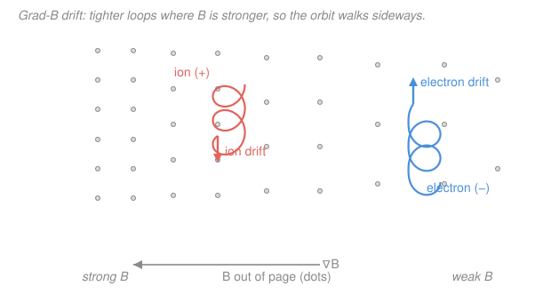

# Plasma Physics · Lesson 1.4: Grad-B, curvature & polarization drifts

> ⏱ ~15 min · Module 1: Plasma basics & single-particle motion · Builds on: [1.3 Gyration & the E×B drift](01-03-gyration-exb-drift.md) · Unlocks: [1.5 Adiabatic invariants & magnetic mirrors](01-05-adiabatic-invariants-mirrors.md)

## Why this matters

Real magnetic fields are never the perfect uniform slab of Lesson 1.3 — they get stronger toward a magnet, they bend around a torus, they wobble in time. Each imperfection nudges a gyrating particle's guiding center a little further sideways every orbit, and those tiny nudges are what actually decide whether a plasma stays put. Two of the drifts we derive here depend on the *sign of the charge*, so ions and electrons walk in **opposite** directions — they separate charge and drive real currents. That single fact is why a plain doughnut-shaped magnetic bottle throws its plasma against the wall in microseconds, and why every tokamak on Earth has a built-in twist to fix it ([5.2](../../plasma-physics/syllabus.md)). Master these four drifts and you can predict where any particle goes in almost any field.

## The idea

Lesson 1.3 gave us the one master rule: any slowly varying force $\mathbf{F}$ pointing across $\mathbf{B}$ makes the guiding center slide sideways at

$$\mathbf{v}_d = \frac{\mathbf{F}\times\mathbf{B}}{qB^2}.$$

*In words: push a gyrating particle sideways and it doesn't accelerate that way — it drifts at right angles to both the push and the field.* Everything in this lesson is just finding the right $\mathbf{F}$ for each kind of field imperfection.

- **Field stronger on one side (grad-B).** The Larmor radius $r_L$ is bigger where $B$ is weaker. So each loop is fat on the weak side and tight on the strong side — it can't close, and the guiding center marches along the field's "contour lines."
- **Field lines curved (curvature).** A particle streaming along a bent field line is like a bead on a curved wire: it feels a centrifugal fling outward. That outward force is the $\mathbf{F}$ that drives a drift.
- **Field (or rather the $\mathbf{E}\times\mathbf{B}$ velocity) changing in time (polarization).** If the $\mathbf{E}\times\mathbf{B}$ drift speeds up, the particle's *inertia* resists — and inertia acting like a lag force produces its own small drift.

## The formal version

Throughout, $q$ is the **signed** charge (negative for electrons), $m$ the mass, $B=|\mathbf{B}|$, $v_\perp$ and $v_\parallel$ the speeds across and along $\mathbf{B}$, $r_L = mv_\perp/|q|B$ the Larmor radius, and $\mu \equiv \tfrac12 m v_\perp^2 / B$ the **magnetic moment** (we'll live inside $\mu$ next lesson).

**Grad-B drift.** A gyrating particle acts like a little current loop, and a current loop of moment $\mu$ in a field gradient feels a force $\mathbf{F} = -\mu\,\nabla B$ (pulled toward weak field). Feed that into the master rule:

$$\boxed{\;\mathbf{v}_{\nabla B} = \frac{m v_\perp^2}{2qB^3}\,(\mathbf{B}\times\nabla B) = \pm\frac{v_\perp r_L}{2}\,\frac{\mathbf{B}\times\nabla B}{B^2}\;}$$

*In words: the guiding center slides along the direction perpendicular to both $\mathbf{B}$ and the gradient, at a speed set by how fast $B$ changes across one orbit.* The $\pm$ is the sign of $q$ — **ions and electrons drift opposite ways.**

**Curvature drift.** Let $\mathbf{R}_c$ be the vector from the local center of curvature out to the particle, so $|\mathbf{R}_c| = R_c$ is the radius of curvature. Streaming at $v_\parallel$ along the bent line, the particle feels a centrifugal force $\mathbf{F} = m v_\parallel^2\,\mathbf{R}_c/R_c^2$ pointing outward. Master rule again:

$$\boxed{\;\mathbf{v}_{R} = \frac{m v_\parallel^2}{qB^2}\,\frac{\mathbf{R}_c\times\mathbf{B}}{R_c^2}\;}$$

*In words: a particle racing along a curved field line gets flung outward, and that outward fling drifts it sideways.* Again $\propto 1/q$ — **charge-dependent.** (In a current-free "vacuum" field the two combine into $\mathbf{v}_{R+\nabla B} = \frac{m}{qB^2}\big(v_\parallel^2 + \tfrac12 v_\perp^2\big)\frac{\mathbf{R}_c\times\mathbf{B}}{R_c^2}$, since there $\nabla B/B = -\mathbf{R}_c/R_c^2$.)

**Polarization drift.** If $\mathbf{E}_\perp$ changes in time, the $\mathbf{E}\times\mathbf{B}$ drift $\mathbf{v}_E = \mathbf{E}\times\mathbf{B}/B^2$ changes too, and giving the particle that acceleration takes a force $m\,d\mathbf{v}_E/dt$. Threading it through the algebra leaves a residual drift along $\dot{\mathbf{E}}$:

$$\boxed{\;\mathbf{v}_{p} = \frac{m}{qB^2}\,\frac{d\mathbf{E}_\perp}{dt}\;}$$

*In words: when the electric field ramps, a particle's inertia makes it lag, and the lag is a drift pointing along the change in $\mathbf{E}$.* Once more $\propto 1/q$ — **charge-dependent**, and because it's opposite for the two species it carries a **polarization current**, the workhorse of low-frequency plasma waves ([4.x](../../plasma-physics/syllabus.md)).

**Everything at a glance.**

| Drift | Formula | Charge-dep.? | Drives a current? | What it does |
|---|---|:--:|:--:|---|
| $\mathbf{E}\times\mathbf{B}$ | $\dfrac{\mathbf{E}\times\mathbf{B}}{B^2}$ | **no** | no | bulk convection — whole plasma flows as one |
| Grad-B | $\dfrac{m v_\perp^2}{2q}\dfrac{\mathbf{B}\times\nabla B}{B^3}$ | **yes** | **yes** | separates charge across a $B$ gradient |
| Curvature | $\dfrac{m v_\parallel^2}{q}\dfrac{\mathbf{R}_c\times\mathbf{B}}{R_c^2 B^2}$ | **yes** | **yes** | throws plasma outward in curved fields |
| Polarization | $\dfrac{m}{qB^2}\dfrac{d\mathbf{E}_\perp}{dt}$ | **yes** | **yes** | responds to time-varying $\mathbf{E}$; low-freq waves |
| *General* | $\dfrac{\mathbf{F}\times\mathbf{B}}{qB^2}$ | depends on $\mathbf{F}$ | — | any slowly varying perpendicular force |

The single most important row-reading: **$\mathbf{E}\times\mathbf{B}$ is the odd one out.** It has no $q$ and no $m$, so every particle drifts identically — the plasma just slides bodily, no charge separation, no current. The other three all carry a $1/q$: ions and electrons split apart, and that split *is* a current.

## Picture

## Worked examples

**Example 1 (grad-B — magnitude and direction).** A proton ($m = 1.67\times10^{-27}$ kg, $q = +1.6\times10^{-19}$ C) has $v_\perp = 3\times10^5$ m/s. The field points out of the page, $\mathbf{B} = 0.4\,\hat{\mathbf{z}}$ T, and its magnitude increases in the $+\hat{\mathbf{x}}$ direction with $|\nabla B| = 2$ T/m. Find the grad-B drift.

Magnitude (using $|\mathbf{B}\times\nabla B| = B\,|\nabla B|$ since they're perpendicular):

$$v_{\nabla B} = \frac{m v_\perp^2\,|\nabla B|}{2qB^2} = \frac{(1.67\times10^{-27})(3\times10^5)^2(2)}{2(1.6\times10^{-19})(0.4)^2} = \frac{3.01\times10^{-16}}{5.12\times10^{-20}} \approx 5.9\times10^3\ \mathrm{m/s}.$$

Direction: $\nabla B \parallel +\hat{\mathbf{x}}$, so $\mathbf{B}\times\nabla B \propto \hat{\mathbf{z}}\times\hat{\mathbf{x}} = \hat{\mathbf{y}}$. With $q>0$ the proton drifts in $+\hat{\mathbf{y}}$ at about 5.9 km/s. An electron here would drift in $-\hat{\mathbf{y}}$.

*Check.* Via the second form: $r_L = mv_\perp/qB = 7.8$ mm, so $v_{\nabla B} = \tfrac12 v_\perp r_L\,|\nabla B|/B = \tfrac12(3\times10^5)(7.8\times10^{-3})(5) \approx 5.9\times10^3$ m/s ✓. It's a whisker of the thermal speed (drifts are always tiny compared to $v_\perp$ when the field varies slowly over an orbit) — as it must be for the guiding-center picture to hold.

**Example 2 (curvature — and why a torus leaks).** In a curved field a proton streams at $v_\parallel = 2\times10^6$ m/s along a line with radius of curvature $R_c = 1$ m, in $B = 0.5$ T. The curvature drift magnitude is

$$v_R = \frac{m v_\parallel^2}{q B R_c} = \frac{(1.67\times10^{-27})(2\times10^6)^2}{(1.6\times10^{-19})(0.5)(1)} = \frac{6.68\times10^{-15}}{8.0\times10^{-20}} \approx 8.3\times10^4\ \mathrm{m/s}.$$

Now the payoff. In a simple toroidal ("doughnut") field, the field lines curve *and* $B$ is stronger on the inside of the doughnut — so curvature and grad-B drifts both point the same way, say $+\hat{\mathbf{z}}$ (vertically) for ions and $-\hat{\mathbf{z}}$ for electrons. Ions pile up at the top, electrons at the bottom: a **vertical electric field** $\mathbf{E}$ grows. But now $\mathbf{E}\times\mathbf{B}$ points radially *outward* — and *that* drift, being charge-independent, sweeps the **entire plasma** into the outer wall. A plain torus can't confine. The cure is to twist the field lines (add a poloidal field) so a particle spends half its time "up" and half "down," shorting out the charge separation — the defining trick of the [tokamak (5.2)](../../plasma-physics/syllabus.md).

*Check.* Units: $\dfrac{\mathrm{kg}\cdot(\mathrm{m/s})^2}{\mathrm{C}\cdot\mathrm{T}\cdot\mathrm{m}} = \dfrac{\mathrm{J}}{\mathrm{C}\cdot\mathrm{T}\cdot\mathrm{m}}$, and $\mathrm{C\cdot T\cdot m} = \mathrm{kg\cdot m/s}$, so the ratio is $\mathrm{J/(kg\cdot m/s)} = \mathrm{m/s}$ ✓.

## Watch out

- **You might think all drifts separate charge.** Only the ones with a bare $1/q$ do (grad-B, curvature, polarization). $\mathbf{E}\times\mathbf{B}$ has the charge cancel — it moves both species together, so it's bulk flow, *not* a current. The presence or absence of a $q$ in the formula is the whole story.
- **You might use $v_\perp$ in the curvature drift.** No — curvature is powered by motion *along* the line, so it carries $v_\parallel^2$. Grad-B carries $v_\perp^2$ (the gyration energy). They're driven by different halves of the kinetic energy.
- **You might expect a steady field to give a polarization drift.** It needs $d\mathbf{E}/dt \neq 0$. A constant $\mathbf{E}$ gives only $\mathbf{E}\times\mathbf{B}$; the polarization drift is a *transient*, alive only while $\mathbf{E}$ is changing — which is exactly why it matters for waves and not for statics.

## One-liner

> Any sideways force $\mathbf{F}$ drifts a particle at $\mathbf{F}\times\mathbf{B}/qB^2$; grad-B, curvature, and polarization all carry a $1/q$ — so unlike $\mathbf{E}\times\mathbf{B}$, they split ions from electrons and drive currents.

## Problems

**P1 (🟢)** An electron ($m = 9.11\times10^{-31}$ kg) has $v_\perp = 1\times10^6$ m/s in $B = 0.2$ T, with a perpendicular gradient $|\nabla B| = 1$ T/m. Find its grad-B drift speed. Does it drift the same way as a proton in the same field, or opposite?

**P2 (🟡)** A proton streams at $v_\parallel = 1.5\times10^6$ m/s along a field line curved with $R_c = 2$ m, in $B = 0.3$ T. (a) Find its curvature drift speed. (b) An electron shares the same field line with the same $v_\parallel$. Does the electron–proton pair produce a net current? Which quantity in the formula tells you so?

**P3 (🔴, optional)** Explain, from the drift formulas alone, why grad-B and curvature drifts drive a current in a plasma but the $\mathbf{E}\times\mathbf{B}$ drift does not — and why that difference is the reason a simple magnetic torus fails to confine plasma.

Solutions

**P1** Grad-B drift magnitude:

$$v_{\nabla B} = \frac{m v_\perp^2\,|\nabla B|}{2qB^2} = \frac{(9.11\times10^{-31})(1\times10^6)^2(1)}{2(1.6\times10^{-19})(0.2)^2} = \frac{9.11\times10^{-19}}{1.28\times10^{-20}} \approx 71\ \mathrm{m/s}.$$

Direction is set by $q(\mathbf{B}\times\nabla B)$; since the electron's charge is negative, it drifts **opposite** to a proton in the same field. (That opposition is precisely the charge separation grad-B drives.)

*Check.* Via $r_L = mv_\perp/qB = (9.11\times10^{-31})(10^6)/[(1.6\times10^{-19})(0.2)] = 2.85\times10^{-5}$ m: $v_{\nabla B} = \tfrac12 v_\perp r_L\,|\nabla B|/B = \tfrac12(10^6)(2.85\times10^{-5})(5) \approx 71$ m/s ✓.

**P2** (a) Curvature drift:

$$v_R = \frac{m v_\parallel^2}{q B R_c} = \frac{(1.67\times10^{-27})(1.5\times10^6)^2}{(1.6\times10^{-19})(0.3)(2)} = \frac{3.76\times10^{-15}}{9.6\times10^{-20}} \approx 3.9\times10^4\ \mathrm{m/s}.$$

(b) **Yes, a net current.** The drift carries $1/q$, so with opposite charges the electron drifts opposite to the proton. Two opposite charges moving in opposite directions both contribute current the *same* way (current $= qv$; flipping both signs leaves the product's sign such that they add). The tell-tale is the explicit $q$ (equivalently the sign of the charge) in the formula: any drift with a bare $1/q$ separates the species and so carries current.

*Check.* Same units as Example 2 ($\mathrm{m/s}$) ✓; and $3.9\times10^4$ m/s $\ll v_\parallel = 1.5\times10^6$ m/s, so the guiding-center approximation is safe.

**P3** Write the two culprits and the exception side by side:

$$\mathbf{v}_{\nabla B},\ \mathbf{v}_R \propto \frac{1}{q}, \qquad \mathbf{v}_{E} = \frac{\mathbf{E}\times\mathbf{B}}{B^2}\ (\text{no } q).$$

Grad-B and curvature both carry $1/q$, so **electrons and ions drift in opposite directions**: their motions don't cancel in the current $\mathbf{J} = \sum n q \mathbf{v}$ — they *add*, giving a real drift current. $\mathbf{E}\times\mathbf{B}$ has the charge cancel entirely: **both species drift with the identical velocity**, so $\mathbf{J} = (n_i q_i + n_e q_e)\mathbf{v}_E = 0$ in a quasineutral plasma — pure bulk flow, no current.

In a torus this is fatal: curvature + grad-B drifts push ions one way and electrons the other along the vertical, building a vertical $\mathbf{E}$. That $\mathbf{E}$, crossed with $\mathbf{B}$, gives an $\mathbf{E}\times\mathbf{B}$ drift pointing radially outward — and being charge-independent, it carries the *whole plasma* into the wall. Twisting the field lines (poloidal field) makes each particle sample "up" and "down" equally, cancelling the charge separation before it can build $\mathbf{E}$.

*Check.* Consistency: the one drift that doesn't confine-fail on its own ($\mathbf{E}\times\mathbf{B}$) is exactly the one with no $q$ — the same feature (no charge dependence) that makes it currentless also makes it the universal expeller once an $\mathbf{E}$ exists. The physics is self-consistent.

## Flashback

**From Lesson 1.3 (Gyration & the E×B drift):** A uniform electric field $\mathbf{E} = 300\,\hat{\mathbf{x}}$ V/m sits across a uniform magnetic field $\mathbf{B} = 0.4\,\hat{\mathbf{z}}$ T. Find the $\mathbf{E}\times\mathbf{B}$ drift velocity (magnitude and direction), and state whether a proton and an electron drift together or apart.

Solution

$$\mathbf{v}_E = \frac{\mathbf{E}\times\mathbf{B}}{B^2} = \frac{(300\,\hat{\mathbf{x}})\times(0.4\,\hat{\mathbf{z}})}{(0.4)^2} = \frac{120\,(\hat{\mathbf{x}}\times\hat{\mathbf{z}})}{0.16} = \frac{120(-\hat{\mathbf{y}})}{0.16} = -750\,\hat{\mathbf{y}}\ \mathrm{m/s}.$$

So 750 m/s in the $-\hat{\mathbf{y}}$ direction. Because $\mathbf{v}_E$ contains **neither $q$ nor $m$**, the proton and electron drift **together** — identical velocity, same direction. (Contrast every drift in *this* lesson, which does carry $q$.)

*Check.* $v_E = E/B = 300/0.4 = 750$ m/s ✓; units $\mathrm{(V/m)/T} = \mathrm{(V/m)/(V\,s/m^2)} = \mathrm{m/s}$ ✓. Right-hand rule: $\hat{\mathbf{x}}\times\hat{\mathbf{z}} = -\hat{\mathbf{y}}$ ✓.

## Connections

- **Backward:** every drift here is the master rule $\mathbf{v}_d = \mathbf{F}\times\mathbf{B}/qB^2$ from [1.3](01-03-gyration-exb-drift.md) with a specific $\mathbf{F}$ — magnetic-moment force, centrifugal force, or inertial lag. The magnetic moment $\mu = \tfrac12 m v_\perp^2/B$ that sets the grad-B force is the star of [1.5](01-05-adiabatic-invariants-mirrors.md).
- **Forward:** the *charge-separating* drifts are the seed of macroscopic currents — they feed the MHD current density $\mathbf{J}$ and, in a torus, force the field-line twist of the [tokamak (Module 5)](../../plasma-physics/syllabus.md). The polarization current sets the low-frequency dielectric response behind plasma waves (Module 4).
- **Sideways:** the centrifugal force driving the curvature drift is the same fictitious force you met in rotating frames in [`analytical-mechanics`](../../analytical-mechanics/syllabus.md); here it's not a nuisance term but a genuine, measurable drift.