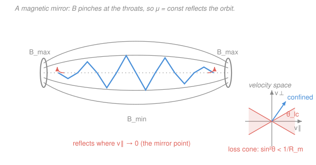

# Plasma Physics · Lesson 1.5: Adiabatic invariants & magnetic mirrors

> ⏱ ~15 min · Module 1: Plasma basics & single-particle motion · Builds on: [1.4 Grad-B, curvature & polarization drifts](01-04-gradb-curvature-polarization-drifts.md), [`analytical-mechanics` adiabatic invariants](../../analytical-mechanics/syllabus.md) · Unlocks: [2.1 The distribution function & its moments](02-01-distribution-function-moments.md)

## Why this matters

How do you hold a 100-million-kelvin plasma when no material wall survives contact? One answer, older than tokamaks, is the **magnetic mirror**: make the field strong at two ends and weak in the middle, and charged particles bounce back and forth between the strong regions, trapped by magnetism alone. The physics behind it is a single conserved quantity — the **magnetic moment $\mu$** — that stays put not because of an exact symmetry but because the field changes *slowly* along the orbit. That "slowly conserved" idea is an **adiabatic invariant**, straight out of [`analytical-mechanics`](../../analytical-mechanics/syllabus.md), and it's the same reasoning that traps radiation in Earth's Van Allen belts and lights the aurora. It also carries mirror machines' fatal flaw baked in: the **loss cone**.

## The idea

A gyrating particle is a tiny current loop, and a current loop has a magnetic moment $\mu$ — think of it as the "spin energy" of the orbit divided by the field it lives in. Here's the key claim: **as long as the field seen by the particle changes gently over one gyration, $\mu$ stays essentially constant.** Not exactly conserved like energy — *adiabatically* conserved, drifting by a vanishingly small amount per orbit.

Now walk a particle from the weak-field middle toward a strong-field throat. If $\mu = m v_\perp^2 / 2B$ must stay fixed while $B$ climbs, then $v_\perp^2$ has to climb too — **the particle spins faster and faster** as it enters stronger field. But a static magnetic field does no work (the force $q\mathbf{v}\times\mathbf{B}$ is always perpendicular to $\mathbf{v}$), so the *total* kinetic energy is pinned. The only place for the extra perpendicular energy to come from is the parallel motion: as $v_\perp^2$ rises, $v_\parallel^2$ falls. Push into strong enough field and $v_\parallel$ hits zero — the particle stops advancing and gets **reflected**. That turning point is the *mirror point*, and a particle bouncing between two of them is confined.

The catch: a particle that starts out moving *too straight down the field* (small $v_\perp$, large $v_\parallel$) runs out of field before $v_\parallel$ reaches zero. It sails through the throat and escapes. In velocity space these escapees fill a cone around the field direction — the **loss cone** — and there's nothing a static mirror can do about them.

## The formal version

**The magnetic moment.** For a particle of mass $m$, charge $q$, gyrating with perpendicular speed $v_\perp$ in field magnitude $B$,

$$\mu \equiv \frac{m v_\perp^2}{2B}.$$

*In words: $\mu$ is the gyration's perpendicular kinetic energy per unit field.* It equals the current-loop moment $I A$ of the orbit (current $I = q\Omega_c/2\pi$ around area $A = \pi r_L^2$), which is why we call it a magnetic moment.

**Adiabatic invariance.** $\mu$ is the first **adiabatic invariant**: it is conserved when the field changes slowly compared with a gyration, i.e. the fractional change of $B$ over one Larmor radius or one gyroperiod is small,

$$\frac{r_L\,|\nabla B|}{B} \ll 1, \qquad \frac{1}{\Omega_c}\frac{1}{B}\frac{\partial B}{\partial t} \ll 1.$$

*In words: as long as the particle completes many tight orbits before the field it feels changes much, $\mu$ holds.* Its deeper origin is the action integral $\oint p\,dq$ taken around one gyration — a classical adiabatic invariant in the sense of [`analytical-mechanics`](../../analytical-mechanics/syllabus.md) (an action stays constant under slow, "adiabatic," change of parameters). Here the loop is the gyro-orbit and the action is proportional to $\mu$.

**Mirror confinement.** A static $\mathbf{B}$ does no work, so total kinetic energy is conserved:

$$\tfrac12 m\big(v_\parallel^2 + v_\perp^2\big) = \tfrac12 m v^2 = \text{const}, \qquad \mu = \frac{m v_\perp^2}{2B} = \text{const}.$$

Combine them: at any point $v_\perp^2 = (2B/m)\mu$, so $v_\parallel^2 = v^2 - (2B/m)\mu$. As $B$ rises, $v_\parallel^2$ falls; the particle **reflects** where $v_\parallel = 0$, at the field value

$$B_{\text{refl}} = \frac{m v^2}{2\mu} = \frac{B_0}{\sin^2\theta_0},$$

where $\theta_0$ is the **pitch angle** at the weak-field midplane ($B_0$, $\sin\theta_0 = v_{\perp 0}/v$, the angle between $\mathbf{v}$ and $\mathbf{B}$). *In words: the straighter you launch (small $\theta_0$), the stronger the field you need to turn you around.*

**Mirror ratio and the loss cone.** A machine can only supply up to $B_{\max}$ at its throats; the weakest field is $B_{\min}$ at the midplane. Their ratio is the **mirror ratio**

$$R_m \equiv \frac{B_{\max}}{B_{\min}}.$$

A particle is confined only if its required reflection field fits inside the machine, $B_{\text{refl}} \le B_{\max}$, i.e. $B_{\min}/\sin^2\theta_0 \le B_{\max}$, which rearranges to

$$\boxed{\ \sin^2\theta_0 \ge \frac{1}{R_m}.\ }$$

Particles with $\sin^2\theta_0 < 1/R_m$ (too parallel) escape out the ends. They occupy the **loss cone**, a cone about the field axis of half-angle

$$\sin^2\theta_{lc} = \frac{1}{R_m} = \frac{B_{\min}}{B_{\max}}.$$

*In words: reflection needs enough sideways motion; too little and you leak out the throat.* For an **isotropic** velocity distribution (particles pointing every direction equally), the fraction lost through *both* ends is the solid-angle fraction of the two cones:

$$f_{\text{loss}} = 1 - \sqrt{1 - \frac{1}{R_m}}.$$

Notice $f_{\text{loss}}$ depends **only** on $R_m$, not on energy or mass — the loss cone is the same shape for every particle. That is exactly why mirror machines leak, and why a bigger $R_m$ only helps as $1/R_m$.

**The other two invariants** (named, used later): the **second (longitudinal) invariant** $J = \oint m v_\parallel\,d\ell$ over one bounce between mirror points is conserved when the mirror geometry changes slowly compared to the *bounce* time; the **third (flux) invariant** $\Phi$ = magnetic flux enclosed by the slow guiding-center drift around a closed system, conserved when the field changes slowly compared to the *drift* period. Three motions (gyrate, bounce, drift), three actions, three timescales — each invariant good on its own hierarchy of slowness. The Van Allen belts (5.3) rely on all three.

## Picture

## Worked examples

**Example 1 (μ invariance — the speed-up and the mirror point).** A proton sits at the midplane where $B_0 = 0.20\ \mathrm{T}$, with $v_{\perp 0} = 3.0\times10^5\ \mathrm{m/s}$ and $v_{\parallel 0} = 4.0\times10^5\ \mathrm{m/s}$, so $v = 5.0\times10^5\ \mathrm{m/s}$ and $\sin\theta_0 = v_{\perp 0}/v = 0.6$ ($\theta_0 \approx 37^\circ$).

*Where does it reflect?* Set $v_\parallel = 0$:

$$B_{\text{refl}} = \frac{B_0}{\sin^2\theta_0} = \frac{0.20}{0.36} = 0.56\ \mathrm{T}.$$

If the throats reach $B_{\max} = 0.80\ \mathrm{T}$ then $R_m = 4$ and the loss cone is $\sin^2\theta_{lc} = 0.25$, i.e. $\theta_{lc} = 30^\circ$. Since $\theta_0 = 37^\circ > 30^\circ$, the proton is **confined** — consistent with $B_{\text{refl}} = 0.56\,\mathrm{T} < 0.80\,\mathrm{T}$.

*How fast is it moving parallel where $B = 0.40\ \mathrm{T}$?* Use $v_\perp^2 = v_{\perp 0}^2 (B/B_0)$ from $\mu$ = const:

$$v_\perp^2 = (3.0\times10^5)^2\frac{0.40}{0.20} = 1.8\times10^{11}\ \mathrm{m^2/s^2}, \qquad v_\parallel^2 = v^2 - v_\perp^2 = (2.5 - 1.8)\times10^{11} = 7.0\times10^{10},$$

so $v_\parallel = 2.6\times10^5\ \mathrm{m/s}$. The particle has slowed along the field and spun up across it, exactly as $\mu$ = const demands.

**Example 2 (why you'd care — a fusion mirror leaks).** A mirror machine has $R_m = 10$. The loss cone half-angle is

$$\theta_{lc} = \arcsin\!\sqrt{1/10} = \arcsin(0.316) = 18.4^\circ,$$

and for an isotropic plasma the instantaneous loss fraction is

$$f_{\text{loss}} = 1 - \sqrt{1 - 0.1} = 1 - 0.949 = 0.051 \approx 5\%.$$

That sounds small, but it's *structural*: collisions constantly scatter confined particles into the empty loss cone, and once there they're gone in a single transit. You can't fill the loss cone back up faster than physics empties it, and pushing $R_m$ from 10 to 100 only shrinks the leak from ~5% to ~0.5% while the field cost soars. This is the fundamental reason mirror machines lost the fusion race to closed toroidal traps (tokamaks, Module 5) — and the same loss cone, run in reverse, is what dumps trapped particles into the atmosphere to make the **aurora**.

## Watch out

- **You might think $\mu$ is exactly conserved like energy.** It isn't — it's *adiabatically* conserved, only while $B$ varies slowly over a gyration ($r_L|\nabla B|/B \ll 1$). Near a sharp field feature, or for a fast particle with a big Larmor radius, $\mu$ breaks and the mirror leaks extra. Energy conservation (static $\mathbf{B}$ does no work) is exact; $\mu$ conservation is not.
- **You might read the loss cone as an energy filter.** It isn't — $\sin^2\theta_{lc} = 1/R_m$ has no $v$ in it. A slow particle and a fast particle with the *same pitch angle* are both confined or both lost. The mirror sorts by *direction*, not speed.
- **You might expect the mirror to speed the particle up overall.** No — total kinetic energy is fixed. The field only *reshuffles* energy between $v_\perp$ (up, into gyration) and $v_\parallel$ (down, to zero). "It spins faster" always means "it advances slower."

## One-liner

> $\mu = m v_\perp^2/2B$ rides along conserved, so climbing into strong $B$ trades $v_\parallel$ for $v_\perp$ until the particle reflects — unless it launched inside the loss cone $\sin^2\theta < 1/R_m$, in which case it escapes.

## Problems

**P1 (🟢)** A mirror machine has $R_m = B_{\max}/B_{\min} = 4$. Find the loss-cone half-angle $\theta_{lc}$ at the midplane.

**P2 (🟡)** An electron at the midplane ($B_0 = 0.30\ \mathrm{T}$) has pitch angle $\theta_0 = 50^\circ$. (a) At what field strength does it reflect? (b) If the throats reach $B_{\max} = 0.90\ \mathrm{T}$, is it confined?

**P3 (🔴, Boss-flavored)** For an isotropic velocity distribution in a mirror with ratio $R_m$, derive the fraction lost out *both* ends, $f_{\text{loss}} = 1 - \sqrt{1 - 1/R_m}$, from the solid angle of the loss cones. Evaluate it for $R_m = 4$.

Solutions

**P1** The loss-cone condition is $\sin^2\theta_{lc} = 1/R_m = 1/4$, so $\sin\theta_{lc} = 1/2$ and

$$\theta_{lc} = \arcsin(0.5) = 30^\circ.$$

*Check.* As $R_m\to\infty$ the cone closes ($\theta_{lc}\to0^\circ$, nothing escapes); as $R_m\to1$ (no mirror) $\theta_{lc}\to90^\circ$, everything escapes. $30^\circ$ sits sensibly between. ✓

**P2** (a) Reflection field from $\mu$ = const and energy = const:

$$B_{\text{refl}} = \frac{B_0}{\sin^2\theta_0} = \frac{0.30}{\sin^2 50^\circ} = \frac{0.30}{(0.766)^2} = \frac{0.30}{0.587} = 0.51\ \mathrm{T}.$$

(b) The loss cone is $\sin^2\theta_{lc} = B_{\min}/B_{\max} = 0.30/0.90 = 1/3$, so $\theta_{lc} = \arcsin(0.577) = 35.3^\circ$. Since $\theta_0 = 50^\circ > 35.3^\circ$ the electron is **confined** — equivalently $B_{\text{refl}} = 0.51\ \mathrm{T} < B_{\max} = 0.90\ \mathrm{T}$, so it turns around before the throat. ✓

*Check.* Both tests must agree, and they do. Units: $B_{\text{refl}}$ came out in tesla. ✓

**P3** Take speeds isotropic: the fraction of particles with velocity direction inside a cone of half-angle $\theta$ about an axis is the solid-angle fraction. A cone of half-angle $\theta$ subtends $\Omega = 2\pi(1 - \cos\theta)$ steradians; the full sphere is $4\pi$. There are **two** loss cones (one toward each throat), so

$$f_{\text{loss}} = \frac{2\cdot 2\pi(1 - \cos\theta_{lc})}{4\pi} = 1 - \cos\theta_{lc}.$$

Now $\cos\theta_{lc} = \sqrt{1 - \sin^2\theta_{lc}} = \sqrt{1 - 1/R_m}$, giving

$$f_{\text{loss}} = 1 - \sqrt{1 - \frac{1}{R_m}}.$$

For $R_m = 4$: $f_{\text{loss}} = 1 - \sqrt{1 - 0.25} = 1 - \sqrt{0.75} = 1 - 0.866 = 0.134$, about **13%** lost immediately.

*Check.* Limits: $R_m\to1\Rightarrow f_{\text{loss}}\to1$ (no mirror, all lost); $R_m\to\infty\Rightarrow f_{\text{loss}}\to0$ (perfect mirror). And a modest $R_m=4$ leaking 13% of an isotropic plasma is the quantitative statement of "mirrors are leaky." ✓ This is Boss problem 1's core result.

## Flashback

**From Lesson 1.3 (Gyration & the E×B drift):** An electron ($m = 9.11\times10^{-31}\ \mathrm{kg}$, $q = 1.6\times10^{-19}\ \mathrm{C}$) moves with perpendicular speed $v_\perp = 2.0\times10^6\ \mathrm{m/s}$ in a uniform field $B = 0.50\ \mathrm{T}$. Find its cyclotron frequency $\Omega_c$ and Larmor radius $r_L$. (Fresh numbers — same machinery you'll reuse to check the adiabatic condition $r_L|\nabla B|/B \ll 1$.)

Solution

Cyclotron (gyro) frequency and Larmor radius:

$$\Omega_c = \frac{qB}{m} = \frac{(1.6\times10^{-19})(0.50)}{9.11\times10^{-31}} = 8.8\times10^{10}\ \mathrm{rad/s},$$

$$r_L = \frac{v_\perp}{\Omega_c} = \frac{m v_\perp}{qB} = \frac{(9.11\times10^{-31})(2.0\times10^6)}{(1.6\times10^{-19})(0.50)} = 2.3\times10^{-5}\ \mathrm{m} \approx 23\ \mu\mathrm{m}.$$

*Check.* Units of $\Omega_c$: $\mathrm{C\cdot T/kg} = \mathrm{C\cdot(kg/(C\,s))/kg} = \mathrm{s^{-1}}$ ✓. A 23 μm orbit is tiny next to any lab-scale field gradient, so $\mu$ is very well conserved here — precisely the regime the mirror argument assumes. ✓

## Connections

- **Backward:** the gyration, cyclotron frequency, and Larmor radius from [1.3](01-03-gyration-exb-drift.md) *are* the loop whose action gives $\mu$; the nonuniform-field intuition from [1.4](01-04-gradb-curvature-polarization-drifts.md) is what makes $B$ vary along the orbit in the first place. Energy conservation for a static field ($q\mathbf{v}\times\mathbf{B}\perp\mathbf{v}$) is the [`em-refresher`](../../em-refresher/syllabus.md) Lorentz force doing no work.
- **Forward:** the loss cone is a *hole* in velocity space — a non-Maxwellian $f(\mathbf{v})$ — which is exactly the object [2.1 The distribution function & its moments](02-01-distribution-function-moments.md) formalizes; a loss-cone distribution is also a free-energy source for instabilities later in the course. The three invariants power the Van Allen belt analysis in 5.3.
- **Sideways (analytical mechanics):** $\mu$ is an **adiabatic invariant** in the precise sense of [`analytical-mechanics`](../../analytical-mechanics/syllabus.md) — the action $\oint p\,dq$ around a periodic orbit is conserved under slow change of the system's parameters. The gyration is the periodic orbit; "slow" means slow compared to a gyroperiod. Same theorem that keeps a slowly-shortened pendulum's $E/\omega$ constant keeps a plasma particle's $\mu$ constant.
