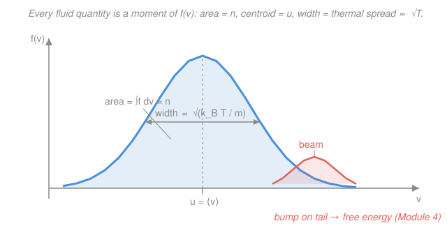

# Plasma Physics · Lesson 2.1: The distribution function & its moments

> ⏱ ~15 min · Module 2: Kinetic theory — Vlasov & Landau damping · Builds on: [1.5 Adiabatic invariants & magnetic mirrors](01-05-adiabatic-invariants-mirrors.md), [`stat-mech`](../../stat-mech/syllabus.md) · Unlocks: [2.2 The Vlasov equation](02-02-vlasov-equation.md)

## Why this matters

All of Module 1 followed *one* particle — its gyration, its drifts, its bounce between mirrors. But a real plasma has $10^{18}$ particles per cubic meter, each on its own orbit. You cannot track them, and averaging by hand is hopeless. The fix is the single most important object in kinetic theory: the **distribution function** $f(\mathbf{x},\mathbf{v},t)$, a smooth cloud in a 6-dimensional space that says how many particles have roughly a given position *and* a given velocity. Once you have $f$, every fluid quantity you care about — density, flow, pressure, temperature — is just an *average* over velocity, computed by a single integral called a **moment**. This lesson builds $f$ and its moments; [2.2](02-02-vlasov-equation.md) will give the equation $f$ obeys, and Module 3 will take moments of *that* to fall straight into the fluid equations.

## The idea

Picture the plasma not in ordinary 3D space but in **phase space**: six axes, three for position $\mathbf{x}=(x,y,z)$ and three for velocity $\mathbf{v}=(v_x,v_y,v_z)$. A single particle is one point in this 6D space; it moves as its position and velocity change. A whole plasma is a swarm of $\sim 10^{18}$ points. Zoom out until the swarm blurs into a smooth density, and that density *is* $f$: the number of particles per unit phase-space volume $d^3x\,d^3v$.

Now the key move. Suppose you don't care about the velocity details at a point — you just want the *number density* there. You sweep up every particle at that location regardless of how fast it's going: you **integrate $f$ over all velocities**. That's the zeroth moment, and it gives $n(\mathbf{x},t)$. Want the average velocity (the fluid flow)? Weight each particle by its own $\mathbf{v}$ before averaging — the first moment. Want the pressure — the push from random thermal jostling? Weight by the *spread* of velocities about the mean — the second moment. Each fluid field is $f$ viewed through a different lens, and the lens is just "what you multiply by before integrating over $\mathbf{v}$."

The punchline for later: two plasmas with the *same* density, flow, and pressure can still have very differently *shaped* $f$. A lopsided shape — a beam, a gap, a bump on the tail — hides **free energy** that the fluid picture can't see but that can drive instabilities (Module 4). $f$ knows more than its moments do.

## The formal version

**The distribution function.** $f(\mathbf{x},\mathbf{v},t)$ is defined so that

$$dN = f(\mathbf{x},\mathbf{v},t)\,d^3x\,d^3v$$

is the number of particles at time $t$ inside the phase-space box $d^3x$ around $\mathbf{x}$ and $d^3v$ around $\mathbf{v}$. *In words: $f$ is the particle count per unit 6D phase-space volume.* Its SI units are particles per $(\text{m}^3)(\text{m/s})^3 = \text{s}^3\,\text{m}^{-6}$. There is one $f$ per species (electrons $f_e$, ions $f_i$).

**Moments.** Integrating $f$ over velocity, with different weights, recovers the fluid fields at each point $\mathbf{x}$:

$$n(\mathbf{x},t) = \int f\,d^3v \qquad\text{(zeroth moment: density)}$$

*In words: add up particles of every velocity to get how many are here.*

$$\mathbf{u}(\mathbf{x},t) = \frac{1}{n}\int \mathbf{v}\,f\,d^3v \qquad\text{(first moment: bulk flow)}$$

*In words: the number-weighted average velocity — the speed of the fluid element, not of any one particle.*

$$\mathbf{P}(\mathbf{x},t) = m\int (\mathbf{v}-\mathbf{u})(\mathbf{v}-\mathbf{u})\,f\,d^3v \qquad\text{(second moment: pressure tensor)}$$

Here $m$ is the particle mass and $(\mathbf{v}-\mathbf{u})(\mathbf{v}-\mathbf{u})$ is a **dyad** — a $3\times3$ matrix whose $(i,j)$ entry is $(v_i-u_i)(v_j-u_j)$. We subtract the bulk flow $\mathbf{u}$ first, so $\mathbf{P}$ measures only the *random* velocity spread about the mean — the thermal motion. *In words: pressure is the mass-weighted spread of velocities around the flow.* The **scalar pressure** is one-third the trace (the average of the three diagonal terms),

$$p = \tfrac{1}{3}\,\mathrm{tr}\,\mathbf{P} = \frac{m}{3}\int |\mathbf{v}-\mathbf{u}|^2 f\,d^3v \equiv n k_B T,$$

which *defines* the **temperature** $T$: $k_B T$ (with $k_B$ Boltzmann's constant) is $\tfrac{1}{3}m$ times the mean-square random speed. *In words: temperature is not a separate thing — it is the variance of the velocity spread, a moment of $f$.* This is exactly the equipartition statement $\tfrac12 m\langle(v_i-u_i)^2\rangle = \tfrac12 k_B T$ per degree of freedom that you met in [`stat-mech`](../../stat-mech/syllabus.md).

**The Maxwellian.** A plasma left alone (many collisions, no drive) relaxes to thermal equilibrium, where $f$ takes the Maxwell–Boltzmann form (derived in [`stat-mech`](../../stat-mech/syllabus.md)):

$$f_M(\mathbf{v}) = n\left(\frac{m}{2\pi k_B T}\right)^{3/2}\exp\!\left(-\frac{m v^2}{2 k_B T}\right), \qquad v^2 = v_x^2+v_y^2+v_z^2.$$

*In words: an isotropic Gaussian bell in velocity, centered on $\mathbf{v}=0$, whose width grows as $\sqrt{T}$.* Its moments return exactly what they should — $n$, zero flow, and $p=nk_BT$ (verified in Example 2). The Maxwellian is the "boring" reference state; interesting plasma physics lives in the *departures* from it.

## Picture

The blue curve is one velocity slice of the Maxwellian. Its three moments are read off geometrically: the shaded **area** is the density $n$, the **centroid** is the flow $\mathbf{u}$, and the **width** is the thermal spread $\propto\sqrt{k_B T/m}$. The coral **bump on the tail** is a second population — a beam — whose lopsided shape stores free energy the moments barely register but which can destabilize the plasma (Module 4).

## Worked examples

**Example 1 (mechanical — moments of a given $f$).** Work in 1D (one velocity component $v$) for transparency; the recipe is identical in 3D. Take the parabolic "dome"

$$f(v) = A\left(1 - \frac{v^2}{a^2}\right) \ \ \text{for } |v|\le a, \qquad f=0 \text{ otherwise},$$

with constants $A>0$ and $a>0$. Compute the three moments.

*Density (zeroth):*

$$n = \int_{-a}^{a} A\left(1-\frac{v^2}{a^2}\right)dv = A\left[v - \frac{v^3}{3a^2}\right]_{-a}^{a} = A\cdot\frac{4a}{3}.$$

*Flow (first):* the integrand $v\,f(v)$ is odd, so

$$u = \frac{1}{n}\int_{-a}^{a} v\,f(v)\,dv = 0.$$

*Pressure (second, 1D scalar $p = m\int (v-u)^2 f\,dv$):* with $u=0$,

$$p = m\int_{-a}^{a} v^2 A\left(1-\frac{v^2}{a^2}\right)dv = mA\left[\frac{v^3}{3} - \frac{v^5}{5a^2}\right]_{-a}^{a} = mA\cdot\frac{4a^3}{15}.$$

Using $A = 3n/(4a)$ to eliminate $A$:

$$p = m\cdot\frac{3n}{4a}\cdot\frac{4a^3}{15} = \frac{m n a^2}{5}, \qquad\text{so}\quad k_B T \equiv \frac{p}{n} = \frac{m a^2}{5}.$$

The distribution's finite width $a$ became a temperature. *Check.* Units: $[p]=\text{kg}\cdot\text{m}^{-3}\cdot(\text{m/s})^2 = \text{kg}\,\text{m}^{-1}\text{s}^{-2} = \text{Pa}$ ✓ (in 1D $n$ has units m⁻¹, but the pattern — mass × density × velocity² — is right). Limiting sense: a wider dome (bigger $a$) is "hotter," as it should be.

**Example 2 (why you'd care — the Maxwellian returns $n$, $\mathbf{u}=0$, $p=nk_BT$).** The whole framework is only trustworthy if the equilibrium $f_M$ gives back the familiar thermodynamics. Check all three moments. The one Gaussian fact we need, per component (with $\alpha \equiv m/2k_BT$):

$$\int_{-\infty}^{\infty} e^{-\alpha v_x^2}\,dv_x = \sqrt{\frac{\pi}{\alpha}}, \qquad \int_{-\infty}^{\infty} v_x^2\,e^{-\alpha v_x^2}\,dv_x = \frac{1}{2}\sqrt{\frac{\pi}{\alpha^3}} = \frac{1}{2\alpha}\sqrt{\frac{\pi}{\alpha}}.$$

*Density:* the 3D integral factorizes into three identical 1D Gaussians:

$$\int f_M\,d^3v = n\left(\frac{\alpha}{\pi}\right)^{3/2}\!\left(\sqrt{\frac{\pi}{\alpha}}\right)^{3} = n\left(\frac{\alpha}{\pi}\right)^{3/2}\!\left(\frac{\pi}{\alpha}\right)^{3/2} = n.\ \checkmark$$

*Flow:* $\int \mathbf{v}\,f_M\,d^3v = 0$ because each component integrand is odd — so $\mathbf{u}=0$. The Maxwellian describes a plasma at rest. ✓

*Pressure:* by isotropy the three diagonal terms are equal, so $p = m\int v_x^2 f_M\,d^3v$. The $v_y,v_z$ integrals give back the normalization (they collapse to the density calc), leaving one weighted 1D integral:

$$p = m\,n\,\underbrace{\left(\frac{\alpha}{\pi}\right)^{1/2}\int v_x^2 e^{-\alpha v_x^2}dv_x}_{=\ 1/(2\alpha)} = \frac{m n}{2\alpha} = \frac{m n}{2}\cdot\frac{2k_B T}{m} = n k_B T.\ \checkmark$$

So the second moment of the Maxwellian is exactly the ideal-gas law. Equivalently $\langle v_x^2\rangle = 1/2\alpha = k_BT/m$, hence $\langle v^2\rangle = 3k_BT/m$ and $\tfrac12 m\langle v^2\rangle = \tfrac32 k_BT$ — equipartition, recovered as a moment. *Check.* Dimensionless prefactors cancel cleanly, and the result is species-independent in form: heavy ions at the same $T$ have the same pressure per particle, just a narrower velocity bell (width $\propto 1/\sqrt m$).

## Watch out

- **You might think $f$ is a density in ordinary space.** It isn't — it lives in 6D phase space (per $d^3x\,d^3v$). You only get the familiar spatial density $n(\mathbf{x})$ *after* integrating out the three velocity axes. Forgetting the $d^3v$ integration is the most common units error here.
- **You might treat pressure as a scalar always.** In general $\mathbf{P}$ is a $3\times3$ **tensor**. The single number $p=\tfrac13\mathrm{tr}\,\mathbf{P}$ is only the full story when $f$ is *isotropic* (like the Maxwellian). Off-diagonal terms are viscous stresses; an anisotropic $f$ (common in a magnetized plasma, where $T_\parallel\ne T_\perp$) needs the tensor.
- **You might think temperature is a fundamental field like $\mathbf{E}$.** It is a *derived* moment — the variance of the velocity spread — and it is only sharply meaningful when $f$ is near-Maxwellian. A beam or a double-humped $f$ has a well-defined pressure moment but no honest single "temperature."
- **You might assume equal moments mean equal physics.** Two distributions can share $n$, $\mathbf{u}$, and $p$ yet differ in shape. The difference is *free energy* (a bump, a slope $\partial f/\partial v>0$) that the moments smear over but that Module 4 shows can grow into an instability.

## One-liner

> $f(\mathbf{x},\mathbf{v},t)$ is the master object of a plasma; every fluid quantity — density, flow, pressure, temperature — is a velocity **moment** (a weighted average) of it, and the Maxwellian's moments are just the ideal-gas law in disguise.

## Problems

**P1 (🟢)** A 1D electron distribution is the flat "top hat"
$$f(v) = \frac{n_0}{2\Delta}\ \ \text{for } u_0-\Delta < v < u_0+\Delta, \qquad f=0 \text{ otherwise},$$
with constants $n_0>0$, drift $u_0$, and half-width $\Delta>0$. Find the density, the flow velocity, the scalar pressure $p=m\int(v-u)^2 f\,dv$, and the effective temperature $k_B T = p/n_0$.

**P2 (🟡)** For the **1D** Maxwellian $f(v) = n\left(\dfrac{m}{2\pi k_B T}\right)^{1/2}\exp\!\left(-\dfrac{m v^2}{2k_B T}\right)$, verify directly that (a) $\int_{-\infty}^{\infty} f\,dv = n$ and (b) the pressure moment $p = m\int_{-\infty}^{\infty} v^2 f\,dv$ equals $n k_B T$. (Use the two Gaussian integrals from Example 2.)

**P3 (🔴, optional)** A plasma has a bulk-plus-beam distribution
$$f(v) = f_0\,e^{-v^2/2v_{th}^2} \;+\; \frac{f_0}{5}\,e^{-(v-5v_{th})^2/2\sigma_b^2}, \qquad \sigma_b = v_{th},$$
i.e. a Maxwellian bulk centered at $v=0$ plus a small beam centered at $v=5v_{th}$. Sketch $f(v)$ and identify the velocity range where $\partial f/\partial v > 0$. Explain in one or two sentences why that region is a **free-energy source** and what it connects to downstream. (You need not compute the exact crossing points — reason from the shape.)

Solutions

**P1** *Density* — the top hat has constant height $n_0/2\Delta$ over a window of width $2\Delta$:
$$n = \int_{u_0-\Delta}^{u_0+\Delta}\frac{n_0}{2\Delta}\,dv = \frac{n_0}{2\Delta}\cdot 2\Delta = n_0.$$
*Flow* — the window is symmetric about $u_0$, so the mean is its center:
$$u = \frac{1}{n_0}\int_{u_0-\Delta}^{u_0+\Delta} v\,\frac{n_0}{2\Delta}\,dv = u_0.$$
*Pressure* — substitute $s = v - u_0$ (so $s$ runs $-\Delta$ to $\Delta$), $u=u_0$:
$$p = m\int_{-\Delta}^{\Delta} s^2\,\frac{n_0}{2\Delta}\,ds = \frac{m n_0}{2\Delta}\left[\frac{s^3}{3}\right]_{-\Delta}^{\Delta} = \frac{m n_0}{2\Delta}\cdot\frac{2\Delta^3}{3} = \frac{m n_0 \Delta^2}{3}.$$
Hence $k_B T = p/n_0 = m\Delta^2/3$.
*Check.* The drift $u_0$ dropped out of the pressure (as it must — pressure is measured about the flow, not about $v=0$). A wider top hat (bigger $\Delta$) is hotter, and the variance of a uniform distribution on $[-\Delta,\Delta]$ is indeed $\Delta^2/3$, matching $k_BT/m$. ✓

**P2** With $\alpha = m/2k_B T$, so that $\sqrt{\pi/\alpha} = \sqrt{2\pi k_B T/m}$ and the prefactor is $n\sqrt{\alpha/\pi}$:

(a) $\displaystyle\int f\,dv = n\sqrt{\frac{\alpha}{\pi}}\int_{-\infty}^{\infty}e^{-\alpha v^2}dv = n\sqrt{\frac{\alpha}{\pi}}\cdot\sqrt{\frac{\pi}{\alpha}} = n.\ \checkmark$

(b) $\displaystyle p = m\,n\sqrt{\frac{\alpha}{\pi}}\int_{-\infty}^{\infty}v^2 e^{-\alpha v^2}dv = m\,n\sqrt{\frac{\alpha}{\pi}}\cdot\frac{1}{2\alpha}\sqrt{\frac{\pi}{\alpha}} = \frac{m n}{2\alpha} = \frac{mn}{2}\cdot\frac{2k_B T}{m} = n k_B T.\ \checkmark$

*Check.* Part (b) also reads off the variance: $\langle v^2\rangle = p/(mn) = k_B T/m$, the 1D equipartition result $\tfrac12 m\langle v^2\rangle = \tfrac12 k_B T$. Units of $p$ (1D): mass × density × velocity². ✓

**P3** The bulk term falls from its peak at $v=0$; moving right, $f$ decreases (slope $<0$) until the beam starts to lift it. There is a **local minimum** in the valley between the two humps (somewhere around $v\approx 3$–$4\,v_{th}$), then $f$ **rises** to the beam peak at $v=5v_{th}$. So $\partial f/\partial v > 0$ on the beam's *left flank* — roughly from the valley minimum up to $v=5v_{th}$.

A region of *positive* slope means there are **more** fast particles at a slightly higher speed than at a slightly lower one — a population inversion in velocity. That stored, non-thermal ordering is **free energy**: a wave with phase speed sitting on this positive slope can extract energy from the resonant particles and grow instead of damp. This is precisely the **bump-on-tail / two-stream instability** (Module 4), and it is the sign-flip of the $\partial f/\partial v$ that controls **Landau damping** ([2.4](02-04-landau-damping.md)) — a Maxwellian's monotonic $\partial f/\partial v<0$ damps waves; a bump's local $\partial f/\partial v>0$ makes them grow.
*Check.* A pure Maxwellian has $\partial f/\partial v<0$ for all $v>0$ (no inversion, no free energy, no instability), so the beam is essential — consistent with the rule that instability needs a departure from equilibrium.

## Flashback

**From Lesson 1.1 (What is a plasma? Debye shielding):** A lab plasma has electron density $n = 1.0\times10^{18}\ \text{m}^{-3}$ and electron temperature $T_e = 2.0\ \text{eV}$. Compute the Debye length $\lambda_D = \sqrt{\varepsilon_0 k_B T_e/(n e^2)}$, and confirm it is far smaller than a 1 cm device — i.e. that the plasma screens fields over a tiny distance. (Fresh variant — new numbers; recall the handy form $\lambda_D \approx 7430\,\sqrt{T_e[\text{eV}]/n[\text{m}^{-3}]}\ \text{m}$.)

Solution

Using the handy form with $T_e = 2.0$ eV and $n = 1.0\times10^{18}\ \text{m}^{-3}$:

$$\lambda_D \approx 7430\sqrt{\frac{2.0}{1.0\times10^{18}}} = 7430\sqrt{2.0\times10^{-18}} = 7430\times(1.41\times10^{-9}) \approx 1.05\times10^{-5}\ \text{m} \approx 10\ \mu\text{m}.$$

That is about a thousandth of the 1 cm device size, so quasineutrality holds on the device scale: any charge imbalance is screened out within ~10 μm. *Check.* The prefactor 7430 packs $\sqrt{\varepsilon_0 e/e^2}$ evaluated in SI with $k_BT$ written as $e\cdot T[\text{eV}]$; the answer scales as $\sqrt{T/n}$ — hotter or thinner plasmas shield over longer distances, as expected. Bridge to this lesson: the $T_e$ in $\lambda_D$ is itself the second moment of $f_e$ — the same thermal spread we just defined. ✓

## Connections

- **Backward:** Module 1 tracked one particle's orbit; $f$ is the statistical census of *all* of them in the same 6D phase space (position + velocity) those orbits lived in. The temperature that sets a Maxwellian's width is the very $T$ that set the Debye length ([1.1](01-01-what-is-a-plasma-debye.md)) and the thermal velocity behind [1.5](01-05-adiabatic-invariants-mirrors.md)'s mirror loss cone.
- **Forward:** [2.2 The Vlasov equation](02-02-vlasov-equation.md) gives the evolution law for $f$; taking its velocity moments (Module 3) turns it into the fluid continuity, momentum, and energy equations — the moments defined here become the *variables* of magnetohydrodynamics. The free energy in a non-Maxwellian $f$ is the seed of the instabilities in [2.4](02-04-landau-damping.md) and Module 4.
- **Sideways (`stat-mech`):** the Maxwellian and "temperature = variance of the velocity spread" come straight from [`stat-mech`](../../stat-mech/syllabus.md)'s equipartition and Maxwell–Boltzmann distribution; here the same object is promoted to a *field* $f(\mathbf{x},\mathbf{v},t)$ that can be pushed out of equilibrium by the plasma's own self-consistent fields.
