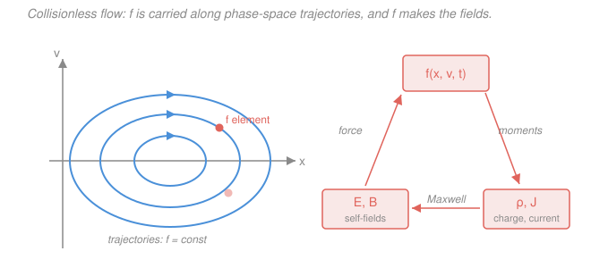

# Plasma Physics · Lesson 2.2: The Vlasov equation

> ⏱ ~15 min · Module 2: Kinetic theory — Vlasov & Landau damping · Builds on: [2.1 The distribution function & its moments](02-01-distribution-function-moments.md), [`em-refresher` (Maxwell's equations)](../../em-refresher/syllabus.md) · Unlocks: [2.3 Linearizing Vlasov: the plasma dispersion relation](02-03-linearizing-vlasov-dispersion.md)

## Why this matters

Lesson 2.1 gave you a way to *describe* a plasma — the distribution function $f(\mathbf{x},\mathbf{v},t)$ and the density, flow, and pressure you get by taking its moments. But a description that just sits there is useless; we need a law of motion for $f$ itself. That law is the **Vlasov equation**, and it is the single most important equation in kinetic plasma theory. It says something almost too simple to be interesting — *phase-space density is conserved along particle trajectories* — but bolted to Maxwell's equations it becomes a closed, nonlinear feedback loop in which the plasma's own fields steer the plasma's own distribution. That loop is the mathematical home of *collective behavior*, the one property that makes a plasma a plasma. Everything downstream — the dielectric response of 2.3, the Landau damping of 2.4 — lives inside it.

## The idea

Picture the 6-dimensional **phase space** whose coordinates are position $\mathbf{x}$ and velocity $\mathbf{v}$. A plasma is a swarm of points in that space, and $f$ is their density: $f\,d^3x\,d^3v$ is how many particles sit in a little box around $(\mathbf{x},\mathbf{v})$ at time $t$.

Now let the plasma evolve. Each particle drifts through phase space: its position changes because it has velocity, and its velocity changes because the Lorentz force pushes on it. So every point flows along a definite trajectory set by the force field. **If nothing creates or destroys particles — no collisions knocking them abruptly from one velocity to another — then the swarm just gets *carried around*.** Think of dye stirred into an incompressible fluid: it swirls and stretches into thin filaments, but the dye concentration you'd measure riding along with a given blob never changes. Vlasov is exactly that statement for the plasma's phase-space "dye": *$f$ is constant as you flow along a trajectory.*

The twist that makes it a *plasma* equation rather than a passive one: the force field steering the trajectories isn't handed to you from outside. The $\mathbf{E}$ and $\mathbf{B}$ come from the charges and currents — which *are* moments of $f$. So $f$ writes the fields, and the fields move $f$. It's a snake eating its own tail.

## The formal version

Follow one phase point. Its position obeys $\dot{\mathbf{x}} = \mathbf{v}$ and its velocity obeys Newton's law with the Lorentz force,

$$\dot{\mathbf{v}} = \frac{q}{m}\left(\mathbf{E} + \mathbf{v}\times\mathbf{B}\right),$$

where $q$ and $m$ are the particle's charge and mass (SI: coulombs, kg), and $\mathbf{E}$, $\mathbf{B}$ are the electric and magnetic fields at that point. The density $f$ measured *riding along* with the point changes at the rate given by the total (convective) derivative — chain rule in phase space:

$$\frac{df}{dt} = \frac{\partial f}{\partial t} + \dot{\mathbf{x}}\cdot\nabla_{\mathbf{x}} f + \dot{\mathbf{v}}\cdot\nabla_{\mathbf{v}} f,$$

where $\nabla_{\mathbf{x}}$ and $\nabla_{\mathbf{v}}$ are the gradients in position and velocity. **Liouville's theorem** says that for this force the 6D flow is *incompressible*, so nothing bunches up or thins out and $df/dt = 0$. Check the incompressibility: the phase-space "velocity" is $(\dot{\mathbf{x}},\dot{\mathbf{v}})$, and its divergence is

$$\nabla_{\mathbf{x}}\cdot\mathbf{v} \;+\; \nabla_{\mathbf{v}}\cdot\!\left[\tfrac{q}{m}(\mathbf{E}+\mathbf{v}\times\mathbf{B})\right] = 0 + 0 = 0.$$

The first term is zero because $\mathbf{v}$ is an independent coordinate (it doesn't depend on $\mathbf{x}$); the second is zero because $\mathbf{E}$ doesn't depend on $\mathbf{v}$, and $\nabla_{\mathbf{v}}\cdot(\mathbf{v}\times\mathbf{B}) = 0$ since $\mathbf{v}\times\mathbf{B}$ is always perpendicular to $\mathbf{v}$. Setting $df/dt = 0$ gives the **Vlasov equation**:

$$\boxed{\;\frac{\partial f}{\partial t} + \mathbf{v}\cdot\nabla_{\mathbf{x}} f + \frac{q}{m}\left(\mathbf{E} + \mathbf{v}\times\mathbf{B}\right)\cdot\nabla_{\mathbf{v}} f = 0\;}$$

*In words: $f$ is constant as you flow along the phase-space trajectory set by the Lorentz force — it just gets carried around, never created or destroyed.* It is the **collisionless Boltzmann equation**: Boltzmann's transport equation with the collision term switched off.

**Self-consistency — the crux.** The $\mathbf{E}$ and $\mathbf{B}$ in that force are *not external*. They are the fields generated by the plasma's own charge density and current, which are the zeroth and first moments of $f$ summed over species $s$ (electrons, ions):

$$\rho(\mathbf{x},t) = \sum_s q_s\!\int f_s\,d^3v, \qquad \mathbf{J}(\mathbf{x},t) = \sum_s q_s\!\int \mathbf{v}\,f_s\,d^3v,$$

which feed Maxwell's equations, which produce $\mathbf{E}$ and $\mathbf{B}$, which go back into the Vlasov force. **Vlasov + Maxwell is a closed, nonlinear loop.** The nonlinearity is exactly the product of $f$'s fields with $f$'s gradients — the collective feedback that defines the subject.

For **electrostatic** problems (no time-varying $\mathbf{B}$, so $\mathbf{E} = -\nabla_{\mathbf{x}}\phi$) the loop collapses to the **Vlasov–Poisson system**: Vlasov for each species plus

$$\nabla_{\mathbf{x}}\cdot\mathbf{E} = \frac{\rho}{\varepsilon_0}, \qquad\text{i.e.}\qquad \nabla_{\mathbf{x}}^2\phi = -\frac{1}{\varepsilon_0}\sum_s q_s\!\int f_s\,d^3v,$$

with $\varepsilon_0$ the permittivity of free space. This is the workhorse for Langmuir waves and Landau damping.

**Jeans' theorem (how to build equilibria).** Any function of the constants of motion is a time-independent Vlasov solution. If a single particle conserves its energy $w = \tfrac12 m v^2 + q\phi(\mathbf{x})$, then any $f = g(w)$ makes $\partial f/\partial t = 0$ automatically — the flow carries each phase point along a constant-$w$ surface, and $f$ was already constant on those surfaces. *In words: pick any function of energy (or another invariant) and you've got a steady state.* The Maxwellian is the special case $g \propto e^{-w/k_B T}$.

**When collisions matter.** Restore the right-hand side and Vlasov becomes Boltzmann, $df/dt = (\partial f/\partial t)_{\text{coll}}$. The collision term can be modeled crudely as **Krook/BGK relaxation**, $-\nu\,(f - f_M)$ — "drag $f$ back toward a local Maxwellian $f_M$ at rate $\nu$" — or, for the grazing small-angle Coulomb scatters that actually dominate, by the **Fokker–Planck** operator (a diffusion-plus-drag in velocity). You may drop it whenever a plasma oscillation completes many cycles before a collision randomizes anything, i.e.

$$\omega_p\,\tau_{\text{coll}} \gg 1,$$

with $\omega_p$ the plasma frequency and $\tau_{\text{coll}} = 1/\nu$ the collision time. This is the **third plasma criterion** from Lesson 1.2, and it holds by many orders of magnitude in almost every plasma of interest — which is precisely why collisionless Vlasov is usually the right tool.

## Picture

## Worked examples

**Example 1 (mechanical — a Maxwellian is an equilibrium).** Take a uniform, field-free plasma with a stationary Maxwellian,

$$f_M(\mathbf{v}) = n\left(\frac{m}{2\pi k_B T}\right)^{3/2} e^{-m v^2/(2k_B T)}, \qquad v^2 = \mathbf{v}\cdot\mathbf{v},$$

no dependence on $\mathbf{x}$ or $t$, and no fields ($\mathbf{E} = \mathbf{B} = 0$). Check each Vlasov term:

- $\partial f_M/\partial t = 0$ — it's time-independent.
- $\mathbf{v}\cdot\nabla_{\mathbf{x}} f_M = 0$ — it's spatially uniform, so $\nabla_{\mathbf{x}} f_M = 0$.
- $\tfrac{q}{m}(\mathbf{E}+\mathbf{v}\times\mathbf{B})\cdot\nabla_{\mathbf{v}} f_M = 0$ — the force is zero.

All three terms vanish, so $f_M$ solves Vlasov trivially. Worth noting *why* it survives even when a force is present: $\nabla_{\mathbf{v}} f_M \propto -\tfrac{m\mathbf{v}}{k_B T} f_M$ points along $\mathbf{v}$, so the magnetic part contributes $(\mathbf{v}\times\mathbf{B})\cdot\mathbf{v} = 0$ regardless. A Maxwellian is invisible to a magnetic field.

**Example 2 (why you'd care — the closed loop is the whole subject).** Suppose you perturb that equilibrium slightly — bunch the electrons up a hair in one region. That extra charge density $\rho = -e\,\delta n$ feeds Poisson's equation and creates an $\mathbf{E}$ field pointing so as to push the electrons apart. That $\mathbf{E}$ enters the Vlasov force, which reshapes $f$, which changes $\rho$, which updates $\mathbf{E}$… The system rings. If you *froze* the field (treated $\mathbf{E}$ as external), you'd get particles sloshing in a fixed potential and nothing interesting — no waves, no screening, no Landau damping. The physics lives entirely in the fact that the field is *sourced by the same $f$ it acts on*. In 2.3 we make this quantitative: linearize the Vlasov–Poisson loop about $f_M$ and read off the plasma's dielectric function $\varepsilon(k,\omega)$; the whole Landau story falls out of that one closed loop.

## Watch out

- **You might think $df/dt = 0$ means $\partial f/\partial t = 0$.** No — $f$ at a *fixed* phase-space point can change violently as the swarm flows past. What's conserved is $f$ measured *following a trajectory* (the total derivative), not $f$ at a fixed $(\mathbf{x},\mathbf{v})$ (the partial derivative). Only in a true steady state are both zero.
- **You might think the fields are given.** In every real Vlasov problem the fields are *unknowns* determined by $f$ through Maxwell. Writing Vlasov with an externally prescribed $\mathbf{E}$ is a linearization or a test-particle approximation, not the full self-consistent equation — and it throws away the collective physics.
- **You might read "collisionless" as "no interactions."** The particles interact constantly — through the smooth, collective $\mathbf{E}$ and $\mathbf{B}$ they generate together. What Vlasov drops is only the *close, grazing binary* Coulomb encounters (the collision term). The long-range mean field is fully kept.

## One-liner

> Vlasov says phase-space density rides unchanged along Lorentz-force trajectories — $\partial_t f + \mathbf{v}\cdot\nabla_{\mathbf{x}} f + \tfrac{q}{m}(\mathbf{E}+\mathbf{v}\times\mathbf{B})\cdot\nabla_{\mathbf{v}} f = 0$ — and because those fields are moments of $f$ itself, plasma is a plasma.

## Problems

**P1 (🟢)** Write the complete **Vlasov–Poisson system** for a 1D electrostatic plasma of electrons (charge $-e$, mass $m_e$, distribution $f_e(x,v,t)$) moving against a fixed, uniform neutralizing background of ions with number density $n_0$. Give the electron Vlasov equation and Poisson's equation for the potential $\phi(x,t)$.

**P2 (🟡)** *(Jeans' theorem in 1D.)* For a steady 1D electrostatic plasma the Vlasov equation is $v\,\partial_x f + \tfrac{q}{m}E\,\partial_v f = 0$ with $E = -\,d\phi/dx$. Show that **any** $f = g(w)$ with single-particle energy $w = \tfrac12 m v^2 + q\phi(x)$ satisfies it, for an arbitrary differentiable $g$.

**P3 (🔴, optional)** Estimate $\omega_p\,\tau_{\text{coll}}$ for the solar wind at 1 AU ($n \approx 10^{7}\ \mathrm{m^{-3}}$, $T \approx 10\ \mathrm{eV}$) to confirm it's safely collisionless. Use the Module-1 result that, up to the Coulomb logarithm, $\omega_p\,\tau_{\text{coll}} \sim N_D/\ln\Lambda$, where $N_D = n\lambda_D^3$ is the number of particles in a Debye cube, $\ln\Lambda \approx 20$, and the Debye length is $\lambda_D \approx 7.4\times10^{3}\,\sqrt{T_{\mathrm{eV}}/n}\ \mathrm{m}$ (with $n$ in $\mathrm{m^{-3}}$).

Solutions

**P1** The electrons feel their self-consistent field $E$; the ions are a rigid positive background of density $n_0$ contributing charge density $+e n_0$. The electron Vlasov equation (force $= -eE/m_e$, one spatial and one velocity dimension) is

$$\frac{\partial f_e}{\partial t} + v\,\frac{\partial f_e}{\partial x} - \frac{e}{m_e}\,E\,\frac{\partial f_e}{\partial v} = 0.$$

The charge density is electrons plus background, $\rho = -e\!\int f_e\,dv + e n_0$, so Poisson's equation $\partial E/\partial x = \rho/\varepsilon_0$ with $E = -\partial\phi/\partial x$ reads

$$\frac{\partial^2 \phi}{\partial x^2} = -\frac{\rho}{\varepsilon_0} = \frac{e}{\varepsilon_0}\left(\int_{-\infty}^{\infty} f_e\,dv - n_0\right).$$

*Check.* At equilibrium a uniform Maxwellian with $\int f_e\,dv = n_0$ makes the right side zero, so $\phi = \text{const}$ and $E = 0$ — quasineutrality with no field, exactly right. The pair (Vlasov for $f_e$, Poisson for $\phi$) is closed: two equations, two unknowns $f_e$ and $\phi$. ✓

**P2** Let $f = g(w)$ with $w = \tfrac12 m v^2 + q\phi(x)$. By the chain rule,

$$\partial_x f = g'(w)\,\frac{\partial w}{\partial x} = g'(w)\,q\,\frac{d\phi}{dx}, \qquad \partial_v f = g'(w)\,\frac{\partial w}{\partial v} = g'(w)\,m v.$$

Substitute into the steady Vlasov equation, using $E = -\,d\phi/dx$:

$$v\,\partial_x f + \frac{q}{m}E\,\partial_v f = v\,g'(w)\,q\,\phi' + \frac{q}{m}(-\phi')\,g'(w)\,m v = q\,v\,g'(w)\,\phi' - q\,v\,g'(w)\,\phi' = 0.$$

The two terms cancel identically, for *any* $g$. So every function of the energy is a stationary solution — Jeans' theorem.

*Check.* The Maxwellian $g(w) = C e^{-w/k_B T} = C e^{-m v^2/2k_B T} e^{-q\phi/k_B T}$ is a special case; its spatial part $e^{-q\phi/k_B T}$ is precisely the Boltzmann density factor behind Debye screening (Lesson 1.x). The cancellation is just energy conservation restated: moving along a trajectory keeps $w$ fixed, and $f$ depends only on $w$. ✓

**P3** First the Debye length: with $T_{\mathrm{eV}} = 10$ and $n = 10^{7}\ \mathrm{m^{-3}}$,

$$\lambda_D \approx 7.4\times10^{3}\sqrt{\frac{10}{10^{7}}} = 7.4\times10^{3}\sqrt{10^{-6}} = 7.4\times10^{3}\times10^{-3} \approx 7.4\ \mathrm{m}.$$

Then the Debye number

$$N_D = n\lambda_D^3 \approx 10^{7}\times(7.4)^3 \approx 10^{7}\times 4.0\times10^{2} \approx 4\times10^{9}.$$

So

$$\omega_p\,\tau_{\text{coll}} \sim \frac{N_D}{\ln\Lambda} \approx \frac{4\times10^{9}}{20} \approx 2\times10^{8} \gg 1.$$

*Check.* A plasma oscillation completes something like $10^8$ cycles before a collision matters — collisionless Vlasov is overwhelmingly justified for the solar wind. Order-of-magnitude sanity: $\lambda_D$ of several meters and $N_D \sim 10^9$ are the textbook values for the tenuous, hot 1-AU wind, and the huge $N_D$ (the plasma parameter) is exactly the "many particles per Debye sphere" criterion 1.2 that made it a plasma in the first place. ✓

## Flashback

**From Lesson 2.1 (The distribution function & its moments):** A 1D Maxwellian is $f(v) = n\left(\dfrac{m}{2\pi k_B T}\right)^{1/2} e^{-m v^2/(2k_B T)}$. (a) Verify the zeroth moment returns the density, $\int_{-\infty}^{\infty} f\,dv = n$. (b) Show the second moment gives the scalar pressure $P = \int_{-\infty}^{\infty} m v^2 f\,dv = n k_B T$. Use $\int_{-\infty}^{\infty} e^{-a v^2}\,dv = \sqrt{\pi/a}$ and $\int_{-\infty}^{\infty} v^2 e^{-a v^2}\,dv = \tfrac{1}{2a}\sqrt{\pi/a}$.

Solution

Write $a = m/(2k_B T)$, so $f(v) = n\sqrt{a/\pi}\,e^{-a v^2}$.

**(a)** $\displaystyle\int f\,dv = n\sqrt{\tfrac{a}{\pi}}\int e^{-a v^2}\,dv = n\sqrt{\tfrac{a}{\pi}}\sqrt{\tfrac{\pi}{a}} = n.$ ✓

**(b)** $\displaystyle P = \int m v^2 f\,dv = m\,n\sqrt{\tfrac{a}{\pi}}\int v^2 e^{-a v^2}\,dv = m\,n\sqrt{\tfrac{a}{\pi}}\cdot\frac{1}{2a}\sqrt{\tfrac{\pi}{a}} = \frac{m\,n}{2a}.$

Since $2a = m/(k_B T)$, this is $P = m n\cdot\tfrac{k_B T}{m} = n k_B T$.

*Check.* Recovers the ideal-gas law $P = n k_B T$, and the temperature emerges as the (variance) second moment of $f$ — exactly the "temperature as a moment" idea from 2.1. Units: $[m n / a] = \mathrm{kg}\cdot\mathrm{m^{-3}}\cdot(\mathrm{m/s})^2 = \mathrm{Pa}$. ✓ (This is the $T = 0$-drift case; for a flowing plasma, $v$ is measured relative to the mean flow $u$.)

## Connections

- **Backward:** the moments $\rho$ and $\mathbf{J}$ that source the fields are the zeroth and first velocity moments of $f$ from [2.1](02-01-distribution-function-moments.md); the criterion $\omega_p\tau_{\text{coll}}\gg1$ that lets us drop collisions is the third plasma criterion from Module 1. The fields obey [`em-refresher`](../../em-refresher/syllabus.md)'s Maxwell equations, unchanged.
- **Forward:** [2.3](02-03-linearizing-vlasov-dispersion.md) linearizes this exact Vlasov–Poisson loop about a Maxwellian to extract the dielectric function $\varepsilon(k,\omega)$, and [2.4](02-04-landau-damping.md) reads collisionless damping straight off the resonant-particle slope $\partial f/\partial v$ — physics that exists *only* because the loop is closed. Taking moments of Vlasov instead of linearizing it gives the fluid/MHD hierarchy of Module 3.
- **Sideways:** the conservation $df/dt = 0$ is **Liouville's theorem**, the phase-space incompressibility you met in Hamiltonian mechanics ([`analytical-mechanics`](../../analytical-mechanics/syllabus.md)) — Vlasov is Liouville's theorem for a charged fluid in its own mean field. The same phase-space density and its Maxwellian equilibrium are the starting point of kinetic theory in [`stat-mech`](../../stat-mech/syllabus.md); Vlasov is the collisionless limit of that subject's Boltzmann equation.
