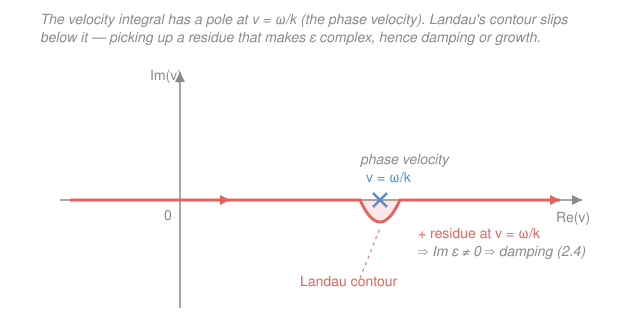

# Plasma Physics · Lesson 2.3: Linearizing Vlasov — the plasma dispersion relation

> ⏱ ~15 min · Module 2: Kinetic theory — Vlasov & Landau damping · Builds on: [2.2 The Vlasov equation](02-02-vlasov-equation.md), [`mathematical-methods-physics`](../../mathematical-methods-physics/syllabus.md) · Unlocks: [2.4 Landau damping](02-04-landau-damping.md)

## Why this matters

In [2.2](02-02-vlasov-equation.md) we wrote the Vlasov equation — the collisionless law for the whole distribution $f(x,v,t)$ — and saw that it is *nonlinear*: the fields push the particles, and the particles source the fields. Nonlinear equations rarely surrender their secrets whole. But there is one trick that always works and is the entire foundation of wave physics: **linearize**. Take a plasma sitting quietly at equilibrium, poke it with an infinitesimal ripple, and ask what the ripple does. The answer is a single algebraic equation — the **dispersion relation** — that tells you every wave the plasma can carry and, remarkably, whether it grows or dies. This lesson builds that machine and uncovers the strange resonant pole that [2.4 Landau damping](02-04-landau-damping.md) is entirely about.

## The idea

Think of the plasma as a still pond. Left alone, the electrons are spread out in a uniform, steady Maxwellian $f_0(v)$ — no lumps, no fields. Now drop a pebble: a tiny density ripple $\propto e^{i(kx-\omega t)}$, a plane wave with wavenumber $k$ and frequency $\omega$. Because the ripple is *small*, everything it does is small too — the perturbed distribution $f_1$ and the electric field $E_1$ it stirs up are both first-order tiny. So when Vlasov hands us a product of two small things (the ripple's field pushing on the ripple's distribution), we **throw it away**: it's second-order, negligible. What's left is linear, and linear means solvable.

The payoff is a beautiful analogy. A dielectric slab responds to an applied field by polarizing, and its **dielectric function** $\varepsilon$ measures how strongly. A plasma does exactly the same: its electrons slosh in response to the wave's own field. So the plasma has a dielectric function $\varepsilon(k,\omega)$ — and a self-sustaining wave is one that needs *no external* field to keep it going. That is precisely the statement $\varepsilon(k,\omega)=0$: **the wave lives where the dielectric vanishes.** Everything below is bookkeeping to compute that $\varepsilon$.

## The formal version

Work in one dimension (motion and $\mathbf E$ along $x$), one mobile species (electrons, charge $q=-e$, mass $m$), on a fixed neutralizing ion background. The **Vlasov–Poisson system** is

$$\frac{\partial f}{\partial t} + v\,\frac{\partial f}{\partial x} + \frac{q}{m}\,E\,\frac{\partial f}{\partial v} = 0, \qquad \frac{\partial E}{\partial x} = \frac{\rho}{\varepsilon_0} = \frac{q}{\varepsilon_0}\!\int (f - f_0)\,dv .$$

*In words: the left equation says $f$ is carried unchanged along particle orbits; the right says the charge left over after the ions cancel the background sources the field.*

**Step 1 — split into equilibrium + ripple.** Write

$$f(x,v,t) = f_0(v) + f_1(x,v,t), \qquad E(x,t) = 0 + E_1(x,t),$$

with $f_1, E_1$ first-order small. The equilibrium $f_0$ is uniform in $x$, steady in $t$, and field-free, so it satisfies Vlasov trivially (that's the Flashback below). Substituting and keeping only first-order terms — the term $\tfrac{q}{m}E_1\,\partial f_1/\partial v$ is a product of two smalls, so it's dropped — gives the **linearized Vlasov equation**:

$$\frac{\partial f_1}{\partial t} + v\,\frac{\partial f_1}{\partial x} + \frac{q}{m}\,E_1\,\frac{\partial f_0}{\partial v} = 0 .$$

*In words: the ripple $f_1$ drifts freely, and it is fed by the wave's field acting on the slope of the background $f_0$.*

**Step 2 — plane-wave ansatz.** Every quantity varies as $e^{i(kx-\omega t)}$, so $\partial_t \to -i\omega$ and $\partial_x \to ik$:

$$\big(-i\omega + ikv\big)f_1 + \frac{q}{m}E_1\,\frac{\partial f_0}{\partial v} = 0 \quad\Longrightarrow\quad \boxed{\,f_1 = \frac{iqE_1}{m}\,\frac{\partial f_0/\partial v}{\,kv-\omega\,}\,}.$$

*In words: the field drives a response proportional to the slope $\partial f_0/\partial v$, divided by how far each particle's speed $v$ sits from resonance.* Watch that denominator.

**Step 3 — close with Poisson.** The ripple's charge density is $\rho_1 = q\!\int f_1\,dv$, and Poisson in Fourier form is $ik E_1 = \rho_1/\varepsilon_0$:

$$ikE_1 = \frac{q}{\varepsilon_0}\int f_1\,dv = \frac{iq^2E_1}{m\varepsilon_0}\int \frac{\partial f_0/\partial v}{\,kv-\omega\,}\,dv .$$

Cancel $iE_1$, write $f_0(v) = n_0\,\hat f_0(v)$ with $\int \hat f_0\,dv = 1$, and use the **plasma frequency** $\omega_p^2 \equiv n_0 q^2/(m\varepsilon_0)$. Dividing through by $k$ and pulling $k$ inside the denominator ($kv-\omega = k(v-\omega/k)$):

$$1 = \frac{\omega_p^2}{k^2}\int \frac{\partial \hat f_0/\partial v}{\,v-\omega/k\,}\,dv .$$

Rearranged, this is the **dispersion relation** $\varepsilon(k,\omega)=0$, with the **plasma dielectric function**

$$\boxed{\;\varepsilon(k,\omega) = 1 - \frac{\omega_p^2}{k^2}\int_{L} \frac{\partial \hat f_0/\partial v}{\,v-\omega/k\,}\,dv \;}$$

*In words: the plasma responds like a dielectric; a wave exists exactly where that dielectric vanishes.* The subscript $L$ on the integral is the piece we now have to earn.

**The resonant denominator.** The integrand blows up when

$$v = \frac{\omega}{k} \equiv v_\varphi,$$

the **phase velocity** of the wave. Physically: particles moving *at the wave speed* see a nearly static field and exchange energy with it resonantly — they surf the wave. This singularity is not a mathematical wart to be papered over; it *is* the physics. Getting it right is the whole game (and the subject of [2.4](02-04-landau-damping.md)).

**Landau's resolution — the contour.** How do we integrate through a pole sitting on the real $v$ axis? Landau's insight was that the problem is not a steady-state one but an **initial-value problem**: at $t=0$ you launch the ripple and watch it evolve. The clean way to do that is a **Laplace transform in time** (a bridge straight to [`mathematical-methods-physics`](../../mathematical-methods-physics/syllabus.md)). The Laplace transform is defined for $\operatorname{Im}\omega > 0$ (a decaying-in-the-future guarantee, i.e. causality), where the pole $\omega/k$ sits *above* the real axis and the integral is unambiguous. To read off real-frequency behavior you **analytically continue** down to $\operatorname{Im}\omega \le 0$, and as the pole crosses the axis the contour must deform to keep passing **below** it. That prescription — the **Landau contour** $L$ — is what the box above encodes. For a simple pole, the Plemelj formula gives

$$\int_L \frac{g(v)}{v-v_\varphi}\,dv = \mathrm{P}\!\int \frac{g(v)}{v-v_\varphi}\,dv \;+\; i\pi\,g(v_\varphi),$$

*In words: the Landau integral is the principal value (the symmetric average through the pole) plus $i\pi$ times the residue — the half-loop the contour makes under the pole.* That extra $i\pi\,g(v_\varphi)$ makes $\varepsilon$ **complex even for real $k$**, so the root $\omega$ picks up a small imaginary part: a damping rate if negative, a growth rate if positive. Its size is set by $g(v_\varphi) = \hat f_0'(\omega/k)$ — **the slope of the distribution at the phase velocity** — the single number [2.4](02-04-landau-damping.md) lives on.

## Picture

## Worked examples

**Example 1 — deriving the response $f_1$.** Start from the linearized Vlasov equation and confirm the boxed $f_1$ by direct substitution. With $f_1 \propto e^{i(kx-\omega t)}$,

$$\underbrace{-i\omega f_1}_{\partial_t f_1} + \underbrace{ikv\,f_1}_{v\partial_x f_1} + \frac{q}{m}E_1\frac{\partial f_0}{\partial v} = 0 \;\Longrightarrow\; i(kv-\omega)f_1 = -\frac{q}{m}E_1\frac{\partial f_0}{\partial v}.$$

Divide by $i(kv-\omega)$ and use $1/i = -i$:

$$f_1 = -\frac{1}{i(kv-\omega)}\frac{q}{m}E_1\frac{\partial f_0}{\partial v} = \frac{iqE_1}{m}\frac{\partial f_0/\partial v}{kv-\omega}. \checkmark$$

Notice the *structure*: response $\propto$ (drive $E_1$) $\times$ (slope $\partial f_0/\partial v$) $/$ (detuning $kv-\omega$). No slope, no response — a flat $f_0$ can't feed a wave. And the loudest response comes from particles nearly on resonance, $v\approx\omega/k$, exactly where the denominator is smallest.

**Example 2 — the cold-plasma limit (bridge to [4.1](04-01-langmuir-cold-plasma-dielectric.md)).** Take every electron at rest: $\hat f_0(v)=\delta(v)$, a spike at $v=0$. Then $\hat f_0'(v)=\delta'(v)$, and we integrate by parts (boundary terms vanish):

$$\int \frac{\delta'(v)}{v-\omega/k}\,dv = -\left.\frac{d}{dv}\!\left(\frac{1}{v-\omega/k}\right)\right|_{v=0} = \left.\frac{1}{(v-\omega/k)^2}\right|_{v=0} = \frac{k^2}{\omega^2}.$$

Substituting into the dielectric,

$$\varepsilon(k,\omega) = 1 - \frac{\omega_p^2}{k^2}\cdot\frac{k^2}{\omega^2} = 1 - \frac{\omega_p^2}{\omega^2}.$$

Setting $\varepsilon=0$ gives $\omega^2 = \omega_p^2$, i.e. $\boxed{\omega = \omega_p}$ — the **Langmuir oscillation**, independent of $k$. Because $f_0$ is a spike with no spread, there are no resonant particles and no imaginary part: cold plasma oscillates forever. Give the electrons a temperature and the pole starts biting — that's the warm correction (Bohm–Gross) and Landau damping ahead.

## Watch out

- **You might think dropping the $E_1\,\partial f_1/\partial v$ term is optional bookkeeping.** It's the *definition* of linearization: that term is the only place the wave acts on its own perturbation, and keeping it makes the equation nonlinear again. It comes back as *nonlinear* effects (particle trapping, wave–wave coupling) only at larger amplitude — beyond this lesson.
- **You might treat the pole as "just a divergence" and take a principal value.** The principal value alone throws away the $i\pi$ residue — and with it, all of Landau damping. The contour is fixed by causality (the initial-value/Laplace setup), not by convenience: it passes **below** the pole, period.
- **You might lose the sign of $\varepsilon$.** Get it wrong and cold plasma gives $1+\omega_p^2/\omega^2$, whose root is imaginary — nonsense. The physical anchor is unambiguous: the cold limit *must* be $\varepsilon = 1-\omega_p^2/\omega^2$ with root $\omega=\omega_p$. If your sign fails that test, retrace Steps 2–3.

## One-liner

> Linearize Vlasov–Poisson, ride a plane wave, and the plasma becomes a dielectric $\varepsilon(k,\omega)=1-\dfrac{\omega_p^2}{k^2}\displaystyle\int_L\dfrac{\hat f_0'}{v-\omega/k}\,dv$; waves live at $\varepsilon=0$, and the pole at the phase velocity — handled by the Landau contour — is where damping is born.

## Problems

**P1 (🟢)** A wave has $\omega = 1.2\,\omega_p$ in a plasma with thermal speed $v_{th}=\sqrt{k_BT_e/m}$, at wavenumber $k$ such that $k\,v_{th}=0.3\,\omega_p$. (a) Which particles resonate with this wave — give the resonant velocity $v_\varphi$ in units of $v_{th}$. (b) Are there many or few electrons at that speed for a Maxwellian? What does that suggest about how strongly the wave is damped?

**P2 (🟡)** Cold electrons, $\hat f_0(v)=\delta(v)$, but now on a *moving* background: every electron drifts at speed $u$, so $\hat f_0(v)=\delta(v-u)$. Compute $\varepsilon(k,\omega)$ and the dispersion relation. (Bridge: this Doppler-shifted oscillation is the seed of the two-stream instability in [4.1](04-01-langmuir-cold-plasma-dielectric.md)'s neighborhood.)

**P3 (🔴, optional)** Using the Plemelj/Landau result, write the imaginary part $\operatorname{Im}\varepsilon$ for real $k$ in terms of the slope $\hat f_0'(v_\varphi)$. For a Maxwellian $\hat f_0(v)=\tfrac{1}{\sqrt{2\pi}\,v_{th}}e^{-v^2/2v_{th}^2}$ with phase velocity $v_\varphi>0$, determine the *sign* of $\operatorname{Im}\varepsilon$, and argue (qualitatively) whether the wave damps or grows. (This is the whole result of [2.4](02-04-landau-damping.md), previewed.)

Solutions

**P1** (a) Resonance is at the phase velocity $v_\varphi=\omega/k$. Divide by $v_{th}$: $v_\varphi/v_{th} = \omega/(k\,v_{th}) = 1.2\,\omega_p/(0.3\,\omega_p) = 4.0$. So $v_\varphi = 4\,v_{th}$ — particles moving at four times the thermal speed.

(b) A Maxwellian falls off as $e^{-v^2/2v_{th}^2}$, so at $v=4v_{th}$ the population is $\propto e^{-8}\approx 3\times10^{-4}$ of the peak — *very few* electrons resonate. Few resonant particles means weak wave–particle energy exchange, so the wave is only lightly damped. (This is exactly why Langmuir waves with $k\lambda_D\ll1$, hence $v_\varphi\gg v_{th}$, are long-lived.)

*Check.* $v_\varphi/v_{th}$ is dimensionless ✓, and it grows as $k$ shrinks — long-wavelength waves outrun the thermal bulk, consistent with weak damping at small $k$. ✓

**P2** With $\hat f_0(v)=\delta(v-u)$, $\hat f_0'(v)=\delta'(v-u)$. By parts,

$$\int \frac{\delta'(v-u)}{v-\omega/k}\,dv = \left.\frac{1}{(v-\omega/k)^2}\right|_{v=u} = \frac{1}{(u-\omega/k)^2} = \frac{k^2}{(ku-\omega)^2}.$$

Hence

$$\varepsilon(k,\omega) = 1 - \frac{\omega_p^2}{k^2}\cdot\frac{k^2}{(ku-\omega)^2} = 1 - \frac{\omega_p^2}{(\omega-ku)^2},$$

and $\varepsilon=0$ gives $(\omega-ku)^2=\omega_p^2$, i.e. $\omega = ku \pm \omega_p$. 

*In words: it's the same Langmuir oscillation, Doppler-shifted by the drift $ku$.* Setting $u=0$ recovers Example 2. Two counter-streaming such populations ($\pm u$) give two poles whose interaction can drive growth — the two-stream instability.

*Check.* $u\to0 \Rightarrow \omega=\pm\omega_p$ ✓. Units: $ku$ has units of frequency (rad/s) like $\omega_p$ ✓.

**P3** From the Plemelj formula, the $i\pi\,\hat f_0'(v_\varphi)$ term is the only imaginary contribution (for real $k$, the principal value is real):

$$\operatorname{Im}\varepsilon = -\frac{\omega_p^2}{k^2}\,\pi\,\hat f_0'(v_\varphi) = -\frac{\pi\,\omega_p^2}{k^2}\,\hat f_0'\!\left(\frac{\omega}{k}\right).$$

For a Maxwellian, $\hat f_0'(v) = -\dfrac{v}{v_{th}^2}\,\hat f_0(v)$, which is **negative** for any $v_\varphi>0$ (the distribution is falling on the positive-velocity side). So $\hat f_0'(v_\varphi)<0$, and $\operatorname{Im}\varepsilon = -\tfrac{\pi\omega_p^2}{k^2}\hat f_0'(v_\varphi) > 0$.

A positive $\operatorname{Im}\varepsilon$ (with $\partial\varepsilon_r/\partial\omega>0$) pushes the root $\omega=\omega_r+i\gamma$ to $\gamma<0$: the wave **damps**. Physically, a falling $f_0$ means slightly more electrons just below $v_\varphi$ (which gain energy from the wave) than just above it (which give energy back), so on net the wave loses energy to the particles. Flip the slope — make $\hat f_0'(v_\varphi)>0$, a "bump on tail" — and $\gamma>0$: the wave **grows**. That sign flip is the entire content of [2.4](02-04-landau-damping.md).

*Check.* The result depends only on the *slope* at $v_\varphi$, matching the intuition that resonant particles at the wave speed decide the wave's fate. For a monotonically decreasing $f_0$ (any thermal plasma), damping is guaranteed — as it must be for a stable equilibrium. ✓

## Flashback

**From Lesson 2.2 (The Vlasov equation):** Show that any spatially uniform, time-independent distribution $f_0(v)$ in a field-free plasma ($E=0$) is an exact solution of the Vlasov equation — i.e. it is a genuine equilibrium, the state this lesson perturbs. (Fresh variant: last time you checked a specific $f_0$; here argue it for *any* $f_0(v)$.)

Solution

Evaluate the three Vlasov terms for $f_0=f_0(v)$ with $E=0$:

$$\frac{\partial f_0}{\partial t} = 0 \ (\text{time-independent}), \qquad v\,\frac{\partial f_0}{\partial x} = 0 \ (\text{uniform in }x), \qquad \frac{q}{m}E\,\frac{\partial f_0}{\partial v} = 0 \ (E=0).$$

All three vanish, so $\partial_t f_0 + v\,\partial_x f_0 + \tfrac{q}{m}E\,\partial_v f_0 = 0$ holds identically. Any velocity-only distribution with no fields is a stationary solution — a special case of Jeans' theorem (any function of the constants of motion solves Vlasov; here the constant is $v$ itself, since a free particle in no field keeps its velocity).

*Check.* Consistency with Step 1: this is exactly why the zeroth-order (equilibrium) Vlasov equation is satisfied automatically, leaving only the first-order equation to solve. A Maxwellian $f_0(v)\propto e^{-mv^2/2k_BT}$ is one such equilibrium — the one we linearize around throughout Module 2. ✓

## Connections

- **Backward:** this is [2.2](02-02-vlasov-equation.md)'s Vlasov equation, tamed by linearization, closed with the same Poisson coupling that made it self-consistent. The moments $n,\,u$ of the perturbation (from [2.1](02-01-distribution-function-moments.md)) are just velocity integrals of the $f_1$ we found here.
- **Forward:** [2.4 Landau damping](02-04-landau-damping.md) evaluates the Landau integral for a Maxwellian and extracts $\gamma$ — the imaginary part this lesson set up. The cold limit $\varepsilon=1-\omega_p^2/\omega^2$ reappears as the backbone of [4.1 Langmuir & the cold-plasma dielectric](04-01-langmuir-cold-plasma-dielectric.md), and the warm correction there gives the Bohm–Gross dispersion of Boss Problem 2.
- **Sideways (complex analysis):** the Laplace transform in time and the contour/residue handling of the pole are textbook [`mathematical-methods-physics`](../../mathematical-methods-physics/syllabus.md) — analytic continuation, the Plemelj formula, and residues doing physical work. The Landau prescription is a causality condition dressed as a contour choice.
