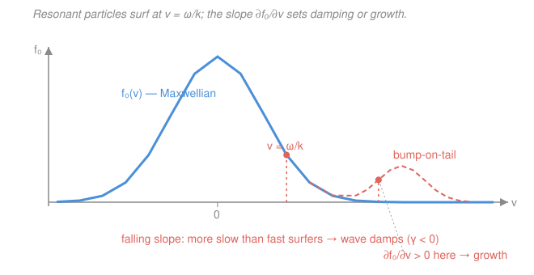

# Plasma Physics · Lesson 2.4: Landau damping

> ⏱ ~15 min · Module 2: Kinetic theory — Vlasov & Landau damping · Builds on: [2.3 Linearizing Vlasov: the plasma dispersion relation](02-03-linearizing-vlasov-dispersion.md) · Unlocks: [3.1 From kinetic to fluid: the two-fluid equations](03-01-two-fluid-equations.md)

## Why this matters

In [2.3](02-03-linearizing-vlasov-dispersion.md) the dielectric function $\varepsilon(k,\omega)$ picked up an *imaginary* piece — a residue sitting at the pole $v=\omega/k$ — and we deferred asking what it means. Here is what it means: a plasma wave can **die out even though nothing in the plasma ever collides**. No friction, no viscosity, no entropy-producing bumps between particles — and yet the wave's energy drains away. Landau proved this in 1946 from the mathematics alone, and it was so counterintuitive that it took nearly twenty years and a laboratory experiment to convince people it was real. It is the most beautiful surprise in plasma physics, and once you see the mechanism you can also run it *backwards* to make waves grow — which is the seed of every kinetic instability in Module 4.

## The idea

Picture surfers on an ocean swell. A surfer moving at almost exactly the wave's speed can catch it — and what happens next depends on whether she's a hair slower or a hair faster than the wave. A surfer slightly **slower** than the wave gets caught on the wave's back and shoved **forward**: the wave hands her energy. A surfer slightly **faster** than the wave rides up its front and gets **held back**: she hands energy to the wave. Particles whose velocity is near the wave's phase velocity $v_\phi=\omega/k$ are the plasma's surfers — we call them **resonant particles**, because they see a nearly stationary field and can exchange energy with it steadily instead of just jiggling.

Now the punchline. The wave's net energy budget is a tug-of-war between the slow surfers (taking energy *from* the wave) and the fast surfers (giving energy *to* it). Who wins is decided by **which group is more numerous** — and that is nothing but the **slope of the velocity distribution at $v_\phi$**. For a Maxwellian, $f_0(v)$ is *falling* at any $v_\phi>0$: there are always more particles just below $v_\phi$ than just above it. More slow surfers than fast surfers, so the wave loses the tug-of-war — it pumps energy into the particles it's dragging up toward its own speed, and it **damps**.

> In words: the wave loses energy to the particles it's dragging up to its own speed, because a falling distribution has more freeloaders than pushers.

Flip the distribution's slope — build a population that is *rising* at $v_\phi$, like a beam or a bump on the tail — and now the fast surfers outnumber the slow ones. Net energy flows *into* the wave. Same mechanism, opposite sign: the wave **grows**. That is the two-stream / bump-on-tail instability, and we'll cash it out in [4.4](04-04-instabilities-two-stream-drift.md).

## The formal version

From [2.3](02-03-linearizing-vlasov-dispersion.md), the electrostatic dielectric function for electrons on a fixed ion background is

$$\varepsilon(k,\omega) = 1 - \frac{\omega_p^2}{k^2}\int_L \frac{\partial \hat g/\partial v}{\,v-\omega/k\,}\,dv,$$

where $\omega_p=\sqrt{n_0e^2/\varepsilon_0 m_e}$ is the electron plasma frequency, $\hat g(v)=f_0(v)/n_0$ is the normalized 1-D distribution ($\int\hat g\,dv=1$), and $L$ is the **Landau contour** — the integration path that dips *below* the pole $v=\omega/k$, fixed by causality (the wave was switched on at a finite time). Dispersion means $\varepsilon(k,\omega)=0$. *In words: the plasma supports a wave exactly where its dielectric response vanishes.*

The pole is the whole story. By the Plemelj formula, deforming around it splits the integral into a principal value plus a half-residue:

$$\int_L \frac{\partial\hat g/\partial v}{v-\omega/k}\,dv = \underbrace{\mathrm{P}\!\int \frac{\partial\hat g/\partial v}{v-\omega/k}\,dv}_{\text{real part}} \;+\; \underbrace{i\pi\,\frac{\partial\hat g}{\partial v}\bigg|_{v=\omega/k}}_{\text{resonant part}}.$$

The principal value is real and sets the wave's frequency; the $i\pi(\partial\hat g/\partial v)$ term is imaginary and sits at the resonant velocity. So the imaginary part of the dielectric is

$$\varepsilon_i(k,\omega) = -\frac{\pi\,\omega_p^2}{k^2}\,\frac{\partial\hat g}{\partial v}\bigg|_{v=\omega/k}.$$

*In words: the wave's dissipation is proportional to the slope of the distribution at the phase velocity — nothing else.*

**Weak damping.** Write $\omega=\omega_r+i\gamma$ with $|\gamma|\ll\omega_r$. Then the field goes as $e^{-i\omega t}=e^{-i\omega_r t}e^{\gamma t}$: $\gamma<0$ is decay, $\gamma>0$ is growth. Expanding $\varepsilon(k,\omega_r+i\gamma)=0$ to first order (real part fixes $\omega_r$ via $\varepsilon_r(k,\omega_r)=0$, imaginary part fixes $\gamma$) gives the master formula

$$\boxed{\;\gamma = -\,\frac{\varepsilon_i(k,\omega_r)}{\partial\varepsilon_r/\partial\omega\big|_{\omega_r}} = \frac{\pi\,\omega_p^2}{k^2}\,\frac{1}{\partial\varepsilon_r/\partial\omega}\,\frac{\partial\hat g}{\partial v}\bigg|_{v=\omega_r/k}.\;}$$

For a Langmuir wave $\partial\varepsilon_r/\partial\omega>0$, so **$\gamma$ carries the sign of $\partial\hat g/\partial v$ at $v_\phi$**: negative slope → damping, positive slope → growth. This is the sign rule the whole lesson turns on.

## Picture

## Worked examples

**Example 1 (the sign, read straight off the graph).** For a Maxwellian $\hat g(v)=\frac{1}{\sqrt{2\pi}\,v_{th}}e^{-v^2/2v_{th}^2}$, with thermal speed $v_{th}=\sqrt{k_BT_e/m_e}$, differentiate:

$$\frac{\partial\hat g}{\partial v} = -\frac{v}{v_{th}^2}\,\hat g(v).$$

A Langmuir wave has $v_\phi=\omega_r/k>0$, so $\partial\hat g/\partial v|_{v_\phi}<0$: the slope is negative, hence $\gamma<0$ — the wave **damps**, with no collision anywhere in the derivation. Notice the rate depends on $\hat g$ *evaluated at the phase velocity*, deep in the exponential tail: fewer resonant particles out there means weaker damping, which is why long-wavelength Langmuir waves (small $k$, so $v_\phi$ far out in the tail) are almost undamped.

**Example 2 (why you'd care — the flip to growth).** Take the same Maxwellian bulk but add a fast beam, a small hump centered at some $v_b\gg v_{th}$ (the dashed curve in the figure). On the **rising** (low-velocity) flank of that hump, $\partial\hat g/\partial v>0$. Any wave whose phase velocity $v_\phi=\omega_r/k$ lands on that rising flank has $\gamma>0$: it **grows** exponentially, feeding on the beam's free energy. Same residue, same formula, opposite sign — the plasma has turned a damping mechanism into an amplifier. That single sign flip is the entire physical content of the bump-on-tail and two-stream instabilities in [4.4](04-04-instabilities-two-stream-drift.md), and it's why a distribution with $\partial f_0/\partial v>0$ anywhere is called "kinetically unstable."

## Watch out

- **You might think "no collisions" means "no dissipation" — it doesn't.** Landau damping is collisionless. The energy isn't lost to heat via collisions; it's *transferred* coherently to resonant particles. It looks irreversible because those particles then **phase-mix** — they fan out in phase space and their contributions dephase — but the underlying Vlasov equation is exactly time-reversible. Reconstruct the fine phase-space structure (as in the **plasma echo** experiment) and the "lost" energy comes *back* as a spontaneous echo. Damping of the *macroscopic field* coexists with reversibility of the *microscopic dynamics*.
- **You might read $v=\omega/k$ as "the particle rides the crest forever."** Only exactly-resonant particles do; the near-resonant ones (which do the real energy exchange) slip slowly relative to the wave and get trapped-then-released. The linear theory here assumes they slip before they complete a bounce — valid for small amplitude and early times.
- **You might forget which slope you're standing on.** It is the sign of $\partial f_0/\partial v$ **at the phase velocity**, not at the peak or in the bulk. A Maxwellian is *rising* for $v<0$ — but a wave with $v_\phi>0$ never samples that flank.

## One-liner

> A plasma wave gains or loses energy to the particles surfing at $v=\omega/k$, and the sign is just the sign of $\partial f_0/\partial v$ there — falling Maxwellian damps, rising beam grows.

## Problems

**P1 (🟢)** A Langmuir wave in a Maxwellian plasma has phase velocity $v_\phi=\omega_r/k=3v_{th}>0$. (a) What is the sign of $\gamma$, and does the wave grow or damp? (b) A second plasma has a bump-on-tail distribution whose hump is centered at $4v_{th}$; a wave has $v_\phi=3.5v_{th}$, on the rising flank of the hump. What is the sign of $\gamma$ now? State the one quantity that decides both answers.

**P2 (🟡)** For a Langmuir wave with $k\lambda_D=0.3$: (a) use the Bohm–Gross relation $\omega_r^2=\omega_p^2(1+3k^2\lambda_D^2)$ to find $\omega_r/\omega_p$ and the phase velocity in units of $v_{th}$ (recall $\lambda_D=v_{th}/\omega_p$). (b) In one sentence, explain why the Landau damping rate becomes *large* (comparable to $\omega_r$) as $k\lambda_D\to 1$, using the fact that $\gamma\propto\hat g(v_\phi)$.

**P3 (🔴, Boss problem 2)** Starting from the electron dielectric $\varepsilon(k,\omega)=1-\frac{\omega_p^2}{k^2}\int_L\frac{\partial\hat g/\partial v}{v-\omega/k}\,dv$ for a Maxwellian, (a) expand the principal-value (real) part for $\omega_r/k\gg v_{th}$ to recover the Bohm–Gross frequency $\omega_r^2=\omega_p^2(1+3k^2\lambda_D^2)$; (b) evaluate the residue (imaginary) part to get the Landau damping rate; (c) show $\gamma<0$ for the Maxwellian and state precisely what feature of $f_0(v)$ flips it to $\gamma>0$.

Solutions

**P1** (a) For a Maxwellian, $\partial\hat g/\partial v=-(v/v_{th}^2)\hat g<0$ at $v_\phi=3v_{th}>0$. Since $\partial\varepsilon_r/\partial\omega>0$ for a Langmuir wave, the master formula gives $\gamma\propto\partial\hat g/\partial v|_{v_\phi}<0$: **$\gamma<0$, the wave damps.** (b) On the rising flank of the hump, $\partial\hat g/\partial v>0$, so $\gamma>0$: **the wave grows** (bump-on-tail instability). The single deciding quantity is **the sign of $\partial f_0/\partial v$ evaluated at the phase velocity $v=\omega_r/k$**.

*Check.* Both answers came from one slope, no new physics — exactly the "same mechanism, opposite sign" claim. Falling → damp, rising → grow. ✓

**P2** (a) $\omega_r^2=\omega_p^2(1+3(0.3)^2)=\omega_p^2(1+0.27)=1.27\,\omega_p^2$, so $\omega_r/\omega_p=\sqrt{1.27}\approx1.127$. Phase velocity: $v_\phi=\omega_r/k=(\omega_r/\omega_p)(\omega_p/k)=(\omega_r/\omega_p)\,v_{th}/(k\lambda_D)=1.127\,v_{th}/0.3\approx3.76\,v_{th}$. (b) As $k\lambda_D\to1$, the phase velocity drops toward $v_\phi\sim v_{th}$ — out of the sparse tail and into the bulk of the distribution — so $\hat g(v_\phi)$ and its slope are large, and there are many resonant particles: the damping becomes strong (order $\omega_r$), and the wave barely propagates before dying.

*Check.* At $k\lambda_D=0.3$, $v_\phi\approx3.8\,v_{th}$ sits far in the tail where $\hat g\propto e^{-v_\phi^2/2v_{th}^2}\sim e^{-7}$ is tiny — so this wave is weakly damped, consistent with $\gamma$ being exponentially small at small $k\lambda_D$. ✓

**P3** Write $v_\phi=\omega/k$ and split the Landau integral by Plemelj (see "The formal version").

**(a) Real part → Bohm–Gross.** In $\mathrm{P}\!\int\frac{\partial\hat g/\partial v}{v-v_\phi}dv$, integrate by parts to move the derivative onto the pole, then expand $\frac{1}{v-v_\phi}=-\frac{1}{v_\phi}\big(1+\frac{v}{v_\phi}+\frac{v^2}{v_\phi^2}+\frac{v^3}{v_\phi^3}+\cdots\big)$ for $v_\phi\gg v_{th}$. Using $\int\hat g\,dv=1$, $\int v\hat g\,dv=0$, $\int v^2\hat g\,dv=v_{th}^2$, $\int v^3\hat g\,dv=0$, the surviving terms give

$$\frac{\omega_p^2}{k^2}\,\mathrm{P}\!\int\frac{\partial\hat g/\partial v}{v-v_\phi}\,dv \;\approx\; \frac{\omega_p^2}{\omega^2}\left(1+\frac{3k^2v_{th}^2}{\omega^2}\right),$$

so $\varepsilon_r=1-\dfrac{\omega_p^2}{\omega^2}-\dfrac{3\omega_p^2k^2v_{th}^2}{\omega^4}=0$. Solving iteratively with $\omega^2\approx\omega_p^2$ in the small correction, and $\lambda_D^2=v_{th}^2/\omega_p^2$,

$$\omega_r^2=\omega_p^2+3k^2v_{th}^2=\omega_p^2\left(1+3k^2\lambda_D^2\right). \qquad\text{(Bohm–Gross)}$$

**(b) Imaginary part → Landau rate.** From the residue, $\varepsilon_i=-\dfrac{\pi\omega_p^2}{k^2}\dfrac{\partial\hat g}{\partial v}\Big|_{v_\phi}$ with $\dfrac{\partial\hat g}{\partial v}\Big|_{v_\phi}=-\dfrac{v_\phi}{v_{th}^2}\dfrac{1}{\sqrt{2\pi}\,v_{th}}e^{-v_\phi^2/2v_{th}^2}$. With $\partial\varepsilon_r/\partial\omega\approx2\omega_p^2/\omega_r^3$, the master formula gives

$$\gamma=-\frac{\varepsilon_i}{\partial\varepsilon_r/\partial\omega} = -\sqrt{\frac{\pi}{8}}\;\frac{\omega_p}{(k\lambda_D)^3}\,\exp\!\left(-\frac{1}{2k^2\lambda_D^2}-\frac{3}{2}\right),$$

using $v_\phi^2/2v_{th}^2=\omega_r^2/(2k^2v_{th}^2)=1/(2k^2\lambda_D^2)+3/2$ from the Bohm–Gross $\omega_r$.

**(c) Sign.** The prefactor and the exponential are strictly positive, so the leading minus sign makes $\gamma<0$: the Maxwellian **always damps**. Its origin is the single factor $\partial\hat g/\partial v|_{v_\phi}<0$ — the distribution falls at the (positive) phase velocity. The rate flips to $\gamma>0$ (growth) precisely when $f_0(v)$ has a **region of positive slope**, $\partial f_0/\partial v>0$, at the phase velocity — a beam or bump-on-tail. Everything else in the formula stays positive.

*Check.* Units: $[\gamma]=[\omega_p]=\mathrm{s}^{-1}$ ✓, and $k\lambda_D$ is dimensionless ✓. Limit: as $k\lambda_D\to0$ the exponential $e^{-1/2k^2\lambda_D^2}\to0$ faster than the $1/(k\lambda_D)^3$ blows up, so $\gamma\to0$ — long waves are essentially undamped, matching Example 1. ✓

## Flashback

**From Lesson 2.3 (Linearizing Vlasov: the plasma dispersion relation):** Take the **cold-plasma limit** of the dielectric — drop all thermal motion, so $\hat g(v)\to\delta(v)$ and every particle sits at $v=0$. Show that $\varepsilon(k,\omega)=0$ then gives $\omega=\omega_p$, independent of $k$, and say in one sentence what physical wave this is and why it doesn't propagate.

Solution

With $\hat g=\delta(v)$, integrate the dielectric by parts: $\int\frac{\partial\hat g/\partial v}{v-\omega/k}dv=\int\frac{\hat g}{(v-\omega/k)^2}dv=\frac{1}{(0-\omega/k)^2}=\frac{k^2}{\omega^2}$ (the pole is off the real axis for a cold plasma, so no residue — no Landau damping without a spread in velocities). Then

$$\varepsilon=1-\frac{\omega_p^2}{k^2}\cdot\frac{k^2}{\omega^2}=1-\frac{\omega_p^2}{\omega^2}=0\;\Longrightarrow\;\omega=\omega_p.$$

This is the **Langmuir oscillation**: the electrons slosh against the ions at the plasma frequency. Because $\omega=\omega_p$ carries no $k$, the group velocity $\partial\omega/\partial k=0$ — it's a standing oscillation, not a traveling wave. Thermal motion (the Bohm–Gross correction of this lesson) is exactly what gives it a nonzero group velocity *and* opens the door to Landau damping.

*Check.* Recovering $\omega=\omega_p$ from the full kinetic dielectric in the cold limit is the consistency test that the linearization in 2.3 was done right; restoring $v_{th}$ turns this into $\omega_r^2=\omega_p^2(1+3k^2\lambda_D^2)$. ✓

## Connections

- **Backward:** this is the residue at $v=\omega/k$ that [2.3](02-03-linearizing-vlasov-dispersion.md) produced from the Landau contour, finally cashed out physically; the Maxwellian slope $\partial\hat g/\partial v$ comes from the equilibrium distribution of [`stat-mech`](../../stat-mech/syllabus.md), and the contour/residue machinery is complex-analysis from [`mathematical-methods-physics`](../../mathematical-methods-physics/syllabus.md).
- **Forward:** the sign rule runs both ways — a positive slope $\partial f_0/\partial v>0$ makes $\gamma>0$, the engine of the **two-stream and bump-on-tail instabilities** in [4.4](04-04-instabilities-two-stream-drift.md); the same resonance drives **ion** Landau damping of ion-acoustic waves in [4.2](../../plasma-physics/syllabus.md). Next lesson [3.1](03-01-two-fluid-equations.md) steps away from the full distribution and takes *moments* of Vlasov — trading this resonant physics for the simpler fluid picture (which, tellingly, cannot see Landau damping at all).
- **Sideways:** the wave–particle energy exchange here is the kinetic cousin of resonance in a driven oscillator ([`mechanics-refresher` 3.2](../../mechanics-refresher/lessons/03-02-damped-driven-oscillations.md)) — energy flows fastest when driver and response are near the same frequency; here "near the same speed," $v\approx\omega/k$, plays that role.
