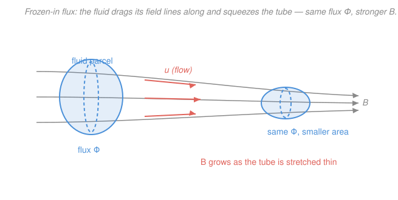

# Plasma Physics · Lesson 3.2: The ideal-MHD equations & frozen-in flux

> ⏱ ~15 min · Module 3: The fluid picture & MHD · Builds on: [3.1 From kinetic to fluid: the two-fluid equations](03-01-two-fluid-equations.md), [`em-refresher` syllabus](../../em-refresher/syllabus.md) · Unlocks: [3.3 Magnetic pressure, tension & plasma beta](03-03-magnetic-pressure-tension-beta.md)

## Why this matters

Most of the visible universe — stars, the solar wind, accretion disks, the interstellar medium — is a plasma so large and so well-conducting that you can throw away almost everything: two species, kinetic details, even the electric field. What's left is one electrically conducting fluid carrying a magnetic field, governed by **magnetohydrodynamics (MHD)**. And in the ideal limit MHD hands you one astonishingly powerful idea: **the magnetic field is frozen into the fluid**. Field lines are dragged wherever the plasma flows and drag the plasma with them wherever they go. That single sentence explains why the Sun's field is twisted into sunspots, why galactic fields survive for billions of years, and why fusion reactors can hold plasma on invisible magnetic rails. It also tells you exactly what ideal MHD *cannot* do — untie a field line — which is why reconnection ([5.4](05-04-magnetic-reconnection.md)) needs to break the ideal limit.

## The idea

In [3.1](03-01-two-fluid-equations.md) we had two interpenetrating fluids, electrons and ions, each with its own continuity and momentum equation. But on scales much larger than a Larmor radius and timescales much slower than a gyration, the two species move together: quasineutrality glues their densities, and their tiny relative drift is just the current. So collapse them into **one** fluid with a single mass density, a single flow velocity, and a current $\mathbf{J}$ that the magnetic field pushes on. That collapse is MHD.

The magic ingredient is that a plasma is an *outstanding* conductor. In a perfect conductor charges rearrange instantly to cancel any electric field — so in the frame moving with the fluid, $\mathbf{E}=0$. Feed that into Faraday's law and you learn that the field can only change by being *carried around* by the flow, never by leaking through it. Picture the field lines threaded through the fluid like elastic bands frozen into a block of jelly: squeeze the jelly and the bands squeeze with it; stretch it and they stretch; but a band can never cut across to the other side. Plasma and field are welded together.

## The formal version

**Single-fluid variables.** From the two species (mass $m_s$, density $n_s$, velocity $\mathbf{u}_s$) build the mass density, flow, and current:

$$\rho = \sum_s n_s m_s \approx n m_i, \qquad \mathbf{u} = \frac{1}{\rho}\sum_s n_s m_s \mathbf{u}_s, \qquad \mathbf{J} = \sum_s n_s q_s \mathbf{u}_s .$$

*In words: $\rho$ is total mass per volume (ions dominate the mass), $\mathbf{u}$ is the center-of-mass velocity, and $\mathbf{J}$ is the net charge flux — the current.* Here $q_s$ is the charge of species $s$ and $n$ the number density.

**The ideal-MHD equations.** Adding the species equations gives a closed set:

$$\frac{\partial \rho}{\partial t} + \nabla\cdot(\rho\mathbf{u}) = 0 \qquad \text{(continuity)}$$

$$\rho\,\frac{D\mathbf{u}}{Dt} = \mathbf{J}\times\mathbf{B} - \nabla p, \qquad \frac{D}{Dt} \equiv \frac{\partial}{\partial t} + \mathbf{u}\cdot\nabla \qquad \text{(momentum)}$$

$$\frac{D}{Dt}\!\left(\frac{p}{\rho^{\gamma}}\right) = 0 \qquad \text{(adiabatic equation of state)}$$

closed by the low-frequency Maxwell equations,

$$\nabla\times\mathbf{B} = \mu_0\mathbf{J}, \qquad \nabla\times\mathbf{E} = -\frac{\partial\mathbf{B}}{\partial t}, \qquad \nabla\cdot\mathbf{B}=0 .$$

*In words: mass is conserved; the fluid is accelerated by the magnetic force $\mathbf{J}\times\mathbf{B}$ and the pressure gradient $-\nabla p$; entropy rides along with each parcel ($\gamma$ is the adiabatic index, $p$ the scalar pressure); Ampère's law (displacement current dropped — MHD is slow) ties the current to the field's curl, and Faraday ties the field's change to the electric field.* The material derivative $D/Dt$ means "rate of change following a fluid parcel."

**Generalized Ohm's law — and its ideal limit.** The one missing equation relates $\mathbf{E}$ to the flow. Subtracting the electron momentum equation from the ion one gives the generalized Ohm's law,

$$\mathbf{E} + \mathbf{u}\times\mathbf{B} = \eta\mathbf{J} + \underbrace{\frac{1}{ne}\left(\mathbf{J}\times\mathbf{B} - \nabla p_e\right)}_{\text{Hall + electron pressure}} + \underbrace{\frac{m_e}{ne^2}\frac{\partial \mathbf{J}}{\partial t}}_{\text{electron inertia}},$$

where $\eta$ is the resistivity ($\Omega\,\mathrm{m}$), $e$ the elementary charge, $p_e$ the electron pressure. **Ideal MHD** is the limit where the plasma conducts perfectly ($\eta\to 0$) and the small-scale Hall and inertia terms are negligible, leaving

$$\boxed{\;\mathbf{E} + \mathbf{u}\times\mathbf{B} = 0\;}$$

*In words: the electric field vanishes in the fluid's rest frame — a perfect conductor cannot sustain one.* The only $\mathbf{E}$ in the lab frame is the motional $\mathbf{E} = -\mathbf{u}\times\mathbf{B}$.

**The induction equation.** Put the ideal Ohm's law $\mathbf{E} = -\mathbf{u}\times\mathbf{B}$ into Faraday's law:

$$\frac{\partial\mathbf{B}}{\partial t} = -\nabla\times\mathbf{E} = \nabla\times(\mathbf{u}\times\mathbf{B}).$$

Keeping a small resistivity ($\mathbf{E} = -\mathbf{u}\times\mathbf{B} + \eta\mathbf{J}$, with $\mathbf{J}=\nabla\times\mathbf{B}/\mu_0$ and $\nabla\times(\nabla\times\mathbf{B}) = -\nabla^2\mathbf{B}$ since $\nabla\cdot\mathbf{B}=0$) gives the full form:

$$\frac{\partial\mathbf{B}}{\partial t} = \underbrace{\nabla\times(\mathbf{u}\times\mathbf{B})}_{\text{advection}} + \underbrace{\frac{\eta}{\mu_0}\nabla^2\mathbf{B}}_{\text{diffusion}}.$$

*In words: the field is carried along by the flow (first term) while also leaking through it by resistive diffusion (second term) — the same advection-plus-diffusion structure as a dye stirred into a viscous, slightly leaky fluid.* In ideal MHD the diffusion term is zero.

**Alfvén's theorem (frozen-in flux).** The flux $\Phi = \int_S \mathbf{B}\cdot d\mathbf{A}$ through any surface $S$ moving with the fluid obeys

$$\frac{d\Phi}{dt} = \int_S\!\left(\frac{\partial\mathbf{B}}{\partial t} - \nabla\times(\mathbf{u}\times\mathbf{B})\right)\!\cdot d\mathbf{A} = 0 \quad\text{(ideal MHD).}$$

*In words: the magnetic flux threading any patch of fluid never changes as that patch moves and deforms — plasma and field lines are glued together. Where the plasma goes it drags its field; where the field goes it carries the plasma.* The two terms are exactly the ideal induction equation, so they cancel. Consequences: field-line **topology is preserved** (no line ever breaks or reconnects), the field is **amplified when flux tubes are stretched or compressed** (the engine of dynamos), and the field takes on **mechanical properties** — a pressure and a tension — which is [3.3](03-03-magnetic-pressure-tension-beta.md).

**When it breaks.** Frozen-in is only as good as $\eta\to 0$. The ratio of the advection term to the diffusion term is the **magnetic Reynolds number**

$$R_m = \frac{|\nabla\times(\mathbf{u}\times\mathbf{B})|}{|(\eta/\mu_0)\nabla^2\mathbf{B}|} \sim \frac{\mu_0 u L}{\eta},$$

with $u$ a characteristic speed and $L$ a characteristic length. *In words: $R_m\gg1$ means the field is frozen in and simply advected (astrophysics, where $L$ is huge); $R_m\sim1$ means the field slips through the plasma and can diffuse and reconnect (resistive layers, lab plasmas) — the subject of [5.4](05-04-magnetic-reconnection.md).*

## Picture

## Worked examples

**Example 1 (mechanical — reduce Ohm's law, get the induction equation).** Start from the generalized Ohm's law and take the ideal limit. As $\eta\to 0$, the resistive term $\eta\mathbf{J}\to 0$; on MHD scales ($L\gg$ ion skin depth, timescales $\gg$ gyroperiod) the Hall, electron-pressure, and inertia terms are smaller than $\mathbf{u}\times\mathbf{B}$ by factors of order (gyroradius/$L$) and vanish too. What survives is $\mathbf{E} = -\mathbf{u}\times\mathbf{B}$. Substituting into Faraday's law:

$$\frac{\partial\mathbf{B}}{\partial t} = -\nabla\times\mathbf{E} = \nabla\times(\mathbf{u}\times\mathbf{B}).$$

There is no $\mathbf{B}$ on the right that isn't multiplied by $\mathbf{u}$: with $\mathbf{u}=0$ the field is frozen still, and any change to $\mathbf{B}$ must be produced by *moving* the fluid. That is frozen-in flux in one line.

**Example 2 (why you'd care — flux compression amplifies the field).** A cylindrical plasma column of radius $a$ carries an axial field $B$. Compress it radially (at fixed length) to radius $a/2$. Frozen-in flux means the axial flux $\Phi = \pi a^2 B$ is conserved:

$$\pi a^2 B = \pi (a/2)^2 B' \quad\Longrightarrow\quad B' = 4B.$$

Halving the radius quadruples the field — no batteries, no coils, just squeezing. The same bookkeeping run backwards explains dynamos (stretching a tube thins it and *raises* $B$) and the crushing megagauss fields of collapsing stars. Note that mass is conserved too: the volume drops by $4$, so $\rho' = 4\rho$, and here $B\propto\rho$ — the field and the plasma are compressed in lockstep, exactly as "frozen together" demands.

## Watch out

- **You might think ideal MHD means $\mathbf{E}=0$ everywhere.** No — it means $\mathbf{E}=0$ in the *fluid rest frame*. In the lab frame there is a perfectly good motional field $\mathbf{E}=-\mathbf{u}\times\mathbf{B}$; it just does no work in the comoving frame and cannot drive a current through the plasma.
- **You might think "frozen-in" forbids all motion of the plasma relative to the field.** It only forbids motion *across* field lines. Plasma slides freely *along* lines (nothing stops flow parallel to $\mathbf{B}$); it just can't cross them. Field lines and fluid share the same perpendicular motion, not the same parallel motion.
- **You might think large resistivity is what breaks frozen-in.** It's the *magnetic Reynolds number* $R_m=\mu_0 uL/\eta$ that matters, not $\eta$ alone. The solar corona has a real resistivity, yet $L$ is so enormous that $R_m\sim10^{10}$ and the field is frozen in almost everywhere — except in thin current sheets where $L$ collapses and $R_m$ drops to order unity, letting reconnection happen.

## One-liner

> In a perfect conductor $\mathbf{E}+\mathbf{u}\times\mathbf{B}=0$, so $\partial\mathbf{B}/\partial t=\nabla\times(\mathbf{u}\times\mathbf{B})$ and the flux through every comoving loop is frozen — plasma and field lines move as one until resistivity ($R_m\sim1$) lets them slip.

## Problems

**P1 (🟢)** Starting from the generalized Ohm's law, write the condition on the plasma that produces the ideal-MHD law $\mathbf{E}+\mathbf{u}\times\mathbf{B}=0$, and state what the electric field is in (a) the fluid rest frame and (b) the lab frame.

**P2 (🟡)** An interstellar cloud of radius $R_1 = 10^{16}\,\mathrm{m}$ is threaded by a uniform field $B_1 = 10^{-9}\,\mathrm{T}$ (1 nT). It collapses under gravity to a protostar core of radius $R_2 = 10^{9}\,\mathrm{m}$. Assuming frozen-in flux and that the field stays roughly aligned with the collapse, estimate the field $B_2$. Comment on whether the answer is physically reasonable.

**P3 (🔴, optional)** Estimate the magnetic Reynolds number $R_m = \mu_0 u L/\eta$ for (a) a lab plasma with $u\sim10^{3}\,\mathrm{m/s}$, $L\sim0.1\,\mathrm{m}$, $\eta\sim10^{-4}\,\Omega\,\mathrm{m}$, and (b) the solar corona with $u\sim10^{4}\,\mathrm{m/s}$, $L\sim10^{7}\,\mathrm{m}$, $\eta\sim10^{-6}\,\Omega\,\mathrm{m}$. In which is the field frozen in, and in which can it diffuse or reconnect? ($\mu_0 = 4\pi\times10^{-7}\,\mathrm{T\,m/A}$.)

Solutions

**P1** The generalized Ohm's law is $\mathbf{E}+\mathbf{u}\times\mathbf{B} = \eta\mathbf{J} + \tfrac{1}{ne}(\mathbf{J}\times\mathbf{B}-\nabla p_e) + \tfrac{m_e}{ne^2}\partial_t\mathbf{J}$. Ideal MHD requires a perfect conductor, $\eta\to0$, and that the plasma be examined on scales $L\gg$ the ion skin depth / gyroradius and timescales $\gg$ the gyroperiod, so the Hall, electron-pressure, and electron-inertia terms are all negligible. Then the entire right side drops and

$$\mathbf{E}+\mathbf{u}\times\mathbf{B}=0.$$

(a) In the fluid rest frame $\mathbf{u}=0$, so $\mathbf{E}'=0$: no electric field. (b) In the lab frame $\mathbf{E} = -\mathbf{u}\times\mathbf{B}$, the motional field, perpendicular to both $\mathbf{u}$ and $\mathbf{B}$.

*Check.* Dimensionally $[\mathbf{u}\times\mathbf{B}] = (\mathrm{m/s})(\mathrm{T}) = \mathrm{V/m}=[\mathbf{E}]$ ✓. Limiting sense: a perfect conductor at rest has no internal field, as electrostatics demands. ✓

**P2** Flux through the cloud's cross-section is conserved: $\Phi = \pi R^2 B = \text{const}$, so

$$B_2 = B_1\left(\frac{R_1}{R_2}\right)^2 = 10^{-9}\left(\frac{10^{16}}{10^{9}}\right)^2 = 10^{-9}\times(10^{7})^2 = 10^{-9}\times10^{14} = 10^{5}\,\mathrm{T}.$$

That is $10^9$ gauss — far larger than any observed stellar field ($\sim$ kilogauss to megagauss). The lesson: **pure flux-freezing over 7 decades of collapse overpredicts wildly**, which is exactly why real star formation must shed magnetic flux (via finite resistivity / ambipolar diffusion, i.e. the *breakdown* of frozen-in). The idealization gives the right scaling but the wrong number — a signpost that $R_m$ is not infinite over such collapses.

*Check.* $B\propto R^{-2}$: shrinking the radius by $10^{7}$ raises $B$ by $10^{14}$ ✓. Units unchanged (T). The absurd magnitude is the physical point, not an error.

**P3** Using $R_m = \mu_0 u L/\eta$ with $\mu_0 = 1.26\times10^{-6}$:

(a) Lab: $R_m = \dfrac{(1.26\times10^{-6})(10^{3})(0.1)}{10^{-4}} = \dfrac{1.26\times10^{-4}}{10^{-4}} \approx 1.3.$

(b) Corona: $R_m = \dfrac{(1.26\times10^{-6})(10^{4})(10^{7})}{10^{-6}} = \dfrac{1.26\times10^{5}}{10^{-6}} \approx 1.3\times10^{11}.$

In the lab $R_m\sim1$: advection and diffusion are comparable, so the field slips through the plasma and can diffuse and reconnect. In the corona $R_m\sim10^{11}\gg1$: the field is frozen in over global scales, and slippage only happens in thin sheets where $L$ (hence $R_m$) collapses.

*Check.* $R_m$ is dimensionless: $[\mu_0][u][L]/[\eta] = (\mathrm{T\,m/A})(\mathrm{m/s})(\mathrm{m})/(\Omega\,\mathrm{m})$; using $\mathrm{T}=\mathrm{V\,s/m^2}$ and $\Omega=\mathrm{V/A}$ this reduces to $1$ ✓. The 11-order-of-magnitude gap between lab and space is the whole reason frozen-in is an *astrophysicist's* law. ✓

## Flashback

**From Lesson 3.1 (From kinetic to fluid — taking moments):** Each species obeys its own continuity equation $\dfrac{\partial n_s}{\partial t} + \nabla\cdot(n_s\mathbf{u}_s) = 0$. Using the single-fluid definitions $\rho = \sum_s n_s m_s$ and $\rho\mathbf{u} = \sum_s n_s m_s \mathbf{u}_s$, show that the plasma as a whole satisfies $\dfrac{\partial\rho}{\partial t} + \nabla\cdot(\rho\mathbf{u}) = 0$.

Solution

Multiply each species' continuity equation by its mass $m_s$ (a constant, so it slides inside the derivatives) and sum over species:

$$\sum_s m_s\!\left(\frac{\partial n_s}{\partial t} + \nabla\cdot(n_s\mathbf{u}_s)\right) = \frac{\partial}{\partial t}\underbrace{\sum_s n_s m_s}_{=\,\rho} + \nabla\cdot\underbrace{\sum_s n_s m_s\mathbf{u}_s}_{=\,\rho\mathbf{u}} = 0.$$

Hence $\dfrac{\partial\rho}{\partial t} + \nabla\cdot(\rho\mathbf{u}) = 0$ — the single-fluid continuity equation used at the top of this lesson.

*Check.* The step works because summing is linear and the $m_s$ are constant; no closure assumption is needed, which is why continuity is the one moment equation that closes for free. The result is mass conservation for the combined fluid — units $\mathrm{kg\,m^{-3}\,s^{-1}}$ throughout. ✓

## Connections

- **Backward:** this lesson collapses the two-fluid equations of [3.1](03-01-two-fluid-equations.md) into one conducting fluid; the momentum equation reuses the $\mathbf{J}\times\mathbf{B}$ force, and Faraday/Ampère/Ohm come straight from the [`em-refresher`](../../em-refresher/syllabus.md).
- **Forward:** [3.3 Magnetic pressure, tension & plasma beta](03-03-magnetic-pressure-tension-beta.md) unpacks the $\mathbf{J}\times\mathbf{B}$ force into a magnetic pressure $B^2/2\mu_0$ and a tension along field lines — the mechanical personality frozen-in flux gives the field. The breakdown of frozen-in at $R_m\sim1$ is the whole story of [5.4 Magnetic reconnection](05-04-magnetic-reconnection.md).
- **Sideways:** the ideal induction equation is the *advection* half of an advection–diffusion equation; the resistive term $\tfrac{\eta}{\mu_0}\nabla^2\mathbf{B}$ is literally the diffusion (heat) equation of the [`pdes`](../../pdes/syllabus.md) course applied to each component of $\mathbf{B}$, with magnetic diffusivity $\eta/\mu_0$. And Faraday/Ohm/Ampère are the [`em-refresher`](../../em-refresher/syllabus.md) laws — MHD just couples them to a fluid.
