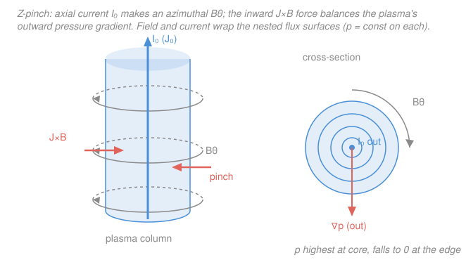

# Plasma Physics · Lesson 3.4: MHD equilibrium: pinches & flux surfaces

> ⏱ ~15 min · Module 3: The fluid picture & MHD · Builds on: [3.3 Magnetic pressure, tension & plasma beta](03-03-magnetic-pressure-tension-beta.md) · Unlocks: [3.5 MHD stability & the energy principle](03-05-mhd-stability-energy-principle.md)

## Why this matters

You want to hold a 100-million-kelvin plasma still, in mid-air, touching nothing. No material wall survives contact, so the only tool left is a magnetic field. The question of *magnetic confinement* — the whole reason tokamaks exist — reduces to one deceptively simple demand: build a field configuration in which the plasma just **sits there**, its outward pressure exactly cancelled by an inward magnetic push, forever. That state is an **MHD equilibrium**. This lesson finds the equilibria, discovers that they force the field and current onto nested surfaces (the geometric skeleton of every confinement device), and works out the two textbook pinches. The catch — that sitting still is necessary but not *sufficient* — is [3.5](03-05-mhd-stability-energy-principle.md)'s problem.

## The idea

Take the ideal-MHD momentum equation from [3.2](03-02-ideal-mhd-frozen-flux.md) and ask for a plasma that is **static**: nothing moves ($\mathbf{u}=0$) and nothing changes ($\partial/\partial t = 0$). Every inertial term dies, and the momentum equation collapses to a pure standoff between two forces: the plasma's pressure trying to expand, and the magnetic force trying to squeeze. Balance them and the plasma holds.

Here's the beautiful consequence. If the magnetic force $\mathbf{J}\times\mathbf{B}$ is what balances the pressure gradient $\nabla p$, then $\nabla p$ must point along $\mathbf{J}\times\mathbf{B}$ — which is perpendicular to *both* $\mathbf{B}$ and $\mathbf{J}$. So neither the field lines nor the current lines ever climb the pressure hill; they run along its contours. Surfaces of constant pressure become surfaces that field and current are trapped on, wrapping around them like thread on a spool. These **flux surfaces**, nested one inside the next like tree rings, are how a magnetic field cages a plasma: hop from surface to surface and the pressure changes, but you can never follow a field line off its surface and out to the wall.

The simplest realization is a **pinch** — a plasma column squeezed by a current. Drive current straight down a column and its own magnetic field wraps around and crushes it inward (the Z-pinch); or wrap current around the column and an axial field inside does the squeezing (the θ-pinch). Both are just $\nabla p = \mathbf{J}\times\mathbf{B}$ wearing different clothes.

## The formal version

**Static force balance.** Drop $\partial/\partial t$ and $\mathbf{u}$ from the MHD momentum equation. What survives is

$$\boxed{\;\nabla p = \mathbf{J}\times\mathbf{B}\;}$$

with pressure $p$ (Pa), current density $\mathbf{J}$ (A/m²), field $\mathbf{B}$ (T). *In words: at every point the outward pressure-gradient force is exactly cancelled by the magnetic force.* Alongside it sit the static Maxwell relations $\mathbf{J} = \mu_0^{-1}\nabla\times\mathbf{B}$ (Ampère) and $\nabla\cdot\mathbf{B}=0$.

**Flux surfaces.** Dot the force balance with $\mathbf{B}$, then with $\mathbf{J}$. Since $\mathbf{J}\times\mathbf{B}$ is perpendicular to each,

$$\mathbf{B}\cdot\nabla p = 0, \qquad \mathbf{J}\cdot\nabla p = 0.$$

*In words: pressure does not change as you move along a field line or a current line* — both lie entirely within a surface of constant $p$. These nested $p=\text{const}$ surfaces are the flux surfaces; magnetic field lines and current lines wind around them and stay on them. This is the geometric basis of magnetic confinement.

**The Z-pinch.** A plasma column along $\hat{\mathbf{z}}$ carries axial current density $J_z(r)$. Ampère's law in cylindrical coordinates gives the azimuthal field it generates,

$$B_\theta(r) = \frac{\mu_0 I(r)}{2\pi r}, \qquad I(r)=\int_0^r J_z\,2\pi r'\,dr' \ \ (\text{current enclosed within radius } r).$$

Now $\mathbf{J}\times\mathbf{B} = J_z\hat{\mathbf{z}}\times B_\theta\hat{\boldsymbol\theta} = -J_zB_\theta\,\hat{\mathbf{r}}$: the force points **inward**. The radial component of $\nabla p = \mathbf{J}\times\mathbf{B}$ is

$$\frac{dp}{dr} = -J_z B_\theta < 0,$$

*in words: the current's own field pinches the column inward, and pressure falls from a peak on the axis to zero at the edge.* Integrating this across the column (multiply by the area element and integrate by parts — done in the Worked examples) yields the **Bennett relation**:

$$\boxed{\;\mu_0 I^2 = 8\pi N k_B T\;}$$

per unit length, where $I$ is the total current, $N=\int_0^a n\,2\pi r\,dr$ is the **line density** (particles per metre of column) and $T$ its temperature (using $p=nk_BT$; keeping electrons and ions separate replaces $T$ by $T_e+T_i$). *In words: the current alone sets how hot a plasma of given line density it can confine — double the current, quadruple $NT$.* This is Boss problem 3.

**The θ-pinch.** Reverse the geometry: an external solenoid drives an **axial** field $B_z(r)$, and the plasma carries an **azimuthal** current $J_\theta$. Now $\mathbf{J}\times\mathbf{B}=J_\theta\hat{\boldsymbol\theta}\times B_z\hat{\mathbf{z}} = J_\theta B_z\,\hat{\mathbf{r}}$, and force balance $dp/dr = J_\theta B_z$ integrates to the clean **pressure-balance** statement

$$p(r) + \frac{B_z(r)^2}{2\mu_0} = \frac{B_0^2}{2\mu_0} = \text{const},$$

with $B_0$ the vacuum field outside the plasma. *In words: plasma pressure plus magnetic pressure is constant across the column — where the plasma is dense it pushes the field out (diamagnetism), so $B_z$ is smallest where $p$ is largest.* This is exactly the magnetic-pressure bookkeeping of [3.3](03-03-magnetic-pressure-tension-beta.md), and it hands you the plasma beta directly: $\beta \equiv p/(B_0^2/2\mu_0) = 1 - (B_i/B_0)^2$.

**Toward tokamaks — the Grad–Shafranov equation (preview, not derived).** Bend the column into a torus and demand axisymmetric static balance, and $\nabla p = \mathbf{J}\times\mathbf{B}$ becomes a single scalar equation for the **poloidal flux function** $\psi(R,z)$:

$$\Delta^{*}\psi = -\mu_0 R^2\,\frac{dp}{d\psi} - F\,\frac{dF}{d\psi}, \qquad F \equiv R\,B_\phi,$$

where $\Delta^{*}$ is a two-dimensional elliptic operator ($R$ is the major radius). This is the **Grad–Shafranov equation** — a nonlinear elliptic PDE whose level sets $\psi=\text{const}$ are precisely the nested flux surfaces, with $p=p(\psi)$ constant on each (the $\mathbf{B}\cdot\nabla p=0$ result again). Every tokamak equilibrium is a solution of it. We name it here and solve its physics in [5.2](05-02-magnetic-confinement-tokamaks.md).

## Picture

## Worked examples

**Example 1 (the pinch's field — Ampère in action).** Take a column of radius $a$ with *uniform* current density, $J_z = I/\pi a^2$. Inside ($r<a$) the enclosed current is $I(r) = I\,(r/a)^2$, so

$$B_\theta(r) = \frac{\mu_0 I(r)}{2\pi r} = \frac{\mu_0 I\, r}{2\pi a^2} \quad (r<a) \qquad\text{— rises linearly from 0 on the axis.}$$

Outside ($r>a$) all the current is enclosed, so $B_\theta = \mu_0 I/2\pi r$ — the field of a wire, falling as $1/r$. The field peaks at the surface, $B_\theta(a)=\mu_0 I/2\pi a$, which is exactly where the inward squeeze $-J_zB_\theta$ is strongest. The pressure profile follows from $dp/dr=-J_zB_\theta$: flat-topped on the axis, dropping to zero at $r=a$.

**Example 2 (the Bennett relation — Boss problem 3).** Where does $\mu_0 I^2 = 8\pi N k_B T$ come from? Start from $dp/dr = -J_zB_\theta$ and integrate the pressure over the cross-section by parts, using $p(a)=0$:

$$\int_0^a \frac{dp}{dr}\,\pi r^2\,dr = \big[p\,\pi r^2\big]_0^a - \int_0^a p\,2\pi r\,dr = -\int_0^a p\,2\pi r\,dr.$$

The same integral, using the force balance and $J_z\,2\pi r = dI/dr$ together with $B_\theta = \mu_0 I/2\pi r$, is

$$\int_0^a (-J_z B_\theta)\,\pi r^2\,dr = -\pi\int_0^a \frac{1}{2\pi r}\frac{dI}{dr}\cdot\frac{\mu_0 I}{2\pi r}\,r^2\,dr = -\frac{\mu_0}{4\pi}\int_0^a I\,\frac{dI}{dr}\,dr = -\frac{\mu_0 I^2}{8\pi}.$$

Equating the two: $\int_0^a p\,2\pi r\,dr = \mu_0 I^2/8\pi$. With $p=nk_BT$ at uniform $T$, the left side is $k_BT\int_0^a n\,2\pi r\,dr = N k_B T$, giving

$$N k_B T = \frac{\mu_0 I^2}{8\pi} \quad\Longleftrightarrow\quad \mu_0 I^2 = 8\pi N k_B T.$$

*In words: the total confining current is fixed once you name the line density and temperature — and it doesn't care how the current is distributed inside the column.* That last fact (the profile dropped out) is what makes the relation so useful, and so brutal: a 2 MA pinch confines the *same* $NT$ whether it's fat or thin.

## Watch out

- **You might think finding an equilibrium means the plasma is confined.** It only means the plasma *can* sit still, not that it *will*. A pencil balanced on its tip is an equilibrium. Nearly every simple pinch is violently unstable (sausage, kink) — [3.5](03-05-mhd-stability-energy-principle.md) is where you test whether a nudge grows.
- **You might read $\mathbf{B}\cdot\nabla p = 0$ as "no pressure gradient."** It says the gradient has no *component along* $\mathbf{B}$ — $p$ varies fully across flux surfaces, just never along a field line. Confinement lives in that perpendicular variation.
- **Don't conflate the two pinches' geometries.** Z-pinch: current axial, field azimuthal (the current makes its own confining field). θ-pinch: current azimuthal, field axial (an external coil makes the field). The "Z" and "θ" name the direction of the *current*.
- **The magnetic force is not $\nabla(B^2/2\mu_0)$ alone.** $\mathbf{J}\times\mathbf{B}$ splits into magnetic pressure *and* tension ([3.3](03-03-magnetic-pressure-tension-beta.md)); in a pinch the curved $B_\theta$ lines carry tension that does part of the squeezing. Using pressure alone misses the hoop.

## One-liner

> Static balance $\nabla p = \mathbf{J}\times\mathbf{B}$ pins field and current onto nested flux surfaces of constant pressure — and in a Z-pinch that balance is the Bennett relation $\mu_0 I^2 = 8\pi N k_B T$, current confining plasma against its own pressure.

## Problems

**P1 (🟢)** A cylindrical plasma column of radius $a=2\ \mathrm{cm}$ carries a *uniform* axial current with total $I=50\ \mathrm{kA}$. Find $B_\theta$ at $r=1\ \mathrm{cm}$ (inside) and at $r=4\ \mathrm{cm}$ (outside), and say where $B_\theta$ is largest.

**P2 (🟡, Boss problem 3)** A Z-pinch carries $I=200\ \mathrm{kA}$ and has line density $N=1.0\times10^{19}\ \mathrm{m^{-1}}$. Using the Bennett relation with $p=nk_BT$, find the equilibrium temperature $T$ (in K and in keV). ($\mu_0=4\pi\times10^{-7}$, $k_B=1.38\times10^{-23}\ \mathrm{J/K}$.)

**P3 (🔴, optional)** In a θ-pinch the external axial field is $B_0=2.0\ \mathrm{T}$; inside the plasma the field is pushed down to $B_i=1.6\ \mathrm{T}$. Find the plasma pressure $p$ and the plasma beta $\beta$.

Solutions

**P1** Uniform current density, so inside ($r<a$) $B_\theta = \mu_0 I r/2\pi a^2$; outside ($r>a$) $B_\theta=\mu_0 I/2\pi r$.

Inside at $r=0.01\ \mathrm{m}$ (with $a=0.02\ \mathrm{m}$), writing $\mu_0 I/2\pi = (2\times10^{-7})(5\times10^4)=10^{-2}$:
$$B_\theta = \frac{\mu_0 I}{2\pi}\cdot\frac{r}{a^2} = 10^{-2}\cdot\frac{0.01}{4\times10^{-4}} = 10^{-2}\cdot 25 = 0.25\ \mathrm{T}.$$

Outside at $r=0.04\ \mathrm{m}$:
$$B_\theta = \frac{\mu_0 I}{2\pi r} = (2\times10^{-7})(5\times10^4)\cdot\frac{1}{0.04} = (10^{-2})\cdot 25 = 0.25\ \mathrm{T}.$$

Both happen to give $0.25\ \mathrm{T}$ here, but the field is **largest at the surface** $r=a=0.02\ \mathrm{m}$, where $B_\theta=\mu_0 I/2\pi a = (10^{-2})/0.02 = 0.5\ \mathrm{T}$. Inside it rises linearly to that peak; outside it falls as $1/r$.

*Check.* Units: $[\mu_0 I/r] = (\mathrm{T\,m/A})(\mathrm{A})/\mathrm{m}=\mathrm{T}$ ✓. The inside value at $r=a/2$ and the outside value at $r=2a$ must match ($r/a^2$ vs $1/r$ both give $1/2a$), which they do — a good consistency check on the profile.

**P2** Solve $\mu_0 I^2 = 8\pi N k_B T$ for $T$:
$$T = \frac{\mu_0 I^2}{8\pi N k_B} = \frac{(4\pi\times10^{-7})(2\times10^5)^2}{8\pi(1.0\times10^{19})(1.38\times10^{-23})}.$$
Numerator: $(4\pi\times10^{-7})(4\times10^{10}) = 1.6\pi\times10^{4}$. Denominator: $8\pi(1.0\times10^{19})(1.38\times10^{-23}) = 8\pi(1.38\times10^{-4}) = 1.104\pi\times10^{-3}$.
$$T = \frac{1.6\pi\times10^{4}}{1.104\pi\times10^{-3}} = \frac{1.6}{1.104}\times10^{7} \approx 1.45\times10^{7}\ \mathrm{K}.$$
Convert: $k_BT = (1.38\times10^{-23})(1.45\times10^7)=2.0\times10^{-16}\ \mathrm{J} = 2.0\times10^{-16}/1.6\times10^{-19}\ \mathrm{eV}\approx 1.25\times10^{3}\ \mathrm{eV}\approx 1.3\ \mathrm{keV}$.

*Check.* Order of magnitude: a couple-hundred-kA pinch reaching $\sim$1 keV ($\sim$10 million K) is exactly the regime of dense-plasma-focus and wire-array Z-pinch experiments ✓. Scaling: $T\propto I^2/N$, so the Bennett relation says pushing more current (or thinning the column) raises the temperature quadratically.

**P3** Pressure balance $p + B_i^2/2\mu_0 = B_0^2/2\mu_0$ gives
$$p = \frac{B_0^2 - B_i^2}{2\mu_0} = \frac{(2.0)^2-(1.6)^2}{2(4\pi\times10^{-7})} = \frac{4.0-2.56}{2.513\times10^{-6}} = \frac{1.44}{2.513\times10^{-6}} \approx 5.7\times10^{5}\ \mathrm{Pa}.$$
Beta:
$$\beta = \frac{p}{B_0^2/2\mu_0} = 1 - \frac{B_i^2}{B_0^2} = 1 - \frac{2.56}{4.0} = 0.36.$$

*Check.* $\beta=0.36$ means the plasma pressure is 36% of the external magnetic pressure and the field is diamagnetically expelled by a matching fraction ($B_i/B_0=0.8$, $B_i^2/B_0^2=0.64=1-\beta$) ✓ — consistent with the definition of $\beta$ from [3.3](03-03-magnetic-pressure-tension-beta.md). A θ-pinch can run at high $\beta$, one of its attractions.

## Flashback

**From Lesson 3.3 (Magnetic pressure, tension & plasma beta):** A tokamak plasma has density $n=1.0\times10^{20}\ \mathrm{m^{-3}}$, temperature $T=10\ \mathrm{keV}$ (take $T_e=T_i=T$), in a field $B=5\ \mathrm{T}$. Compute the plasma beta $\beta$. Is this a high- or low-$\beta$ device? ($k_B T$ at $10\ \mathrm{keV}$ is $1.6\times10^{-15}\ \mathrm{J}$.)

Solution

Total pressure (electrons + ions): $p = n k_B T_e + n k_B T_i = 2n k_B T = 2(1.0\times10^{20})(1.6\times10^{-15}) = 3.2\times10^{5}\ \mathrm{Pa}$.

Magnetic pressure: $\dfrac{B^2}{2\mu_0} = \dfrac{25}{2(4\pi\times10^{-7})} = \dfrac{25}{2.513\times10^{-6}} \approx 9.9\times10^{6}\ \mathrm{Pa}$.

$$\beta = \frac{p}{B^2/2\mu_0} = \frac{3.2\times10^{5}}{9.9\times10^{6}} \approx 0.032 \approx 3\%.$$

This is a **low-$\beta$** device — the field dominates the pressure by a factor of $\sim$30, which is typical for tokamaks. *Check.* Units: Pa/Pa, dimensionless ✓. A few-percent $\beta$ is the standard tokamak operating point; the whole game of magnetic confinement is that a strong, expensive field holds a comparatively feeble plasma pressure — the opposite of the high-$\beta$ θ-pinch in P3.

## Connections

- **Backward:** the magnetic force here is the same $\mathbf{J}\times\mathbf{B} = $ magnetic pressure + tension you split in [3.3](03-03-magnetic-pressure-tension-beta.md); equilibrium is just setting it against $\nabla p$. The frozen-in flux of [3.2](03-02-ideal-mhd-frozen-flux.md) is what makes flux surfaces meaningful — the plasma is stuck to them.
- **Forward:** [3.5 MHD stability & the energy principle](03-05-mhd-stability-energy-principle.md) asks whether these equilibria survive a nudge (the pinches mostly don't); [5.2 Magnetic confinement](05-02-magnetic-confinement-tokamaks.md) solves the Grad–Shafranov equation named here to build a real tokamak.
- **Sideways (PDEs):** force balance in a torus is the Grad–Shafranov equation, a nonlinear **elliptic** PDE — the same boundary-value character (smooth interior solutions set by boundary data) as Laplace/Poisson problems in the [`pdes` syllabus](../../pdes/syllabus.md). Its nested level sets are the flux surfaces; solving it is a classic elliptic BVP.
