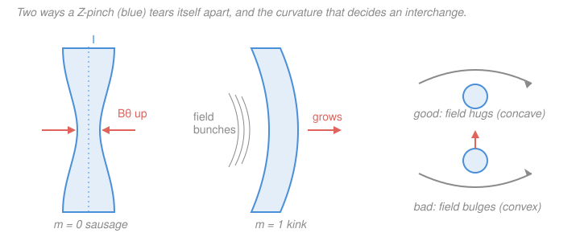

# Plasma Physics · Lesson 3.5: MHD stability & the energy principle

> ⏱ ~15 min · Module 3: The fluid picture & MHD · Builds on: [3.4 MHD equilibrium: pinches & flux surfaces](03-04-mhd-equilibrium-pinches.md) · Unlocks: [4.1 Electron waves: Langmuir & the cold-plasma dielectric](04-01-langmuir-cold-plasma-dielectric.md)

## Why this matters

In [3.4](03-04-mhd-equilibrium-pinches.md) you learned to *build* an equilibrium — a static plasma where $\nabla p = \mathbf{J}\times\mathbf{B}$ holds everywhere. But an equilibrium you can write down is not an equilibrium nature will keep. A pencil balanced on its tip satisfies $\sum \mathbf{F}=0$ too; it just doesn't survive the first breath of air. Almost every clean pinch you can draw is like that pencil: nudge it and it grows *worse*, in microseconds, faster than any control system can react. Fusion's central engineering problem is not confining a plasma but confining a plasma that *stays* confined. This lesson gives you the single tool that decides the question — the **energy principle** — and the two classic ways a pinch dies.

## The idea

Forget the details of the plasma for a second and think of a ball in a landscape. Displace it a little. If the potential energy goes **up**, the ball rolls back — stable. If some direction takes the energy **down**, the ball rolls away, faster and faster — unstable. Stability is just: *is every nearby state uphill?*

Now do the same to a plasma. A "displacement" is no longer one number but a whole vector field $\boldsymbol{\xi}(\mathbf{x})$ — how far, and which way, each blob of fluid moves. Freeze the plasma, push it by $\boldsymbol{\xi}$, and ask how the total potential energy (magnetic + internal) changed. Call that change $\delta W[\boldsymbol{\xi}]$. The **energy principle** says the equilibrium is stable exactly when $\delta W \ge 0$ for *every* allowed $\boldsymbol{\xi}$ — every possible nudge is uphill. If even one displacement makes $\delta W < 0$, the plasma will find it and slide downhill: an instability, growing like $e^{\gamma t}$ with $\gamma \sim \sqrt{-\delta W/\text{inertia}}$.

The beauty is that you never have to solve the time-dependent equations. You minimize an energy over trial displacements — a variational problem, the same move as "guess the shape of the wavefunction and minimize $\langle H\rangle$" in quantum mechanics. Find one nudge with $\delta W<0$ and you've *proved* the thing blows up.

## The formal version

Linearize ideal MHD about a static equilibrium. Let each fluid element move by a small displacement $\boldsymbol{\xi}(\mathbf{x},t)$ (meters). All the perturbed forces are linear in $\boldsymbol{\xi}$, so Newton's law for the plasma becomes

$$\rho\,\frac{\partial^2 \boldsymbol{\xi}}{\partial t^2} = \mathbf{F}[\boldsymbol{\xi}],$$

where $\rho$ is the mass density (kg/m³) and $\mathbf{F}$ is the **force operator** — a linear operator packing the perturbed $\mathbf{J}\times\mathbf{B}$ and $\nabla p$. *In words: displace the plasma and it feels a restoring (or anti-restoring) force proportional to the displacement — a spring, possibly with a negative constant.* A key fact (self-adjointness of $\mathbf{F}$, from ideal MHD's lack of dissipation) makes normal modes $\boldsymbol{\xi}\propto e^{-i\omega t}$ have **real $\omega^2$**: motions are pure oscillation ($\omega^2>0$) or pure growth ($\omega^2<0$), never a mix.

Define the **potential-energy change** and a positive **inertia (norm)**:

$$\delta W[\boldsymbol{\xi}] = -\tfrac12\!\int \boldsymbol{\xi}\cdot\mathbf{F}[\boldsymbol{\xi}]\,dV, \qquad K[\boldsymbol{\xi}] = \tfrac12\!\int \rho\,|\boldsymbol{\xi}|^2\,dV.$$

Dotting the equation of motion with $\boldsymbol{\xi}$ and integrating gives the exact relation

$$\omega^2 = \frac{\delta W[\boldsymbol{\xi}]}{K[\boldsymbol{\xi}]}.$$

*In words: the squared frequency is potential energy over inertia — stiffness over mass, exactly like $\omega^2=k/m$ for a spring.* Since $K>0$ always, the sign of $\omega^2$ is the sign of $\delta W$. Hence the

> **Energy principle.** An ideal-MHD equilibrium is **stable** $\iff \delta W[\boldsymbol{\xi}]\ge 0$ for all allowed displacements. If some $\boldsymbol{\xi}$ gives $\delta W<0$, that mode grows at rate $\gamma = \sqrt{-\omega^2} = \sqrt{-\delta W/K}$.

**What lives inside $\delta W$.** Sorted by sign, $\delta W$ has three *stabilizing* (always $\ge 0$) pieces and two *destabilizing* drives:

$$\delta W = \tfrac{1}{2}\!\int\!\Big[\underbrace{\tfrac{|\mathbf{B}_1|^2}{\mu_0}}_{\text{field bending}\,\ge 0} + \underbrace{\tfrac{B^2}{\mu_0}|\nabla\!\cdot\!\boldsymbol{\xi}_\perp + 2\boldsymbol{\xi}_\perp\!\cdot\!\boldsymbol{\kappa}|^2}_{\text{field compression}\,\ge 0} + \underbrace{\gamma_a p\,|\nabla\!\cdot\!\boldsymbol{\xi}|^2}_{\text{plasma compression}\,\ge 0} \;\underbrace{-\;2(\boldsymbol{\xi}_\perp\!\cdot\!\nabla p)(\boldsymbol{\xi}_\perp\!\cdot\!\boldsymbol{\kappa})}_{\text{pressure drive}} \;\underbrace{-\;j_\parallel(\boldsymbol{\xi}_\perp\!\times\!\mathbf{b})\!\cdot\!\mathbf{B}_1}_{\text{current drive}}\Big]dV$$

Here $\mathbf{B}_1$ is the perturbed field, $\mathbf{b}=\mathbf{B}/B$ the field direction, $\boldsymbol{\kappa}=(\mathbf{b}\cdot\nabla)\mathbf{b}$ the **field-line curvature** (points toward the center of curvature), $j_\parallel$ the current along $\mathbf{B}$, and $\gamma_a$ the adiabatic index. You do **not** need to memorize this — only read its story: *bending field lines, compressing field, and compressing plasma all cost energy (stabilizing); pressure gradients in bad curvature and parallel currents can pay energy back (destabilizing).* Instabilities are the plasma spending the last two to beat the first three.

**Good vs bad curvature.** The pressure-drive term $-2(\boldsymbol{\xi}_\perp\!\cdot\!\nabla p)(\boldsymbol{\xi}_\perp\!\cdot\!\boldsymbol{\kappa})$ is the only one whose sign turns on *geometry*, and it decides interchange stability. Read it through the Rayleigh–Taylor analogy: field-line curvature acts as an effective gravity $\mathbf{g}_{\text{eff}}$ on the plasma (from the curvature/centrifugal drift), and the pressure gradient plays the density gradient — heavy-over-light is unstable. Concretely: where the field lines are **concave toward the plasma** — curving *around* it so the plasma nestles in the valley of the bend (the field "hugs" it) — the drive strengthens $\delta W$: **good (stabilizing) curvature**. Where the field lines are **convex toward the plasma** — bulging so the plasma is perched on the *outside* of the bend, like water balanced on a dome — the drive can push $\delta W<0$: **bad (destabilizing) curvature**, and flux tubes interchange to slide the energy downhill. This is the whole principle behind magnetic-well ("minimum-$B$") confinement, and why a tokamak twists its field lines so each one samples both sides and the curvature *averages* favorably.

## Picture

The Z-pinch (Boss 3's nemesis) has two killer modes, both visible above.

**Sausage ($m=0$).** Squeeze the column inward somewhere and you get a local neck (left). The azimuthal field wrapping the current is $B_\theta=\mu_0 I/2\pi r$: at the neck the radius $r$ is smaller, so $B_\theta$ is *larger*, so the magnetic pressure $B_\theta^2/2\mu_0\propto 1/r^2$ is larger — it squeezes the neck **harder**. The perturbation feeds itself: $\delta W<0$, runaway.

**Kink ($m=1$).** Bend the column sideways (middle). On the concave inside of the bend the poloidal field lines crowd together, raising $B_\theta$ and its pressure *there*, which shoves the bend **further** out. Again self-reinforcing.

Both are cured the same way: thread a strong **axial field $B_z$** through the column. Now deforming the column means *bending $B_z$'s field lines*, which costs the stabilizing bending energy $|\mathbf{B}_1|^2/\mu_0$ — magnetic tension fighting back. Enough $B_z$ and $\delta W$ turns positive. This is exactly why a tokamak runs a large toroidal field: it is a screw-pinch stiffened against kinks (the Kruskal–Shafranov limit, safety factor $q>1$).

## Worked examples

**Example 1 (the sausage mechanism, quantitatively).** Take a Z-pinch of radius $a$ carrying total current $I$. The surface field is $B_\theta(a)=\mu_0 I/2\pi a$ and pinches with pressure $P_{\text{mag}}=B_\theta^2/2\mu_0 = \mu_0 I^2/8\pi^2 a^2$. Perturb: let the neck radius shrink $a\to a(1-\epsilon)$ at fixed $I$ (the current can't vanish). Then

$$P_{\text{mag}} \propto \frac{1}{a^2} \;\longrightarrow\; \frac{1}{a^2(1-\epsilon)^2} \approx \frac{1}{a^2}(1+2\epsilon),$$

so the squeezing pressure *rises* by $2\epsilon$ where the plasma is already thinnest — nothing internal pushes back harder, so the neck collapses. That is $\delta W<0$: the sausage.

Now trap an axial field $B_z$ *inside* the column. Ideal MHD freezes flux ([3.2](03-02-ideal-mhd-frozen-flux.md)): $\Phi = B_z\,\pi a^2$ is conserved, so $B_z\propto 1/a^2$ and its pressure

$$P_z = \frac{B_z^2}{2\mu_0}\propto \frac{1}{a^4}\;\longrightarrow\;\frac{1}{a^4}(1+4\epsilon),$$

rises by $4\epsilon$ — **twice as fast** as the pinching field. The trapped axial field pushes back harder than the neck squeezes, restoring the column. Working the balance out, the sausage is stabilized when $B_z^2 > \tfrac12 B_\theta^2$ roughly. *Check.* The stabilizer scales as $1/a^4$ vs the driver's $1/a^2$: a stiffer response to compression, exactly what a restoring force must be. Units: both are pressures, $\mathrm{T^2/(T\,m/A)} = \mathrm{A\,T/m}=\mathrm{Pa}$ ✓.

**Example 2 (interchange growth rate).** In bad curvature a plasma supported by a field behaves like a heavy fluid resting on a light one — Rayleigh–Taylor. Swapping ("interchanging") two flux tubes, heavy-out/light-in, lowers the energy. The effective gravity is the curvature/centrifugal drift acceleration $g_{\text{eff}}\sim 2c_s^2/R_c$, where $c_s=\sqrt{k_B T/m_i}$ is the sound speed and $R_c$ the field-line radius of curvature. With a pressure-gradient scale length $L_p=|p/\nabla p|$, the growth rate is the RT rate

$$\gamma \sim \sqrt{\frac{g_{\text{eff}}}{L_p}}\sim \sqrt{\frac{2c_s^2}{R_c L_p}} = \frac{c_s}{\sqrt{R_c L_p/2}}.$$

Numbers: a $T=1\ \mathrm{keV}$ hydrogen plasma has $c_s=\sqrt{k_B T/m_i}=\sqrt{(1.6\times10^{-16})/(1.67\times10^{-27})}\approx 3.1\times10^{5}\ \mathrm{m/s}$. Take $R_c=1\ \mathrm{m}$ (bad curvature) and $L_p=0.1\ \mathrm{m}$:

$$\gamma \sim \frac{3.1\times10^5}{\sqrt{(1)(0.1)/2}}=\frac{3.1\times10^5}{0.22}\approx 1.4\times10^{6}\ \mathrm{s^{-1}}.$$

*Check.* A growth *time* of $\sim0.7\ \mu\mathrm{s}$ — a plasma sound-crossing of the gradient scale, which is the fastest an MHD motion can be. Instabilities that big are why bad-curvature regions must be *removed* by design, not controlled after the fact. Units: $\sqrt{(\mathrm{m/s})^2/\mathrm{m}^2}=\mathrm{s^{-1}}$ ✓.

## Watch out

- **You might think a stability analysis needs the time-dependence.** It doesn't — the energy principle is purely *static*. You test trial displacements and check the sign of one integral. Finding a single $\boldsymbol{\xi}$ with $\delta W<0$ *proves* instability without ever computing $\gamma$; you compute $\gamma=\sqrt{-\delta W/K}$ only if you want the timescale.
- **You might think "the equilibrium satisfies $\nabla p=\mathbf{J}\times\mathbf{B}$, so it's fine."** Force balance is necessary, not sufficient — it's the pencil on its tip. Equilibrium says $\delta W$ has no *linear* term (no net force at first order); stability is about the *quadratic* term (the curvature of the energy). Different question.
- **You might mix up good and bad curvature.** The mnemonic: **good = field concave toward the plasma** (it curves around and hugs the plasma, center of curvature on the plasma side). **Bad = convex toward the plasma** (it bulges toward the plasma, which perches on the outside of the bend, center of curvature on the far side). Only *bad* curvature drives interchange; the magnetic-well trick is to arrange average good curvature.
- **Ideal MHD is the *optimist's* stability test.** If $\delta W<0$, the plasma is unstable — full stop. But $\delta W\ge 0$ only means *ideal* stability; resistivity, two-fluid, and kinetic effects (Module 4) open slower instabilities the energy principle can't see. Ideal stability is necessary, not the last word.

## One-liner

> Push the plasma by $\boldsymbol{\xi}$ and watch the energy: $\delta W\ge0$ for every nudge means stable; any downhill direction ($\delta W<0$) is an instability growing at $\gamma=\sqrt{-\delta W/\text{inertia}}$ — bending and compression pay in, bad curvature and parallel current pay out.

## Problems

**P1 (🟢)** A Z-pinch column of radius $a$ carries a fixed current $I$, giving surface field $B_\theta=\mu_0 I/2\pi a$. (a) A sausage perturbation locally shrinks the radius to $0.9a$ at fixed $I$. By what factor does the pinching magnetic pressure $B_\theta^2/2\mu_0$ at that neck change? (b) In one sentence, why does this make the mode *grow* rather than restore?

**P2 (🟡)** Estimate the interchange (Rayleigh–Taylor) growth rate for a plasma with $T=200\ \mathrm{eV}$ ($m_i=m_{\text{proton}}$) sitting in bad curvature with radius of curvature $R_c=0.5\ \mathrm{m}$ and pressure scale length $L_p=0.05\ \mathrm{m}$. Use $g_{\text{eff}}\approx 2c_s^2/R_c$ and $\gamma\approx\sqrt{g_{\text{eff}}/L_p}$. Give $\gamma$ and the growth time $1/\gamma$.

**P3 (🔴, optional)** A screw pinch has an axial field $B_z$ trapped in the column. A kink perturbation of axial wavelength $\lambda=2\pi/k$ bends these field lines. The stabilizing field-line-bending energy density is $\sim |\mathbf{B}_1|^2/2\mu_0$ with $|\mathbf{B}_1|\sim k B_z\xi$ for a transverse displacement $\xi$. The destabilizing kink drive scales as $\sim B_\theta^2 \xi^2/(2\mu_0 a^2)\cdot(\text{geometry})$. Set bending $\gtrsim$ drive to argue for a threshold on $k$, and show it takes the Kruskal–Shafranov form: the mode is stabilized when the field-line pitch is *long* enough, $k a\, B_z \gtrsim B_\theta$, i.e. safety factor $q\equiv \dfrac{k a B_z}{B_\theta}\gtrsim 1$.

Solutions

**P1** (a) At fixed $I$, $B_\theta\propto 1/a$ so the magnetic pressure $B_\theta^2/2\mu_0\propto 1/a^2$. Shrinking $a\to 0.9a$:

$$\frac{P_{\text{new}}}{P_{\text{old}}} = \left(\frac{a}{0.9a}\right)^2 = \frac{1}{0.81}\approx 1.23.$$

The pinching pressure *rises about 23%* at the neck. (b) Because the extra squeeze appears exactly where the column is already thinnest, with nothing internal pushing back harder — the constriction deepens, which raises $B_\theta$ further, and so on. The perturbation reinforces itself: $\delta W<0$, unstable. *Check.* A $10\%$ radius change gives a $\sim 20\%$ pressure change ($1/0.9^2\approx1+2(0.1)$), matching the $1/a^2\Rightarrow$ factor-$(1+2\epsilon)$ linearization in Example 1. ✓

**P2** Sound speed at $T=200\ \mathrm{eV}=3.2\times10^{-17}\ \mathrm{J}$:

$$c_s=\sqrt{\frac{k_B T}{m_i}}=\sqrt{\frac{3.2\times10^{-17}}{1.67\times10^{-27}}}\approx 1.4\times10^{5}\ \mathrm{m/s}.$$

Effective gravity $g_{\text{eff}}=2c_s^2/R_c = 2(1.4\times10^5)^2/0.5 \approx 7.8\times10^{10}\ \mathrm{m/s^2}$. Growth rate

$$\gamma\approx\sqrt{\frac{g_{\text{eff}}}{L_p}}=\sqrt{\frac{7.8\times10^{10}}{0.05}}=\sqrt{1.6\times10^{12}}\approx 1.3\times10^{6}\ \mathrm{s^{-1}},$$

so $1/\gamma\approx 0.8\ \mu\mathrm{s}$. *Check.* Equivalently $\gamma\approx c_s/\sqrt{R_c L_p/2} = 1.4\times10^5/\sqrt{0.0125}\approx1.3\times10^6\ \mathrm{s^{-1}}$ ✓. Sub-microsecond, i.e. one sound-crossing of the $5$-cm gradient — a genuinely violent, uncontrollable mode, as expected for RT. Units: $\sqrt{(\mathrm{m/s^2})/\mathrm{m}}=\mathrm{s^{-1}}$ ✓.

**P3** Compare energy densities. Stabilizing (bending): $w_{\text{bend}}\sim |\mathbf{B}_1|^2/2\mu_0 \sim (kB_z\xi)^2/2\mu_0$. Destabilizing (kink drive): $w_{\text{drive}}\sim B_\theta^2\xi^2/2\mu_0 a^2$ (up to an $O(1)$ geometric factor). The mode is stable when bending beats drive, $w_{\text{bend}}\gtrsim w_{\text{drive}}$:

$$\frac{(kB_z\xi)^2}{2\mu_0}\;\gtrsim\;\frac{B_\theta^2\xi^2}{2\mu_0 a^2}\;\Longrightarrow\; k^2 B_z^2 \gtrsim \frac{B_\theta^2}{a^2}\;\Longrightarrow\; k a\, B_z \gtrsim B_\theta.$$

So *short*-wavelength kinks (large $k$) are stabilized by bending, and the threshold is a pitch condition. Defining the safety factor $q\equiv ka B_z/B_\theta$ (for a column of length $L$, the physical version is $q=2\pi a B_z/L B_\theta$, with the longest unstable wavelength $\lambda=L$, $k=2\pi/L$), stability requires

$$\boxed{\,q \gtrsim 1\,}$$

— the **Kruskal–Shafranov limit**. *Check.* The stabilizer $k^2 B_z^2$ grows with axial field strength and with how tightly you demand the field twist — exactly why tokamaks run a strong toroidal $B_z$ and keep $q>1$ near the edge. Units: $ka B_z\to(\mathrm{m^{-1}})(\mathrm{m})(\mathrm{T})=\mathrm{T}=[B_\theta]$ ✓; $q$ is dimensionless ✓.

## Flashback

**From Lesson 3.4 (MHD equilibrium: pinches):** A Z-pinch of radius $a=1\ \mathrm{cm}$ carries a current $I=50\ \mathrm{kA}$. (a) Find the azimuthal field $B_\theta$ at the surface. (b) Using pressure balance at the edge, $p \sim B_\theta^2/2\mu_0$, estimate the confined plasma pressure. (Fresh numbers — use $\mu_0=4\pi\times10^{-7}\ \mathrm{T\,m/A}$.)

Solution

(a) $B_\theta = \dfrac{\mu_0 I}{2\pi a} = \dfrac{(4\pi\times10^{-7})(5\times10^4)}{2\pi(0.01)} = \dfrac{2\times10^{-7}\cdot 5\times10^4}{0.01} = \dfrac{10^{-2}}{10^{-2}} = 1\ \mathrm{T}.$

(b) $p\sim \dfrac{B_\theta^2}{2\mu_0} = \dfrac{1^2}{2(4\pi\times10^{-7})} = \dfrac{1}{2.51\times10^{-6}} \approx 4.0\times10^{5}\ \mathrm{Pa}\approx 4\ \mathrm{atm}.$

*Check.* A $1$-tesla azimuthal field confining a few atmospheres of plasma pressure — that is a typical dense Z-pinch, and it is exactly the equilibrium that Example 1 shows the sausage mode destroys. Units: $\mathrm{T^2/(T\,m/A)}=\mathrm{T\,A/m}=\mathrm{N/m^2}=\mathrm{Pa}$ ✓.

## Connections

- **Backward:** this tests the equilibria of [3.4](03-04-mhd-equilibrium-pinches.md) and runs entirely on the magnetic pressure/tension bookkeeping of [3.3](03-03-magnetic-pressure-tension-beta.md) — bending energy *is* tension, compression energy *is* magnetic pressure. The stabilizing $B_z$ works only because ideal MHD freezes flux ([3.2](03-02-ideal-mhd-frozen-flux.md)), pinning $B_z\pi a^2$ as the column deforms.
- **Forward:** [4.4 Instabilities: two-stream, drift & interchange](04-04-instabilities-two-stream-drift.md) revisits the interchange from the *kinetic* side and adds instabilities the energy principle is blind to (they need free energy in velocity space, not configuration space). The oscillatory case $\omega^2>0$ here is the doorway to the waves of [4.1](04-01-langmuir-cold-plasma-dielectric.md)–[4.3](04-03-em-alfven-waves.md).
- **Sideways:** the "displace and check the energy" method is the MHD twin of the small-oscillation test in [`analytical-mechanics`](../../analytical-mechanics/syllabus.md) (stability = positive-definite Hessian of the potential) and the variational estimate of a ground state in quantum mechanics. The interchange itself is Rayleigh–Taylor from [`fluid-dynamics`](../../fluid-dynamics/syllabus.md) with magnetic curvature playing the role of gravity.
