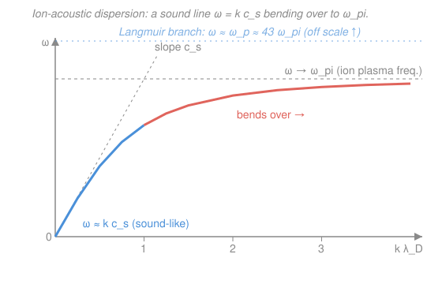

# Plasma Physics · Lesson 4.2: Ion-acoustic waves

> ⏱ ~15 min · Module 4: Waves & instabilities · Builds on: [4.1 Electron waves: Langmuir & the cold-plasma dielectric](04-01-langmuir-cold-plasma-dielectric.md), [2.4 Landau damping](02-04-landau-damping.md) · Unlocks: [4.3 Electromagnetic & Alfvén waves](04-03-em-alfven-waves.md)

## Why this matters

A plasma is a gas, so it ought to carry sound. It does — but with a strange twist that makes it one of the most useful waves in the subject. Ordinary air sound is one species (molecules) providing *both* the inertia and the restoring pressure. In a plasma those two jobs split between two species: the heavy **ions** carry the inertia while the light **electrons** supply the pressure. That single fact explains why the plasma's sound speed depends on the *electron* temperature but the *ion* mass, why the wave only survives when electrons are much hotter than ions, and why radio astronomers see it rippling through the solar wind. It is also the slow, low-frequency counterpart to last lesson's fast Langmuir wave — together they bracket the plasma's two fundamental electrostatic branches.

## The idea

Push the ions together somewhere. In ordinary sound, the gas's own thermal pressure shoves the compression back apart. Cold ions have almost no pressure of their own — so what pushes back?

The electrons. Electrons are ~1800× lighter than a proton, so they move ~40× faster and react almost instantly. Wherever ions pile up (a lump of positive charge), electrons swarm in to shield it — but not perfectly, because their own thermal motion resists being squeezed. What is left is a gentle electric field: the electron cloud, held up by its thermal energy $k_B T_e$, acts like a **spring** pushing the heavy ion lump back apart. The ions, sluggish and massive, provide the **inertia** that lets the disturbance overshoot and oscillate.

So the plasma's sound is *hot light electrons pushing cold heavy ions*. The stiffness of the spring is set by the electron temperature; the heaviness of the oscillating mass is the ion mass. That already tells you the sound speed must look like $\sqrt{k_B T_e/m_i}$ — electron "spring" over ion "mass" — and it does.

There is a catch we will meet at the end: this only works cleanly if the electrons really are much hotter than the ions. If the ions are warm too, the wave's crawl-speed lands right in the middle of the ion velocity distribution, and resonant ions eat it alive (Landau damping, [2.4](02-04-landau-damping.md)). Ion sound needs a temperature imbalance to exist.

## The formal version

We track two things about the ions — how many and how fast — and let the electrons follow instantly. Everything varies as a plane wave $\propto e^{\,i(kx-\omega t)}$ along $x$, with wavenumber $k$ (rad/m) and frequency $\omega$ (rad/s). Symbols: $n_0$ the background density (m⁻³), $m_i$ the ion mass (kg), $e$ the elementary charge (C), $\phi$ the electrostatic potential (V), $T_e,T_i$ the electron/ion temperatures (K), $k_B$ Boltzmann's constant.

**1. Electrons are Boltzmann.** Being fast, electrons reach thermal equilibrium in the wave's potential almost instantly, so their density follows the barometric law
$$n_e = n_0\,e^{\,e\phi/k_B T_e}\;\approx\; n_0\!\left(1+\frac{e\phi}{k_B T_e}\right).$$
*In words: electrons pile up where the potential is high, thinning where it is low — with a stiffness set by $k_B T_e$.* This is the "spring."

**2. Ions obey fluid continuity + momentum (cold, $T_i\to0$ first).** Continuity conserves ion number; momentum is Newton's law with the electric force $-e\,\partial\phi/\partial x$ per ion:
$$\frac{\partial n_i}{\partial t}+n_0\frac{\partial u}{\partial x}=0,\qquad m_i\,n_0\frac{\partial u}{\partial t}=-e\,n_0\frac{\partial\phi}{\partial x},$$
with $u$ the ion fluid velocity. *In words: squeeze the ions and their number changes; the electric field accelerates their mass.* This is the "inertia."

**3. Close with Poisson** (the fields must come from the actual charge imbalance):
$$\varepsilon_0\frac{\partial^2\phi}{\partial x^2}=-e\,(n_i-n_e).$$

Insert plane waves ($\partial_t\to-i\omega$, $\partial_x\to ik$) and eliminate $n_i,u,\phi$. Continuity gives $n_{i1}=n_0 k\,u/\omega$; momentum gives $u=ek\phi/(\omega m_i)$, so $n_{i1}=n_0 k^2 e\phi/(\omega^2 m_i)$. Feeding both densities into Poisson and cancelling $\phi$:
$$k^2=\frac{n_0e^2}{\varepsilon_0}\!\left(\frac{k^2}{\omega^2 m_i}-\frac{1}{k_B T_e}\right)=\omega_{pi}^2\frac{k^2}{\omega^2}-\frac{1}{\lambda_D^2},$$
using the **ion plasma frequency** $\omega_{pi}\equiv\sqrt{n_0e^2/\varepsilon_0 m_i}$ (the ion analogue of last lesson's $\omega_p$) and the electron **Debye length** $\lambda_D\equiv\sqrt{\varepsilon_0 k_B T_e/n_0e^2}$. Solve for $\omega^2$:
$$\boxed{\;\omega^2=\frac{\omega_{pi}^2\,k^2\lambda_D^2}{1+k^2\lambda_D^2}=\frac{k^2c_s^2}{1+k^2\lambda_D^2}\;},\qquad c_s\equiv\omega_{pi}\lambda_D=\sqrt{\frac{k_B T_e}{m_i}}.$$

The last identity is worth pausing on: $c_s=\omega_{pi}\lambda_D$ falls straight out of the definitions, and it is *exactly* the "electron spring over ion mass" guess. That is the **ion-acoustic speed**.

**Read the two limits:**
- **Long wavelength, $k\lambda_D\ll1$:** the $1$ dominates the denominator and $\omega\approx k\,c_s$ — a straight line through the origin. *In words: a genuine, non-dispersive sound wave — every wavelength travels at the same speed $c_s$, exactly like air.* (This is the **quasineutral** limit: charge separation is negligible, $n_i\approx n_e$, and Poisson's $1/\lambda_D^2$ term drops out.)
- **Short wavelength, $k\lambda_D\gg1$:** $\omega\to\omega_{pi}$ — the curve flattens to the ion plasma frequency. The wavelength is now shorter than a Debye length, shielding fails, and the ions just rattle at their own plasma frequency.

**Warm ions.** Restoring a finite ion temperature adds the ions' own 1-D adiabatic pressure ($\gamma_i=3$) to the spring, promoting the result to
$$c_s=\sqrt{\frac{k_B(T_e+3T_i)}{m_i}}.$$
*In words: both temperatures push, but with $T_e\gg T_i$ the electron term dominates and we recover $c_s\approx\sqrt{k_B T_e/m_i}$.*

## Picture

## Worked examples

**Example 1 — the sound speed in a hydrogen discharge.** A hydrogen plasma ($m_i=m_p=1.67\times10^{-27}$ kg) has $T_e=2$ eV and cold ions ($T_i\ll T_e$). Convert the temperature to energy: $k_B T_e=2\times1.602\times10^{-19}=3.20\times10^{-19}$ J. Then
$$c_s=\sqrt{\frac{k_B T_e}{m_i}}=\sqrt{\frac{3.20\times10^{-19}}{1.67\times10^{-27}}}=\sqrt{1.92\times10^{8}}\approx1.4\times10^{4}\ \mathrm{m/s}\ (14\ \mathrm{km/s}).$$
A useful shortcut, dropping in the constants for a proton: $c_s\approx 9.79\times10^{3}\,\sqrt{T_e[\mathrm{eV}]/\mu}\ \mathrm{m/s}$, where $\mu=m_i/m_p$. For $\mu=1$, $T_e=2$ eV that is $9.79\times10^3\sqrt2=1.4\times10^4$ m/s ✓. That is far slower than a bullet by plasma standards, and — as the next example shows — far slower than the electrons.

**Example 2 — why the electrons stay "Boltzmann," and why this is the *slow* branch.** Compare $c_s$ to the electron thermal speed $v_{th,e}=\sqrt{k_B T_e/m_e}$:
$$\frac{c_s}{v_{th,e}}=\sqrt{\frac{m_e}{m_i}}=\frac{1}{\sqrt{1836}}\approx\frac{1}{43}.$$
Electrons zip along ~43× faster than the wave, so from their point of view the ion lump is nearly frozen — they *do* have time to reach the Boltzmann equilibrium we assumed in step 1. And compare frequencies: the ion branch tops out at $\omega_{pi}=\omega_p\sqrt{m_e/m_i}=\omega_p/43$. So ion-acoustic waves live a factor ~40 *below* the Langmuir waves of [4.1](04-01-langmuir-cold-plasma-dielectric.md) in both speed and frequency. Langmuir = electron inertia, fast, $\omega\approx\omega_p$; ion-acoustic = ion inertia, slow, $\omega\lesssim\omega_{pi}$. Two species, two branches.

## Watch out

- **You might think the sound speed uses the ion temperature, like ordinary gas sound.** It does *not* — for $T_e\gg T_i$ the restoring pressure is the *electrons'*, so $c_s\propto\sqrt{T_e}$, and the ion temperature barely enters. The ion mass enters (inertia), the ion temperature (mostly) does not. Swapping $T_e\leftrightarrow T_i$ is the single most common error here.
- **You might expect ion sound to always propagate, like a real sound wave.** It only propagates *cleanly* when $T_e\gg T_i$. When $T_i\sim T_e$ the phase speed $c_s$ sits in the thick of the ion velocity distribution and the wave is heavily **ion Landau damped** (see below) — it dies within a wavelength or two.
- **You might read the flat part of the curve as "the wave speeds up."** The *phase* speed $\omega/k$ actually *drops* as $k$ grows (the curve bends below the tangent line); at large $k\lambda_D$ the wave becomes dispersive and sluggish, not sound-like. Only the small-$k$ straight segment is true, non-dispersive sound.

## The two-temperature requirement (ion Landau damping)

Why the fuss about $T_e\gg T_i$? The wave's phase velocity is $c_s\approx\sqrt{k_B T_e/m_i}$. Compare it to the *ion* thermal speed $v_{th,i}=\sqrt{k_B T_i/m_i}$:
$$\frac{c_s}{v_{th,i}}\approx\sqrt{\frac{T_e}{T_i}}.$$
From [2.4](02-04-landau-damping.md), a wave exchanges energy most strongly with **resonant particles** moving near its phase velocity ($v\approx\omega/k$). If $T_e\sim T_i$, then $c_s\sim v_{th,i}$: the phase velocity sits right in the **bulk** of the ion Maxwellian, where there are enormous numbers of resonant ions on the down-slope $\partial f/\partial v<0$ — they absorb the wave and it damps within a cycle. Only when $T_e\gg T_i$ does $c_s$ move far out onto the sparse tail of the ion distribution, where few ions resonate and the damping becomes weak. *In words: the wave survives only by outrunning the ions that would eat it.* This is why ion-acoustic waves are seen in exactly the plasmas that have hot electrons and cold ions — low-pressure gas discharges, and the solar wind — and are absent in thermal-equilibrium plasmas.

## One-liner

> Ion sound is hot light electrons ($k_BT_e$, the spring) pushing cold heavy ions ($m_i$, the inertia), giving $c_s=\sqrt{k_BT_e/m_i}$ — a clean non-dispersive wave only when $T_e\gg T_i$ keeps it ahead of the ions that would Landau-damp it.

## Problems

**P1 (🟢)** A deuterium plasma ($m_i=2m_p$) has $T_e=5$ eV and $T_i\ll T_e$. Find the ion-acoustic speed $c_s$. *(Check line: use $c_s\approx9.79\times10^3\sqrt{T_e[\mathrm{eV}]/\mu}$ with $\mu=2$, and confirm it comes out slower than the hydrogen value at the same $T_e$.)*

**P2 (🟡)** A hydrogen plasma has $T_e=10$ eV and $T_i=1$ eV. (a) Compute $c_s$ using the full two-temperature formula, and compare it to the cold-ion estimate $\sqrt{k_BT_e/m_i}$. (b) Compute the ratio $c_s/v_{th,i}$ and argue, using the Landau picture, whether this wave propagates cleanly.

**P3 (🔴, optional)** The number of resonant ions scales as the ion distribution evaluated at the phase velocity, $f(v=c_s)\propto\exp\!\big(-c_s^2/2v_{th,i}^2\big)$. (a) Show the exponent equals $-T_e/2T_i$ (take $c_s^2\approx k_BT_e/m_i$). (b) Evaluate this Boltzmann factor for $T_e=T_i$ and for $T_e=10\,T_i$, and use the contrast to explain quantitatively why ion-acoustic waves need $T_e\gg T_i$.

Solutions

**P1** Using the shortcut with $\mu=2$, $T_e=5$ eV:
$$c_s\approx9.79\times10^3\sqrt{\tfrac{5}{2}}=9.79\times10^3\times1.581\approx1.55\times10^4\ \mathrm{m/s}\ (15.5\ \mathrm{km/s}).$$
Direct check: $k_BT_e=5\times1.602\times10^{-19}=8.01\times10^{-19}$ J, $m_i=2\times1.67\times10^{-27}=3.34\times10^{-27}$ kg, so $c_s=\sqrt{8.01\times10^{-19}/3.34\times10^{-27}}=\sqrt{2.40\times10^{8}}\approx1.55\times10^4$ m/s ✓.

*Check.* Deuterium is twice as heavy as hydrogen, so at equal $T_e$ it should be $\sqrt2$ slower. Hydrogen at 5 eV: $9.79\times10^3\sqrt5=2.19\times10^4$ m/s; and $2.19\times10^4/\sqrt2=1.55\times10^4$ m/s ✓. Heavier ions, slower sound — the inertia is larger.

**P2** (a) Two-temperature formula: $T_e+3T_i=10+3(1)=13$ eV, so
$$c_s=9.79\times10^3\sqrt{\tfrac{13}{1}}=9.79\times10^3\times3.606\approx3.53\times10^4\ \mathrm{m/s}.$$
Cold-ion estimate: $9.79\times10^3\sqrt{10}=3.10\times10^4$ m/s. The warm-ion value is about 14% higher — a modest correction because $T_e$ still dominates.

(b) $v_{th,i}=9.79\times10^3\sqrt{T_i/\mu}=9.79\times10^3\sqrt{1}=9.79\times10^3$ m/s. Then $c_s/v_{th,i}=3.53\times10^4/9.79\times10^3\approx3.6$ (equivalently $\approx\sqrt{T_e/T_i}=\sqrt{10}=3.2$, the small difference being the $3T_i$ term). The phase velocity sits ~3–4 ion thermal speeds out on the tail, where the Maxwellian is sparse, so few ions resonate: the wave **propagates cleanly** (only weakly Landau damped).

*Check.* $T_e/T_i=10\gg1$, exactly the regime the lesson says supports the wave — consistent with the ratio landing well above 1. ✓

**P3** (a) With $c_s^2\approx k_BT_e/m_i$ and $v_{th,i}^2=k_BT_i/m_i$,
$$\frac{c_s^2}{2v_{th,i}^2}=\frac{k_BT_e/m_i}{2\,k_BT_i/m_i}=\frac{T_e}{2T_i},$$
so $f(c_s)\propto e^{-T_e/2T_i}$.

(b) $T_e=T_i$: $e^{-1/2}=0.61$ — of order unity, i.e. a huge population of resonant ions → the wave is essentially killed. $T_e=10\,T_i$: $e^{-5}=6.7\times10^{-3}$ — nearly 100× fewer resonant ions, so damping is far weaker and the wave survives.

*Check.* Raising $T_e/T_i$ pushes the resonant point out onto the exponential tail, cutting the resonant population steeply — the Boltzmann factor drops ~90× going from $T_e=T_i$ to $T_e=10\,T_i$, quantifying exactly why "hot electrons, cold ions" is the condition for a clean ion-acoustic wave. ✓

## Flashback

**From Lesson 4.1 (Langmuir & Bohm–Gross):** Electrons in a plasma of density $n_0=1.0\times10^{18}$ m⁻³ carry Langmuir waves. (a) Compute the electron plasma frequency $\omega_p$. (b) At $k\lambda_D=0.3$, use the Bohm–Gross dispersion $\omega^2=\omega_p^2(1+3k^2\lambda_D^2)$ to find $\omega$. (Fresh variant — new density, and a numerical Bohm–Gross evaluation.)

Solution

(a) $\omega_p=\sqrt{n_0e^2/\varepsilon_0 m_e}$. Numerator $n_0e^2=10^{18}(1.602\times10^{-19})^2=2.57\times10^{-20}$; denominator $\varepsilon_0 m_e=8.854\times10^{-12}\times9.11\times10^{-31}=8.07\times10^{-42}$. So $\omega_p=\sqrt{3.18\times10^{21}}\approx5.6\times10^{10}$ rad/s.

(b) $\omega=\omega_p\sqrt{1+3(0.3)^2}=\omega_p\sqrt{1.27}=5.6\times10^{10}\times1.127\approx6.4\times10^{10}$ rad/s.

*Check.* The handy rule $\omega_p\approx5.64\times10^4\sqrt{n[\mathrm{cm^{-3}}]}$ with $n=10^{12}$ cm⁻³ gives $5.64\times10^{10}$ rad/s ✓. Note the contrast with this lesson: this electron branch sits near $5.6\times10^{10}$ rad/s, while the ion-acoustic branch of the same plasma tops out ~43× lower — the fast and slow electrostatic branches bracketing the plasma.

## Connections

- **Backward:** this reuses the Boltzmann-electron shielding and Debye length of [1.1](01-01-what-is-a-plasma-debye.md) as the wave's *restoring force*, the ion plasma frequency built like the electron $\omega_p$ of [1.2](01-02-plasma-frequency-parameter.md), and the resonant-particle / $\partial f/\partial v$ machinery of [2.4 Landau damping](02-04-landau-damping.md) to explain the $T_e\gg T_i$ requirement. It is the slow, low-frequency partner to the fast Langmuir wave of [4.1](04-01-langmuir-cold-plasma-dielectric.md).
- **Forward:** [4.3 Electromagnetic & Alfvén waves](04-03-em-alfven-waves.md) adds a magnetic field and finds the *magnetic* sound wave — the shear Alfvén speed $v_A=B/\sqrt{\mu_0\rho}$ has the same "restoring-stiffness over inertia" structure, with magnetic tension replacing electron pressure.
- **Sideways (fluid dynamics):** the continuity + momentum + closure derivation is exactly the ordinary acoustics of the [`fluid-dynamics`](../../fluid-dynamics/syllabus.md) course — ion-acoustic waves *are* sound waves, only with the restoring pressure outsourced to a second, hotter species. And the ion-Landau-damping argument is the kinetic-theory contour/resonance method of [2.4](02-04-landau-damping.md), which itself borrows the complex-analysis toolkit of [`mathematical-methods-physics`](../../mathematical-methods-physics/syllabus.md).
