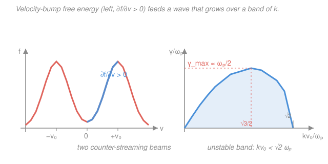

# Plasma Physics · Lesson 4.4: Instabilities — two-stream, drift & interchange

> ⏱ ~15 min · Module 4: Waves & instabilities · Builds on: [4.3 Electromagnetic & Alfvén waves](04-03-em-alfven-waves.md), [2.4 Landau damping](02-04-landau-damping.md) · Unlocks: [5.1 Fusion reactions & the Lawson criterion](05-01-fusion-lawson-criterion.md)

## Why this matters

Every wave you have met so far in Module 4 just *sits there and oscillates* — its frequency $\omega$ is real, so its amplitude $e^{-i\omega t}$ never grows or shrinks. But plasmas are full of stored **free energy**: a beam of electrons streaming past a background, a steep density gradient, a magnetic field bulging the wrong way. Tap that reservoir and a wave stops oscillating politely and starts *growing exponentially* — an **instability**. This is the single most important idea in confinement physics: a tokamak doesn't fail because the equations are hard, it fails because some mode found free energy and ran away with it. Learn to spot a growing mode and estimate how fast it grows, and you can read the failure mode of almost any plasma device.

## The idea

You already have the machine that finds instabilities — it's the **dispersion-relation method** from this whole module. Write the plasma's dielectric response $\varepsilon(k,\omega)$, set $\varepsilon(k,\omega)=0$, and solve for $\omega$. Until now every root came out real. The new move is simply to *allow complex roots*.

Write $\omega = \omega_r + i\gamma$. Then the time dependence factors:
$$e^{-i\omega t} = e^{-i\omega_r t}\,e^{\gamma t}.$$
The first factor oscillates; the second **sets the fate of the amplitude**. If $\gamma < 0$ the wave decays (that was Landau damping). If $\gamma = 0$ it rings forever. And if $\gamma > 0$ the amplitude blows up like $e^{\gamma t}$ — that is an instability, and $\gamma$ is its **growth rate**.

So the entire hunt reduces to: *solve $\varepsilon(k,\omega)=0$ and look for a root with positive imaginary part.* The physics question underneath is always the same — **where is the free energy?** Organize the whole zoo by its energy source and it stops being a zoo:

| Free-energy source | Instability | Where it bites |
|---|---|---|
| **Streaming** (relative drift) | two-stream / bump-on-tail | beam–plasma systems, current-driven modes |
| **Gradients** (density/temperature) | drift waves | *every* confined plasma — drives turbulent heat leak |
| **Bad curvature / gravity** | interchange / Rayleigh–Taylor | tokamak outboard side, Z-pinch |
| **Velocity-space anisotropy** | loss-cone, Weibel | mirror machines, shocks |

## The formal version

### Two-stream instability (Boss problem 4)

Take two cold electron beams, each of density $n_0$, drifting through a fixed neutralizing ion background at velocities $\pm v_0$. Each beam responds to a wave like a cold electron fluid, but *Doppler-shifted* by its own drift: a beam moving at $+v_0$ sees the wave at frequency $\omega - kv_0$. Summing the two cold-plasma responses gives the dielectric

$$\varepsilon(k,\omega) = 1 - \frac{\omega_p^2}{(\omega - kv_0)^2} - \frac{\omega_p^2}{(\omega + kv_0)^2},$$

where $\omega_p^2 = n_0 e^2/\varepsilon_0 m_e$ is the plasma frequency of *one* beam ($e$ = elementary charge, $m_e$ = electron mass, $\varepsilon_0$ = permittivity of free space). *In words: each streaming population contributes its own resonance, shifted by how fast it moves relative to the wave.*

Set $\varepsilon = 0$. Combining the two fractions over a common denominator and writing $X \equiv \omega^2$ turns this quartic-in-$\omega$ into a **quadratic in $X$**:

$$X^2 - 2\left(k^2v_0^2 + \omega_p^2\right)X + \left(k^4v_0^4 - 2\omega_p^2 k^2 v_0^2\right) = 0,$$

$$\boxed{\;\omega^2 = \left(k^2v_0^2 + \omega_p^2\right) \pm \omega_p\sqrt{4k^2v_0^2 + \omega_p^2}\;}$$

Both branches give a **real** $\omega^2$ (the square root is always real). Here's the payoff: an instability needs $\omega$ imaginary, i.e. $\omega^2 < 0$. The $+$ branch is always positive (stable wave), but the $-$ branch can go negative. It does exactly when

$$\left(k^2v_0^2+\omega_p^2\right) < \omega_p\sqrt{4k^2v_0^2+\omega_p^2} \quad\Longleftrightarrow\quad \boxed{\,k v_0 < \sqrt{2}\,\omega_p\,}.$$

*In words: only long-enough wavelengths (small enough $k$) are unstable — the beams must be able to "bunch" over a wave period faster than they stream apart.* In that band $\omega^2<0$, so $\omega = \pm i\gamma$ is **purely growing** (no real oscillation, $\omega_r=0$), with

$$\gamma(k) = \sqrt{\,\omega_p\sqrt{4k^2v_0^2+\omega_p^2} - k^2v_0^2 - \omega_p^2\,}.$$

Maximize over $k$ (set $d\gamma^2/dk = 0$): the peak sits at $kv_0 = \tfrac{\sqrt3}{2}\,\omega_p \approx 0.87\,\omega_p$, where

$$\boxed{\;\gamma_{\max} = \tfrac12\,\omega_p\;}\qquad\text{— growth on the plasma-frequency timescale.}$$

That is the headline: **the two-stream instability grows at roughly half the plasma frequency**, about as fast as anything in a plasma can. The energy comes straight from the beams' **drift kinetic energy** $\tfrac12 m_e v_0^2$ per particle — the wave slows the streams down and pockets the difference.

### The bump-on-tail connection — it's inverse Landau damping

The two-stream picture is the *fluid* face of a *kinetic* fact you already know. In [2.4](02-04-landau-damping.md), a wave exchanges energy with particles resonant at the phase velocity $v = \omega/k$, and the **sign** is set by the slope of the distribution there:

$$\gamma \;\propto\; \left.\frac{\partial f}{\partial v}\right|_{v=\omega/k}.$$

*In words: if there are more slightly-fast particles than slightly-slow ones at the resonance ($\partial f/\partial v > 0$), the wave gains energy and grows.* A Maxwellian always slopes *down* ($\partial f/\partial v<0$) → damping. But two beams stacked in velocity space make a valley with a **positive-slope inner flank** (see the figure) — a $\partial f/\partial v>0$ region — so resonant particles there feed the wave. That is **inverse Landau damping**, and it is the *same instability* the fluid calculation just found. Bunching picture: the wave sorts the streaming electrons into bunches; the bunches' charge reinforces the wave's field; the stronger field bunches them harder — runaway.

### Drift waves — the universal gradient instability

Magnetize the plasma and give it a density gradient $\nabla n$ (scale length $L_n \equiv n/|\nabla n|$). The diamagnetic drift launches a wave traveling at the **diamagnetic drift speed**

$$v_* = \frac{k_B T_e}{eB}\frac{1}{L_n},\qquad \omega \approx k_y v_*,$$

($k_B$ = Boltzmann constant, $T_e$ = electron temperature, $B$ = field strength, $k_y$ = wavenumber across the gradient). A small phase lag between the density ripple and the potential ripple — supplied by electron kinetics or collisions — gives $\omega$ a positive imaginary part. Drift waves are **universal**: any confined plasma has gradients, so it has them, and their turbulence is the leading reason tokamaks leak heat faster than classical theory predicts (the bridge to magnetic-confinement in Lesson 5.2).

### Interchange / Rayleigh–Taylor — bad-curvature free energy

When a heavy fluid sits on a light one in gravity $g$, ripples grow: dense fluid falls, light fluid rises, they *interchange*. In a plasma the role of gravity is played by **magnetic-field-line curvature**: on the "bad-curvature" side (field lines curving *away* from the plasma, from [3.5](03-05-mhd-stability-energy-principle.md)) the effective gravity $g_\text{eff}\sim v_\text{th}^2/R_c$ points outward and destabilizes flute-like ripples. A quick energy/dimensional estimate — the only scales are $g_\text{eff}$ and the gradient length $L$ — gives

$$\boxed{\;\gamma \sim \sqrt{\dfrac{g_\text{eff}}{L}}\;}$$

*In words: the growth rate is the inverse of the free-fall time across one gradient length.* This is why "good curvature" (field bulging *into* the plasma) is the whole design goal of a magnetic well.

## Picture

## Worked examples

**Example 1 (the unstable band and peak — Boss problem 4).** Given $\varepsilon(k,\omega)=1-\omega_p^2/(\omega-kv_0)^2-\omega_p^2/(\omega+kv_0)^2$, find which $k$ grow and the fastest growth rate.

Combine the fractions: $\dfrac{1}{(\omega-kv_0)^2}+\dfrac{1}{(\omega+kv_0)^2}=\dfrac{2(\omega^2+k^2v_0^2)}{(\omega^2-k^2v_0^2)^2}$, so $\varepsilon=0$ reads $(\omega^2-k^2v_0^2)^2 = 2\omega_p^2(\omega^2+k^2v_0^2)$. With $X=\omega^2$ this is the quadratic above; solving,

$$\omega^2 = (k^2v_0^2+\omega_p^2)\pm\omega_p\sqrt{4k^2v_0^2+\omega_p^2}.$$

The $-$ root is negative — hence $\omega$ imaginary, hence growth — precisely when $(k^2v_0^2+\omega_p^2)^2 < \omega_p^2(4k^2v_0^2+\omega_p^2)$. Expand: $k^4v_0^4+2k^2v_0^2\omega_p^2 < 4k^2v_0^2\omega_p^2$, i.e. $k^2v_0^2 < 2\omega_p^2$, so **$kv_0<\sqrt2\,\omega_p$**. To find the peak, write $\gamma^2 = \omega_p\sqrt{4k^2v_0^2+\omega_p^2}-k^2v_0^2-\omega_p^2$ and set the derivative w.r.t. $k^2v_0^2$ to zero: $2\omega_p/\sqrt{4k^2v_0^2+\omega_p^2}=1\Rightarrow 4k^2v_0^2+\omega_p^2=4\omega_p^2\Rightarrow k^2v_0^2=\tfrac34\omega_p^2$. Substituting back, $\gamma_{\max}^2 = \omega_p(2\omega_p)-\tfrac34\omega_p^2-\omega_p^2 = \tfrac14\omega_p^2$, so $\gamma_{\max}=\omega_p/2$ at $kv_0=\tfrac{\sqrt3}{2}\omega_p$.

**Example 2 (interchange timescale — why it's dangerous).** A plasma column has effective gravity $g_\text{eff}=10^{9}\,\mathrm{m/s^2}$ (a modest curvature drive) and gradient length $L=0.1\,\mathrm m$. Estimate the growth time.

$$\gamma\sim\sqrt{\frac{g_\text{eff}}{L}}=\sqrt{\frac{10^{9}}{0.1}}=\sqrt{10^{10}}=10^{5}\,\mathrm{s^{-1}},\qquad \tau=\frac1\gamma\approx 10\,\mu\mathrm s.$$

Ten microseconds to disrupt — far shorter than any energy confinement time you'd want. *This* is why interchange stability, not equilibrium, decides whether a design is viable.

## Watch out

- **You might think an instability is a "different kind" of object than a wave.** It's the *same* dispersion relation $\varepsilon(k,\omega)=0$ — you just kept the complex roots you used to discard. A stable wave and its unstable cousin often live on the same curve, split by a parameter (here, whether $kv_0$ is below or above $\sqrt2\,\omega_p$).
- **You might read $\gamma>0$ as "the wave moves fast."** No — $\gamma$ is a *growth rate* (inverse time), not a speed. The two-stream mode with $\omega_r=0$ doesn't propagate at all; it's a standing pattern whose amplitude explodes in place.
- **You might expect short wavelengths to be the most dangerous.** For two-stream the *long* wavelengths grow ($kv_0<\sqrt2\,\omega_p$); very short waves oscillate faster than the beams can bunch, so they stabilize. Always check which end of the $k$-band the free energy actually drives.
- **Don't confuse the fluid and kinetic descriptions as competing.** Two-stream (fluid, sharp beams) and bump-on-tail (kinetic, smooth $\partial f/\partial v>0$) are the *same* free energy seen at two resolutions.

## One-liner

> An instability is a wave whose dispersion relation $\varepsilon(k,\omega)=0$ has a root with $\mathrm{Im}\,\omega=\gamma>0$; find the free energy — streaming, gradient, or bad curvature — and $\gamma$ tells you how fast it drains.

## Problems

**P1 (🟢)** A beam–plasma system has plasma frequency $\omega_p = 2\times10^{9}\,\mathrm{rad/s}$ and beam speed $v_0 = 10^{6}\,\mathrm{m/s}$. (a) What is the longest-wavelength *stable* mode — i.e. the wavenumber $k$ at the edge of the unstable band? (b) At what $k$ does the instability grow fastest, and what is $\gamma_{\max}$ (as a rate and as an e-folding time)?

**P2 (🟡)** Explain, using the sign of $\partial f/\partial v$ at the resonant velocity, why a single Maxwellian beam is stable but two counter-streaming Maxwellians are not. Sketch $f(v)$ and mark the region that drives growth. Then state what happens to that region if you let the two beams overlap heavily (make $v_0$ much smaller than each beam's thermal spread).

**P3 (🔴, optional)** An interchange mode at a bad-curvature region has effective gravity set by curvature, $g_\text{eff}\sim v_\text{th}^2/R_c$, with thermal speed $v_\text{th}=3\times10^{5}\,\mathrm{m/s}$, radius of curvature $R_c=1\,\mathrm m$, and pressure-gradient scale length $L=0.05\,\mathrm m$. Estimate the growth rate $\gamma$ and the growth time. Compare to the two-stream rate in P1 — which instability is faster, and what does that tell you about which physics dominates on short timescales?

Solutions

**P1** (a) The band edge is $kv_0=\sqrt2\,\omega_p$, so
$$k=\frac{\sqrt2\,\omega_p}{v_0}=\frac{1.414\times2\times10^{9}}{10^{6}}\approx 2.8\times10^{3}\,\mathrm{m^{-1}}.$$
Modes with $k$ above this are stable; below it, unstable.
(b) The fastest-growing $k$ is $kv_0=\tfrac{\sqrt3}{2}\omega_p$, so
$$k=\frac{\sqrt3}{2}\frac{\omega_p}{v_0}=0.866\times\frac{2\times10^{9}}{10^{6}}\approx 1.7\times10^{3}\,\mathrm{m^{-1}},$$
and $\gamma_{\max}=\omega_p/2 = 1\times10^{9}\,\mathrm{s^{-1}}$, so the e-folding time is $\tau=1/\gamma_{\max}=1\,\mathrm{ns}$.

*Check.* Units: $[\omega_p]/[v_0]=\mathrm{s^{-1}}/(\mathrm{m\,s^{-1}})=\mathrm{m^{-1}}$ ✓ for $k$; $\gamma$ is a rate in $\mathrm{s^{-1}}$ ✓. Order of magnitude: growth on the plasma-oscillation timescale ($\gamma\sim\omega_p$), the fastest clock in the plasma — exactly why beam–plasma systems are so violently unstable. ✓

**P2** Landau's result: $\gamma\propto \partial f/\partial v$ at $v=\omega/k$. A single Maxwellian slopes *downward* everywhere on the tail ($\partial f/\partial v<0$), so any resonant wave is *damped* — there are always more slow particles than fast ones at the resonance to soak up energy. Two counter-streaming Maxwellians create a **valley** between the two humps: on the inner flank climbing toward the far hump, $\partial f/\partial v>0$. A wave whose phase velocity lands in that positive-slope window meets more fast-than-slow resonant particles, so it *gains* energy and grows — inverse Landau damping, the kinetic form of two-stream.

Sketch: two bumps at $\pm v_0$, a dip at $v=0$; the up-slope from the dip to a peak is the driving region (see the lesson figure). If $v_0$ shrinks below the thermal spread, the two humps merge into a **single** broad Maxwellian-like blob with no interior positive slope — the free energy vanishes and the system re-stabilizes. (This is exactly why a beam that has thermalized can no longer drive the instability.)

*Check.* Consistent with the fluid result: heavy overlap $\leftrightarrow$ small $v_0$ $\leftrightarrow$ the unstable band $kv_0<\sqrt2\omega_p$ shrinks toward $k\to\infty$ modes that thermal spreading kills — both pictures lose the instability together. ✓

**P3** Effective gravity: $g_\text{eff}=v_\text{th}^2/R_c=(3\times10^{5})^2/1 = 9\times10^{10}\,\mathrm{m/s^2}$. Then
$$\gamma\sim\sqrt{\frac{g_\text{eff}}{L}}=\sqrt{\frac{9\times10^{10}}{0.05}}=\sqrt{1.8\times10^{12}}\approx 1.3\times10^{6}\,\mathrm{s^{-1}},\qquad \tau=\frac1\gamma\approx 0.75\,\mu\mathrm s.$$
Compared to the two-stream rate $\gamma_{\max}=10^{9}\,\mathrm{s^{-1}}$ ($\tau=1\,\mathrm{ns}$) from P1, the interchange mode here is about **1000× slower**. So if both are present, the two-stream (streaming free energy) dominates the earliest dynamics, while interchange (curvature free energy) governs the slower, macroscopic MHD timescale. Fast electrostatic instabilities set the microturbulence; slower MHD instabilities set whether the whole equilibrium survives.

*Check.* Units: $[g_\text{eff}/L]=(\mathrm{m/s^2})/\mathrm m=\mathrm{s^{-2}}$, root gives $\mathrm{s^{-1}}$ ✓. Sanity: $\gamma$ is roughly $v_\text{th}/\sqrt{R_c L}=3\times10^5/\sqrt{0.05}\approx1.3\times10^6\,\mathrm{s^{-1}}$ ✓ — the inverse free-fall time across a gradient length, as advertised. ✓

## Flashback

**From Lesson 4.3 (Electromagnetic & Alfvén waves):** In a fully ionized hydrogen plasma the mass density is $\rho = 1.7\times10^{-8}\,\mathrm{kg/m^3}$ and the magnetic field is $B = 0.5\,\mathrm T$. Compute the Alfvén speed $v_A = B/\sqrt{\mu_0\rho}$ (use $\mu_0 = 4\pi\times10^{-7}\,\mathrm{T\,m/A}$), and say in one line which physics sets it. *(Fresh variant — new numbers.)*

Solution

$$v_A = \frac{B}{\sqrt{\mu_0\rho}} = \frac{0.5}{\sqrt{(4\pi\times10^{-7})(1.7\times10^{-8})}} = \frac{0.5}{\sqrt{2.14\times10^{-14}}} = \frac{0.5}{1.46\times10^{-7}} \approx 3.4\times10^{6}\,\mathrm{m/s}.$$

The Alfvén speed is magnetic *tension* (the field line's springiness, $\propto B^2$) divided by the inertia it has to drag (the mass density $\rho$) — magnetic sound. It is the natural speed against which every MHD instability growth rate should be compared.

*Check.* Units: $\mathrm T/\sqrt{(\mathrm{T\,m/A})(\mathrm{kg/m^3})}$. Using $\mathrm T = \mathrm{kg/(A\,s^2)}$, the radicand becomes $\mathrm{kg^2/(A^2\,s^2\,m^2)}$, whose root is $\mathrm{kg/(A\,s\,m)}$; dividing $\mathrm T=\mathrm{kg/(A\,s^2)}$ by it gives $\mathrm{m/s}$ ✓. Magnitude: a few thousand km/s, typical for a lab/space plasma at fractions of a tesla. ✓

## Connections

- **Backward:** this is the dispersion-relation method of [4.1](04-01-langmuir-cold-plasma-dielectric.md)–[4.3](04-03-em-alfven-waves.md) run in reverse — instead of reading real $\omega$ off $\varepsilon(k,\omega)=0$, you keep the complex roots. The kinetic mirror of two-stream is [2.4](02-04-landau-damping.md)'s Landau result with the slope flipped, and the interchange drive is the "bad curvature" free energy of the [3.5](03-05-mhd-stability-energy-principle.md) energy principle.
- **Forward:** drift-wave turbulence is the reason real machines lose heat faster than classical transport predicts — the central problem [5.1 Fusion & the Lawson criterion](05-01-fusion-lawson-criterion.md) forces you to confront (you must confine energy for a time $\tau_E$, and instabilities are what shorten it), and the shaping answer arrives in Lesson 5.2 (magnetic confinement).
- **Sideways:** the $\partial f/\partial v>0$ inverse-Landau picture ties directly to [2.4 Landau damping](02-04-landau-damping.md) — same resonance, opposite sign. Interchange/Rayleigh–Taylor is the plasma dressing of the classic fluid RT instability, so the free-energy bookkeeping mirrors [3.5 MHD stability & the energy principle](03-05-mhd-stability-energy-principle.md)'s $\delta W$: a mode grows iff it can *lower* the system's potential energy.
