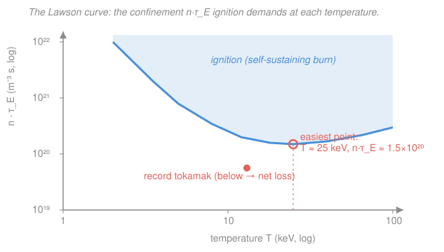

# Plasma Physics · Lesson 5.1: Fusion reactions & the Lawson criterion

> ⏱ ~15 min · Module 5: Fusion & astrophysical plasmas · Builds on: [4.4 Instabilities: two-stream, drift & interchange](04-04-instabilities-two-stream-drift.md), [`nuclear-particle-physics` syllabus](../../nuclear-particle-physics/syllabus.md) · Unlocks: [5.2 Magnetic confinement: tokamaks & mirrors](05-02-magnetic-confinement-tokamaks.md)

## Why this matters

Everything in Modules 1–4 — drifts, waves, the two-fluid and kinetic equations, instabilities — was built to answer one engineering question: **can we hold a plasma hot and dense enough, long enough, to make it burn?** Fusion is the sun's power source, and copying it on Earth means fighting the very instabilities you just met. This lesson gives you the single back-of-envelope inequality that every fusion device on the planet is measured against — the **Lawson criterion** — and lets you estimate, in one line, how far a machine is from *ignition*. It's the number that turns "plasma physics" into "power plant."

## The idea

To fuse, two nuclei must touch — but they're both positive, so they repel fiercely (the Coulomb barrier is hundreds of keV). Heat the gas to tens of millions of kelvin and the fastest particles in the thermal tail can quantum-**tunnel** through the barrier. So step one is **hot**: temperature $T \sim 10\text{–}30$ keV (1 keV $\approx 1.16\times10^7$ K).

But a single hot particle almost never finds a partner. The fusion rate per unit volume scales as $n^2$ — pack the particles **dense** and collisions get frequent. So step two is **dense**.

Step three is the subtle one. Even a hot dense plasma constantly *leaks* energy — radiation streaming out, particles escaping across field lines. If it cools faster than fusion reheats it, the fire dies. You must **hold the energy in** for long enough that fusion pays the bills. That "long enough" is the **energy confinement time** $\tau_E$.

Hot, dense, held. Lawson's insight: what matters is not any one of these but their **product** $n\,T\,\tau_E$. A tokamak wins with modest density held for seconds; a laser-imploded pellet wins with enormous density held for a nanosecond. Same product, same finish line. And once fusion's own byproducts reheat the plasma faster than it leaks — **ignition** — you can switch off the external heating and it burns on its own, like a log catching.

## The formal version

**The reaction.** The easiest fusion fuel is deuterium–tritium:

$$\mathrm{{}^2H} + \mathrm{{}^3H} \;\longrightarrow\; \mathrm{{}^4He}\,(3.5\ \mathrm{MeV}) + n\,(14.1\ \mathrm{MeV}), \qquad Q = 17.6\ \mathrm{MeV}.$$

*In words: a deuteron and a triton merge into a helium nucleus (an alpha) plus a neutron, releasing 17.6 MeV.* That $Q$-value is the mass deficit $\Delta m\,c^2$ — the [`nuclear-particle-physics`](../../nuclear-particle-physics/syllabus.md) energetics. The energy splits by momentum conservation: the light neutron takes 14.1 MeV and **escapes** the plasma (it's uncharged — magnetic fields ignore it; its energy is caught in a surrounding *blanket* that makes heat and breeds new tritium). The 3.5 MeV **alpha** is charged, so the field traps it, and it dumps its energy back into the fuel. That alpha self-heating, $E_\alpha = 3.5$ MeV per reaction, is the whole key to ignition.

**Reactivity.** The cross section $\sigma(v)$ rises steeply once particles can tunnel. Since the plasma is Maxwellian (from [`stat-mech`](../../stat-mech/syllabus.md)), we average $\sigma v$ over the velocity distribution to get the **reactivity** $\langle\sigma v\rangle(T)$ (units m³/s). The reaction rate per volume for a 50/50 D–T mix (so $n_D = n_T = n/2$, with $n$ the electron density) is

$$R = n_D\,n_T\,\langle\sigma v\rangle = \frac{n^2}{4}\,\langle\sigma v\rangle \quad (\text{reactions m}^{-3}\,\text{s}^{-1}).$$

*In words: rate = (chance of finding a pair) × (how eagerly a pair reacts).* The reactivity $\langle\sigma v\rangle$ is a **Gamow-peak** compromise: fusion happens in a narrow energy window set by the tension between the tunneling probability (which favors high energy) and the number of particles actually at that energy (which favors the bulk of the Maxwellian, not its sparse tail). The net result for D–T: $\langle\sigma v\rangle$ climbs sharply through $\sim$10 keV, peaks near $\sim$65 keV, and is already large by $\sim$15–30 keV — which, we'll see, is where you want to run.

**Energy balance.** Alpha self-heating power density:

$$P_\alpha = \frac{n^2}{4}\,\langle\sigma v\rangle\,E_\alpha.$$

This must beat two losses. First, **bremsstrahlung** — electrons braking in ion fields radiate X-rays that leave the plasma:

$$P_\mathrm{brem} \approx C_B\, n^2 \sqrt{T}, \qquad C_B \approx 5.35\times10^{-37}\ \tfrac{\mathrm{W\,m^3}}{\sqrt{\mathrm{keV}}} \;(n\ \text{in m}^{-3},\ T\ \text{in keV}).$$

*In words: radiation loss grows like density-squared and (mildly) with temperature.* Second, **transport loss** — heat carried out by escaping particles. Store $W = 3\,n k_B T$ of thermal energy (both species, $\tfrac32 n k_B T$ each) and let it drain over the confinement time $\tau_E$:

$$P_\mathrm{loss} = \frac{W}{\tau_E} = \frac{3\,n k_B T}{\tau_E}.$$

*In words: $\tau_E$ is the e-folding time for the plasma's stored heat to leak away — a big $\tau_E$ means good insulation.*

**Ignition condition.** Demand self-heating $\ge$ transport loss (drop brem for the clean form — it's the smaller loss in the burning regime):

$$\frac{n^2}{4}\langle\sigma v\rangle E_\alpha \;\ge\; \frac{3\,n k_B T}{\tau_E} \quad\Longrightarrow\quad \boxed{\,n\,\tau_E \;\ge\; \frac{12\,k_B T}{\langle\sigma v\rangle\,E_\alpha}\,}$$

Multiply by $T$ to get the temperature-tidy **triple product**:

$$n\,T\,\tau_E \;\ge\; \frac{12\,(k_B T)\,T}{\langle\sigma v\rangle\,E_\alpha} \;\approx\; 3\times10^{21}\ \mathrm{m^{-3}\,keV\,s} \quad(\text{D–T, near }T\sim15\ \mathrm{keV}).$$

*In words: you need enough particles, hot enough, held together long enough — the product is what matters, and you can trade them off.* Because $\langle\sigma v\rangle$ climbs with $T$, the right-hand side has a **minimum**: the $n\tau_E$ form bottoms out near $T\approx25$ keV at $n\tau_E \approx 1.5\times10^{20}\ \mathrm{m^{-3}\,s}$; the triple product $nT\tau_E$ bottoms out a bit lower, near $T\approx14$ keV. Run there and ignition is cheapest.

**Two thresholds, two roads.**
- **Breakeven** $Q=1$: fusion power out equals external heating power in. (Q is the fusion energy gain factor.)
- **Ignition** $Q=\infty$: alpha heating alone sustains the plasma — external heating off. This is the boxed inequality.
- **Magnetic confinement** (tokamaks, [5.2](05-02-magnetic-confinement-tokamaks.md)): modest $n\sim10^{20}\ \mathrm{m^{-3}}$, long $\tau_E\sim$ seconds.
- **Inertial confinement** (laser-imploded pellets): enormous $n\sim10^{31}\ \mathrm{m^{-3}}$, tiny $\tau_E\sim10^{-10}$ s.

Both must clear the *same* triple product. Different corners of $(n,\tau_E)$-space, one finish line.

## Picture

The blue curve is the ignition threshold $n\tau_E(T)$. Its **U-shape** is the whole story: at low $T$ the reactivity collapses (nobody tunnels) so you'd need absurd confinement; at very high $T$ the stored energy $\propto T$ grows faster than $\langle\sigma v\rangle$ helps, so the requirement creeps back up. The valley near 25 keV is where nature makes it easiest. A record tokamak sits *just below* the line — tantalizingly close, net-loss by a small factor.

## Worked examples

**Example 1 (the triple product at $T=15$ keV — where does $3\times10^{21}$ come from?).** Plug numbers into the threshold. Constants: $k_B T = 15\ \mathrm{keV} = 15\times1.602\times10^{-16} = 2.40\times10^{-15}$ J; $E_\alpha = 3.5\ \mathrm{MeV} = 5.6\times10^{-13}$ J; and for D–T at 15 keV, $\langle\sigma v\rangle \approx 2.4\times10^{-22}\ \mathrm{m^3/s}$. Then

$$n\tau_E \ge \frac{12\,k_B T}{\langle\sigma v\rangle E_\alpha} = \frac{12\,(2.40\times10^{-15})}{(2.4\times10^{-22})(5.6\times10^{-13})} = \frac{2.88\times10^{-14}}{1.34\times10^{-34}} \approx 2.1\times10^{20}\ \mathrm{m^{-3}\,s}.$$

Multiply by $T=15$ keV: $\;nT\tau_E \gtrsim 3.2\times10^{21}\ \mathrm{m^{-3}\,keV\,s}$ — the quoted figure. So a device at $n=10^{20}\ \mathrm{m^{-3}}$ needs $\tau_E \gtrsim 2$ s to ignite.

**Example 2 (which loss dominates?).** Take $n=10^{20}\ \mathrm{m^{-3}}$, $T=15$ keV. Alpha heating:

$$P_\alpha = \tfrac{n^2}{4}\langle\sigma v\rangle E_\alpha = \tfrac{(10^{20})^2}{4}(2.4\times10^{-22})(5.6\times10^{-13}) \approx 3.4\times10^{5}\ \mathrm{W/m^3} = 340\ \mathrm{kW/m^3}.$$

Bremsstrahlung:

$$P_\mathrm{brem} = C_B n^2 \sqrt{T} = (5.35\times10^{-37})(10^{20})^2\sqrt{15} \approx 2.1\times10^{4}\ \mathrm{W/m^3} = 21\ \mathrm{kW/m^3}.$$

So at 15 keV, alpha heating beats radiation by $\sim$16×. Radiation is *not* the enemy here — the transport loss $P_\mathrm{loss}=3nk_BT/\tau_E$ is, and that's exactly what $\tau_E$ must be large enough to suppress. But brem does set a hard floor: below $T\approx4$ keV, $\langle\sigma v\rangle$ has collapsed so far that $P_\mathrm{brem} > P_\alpha$ no matter how good your confinement — you literally cannot ignite D–T colder than that.

## Watch out

- **You might think higher temperature always helps.** It doesn't. Reactivity keeps rising to $\sim$65 keV, but the *stored energy you must pay for* rises as $T$ too, and running hotter than $\sim$30 keV also wastes power. The optimum is a valley, not a slope — that's why the Lawson curve turns back up.
- **You might treat "breakeven" and "ignition" as the same milestone.** Breakeven ($Q=1$) still needs the wall socket; ignition ($Q=\infty$) runs on its own alphas. The gap between them is enormous — most of fusion engineering lives in it.
- **You might count the neutron's 14.1 MeV as plasma heating.** It isn't — the neutron flies straight out (no charge, no confinement). Only the 3.5 MeV alpha stays. Use $E_\alpha$, not the full 17.6 MeV $Q$, in the balance. (The neutron energy still matters — for the blanket, tritium breeding, and material damage — just not for the *plasma's* thermal budget.)

## One-liner

> Fusion ignites when **hot × dense × well-confined** clears one bar: $nT\tau_E \gtrsim 3\times10^{21}\ \mathrm{m^{-3}\,keV\,s}$ — and only the trapped 3.5 MeV alpha, not the escaping neutron, pays for it.

## Problems

**P1 (🟢) — the ignition test (Boss problem 5).** A tokamak runs at $n = 1.5\times10^{20}\ \mathrm{m^{-3}}$, $T = 15$ keV, with energy confinement time $\tau_E = 1.5$ s. Compute its triple product $nT\tau_E$ and compare to the ignition threshold $\approx 3\times10^{21}\ \mathrm{m^{-3}\,keV\,s}$. Does it ignite, and by how much margin?

*Check.* Does your $nT\tau_E$ carry units $\mathrm{m^{-3}\,keV\,s}$, and is the margin a pure ratio?

**P2 (🟡) — alpha versus radiation.** At $n = 2\times10^{20}\ \mathrm{m^{-3}}$ and $T = 15$ keV ($\langle\sigma v\rangle \approx 2.4\times10^{-22}\ \mathrm{m^3/s}$), compute the alpha heating power density $P_\alpha$ and the bremsstrahlung loss $P_\mathrm{brem}$ (use $C_B = 5.35\times10^{-37}$). Which is larger, and by what factor? Both scale as $n^2$ — so does doubling the density change their *ratio*?

*Check.* Both should land in the $10^5$–$10^6\ \mathrm{W/m^3}$ range; the ratio should be density-independent.

**P3 (🔴, optional) — why an optimal temperature exists.** The required confinement is $n\tau_E \propto T/\langle\sigma v\rangle(T)$. Show that its minimum over $T$ occurs where $\dfrac{d\ln\langle\sigma v\rangle}{d\ln T} = 1$, and explain in words why the curve rises on *both* sides of that point.

Solutions

**P1** Triple product:

$$nT\tau_E = (1.5\times10^{20})(15)(1.5) = 3.4\times10^{21}\ \mathrm{m^{-3}\,keV\,s}.$$

Compare to the threshold $3\times10^{21}$: it **clears the bar**, with margin $3.4/3.0 \approx 1.13$ — ignition by about 13%, a thin but positive margin. (Equivalently: $n\tau_E = 1.5\times10^{20}\times1.5 = 2.25\times10^{20}\ \mathrm{m^{-3}\,s}$, just over the $\approx2\times10^{20}$ threshold at 15 keV.)

*Check.* Units: $\mathrm{m^{-3}}\cdot\mathrm{keV}\cdot\mathrm{s}$ ✓. The 13% margin is a dimensionless ratio ✓. In practice a 13% margin is dangerously slim — real designs aim well above threshold to absorb impurities, imperfect profiles, and transient losses.

**P2** Alpha heating:

$$P_\alpha = \frac{n^2}{4}\langle\sigma v\rangle E_\alpha = \frac{(2\times10^{20})^2}{4}(2.4\times10^{-22})(5.6\times10^{-13}) = (10^{40})(1.34\times10^{-34}) \approx 1.3\times10^{6}\ \mathrm{W/m^3}.$$

Bremsstrahlung:

$$P_\mathrm{brem} = C_B n^2\sqrt{T} = (5.35\times10^{-37})(2\times10^{20})^2\sqrt{15} = (5.35\times10^{-37})(4\times10^{40})(3.87) \approx 8.3\times10^{4}\ \mathrm{W/m^3}.$$

Alpha heating wins: ratio $\approx 1.3\times10^6 / 8.3\times10^4 \approx 16$. Since **both** go as $n^2$, doubling $n$ multiplies each by 4 and leaves the ratio unchanged — the alpha-vs-brem balance depends only on $T$, not on density. (This is why there's a temperature floor for ignition but no density floor from radiation.)

*Check.* $P_\alpha$ here is $4\times$ the Example-2 value (density doubled, $n^2$) — consistent ✓. Ratio $\approx16$ matches Example 2's $n=10^{20}$ case, confirming density-independence ✓.

**P3** Write $n\tau_E = g(T) \equiv 12\,k_B T/(E_\alpha\langle\sigma v\rangle) \propto T/\langle\sigma v\rangle$. Minimize by $\dfrac{d}{dT}\ln g = 0$:

$$\ln g = \text{const} + \ln T - \ln\langle\sigma v\rangle \;\Longrightarrow\; \frac{d\ln g}{d\ln T} = 1 - \frac{d\ln\langle\sigma v\rangle}{d\ln T} = 0,$$

so the minimum sits where $\dfrac{d\ln\langle\sigma v\rangle}{d\ln T} = 1$ — where reactivity's fractional growth just matches temperature's. **Below** that $T$: $\langle\sigma v\rangle$ climbs faster than $T$ (steep Gamow rise), so heating buys reactivity faster than it inflates the energy bill — $n\tau_E$ falls. **Above** it: $\langle\sigma v\rangle$ has flattened (heading toward its 65 keV peak) and grows slower than $T$, so the rising stored-energy cost $\propto T$ wins and $n\tau_E$ climbs back up. Hence a valley, minimized near $T\approx25$ keV for D–T.

*Check.* At the reactivity peak ($\sim$65 keV) $d\ln\langle\sigma v\rangle/d\ln T = 0 < 1$, well past the minimum — consistent with the optimum lying *below* the peak ✓.

## Flashback

**From Lesson 1.3 (Gyration & the E×B drift):** For ignition to work, the 3.5 MeV alpha must stay *inside* the machine long enough to give up its energy — i.e. its gyroradius must be small compared to the plasma. Estimate the gyroradius $r_L$ of a freshly born 3.5 MeV alpha (mass $m_\alpha = 6.68\times10^{-27}$ kg, charge $q = 2e = 3.2\times10^{-19}$ C) in a $B = 5$ T tokamak field. Is it well confined in a machine of minor radius $\sim1$ m? (Fresh variant — a fusion alpha, not the thermal ion of Lesson 1.3.)

Solution

Speed from the kinetic energy $E_\alpha = 5.6\times10^{-13}$ J:

$$v = \sqrt{\frac{2E_\alpha}{m_\alpha}} = \sqrt{\frac{2(5.6\times10^{-13})}{6.68\times10^{-27}}} = \sqrt{1.68\times10^{14}} \approx 1.3\times10^{7}\ \mathrm{m/s}.$$

Gyroradius (taking $v_\perp \approx v$):

$$r_L = \frac{m_\alpha v}{qB} = \frac{(6.68\times10^{-27})(1.3\times10^{7})}{(3.2\times10^{-19})(5)} = \frac{8.7\times10^{-20}}{1.6\times10^{-18}} \approx 0.054\ \mathrm{m} \approx 5\ \mathrm{cm}.$$

Five centimeters is small against a $\sim$1 m plasma, so the alpha is **well confined** — it spirals many times, thermalizing its 3.5 MeV into the fuel before it can wander out. That confinement is precisely what makes self-heating (and thus ignition) possible.

*Check.* $v/c \approx 0.043 \ll 1$, so non-relativistic treatment is fine ✓. Units: $\mathrm{kg\cdot(m/s)/(C\cdot T)} = \mathrm{m}$ ✓ (recall $r_L = mv/qB$ from [1.3](01-03-gyration-exb-drift.md)). A 5 cm orbit in a 1 m plasma is the same "gyroradius ≪ system size" magnetization condition from Module 1.

## Connections

- **Backward:** the trapped alpha's confinement is the gyration and magnetization of [1.3](01-03-gyration-exb-drift.md)–[1.5](01-05-adiabatic-invariants-mirrors.md); the reactivity $\langle\sigma v\rangle$ is a Maxwellian velocity average, the same moment-taking as [`stat-mech`](../../stat-mech/syllabus.md) and [2.1](02-01-distribution-function-moments.md); and every loss channel a device fights ([4.4](04-04-instabilities-two-stream-drift.md)'s instabilities) shows up here as a shrunken $\tau_E$.
- **Forward:** [5.2 Magnetic confinement: tokamaks & mirrors](05-02-magnetic-confinement-tokamaks.md) takes the "long $\tau_E$, modest $n$" road — building the toroidal geometry that fights the leaks. The reactor-engineering side (blanket, tritium breeding, materials) is the province of the [`fusion-plasma`](../../fusion-plasma/syllabus.md) course.
- **Sideways (nuclear physics):** the 17.6 MeV $Q$-value, the Coulomb barrier, and the tunneling cross section $\sigma(E)$ behind $\langle\sigma v\rangle$ are the [`nuclear-particle-physics`](../../nuclear-particle-physics/syllabus.md) reaction kinematics — the Gamow-peak trade-off between barrier penetration and the thinning Maxwellian tail is the bridge between "how nuclei react" and "how a plasma burns."
