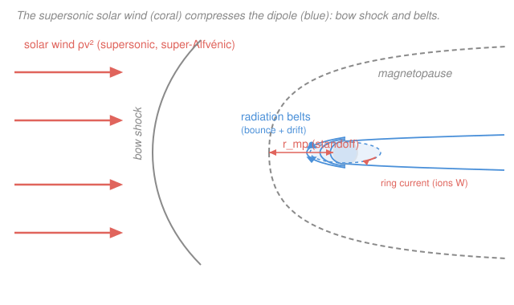

# Plasma Physics · Lesson 5.3: The solar wind & magnetospheres

> ⏱ ~15 min · Module 5: Fusion & astrophysical plasmas · Builds on: [5.2 Magnetic confinement: tokamaks & mirrors](05-02-magnetic-confinement-tokamaks.md), [3.2 The ideal-MHD equations & frozen-in flux](03-02-ideal-mhd-frozen-flux.md) · Unlocks: [5.4 Magnetic reconnection & astrophysical plasmas](05-04-magnetic-reconnection.md)

## Why this matters

This is the payoff lesson. Everything you built for a lab plasma — single-particle drifts, magnetic mirrors, frozen-in flux, pressure balance — turns out to describe the space weather around a star, unchanged. The Sun blows a supersonic magnetized plasma past every planet; Earth's own magnetic field carves out a cavity in that flow, traps a doughnut of lethal radiation, and lights the aurora when the wind gusts. One system, four tools you already own. If you can read a magnetosphere, you can read a solar plasma, a pulsar wind, or an accreting disk — the physics rescales.

## The idea

Start with a puzzle Eugene Parker faced in 1958. The Sun's corona is a million kelvin — so hot that its thermal pressure, dropping off slowly with distance, *cannot* be held down by the Sun's gravity out at large radius. A hot atmosphere that can't be contained doesn't just sit there: it **flows**. Parker showed the only self-consistent steady solution is a wind that starts slow (subsonic) near the Sun, accelerates outward, and passes smoothly through the sound speed to become **supersonic** — 400 to 800 km/s by the time it reaches us. He was ridiculed (a referee called it obviously wrong); Mariner 2 measured the wind two years later. That's the **solar wind**.

Now add magnetism. The coronal field is frozen into this plasma ([3.2](03-02-ideal-mhd-frozen-flux.md)), so the wind drags it outward. But the Sun *rotates* (once a month), so each field line's foot sweeps around while its far end streams radially — like water from a spinning garden sprinkler, the field winds into the **Parker spiral**.

Finally, aim that supersonic magnetized stream at a planet with a dipole field. The wind can't push through frozen-in field lines, so it piles up and a **bow shock** forms upstream (it's moving faster than the plasma's signal speed, so it can't get out of its own way). Behind the shock the wind's push balances the dipole's magnetic pressure at a boundary — the **magnetopause**. Inside that cavity the dipole is a giant magnetic mirror ([1.5](01-05-adiabatic-invariants-mirrors.md)): charged particles bounce pole to pole *and* drift around the planet ([1.4](01-04-gradb-curvature-polarization-drifts.md)), forming the **ring current** and the trapped **radiation belts**.

## The formal version

### Parker's wind

Take the corona to be steady, spherically symmetric, and **isothermal** (constant $T$, so pressure $p = \rho c_s^2$ with isothermal sound speed $c_s = \sqrt{k_B T/m}$; here $\rho$ is mass density, $m$ the proton mass, $k_B$ Boltzmann's constant). The radial MHD momentum equation ([3.2](03-02-ideal-mhd-frozen-flux.md)), with the magnetic force negligible for the flow speed, is

$$\rho v \frac{dv}{dr} = -\frac{dp}{dr} - \frac{G M_\odot\, \rho}{r^2},$$

balancing inertia against pressure gradient and the Sun's gravity ($M_\odot$ = solar mass, $G$ = gravitational constant, $v$ = radial speed). Mass conservation says $\rho v r^2 = \text{const}$. Combining the two and using $p=\rho c_s^2$ gives **Parker's equation**:

$$\left(v - \frac{c_s^2}{v}\right)\frac{dv}{dr} = \frac{2c_s^2}{r} - \frac{G M_\odot}{r^2}.$$

*In words: the flow can only speed up smoothly if, at the exact radius where the right side changes sign, the left side vanishes too — i.e. where $v = c_s$.* That special radius is the **sonic (critical) point**

$$r_c = \frac{G M_\odot}{2 c_s^2}.$$

Of all the mathematical solutions, exactly **one** threads through $(r_c, c_s)$ climbing from subsonic to supersonic — the transonic solution, the genuine wind. (The others either stay subsonic and fall back, or are double-valued and unphysical.) The wind is real because it is the unique smooth accelerating branch.

### The Parker spiral

The frozen-in field is carried radially at speed $v$, but its footpoint on the Sun rotates at angular rate $\Omega_\odot$. A parcel now at radius $r$ left the Sun a time $\approx r/v$ ago, during which the foot rotated by $\Omega_\odot r/v$. The field therefore makes a **spiral angle** $\psi$ with the radial direction given by

$$\tan\psi = \frac{B_\phi}{B_r} = \frac{\Omega_\odot\, r}{v}.$$

*In words: close to the Sun the field is nearly radial; far out the azimuthal winding dominates.* At Earth's orbit this works out near $45^\circ$ (computed below).

### The magnetopause — pressure balance

The wind's momentum flux (dynamic or **ram pressure**) is $\rho_{sw} v_{sw}^2$. A planetary dipole has equatorial field strength that falls as the cube of distance,

$$B_d(r) = B_0\left(\frac{R_E}{r}\right)^{3},$$

with $B_0$ the surface equatorial field and $R_E$ the planet's radius. The wind is stopped where its ram pressure equals the dipole's **magnetic pressure** $B_d^2/2\mu_0$ ([3.3](03-03-magnetic-pressure-tension-beta.md)):

$$\rho_{sw} v_{sw}^2 = \frac{B_d(r_{mp})^2}{2\mu_0} = \frac{B_0^2}{2\mu_0}\left(\frac{R_E}{r_{mp}}\right)^{6}.$$

*In words: the wind digs into the dipole until the field is squeezed hard enough to push back exactly as hard as the wind pushes.* Solving for the **standoff distance**,

$$\boxed{\;\frac{r_{mp}}{R_E} = \left(\frac{B_0^2}{2\mu_0\,\rho_{sw} v_{sw}^2}\right)^{1/6}.\;}$$

The sixth root makes the standoff wonderfully insensitive to the wind: even a big gust barely moves it.

### Mirror + drift = the belts

Inside the cavity the dipole field is weak at the equator and strong near the poles — a natural **magnetic mirror** ([1.5](01-05-adiabatic-invariants-mirrors.md)). A particle with enough perpendicular energy (pitch angle outside the loss cone) conserves its magnetic moment $\mu = mv_\perp^2/2B$ and **bounces** between hemispheres. Simultaneously the field's gradient and curvature drive an azimuthal **grad-B/curvature drift** ([1.4](01-04-gradb-curvature-polarization-drifts.md)),

$$\mathbf{v}_{\nabla B} = \frac{m v_\perp^2}{2 q B^3}\,\mathbf{B}\times\nabla B,$$

whose sign flips with charge $q$: **ions drift west, electrons east**. Because both the charge and the drift direction flip together, both species carry current *the same way* — a net **westward ring current** encircling the planet — while filling the toroidal **radiation (Van Allen) belts**. When particles are scattered *into* the loss cone (by a storm or a wave), they mirror too deep, hit the atmosphere, and precipitate as the **aurora**.

## Picture

## Worked examples

**Example 1 — Earth's magnetopause.** Use nominal solar-wind values: number density $n_{sw} = 5\times10^{6}\ \mathrm{m^{-3}}$, so $\rho_{sw} = n_{sw} m_p = 5\times10^{6}\times1.67\times10^{-27} = 8.4\times10^{-21}\ \mathrm{kg\,m^{-3}}$; speed $v_{sw} = 4\times10^{5}\ \mathrm{m/s}$; Earth's surface field $B_0 = 3.1\times10^{-5}\ \mathrm{T}$.

Ram pressure: $\rho_{sw} v_{sw}^2 = 8.4\times10^{-21}\times(4\times10^{5})^2 = 1.3\times10^{-9}\ \mathrm{Pa}$ (about 1.3 nPa). Surface magnetic pressure: $B_0^2/2\mu_0 = (3.1\times10^{-5})^2/(2\times4\pi\times10^{-7}) = 3.8\times10^{-4}\ \mathrm{Pa}$. Their ratio is $2.9\times10^{5}$, so

$$\frac{r_{mp}}{R_E} = (2.9\times10^{5})^{1/6} \approx 8.1.$$

The dipole holds the wind off at roughly $8\,R_E$. (The observed subsolar magnetopause sits near $10\,R_E$; the currents flowing *on* the boundary roughly double the field there, $B\to 2B_d$, and $4^{1/6}=1.26$ nudges the estimate to $\approx 10\,R_E$ — a satisfying match.)

**Example 2 — the spiral at Earth.** The Sun rotates once every $\approx 25.4$ days, so $\Omega_\odot = 2\pi/(25.4\times86400\ \mathrm{s}) = 2.86\times10^{-6}\ \mathrm{rad/s}$. At $r = 1\ \mathrm{AU} = 1.50\times10^{11}\ \mathrm{m}$ with $v = 4\times10^{5}\ \mathrm{m/s}$:

$$\tan\psi = \frac{\Omega_\odot r}{v} = \frac{2.86\times10^{-6}\times1.50\times10^{11}}{4\times10^{5}} = 1.07 \;\Longrightarrow\; \psi \approx 47^\circ.$$

The interplanetary field arrives at Earth tilted almost halfway between radial and azimuthal — the famous $\approx 45^\circ$ Parker angle. Faster wind unwinds the spiral (smaller $\psi$); slower wind coils it tighter.

## Watch out

- **You might think the wind is "pushed out" by gravity losing.** It isn't a launch — it's a *pressure-driven* expansion. Gravity never wins or loses cleanly; the transonic solution is the unique smooth branch, and it exists because the pressure gradient of a hot, slowly-thinning corona outmuscles gravity at large $r$. Delete the heat (cold corona) and there is no supersonic wind.
- **You might expect ion and electron drifts to cancel the ring current.** They drift in *opposite* directions, but current is $q\mathbf{v}$ — and $q$ flips too. West-drifting ions and east-drifting electrons both make a westward current. It *adds*.
- **You might think a stronger solar wind dramatically compresses the magnetosphere.** The standoff scales as (pressure)$^{-1/6}$. Doubling the ram pressure moves the magnetopause in by only $2^{1/6}=1.12$, about 12%. The dipole is stiff.
- **Don't confuse the bow shock with the magnetopause.** The bow shock (further out) is where the *supersonic* wind abruptly slows and heats — it exists only because the wind is super-fast. The magnetopause (inside it) is the pressure-balance boundary of the field cavity. Two different surfaces, two different physics.

## One-liner

> A star's hot corona can't stay bound, so it blows a supersonic frozen-in wind that spirals outward and slams into planetary dipoles — where pressure balance sets the magnetopause and a mirror-plus-drift geometry traps the radiation belts.

## Problems

**P1 (🟢)** Jupiter has surface equatorial field $B_0 = 4.3\times10^{-4}\ \mathrm{T}$ and radius $R_J = 7.0\times10^{7}\ \mathrm{m}$. At Jupiter's orbit the solar wind is thinner and slower: take $\rho_{sw} = 4\times10^{-22}\ \mathrm{kg\,m^{-3}}$ and $v_{sw} = 4\times10^{5}\ \mathrm{m/s}$. Estimate the magnetopause standoff $r_{mp}/R_J$ from pressure balance. **Check:** is it larger or smaller (in planetary radii) than Earth's $\approx 8$? Does that make sense?

**P2 (🟡)** At Mercury's orbit, $r = 0.39\ \mathrm{AU}$, the wind is faster, $v = 3.5\times10^{5}\ \mathrm{m/s}$ isn't the point — use the *same* $v = 4\times10^{5}\ \mathrm{m/s}$ for a clean comparison. Compute the Parker spiral angle $\psi$ there and compare to Earth's $47^\circ$. **Check:** should the field be more radial or more wound-up closer to the Sun?

**P3 (🔴, optional)** Explain, using the magnetic moment $\mu = mv_\perp^2/2B$ and the grad-B drift, (a) why a dipole *traps* a particle rather than letting it escape along a field line, and (b) why the ring current flows westward regardless of whether you follow the ions or the electrons.

Solutions

**P1** Ram pressure at Jupiter's orbit: $\rho_{sw}v_{sw}^2 = 4\times10^{-22}\times(4\times10^{5})^2 = 6.4\times10^{-11}\ \mathrm{Pa}$. Surface magnetic pressure: $B_0^2/2\mu_0 = (4.3\times10^{-4})^2/(2\times4\pi\times10^{-7}) = (1.85\times10^{-7})/(2.51\times10^{-6}) = 7.36\times10^{-2}\ \mathrm{Pa}$. Ratio $= 7.36\times10^{-2}/6.4\times10^{-11} = 1.15\times10^{9}$, so

$$\frac{r_{mp}}{R_J} = (1.15\times10^{9})^{1/6} \approx 32.$$

**Check.** About $32\,R_J$ — far larger, in planetary radii, than Earth's $8\,R_E$. It should be: Jupiter's field is $\sim14\times$ Earth's *and* the wind out there is much feebler, both of which push the standoff out. (In reality Jupiter's magnetosphere is even bigger, $\sim60$–$90\,R_J$, inflated by its own internal plasma from Io — but the dipole estimate already shows it dwarfs Earth's.) Units: pressures both in Pa, ratio dimensionless, sixth root dimensionless ✓.

**P2** With $\Omega_\odot = 2.86\times10^{-6}\ \mathrm{rad/s}$, $v = 4\times10^{5}\ \mathrm{m/s}$, and $r = 0.39\ \mathrm{AU} = 0.39\times1.50\times10^{11} = 5.83\times10^{10}\ \mathrm{m}$:

$$\tan\psi = \frac{\Omega_\odot r}{v} = \frac{2.86\times10^{-6}\times5.83\times10^{10}}{4\times10^{5}} = 0.417 \;\Longrightarrow\; \psi \approx 23^\circ.$$

**Check.** Closer to the Sun the field is *more radial* ($23^\circ$ vs Earth's $47^\circ$) — exactly right: the wind hasn't traveled long enough for solar rotation to wind the field up much. $\tan\psi\propto r$, so halving the distance roughly halves $\tan\psi$; here $0.39\times1.07=0.42$ ✓.

**P3** (a) The dipole field is weak at the equator and strengthens toward each pole. A trapped particle conserves $\mu = mv_\perp^2/2B$ (first adiabatic invariant) and total kinetic energy $\tfrac12 m(v_\perp^2+v_\parallel^2)$. As it moves poleward into rising $B$, holding $\mu$ fixed forces $v_\perp^2 = 2\mu B/m$ to grow, so $v_\parallel^2$ must shrink to conserve energy. At the mirror point $v_\parallel\to0$ and the particle is turned back — it bounces between two mirror points instead of streaming out. Only particles launched nearly parallel to $\mathbf{B}$ (inside the loss cone) reach strong enough $B$ before mirroring and hit the atmosphere; the rest are trapped. (b) Grad-B drift is $\mathbf{v}_{\nabla B}\propto (1/q)\,\mathbf{B}\times\nabla B$. Ions ($q>0$) and electrons ($q<0$) drift in opposite azimuthal senses — ions west, electrons east. But the current each carries is $\mathbf{J}=nq\mathbf{v}_{\nabla B}$: for ions, positive $q$ times westward velocity gives westward current; for electrons, negative $q$ times eastward velocity *also* gives westward current. The two species reinforce, not cancel — a net westward ring current.

**Check.** A westward ring current produces, at Earth's surface, a southward (opposing) magnetic perturbation — precisely the depression of the horizontal field ("Dst") measured during geomagnetic storms ✓.

## Flashback

**From Lesson 5.1 (Fusion & the Lawson criterion):** A magnetic-confinement plasma runs at ion density $n = 1.5\times10^{20}\ \mathrm{m^{-3}}$ and temperature $T = 12\ \mathrm{keV}$. Taking the D–T ignition threshold as a triple product $nT\tau_E \gtrsim 3\times10^{21}\ \mathrm{keV\,s\,m^{-3}}$, what minimum energy-confinement time $\tau_E$ must it achieve?

Solution

Solve the triple-product condition for $\tau_E$:

$$\tau_E \geq \frac{3\times10^{21}}{n\,T} = \frac{3\times10^{21}}{(1.5\times10^{20})(12)} = \frac{3\times10^{21}}{1.8\times10^{21}} \approx 1.7\ \mathrm{s}.$$

**Check.** Units: $\dfrac{\mathrm{keV\,s\,m^{-3}}}{\mathrm{m^{-3}\cdot keV}} = \mathrm{s}$ ✓. A confinement time of order a second at these densities is exactly the regime ITER is built to reach — consistent with 5.1's message that the *product* is what matters, so you can trade density against confinement time.

## Connections

- **Backward:** this lesson cashes in [3.2](03-02-ideal-mhd-frozen-flux.md)'s frozen-in flux (the wind drags the coronal field into the spiral), [3.3](03-03-magnetic-pressure-tension-beta.md)'s magnetic pressure (the magnetopause is a pressure balance), and the mirror ([1.5](01-05-adiabatic-invariants-mirrors.md)) and grad-B/curvature drifts ([1.4](01-04-gradb-curvature-polarization-drifts.md)) that trap the belts. Same tools as the confinement machines of [5.2](05-02-magnetic-confinement-tokamaks.md) — a planetary dipole is nature's magnetic bottle.
- **Forward:** [5.4 Magnetic reconnection & astrophysical plasmas](05-04-magnetic-reconnection.md) asks what happens when frozen-in flux *breaks* — at the dayside magnetopause and in the magnetotail, reconnection lets solar-wind field merge with the dipole, dumping energy into storms, substorms, and the aurora.
- **Sideways (astrophysics):** the same Parker analysis scales up to stellar winds, pulsar winds, and the launching of astrophysical outflows — see the [`astrophysics` syllabus](../../astrophysics/syllabus.md). The transonic critical-point structure reappears in Bondi accretion (the wind run in reverse).
