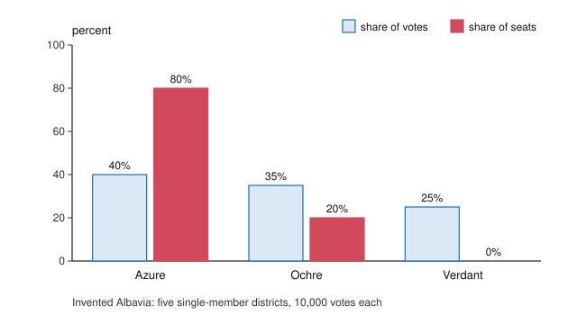

# Political Institutions · Lesson 1.1: Anatomy of an electoral system: plurality and runoff

> ⏱ ~15 min · Module 1: The mechanics of electoral systems · Builds on: none (first lesson) · Unlocks: [1.2 Ranked ballots: the alternative vote and STV](01-02-ranked-ballots-the-alternative-vote-and-stv.md)

## Why this matters

The same votes can elect different people. Change the counting rule and the winner of a district changes; change it across a country and a party with 40% of the vote can hold 80% of the seats or 40%. Every later lesson in this course, from coalition building to Lijphart's map, sits on top of that conversion. This lesson builds the frame that every electoral system fits into and runs the two simplest rules: elect whoever comes first, or hold a second round when no one has enough.

## The idea

An electoral system is a machine with three dials, a frame that goes back to Douglas Rae's *The Political Consequences of Electoral Laws* (1967). Every system in Module 1 is a setting of them.

- **Ballot structure.** What the voter may say. A *categorical* ballot names one choice; an *ordinal* ballot ranks several. Lesson [1.2](01-02-ranked-ballots-the-alternative-vote-and-stv.md) takes up ranked ballots; this lesson uses the single mark.
- **District magnitude**, written $M$: how many seats a district elects. $M = 1$ is a single-member district.
- **Electoral formula**: the rule that turns marks into winners.

These are the **[three parts of an electoral system](../reference.md#three-parts-of-an-electoral-system)**. They are not equally powerful: [2.2](02-02-district-magnitude-and-thresholds.md) shows that [district magnitude](../reference.md#district-magnitude) does most of the work on proportionality.

With $M = 1$ there are two families of formula, and the difference is one word. A **plurality** is more votes than anyone else. An **absolute majority** is more than half of the votes cast. Three candidates on 38%, 34% and 28%: the first has a plurality and no majority. **[Plurality and majority](../reference.md#plurality-and-majority)** rules differ exactly on what to do with that candidate.

## The mechanism

**[First-past-the-post](../reference.md#first-past-the-post)** (FPTP): single-member districts, a categorical ballot, plurality formula. It elects the UK House of Commons and, as of 2026, the US House in most states (a few use runoffs or ranked ballots).

1. Count each candidate's votes in the district.
2. The candidate with the most votes wins the seat. No threshold; 34% can win.
3. Repeat in every district. A party's seat total is the number of districts it tops; votes beyond the winning margin, and every vote for a loser, change nothing.

*In words:* a district is a winner-take-all contest, and a national result is a sum of such contests, not a share of the national vote.

**The [two-round system](../reference.md#two-round-system)** asks for an absolute majority and, failing that, votes again among fewer candidates. France uses two versions (rules as of 2026).

4. **Round one.** Count as under FPTP. If someone has an absolute majority (and meets any extra condition), they win.
5. **Who advances.** For the French presidency, Article 7 of the Constitution (official English translation) sets a top-two rule: "Only the two candidates polling the greatest number of votes in the first ballot, after any withdrawal of better placed candidates, may stand in the second ballot." For the National Assembly the Electoral Code is different. A first-round win needs an absolute majority of votes cast **and** votes equal to at least a quarter of *registered* voters (Article L126). To advance, a candidate needs votes equal to 12.5% of registered voters (Article L162); if only one reaches that, the runner-up may also advance, and if none does, the top two may.
6. **Round two.** The presidential runoff has two candidates, so its winner has a majority of the votes cast in it. The legislative second round is decided by plurality (L126), so if three candidates qualify (a *triangulaire*), the winner may again lack a majority.

*In words:* the presidential rule fixes the field at two; the legislative rule fixes a *bar*, and how many clear it depends on turnout. A bar of 12.5% of registered voters is $12.5\%/t$ of the votes cast when turnout is $t$: 20.8% of votes at 60% turnout, 31.25% at 40%. Low turnout narrows the field. And below 50% turnout the quarter-of-registered condition, not the majority, is the binding one for a first-round win.

Keep three kinds of claim apart. Steps 1–6 are **mechanical**: they follow from the rule's text and have right answers. That plurality districts tend to settle into two serious candidates is **empirical**, a sturdy regularity at the district level with well-known national exceptions, and it is [2.3](02-03-duvergers-law-observed.md)'s subject. Whether a winner should need a majority is **normative**; [`political-philosophy` 5.1](../../political-philosophy/lessons/05-01-why-democracy.md) asks what democratic procedures are for.

**Where the rule runs out.** The count settles who won given the votes. It does not settle what candidates and voters do between rounds. A qualified third-placed candidate may stay in or stand down, with or without endorsing someone (the French call it a *désistement*), and parties bargain over this in the week between rounds. Article 7's phrase "after any withdrawal of better placed candidates" shows the presidential rule anticipating withdrawal while leaving the choice to the candidates. Exact ties are the other gap: for the legislative second round L126 names the tie-breaker, the elder candidate.

## Votes and seats

*Invented Albavia: five districts of 10,000 votes each. Azure leads in four with 45%, 42%, 39% and 38%; Ochre leads in the fifth with 43%. Nationally Azure has 20,000 votes (40%), Ochre 17,500 (35%), Verdant 12,500 (25%), so Azure turns 40% of the votes into four of five seats, and Verdant's 12,500 votes elect no one.* This seat bonus to the leader is a mechanical consequence of these particular numbers, not a law. Move 400 Azure voters to Ochre in district 4 and the seats split 3–2. [2.1](02-01-measuring-outcomes.md) turns the gap between the bars into an index.

## Worked examples

**Example 1 (clean): one Albavian district, two rules.** 50,000 votes: Ochre 19,000 (38%), Azure 17,000 (34%), Verdant 14,000 (28%). Verdant's voters, polled, would choose Azure 11,000, Ochre 2,000, and 1,000 would not vote.

*FPTP.* Ochre wins with 38%. No threshold is needed.

*Two-round, top-two.* A majority needs more than 25,000; no one has it. Ochre and Azure advance. Round two: Azure $17{,}000 + 11{,}000 = 28{,}000$, Ochre $19{,}000 + 2{,}000 = 21{,}000$. Azure wins with 57.1% of the 49,000 votes cast.

The winner flips, and Verdant is why. Under FPTP its 14,000 votes split the voters who prefer Azure to Ochre; this is the **[spoiler effect](../reference.md#spoiler-effect)**: a candidate who cannot win changes who does. The runoff lets those voters say their second choice. Rule that decides: plurality for FPTP; the majority requirement plus the top-two rule for the runoff.

**Example 2 (hard): a legislative-style count at low turnout.** Albavia adopts the French Assembly rules. A district has 80,000 registered voters and 36,000 votes cast (45% turnout): A 13,600 (37.8%), B 10,600 (29.4%), C 10,200 (28.3%), D 1,600 (4.4%).

*Round one.* A first-round win needs more than 18,000 votes and at least 20,000 (a quarter of 80,000); at this turnout the second condition binds, and no one meets either. The advancement bar is $0.125 \times 80{,}000 = 10{,}000$ votes, 27.8% of those cast. A, B and C clear it: a *triangulaire*.

*Round two.* Here the rule stops. If C stays in, the second round is a three-way plurality contest and A starts with the largest base. If C stands down for B, it is a duel whose result depends on where C's voters go. The Code fixes who *may* stand; it says nothing about who *will*. Notice how close the margin was: C cleared the bar by 200 votes. At 50% turnout with the same shares, C would hold 11,333 votes against a bar of 10,000; at 40% turnout, about 9,067 against 10,000. B would fall short too (about 9,422) and advance only as runner-up under L162's fallback, so the race would have been a duel from the start.

## Watch out

- **You might think "plurality systems produce two parties" is part of the rule, but actually it is an empirical claim.** The rule says only that the top vote-getter wins. Two-candidate competition in plurality districts is a well-documented tendency, and Canada and India are standard national counterexamples; [2.3](02-03-duvergers-law-observed.md) separates the mechanical effect from voters' strategic response.
- **You might think the French presidential and legislative runoffs are the same rule, but actually they differ in kind.** The presidential rule caps the second round at two; the legislative rule sets a bar measured against *registered* voters, so the number of finalists moves with turnout and the legislative winner can lack a majority.
- **You might think a runoff is just the alternative vote held on two days, but actually** voters in round two can react to round one, candidates can withdraw, and turnout changes. The alternative vote ([1.2](01-02-ranked-ballots-the-alternative-vote-and-stv.md)) fixes every ranking in advance and eliminates one candidate at a time.

## One-liner

> An electoral system is a ballot, a district magnitude and a formula; with one seat per district, plurality crowns the leader however small their share, a runoff demands a majority or a second look, and neither rule says what candidates and voters do in between.

## Problems

**P1 (🟢) *(Formal (a)-(c).)*** An Albavian district has 64,000 registered voters and 40,000 votes cast: P 15,200, Q 12,400, R 8,400, S 4,000.

(a) Who wins under FPTP, and with what share of the votes cast?

(b) Under the French National Assembly rules, does anyone win in round one? Which candidates may stand in round two? Which would advance under the presidential top-two rule instead?

(c) R withdraws and endorses Q. In round two, R's voters split 6,000 to Q, 1,400 to P, 1,000 abstain; S's voters split 1,800 to Q, 1,600 to P, 600 abstain; P's and Q's first-round voters return. Who wins, with what share?

**P2 (🟡) *(Exegetical (a)-(c).)*** Diagnose. An **invented** news report from Albavia; no words here belong to any real person or outlet:

> (i) "The Ochre candidate took the Westerly seat last night with just 34% of the vote, ahead of Azure on 31%, Verdant on 22% and Teal on 13%." (ii) "Two-thirds of voters rejected her," said a rival campaign. (iii) "This is what plurality voting does: it always ends in a two-party race, and it always hands the seat to someone most voters oppose."

(a) Name the dial settings (magnitude and formula) that let 34% win, and say what sentence (i)'s numbers would have triggered under a top-two runoff. Two sentences.

(b) Is sentence (ii) a mechanical fact about the count? Say what information the count does not contain. 60 words or fewer.

(c) Sentence (iii) makes two claims. For each, say whether it is mechanical or empirical, and whether the report itself bears on it. 80 words or fewer.

Solutions

**P1** *(Formal (a)-(c), strict)*

(a) Votes cast: $15{,}200 + 12{,}400 + 8{,}400 + 4{,}000 = 40{,}000$. **P wins**, with $15{,}200/40{,}000 = 38\%$.

(b) Turnout $= 40{,}000/64{,}000 = 62.5\%$.

| Test | Bar | Who passes |
|---|---|---|
| Round-one win: absolute majority of votes cast | more than 20,000 | no one |
| Round-one win: quarter of registered | at least 16,000 | no one |
| Advance: 12.5% of registered | at least 8,000 | P, Q, R |

**No round-one winner.** P (15,200), Q (12,400) and R (8,400) may stand: a possible *triangulaire*. S (4,000) is out. Under the presidential top-two rule only **P and Q** advance.

(c) P: $15{,}200 + 1{,}400 + 1{,}600 = 18{,}200$. Q: $12{,}400 + 6{,}000 + 1{,}800 = 20{,}200$. Votes cast in round two: 38,400. **Q wins** with $20{,}200/38{,}400 \approx 52.6\%$.

**Must hit, strict:**

- (a) P, 38%.
- (b) Both first-round conditions fail; the advancement bar is 8,000 votes (12.5% of *registered*), so three qualify; top-two gives P and Q.
- (c) Q 20,200 to P 18,200; Q wins with about 52.6%.

**Wrong turns:** applying the presidential top-two rule to the Assembly count and dropping R; declaring P the round-two winner because P led round one; computing the 52.6% over 40,000 instead of the 38,400 who voted in round two.

---

**P2** *(Exegetical (a)-(c), strict)*

**Must hit, strict (a):**

- A single-member district ($M = 1$) with a plurality formula: the leader wins whatever the share.
- Under a top-two runoff, 34% is not an absolute majority, so Ochre and Azure would go to a second round.

**Must hit, strict (b):**

- No. The count shows only that 66% gave their *first* choice to someone else. A categorical ballot records no second preferences, so it cannot show that those voters prefer any particular rival to Ochre. Ochre could even beat each rival head to head.

**Must hit, strict (c):**

- "Always ends in a two-party race" is empirical (an observed tendency, not part of the rule), and this report is evidence *against* it here: four candidates, three of them above 20%.
- "Always hands the seat to someone most voters oppose" is a mechanical-sounding overstatement: plurality permits a winner without a majority but does not guarantee one, and whether most voters *oppose* the winner turns on preferences the ballot does not record.

**Wrong turns:** treating (ii) as arithmetic because $100 - 34 = 66$; calling the two-party claim mechanical because it is often stated as a "law"; arguing that plurality is unfair, which no part asks.

**Model answer (c):** The two-party claim is empirical, a tendency observed across plurality districts rather than anything the rule states, and this four-way race with three candidates above 20% cuts against it. The second claim misdescribes the mechanism: plurality allows a minority winner but does not require one, and "oppose" needs second preferences the ballot never collected.

## Connections

- **Backward:** none in this course. Plurality as a social choice rule, and how a voter can manipulate it, is in [`grad-game-theory` 5.1](../../grad-game-theory/lessons/05-01-social-choice-impossibility.md); the Condorcet winner behind P2(b) is [`political-philosophy` 5.4](../../political-philosophy/lessons/05-04-does-social-choice-wound-democracy.md)'s, cited, not re-taught.
- **Forward:** [1.2](01-02-ranked-ballots-the-alternative-vote-and-stv.md) collapses the runoff into one ranked ballot; [1.3](01-03-list-pr-quotas-and-largest-remainders.md) raises $M$ above 1; [2.1](02-01-measuring-outcomes.md) measures the seat bonus in the figure; [2.3](02-03-duvergers-law-observed.md) asks whether plurality really yields two parties; [2.4](02-04-districts-and-electoral-reform.md) asks who draws the districts and who changes the rules.
- **Sideways:** Mill's complaint that winner-take-all districts give government by a mere majority and disfranchise every minority is [`history-of-political-thought` 6.4](../../history-of-political-thought/lessons/06-04-mill-representative-government.md). Why voters desert third candidates, as an equilibrium of strategic voting, belongs to [`political-economy`](../../political-economy/syllabus.md); scoring-rule properties of these rules to [`social-choice`](../../social-choice/syllabus.md).
