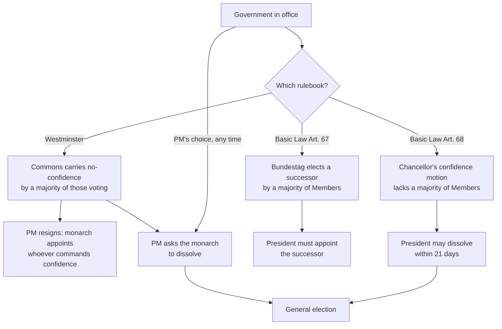

# Political Institutions · Lesson 3.1: Parliamentary government

> ⏱ ~15 min · Module 3: Executive-legislative relations · Builds on: [2.3 Duverger's law, observed](02-03-duvergers-law-observed.md), [`history-of-political-thought` 5.1 Montesquieu](../../history-of-political-thought/lessons/05-01-montesquieu-the-spirit-of-the-laws.md) · Unlocks: [3.2 Forming governments](03-02-forming-governments-coalitions-and-minorities.md), [3.3 Presidential government](03-03-presidential-government.md)

## Why this matters

Montesquieu warned that if, with no monarch, the executive were handed to persons taken from the legislature, liberty would end; yet Britain was already moving that way, with Walpole leading the ministry from the Commons ([`history-of-political-thought` 5.1](../../history-of-political-thought/lessons/05-01-montesquieu-the-spirit-of-the-laws.md), Example 2). That lesson left open whether such a system still checks power. This one takes up the machinery, which Britain, Germany, the Netherlands, Spain, Canada, Australia, Japan and India all run on. To read any crisis in these countries you need two questions: who can remove the government, and who can call an election?

## The idea

In a **[parliamentary government](../reference.md#parliamentary-government)** the head of government (prime minister, chancellor) and the cabinet hold office only while the elected chamber tolerates them. Walter Bagehot (*The English Constitution*, 1867) called this the near-**fusion** of executive and legislative power: the cabinet is, in effect, a committee of the parliamentary majority.

Fusion runs on two levers pointing in opposite directions:

- **Confidence** (chamber → government). A majority can vote the government out. *In words:* the government's survival depends on the chamber.
- **Dissolution** (government → chamber). The head of government can, under some rules, end the chamber's term and force an election. *In words:* the chamber's survival can depend on the government.

Each side holds a gun to the other's head, and the rulebook decides who may pull which trigger, when, and by what count. Keep three kinds of claim apart throughout. **Mechanical**: what a rule does by its text ("a majority of its Members" means 151 of 300). **Empirical**: what such systems are observed to do. **Normative**: whether fusion is better than separation, which is [`political-philosophy`](../../political-philosophy/syllabus.md)'s question, not this lesson's.

## Source

Germany's Basic Law, Article 67 (official English translation):

> "(1) The Bundestag may express its lack of confidence in the Federal Chancellor only by electing a successor by the vote of a majority of its Members and requesting the Federal President to dismiss the Federal Chancellor. The Federal President must comply with the request and appoint the person elected. (2) Forty-eight hours shall elapse between the motion and the election."

Read it closely. **"Only"** excludes the ordinary no-confidence motion: a majority that merely says *no* to the chancellor has, constitutionally, said nothing. **"By electing a successor"** makes removal and replacement one act, so there is never an interval with no chancellor. **"A majority of its Members"** is an absolute majority of the whole chamber, not of those voting, so abstaining counts exactly like voting no. **"Must comply"** strips the President of discretion. **"Forty-eight hours"** builds in a cooling-off period. This is the **[constructive vote of no confidence](../reference.md#constructive-vote-of-no-confidence)**. Spain's 1978 constitution copies the idea: its censure motion must name a candidate for prime minister (Article 113).

## The mechanism

1. **Formation.** The head of government must have, or at least not lack, a majority. Under **[Westminster conventions](../reference.md#westminster-conventions)** the monarch appoints whoever can command the confidence of the Commons; no vote is required. Germany requires one: the Bundestag elects the chancellor by a majority of its Members (Article 63), an **[investiture vote](../reference.md#investiture-vote)**. Lesson [3.2](03-02-forming-governments-coalitions-and-minorities.md) owns formation.
2. **Survival.** At Westminster, a government defeated on an explicit motion of no confidence is expected, by convention, to resign or ask for a dissolution. The count is a simple majority of those voting: on 28 March 1979 the Commons carried a no-confidence motion against James Callaghan's government by 311 to 310 (Hansard), and an election followed. In Germany, survival is governed by Article 67 alone (**[confidence and no-confidence](../reference.md#confidence-and-no-confidence)**).
3. **Dissolution.** UK: the **[dissolution](../reference.md#dissolution)** power is a royal prerogative exercised on the prime minister's request. The Fixed-term Parliaments Act 2011 took it away: an early election then needed a two-thirds Commons vote, or a no-confidence vote followed by 14 days without a confidence vote. The Dissolution and Calling of Parliament Act 2022 reversed this. Its section 1 reads, in full, "The Fixed-term Parliaments Act 2011 is repealed"; section 2 revives the prerogative, section 3 bars the courts from reviewing its use, and section 4 dissolves a Parliament automatically five years after it first met (all as of 2026). Germany: the Bundestag cannot dissolve itself. The main route is Article 68: if the chancellor asks for a vote of confidence and does not get a majority of the Members, the President *may*, on the chancellor's proposal, dissolve within 21 days, a right that lapses once the Bundestag elects another chancellor.
4. **Caretaking.** A departing government keeps running affairs until a successor takes office; in Germany the President can require it (Article 69(3)). This is a **[caretaker government](../reference.md#caretaker-government)**.

*In words:* Westminster makes removal easy and lets the head of government choose the election date; Germany makes removal hard (you must agree on a replacement) and makes elections hard to call.

**Empirical, and stated as such.** Formal defeats are rare. The 1979 vote was the only UK government defeat on a confidence motion since the 1920s. Comparative data on how cabinets end (a literature that includes Laver and Schofield's *Multiparty Government*, 1990) show lost confidence votes to be a small share of terminations: most cabinets end at scheduled elections, through coalition breakups, or by a leader's resignation. That much is a well-documented descriptive pattern. *Why* (the threat deters, or parties settle quarrels before the vote) is contested. Under plurality rule, single-party majorities ([2.3](02-03-duvergers-law-observed.md)) make the threat remoter still. Lesson [4.3](04-03-parties-organization-and-discipline.md) takes up what the threat does to party cohesion.

**Where the rule runs out.** Both rulebooks leave the most political step to discretion. In Germany, Article 68 says nothing about *why* a confidence motion fails, so a chancellor with a working majority can ask her own side to abstain and engineer a dissolution. Willy Brandt did this in 1972 and Helmut Kohl in December 1982; the Federal Constitutional Court let the January 1983 dissolution stand. In the UK, whether the monarch may ever refuse a dissolution request rests on convention (the "Lascelles principles" of 1950, in abeyance from 2011 to 2022 and generally taken to have revived), and the 2022 Act puts the matter beyond the courts. The text tells you who decides; it does not tell you what they will decide.

## How a government falls

*Westminster's no-confidence route forks (resign or dissolve), and the prime minister can also call an election unprompted. Germany's constructive route never leaves the office empty and never by itself triggers an election; elections come only through Article 68's discretionary path.*

## Worked examples

**Example 1 (clean): one defection, two rulebooks.** Invented numbers. Jorvala's Assembly has 300 seats, so a majority of the Members is 151. Ember (130) governs with Pine (25), 155 in all. The opposition: Tide 90, Stone 40, Flint 15. Pine quits the coalition and announces it will back Tide's leader for the top job.

- *Westminster rules.* The opposition moves no confidence. Everyone but Ember votes for it: 170 to 130, carried. The prime minister now chooses: resign, so the head of state invites Tide's leader, who commands 155; or request a dissolution, which by convention is normally granted. **The rule that decides:** the confidence convention forces the fork, and the prime minister picks the branch.
- *Article 67 rules.* Pine, Tide and Stone elect Tide's leader: $25 + 90 + 40 = 155 \ge 151$. The President must appoint her. **The rule that decides:** Article 67 itself; one vote, no election, no gap. This is the 1982 pattern, when the Free Democrats left Helmut Schmidt's coalition and Kohl was elected chancellor on 1 October by 256 votes, with 249 needed (Bundestag plenary record).

**Example 2 (hard): the chancellor who wants to lose.** Tide's leader, now chancellor with 155 supporters, wants a fresh mandate. The Assembly cannot dissolve itself, so she moves a confidence motion and asks her coalition to abstain. Only her ministers vote yes; the motion falls far short of 151 and is "not supported by the majority of the Members". On her proposal the President *may* dissolve within 21 days.

Run the rule and it is satisfied to the letter. Yet Article 68 was plainly written for a chancellor who has *lost* her majority, and this one still has it. Nothing in the text decides whether a manufactured defeat counts. Three actors fill the gap: the President, who may decline; the Assembly, which can cancel the dissolution right by electing another chancellor; and, in Germany, the Constitutional Court, which let 1983 stand. In 1972 the case was murkier: Rainer Barzel's constructive motion against Brandt had failed that April with 247 votes, two short of the 249 needed (Bundestag record), leaving a deadlocked chamber, and Brandt's planned confidence defeat later that year led to the November election. Here the rule runs out and politics takes over.

## Watch out

- **You might think a no-confidence vote is how parliamentary governments usually fall, but actually that is a mechanical possibility, not an empirical frequency.** The rule makes removal *possible* any day; the observed pattern is that most cabinets end by elections, splits or resignations. Do not read the rarity of defeats as evidence that the confidence rule does nothing: a deterrent that works is never fired.
- **You might think 247 votes against Brandt out of 260 cast was a majority, but actually Article 67 counts Members, not votes cast.** With 496 voting Members, 249 were needed. Staying away is a no vote, which is why the governing parties in 1972 told their members not to vote: abstaining cost nothing and kept any defector visible.
- **You might think the UK's 2011 Act gave Britain fixed terms like a presidential system, but actually the statute could be bypassed by statute.** In 2019 Parliament passed a one-line Act fixing an election on 12 December by simple majority, and in 2022 it restored the prerogative outright. An ordinary law that a majority can repeal is a different design from a constitutional fixed term ([3.3](03-03-presidential-government.md)).

## One-liner

> A parliamentary government lives by the chamber's confidence and can sometimes kill the chamber in return; Westminster lets a simple majority remove it and the prime minister pick the election, while Germany demands a replacement in the same vote and rations elections through Article 68.

## Problems

**P1 (🟢) *(Exegetical (a) · Formal (b) · Exegetical (c).)*** Close reading. Basic Law, Article 68(1), official English translation:

> "If a motion of the Federal Chancellor for a vote of confidence is not supported by the majority of the Members of the Bundestag, the Federal President, upon the proposal of the Federal Chancellor, may dissolve the Bundestag within twenty-one days. The right of dissolution shall lapse as soon as the Bundestag elects another Federal Chancellor by the vote of a majority of its Members."

(a) List, in order, the steps that must occur before the Bundestag is dissolved under this paragraph, and name the one actor who has a free choice to *refuse* at the last step, with the word that gives it. (b) Jorvala copied Article 68 word for word (Assembly for Bundestag; 300 Members). The chancellor's confidence motion gets 149 yes, 131 no and 20 abstentions. Is the motion "supported by the majority of the Members"? May the chancellor propose a dissolution? (c) Five days later Pine, Tide and Stone elect a different chancellor with 152 votes. What happens to the dissolution right, and which part of Article 67's logic does that sentence protect? Two sentences.

**P2 (🟡) *(Exegetical (a) · Evaluative (b).)*** Apply to a hard case. Invented numbers. Jorvala's constitution copies Articles 63, 67, 68 and 69 of the Basic Law word for word (300 Members) and has no other provision on removing or replacing the chancellor; a chancellor who resigns is replaced through the Article 63 procedure. Ember (120 seats) holds the chancellorship after Pine (30) leaves the coalition. Tide has 80, Stone 45, Flint 25. All four non-Ember parties declare they have "no confidence" in the chancellor. But Tide will vote only for Tide's leader; Pine only for Stone's leader; Stone for either; Flint for no one outside Flint.

(a) Can the Assembly remove the chancellor? Show the largest vote any successor could get, and say what legal effect a 180-vote resolution of "no confidence" naming no successor has. (b) The chancellor's budget is then defeated 120 to 180. Opponents say the rules trap Jorvala with a government that cannot govern; defenders say the rules prevent a vacuum. In 120 words or fewer, name the trade-off the constructive design accepts in this case, name two routes out that the constitution leaves open and who controls each, and say where the rules stop determining who governs. Any verdict passes.

Solutions

**P1** *(Exegetical (a) — strict · Formal (b) — strict · Exegetical (c) — strict)*

**Must hit, strict (a):**

- Order: (1) the chancellor moves a vote of confidence; (2) the motion is not supported by a majority of the Members; (3) the chancellor proposes dissolution; (4) the President decides, within 21 days.
- The President is the actor who may refuse at the last step: the word is **"may"**. (The chancellor also chooses at steps 1 and 3, but the free choice to refuse a proposal on the table is the President's.)

**Must hit, strict (b):**

- A majority of 300 Members is 151. Yes votes are 149, and $149 < 151$, so the motion is **not supported**, even though yes beats no 149 to 131. Abstentions count against.
- So the chancellor **may** propose dissolution, and the President may (not must) dissolve within 21 days.

**Must hit, strict (c):**

- $152 \ge 151$: the Assembly has elected another chancellor by a majority of its Members, so the **right of dissolution lapses**.
- It protects Article 67's principle that a chamber able to produce a positive majority for a replacement is never sent to the voters: a constructive majority beats an election.

**Wrong turns:** counting only votes cast in (b) and calling 149 to 131 a win for the chancellor; saying the President *must* dissolve, which confuses Article 68's "may" with Article 67's "must comply"; in (c), saying the new chancellor still faces the election.

**Model answer (c):** The dissolution right lapses the moment the 152-vote election happens. That keeps Article 67's logic: if the chamber can agree on a replacement by an absolute majority, it governs itself and no election is forced on it.

---

**P2** *(Exegetical (a) — strict · Evaluative (b) — any verdict)*

(a) Majority of the Members: 151.

| Candidate | Who votes for her | Votes |
|---|---|---|
| Tide's leader | Tide 80 + Stone 45 | 125 |
| Stone's leader | Stone 45 + Pine 30 | 75 |
| Flint's leader | Flint 25 | 25 |

Every candidate falls short of 151.

**Must hit, strict (a):**

- No: the best any successor can do is 125 (Tide's leader), below 151.
- A 180-vote resolution naming no successor has **no legal effect** on the chancellor's tenure: Article 67 says the Assembly may express lack of confidence "only" by electing a successor.

**Must hit, any verdict (b):**

- The trade-off: the design guarantees continuity (someone is always chancellor, and a merely negative majority cannot topple her) at the cost of possibly leaving a minority government that cannot pass its budget or laws.
- Two routes out, each with its controller: (i) the chancellor moves a confidence motion, loses it, and proposes dissolution under Article 68, but the President **may** refuse, and the Assembly can cancel the right by electing a successor; (ii) the chancellor resigns, which opens Article 63: no majority within 14 days, then a round won by the largest number of votes, after which the President **appoints or dissolves** within seven days. The chancellor controls whether either route opens.
- Where the rules stop: they fix who may act, not whether the chancellor will move, how the President will use "may", or whether Stone, Pine and Tide strike a deal. That is bargaining, not law.

**Wrong turns:** saying 180 votes "remove" her because they exceed 151 (the 180 do not agree on a successor); saying the defeated budget forces resignation, a Westminster-style convention (supply as a confidence matter) that Jorvala's text does not contain; treating Article 68 as a route the opposition can trigger (only the chancellor can move it).

**Model answer (b), one of several:** The constructive rule buys continuity: a majority that agrees only on what it opposes cannot leave Jorvala without a chancellor. The price is a government that holds office without a working majority, as this budget defeat shows. Two exits exist. The chancellor can lose a confidence vote on purpose and propose dissolution, though the President may refuse and a successor election would cancel it. Or she can resign, opening Article 63's rounds, which end with the President choosing between a minority chancellor and an election. Both exits begin with the chancellor's own choice, and the President's discretion closes each. Whether Jorvala is "trapped" depends on bargaining among Tide, Stone and Pine, which no article settles.

## Flashback

**From Lesson [2.3](02-03-duvergers-law-observed.md) (Duverger's law, observed):** *(Formal (a) · Exegetical (b).)* Apply to a new case. Invented numbers. Thornwick (invented) elects 100 MPs by plurality in 100 equal single-member districts. Briar, Gorse and Heath run everywhere; Bracken runs only in the Hills. Every district in a region votes alike (percent):

| Region | Districts | Briar | Gorse | Heath | Bracken |
|---|---|---|---|---|---|
| West | 50 | 48 | 37 | 15 | — |
| East | 30 | 30 | 52 | 18 | — |
| Hills | 20 | 16 | 8 | 31 | 45 |

(a) For each region, name the two front-runners and the gap between them, and say, for each trailing party, whether its voters could change the district's winner by all moving to the runner-up. (b) The wasted-vote logic behind the M plus 1 rule predicts the strongest desertion where deserting can change the result. In two sentences, say on which parties' voters, and where, that pressure is strongest, and what desertion in the Hills would do to the chance that all of Thornwick's districts share the same two front-runners.

Solution

(a) The test: a trailing party's voters can change the winner only if their share exceeds the gap between the top two.

| Region | Front-runners | Gap | Trailing party | Moves to runner-up | Changes winner? |
|---|---|---|---|---|---|
| West | Briar 48, Gorse 37 | 11 | Heath 15 | Gorse $37+15 = 52 > 48$ | yes |
| East | Gorse 52, Briar 30 | 22 | Heath 18 | Briar $30+18 = 48 < 52$ | no |
| Hills | Bracken 45, Heath 31 | 14 | Briar 16 | Heath $31+16 = 47 > 45$ | yes |
| Hills | | | Gorse 8 | Heath $31+8 = 39 < 45$ | no |

**Must hit, strict (b):**

- The pressure is strongest on Heath's voters in the West and on Briar's voters in the Hills; it is weak on Heath's voters in the East and on Gorse's in the Hills, whose votes cannot change the seat. Pivotality is computed district by district, never from national shares.
- If Briar's Hills voters desert, a party that is a front-runner everywhere else abandons the Hills to a Bracken–Heath contest: each district moves closer to two serious candidates, but the pair differs by region, so the district law is served while national party linkage weakens.
- The arithmetic of pivotality is mechanical; whether voters actually desert is an empirical prediction, and the point where the lesson rates the evidence weakest.

**Wrong turns:** assuming the pressure falls on Heath everywhere because it is the third party nationally (in the East its voters cannot change the result); assuming a national front-runner's voters never desert; concluding that desertion in the Hills pushes Thornwick toward a national two-party system, when it entrenches a different pair there.

**Model answer:** The pressure to desert is strongest on Heath's voters in the West, whose 15 points exceed the 11-point gap, and on Briar's voters in the Hills, whose 16 points exceed Bracken's 14-point lead over Heath, while Heath's East voters and Gorse's Hills voters cannot change their seats and have little reason to move. If Briar's Hills voters do switch to Heath, every district gets closer to two serious candidates, but the Hills pair, Bracken–Heath, differs from the Briar–Gorse pair in the West and East: plurality decides each seat, and it does not decide which pair contends where.

## Connections

- **Backward:** [`history-of-political-thought` 5.1](../../history-of-political-thought/lessons/05-01-montesquieu-the-spirit-of-the-laws.md) posed the minister-in-Parliament objection this lesson turns into machinery; [`history-of-political-thought` 6.4](../../history-of-political-thought/lessons/06-04-mill-representative-government.md) gives Mill's view that an assembly's office is to watch, censure and dismiss the government, which the confidence rule makes literal. [`history-of-debt` 3.2](../../history-of-debt/lessons/03-02-did-1688-make-britain-creditworthy.md) treats Crown, Lords and Commons as veto players after 1688, the settlement from which a ministry answerable to the Commons grew. [2.3](02-03-duvergers-law-observed.md) explains why Westminster systems so often produce the single-party majorities that make confidence votes safe.
- **Forward:** [3.2](03-02-forming-governments-coalitions-and-minorities.md) asks how a government gets its majority in the first place; [3.3](03-03-presidential-government.md) removes the confidence link altogether; [3.4](03-04-semi-presidential-government.md) adds an elected president to the parliamentary core; [4.3](04-03-parties-organization-and-discipline.md) traces what the confidence threat does to party discipline; [6.4](06-04-majoritarian-and-consensus-democracy.md) places Westminster and Germany on Lijphart's map.
- **Sideways:** [`political-economy`](../../political-economy/syllabus.md) models veto players and agenda power; [`comparative-politics`](../../comparative-politics/syllabus.md) uses executive type as vocabulary for democratic breakdown; whether a fused or separated design better serves democratic accountability is a normative question for [`political-philosophy`](../../political-philosophy/syllabus.md), whose [5.1](../../political-philosophy/lessons/05-01-why-democracy.md) states the instrumental case for accountable rulers.
