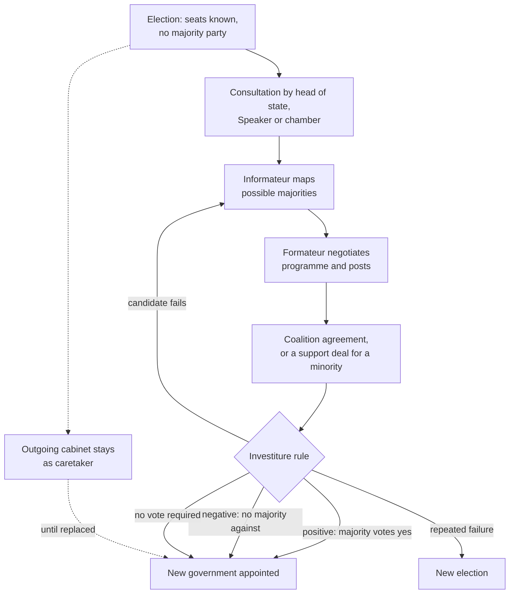

# Political Institutions · Lesson 3.2: Forming governments: coalitions and minorities

> ⏱ ~15 min · Module 3: Executive-legislative relations · Builds on: [3.1 Parliamentary government](03-01-parliamentary-government.md), [1.4 List PR II: divisor methods](01-04-list-pr-divisor-methods.md) · Unlocks: [3.3 Presidential government](03-03-presidential-government.md), [3.4 Semi-presidential government](03-04-semi-presidential-government.md)

## Why this matters

[3.1](03-01-parliamentary-government.md) showed that a parliamentary government lives by the confidence of the chamber. Under proportional representation ([1.4](01-04-list-pr-divisor-methods.md)) no party usually holds a majority, so election night settles only the seat shares. Who governs is decided afterwards, in negotiations that can take a weekend or, in Belgium after the June 2010 election, 541 days until a government was sworn in, in December 2011. This lesson describes those procedures (who runs the talks, what vote installs the result) and what is observed about the governments they produce.

## The idea

Think of formation as a gate with a guard. The talks decide who walks up to the gate; the **investiture rule** decides what the chamber must do to let them through. Two Kirrinian parties holding 52 of 120 seats may be let through under one rule and stopped under another, with every vote cast identically.

Three facts carry most of the lesson.

- **Seats are not power.** In [`grad-game-theory` 6.2](../../grad-game-theory/lessons/06-02-shapley-value.md)'s game (weights 3, 2, 1; quota 4), the two-seat and one-seat parties hold identical Shapley–Shubik power, because each completes a majority with the largest party and the two together do not. What matters is which majorities a party can complete.
- **The largest party has no formal claim.** It usually leads the talks, but nothing in a typical constitution makes it govern (mechanical); a majority that excludes it can install a government.
- **A government need not hold a majority.** A **[minority government](../reference.md#minority-government)** governs with fewer than half the seats, surviving because enough of the opposition will not vote it down.

Which coalitions *should* form, and how they split ministries, are modelled in [`political-economy`](../../political-economy/syllabus.md) 5.1–5.2 (minimal winning coalitions, Gamson's law, Baron–Ferejohn). Here we describe the procedures and the observed patterns.

## The mechanism

1. **Consultation.** After the election someone talks to every party group. Traditionally that is the head of state; in Belgium the King still does it. In the Netherlands the House of Representatives itself has appointed informateurs and formateurs since 2012, by the House's own account. In Spain (Constitution, Art. 99) the King consults the party representatives and nominates a candidate through the Speaker; in Sweden (Instrument of Government, ch. 6) the Speaker consults and proposes.
2. **Informateur, then [formateur](../reference.md#formateur).** An *informateur* explores which parties are able and willing to govern together; a *formateur*, usually the likely prime minister, negotiates the programme and the allocation of ministries. *In words:* one person maps the possible majorities, a second builds one.
3. **The [coalition agreement](../reference.md#coalition-agreement).** Partners write down the programme, often in detail, and sometimes rules for settling disputes. It is a political contract, not law: no court enforces it, and the penalty for breaking it is that the partner can walk out and bring the government down. Comparative studies of Western European coalitions (Wolfgang Müller and Kaare Strøm's among them) report written agreements becoming more common and more detailed over the post-war decades: a descriptive trend, not a causal claim.
4. **The [investiture vote](../reference.md#investiture-vote), or its absence.** This is the guard at the gate, and constitutions differ sharply (mechanical; texts as in force in 2025):
   - **Positive, absolute majority.** Germany's Basic Law, Art. 63(2): "The person who receives the votes of a majority of the Members of the Bundestag shall be elected." Abstaining counts the same as voting no.
   - **Positive, falling bar.** Spain, Art. 99: an absolute majority on the first vote; failing that, a simple majority (more yes than no) on a second vote 48 hours later. If no candidate is invested within two months of the first vote, the Cortes is dissolved.
   - **Negative.** Sweden, ch. 6 art. 4: the Speaker's nominee is rejected only if more than half of all members vote against. Abstaining counts as letting the nominee through.
   - **None.** Norway's Constitution has the King choose the Council of State (Art. 12) and requires resignation after a vote of no confidence (Art. 15); no investiture vote exists.

   Systems with the first two kinds of rule practise **[positive parliamentarism](../reference.md#positive-and-negative-parliamentarism)**: a government needs a majority *for* it. The last two are **negative parliamentarism**: it needs only the absence of a majority *against* it (the terms come from Torbjörn Bergman's comparative work on formation rules).
5. **Minority governments and support deals.** A minority cabinet survives through standing deals: a party outside the cabinet promises to back it on confidence and the budget in exchange for policy. Canada's Liberal government and the NDP signed such a supply-and-confidence agreement on 22 March 2022, planned to run to June 2025; no NDP member joined the cabinet, and the NDP ended it early in September 2024.
6. **[Caretaker government](../reference.md#caretaker-government).** While talks run, the outgoing cabinet stays in office. Germany's Art. 69(3) obliges the Chancellor, at the Federal President's request, to "continue to manage the affairs of his office until a successor is appointed"; Spain's Art. 101(2) and Sweden's ch. 6 art. 11 keep the outgoing government in office automatically, and Norway's Art. 15 limits a government that has lost a confidence vote to the business required for the proper discharge of its duties. Elsewhere the limits on what a caretaker may do are convention, not text. *In words:* the state is never without a government, only without a new one.

**Where the evidence is weakest.** The empirical claims here are of uneven strength. *Fairly consistent across studies of Western Europe:* formation takes longer when more parties are in play and when they are ideologically further apart (work by Lanny Martin and Georg Vanberg, among others). *A cross-national correlation from few cases:* negative parliamentarism goes with more frequent minority governments. But the negative-rule countries are largely Scandinavian, with strong committees and often two-bloc politics, so the rule is hard to separate from the setting; it may also be that parties used to minority government kept or chose the rules that suit it. *Contested:* Strøm (*Minority Government and Majority Rule*, 1990) argued that minority governments are a rational choice, not a failure, where opposition parties can shape policy through committees without bearing the electoral cost of governing; critics and defenders still dispute how durable and effective such governments are once that selection is accounted for.

## How a government forms

*Formation in a multiparty parliament. The dashed path runs in parallel to the talks: someone always governs.*

## Worked examples

**Example 1 (clean): a coalition through a positive gate.** Invented country Kirrinia has a 120-seat chamber, so a majority is 61. Its constitution copies Germany's Art. 63(2): the nominee needs 61 yes votes. Election result:

| Party | Lantern | Harbor | Meadow | Quarry | Sable |
|---|---|---|---|---|---|
| Seats | 44 | 31 | 21 | 14 | 10 |

The head of state consults all five groups and appoints an informateur. Arithmetic first: Lantern + Harbor (75), Lantern + Meadow (65), Lantern + Quarry + Sable (68), Harbor + Meadow + Quarry (66) and Harbor + Meadow + Sable (62) are each a majority that loses it if any member leaves. The informateur reports that only Lantern and Harbor are willing to deal. Lantern's leader becomes formateur, the two parties sign a coalition agreement, and the investiture vote runs 75 to 45. **Rule that decides:** 75 ≥ 61. While the talks ran, the outgoing cabinet governed as caretaker.

**Example 2 (hard): same votes, three guards.** Rewind. The Lantern–Harbor talks collapse. Harbor's leader instead builds a Harbor–Meadow minority cabinet, 52 seats. Lantern (44) will vote no. Quarry (14) has signed a support deal: it abstains. Sable (10) has not decided. Run the nominee through each rule:

| Rule | Passes if | Quarry abstains, Sable no (52–54–14) | Both abstain (52–44–24) |
|---|---|---|---|
| Absolute majority (Germany, first ballot) | yes ≥ 61 | fails | fails |
| Simple majority (Spain, second vote) | yes > no | fails | **passes** |
| Negative (Sweden) | no < 61 | **passes** | **passes** |

*In words:* under the negative rule Quarry's abstention alone installs the government; under the Spanish second vote Sable must also stand aside; under the absolute-majority rule nothing short of a yes vote from Quarry (52 + 14 = 66) will do. The guard, not the coalition, decides.

Now the strain. Suppose the cabinet passes under the negative rule with 52 yes votes. Investiture is a gate, not a guarantee: every budget must still pass the chamber, so Quarry's deal, which no court enforces, is what the government actually lives on. And the rule says nothing about whether Sable, having let the cabinet in, will keep doing so. That is where the rule runs out and the bargaining of step 5 takes over.

## Watch out

- **You might think the largest party "won" and so has a right to govern, but actually that is a normative claim, not a mechanical one.** No rule in this lesson gives a seat plurality any formal power. That the largest party usually leads the talks is an empirical pattern, common but with exceptions, not a rule.
- **You might think a minority government is a coalition that failed, but actually it may be the formateur's preferred outcome.** Strøm's argument is that staying out of cabinet can pay; whether it does is the contested empirical claim above.
- **You might think a support deal and a coalition differ only in degree, but actually they differ mechanically.** Coalition partners hold ministries and share responsibility for every decision; a support party holds none and is bound only on the matters it signed up for (in Canada's 2022 agreement, confidence and budgetary matters).

## One-liner

> After a hung election the seat shares set the arithmetic, the talks pick a team, and the investiture rule (a majority for, no majority against, or no vote at all) decides whether that team gets through the gate; the caretaker governs meanwhile.

## Problems

**P1 (🟢) *(Exegetical (a)–(b).)*** Diagnose. An **invented** news report from Kirrinia's next election, not the words of any real person or outlet. Seats: Copper 40, Fern 30, Gale 25, Iris 15, Juniper 10 (120 in all). Kirrinia's constitution: the head of state nominates a candidate after consulting every party group, and the chamber elects the candidate by a majority of its members.

> (i) "Copper won the election, so the constitution requires that Copper's leader form the government." (ii) "Fern, Gale and Iris have signed a coalition agreement and will vote together at the investiture." (iii) "Copper's 40 seats are a mandate the chamber has no power to overturn."

(a) Name the rule that decides who governs and run it: can a Fern–Gale–Iris candidate be invested, and what happens to a Copper candidate if the three vote against? Show the vote totals. (b) Classify the claims in (i) and (iii) as mechanical, empirical or normative, and say whether each is correct as stated under Kirrinia's rules. Two sentences per sentence.

**P2 (🟡) *(Exegetical (a)–(b) · Evaluative (c).)*** Apply to a hard case. Kirrinia's next election produces: Oriel 44, Pell 33, Rook 20, Teal 13, Vane 10. The outgoing cabinet was an Oriel–Teal coalition. Oriel and Pell refuse to govern together; no party will deal with Vane, which votes against every nominee. Rook refuses to join any cabinet but will abstain on an Oriel nominee; Pell and Vane will vote against one; Teal will vote yes.

(a) Run an Oriel nominee through (1) an absolute-majority positive rule and (2) a Swedish-style negative rule. Show the totals. (b) Who governs Kirrinia while the talks run, and does the answer depend on which investiture rule Kirrinia uses? Two sentences. (c) A reformer says the negative rule lets a 57-seat cabinet take office that "a majority never chose"; a defender says no majority opposed it either. In 100 words or fewer, say what each side gains and gives up, and what evidence would move the dispute. Any verdict passes.

Solutions

**P1** *(Exegetical (a)–(b): strict)*

(a) The rule is the investiture vote: a majority of members, 61 of 120. Fern + Gale + Iris = 30 + 25 + 15 = 70 ≥ 61, so their candidate is elected even if Copper and Juniper (50) vote no. A Copper candidate gets at most 40 + 10 = 50 yes against 70 no, and fails. Being consulted, or even nominated first, cannot get Copper past 61.

**Must hit, strict (a):**

- The deciding rule is the investiture vote (a majority of members, 61), not the seat ranking.
- Fern–Gale–Iris: 70 ≥ 61, passes. Copper: at most 50, fails against 70 no.

**Must hit, strict (b):**

- (i) is presented as a mechanical claim and is false under Kirrinia's text: the head of state must consult and nominate, and nothing names the largest party. It may echo an empirical pattern (the largest party usually leads the talks), which is common but not universal and creates no obligation.
- (iii) is a normative claim (that a plurality confers a mandate) dressed as a mechanical one, and mechanically false: the chamber's majority decides, and 70 members outweigh 40.

**Wrong turns:** treating "won the election" as a constitutional category in a hung parliament; saying Copper must be asked first and therefore governs, which confuses who is nominated first with who passes the vote.

---

**P2** *(Exegetical (a)–(b): strict · Evaluative (c): any verdict)*

(a) Oriel + Teal = 44 + 13 = 57 yes; Pell + Vane = 33 + 10 = 43 no; Rook's 20 abstain.

| Rule | Test | Result |
|---|---|---|
| Absolute majority | 57 ≥ 61? | fails |
| Negative | 43 < 61? | passes |

**Must hit, strict (a):**

- Positive rule: 57 < 61, fails; Rook's abstention counts as not voting yes.
- Negative rule: only 43 against, short of 61, so the nominee is adopted; Rook's abstention is what lets the cabinet in.

**Must hit, strict (b):**

- The outgoing Oriel–Teal cabinet governs as caretaker until a successor is appointed, normally limited to routine business (by text in some constitutions, by convention in others).
- The answer does not depend on the investiture rule: the rule governs how talks end, not who governs during them.

**Must hit, any verdict (c):**

- State the mechanism: the negative rule counts abstention as acquiescence, so a government needs no majority for it, only no majority against.
- Name the trade-off: easier, faster formation and fewer stalemates, against a government with no committed majority, which must win each budget vote case by case.
- Name the evidence that would move it: whether minority governments under negative rules pass budgets, last, and deliver their programmes about as well as majority governments, comparing like with like.
- Say where the rule stops: it installs the cabinet; survival depends on Rook's continuing abstention, which no rule guarantees.

**Wrong turns:** answering (b) with "nobody" or "the head of state"; arguing in (c) that minority government is obviously illegitimate or obviously fine, without the trade-off or the evidence.

**Model answer (c), one of several:** The negative rule treats abstention as consent not to block, so Oriel governs because no 61-member majority will remove it. The reformer gains a government with a chosen majority behind it and accepts longer, harder formations, perhaps repeated elections. The defender gains quick formation and a government that still falls the moment a majority turns against it, and accepts cabinets that must assemble majorities bill by bill. What would move the dispute is comparative evidence on whether such cabinets pass budgets and survive as well as majority cabinets in similar settings. Neither rule decides whether Rook keeps abstaining.

## Flashback

**From Lesson [2.4](02-04-districts-and-electoral-reform.md) (Districts and electoral reform):** *(Formal (a) · Exegetical (b).)* Invented numbers. Dunmarra's 100-seat chamber is elected by list PR in four regions, and an ordinary statute fixes each region's seats: North has 1.0 million people and 20 seats, East 1.5 million and 25, South 3.0 million and 25, the Capital 4.5 million and 30. (a) Compute the Samuels–Snyder MAL index, and how many seats would change region if the 100 seats were reapportioned in exact proportion to population. (b) The governing coalition is Civic (40 seats) and Agrarian (14), which wins nearly all its seats in North and East. The opposition is Beacon (30) and Rally (16). Civic, Beacon and Rally win most of their seats in South and the Capital. Civic proposes reapportionment by population, which needs a majority of all members. Under the seat-maximizing view, predict each party's vote and name the rule that decides passage, with the totals; then say where the view stops predicting the outcome. Three sentences or fewer for (b).

Solution

(a) Population shares and seat shares, in percent:

| Region | Population share | Seat share | People per seat |
|---|---|---|---|
| North | 10 | 20 | 50,000 |
| East | 15 | 25 | 60,000 |
| South | 30 | 25 | 120,000 |
| Capital | 45 | 30 | 150,000 |

$$\text{MAL} = \tfrac12(10 + 10 + 5 + 15) = 20\% .$$

Reapportioned by population, the regions get 10, 15, 30 and 45 seats. North and East lose 10 each; South gains 5 and the Capital 15. So **20 seats move**, which is MAL times 100 seats: the index is exactly the share of seats sitting in the wrong place. A Capital resident's vote weighs a third of a North resident's (150,000 people per seat against 50,000).

**Must hit, strict (b):**

- Predicted votes: Agrarian against, since its regions lose 20 seats; Civic, Beacon and Rally for, since their regions gain them.
- The rule that decides passage: an ordinary statute needing a majority of all members, 51. Civic + Beacon + Rally = 40 + 30 + 16 = 86 ≥ 51, so the bill passes without Agrarian, whose 14 votes cannot block it.
- Where the view stops: it counts expected seats, not office. Civic's cabinet holds 54 seats only with Agrarian (Civic alone has 40), so whether Civic tables the bill at all depends on whether it will trade future seats for its partner now, which the view does not settle. Voter backlash or uncertain seat forecasts are also acceptable answers.

**Wrong turns:** forgetting the ½ and reporting MAL as 40%, or counting 40 seats moved by adding gains to losses. Saying Agrarian can block the bill because it sits in government: being in cabinet gives it no veto on a floor vote, and its only leverage is the threat to leave the coalition.

**Model answer:** (a) MAL = 20%, and 20 seats move (North −10, East −10, South +5, Capital +15). (b) The seat-maximizing view predicts Agrarian votes no and Civic, Beacon and Rally vote yes, and the rule that decides is a majority of all members: 86 ≥ 51, so the bill passes without Agrarian. The view stops at whether Civic brings the bill: it says Civic would gain seats, not whether Civic will give up the 14 votes that keep its cabinet together today to get them.

## Connections

- **Backward:** confidence, dissolution and Germany's constructive vote of no confidence are [3.1](03-01-parliamentary-government.md)'s; the multiparty chambers that make formation necessary come from the proportional formulas of [1.3](01-03-list-pr-quotas-and-largest-remainders.md)–[1.4](01-04-list-pr-divisor-methods.md) and the magnitude effects of [2.2](02-02-district-magnitude-and-thresholds.md).
- **Forward:** [3.3](03-03-presidential-government.md) removes the formation problem altogether (the executive is elected separately) and [3.4](03-04-semi-presidential-government.md) splits it between a president and the chamber; [4.2](04-02-committees-and-agenda-control.md)'s strong committees are what Strøm's argument for minority government relies on; [4.4](04-04-party-systems.md) explains the fragmentation that lengthens talks; and [6.4](06-04-majoritarian-and-consensus-democracy.md) uses the type of cabinet (single-party majority vs broad coalition) as one marker of Lijphart's executives-parties dimension.
- **Sideways:** [`political-economy`](../../political-economy/syllabus.md) 5.1–5.2 models which coalitions form and how they divide portfolios (minimal winning coalitions, Gamson's law, the Baron–Ferejohn formateur advantage); the voting-power point is [`grad-game-theory` 6.2](../../grad-game-theory/lessons/06-02-shapley-value.md)'s Shapley–Shubik index, and [6.1](../../grad-game-theory/lessons/06-01-coalitional-games-core.md)'s three-player majority game, whose core is empty, shows formally why any split of office among would-be partners can be undercut by a rival offer.
