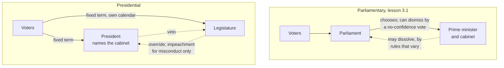

# Political Institutions · Lesson 3.3: Presidential government

> ⏱ ~15 min · Module 3: Executive-legislative relations · Builds on: [3.1 Parliamentary government](03-01-parliamentary-government.md), [`history-of-political-thought` 5.2](../../history-of-political-thought/lessons/05-02-the-federalist-faction-and-the-extended-republic.md) · Unlocks: [3.4 Semi-presidential government](03-04-semi-presidential-government.md), [4.1 Bicameralism](04-01-bicameralism.md), [4.3 Parties: organization and discipline](04-03-parties-organization-and-discipline.md)

## Why this matters

[3.1](03-01-parliamentary-government.md) took up the problem that [`history-of-political-thought` 5.1](../../history-of-political-thought/lessons/05-01-montesquieu-the-spirit-of-the-laws.md) left open: ministers who sit in the legislature and survive on its confidence. The framers of the US Constitution chose the other answer. They put the executive in separate hands, elected separately, and relied on *Federalist* 51's ambition counteracting ambition ([`history-of-political-thought` 5.2](../../history-of-political-thought/lessons/05-02-the-federalist-faction-and-the-extended-republic.md)). Presidential government then became the dominant design in the Americas. This lesson asks what the design does when the two branches disagree, and examines Juan Linz's claim that it endangers democracy itself, a claim [`comparative-politics`](../../comparative-politics/syllabus.md) relies on in its lesson on breakdown and one that is still disputed.

## The idea

In a parliamentary system the voters elect one body, and the executive grows out of it and can be dismissed by it. **[Presidential government](../reference.md#presidential-government)** cuts that link twice:

- **Separate origin.** Voters elect the chief executive and the legislature in separate contests.
- **Separate survival.** Each serves a fixed term. The legislature cannot remove the president for losing its support, and the president cannot dissolve the legislature to get a friendlier one.

Matthew Shugart and John Carey (*Presidents and Assemblies*, 1992) build their definition on these two features, adding that the elected president names and directs the cabinet and holds some constitutional lawmaking power.

*In words:* two agents, each hired directly by the voters on a fixed contract, neither able to fire the other.

So a disagreement between the branches cannot be settled the parliamentary way, by a confidence vote or an early election. It is settled by bargaining, by one side's veto, or by waiting for the calendar. Everything below follows from that.

Keep three kinds of claim apart. **Mechanical** claims say what a rule does by its text (a two-thirds override). **Empirical** claims say what presidential systems are *observed* to do (gridlock, breakdown). **Normative** claims, about whether the design is better, are not argued here.

## The mechanism

1. **Separate elections (mechanical).** In the US the president serves four years, chosen through the Electoral College; the House is elected every two years; senators serve six-year terms, staggered so a third face election every two years. Different constituencies and calendars mean different parties can win different branches. That is **[divided government](../reference.md#divided-government)**.

2. **Fixed terms, removal only for cause (mechanical).** There is no [confidence vote](../reference.md#confidence-and-no-confidence) and no [dissolution](../reference.md#dissolution). The US route to removal is impeachment, for "Treason, Bribery, or other high Crimes and Misdemeanors" (Art. II, s.4): the House impeaches by majority, and conviction needs two-thirds of the senators present. It is designed for wrongdoing, not for losing a policy fight.

3. **The veto and the override (mechanical).** A vetoed bill returns to Congress (Art. I, s.7):

   > "If after such Reconsideration two thirds of that House shall agree to pass the Bill, it shall be sent … to the other House, … and if approved by two thirds of that House, it shall become a Law."

   The Supreme Court held in *Missouri Pacific Railway Co. v. Kansas* (1919) that this means two-thirds of the members present, a quorum being present, not of the whole membership. With $n$ members present and voting, the override needs $y \ge \tfrac{2}{3}n$ yes votes, so the smallest number of no votes that sustains the veto is

   $$b(n) = \left\lfloor \tfrac{n}{3} \right\rfloor + 1.$$

   *In words:* a president who holds one-third plus one of those voting in *either* chamber cannot be overridden. Because the base is those voting, absences on the president's side lower the bar. This is a **[package veto](../reference.md#veto-and-override)**: all or nothing. Congress gave the president an item-by-item veto over spending in the Line Item Veto Act of 1996, and the Supreme Court struck it down in *Clinton v. City of New York* (1998). Many US state governors do hold line-item vetoes. Brazil's president may veto a bill in part, down to a whole article, paragraph or item, and a joint session of Congress overrides by an absolute majority of deputies and senators (constitution as amended to 2013, Art. 66). A different threshold moves power: a third of one chamber is far easier to hold than half of the whole Congress.

4. **Proactive powers: decrees and budgets (mechanical).** Scott Mainwaring and Matthew Shugart (*Presidentialism and Democracy in Latin America*, 1997) separate *reactive* powers, which only defend the status quo (the veto), from *proactive* powers, which let the president move first. The strongest proactive power is the **[decree](../reference.md#decree-powers)**. Brazil's president may, in cases of relevance and urgency, adopt provisional measures with the force of law, which lose effect unless Congress converts them into law within 60 days, extendable once by 60 (Art. 62, paraphrased from the Portuguese). Argentina's 2006 implementing law kept a necessity-and-urgency decree in force *unless both chambers rejected it*. The difference is which side silence favours. Budgets work the same way. The US Constitution provides that "No Money shall be drawn from the Treasury, but in Consequence of Appropriations made by Law" (Art. I, s.9), so if no funding law passes, spending stops: a shutdown. Chile's constitution provides the opposite: if Congress has not dispatched the budget within 60 days, the president's bill takes effect.

   *In words:* whoever's preferred outcome is the default when nobody agrees holds the stronger hand.

5. **Divided government and lawmaking (empirical).** The intuition is that divided government means gridlock. David Mayhew (*Divided We Govern*, 1991) counted major US laws from 1946 to 1990 and found that divided periods produced about as many as unified ones. Sarah Binder (*Stalemate*, 2003) measured instead the share of salient agenda issues left unresolved and found that divided government does raise gridlock. **Strength of evidence:** contested, and it turns on the denominator, laws passed or proposals that died.

6. **Linz's perils (empirical).** In "The Perils of Presidentialism" (*Journal of Democracy*, 1990), Linz argued that the design itself endangers democracy, through three mechanisms. **Dual legitimacy:** both branches can claim a popular mandate, and no democratic principle says whose wins. **Rigidity:** fixed terms cannot be cut short for a failing president or a changed situation without a crisis. **Winner-take-all:** the presidency is one indivisible prize, so losers are shut out of executive power for a full term. The observation behind it, that presidential democracies broke down more often than parliamentary ones in the post-war period, is a well-documented raw association. Its cause is contested. José Antonio Cheibub (*Presidentialism, Parliamentarism, and Democracy*) argues that presidentialism was disproportionately adopted in countries emerging from military rule, and that democracies following military dictatorships are fragile whatever their constitution. Mainwaring and Shugart argue that the trouble concentrates in particular combinations, fragmented multiparty legislatures and strong presidential legislative powers, and that the design has advantages of its own, such as a clearly identifiable executive and mutual checks between the branches. The **[perils of presidentialism](../reference.md#perils-of-presidentialism)** remain a live dispute.

**Where the evidence is weakest.** Step 6, at the move from correlation to cause. Constitutions are not assigned at random: most presidential democracies are in Latin America, and many were founded after military regimes, so region, history and form arrive together. The number of breakdowns is small, and Linz's mechanisms are plausible stories more often asserted than traced case by case. A defender of Linz replies that the mechanisms predict *how* crises unfold, which cross-national counts cannot test. How strongly any of this is identified is a question for [`empirical-political-economy`](../../empirical-political-economy/syllabus.md).

## Origin and survival

*Parliamentary government is a chain: voters, then parliament, then the cabinet. Presidential government is a fork: both branches answer to the voters, and the dashed lines between them are checks, not a power to remove.*

## Worked examples

**Example 1 (clean): can Lunaria override?** Invented numbers. The invented Republic of Lunaria copies the US override rule. Its Assembly has 180 members and its Senate 60. The president's party, Sol, holds 70 Assembly seats and 22 Senate seats. A bill passes the Assembly 115 to 65 and the Senate 38 to 22; the president vetoes it. With every member voting:

| Chamber | Voting | Override needs | Veto sustained by | Vote at passage | Short by |
|---|---|---|---|---|---|
| Assembly | 180 | 120 | 61 | 115–65 | 5 |
| Senate | 60 | 40 | 21 | 38–22 | 2 |

In the Assembly, 5 Sol members already voted for the bill (the 110 non-Sol members alone give 110), and 5 more must switch. In the Senate, Sol's 22 is one above the blocking 21: the president can lose one senator, not two. **The rule that decides:** two-thirds of those voting in each chamber. **Where it runs out:** if the override fails the bill dies, and the old law stands. The rule says nothing about what follows: a revised bill, a deal attaching the bill to must-pass legislation, or waiting for the next election.

**Example 2 (hard): two mandates.** Invented history. Lunaria's president won with 54% on a promise to raise the pension age. At the midterm, two years later, the opposition Tide party won majorities in both chambers by campaigning against the reform. Tide passes a repeal; she vetoes it; Tide lacks two-thirds. She proposes a stronger reform; Tide votes it down.

Run the rules. No confidence vote is available, and no dissolution. Impeachment requires misconduct, and a policy dispute is not misconduct. So the rules give a clear answer: the existing law stands until the next presidential election, two years away.

Here is where the design strains. Both sides claim the voters. Hers is the national mandate; Tide's is the more recent one. The constitution contains no rule saying which counts for more. Linz reads this as dual legitimacy and rigidity in action: a stalemate with no exit until a date on the calendar, which tempts a president to govern by decree or an opposition to stretch impeachment into a substitute no-confidence vote. His critics read the same facts as the design working: when voters elect divided branches, the status quo holds, responsibility is clear, and the next election settles it. Whether a standoff escalates, on their view, depends on the president's decree powers and the party system, not on presidentialism as such. The rules settle what happens to the pension law. They do not settle which reading of the episode is right; that is the empirical dispute of step 6.

## Watch out

- **You might think divided government causes gridlock by definition, but actually that is an empirical claim, and a contested one.** What divided government does *mechanically* is give each party a veto point. Whether fewer major laws pass is Mayhew's and Binder's dispute, and the answer depends on how gridlock is measured.
- **You might think impeachment is the presidential version of a no-confidence vote, but actually it differs on grounds, threshold and purpose.** A confidence vote needs only a majority and no reason; impeachment needs a charge of wrongdoing and, in the US, a two-thirds Senate vote to convict. Whether a given impeachment is really about misconduct or about lost legislative support is where the text stops deciding and politics takes over.
- **You might think any country with a directly elected president is presidential, but actually separate survival is the test.** If the cabinet must keep the assembly's confidence, as in France, the system is semi-presidential ([3.4](03-04-semi-presidential-government.md)), whatever the president's prestige.

## One-liner

> Presidential government elects the executive and the legislature separately and lets neither remove the other, so conflict is settled by vetoes, defaults and the calendar; whether that rigidity endangers democracy, as Linz argued, is a correlation whose cause is still disputed.

## Problems

**P1 (🟢) *(Formal (a)-(c).)*** Invented numbers. Lunaria's House has 250 members and its Senate 80; the president's party holds 86 House seats and 28 Senate seats. Override rule: two-thirds of those voting in each chamber, as in the US.

(a) With every member voting, how many yes votes does an override need in each chamber, and how many of the president's party can defect in each while the veto still holds (everyone else votes to override)?

(b) On the House override vote, 10 of the president's party are absent; the rest of the party votes no, and every other member votes yes. Does the override pass the House? Show the count.

(c) A reform would replace the rule with Lunaria's alternative: an override needs an absolute majority (more than half) of all 330 members of both chambers sitting together. How many of the 330 must not vote yes for the president to sustain a veto, and can the president's party do it alone?

**P2 (🟡) *(Exegetical (a)-(c).)*** Diagnose. An **invented** news report, not the words of any real outlet or person:

> "LUNARIA, day 19 of the shutdown. (i) The fiscal year ended with no funding law, and under the constitution no money may be spent without one, so ministries closed. (ii) Both chambers passed a stopgap funding bill; the president vetoed it because it cut her border programme, and the Assembly's override failed, 116 to 64, with all 180 members voting. (iii) Opposition leaders have demanded a vote of no confidence in the president. (iv) Her allies reply that she should dissolve the Assembly and let the voters decide."

(a) Name the rule that turned a disagreement into a shutdown, and the rule that kept the stopgap from becoming law. By how many votes did the override fall short? (b) Which two of (i)-(iv) demand something Lunaria's constitution cannot deliver, and why? One sentence each. (c) Suppose Lunaria had Chile's budget rule instead. Would there be a shutdown, and which side would lose leverage? Two sentences.

**P3 (🔴, optional) *(Exegetical (a)-(b) · Evaluative (c).)*** Apply to a hard case. An invented clause of Lunaria's constitution: *"In cases of relevance and urgency, the President may issue decrees with the force of law. A decree remains in force unless both chambers reject it."* The president, whose party controls the Senate but not the Assembly, decrees a twelve-month freeze on fuel prices. The Assembly rejects the decree 110 to 70; the Senate's leaders never schedule a vote.

(a) What is the decree's status? What would it be after 60 days under the alternative clause *"A decree lapses unless both chambers approve it within 60 days"*? One sentence each. (b) Name two questions about this case that neither clause answers. One line each. (c) A senator says a lapse clause makes decree power harmless, because the legislature keeps the last word. Assess, in 100 words or fewer. Any verdict passes.

Solutions

**P1** *(Formal (a)-(c), strict)*

(a) Override needs $\lceil \tfrac{2}{3}n \rceil$; the veto holds with $b(n) = \lfloor n/3 \rfloor + 1$ no votes.

| Chamber | $n$ | Override needs | Veto holds with | President's party | Can defect |
|---|---|---|---|---|---|
| House | 250 | 167 | 84 | 86 | 2 |
| Senate | 80 | 54 | 27 | 28 | 1 |

Check: in the House, with 2 defectors the party votes 84 no and the override gets 166 of 250, below two-thirds (166.67); with 3 defectors it gets 167 and passes.

(b) Voting: $250 - 10 = 240$. Yes: the $250 - 86 = 164$ others. No: $86 - 10 = 76$. Needed: $\tfrac{2}{3} \times 240 = 160$. Since $164 \ge 160$ (68.3%), **the override passes the House.** The same 86 members, all present and voting no, would have held it (164 of 250 is short of 167). Absences shrink the base.

(c) An absolute majority of 330 is 166 yes votes. The president sustains the veto if at most 165 vote yes, so **165 members** (exactly half) must vote no or stay away. The party holds $86 + 28 = 114$, so it **cannot** do it alone: it needs 51 more. Under this rule absences no longer help, because the base is the whole membership.

**Must hit, strict:**

- (a) 167 and 54 needed; 2 House and 1 Senate defectors allowed.
- (b) 164 of 240 meets the 160 needed: the override passes, because the base is those voting.
- (c) 166 needed; the president must hold 165 of 330; 114 is not enough.

**Wrong turns:** computing two-thirds of the full 250 in (b) (giving 167, so "fails"); in (c), treating the joint rule as two-thirds, or forgetting that "more than half" of 330 is 166, not 165.

---

**P2** *(Exegetical (a)-(c), strict)*

**Must hit, strict (a):**

- The shutdown comes from the budget reversion rule: no appropriation, no spending, so when no funding law passes, the default is zero.
- The stopgap died by the package veto plus a failed two-thirds override: 180 voting needs 120 yes; 116 fell **4 short**.

**Must hit, strict (b):**

- (iii): no confidence vote exists; separate survival means the legislature cannot remove the president for a policy dispute (impeachment needs misconduct).
- (iv): the president has no power to dissolve the legislature; its term is fixed.

**Must hit, strict (c):**

- No shutdown: the president's budget would take effect after the deadline.
- The legislature loses leverage, because the default becomes the president's preferred outcome; refusing to agree no longer costs her anything.

**Wrong turns:** treating (i) as the president's fault or the legislature's (the question asks for the rule, not the blame); calling (ii) a pocket veto or saying the Senate also had to fail (the bill dies once either chamber fails to override).

**Model answer (c):** Under Chile's rule the president's proposal becomes the budget once the deadline passes, so there is no funding gap and no shutdown. The legislature loses its strongest threat, since holding out now produces the president's budget rather than closed ministries.

---

**P3** *(Exegetical (a)-(b), strict · Evaluative (c), any verdict)*

**Must hit, strict (a):**

- Under the clause as written, the decree **stays in force**: only rejection by *both* chambers ends it, and the Senate has not acted.
- Under the lapse clause, it **lapses after 60 days**, because both chambers must approve it and neither has; the Senate's inaction now kills it instead of saving it.

**Must hit, strict (b):** any two of:

- Who decides whether "relevance and urgency" was met: a court, the legislature, or no one.
- What happens to prices, contracts and payments made while the decree was in force once it ends. (Brazil's text leaves those legal relations to Congress to regulate.)
- Whether the president may reissue the same decree after it lapses.

**Must hit, any verdict (c):**

- State the mechanism: a decree is a proactive power. Even under a lapse clause it is law from day one, so the president moves the status quo first, for up to the deadline.
- State the senator's case at full strength: silence now kills the decree, so a legislature that disapproves need do nothing, and the power is limited to genuine emergencies.
- Name what would move the dispute: how often decrees are reissued or produce effects that cannot be reversed, and how often legislatures actually let them lapse.

**Wrong turns:** in (a), saying the Assembly's rejection ends the decree (the clause needs both chambers); in (c), treating "the legislature keeps the last word" as settling the question without asking what happens before that word is spoken.

**Model answer (c), one of several:** The lapse clause does shift the default against the president: a hostile legislature can kill a decree by doing nothing. But a decree is law from the moment it is issued, so for 60 days the president has set policy without the legislature, and a price freeze changes contracts and expectations that do not automatically revert. If the president can reissue, the lapse may never bite. The senator is right if decrees are rarely reissued and their effects reverse; she is wrong if they are not. That is an empirical question about practice, not the text.

## Flashback

**From Lesson [3.1](03-01-parliamentary-government.md) (Parliamentary government):** *(Formal (a)-(b) · Exegetical (c).)* Invented numbers. Velmora's Assembly has 420 members: Anchor 200, Lark 12, Thistle 140, Orchid 48, Saffron 20. Anchor and Lark governed together until Lark quit the coalition. Thistle then moves against the head of government. On the day, Lark, Thistle and Orchid vote yes; 196 Anchor members vote no and 4 are absent; Saffron abstains. Run the same votes under two rulebooks: **W**, Westminster conventions (an explicit motion of no confidence, decided by a majority of those voting); and **G**, a word-for-word copy of Basic Law Article 67 (the motion elects Thistle's leader as successor). (a) Is the motion carried under W? Under G? Show the counts. (b) Under G, how many Saffron members would have had to vote yes for Thistle's leader to be elected? Under W, would the motion have carried had all of Saffron voted no? (c) Given your answer to (a), what happens next under each rulebook? One sentence each.

Solution

(a) Yes: $12 + 140 + 48 = 200$. No: $200 - 4 = 196$. Saffron's 20 abstain and 4 Anchor members are absent.

- **W:** only votes cast count. $200 > 196$, so the motion is **carried**.
- **G:** a majority of the Members is $\lfloor 420/2 \rfloor + 1 = 211$. $200 < 211$, so the motion **fails**, 11 short. Abstentions and absences count exactly like no votes.

(b) Under G, Thistle's leader needs $211 - 200 = 11$ Saffron votes. Under W, all of Saffron voting no gives $196 + 20 = 216$ no against 200 yes, so the motion **fails**. Saffron's abstention had opposite effects: under W it let the motion carry, under G it sank it.

**Must hit, strict (c):**

- **W:** the government has been defeated on an explicit confidence motion, so by convention the prime minister must either resign (the head of state then appoints whoever can command the Assembly's confidence) or ask for a dissolution, which is normally granted; the prime minister picks the branch.
- **G:** the motion failed, so the head of government stays in office and the 200 votes have no legal effect; the opposition cannot force an election, because the Article 68 route opens only on the head of government's own confidence motion.

**Wrong turns:** applying the 211 threshold under W, where a simple majority of those voting decides; treating the 4 absentees as lowering the G threshold, when Article 67 counts Members, not those present; under G, saying the 200-to-196 vote still forces the head of government out because more voted yes than no.

**Model answer (c):** Under W, the prime minister must resign or seek a dissolution, and chooses which. Under G, nothing changes: the head of government stays, and only she could open the way to an early election, by moving a confidence motion of her own.

## Connections

- **Backward:** [3.1](03-01-parliamentary-government.md) built the confidence and dissolution rules that presidentialism removes; the separation of powers as a theory is [`history-of-political-thought` 5.1](../../history-of-political-thought/lessons/05-01-montesquieu-the-spirit-of-the-laws.md) (Montesquieu) and [5.2](../../history-of-political-thought/lessons/05-02-the-federalist-faction-and-the-extended-republic.md) (*Federalist* 51).
- **Forward:** [3.4](03-04-semi-presidential-government.md) adds a cabinet responsible to the assembly beside an elected president. [4.1](04-01-bicameralism.md) takes up the second chamber that every US override must also clear, and [4.3](04-03-parties-organization-and-discipline.md) why legislators vote less cohesively when no confidence vote binds them to the executive. [`comparative-politics`](../../comparative-politics/syllabus.md) takes Linz into its lesson on democratic breakdown.
- **Sideways:** a reversion point, like a budget default or a lapsing decree, is the status quo in the agenda-setter and gridlock models that [`political-economy`](../../political-economy/syllabus.md) solves (its 3.5). US separation-of-powers doctrine, including the line-item veto case, belongs to [`constitutional-law`](../../constitutional-law/syllabus.md).
