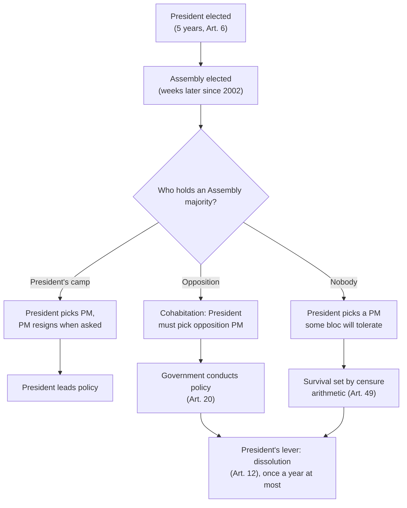

# Political Institutions · Lesson 3.4: Semi-presidential government

> ⏱ ~15 min · Module 3: Executive-legislative relations · Builds on: [3.1 Parliamentary government](03-01-parliamentary-government.md), [3.2 Forming governments](03-02-forming-governments-coalitions-and-minorities.md), [3.3 Presidential government](03-03-presidential-government.md) · Unlocks: [4.1 Bicameralism](04-01-bicameralism.md)

## Why this matters

On 4 December 2024 the French National Assembly brought down Michel Barnier's government by 331 votes, the first successful censure since 1962. Emmanuel Macron, elected by the whole country, stayed exactly where he was. That combination (a head of state who cannot be voted out by the legislature, a government that can) is neither of the two pure types from [3.1](03-01-parliamentary-government.md) and [3.3](03-03-presidential-government.md). It is the third type, and the question this lesson answers is the one that sorts every case of it: **when the president and the assembly disagree, whose government is it?**

## The idea

Take a parliamentary system and add a directly elected president with real powers. Now the cabinet has two potential masters. The assembly can always remove it; the only question is whether the president can too.

Maurice Duverger (the same Duverger as the law in [2.3](02-03-duvergers-law-observed.md)) named the type, **[semi-presidential government](../reference.md#semi-presidential-government)**, in a 1980 article, "A New Political System Model: Semi-Presidential Government". His definition has three parts: a president elected by universal suffrage; a president with quite considerable powers; and, facing the president, a prime minister and ministers who stay in office only as long as the assembly does not oppose them. Robert Elgie later proposed dropping the middle clause, because "considerable powers" is hard to measure; his minimal definition is a popularly elected fixed-term president alongside a prime minister and cabinet responsible to the assembly. *In words:* two executives, one chosen by voters, one surviving on the assembly's tolerance.

Matthew Shugart and John Carey (*Presidents and Assemblies*, 1992) split the type by a single rule: **who can dismiss the cabinet?**

- **[Premier-presidential](../reference.md#premier-presidential-and-president-parliamentary):** only the assembly. The president appoints the prime minister but cannot fire them. France is the standard case.
- **President-parliamentary:** both. The president may dismiss the cabinet, and so may the assembly. Weimar Germany's Article 53, in my translation: "The Reich Chancellor and, on his proposal, the Reich Ministers are appointed and dismissed by the Reich President." Article 54 added that they needed the Reichstag's confidence. Two masters, both with a firing power.

Keep the kinds of claim apart. Which subtype a constitution is follows from its text: **mechanical**. What each subtype does to democratic stability is **empirical**. Whether a dual executive is a good idea is **normative**, and not argued here.

## Source

Constitution of France, Article 49, paragraph 3 (official English translation, Conseil constitutionnel, text in force 2026):

> The Prime Minister may, after deliberation by the Council of Ministers, make the passing of a Finance Bill or Social Security Financing Bill an issue of a vote of confidence before the National Assembly. In that event, the Bill shall be considered passed unless a resolution of no-confidence, tabled within the subsequent twenty-four hours, is carried as provided for in the foregoing paragraph. In addition, the Prime Minister may use the said procedure for one other Government or Private Members' Bill per session.

Three phrases do the work. "Considered passed unless" reverses the burden: the bill is never voted on, and opponents must defeat the *government* to defeat the bill. "As provided for in the foregoing paragraph" imports paragraph 2's rules: only votes for censure are counted, and they must reach a majority of the Assembly's *members*, so every abstention and absence counts for the government. "One other ... Bill per session" is the limit added by the constitutional revision of 23 July 2008; before it, the procedure could be used on any bill. This is **[Article 49-3](../reference.md#article-49-3)**.

## The mechanism

The French rules as of 2026, as the chain from text to outcome:

1. **The president is elected directly for five years** (Art. 6), no more than two consecutive terms, by the two-round majority system of [1.1](01-01-anatomy-of-an-electoral-system-plurality-and-runoff.md) (Art. 7). The assembly cannot remove the president.
2. **The president appoints the prime minister.** Article 8: the president "shall appoint the Prime Minister. He shall terminate the appointment of the Prime Minister when the latter tenders the resignation of the Government." No investiture vote is required: Article 49 paragraph 1 says the prime minister *may* seek one. So France is negatively parliamentary in [3.2](03-02-forming-governments-coalitions-and-minorities.md)'s sense.
3. **The president cannot dismiss the prime minister.** Article 8 gives the termination only upon a resignation. That one clause makes France premier-presidential.
4. **The Assembly can.** A censure motion needs signatures from one tenth of members, waits 48 hours, counts only votes in favour and passes only with a majority of members (Art. 49 para. 2); the government must then resign (Art. 50). The rules of [confidence and no-confidence](../reference.md#confidence-and-no-confidence) are 3.1's.
5. **The president's counterweight is [dissolution](../reference.md#dissolution)** (Art. 12): after consulting the prime minister and the presidents of both houses, but never within a year of the last Assembly election.
6. **So the government is whoever the Assembly majority will not censure.** If that majority is the president's, the president leads. If it is the opposition's, the president must appoint its leader: **[cohabitation](../reference.md#cohabitation)**. Article 20 gives the government, not the president, the power to determine and conduct national policy.

*In words:* the president picks; the Assembly vetoes; the president can call new elections, but no more than once a year.

**Where the rule runs out.** First, the text does not say whom the president must pick. Nothing in Article 8 requires the leader of the largest bloc, so in a hung Assembly the choice is pure politics, bounded only by step 4. Second, the text does not divide foreign and defence policy cleanly. The president is commander-in-chief (Art. 15) and negotiates treaties (Art. 52), yet Article 21 makes the prime minister responsible for national defence. Under cohabitation the clauses leave the split to practice and bargaining. Third, premier-presidential is a fact about the text. Outside cohabitation, a president with a friendly majority can replace a prime minister by asking for a resignation, so in practice the president does the firing; the clause bites only when the Assembly would back a prime minister the president wants gone.

## Who controls the government

*The same constitution yields three different governments, depending only on the Assembly majority.*

## Worked examples

**Example 1 (clean): France, 1986 and 1997.** In 1986 the left lost its Assembly majority while François Mitterrand, a Socialist, had two years of his seven-year term left. Step 4: any left-wing prime minister faced a majority ready to censure. Step 6: Mitterrand appointed Jacques Chirac, leader of the largest party of the new majority. Step 3: he could not then fire Chirac. Cohabitation recurred with Édouard Balladur from 1993 to 1995. In 1997 President Chirac used step 5: he dissolved an Assembly his own side controlled, the left won, and he had to appoint Lionel Jospin, who stayed until 2002. **The rule that decides:** Article 8's missing dismissal power plus Article 49's censure; dissolution is a gamble the voters can refuse.

The design then changed. A referendum on 24 September 2000 cut the presidential term from seven years to five (about 73% voted yes, on a turnout near 30%), and a 2001 law reordered the 2002 calendar so that the Assembly was elected a few weeks after the president. With both terms at five years the order persists until a dissolution breaks it, as Macron's dissolution of June 2024 did. **Empirical:** all three cohabitations came before the reform, and the reform was meant to let the new president's coattails carry the Assembly. Evidence strength: a single country and a handful of elections, so suggestive, not established.

**Example 2 (hard): Marivel's hung Assembly.** Invented country. Marivel's constitution copies Articles 8, 12 and 49. Four months ago it elected a 500-seat Assembly:

| Bloc | Centre (president's camp) | Left | Right | Independents |
|---|---|---|---|---|
| Seats | 165 | 190 | 125 | 20 |

A censure needs a majority of members: $\lfloor 500/2 \rfloor + 1 = 251$.

- The president appoints a Centre prime minister. The Left and the Independents together cast $190 + 20 = 210 < 251$. The government falls only if at least $251 - 210 = 41$ Right deputies join them.
- Suppose instead the president appoints the Left's leader. Centre and Right together hold $165 + 125 = 290 \ge 251$: that government falls if those two blocs combine.

So whichever bloc supplies the prime minister, it governs on the tolerance of the Right. Dissolution is barred for eight more months. The Centre government uses the copied 49-3 on the budget, and the Right abstains: the budget passes although only 165 of 500 deputies belong to the governing bloc. **The rule that decides:** the majority-of-members threshold, which turns abstention into support. **Where it runs out:** the arithmetic says the Right is pivotal; it does not say what the Right will demand, or whether it prefers a weak Centre government to an early election. France faced a version of this after its 2024 election: the left alliance came first in seats, Macron appointed Barnier from outside it, and the Barnier government fell when it used 49-3 on the social security financing bill.

## Watch out

- **You might think semi-presidential means "half as powerful a president", but actually the label is about structure, not power.** A semi-presidential president may be strong (France outside cohabitation) or largely ceremonial; Elgie's definition deliberately leaves power out. Classify by the text: who elects the president, and who can dismiss the cabinet.
- **You might think that because French presidents replace prime ministers at will, France is president-parliamentary, but actually that is a convention resting on a shared majority.** Shugart and Carey classify by the constitutional dismissal power. Under cohabitation the convention vanished and the text decided.
- **You might think the subtype's effect on democracy is settled, but actually that is an empirical claim of moderate strength.** Shugart and Carey argued, and Elgie (*Semi-Presidentialism: Sub-Types and Democratic Performance*, 2011) found across semi-presidential democracies since 1919, that president-parliamentary systems are associated with poorer democratic performance. The cases are few and the subtype was not adopted at random, so causation is contested; identification belongs to [`empirical-political-economy`](../../empirical-political-economy/syllabus.md).

## One-liner

> A semi-presidential constitution has two executives, and one clause sorts it: if only the assembly can fire the cabinet, the president governs only when the assembly lets him.

## Problems

**P1 (🟢)** *(Exegetical (a) · Formal (b).)* Close reading. Use Article 49 paragraph 3 as quoted in **Source**, and the paragraph 2 rule that only votes for censure count and that they must reach a majority of the Assembly's members.

(a) The government invokes the procedure on a pensions bill (not a finance or social security bill). No censure motion is tabled within 24 hours. What happens to the bill, and how many deputies voted for it? Later in the same session the government wants to use the procedure again on a second ordinary bill. Does the text allow it? Two sentences.

(b) Invented seat counts. An assembly of 577 members, all seats filled: governing bloc 230, bloc A 195, bloc B 120, others 32. Bloc A tables a censure on the pensions bill. B abstains; 20 of the others vote for censure. Does the bill pass? What is the smallest number of B deputies who would have to join the motion to defeat it?

**P2 (🟡)** *(Exegetical (a)-(b) · Evaluative (c).)* Diagnose. An **invented** news report. Years after Example 2, the invented Republic of Marivel has amended its constitution; the report is not about any real country or person:

> "Marivel's directly elected president today dismissed Prime Minister Ilse Doran, although Doran's coalition holds 52% of the Assembly and had defeated a censure motion only last week. The president's office cited Article 41: 'The President appoints the Prime Minister and, on the Prime Minister's proposal, the ministers, and may relieve them of office.' Article 44 adds: 'The Government shall resign if the Assembly, by a majority of its members, withdraws its confidence.' Doran's allies say they will re-elect her."

(a) Classify amended Marivel under Shugart and Carey, quoting the words that decide. One sentence.

(b) Doran's allies cannot "re-elect" her: nothing in the quoted articles gives the Assembly a power to appoint. Say what the Assembly can do next, what the president can do in reply, and where the two articles stop determining who governs. 80 words or fewer.

(c) In two sentences, name the trade-off a designer accepts by choosing Marivel's new Article 41 over France's Article 8. Any verdict passes.

Solutions

**P1** *(Exegetical (a) — strict · Formal (b) — strict)*

**Must hit, strict (a):**

- The bill is "considered passed": it becomes adopted by the Assembly without any vote on the bill itself, so the number of deputies who voted *for* it is zero (no such vote occurs).
- No second use: outside finance and social security financing bills, the text allows "one other" bill per session, and the pensions bill has used it.

(b) Majority of members: $\lfloor 577/2 \rfloor + 1 = 289$. Votes for censure: $195 + 20 = 215$.

$$215 < 289$$

The censure fails, so **the bill passes**. Deputies needed from B: $289 - 215 = 74$.

**Must hit, strict (b):**

- Threshold 289, from all 577 members, not from those voting.
- 215 votes: censure fails, bill passes; 74 B deputies needed.

**Wrong turns:** computing the threshold from votes cast (215 for, 0 against, so "unanimous"), which is exactly what the majority-of-members rule excludes; saying the bill passed "by a majority" when no vote on it took place; treating the 2008 limit as one use per session in total, forgetting the unlimited budget and social security exceptions.

---

**P2** *(Exegetical (a)-(b) — strict · Evaluative (c) — any verdict)*

**Must hit, strict (a):**

- **President-parliamentary:** "may relieve them of office" (Art. 41) gives the president a dismissal power alongside the Assembly's (Art. 44), so the cabinet answers to both.

**Must hit, strict (b):**

- The Assembly cannot appoint; its power is negative. It can censure any replacement the president names, by a majority of members, which Doran's 52% coalition can deliver.
- The president can keep appointing, or dismiss again, and (if the constitution provides it, which the quoted articles do not say) dissolve.
- Where the rule stops: each side holds a veto over the other's choice and neither holds a power to install one, so the articles do not determine who governs. A standoff is settled by bargaining, dissolution rules found elsewhere, or an election.

**Wrong turns:** calling amended Marivel premier-presidential because the Assembly can censure (both subtypes have that; the president's dismissal power is the discriminator); claiming the dismissal was unconstitutional because Doran had a majority, when Article 41 conditions it on nothing.

**Model answer (b):** The Assembly can censure whoever the president appoints in Doran's place, and with 52% of members it can do so repeatedly. The president can reply by appointing again or dismissing again, and dissolution may follow if other articles permit it. Each side can block the other's prime minister and neither can impose its own, so the two articles stop determining the outcome: who governs depends on bargaining or new elections.

**Must hit, any verdict (c):**

- Name the gain the president-parliamentary design buys: the voters' direct choice can steer the cabinet even against an assembly majority.
- Name the cost: the cabinet has two principals who may disagree, so conflicts like Doran's have no constitutional tie-breaker. (Also creditable: noting that whether this costs democratic stability is the empirical question of Elgie and Shugart–Carey.)

**Wrong turns:** asserting that one design is better as the answer; stating the empirical finding as settled.

**Model answer (c), one of several:** Article 41 lets the elected president keep the cabinet answerable to the national electorate, not only to an assembly majority. The price is a cabinet with two masters and no rule to break a deadlock between them, which France's Article 8 avoids by giving the Assembly the last word.

## Flashback

**From Lesson [3.2](03-02-forming-governments-coalitions-and-minorities.md) (Forming governments: coalitions and minorities):** *(Formal (a) · Exegetical (b).)* Counterexample. Ferrowick (invented) has a 120-seat chamber that invests a prime minister by a majority of its members. Seats: Alder 54, Gorse 41, Sorrel 15, Daisy 10. An **invented** commentator writes: "The more seats a party holds, the more governing majorities it can join; Gorse, with four times Daisy's seats, holds far more cards in the coming talks." (a) List every minimal winning majority (one that loses its majority if any member leaves), with its seat total. (b) Use (a) to refute the commentator by comparing Gorse and Daisy, and say what the informateur must find out, beyond the seat table, to know which coalition forms. Two sentences.

Solution

(a) A majority of members is $\lfloor 120/2 \rfloor + 1 = 61$.

| Minimal winning majority | Seats |
|---|---|
| Alder + Gorse | 95 |
| Alder + Sorrel | 69 |
| Alder + Daisy | 64 |
| Gorse + Sorrel + Daisy | 66 |

Without Alder no pair reaches 61 (Gorse + Sorrel 56, Gorse + Daisy 51, Sorrel + Daisy 25), so only all three together do. Alder alone (54) is short.

**Must hit, strict (a):**

- Threshold 61, from all 120 members.
- Exactly these four minimal winning majorities, with their totals. A coalition such as Alder + Gorse + Sorrel wins but is not minimal: drop Sorrel and it still has 95.

**Must hit, strict (b):**

- Gorse and Daisy have identical options: each completes a majority with Alder alone, and each is indispensable to the only majority without Alder. Swap one for the other in any coalition and whether it wins never changes (the same holds for Sorrel). This is 3.2's point that seats are not power: what counts is which majorities a party can complete.
- The arithmetic lists the possible majorities; it does not say which parties are willing to govern together, or on what programme. Finding that out is the informateur's job, and it is where the seat table stops deciding.

**Wrong turns:** listing Alder + Gorse + Sorrel or Alder + Sorrel + Daisy as minimal; saying Alder can govern alone or has a claim to lead because it is largest (54 < 61, and no rule gives the largest party a right to govern); answering with how ministries would be divided once a coalition forms, which is a separate question that 3.2 leaves to the political-economy models.

**Model answer (b):** Gorse's 41 seats and Daisy's 10 buy exactly the same openings: each makes a majority with Alder, and each is needed, with Sorrel, for the only majority that excludes Alder, so trading one for the other never changes whether a coalition wins. Which of these majorities actually forms depends on which parties will govern together and on what terms, and the informateur learns that from the parties, not from the seat table.

## Connections

- **Backward:** confidence, censure and dissolution are [3.1](03-01-parliamentary-government.md)'s rules; France needs no investiture vote, which is [3.2](03-02-forming-governments-coalitions-and-minorities.md)'s negative parliamentarism, and Example 2's tolerated government is 3.2's minority government. The fixed-term, popularly elected president is [3.3](03-03-presidential-government.md)'s, and Linz's worry about dual legitimacy reappears here inside one executive. The two-round presidential ballot is [1.1](01-01-anatomy-of-an-electoral-system-plurality-and-runoff.md)'s.
- **Forward:** Article 49-3 operates in the National Assembly only; the Senate and the shuttle between chambers are [4.1](04-01-bicameralism.md)'s. Government control of the Assembly's agenda is [4.2](04-02-committees-and-agenda-control.md)'s. [6.4](06-04-majoritarian-and-consensus-democracy.md) places executives on Lijphart's executives-parties dimension.
- **Sideways:** Weimar's collapse and the role of semi-presidential constitutions in new democracies and in backsliding belong to [`comparative-politics`](../../comparative-politics/syllabus.md); the veto-player models that formalize "two principals, one agent" are [`political-economy`](../../political-economy/syllabus.md)'s.
