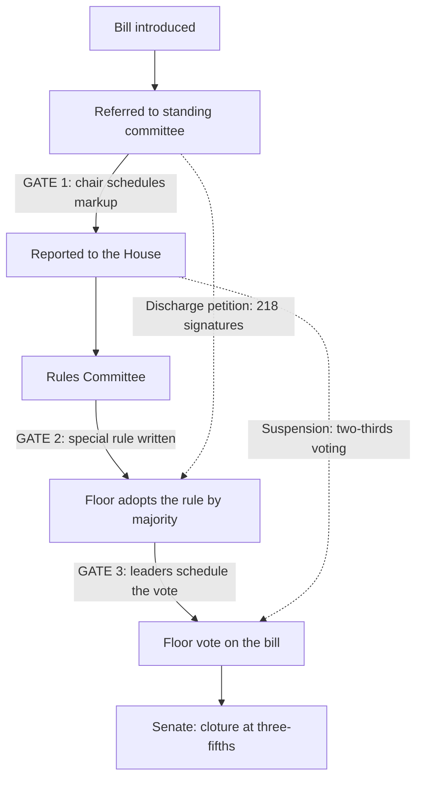

# Political Institutions · Lesson 4.2: Committees and agenda control

> ⏱ ~15 min · Module 4: Inside legislatures, and the parties that run them · Builds on: [3.1 Parliamentary government](03-01-parliamentary-government.md), [3.3 Presidential government](03-03-presidential-government.md), [4.1 Bicameralism](04-01-bicameralism.md) · Unlocks: [4.3 Parties: organization and discipline](04-03-parties-organization-and-discipline.md), [6.2 Delegation and oversight](06-02-delegation-and-oversight.md)

## Why this matters

A bill can have majority support in a chamber and still never be voted on. That is not a malfunction: every legislature has more proposals than floor time, so someone decides what reaches the floor, in what form, and when. Whoever holds that power can kill a bill without ever losing a vote on it. This lesson asks who holds it in Congress, at Westminster and in the Bundestag, and what the evidence says about how it is used.

## The idea

Think of a legislature as a building with one hall and many doors. A majority in the hall decides what passes, but only on business that has come through a door. The doorkeepers are a committee chair who will not report a bill, a scheduling committee that will not give it a slot, a government that controls the timetable, or a Senate minority that will not let debate end. **Positive agenda power** is the power to push a proposal onto the floor. **[Negative agenda control](../reference.md#negative-agenda-control)** is the power to keep one off. The second is cheaper and, on the leading account, the one that matters most.

[Political philosophy 5.4](../../political-philosophy/lessons/05-04-does-social-choice-wound-democracy.md) showed that whoever sets the order of votes can decide the outcome when majorities cycle. This lesson is about the institutions that assign that power. The formal models of setters and vetoes belong to [`political-economy` 3.5](../../political-economy/lessons/03-05-agenda-setters-and-veto-players.md). Mill argued in Chapter V that a numerous assembly should watch and control the government rather than administer or draft detailed law ([HPT 6.4](../../history-of-political-thought/lessons/06-04-mill-representative-government.md)); committees are how real assemblies divide up that watching.

## The mechanism

1. **Committees divide the work.** In a **[committee system](../reference.md#committee-systems)**, small standing bodies with fixed jurisdictions examine bills before the floor does. Committees are *strong* when they are permanent, their jurisdictions mirror the ministries, and bills reach them **before** the floor has approved the bill's principle. *(Mechanical, as of 2025.)* The US House refers each bill to a standing committee whose chair decides whether it moves at all. In the Bundestag, permanent committees roughly shadow the federal ministries; under the Rules of Procedure (Rule 12), seats *and chairs* are shared in proportion to the parliamentary groups, and a bill is referred after its first reading (Rule 80). At Westminster, a **public bill committee** is set up for each bill after second reading, when the House has already approved its principle. Its membership mirrors party strength, so a majority government controls it. The permanent select committees scrutinize departments but do not handle bills.

   *Three readings, all empirical claims about Congress:* committees let members trade influence over the policies their districts care about (the distributive view, Weingast and Marshall, 1988); they let the floor buy specialist information (the informational view, Keith Krehbiel, *Information and Legislative Organization*, 1991); or they are agents of the majority party (the partisan view, below).

2. **The House Rules Committee sets the terms.** A bill reported by its committee normally reaches the House floor through a **special rule**: a resolution from the Rules Committee fixing debate time and which amendments are allowed. The committee's own site describes a spectrum from open rules (any germane amendment), through structured rules (only listed amendments), to closed rules (none beyond the committee's own). The special rule needs a floor majority, and the Rules Committee's membership is weighted towards the majority party beyond its share of the House. The other route, suspending the rules, needs two-thirds of members voting (Rule XV, clause 1).

3. **The cartel theory explains who uses the doors.** Gary Cox and Mathew McCubbins (*Legislative Leviathan*, 1993; *Setting the Agenda*, 2005) argue that majority-party members delegate agenda power to their leaders, the Speaker, the Rules Committee and the committee chairs, because a party whose bills split it on the floor loses its collective reputation. On this **[cartel theory](../reference.md#cartel-theory)**, leaders use negative agenda control to keep off the floor any bill that a majority of their own party opposes. Its signature prediction: the majority party is rarely **rolled** (a bill passes over the opposition of most of its members). Republican Speakers since the mid-1990s have followed a version of it, known after Speaker Dennis Hastert as the "Hastert rule": the **[majority of the majority norm](../reference.md#majority-of-the-majority-norm)**, under which no bill reaches the floor without the support of most of the majority party. It is informal: no House rule contains it, and Speakers have broken it.

4. **The discharge petition is the floor's escape hatch.** Under Rule XV, clause 2, once a bill has sat in committee for 30 legislative days, any member may file a motion to discharge the committee. When a majority of the total membership has signed (218 in a full 435-seat House), the motion goes on a calendar and, after a wait, can be called up. The Clerk publishes the signatures. *In words:* the floor can take a bill away from the doorkeepers, but each majority-party signer does it publicly, against their own leaders. **[Discharge petitions](../reference.md#discharge-petition)** that finish the course are rare.

5. **The Senate's door is unlimited debate.** The Senate has no equivalent of the House's special rules; its gate is the **[filibuster](../reference.md#filibuster)**, prolonging debate so that no vote occurs. Ending debate takes **[cloture](../reference.md#cloture)** under Rule XXII. It required two-thirds of senators voting from its adoption in 1917; since 1975 the vote is "three-fifths of the Senators duly chosen and sworn—except on a measure or motion to amend the Senate rules, in which case the necessary affirmative vote shall be two-thirds of the Senators present and voting" (60 of a full Senate). By new precedents set by majority vote in 2013 and 2017, nominations now need only a simple majority. *In words:* in the House the majority's leaders hold the gate; in the Senate, on legislation, 41 of a full 100 senators can hold it shut.

6. **Westminster gives the gate to the government.** House of Commons Standing Order No. 14 (text as of 2022) opens: "Save as provided in this order, government business shall have precedence at every sitting." The exceptions are counted days: twenty opposition days a session, thirty-five backbench business days or their equivalent, and thirteen Fridays for private members' bills. *(Mechanical.)* Agenda control here sits with the cabinet, fused with its majority ([3.1](03-01-parliamentary-government.md)), not with committees or a party caucus.

**Where the evidence is weakest.** The decisive evidence is bills that never reached the floor, and those are mostly invisible. The cartel theory's best-known support is that the House majority is rolled far less often than the minority on final-passage votes. That is a **robust descriptive regularity** in the Congresses Cox and McCubbins study. What it shows is contested: if the majority party's median member sits close to the median of the whole chamber, floor majorities rarely oppose the majority party anyway, so a low roll rate could arise with no gatekeeping at all, which is the core of Krehbiel's challenge. Comparative claims are weaker still. "Strong committees in the Bundestag, weak at Westminster" is a classification of rules; how much those rules change what passes rests on few cases and on indices built from rules, not outcomes.

## How a bill moves

*The US House as of 2025. Solid arrows are the normal path, each through a gate the majority party's leaders control. Dashed arrows are the two escape routes, each with a higher bar than a simple majority.*

## Worked examples

**Example 1 (clean): a bill the majority cannot kill on the floor.** Invented case. Orlenna's 300-seat Chamber of Deputies copies the US House's rules. Progress holds 162 seats, Union 138. A Rail Bill is backed by all 138 Union deputies and 70 from Progress; the other 92 Progress deputies oppose it.

- *Floor.* With everyone voting it would pass 208 to 92.
- *Majority of the majority.* Half of 162 is 81, so the norm needs 82 Progress supporters. With 70, the bill is 12 short. The Progress chair does not report it and the Speaker gives it no special rule.
- *Discharge.* A majority of the total membership is 151. With all 138 Union deputies signing, 13 Progress deputies must sign publicly.
- *The roll it avoids.* Had it passed, 92 of 162 Progress deputies, a majority, would have voted no: the majority party rolled.

The rule that decides is the discharge threshold, 151 signatures. The rule runs out at the thirteenth signature: whether 13 of the 70 sympathizers sign depends on what their leaders can offer or threaten, which no standing rule fixes.

**Example 2 (hard): what does a low roll rate prove?** Invented numbers. Over a session, Orlenna's Chamber holds 400 final-passage votes. Progress is rolled on 6 (1.5%), Union on 132 (33.0%).

*The cartel reading:* Progress leaders kept bills that split their party off the floor, as with the Rail Bill. *The floor-median reading:* suppose Progress's median deputy sits near the median of the whole Chamber. Then most bills that a floor majority passes also please most of Progress, so it is rarely rolled with no gatekeeping at all. Both readings predict 1.5%. What would move the dispute: the roll rate in sessions when Progress's median sits far from the Chamber's, and evidence about bills that died without a vote, such as discharge petitions that stalled a few signatures short. The rule decides the Rail Bill; it does not tell you how often leaders actually used it.

## Watch out

- **You might think a bill with floor majority support is entitled to a vote, but actually a floor majority decides passage, not consideration.** Getting a vote needs a gatekeeper's consent or an escape route with a higher bar: 218 public signatures, or two-thirds under suspension.
- **You might think the majority-of-the-majority norm is a House rule, but actually it is informal**, a practice Speakers have described and broken. The mechanical levers are committee referral, the special rule and the discharge petition.
- **You might think "the majority party is rarely rolled" proves the cartel theory, but actually that sentence is empirical and the theory is one interpretation of it.** The roll rates are a robust regularity; whether gatekeeping causes them is contested.

## One-liner

> Floor majorities decide what passes, but gatekeepers decide what gets a vote: committee chairs and the Rules Committee for the House majority, sixty votes for cloture in the Senate, and Standing Order 14 for a Westminster government.

## Problems

**P1 (🟢) *(Formal (a)-(c) · Exegetical (d).)*** Orlenna's Senate has 90 seats and copies US Rule XXII: cloture on legislation needs three-fifths of senators duly chosen and sworn, any fraction rounded up; cloture on a motion to amend the Senate rules needs two-thirds of senators present and voting, rounded up; by precedent, cloture on nominations needs a majority of those present and voting. Two seats are vacant. Progress holds 51 seats; all other seated senators are Union.

(a) How many votes does cloture on a bill need, and how many Union votes must Progress find if all its senators vote yes? (b) On a day when 86 senators are present and voting, what does cloture on a nomination need? (c) What does cloture on a motion to amend the Senate rules need that day? (d) Progress's leader plans to cut cloture on bills to a simple majority without amending the rules: she will raise a point of order that the threshold is a majority, and when the chair rules against her, ask the Senate to overturn the ruling by majority vote. In two sentences, say why the written threshold in (c) does not settle whether this works, and what does.

**P2 (🟡) *(Formal (a) · Exegetical (b)-(c).)*** Diagnose. After a new election Orlenna's Chamber has 320 seats: Progress 171, Union 149. An **invented** memo, not the words of any real person or body, from a lobby group backing a Water Bill that has sat in committee for three months:

> (i) "190 deputies have declared support, a clear majority of the Chamber, so the Progress committee chair is defying the Chamber's will." (ii) "Only 152 deputies have signed the discharge petition. That proves support was exaggerated." (iii) "The Speaker is bound by the Chamber's majority-of-the-majority rule, which requires 86 Progress votes before any bill can reach the floor."

(a) How many signatures does discharge need, how many more are required, and, if every Union deputy has signed, how many Progress deputies have signed so far? (b) For each of (i)–(iii), say in one or two sentences what the memo gets right or wrong about the rules. (c) Name the gatekeeper(s) actually holding the bill, and the single number that would release it. Two sentences.

Solutions

**P1** *(Formal (a)-(c) — strict · Exegetical (d) — strict)*

(a) Senators duly chosen and sworn: $90 - 2 = 88$. Three-fifths: $0.6 \times 88 = 52.8$, rounded up to **53**. Progress has 51, so it needs **2 Union votes**.

(b) A majority of 86 present and voting: half is 43, so **44**.

(c) Two-thirds of 86: $86 \times 2/3 \approx 57.3$, rounded up to **58**.

**Must hit, strict (a)-(c):**

- 53 (three-fifths of 88 sworn, not of 90 seats); 2 Union votes.
- 44 for a nomination; 58 for a rules change.

**Must hit, strict (d):**

- The precedent route does not amend the rule's text. It asks the chamber to rule, by majority, on what the rule means, so the two-thirds requirement for *amending* the rules is never triggered.
- What decides is whether a majority is willing to vote to overturn the chair, a political choice weighed against the cost of a precedent the other side can later use. That is where the written rule runs out; the US Senate changed cloture on nominations this way in 2013 and 2017.

**Wrong turns:** computing three-fifths of all 90 seats (54), when the base is the 88 sworn senators; computing (b) or (c) from the 88 sworn rather than the 86 voting; answering (d) "it fails because rule changes need 58", which reads the text and misses the route around it.

**Model answer (d):** The two-thirds threshold governs motions to amend the rules, but a ruling on a point of order interprets the existing rule, and the Senate can overturn its chair by simple majority. Whether cloture on bills falls to a majority is decided by whether a majority of those voting is willing to cast that vote, not by Rule XXII's text.

---

**P2** *(Formal (a) — strict · Exegetical (b)-(c) — strict)*

(a) A majority of the total membership of 320 is **161**. With 152 signed, **9 more** are needed. If all 149 Union deputies signed, $152 - 149 =$ **3 Progress deputies** have signed.

**Must hit, strict (b):**

- (i) Right that 190 exceeds a floor majority of 161; wrong to infer the chair defies any rule. Floor majorities decide passage, not consideration, and the chair's negative agenda control is how the system is built.
- (ii) Unsupported. Of the declared supporters, $190 - 149 = 41$ are from Progress, and signing a discharge petition is public and costly for a majority deputy. A gap between 41 declared and 3 signed is what the cartel theory leads you to expect even if every declaration is sincere. The memo cannot tell sincere support from cheap talk.
- (iii) Wrong on the rules. The majority-of-the-majority norm is informal and Speakers have broken it. The 86 figure is right as arithmetic (a majority of 171), but no rule requires it.

**Must hit, strict (c):**

- The committee chair holds it now. If reported, the Rules Committee and the Speaker's scheduling are the next gates, all controlled by Progress's leaders.
- The releasing number is 161 signatures, 9 more than now.

**Wrong turns:** treating 190 declared supporters as 190 signatures; calling the norm a standing rule; naming the Senate filibuster, which cannot hold a bill still in a Chamber committee.

**Model answer (c):** The Progress committee chair holds the bill, backed by the Rules Committee and the Speaker, who will not give it a rule while most of Progress opposes it. It is released if the discharge petition reaches 161 signatures, which needs 9 more deputies, in practice almost all from Progress.

## Flashback

**From Lesson [3.4](03-04-semi-presidential-government.md) (Semi-presidential government):** *(Formal (a) · Exegetical (b).)* Counterexample. The invented Republic of Selvane (not modelled on any real country) has a 300-seat Assembly and three relevant clauses: the directly elected president appoints the prime minister; the government must resign if a censure motion is carried by a majority of the Assembly's members; the president may dissolve the Assembly, but not within a year of the last Assembly election. Nothing else in the constitution concerns the cabinet. A commentator writes: "Whenever the president's party is the largest in the Assembly, the president's own choice of prime minister governs."

(a) Build a seat distribution for Selvane, four months after an Assembly election, in which the president's party is the largest and the claim fails. Give the censure threshold, your seats, and the one assumption about behaviour your counterexample needs. Three sentences.

(b) A reformer proposes adding the clause "The President may dismiss the Prime Minister." Would that make the commentator's claim true? Name the subtype Selvane would become under Shugart and Carey, and say why. Two sentences.

Solution

**Accept (a):** any distribution summing to 300 in which the president's party holds strictly more seats than every other party, the other parties together hold at least 151, and the answer stipulates that enough of them will vote to censure a prime minister from the president's camp.

(a) Censure threshold: a majority of all members, $\lfloor 300/2 \rfloor + 1 = 151$. One counterexample: President's party 120, Party B 100, Party C 80. The president's party is the largest, yet

$$100 + 80 = 180 \ge 151$$

so if B and C agree to censure any prime minister from the president's camp (the behavioural assumption), the president's choice falls at the first motion. Dissolution is barred for eight more months, so the prime minister who actually governs is one B and C will tolerate.

**Must hit, strict (b):**

- No. The added clause makes Selvane **president-parliamentary**: both the president and the Assembly can now remove the cabinet.
- A dismissal power is a second power to *fire*, not a power to install or protect a prime minister. The Assembly keeps its censure, so the counterexample in (a) survives unchanged.

**Wrong turns:** computing the threshold from votes cast rather than from all 300 members; assuming the largest party has a right to the premiership, which no Selvane clause gives; offering a case where the president's party is not the largest, which does not test the claim; in (b), calling the reformed system presidential, when the cabinet still answers to the Assembly, or reading "may dismiss" as "may keep in office".

**Model answer (b):** No: with the new clause the president and the Assembly can each dismiss the cabinet, which is Shugart and Carey's president-parliamentary subtype. The president gains a veto over prime ministers he dislikes, but a hostile majority of 151 can still censure the one he wants, so the claim fails exactly as before.

## Connections

- **Backward:** [3.3](03-03-presidential-government.md)'s separate survival is why US committees and leaders can block a bill without bringing down a government; in [3.1](03-01-parliamentary-government.md)'s fused system the cabinet holds the timetable instead. [4.1](04-01-bicameralism.md) added a second chamber; the Senate's cloture rule is a second set of doors.
- **Forward:** [4.3](04-03-parties-organization-and-discipline.md) asks why legislators follow their leaders at all, which is what makes delegated agenda power stick. [6.2](06-02-delegation-and-oversight.md) turns to how committees oversee the agencies they create.
- **Sideways:** agenda manipulation under cycling is [political philosophy 5.4](../../political-philosophy/lessons/05-04-does-social-choice-wound-democracy.md). The Romer–Rosenthal setter model, Tsebelis's veto players and Krehbiel's gridlock interval are solved in [`political-economy` 3.5](../../political-economy/lessons/03-05-agenda-setters-and-veto-players.md). Whether gatekeeping *causes* low roll rates is an identification question for [`empirical-political-economy`](../../empirical-political-economy/syllabus.md). Mill's assembly that watches rather than administers is [HPT 6.4](../../history-of-political-thought/lessons/06-04-mill-representative-government.md).
