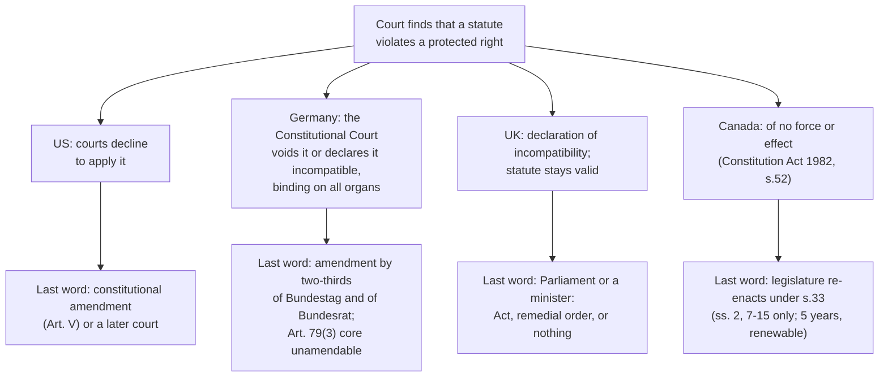

# Political Institutions · Lesson 5.4: Weak-form review, appointments and independence

> ⏱ ~15 min · Module 5: Dividing power: federalism and courts · Builds on: [5.3 Judicial review compared](05-03-judicial-review-compared.md), [`political-philosophy` 5.2](../../political-philosophy/lessons/05-02-majority-rule-vs-rights-judicial-review.md) · Unlocks: [6.1 Bureaucracy: merit and patronage](06-01-bureaucracy-merit-and-patronage.md), [6.2 Delegation and oversight](06-02-delegation-and-oversight.md)

## Why this matters

[5.3](05-03-judicial-review-compared.md) asked who can bring a statute before a court, and when. Two more rules decide what that power is worth. After a court finds that a statute violates a right, who has the last word? And who picks the judges, for how long? A court that can strike laws down but is staffed by the current majority, and a court that can only declare but is almost always obeyed, may end up closer than their powers suggest. Whether courts *should* have the last word is [`political-philosophy` 5.2](../../political-philosophy/lessons/05-02-majority-rule-vs-rights-judicial-review.md)'s question, and it is not argued here.

## The idea

Treat a rights dispute as a sequence of moves: the legislature enacts, a court rules, then someone moves again. The design fixes that next move.

- **Strong form** (PP 5.2's definition; see [review models](../reference.md#judicial-review-models)): the court may decline to apply a statute or modify its effect. The legislature's only replies are a constitutional amendment, or waiting for different judges. The US and Germany are the cases.
- **[Weak form](../reference.md#weak-form-review)**: the court gives its judgment, but the legislature keeps the final word by ordinary means. Stephen Gardbaum (*The New Commonwealth Model of Constitutionalism*) groups Canada (1982), New Zealand (1990) and the UK (1998) as a "new Commonwealth model". Each has a bill of rights that courts enforce, while the legislature keeps a final say. The label "weak-form" is associated above all with Mark Tushnet (*Weak Courts, Strong Rights*).

The second question is staffing. **[Judicial independence](../reference.md#judicial-independence)** is built from three rules: how judges are chosen, how long they serve, and how they can be removed.

Keep three kinds of claim apart. **Mechanical**: what a provision does by its text ("does not affect the validity"). **Empirical**: what governments and courts are observed to do. **Normative**: whether the last word belongs with courts (PP 5.2).

## Source

The UK's Human Rights Act 1998, ss. 3(1) and 4(6) (legislation.gov.uk, as of 2026):

> "3(1) So far as it is possible to do so, primary legislation and subordinate legislation must be read and given effect in a way which is compatible with the Convention rights."
>
> "4(6) A declaration under this section ('a declaration of incompatibility')— (a) does not affect the validity, continuing operation or enforcement of the provision in respect of which it is given; and (b) is not binding on the parties to the proceedings in which it is made."

Read it closely. **"So far as it is possible"** imposes a strong duty to interpret, with a limit the Act never defines. **"Does not affect the validity, continuing operation or enforcement"**: the statute is still law the next morning, and officials must keep applying it. **"Not binding on the parties"**: a claimant who wins a declaration leaves court with nothing the declaration itself enforces. The "Convention rights" are those of the European Convention on Human Rights, scheduled to the Act.

## The mechanism

1. **Read it compatibly if you can (s.3).** A UK court looks for a compatible reading first, and the reading can be bold. In *Ghaidan v Godin-Mendoza* (2004) the House of Lords read the Rent Act 1977's succession rights for a tenant's partner to include same-sex partners, over one dissent. *In words:* much of a weak-form court's power is interpretive, and it is used before any declaration.
2. **If you cannot, declare (s.4).** Only the higher courts listed in s.4(5) may make a **[declaration of incompatibility](../reference.md#declaration-of-incompatibility)**. The statute stays valid.
3. **The political branches decide.** Parliament may amend by Act. A minister may amend by a **remedial order** (s.10) if there are "compelling reasons". Or nobody acts: the government's own annual report states that there is no legal obligation to respond.
4. **Canada: strike, then override.** A Canadian court holds an inconsistent law "of no force or effect" (Constitution Act 1982, s.52), which is strong form. The weak element is the **[notwithstanding clause](../reference.md#notwithstanding-clause)**, Charter s.33(1):

   > "Parliament or the legislature of a province may expressly declare in an Act of Parliament or of the legislature, as the case may be, that the Act or a provision thereof shall operate notwithstanding a provision included in section 2 or sections 7 to 15 of this Charter."

   The override must be express. It reaches only fundamental freedoms (s.2), legal rights (ss.7–14) and equality (s.15), not voting, mobility or language rights. It lapses after five years (s.33(3)) and may be re-enacted, again for five years (s.33(4)–(5)). Quebec wrote it into its 2019 secularism law (Bill 21), and its National Assembly renewed it in 2024.
5. **New Zealand**, the weakest of the three. The Bill of Rights Act 1990 is an ordinary statute. Its s.4 forbids courts to invalidate or decline to apply inconsistent legislation, and s.6 asks them to prefer a consistent reading.

**Who picks the judges** (as of 2026):

| Court | Chosen by | Vote needed | Tenure |
|---|---|---|---|
| US Supreme Court | President nominates; Senate consents (Art. II §2) | Senate majority (a filibuster cannot block these since 2017) | "during good Behaviour" (Art. III §1): life, unless impeached |
| German Federal Constitutional Court | Bundestag elects half, Bundesrat half (Basic Law Art. 93(2)) | two-thirds in each (Court Act ss.6–7; Bundestag: two-thirds of votes cast and a majority of Members) | 12 years, no re-election, retire at 68 (Art. 93(3)) |
| UK Supreme Court | selection commission; the PM must recommend its choice (Constitutional Reform Act 2005, s.26) | none in Parliament | good behaviour; removal on an address of both Houses (s.33) |
| Supreme Court of Canada | federal cabinet (Supreme Court Act s.4(2)) | none | to age 75 (s.9(2)) |

The mechanisms (**[judicial appointments](../reference.md#judicial-appointments)**): life tenure and non-renewable terms both remove the judge's interest in pleasing whoever reappoints. Removal by both Houses descends from the Act of Settlement (enacted 1701, in force 1714). A simple-majority rule lets a durable majority fill every vacancy. A two-thirds rule forces the largest blocs to agree. In Germany the parties share out nominations in practice, and each judge is commonly identified by the party that proposed them. That is an empirical pattern from one country, not a rule.

**Courts as policy actors** (empirical, strength stated). Robert Dahl ("Decision-Making in a Democracy", 1957) argued that the US Supreme Court is rarely out of line with lawmaking majorities for long, because appointments track elections. A classic single-country finding, debated ever since. Alec Stone Sweet (*Governing with Judges*) argued that German and French legislators anticipate review and draft bills to survive it. The evidence is case studies: suggestive, hard to measure. Tom Ginsburg (*Judicial Review in New Democracies*, 2003) offered an "insurance" account: framers who expect to lose power choose stronger, more independent courts. The evidence is East Asian cases, plausible but not settled.

**The UK record.** From October 2000 to July 2025, UK courts made 63 declarations. Thirteen were overturned on appeal. Of the 50 left standing, 33 had been addressed: 5 by amendments already made before the declaration, 11 by remedial order, 16 by other legislation, and 1 by "various measures". The last was the 2007 declaration against the blanket ban on prisoner voting, closed only in the 2021 report. Seventeen remained open (Ministry of Justice report to Parliament's Joint Committee on Human Rights, 2024–25).

**Where the evidence is weakest.** Is weak-form review weak in practice? The worries run in opposite directions. If governments nearly always comply, a declaration works like a strike-down with a delay, and weak form collapses into strong form. If legislatures override whenever it matters, weak form protects nothing. The UK record fits the first worry, but it cannot tell us *why* governments comply. One reading is that declarations carry political force. The other is that the UK also answers to the European Court of Human Rights, whose judgments bind it in international law. Canada's "dialogue" reading of s.33, on which legislatures and courts trade moves, is contested on the same ground: we never see what the legislature would have done without the court.

## Who has the last word

*Read the default. In the US, Germany and Canada, if the legislature does nothing, the ruling stands. In the UK, if Parliament does nothing, the statute stands.*

## Worked examples

**Example 1 (clean): one statute, two rulebooks.** Invented case. Umbria Nova's Transit Data Act requires bus companies to keep passengers' journey records for three years and hand them to police "on request, without a warrant". A commuter sues, claiming the right to private life.

- *UK-style Rights Act (a copy of ss.3, 4 and 10).* Can "without a warrant" be read as "with a warrant"? No: s.3 permits strained readings, but not reading words into their opposite. The court declares. Police keep requesting records the next morning, and the commuter's data stays handed over. **The rule that decides:** s.4(6)(a). The government may introduce a bill, make a remedial order, or do nothing. That choice is politics.
- *Canadian-style Charter.* The court holds the warrantless clause of no force, unless the government shows it is a reasonable limit (Charter s.1). The legislature re-enacts with an express override. Unreasonable search is s.8, inside the range ss.7–14, so the override is available. **The rule that decides:** s.33(3)'s sunset. After five years the override lapses and the ruling bites again, unless the legislature re-enacts it on the record. Had the Act instead barred some citizens from voting (s.3), no override would be possible.

**Example 2 (hard): the override used first.** Now Umbria Nova's legislature writes the override into the original Act, before any court has ruled, as Quebec did in 2019. A citizen challenges the law anyway. The court cannot deny it effect: it "shall operate notwithstanding" the listed rights. May the court still *say* the right is violated? The text of s.33 is silent. The "dialogue" picture assumed the court moves first; here the legislature moves first and last, and the five-year sunset is the only mechanical check left.

A defender says the design is working: the legislature takes open responsibility, in express words, on an electoral clock of about one parliamentary term. A critic says an override meant as a reply to judges, used in advance, takes the right away from courts altogether. The rule stops at the silence: whether pre-emptive use is legitimate is not something s.33 decides.

## Watch out

- **You might think "declarations are almost always acted on" describes what s.4 does, but actually that is an empirical regularity about one country.** Mechanically, s.4(6) leaves the statute in force, and no one is obliged to respond.
- **You might think Canada's override and the UK's declaration are the same device, but actually the default is reversed.** A Canadian court invalidates, so the legislature must act, expressly and only for some rights, to restore the law. A UK court cannot invalidate, so Parliament need do nothing for the law to stand.
- **You might think independence means life tenure, but actually Germany gets it differently.** A single 12-year term with no re-election removes the reappointment incentive without life tenure. A two-thirds election rule does not make a court non-partisan either. It makes the court's composition a bargain between the blocs.

## One-liner

> Weak-form review moves the last word back to the legislature, by a declaration that leaves the law standing (UK) or an override the legislature must renew every five years (Canada); appointment and tenure rules decide whose court it is, and the evidence on how weak "weak" is in practice is thin.

## Problems

**P1 (🟢) *(Exegetical (a)-(c).)*** Close reading. Umbria Nova's Rights Act copies the UK Human Rights Act's ss.3, 4 and 10 word for word (see **Source**). A tenant, Ms Orsini, faces eviction under s.12 of Umbria Nova's Housing Act, which says a landlord "may evict on two months' notice, without reasons". The High Court declares s.12 incompatible with the right to respect for the home. (a) Does the declaration stop her eviction? Name the words that decide it. Two sentences. (b) An invented headline reads: "High Court strikes down eviction law; all pending evictions halted." Name the two errors. Two sentences. (c) Her lawyer says the court should have read s.12 as "may evict only where proportionate" instead of declaring. Which section governs that argument, and which phrase in it limits the court? One sentence.

**P2 (🟡) *(Formal (a)-(b) · Exegetical (c).)*** Apply to a hard case. Invented numbers. Umbria Nova's Constitutional Court has 6 judges serving 12-year non-renewable terms, with one seat falling vacant every two years (years 2, 4, 6, 8, 10, 12). At year 0 the seats expiring in years 2, 6 and 10 are held by judges chosen by the Azure bloc, and those expiring in years 4, 8 and 12 by the Bronze bloc. Azure holds 56% of the parliament before year 9, and Bronze holds 56% from year 9 on. Parliament fills every vacancy. (a) Under a simple-majority rule, where the majority bloc fills each vacancy with its own nominee, give the court's Azure–Bronze split just after the year-8 and the year-12 appointments. (b) Under a two-thirds rule, assume the blocs make a standing deal to take turns nominating, Azure first at year 2. Give the same two splits. (c) Name the trade-off the two-thirds rule accepts, and say where it stops determining the court's composition. 80 words or fewer.

Solutions

**P1** *(Exegetical (a)-(c), strict)*

**Must hit, strict (a):**

- No. The declaration "does not affect the validity, continuing operation or enforcement" of s.12 (s.4(6)(a)), and it "is not binding on the parties" (s.4(6)(b)). The landlord may still evict.

**Must hit, strict (b):**

- Error 1: nothing was struck down. The statute remains valid, and only a weak-form declaration was made.
- Error 2: pending evictions are not halted. Courts and officials keep applying s.12 until Parliament amends it, or a minister makes a remedial order under s.10 (if there are "compelling reasons"). Neither is required.

**Must hit, strict (c):**

- Section 3(1), the duty to read legislation compatibly, limited by "so far as it is possible to do so". "Without reasons" leaves little room, which is why the court declared instead.

**Wrong turns:** saying the declaration suspends the law pending Parliament's response. Nothing in s.4 suspends anything. Treating the s.10 remedial order as automatic: it is a ministerial discretion.

**Model answer:** (a) No: s.4(6)(a) says the declaration does not affect the validity, continuing operation or enforcement of s.12, and (b) says it does not bind the parties, so the eviction proceeds. (b) The court struck nothing down, since the law remains valid; and pending evictions continue unless and until Parliament amends s.12 or a minister makes a remedial order, neither of which is required. (c) Section 3(1), limited by "so far as it is possible to do so".

---

**P2** *(Formal (a)-(b), strict · Exegetical (c), strict)*

(a) Simple majority. Azure fills the vacancies at years 2, 4, 6 and 8; Bronze fills those at years 10 and 12.

| Year | Seat originally held by | Filled by | Azure–Bronze after |
|---|---|---|---|
| 0 | | | 3–3 |
| 2 | Azure | Azure | 3–3 |
| 4 | Bronze | Azure | 4–2 |
| 6 | Azure | Azure | 4–2 |
| 8 | Bronze | Azure | **5–1** |
| 10 | Azure | Bronze | 4–2 |
| 12 | Bronze | Bronze | **4–2** |

(b) Two-thirds with alternation. Azure nominates at years 2, 6 and 10, and Bronze at 4, 8 and 12. Each seat is refilled by the bloc that held it, so the split is **3–3 at year 8 and 3–3 at year 12** (and at every year).

**Must hit, strict (a)-(b):**

- 5–1 and 4–2 under simple majority; 3–3 and 3–3 under the deal.

**Must hit, strict (c):**

- The trade-off: the supermajority rule makes the court's composition insensitive to elections (it never tracks Bronze's win), at the price of giving each bloc a veto and making composition a bargain.
- Where it runs out: the rule says two-thirds, not who gets which seat. The alternation is a deal outside the rule. If the blocs refuse to deal, the rule produces deadlock, not a composition. What happens then depends on holdover or fallback provisions the problem does not give. Germany's Basic Law, for example, lets a federal law hand the election to the other electing body after a deadline.

**Wrong turns:** assuming Bronze controls the court once it wins parliament. Under simple majority the court lags: three years after the change, it is still 4–2 Azure. Saying 56% suffices under the two-thirds rule.

**Model answer (c):** The two-thirds rule trades responsiveness for insulation: the court no longer follows election results, but each bloc gains a veto over every seat. The rule fixes only the threshold. The 3–3 split comes from a turn-taking deal that the rule does not require. If the blocs stop dealing, seats stay unfilled or incumbents hold over, and the outcome depends on whatever fallback the constitution supplies.

## Flashback

**From Lesson [5.2](05-02-decentralization-in-practice.md) (Decentralization in practice):** *(Formal (a) · Exegetical (b)–(c).)* Apply to a new case. Invented numbers, in billions per year. Ardwyn, a region of the invented federation of Daskaro, spends 150, raises 60 in its own taxes, receives an unconditional grant of 90 and does not borrow. A new federal law creates an eldercare benefit and, as Daskaro's constitution allows, requires the regions to administer it. Ardwyn's cost is 30 a year, and its other spending is unchanged.

(a) Compute Ardwyn's VFI before the law, and after it under each funding rule. **Rule 1:** the centre pays nothing, and Ardwyn raises its own taxes to cover the 30 (by what percentage?). **Rule 2:** the centre pays a conditional grant of 30, earmarked for the benefit. (b) The two rules move the VFI in opposite directions, though Ardwyn runs the same programme under both. In two sentences, say why, and what neither number shows about Ardwyn's control over its budget. (c) Name the model of administration the law presupposes, and say how the same benefit would be delivered in the US, naming the rule that decides. Two sentences.

Solution

(a) $\mathrm{VFI} = 1 - R/E$, with $R$ own-source revenue and $E$ regional spending.

Before: $1 - 60/150 = 0.60$.

Rule 1: own taxes rise by $30/60 = 50\%$, so $R = 90$, $E = 180$, and $\mathrm{VFI} = 1 - 90/180 = 0.50$.

Rule 2: $R = 60$, $E = 180$, and $\mathrm{VFI} = 1 - 60/180 = 0.67$.

**Must hit, strict (a):**

- 0.60 before; 0.50 and a 50% tax rise under Rule 1; 0.67 under Rule 2.

**Must hit, strict (b):**

- The VFI tracks only who finances regional spending: Rule 1 adds the cost to own revenue, which lowers the ratio, while Rule 2 adds it to transfers, which raises it.
- Neither shows control. Under both rules the extra 30 goes to a programme the centre designed, so Rule 1's lower VFI looks like more autonomy while Ardwyn in fact has less room: a third of its own taxes now pays for a central policy.

**Must hit, strict (c):**

- Administrative federalism, the German model: the centre legislates and the regions implement, as under Basic Law Art. 83.
- In the US, dual federalism: the federal government would run the benefit through its own officials and field agencies, because Congress may not commandeer state officers to carry out a federal programme (*Printz v. United States*, 1997).

**Wrong turns:** computing Rule 2's VFI with the old spending of 150, as if an earmarked grant were not regional spending; reading Rule 1's falling VFI as decentralization, the error the lesson's Watch out names (VFI measures financing, not control); calling the arrangement dual federalism because each level has its own budget.

**Model answer (b)–(c):** (b) The ratio counts only where the money comes from, so paying from Ardwyn's own taxes lowers it and paying by grant raises it. Under either rule the centre has decided what the 30 is spent on, so Rule 1's VFI of 0.50 makes Ardwyn look more autonomous just as a central mandate has claimed a third of its own tax take. (c) The law presupposes administrative federalism, in which the regions execute federal law. In the US the federal government would have to deliver the benefit through its own officials, since the anti-commandeering rule (*Printz*, 1997) bars it from conscripting state officers.

## Connections

- **Backward:** [5.3](05-03-judicial-review-compared.md) placed courts by who may bring a case and when. This lesson adds what happens after the ruling, and who sits on the bench. Waldron's case against strong review, and the weak-form design that answers it, are in [`political-philosophy` 5.2](../../political-philosophy/lessons/05-02-majority-rule-vs-rights-judicial-review.md). This lesson describes the designs; that one argues about their legitimacy. [Parliamentary sovereignty](../reference.md#parliamentary-sovereignty), which s.4 is built to respect, is [5.3](05-03-judicial-review-compared.md)'s ground.
- **Forward:** [6.2](06-02-delegation-and-oversight.md) applies the same tools (appointment rules, fixed terms, protection from removal) to agencies and central banks. [6.4](06-04-majoritarian-and-consensus-democracy.md) uses the strength of judicial review as one of Lijphart's federal-unitary variables. [6.1](06-01-bureaucracy-merit-and-patronage.md) asks the staffing question for the civil service.
- **Sideways:** central-bank independence as a commitment device, the same insulation logic, is in [`grad-macro` 6.2](../../grad-macro/lessons/06-02-policy-rules-taylor-principle.md). US doctrine on review and appointments belongs to [`constitutional-law`](../../constitutional-law/syllabus.md). Theories of interpretation behind "so far as it is possible" belong to [`philosophy-of-law`](../../philosophy-of-law/syllabus.md).
