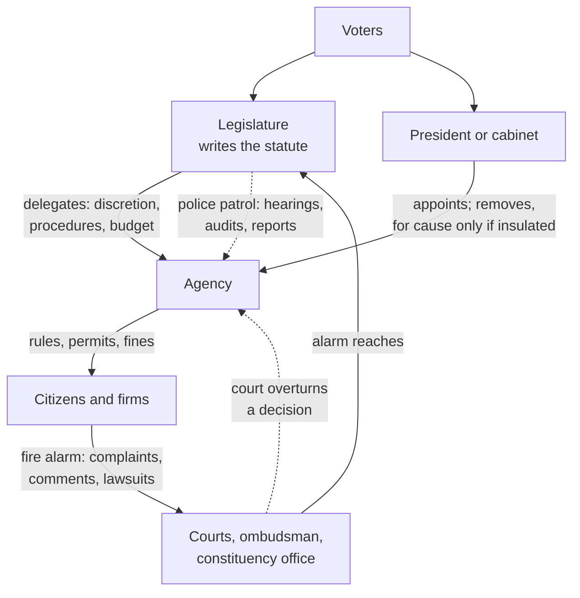

# Political Institutions · Lesson 6.2: Delegation and oversight

> ⏱ ~15 min · Module 6: Delegation, direct democracy, and the whole design · Builds on: [6.1 Bureaucracy: merit and patronage](06-01-bureaucracy-merit-and-patronage.md), [4.2 Committees and agenda control](04-02-committees-and-agenda-control.md), [`grad-micro` 5.4](../../grad-micro/lessons/05-04-moral-hazard-principal-agent.md) · Unlocks: [6.3 Direct democracy](06-03-direct-democracy.md), [6.4 Majoritarian and consensus democracy](06-04-majoritarian-and-consensus-democracy.md)

## Why this matters

Most rules that bind a citizen were never voted on by anyone she elected. A statute tells an agency to set "safe" pesticide limits, and the agency writes the numbers; parliament names an inflation objective, and a committee of economists sets interest rates. Every democracy must answer two questions: why would elected politicians give power away, and how do they keep any of it?

## The idea

**[Delegation](../reference.md#delegation)** is a principal granting an agent authority to act for it. Its structure is the one [`grad-micro` 5.4](../../grad-micro/lessons/05-04-moral-hazard-principal-agent.md) models: the agent knows and does things the principal cannot see, so the outcome depends on what the agent wants. That lesson solves for the optimal contract. Here the contract is a statute, and the question is which clauses legislatures actually write. The formal accountability models belong to [`political-economy`](../../political-economy/syllabus.md) Module 4.

Legislatures delegate for four reasons:

- **Expertise.** Agency staff can set toxicity thresholds and update them as the science changes; a legislature cannot.
- **Workload.** Floor time is the scarcest resource in a legislature ([4.2](04-02-committees-and-agenda-control.md)), so detail is pushed downward.
- **Blame-shifting.** An agency can take the unpopular decision that legislators want taken but not pinned on them (an argument associated with Morris Fiorina).
- **Credible commitment.** A promise not to exploit a policy later is believed only if the promiser has given away the power to break it. This is the central bank's case.

The cost is **[drift](../reference.md#bureaucratic-and-coalitional-drift)**: policy moves away from what the enacting coalition wanted. *Bureaucratic drift* comes from the agency's own aims, such as a bigger remit or a regulator that comes to share its industry's view (capture, modelled in [`political-economy`](../../political-economy/syllabus.md) 4.4). *Coalitional drift* comes from later politicians who use the agency to undo the deal. The two pull design in opposite directions. Shielding an agency from tomorrow's majority also shields it from today's. Terry Moe made this the core of his account of bureaucratic structure: today's winners insulate their agencies because they expect to lose power someday.

Constitutions shape the chain. Kaare Strøm and colleagues (*Delegation and Accountability in Parliamentary Democracies*, 2003) describe parliamentary government as a single chain: voters, MPs, prime minister, ministers, civil servants, each link with one principal. A US agency has two principals, Congress and the President, and they may disagree. That much is **mechanical**. What follows is **empirical** and contested: the agency may play its principals off against each other, or each may watch the other.

## The mechanism

The legislature chooses four design variables. Each is a lever on drift.

1. **Discretion (before the agency acts).** A statute can say "regulate in the public interest", or it can run to two hundred pages. *Mechanical:* more detail leaves less room. *Empirical:* John Huber and Charles Shipan (*Deliberate Discretion?*, 2002) find that legislatures write more detailed laws when they distrust the agency's political masters and can afford to write detail. Their evidence comes from US states and parliamentary democracies. David Epstein and Sharyn O'Halloran (*Delegating Powers*, 1999) find that Congress delegates less to the executive under divided government. Both findings are well-documented correlations.
   *In words:* discretion is a dial the principal turns down when it trusts the agent less.

2. **Procedure (before).** McCubbins, Noll and Weingast ("Administrative Procedures as Instruments of Political Control", 1987) argue that procedural rules "stack the deck". Notice-and-comment requirements, mandatory hearings and rules on who may take part decide which interests the agency hears, and so shape outcomes without dictating them.

3. **Oversight (after): [police patrols and fire alarms](../reference.md#police-patrols-and-fire-alarms).** Mathew McCubbins and Thomas Schwartz (*American Journal of Political Science*, 1984) distinguished two ways of watching an agency.
   - A **police patrol** is centralized, active and direct. On its own initiative, the legislature examines a sample of agency actions through hearings, audits, required reports and committee inquiries.
   - A **fire alarm** is decentralized and reactive. The legislature writes rules that let citizens and groups inspect agency decisions and sound the alarm: complaint procedures, rights to comment, access to courts, ombudsmen. Legislators act when the alarm rings.

   Their argument: alarms are cheaper for legislators, because others pay for detection, and they flag the violations constituents care about, which legislators get credit for fixing. So the observation that Congress rarely patrolled, then read as neglect, was a misreading: Congress had chosen alarms. *Mechanical example:* under the UK's Parliamentary Commissioner Act 1967, s.5, most maladministration complaints reach the Ombudsman only when "referred to the Commissioner, with the consent of the person who made it, by a member of that House". Since 2025, victims of crime may complain directly about their treatment as victims. Otherwise, as of 2026, the citizen pulls the alarm and an MP decides whether it rings.

4. **Insulation: [agency independence](../reference.md#agency-independence).** The levers are who appoints, fixed and staggered terms, removal only "for cause", multi-member boards, a budget outside annual appropriation, a mandate fixed in statute or treaty, and any override clause. Each is mechanical. In the US (as of 2026), *Trump v. Slaughter* (2026) held that Congress may not require cause for the President to remove officials exercising executive power, overruling *Humphrey's Executor* (1935). In *Trump v. Cook*, decided the same day, the Court refused to let the President's removal of a Federal Reserve governor take effect while the case proceeds, and treated the Fed's for-cause protection as part of a distinct central-banking tradition. The doctrine is [`constitutional-law`](../../constitutional-law/syllabus.md)'s; the institutional point is that the for-cause lever, once common, now survives most clearly for the US central bank.

**[Central bank independence](../reference.md#central-bank-independence)** applies lever 4 to the commitment problem. A government that sets interest rates is tempted, once wages and prices are fixed, to buy a burst of output with surprise inflation. People foresee this, so they expect higher inflation and the government gets no extra output: Kydland and Prescott's inflation bias, derived in [`grad-macro` 6.2](../../grad-macro/lessons/06-02-policy-rules-taylor-principle.md). Giving the rate to a body that cannot be overruled and weights inflation heavily (Rogoff's "conservative" central banker) is a commitment device. It runs on the same logic as tying the sovereign's hands after 1688 ([`history-of-debt` 3.2](../../history-of-debt/lessons/03-02-did-1688-make-britain-creditworthy.md)). Separate **[goal and instrument independence](../reference.md#goal-and-instrument-independence)**: who picks the target, and who picks the interest rate that hits it. Rules as of 2026:

| | Bank of England | European Central Bank | Federal Reserve |
|---|---|---|---|
| Legal basis | Bank of England Act 1998, in force 1 June 1998 (announced 6 May 1997) | EU treaties; changing them takes every member state | Federal Reserve Act, an ordinary statute |
| Goal | Treasury specifies what counts as price stability (s.12) | Price stability by treaty; the ECB itself defines it as 2% over the medium term, symmetric | Statute: "maximum employment, stable prices, and moderate long-term interest rates" (s.2A) |
| Instrument | Monetary Policy Committee | Governing Council | Federal Open Market Committee |
| Tenure | | Executive Board: eight-year terms, non-renewable | Governors: 14 years, removable for cause (s.10) |
| Override | Treasury directions in extreme economic circumstances; void unless both Houses approve within 28 days; 3 months at most (s.19) | None short of treaty change | None; Congress can amend the Act |

**Where the evidence is weakest.** First, does independence *cause* low inflation? Cukierman, Webb and Neyapti (*World Bank Economic Review*, 1992) built an index of legal independence. Alesina and Summers (*Journal of Money, Credit and Banking*, 1993) found that among rich democracies, more independent banks went with lower average inflation and no loss of growth. That is a robust correlation for rich democracies. Elsewhere it is weak: in developing countries legal independence predicts little, and how often governors are actually replaced predicts more. The causal reading is contested. Adam Posen argued that a financial sector strong enough to demand low inflation produces both the independent bank and the low inflation, which makes independence a symptom, not a cause. Second, oversight is nearly invisible when it works. If the agency anticipates hearings and alarms, it complies and nothing happens. A quiet agency is consistent with tight control and with abdication. Weingast and Moran (*Journal of Political Economy*, 1983) found that the Federal Trade Commission's policy shifted when its oversight committee's membership changed, which they read as control by anticipation. That is a single agency, and the reading is disputed.

## How control runs

*Patrols run straight from legislature to agency. Alarms run the long way round, through the people the agency affects, so they ring only where someone affected can notice the harm and reach a forum.*

## Worked examples

**Example 1 (clean): Wexland's Medicines Authority.** Invented case. Wexland's legislature creates an authority to license new drugs. Run the levers.

- *Discretion:* the statute sets the standard ("safe and effective") and leaves trial thresholds to the authority. Expertise justifies the delegation.
- *Procedure:* decisions are published with reasons, and applicants and patient groups may comment.
- *Oversight:* the two errors ring differently. Wrongly rejecting a good drug harms one identifiable firm, at once, and the firm complains loudly, so the alarm rings. Wrongly approving a bad drug harms scattered patients years later, and many never learn the cause, so the alarm rings late or never. Alarms alone would bias the authority toward approval. Wexland therefore adds a patrol: the health committee audits post-approval safety reports each year.

The rule that decides is the alarm's precondition: those harmed can detect the harm and reach a forum. Where that holds, alarms are cheap; where it fails, the legislature must pay for patrols.

**Example 2 (hard): the clause that runs out.** Invented case. Wexland's Central Bank Act makes price stability the bank's primary objective. Governors serve seven-year terms, removable only for cause. Article 9 says the bank "shall not purchase debt instruments directly from the government." There is no override clause. In a crisis, yields on government bonds spike, and the bank buys bonds on the secondary market from banks that bought them at auction a week earlier.

Mechanically, Article 9 bans only direct purchases, and these were indirect. Whether a week's detour evades the ban is a judgment the text does not make; with no override clause, it falls to a court or to the bank itself. The euro area met this exact question under the EU treaties' ban on direct financing. The ECB's purchase programmes went to the EU Court of Justice, and in May 2020 Germany's Federal Constitutional Court refused to follow the EU court's approval of one programme and demanded that the ECB justify its proportionality. Here the rule stops deciding. The insulation that makes the commitment credible also makes the bank, or a court, the judge of where its own mandate ends.

## Watch out

- **You might think "independent central banks deliver low inflation" is a fact about the design, but actually it is an empirical claim, and a contested one.** The law fixes only who decides. The correlation is strong for rich democracies, weak elsewhere, and its causal direction is disputed.
- **You might think a fire alarm means no oversight, or less of it, but actually it is a different design with different costs.** It is cheap and aimed at what constituents care about, but deaf to harms nobody notices. Patrols are costly and can be aimed anywhere.
- **You might think the Bank of England and the ECB are independent in the same sense, but actually, of the two, only the ECB chooses its own target.** The Bank has instrument independence; the Treasury sets the target and holds a time-limited reserve power. Independence is also not unaccountability: insulated agencies still report and testify, and a statute can redesign them.

## One-liner

> Legislatures delegate for expertise, workload, blame and commitment, and pay in drift; they claw control back with discretion, procedure, patrols and alarms, and sometimes give it away on purpose, which is what an independent central bank is.

## Problems

**P1 (🟢) *(Exegetical (a)-(b).)*** Diagnose. Clauses from an **invented** bill to reform Wexland's monetary authority:

> (1) The Monetary Board's objective is price stability. The Finance Minister shall each year specify the inflation rate that constitutes price stability.
> (2) The Board alone sets the policy interest rate.
> (3) Board members serve six-year terms, staggered so that one expires each year, and may be removed only for incapacity or serious misconduct as found by the Supreme Court.
> (4) The Board's budget is approved each year by the Finance Ministry.
> (5) In circumstances the Finance Minister declares exceptional, the Minister may direct the Board's interest-rate decisions for as long as the Minister thinks necessary.

(a) For clauses 1, 2 and 3, say which kind of independence each grants or withholds: goal, instrument, or protection of tenure. One line each. (b) Name the two clauses that most weaken the Board's independence, and say how each does. Then name two safeguards in the Bank of England Act's reserve power (s.19) that clause 5 lacks. 80 words or fewer.

**P2 (🟡) *(Exegetical (a) · Evaluative (b).)*** Apply to a hard case. Wexland's legislature creates two agencies. The **Fisheries Quota Office** divides an annual catch limit among 40 commercial fishing firms, all members of one trade association. The **Care Standards Inspectorate** inspects residential homes for people with advanced dementia. (a) For each, say whether police patrols or fire alarms should carry most of the oversight, naming the condition the McCubbins–Schwartz logic requires. Two sentences per agency. (b) The legislature relies on alarms for the Quota Office. Say where that design stops serving the legislature's own goal of a sustainable fishery, and what one fix would cost. 100 words or fewer. Any verdict passes.

**P3 (🔴, optional) *(Exegetical.)*** Find the crux. One Wexland reformer wants the central bank to define price stability itself, as the ECB does. Another wants the Finance Minister to set the target and the bank only to set the rate, as in the UK. Name the single premise they divide on, and the evidence that would move it. 60 words or fewer.

Solutions

**P1** *(Exegetical (a)-(b), strict)*

**Must hit, strict (a):**

- Clause 1 withholds goal independence: the minister defines the target.
- Clause 2 grants instrument independence: the Board alone chooses the rate.
- Clause 3 protects tenure: fixed staggered terms, with removal for cause decided by a court, not by the government.

**Must hit, strict (b):**

- Clause 5: an override with no time limit and no outside check, triggered by the minister's own declaration, which can cancel clause 2 whenever the minister likes.
- Clause 4: annual budget control by the ministry gives the government a lever over the Board's resources, an indirect channel of pressure.
- Section 19's safeguards, any two of: the order is void unless both Houses approve it within 28 days; it lapses after 3 months at most; it must be laid before Parliament; the test is extreme economic circumstances and the public interest, with the Governor consulted first.

**Wrong turns:** calling clause 1 a breach of independence outright. The UK runs the same split and is standardly called instrument-independent. Calling the staggered terms in clause 3 a weakness: staggering stops any one government from replacing the whole Board at once.

**Model answer (b):** Clause 5 lets the minister take over rate-setting on her own declaration, indefinitely, which empties clause 2. Clause 4 lets the ministry squeeze the Board through its budget each year. The Bank of England Act's reserve power is narrower: an order lapses unless both Houses approve it within 28 days, and it cannot last beyond 3 months.

---

**P2** *(Exegetical (a), strict · Evaluative (b), any verdict)*

**Must hit, strict (a):**

- Alarms work when those affected can detect a violation and have the means and access to complain.
- Quota Office: alarms fit for errors against the firms. They are few, organized, informed about every allocation, and have an association to complain through.
- Inspectorate: patrols, such as legislative audits of inspection records or unannounced checks reported to a committee. Residents with advanced dementia cannot detect or report failures, and families see only part of what happens, so alarms would rarely ring.

**Must hit, any verdict (b):**

- Name the asymmetry: firms sound the alarm when quotas are too tight. A catch limit set too loose harms the future stock and the public, who are diffuse and unorganized, so alarms are silent when the fishery is overfished.
- Connect it to capture: alarm-based oversight hears the regulated industry, which is the pattern [`political-economy`](../../political-economy/syllabus.md) 4.4 models.
- Give one fix and its cost: a patrol (an independent stock assessment reported to the legislature), which costs money and expertise; or wiring a new alarm (standing for conservation groups to challenge the catch limit), which costs litigation and delay.

**Wrong turns:** choosing alarms for the Inspectorate because families can complain, which ignores how little of the care families see. Treating (b) as asking whether quotas are good policy; the question is whether the oversight design serves the legislature's own goal.

**Model answer (b), one of several:** Alarms ring only when quotas squeeze the firms. Overfishing harms future catches and the public, who never pull the alarm, so oversight hears only one side, and the Office will drift toward looser limits, the standard route to capture. One fix is a patrol: an independent scientific assessment of the stock reported to the fisheries committee each year. It costs money and expertise the legislature must fund, but it covers the side the alarms miss.

---

**P3** *(Exegetical, strict)*

**Must hit, strict:**

- The premise: whether choosing the target is a technical question, which politicians' short-term temptation would corrupt, or a political choice about trading inflation against output and jobs, which elected officials should own. The commitment problem in [`grad-macro` 6.2](../../grad-macro/lessons/06-02-policy-rules-taylor-principle.md) lies in the choice of instrument once expectations are set, and the second reformer says that holding the rate is enough to solve it.
- Evidence: whether governments that set targets themselves have shifted them for short-term gain, or whether their targets are less credible, as seen in inflation expectations, than self-set ones.

**Wrong turns:** answering "independence lowers inflation". Both reformers want an independent instrument; the dispute is only about the target.

**Model answer:** They divide on whether the target is technical or political. If governments can be trusted with the target once the rate is out of their hands, the UK split loses nothing. If they would move the target for short-term gain, the bank must set it too. Evidence: whether government-set targets have moved opportunistically or carried weaker inflation expectations.

## Flashback

**From Lesson [5.4](05-04-weak-form-review-appointments-and-independence.md) (Weak-form review, appointments and independence):** *(Exegetical (a)–(b).)* Diagnose. The invented country of Iskarra copies, word for word, Canada's Charter (ss.1–15 and the s.33 override) and s.52 of the Constitution Act 1982, as Lesson 5.4 describes them. Its s.2 protects freedom of peaceful assembly; its s.3 protects the right to vote. An **invented** editorial, not the words of any real person or outlet:

> "The Polling Order Act came into force on 1 March 2027. Part 1 bans demonstrations within 500 metres of a polling station; Part 2 strips the vote from anyone with unpaid court fines. Expecting a challenge, the Assembly wrote in an express declaration that the whole Act operates notwithstanding sections 2 and 3 of the Charter. This month the Supreme Court ruled that Part 2 unjustifiably limits the right to vote. The ruling is toothless. The override shields the Act permanently, and our judges, like British judges issuing a declaration of incompatibility, can only advise."

(a) Name three errors in the editorial's last two sentences, one sentence each, naming the rule that decides each. (b) The Assembly never re-enacts its declaration. In 2033, what is Part 1's legal position? One sentence.

Solution

**Must hit, strict (a):**

- The override cannot reach s.3: s.33 covers only s.2 and ss.7–15, so the declaration is ineffective for Part 2. The court's ruling therefore bites, and under s.52 Part 2 is of no force or effect.
- "Permanently" is wrong: a declaration lapses five years after it comes into force (s.33(3)), here on 1 March 2032, unless the Assembly re-enacts it, for five more years at a time.
- The British comparison reverses the default. A UK declaration leaves the statute valid (HRA s.4(6)), so Parliament need do nothing for the law to stand. An Iskarran court invalidates, and the legislature must act, expressly and only for the listed rights, to keep a law in force.

**Must hit, strict (b):**

- The declaration lapsed on 1 March 2032, so Part 1 now answers to s.2 like any other law: if a court finds it an unjustified limit on peaceful assembly (not saved under s.1), it is of no force or effect.

**Wrong turns:** treating the whole declaration as void because it named s.3. It validly shields Part 1 from s.2 until it lapses, and while it is in force a court cannot deny Part 1 effect. Treating s.1's reasonable-limits test as a second override; it is the court's test, applied before any override question arises. Saying Part 1 becomes invalid automatically in 2032; the lapse only exposes it to review.

**Model answer:** (a) First, s.33 reaches only s.2 and ss.7–15, so the declaration cannot protect Part 2 from s.3, and under s.52 the court's ruling leaves Part 2 of no force or effect. Second, the override is not permanent: under s.33(3) it lapses on 1 March 2032 unless the Assembly re-enacts it. Third, unlike a UK declaration, which by s.4(6) leaves the statute valid, an Iskarran ruling invalidates, so it is the legislature, not the court, that must act to change the result. (b) With the declaration lapsed, Part 1 is an ordinary law open to a s.2 challenge, and a court that finds it an unjustified limit on assembly can hold it of no force or effect.

## Connections

- **Backward:** [6.1](06-01-bureaucracy-merit-and-patronage.md) asked how civil servants are hired. This lesson asks how the people who hire them keep control. [4.2](04-02-committees-and-agenda-control.md)'s committees are the legislature's patrol units. Judicial independence in [5.4](05-04-weak-form-review-appointments-and-independence.md) uses the same levers of appointment, tenure and removal, applied to courts.
- **Forward:** [6.3](06-03-direct-democracy.md) runs the chain in reverse, with voters taking a decision back from their agents. [6.4](06-04-majoritarian-and-consensus-democracy.md) counts central bank independence among Lijphart's markers of consensus democracy.
- **Sideways:** the hidden-action contract is [`grad-micro` 5.4](../../grad-micro/lessons/05-04-moral-hazard-principal-agent.md). The inflation bias and the conservative central banker are [`grad-macro` 6.2](../../grad-macro/lessons/06-02-policy-rules-taylor-principle.md), and Kydland and Prescott's rules-versus-discretion argument returns in [`economics-of-debt` 8.1](../../economics-of-debt/lessons/08-01-forgiveness-commitment-and-the-fresh-start.md). An independent bank can still lose to a treasury that will not adjust (Sargent and Wallace's unpleasant arithmetic, [`economics-of-debt` 5.4](../../economics-of-debt/lessons/05-04-fiscal-limits-and-unpleasant-arithmetic.md)). Accountability, career-concern and capture models are [`political-economy`](../../political-economy/syllabus.md) Module 4. US removal doctrine is [`constitutional-law`](../../constitutional-law/syllabus.md).
