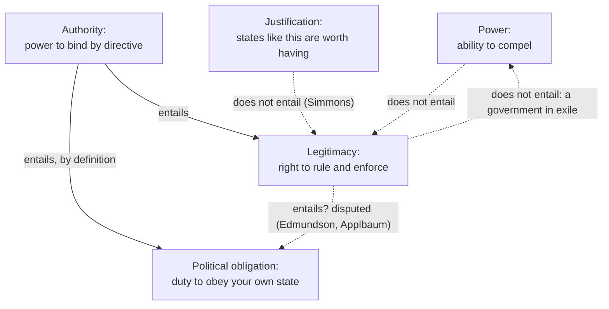

# Political Philosophy · Lesson 1.1: The problem of political authority

> ⏱ ~15 min · Module 1: Authority, legitimacy and obligation · Builds on: [`ethics`](../../ethics/syllabus.md), [`philosophical-method` 3.2 Distinctions and verbal disputes](../../philosophical-method/lessons/03-02-distinctions-and-verbal-disputes.md) · Unlocks: [1.2 Consent: actual, tacit and hypothetical](01-02-consent-actual-tacit-and-hypothetical.md), [1.4 Natural duty and philosophical anarchism](01-04-natural-duty-and-philosophical-anarchism.md)

## Why this matters

This course asks what, if anything, justifies the state. Six modules: why anyone should obey it, who should get what, what it may forbid, on what terms people who disagree about the good may coerce one another, why the majority should decide, and four hard cases (global aid, borders, conscience, welfare). The course takes no side. The great theorists as historical figures live in [`history-of-political-thought`](../../history-of-political-thought/syllabus.md); here their arguments are taken apart.

Start with the oddest fact about the state. It does not ask; it tells. It claims that you must pay, serve and refrain *because it said so*, and that it may punish you if you don't. A stranger who made those claims would be a racketeer. What makes the state different, if anything?

## The idea

Most bad arguments in this field establish one thing and claim another. So first, four words that ordinary speech blurs, kept apart for the whole course (the full table is on the card under [power, legitimacy, authority, obligation](../reference.md#power-legitimacy-authority-obligation)):

- **Power**: the ability to make people comply, by force, threat or habit. A purely descriptive fact. A gang has it.
- **[Legitimacy](../reference.md#legitimacy)**: the moral *right to rule*: the permission to make law and to enforce it coercively without thereby wronging the people coerced.
- **[Authority](../reference.md#political-authority)**: the moral *power to impose duties by directive*. If the state has authority over you, its saying "do X" itself gives you a duty to do X.
- **[Political obligation](../reference.md#political-obligation)**: the citizen's side: a moral duty to obey the law of *your own* state.

The concept that does the work is **[content-independence](../reference.md#content-independence)**. Suppose the law forbids dumping solvent in the river. You had a decisive reason not to do that before any law existed; obeying the law here is just doing what you should anyway. Now suppose the law sets the speed limit on a road at 50 where 55 would be equally safe. Your reason to drive at 50 is that the law says 50. A content-independent reason is one that comes from the *fact of the directive*, not from the merits of what it directs. Political obligation, as the literature uses the term, is supposed to be content-independent, **general** (it covers the body of law, not just the laws you happen to like) and **particular** (owed to your own state, not to every just state on earth; Simmons, *Moral Principles and Political Obligations*, 1979, made this particularity requirement central).

Two further distinctions.

**Descriptive vs normative legitimacy.** Weber used "legitimacy" for a *belief*: people take the order to be rightful, and that belief makes domination stable. That is an empirical claim about a population, owned by [`social-theory`](../../social-theory/syllabus.md) 4.3. This course means the normative property. A regime can be believed legitimate and not be, and the reverse.

**[Justification vs legitimacy](../reference.md#justification-and-legitimacy).** Simmons ("Justification and Legitimacy", 1999) separates a state's being *justified*, morally defensible, better than the alternatives, from its being *legitimate over a particular person*, which for him needs a special relation between that person and that state, such as her consent. A state can be the best available and still have no right to rule *you*. In words: a good argument that states like ours are worth having is not yet an argument that this state may rule you.

## The argument

The sharpest form of the problem is Robert Paul Wolff's *In Defense of Anarchism* (1970), paraphrased.

1. **(Conceptual)** Authority is the right to command, and correlatively the right to be obeyed: a subject must do what is commanded *because* it is commanded. *In words:* authority means content-independent duties.
2. **(Normative)** Every person has a primary duty of autonomy: to take responsibility for her actions by deciding for herself, on her own judgment, what she ought to do.
3. **(Conceptual)** Doing X because you were told to, rather than because you judge X right, is forfeiting that judgment.
4. **∴** An autonomous person can never acknowledge a duty to obey a command as such. She may do what the state commands, but only because she judges it right.
5. **∴ C.** No state (Wolff allows a possible exception only for unanimous direct democracy) has authority over anyone. Call this a priori [philosophical anarchism](../reference.md#philosophical-anarchism): the conclusion follows from the concepts, whatever any particular state is like.

Note what C does *not* say. It does not say states have no power, nor that you should disobey. Most of what the law demands you have independent reason to do. It says the *because-it-said-so* reason does not exist.

**The main reply: Raz's service conception.** Joseph Raz (*The Morality of Freedom*, 1986) gives the leading non-consent account of [authority](../reference.md#service-conception-of-authority). His **normal justification thesis**: an authority is legitimate over you when you would better conform to the reasons that already apply to you by following its directives than by trying to work things out yourself. Deferring to a good pharmacology regulator, or to a coordination scheme like a speed limit, is then what your own reason recommends. On this view authority comes piecemeal: it can hold over one person in one domain and not over an expert in that domain. Lesson [1.4](01-04-natural-duty-and-philosophical-anarchism.md) returns to it.

**The correlativity question.** Does legitimacy (the state may enforce) entail obligation (you must obey)? Wolff's definition ties authority to a duty to obey. But some theorists split legitimacy off: Edmundson (1998) argues a legitimate state is justified in issuing and enforcing directives without its subjects having even a prima facie duty to obey; Applbaum (2019) argues that legitimate authority makes you *liable* to be put under a duty, which is not the same as already being under one. Others hold that a right to rule just is a right to be obeyed. Whether the two come apart is itself a live dispute, and Module 1 ends on it.

**Where the argument is weakest.** Premise 3. A critic in Raz's camp says acting on a directive because it is a directive need not forfeit judgment: judgment can itself tell you to defer, as when you follow a pilot's instructions in turbulence because you judge that she knows more. Autonomy is acting on the best reasons, and sometimes the best reason is a directive. The Wolffian replies that this deference is conditional on your continuing judgment that the source is reliable, so it is advice taken, not authority obeyed: drop the judgment and the duty goes with it. Which side wins turns on whether a reason can be content-independent and still answerable to your judgment of the source.

## The argument map

Solid arrows hold by definition; dashed arrows are the inferences arguments tempt you to make and that need extra premises. Most of Module 1 lives on the dashed arrow from legitimacy to obligation.

## Worked examples

**Example 1 (clean): pulling the four apart.** Invented case. The Republic of Varden is occupied by a neighbouring army, which imposes a curfew and enforces it with patrols. Two years later the occupiers leave and Varden's elected parliament resumes.

- The occupiers had **power**: residents complied. On no serious view did they have **legitimacy**: enforcing the curfew wronged those it confined. Mass compliance, even resigned acceptance, would show Weberian belief at most.
- The restored parliament plausibly has legitimacy. Its law against dumping solvent in the river is legitimate, but it gives citizens no new reason; they had decisive reason already. If there is **political obligation** here, it is idle.
- Its speed limit of 50 is different: the content-independent reason, if there is one, does all the work. This is where obligation would make a difference, so it is where the question bites.

Lesson: test a claim of obligation on a law whose content gives you no prior reason, not on one that forbids a crime.

**Example 2 (hard): a decent state commands something mildly unjust.** Varden passes a levy on renters to fund road repairs and exempts owners, who use the roads as much. The unfairness is real but modest; Ilse, a renter, can afford it. Must she pay?

- If obligation is content-independent, it must survive *some* disagreement on the merits: a duty to obey only the laws you judge just is no duty to obey law at all. So a defender of obligation says yes, prima facie, and points out that a serious injustice would override it.
- Wolff says Ilse has no duty to pay *because it is the law*. She may still have reasons to pay: the roads need repair, and evasion shifts costs onto other renters.
- On Raz's thesis the answer depends on whether Ilse would conform better to her reasons (keeping roads open, a workable tax system) by following the levy than by deciding for herself. For an ordinary citizen, plausibly yes; the thesis gives no single answer for everyone.
- Separately, Varden may be **legitimate** in collecting the levy whatever Ilse's duty: if legitimacy and obligation come apart, it may enforce what she is not bound to obey.

Where the concepts stop: the vocabulary tells you which question is at stake. It does not say how much injustice defeats obligation. That threshold is a substantive normative claim each theory in Module 1 has to supply.

## Watch out

- **You might think that if a state is legitimate its citizens must obey it, but actually that is the disputed inference.** Edmundson and Applbaum hold that legitimacy can license enforcement without a correlative duty to obey. An argument that a state may rule has not yet shown that you must comply.
- **You might think that showing citizens accept their government shows it is legitimate, but actually that is an empirical claim about belief** (Weber's sense). The normative claim needs a normative premise, such as that acceptance amounts to consent, which [1.2](01-02-consent-actual-tacit-and-hypothetical.md) tests.
- **You might think philosophical anarchism counsels disobedience, but actually it denies only a general content-independent duty.** The anarchist can obey nearly every law, for the laws' own reasons; it is a thesis about obligation, not a programme of resistance.

## One-liner

> Power is the ability to compel, legitimacy the right to rule, authority the power to bind by saying so, obligation the duty to obey your own state; Wolff argues autonomy rules out authority, Raz that deferring can be what autonomy recommends, and the course's first question is which of the four any argument actually establishes.

## Problems

**P1 (🟢) *(Exegetical (a)-(b).)*** Diagnose. An **invented** op-ed from a local paper on the Halden Water Board's order rationing garden watering during a drought, not the words of any real person:

> (i) "The Board was elected with 61 percent of the vote, and polls show seven in ten residents trust it."
> (ii) "It has inspectors and the power to fine, so the order will be followed."
> (iii) "Rationing is plainly the fairest way to share a scarce supply."
> (iv) "So every resident is bound to obey the order, whether or not they think it wise."

(a) For (i)-(iii), say which of power, legitimacy (and in which sense), justification of the policy, authority or obligation each sentence speaks to, and whether the claim is empirical or normative. One line each. (b) Sentence (iv) claims something none of (i)-(iii) establishes. Name it, and say which feature of it the earlier sentences cannot reach. Two sentences.

**P2 (🟡) *(Exegetical (a) · Evaluative (b).)*** Invented case. Varden requires a 48-hour wait before pharmacists may dispense a certain sleep medication. Teo, a pharmacist who has studied the drug for twenty years, is confident the wait is mildly counterproductive for his patients, and he is probably right. (a) What does Raz's normal justification thesis say about whether the rule has authority over Teo, and what does Wolff say? Two sentences each. (b) Does Teo have a duty to comply? Reach a verdict and say where the principle you used stops determining one. 120 words or fewer.

**P3 (🔴, optional) *(Exegetical.)*** Find the crux. Wolff concludes that no state has authority; Raz that many have authority over many people in many domains. Name the single premise of Wolff's argument that Raz denies, and say what kind of case or argument would move a reader one way or the other. 100 words or fewer.

Solutions

**P1** *(Exegetical (a)-(b), strict)*

**Must hit, strict (a):**

- (i) Legitimacy in Weber's descriptive sense (belief, trust, electoral support). Empirical. On some views an election is evidence for normative legitimacy, but the sentence itself reports facts about votes and attitudes.
- (ii) Power. Empirical: it predicts compliance, and says nothing about whether the Board may enforce.
- (iii) A justification of the policy's content. Normative. It gives residents a content-dependent reason to ration, a reason they would have even if no order existed.

**Must hit, strict (b):**

- (iv) claims political obligation (or the Board's authority): a duty to obey *because the Board ordered it*.
- The feature the earlier sentences cannot reach is content-independence: "whether or not they think it wise" asks for a reason that survives disagreement on the merits, while (iii) supplies only a merits-based reason and (i)-(ii) supply no normative reason at all.

**Wrong turns:** filing (i) as normative legitimacy because elections "confer legitimacy" (that needs a normative premise the sentence does not state); filing (iii) as authority because it supports the order (it supports the policy, not the duty to obey the order as an order).

**Model answer:** (a) (i) descriptive legitimacy, empirical; (ii) power, empirical; (iii) justification of the policy, normative and content-dependent. (b) Sentence (iv) claims a political obligation to obey the order as such. "Whether or not they think it wise" makes the duty content-independent, and nothing earlier supplies a content-independent reason: (iii) is a reason about rationing, not about orders, and (i)-(ii) are facts.

---

**P2** *(Exegetical (a), strict · Evaluative (b), any verdict)*

**Must hit, strict (a):**

- Raz: the rule has authority over Teo only if he would better conform to the reasons that already apply to him (his patients' welfare) by following it than by acting on his own judgment. Since Teo is an expert who is probably right, the thesis plausibly denies the rule authority over him on this matter, even if it has authority over less expert pharmacists.
- Wolff: no rule has authority over anyone; Teo must decide on his own judgment, and the rule's being law adds no reason.

**Must hit, any verdict (b):**

- A verdict, separate from the reasoning.
- Run the chosen principle on the case, counting reasons that do not come from the rule's content: coordination (patients and regulators rely on uniform practice), the cost of every expert exempting himself, legal sanctions as prudential reasons.
- Say where the principle stops: for Raz, how much better Teo's judgment must be, and whether system-wide reliance counts as a reason the rule serves; for a defender of general obligation, whether mild counterproductiveness is enough to override.

**Wrong turns:** treating Raz's thesis as giving everyone the same answer (it is person- and domain-relative); concluding from Wolff that Teo should defy the rule (Wolff denies a duty to obey, not that there are reasons to comply).

**Model answer (b), one of several:** Yes, Teo should comply, though not because the rule has authority over him in Raz's sense. On the merits for each patient his judgment beats the rule. But a further reason applies to him anyway: uniform dispensing practice lets patients, doctors and inspectors rely on one standard, and an expert who exempts himself invites every confident pharmacist to do the same. Following the rule may serve that reason better than his own case-by-case judgment, which would give the rule authority over him after all, on a different ground. The thesis stops determining a verdict at the weighing: it does not say how large his expertise advantage must be before it outweighs the coordination benefit.

---

**P3** *(Exegetical, strict)*

**Must hit, strict:**

- The crux is Wolff's premise 3 (equivalently his conception of autonomy in premise 2): that acting on a directive because it is a directive forfeits one's own judgment. Raz denies it: one's own judgment can show that following an authority's directives is the best way to conform to one's reasons, so deference can be an exercise of autonomy.
- What would move it: cases of reasoned deference (a pilot, a coordination rule) where deferring seems fully responsible, against the Wolffian reply that deference conditional on continuing judgment of the source's reliability is taking advice, not obeying authority.

**Wrong turns:** naming premise 1 (Raz accepts that authority involves content-independent, preemptive reasons); naming a disagreement about whether states are just (Wolff's argument is a priori and holds even for a just state).

**Model answer:** Raz denies Wolff's premise 3, that doing what you are told because you are told forfeits autonomy. For Raz, autonomy is acting on the best reasons, and your own judgment can show that following a directive serves those reasons better than deciding case by case. A reader is moved by cases of reasoned deference, such as obeying a pilot in turbulence, and by whether such deference is genuinely binding or merely advice that lapses when your judgment of the source changes.

## Connections

- **Backward:** the method is [`philosophical-method` 3.2](../../philosophical-method/lessons/03-02-distinctions-and-verbal-disputes.md): draw the distinction the argument needs, then see whether the dispute survives it. Consent as a ground of moral obligation in general appears in [`ethics` 2.3](../../ethics/lessons/02-03-humanity-autonomy-and-the-lie.md) and [`ethics` 5.1](../../ethics/lessons/05-01-contractarianism-morality-as-mutual-advantage.md).
- **Forward:** [1.2](01-02-consent-actual-tacit-and-hypothetical.md) tests consent as the ground of obligation, [1.3](01-03-fair-play-gratitude-and-associative-obligation.md) fair play, gratitude and membership, and [1.4](01-04-natural-duty-and-philosophical-anarchism.md) natural duty, Raz again, and what follows if every ground fails. Module 4 asks what makes coercion legitimate among people who disagree about the good.
- **Sideways:** Weber's descriptive legitimacy and his three types of authority are [`social-theory`](../../social-theory/syllabus.md) 4.3. Hobbes's, Locke's and Rousseau's own answers to the authority problem are in [`history-of-political-thought` 3.4](../../history-of-political-thought/lessons/03-04-hobbes-the-sovereign-and-the-church.md), [4.2](../../history-of-political-thought/lessons/04-02-locke-limited-government-and-toleration.md) and [4.4](../../history-of-political-thought/lessons/04-04-rousseau-the-social-contract.md). Legal obligation, as distinct from political obligation, is `philosophy-of-law`.
