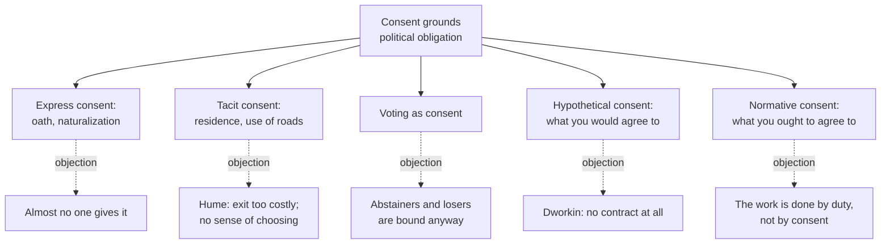

# Political Philosophy · Lesson 1.2: Consent: actual, tacit and hypothetical

> ⏱ ~15 min · Module 1: Authority, legitimacy and obligation · Builds on: [1.1 The problem of political authority](01-01-the-problem-of-political-authority.md) · Unlocks: [1.3 Fair play, gratitude and associative obligation](01-03-fair-play-gratitude-and-associative-obligation.md), [1.4 Natural duty and philosophical anarchism](01-04-natural-duty-and-philosophical-anarchism.md), [2.2 Rawls I: the original position](02-02-rawls-the-original-position.md)

## Why this matters

The most natural answer to "why must I obey?" is "because you agreed to." If citizens had joined the state, [political obligation](../reference.md#political-obligation) would be no more mysterious than a gym membership. The trouble is that almost nobody signed anything. This lesson tests each way of filling the gap (tacit, voting, hypothetical, normative) and finds where each one breaks. Keep 1.1's four things apart throughout: a consent theory aims at [authority and obligation](../reference.md#power-legitimacy-authority-obligation), and failing there does not by itself show the state lacks the right to coerce.

## The idea

**Consent is a normative power.** Saying "yes" changes what others may do to you and what you owe them: the surgeon may now cut, the lender may now collect. It is *voluntarist*: the obligation exists because you chose to create it. It squares the state's claims with the premise that people are born free. Locke opens his discussion with exactly that premise: every man is naturally free, "nothing being able to put him into subjection to any earthly power, but only his own consent" (*Second Treatise* §119).

**The state of nature is a device, not a history.** Hobbes, Locke and Rousseau each imagine people without government, then ask what they would agree to leave it. Hobbes's people authorize an absolute sovereign to escape the war of all against all ([`history-of-political-thought` 3.3](../../history-of-political-thought/lessons/03-03-hobbes-matter-motion-and-the-state-of-nature.md)). Locke's people consent to a limited government that protects their property ([4.2](../../history-of-political-thought/lessons/04-02-locke-limited-government-and-toleration.md)). Rousseau's people each place themselves under the general will ([4.4](../../history-of-political-thought/lessons/04-04-rousseau-the-social-contract.md)). The device has two uses, and confusing them is the commonest error here. Read *historically*, it claims the state was founded by an agreement that still binds. Read *as a test*, it claims a state is legitimate if free and equal people *would* agree to it.

**Four forms of consent** do different work:

- **Express consent:** an explicit act, such as an oath of allegiance or a naturalization ceremony. For Locke this makes you "a perfect member" of the society, bound for life (§119, §121).
- **[Tacit consent](../reference.md#express-and-tacit-consent):** consent given by conduct. Locke counts owning land, lodging for a week, even travelling the highway, as binding you to obey *while* you enjoy them, without making you a member (§119-122).
- **[Hypothetical consent](../reference.md#hypothetical-consent):** what you would agree to under fair conditions.
- **[Normative consent](../reference.md#normative-consent):** what you *ought* to have agreed to (Estlund).

## Source

Hume, "Of the Original Contract" (1748), from the paragraph that precedes the ship (public domain):

> Should it be said, that, by living under the dominion of a prince, which one might leave, every individual has given a tacit consent to his authority, and promised him obedience; it may be answered, that such an implied consent can only have place, where a man imagines, that the matter depends on his choice. But where he thinks (as all mankind do who are born under established governments) that by his birth he owes allegiance to a certain prince or certain form of government; it would be absurd to infer a consent or choice, which he expressly, in this case, renounces and disclaims.

This is a *conceptual* objection, and it is different from the famous ship that follows it. Consent is an act of the mind, so it requires that the agent take herself to be choosing. A subject who believes she was born into allegiance cannot be choosing allegiance by staying, any more than you consent to gravity by not leaving Earth. "As all mankind do" is an *empirical* premise about what people believe, and the conceptual point needs it. Change what people believe (teach every child that residence is consent) and this objection weakens, though the ship does not.

## The argument

**The consent theorist's dilemma**, reconstructed.

1. **(Voluntarism)** A person has a political obligation to a state only if she has consented to its authority.
2. **(Validity)** An act counts as consent only if it is deliberate, informed and made when refusing was a real option at a tolerable cost.
3. **(Scarcity)** Express consent, which plainly meets premise 2, has been given by almost no native-born citizens.
4. **(Residence)** Residence and its analogues are given by nearly everyone, but for most people refusing means emigrating, which is not a real option at a tolerable cost.

∴ **C.** Few citizens of any actual state have a political obligation grounded in consent.

*In words:* the forms of consent that are real are rare, and the forms that are common are not real consent. Two exits remain: find a common act that does meet premise 2 (voting), or stop requiring actual consent (hypothetical and normative consent).

**Premise 2, made precise.** Simmons (*Moral Principles and Political Obligations*, 1979, ch. IV) gives five conditions under which silence or inaction counts as [tacit consent](../reference.md#simmonss-conditions-for-tacit-consent). His case: a chairman announces that the board's meeting will move to a new time and asks for objections; the members say nothing, and they have consented. That works because (i) everyone knows consent is being asked for; (ii) there is a definite, reasonable period for objecting, by an understood means; (iii) it is clear when the period ends; (iv) objecting is easy; (v) the consequences of objecting are not extremely detrimental. Residence fails (i) for most people, and fails (v) for nearly all.

**[Hume's ship](../reference.md#humes-ship-objection)** is premise 4 in one image. A poor peasant or artisan, who knows no foreign language and lives by daily wages, is no freer to leave than a man who stays aboard a vessel, "though he was carried on board while asleep, and must leap into the ocean, and perish, the moment he leaves her." Hume's wider charge is historical: almost all governments were "founded originally, either on usurpation or conquest, or both, without any pretence of a fair consent". He grounds allegiance in its usefulness instead.

**Exit one: voting.** Plamenatz (*Consent, Freedom and Political Obligation*, 2nd ed., 1968, postscript) argued that voting in a free election is consent to the government elected. Voting is deliberate, informed and costless to decline. The replies: it says nothing about abstainers; a vote for the losing side is hard to read as consent to the winner; and the voter is bound whether she votes or not, which suggests her vote is not what binds her.

**Exit two: hypothetical consent.** Perhaps the state is justified because free and equal people *would* consent to it. Dworkin's objection ("The Original Position", 1973; reprinted in *Taking Rights Seriously*, 1977): a hypothetical contract is not a weak form of a real one; it is "no contract at all". That I would have sold you my painting yesterday for a price I now refuse gives you no claim to it. The reply, from the Kantian and contractualist side ([`ethics` 5.2](../../ethics/lessons/05-02-contractualism-what-no-one-could-reasonably-reject.md)): the agreement was never meant to bind *as an agreement*. It is a test that filters out arbitrary and self-serving reasons, and what binds is that the principle is one nobody could reasonably reject. If the reply works, it gives up voluntarism: the obligation rests on reasons, not on any choice.

**Exit three: normative consent.** Estlund (*Democratic Authority*, 2008) runs consent in reverse. Consent can be null: a "yes" extracted at gunpoint creates no obligation. So *non*-consent can be null too. If you would be wrong to refuse consent to some authority, your refusal is void, and you are bound as if you had agreed. He allows that some refusals are never void (refusing sex is one), and he limits it to authority acceptable from every qualified point of view. Normative consent keeps the structure of consent while making the ground what you ought to do.

**Where the argument is weakest.** Premise 1. Every exit after voting quietly gives it up, and a critic says that is no accident: what really binds in hypothetical and normative consent is the reason you ought to agree, so "consent" is a label on a natural-duty theory ([1.4](01-04-natural-duty-and-philosophical-anarchism.md)). A defender of actual consent may instead keep premise 1 and accept the conclusion: Simmons does, and becomes a [philosophical anarchist](../reference.md#philosophical-anarchism): no actual state has authority over most of its residents, though some states may still be justified (1.1's distinction). The defender of normative consent replies that the consent structure still matters: it explains why the duty runs to *this* authority and to its *directives*, not just to justice in general.

## Map of positions

Solid arrows: forms of the view. Dashed arrows: the standard objection to each.

## Worked examples

**Example 1 (clean): a consent day.** Invented case. The Republic of Varden wants consent that passes Simmons's test. Each 1 January every adult receives a letter: "Residents who do not file the enclosed one-page dissent form by 1 March thereby consent to the authority of Varden's laws." (i) Everyone knows consent is asked for: met. (ii) A two-month window and an understood means: met. (iii) A clear deadline: met. (iv) Filing a form is easy: met. Now (v), which depends on what dissent costs.

- *Version A:* dissenters must leave Varden within a year. Condition (v) fails for nearly everyone; this is Hume's ship with paperwork added. Silence is not consent.
- *Version B:* dissenters may stay, keep their jobs, and are simply recorded as non-consenters. Now (v) is met, and the silent have consented.

Version B has a sting. The dissenters still live under Varden's laws and are still taxed and arrested. So whatever licenses coercing *them* is not consent. Consent may ground the obligation of the silent; it cannot be the whole basis of Varden's [legitimacy](../reference.md#legitimacy).

**Example 2 (hard): hypothetical consent and the objector.** Invented case. Varden makes every worker pay 8 percent of wages into a public pension. Its defenders say any rational person, uncertain of her future health and discipline, would agree to it. Teo, a well-informed saver who distrusts the fund, refuses: he would have said no.

If "would agree" means *Teo* would agree, it is false of Teo. If it means a rational person under fair conditions would agree, then Teo is bound by the reasons the rational person has: insurance against one's own short-sightedness, and against becoming a charge on others. That is Dworkin's point: the agreement drops out, and the reasons do the work. The normative-consent version asks whether Teo would be *wrong* to refuse. Here the principle stops giving a verdict. If the scheme is acceptable from every qualified point of view, his refusal is void. If reasonable people dispute whether mandatory saving respects their autonomy, Estlund's own acceptability condition leaves his refusal valid. That question belongs to [4.1](04-01-political-liberalism.md).

## Watch out

- **You might think a failed consent theory shows the state is illegitimate, but actually it shows at most that consent does not ground a general obligation to obey.** The state may still be justified, or may have a right to coerce on other grounds (1.3, 1.4). The step from "no consent" to "no right to rule" is exactly the slide 1.1 warned against.
- **You might think Hume's ship is a claim about what people believe, but actually it is about the cost of exit.** That premise is empirical, and changes with passports and wages. The Source's objection is the conceptual one (no sense of choosing), and it depends on a different empirical premise: that people believe they are born into allegiance.
- **You might think hypothetical consent is weak actual consent, but actually it is a different kind of argument.** Its defenders use the "agreement" as a test of reasons, a device in the sense of [`philosophical-method` 3.3](../../philosophical-method/lessons/03-03-thought-experiments.md), not as an act that creates obligation.

## One-liner

> Real consent binds but is rare, residence is common but is not real consent, and the forms that reach everyone (hypothetical, normative) bind through what you ought to accept rather than through anything you chose.

## Problems

**P1 (🟢) *(Exegetical (a) · Evaluative (b).)*** Invented case. The Republic of Kessa prints on every ballot: "Casting this ballot constitutes consent to the authority of the government elected." Voting is voluntary, abstaining carries no penalty, and the notice is also mailed to every voter a month ahead. (a) Go through Simmons's five conditions for tacit consent and say, one line each, whether the scheme meets it. Note that here the act is voting and dissent is abstaining. (b) Suppose 70 percent vote. Using (a), say what the scheme establishes about the voters' obligation and about the 30 percent who abstained, and what it leaves unexplained. 120 words or fewer.

**P2 (🟡) *(Exegetical (a)-(b).)*** Close reading. Hume, "Of the Original Contract", from just after the ship (public domain):

> What if the prince forbid his subjects to quit his dominions; as in Tiberius's time, it was regarded as a crime in a Roman knight that he had attempted to fly to the Parthians, in order to escape the tyranny of that emperor? Or as the ancient Muscovites prohibited all travelling under pain of death? And did a prince observe, that many of his subjects were seized with the frenzy of migrating to foreign countries, he would doubtless, with great reason and justice, restrain them, in order to prevent the depopulation of his own kingdom. Would he forfeit the allegiance of all his subjects, by so wise and reasonable a law? Yet the freedom of their choice is surely, in that case, ravished from them.

(a) State the argument in the passage as a short reductio of the residence form of tacit consent: what the tacit-consent theorist is committed to, and why Hume finds that absurd. Point to the words that carry the absurdity. Three sentences. (b) The reductio needs a premise a consent theorist can deny. Name it, and say in one sentence how Simmons could reply.

**P3 (🔴, optional) *(Evaluative (a)-(b).)*** (a) Build an invented case, in two or three sentences, in which a person clearly *would* have agreed to something under fair conditions, yet plainly is not bound by that agreement. (b) A Kantian replies that political hypothetical consent works differently from your case. State the reply at full strength, then say whether, if it succeeds, it rescues *consent* as the ground of obligation. 150 words or fewer. Any verdict passes.

Solutions

**P1** *(Exegetical (a) — strict · Evaluative (b) — graded on moves, not verdict)*

**Must hit, strict (a):**

- (i) Awareness that consent is asked for: met; the notice is on the ballot and mailed in advance.
- (ii) A definite period and an understood means of dissent: met; dissent is abstaining, during the election.
- (iii) A clear point after which dissent is closed: met; the close of polls.
- (iv) Dissent reasonably easy: met; abstaining costs nothing.
- (v) Consequences of dissent not extremely detrimental: met in the ordinary sense (no penalty), though dissent costs your vote, your one say in who governs. Saying the cost is losing a voice, and that this is the arguable condition, is the strict point.

**Must hit, any verdict (b):**

- If the scheme is valid consent, it grounds an obligation for the 70 percent who voted, including those who voted for the losers, since the notice covers every ballot.
- The 30 percent have, by the scheme's own terms, dissented; consent grounds no obligation for them.
- Yet they are still bound by Kessa's laws and coerced under them, so the scheme leaves unexplained what licenses coercing them (legitimacy, or an obligation from some other ground). Either a further ground is needed, or the theorist accepts that abstainers have no consent-based obligation.
- Optional depth: a voter who wanted a say might object that the scheme makes her pay for her vote with consent, which is condition (v) in another form.

**Wrong turns:** treating abstainers as tacitly consenting because they stayed, which is residence, not the ballot scheme; concluding that Kessa is illegitimate over the abstainers, which jumps from obligation to legitimacy.

**Model answer (b), one of several:** If the notice makes voting valid consent, the 70 percent, winners and losers alike, have consented and so have an obligation to obey. The 30 percent dissented in the very way the scheme invites, so consent grounds no obligation for them. Yet Kessa will tax and arrest them like everyone else. Consent therefore cannot be what justifies coercing them; the state's legitimacy over them needs another ground, such as fair play or a natural duty, or the theorist must accept that abstainers lack any general obligation to obey. The scheme also prices a vote: you may have a say only by consenting, which strains condition (v).

---

**P2** *(Exegetical (a)-(b) — strict)*

**Must hit, strict (a):**

- The theorist's commitment: if allegiance rests on tacit consent given by staying when one could leave, then a prince who forbids leaving removes the choice, so his subjects no longer consent and he loses their allegiance.
- Hume's point: that consequence is absurd, since such a ban may be "so wise and reasonable a law", made "with great reason and justice"; it is not plausible that a reasonable law dissolves all allegiance.
- The final sentence concedes the consent theorist's premise ("the freedom of their choice is surely ... ravished"): choice is gone, yet allegiance is intact, so allegiance did not rest on choice.

**Must hit, strict (b):**

- The premise: that subjects under such a ban still owe allegiance, or that the ban does not forfeit it.
- Simmons's reply: deny it, and bite the bullet; subjects barred from leaving have no consent-based obligation, though they may have other reasons to comply.

**Wrong turns:** reading Hume as approving tyranny or Tiberius; he uses the Roman and Muscovite cases as extreme bans and the depopulation case as a reasonable one, and only the reasonable one carries the argument. Naming the cost-of-exit premise (the ship) instead of the allegiance-survives premise.

**Model answer:** (a) If staying where one might leave is what gives tacit consent, a prince who bans emigration takes away the choice and so loses his subjects' allegiance. Hume finds that absurd, since the ban may be "so wise and reasonable a law", made "with great reason and justice". He grants that the subjects' choice is "ravished", so allegiance survives without choice and did not rest on it. (b) The argument assumes that subjects under a reasonable emigration ban still owe allegiance; Simmons can deny it, holding that they have no consent-based obligation, whatever other reasons they have to obey.

---

**P3** *(Evaluative (a)-(b) — graded on moves, not verdict)*

**Accept:** any case where the agent's hypothetical agreement under fair conditions is clear, and it is clear the agent owes nothing, because no actual act of agreement occurred. Cases relying on duress or fraud miss the point.

**Must hit, any verdict (a):**

- The hypothetical agreement is plain and the conditions fair; the absence of obligation comes from the absence of any actual act.

**Must hit, any verdict (b):**

- The reply at strength: in politics the hypothetical agreement is not a stand-in act; it is a device that tests whether a principle is justifiable to each person, setting aside bias and bargaining power. What binds is that the principle is one no one could reasonably reject.
- The verdict on whether that rescues consent, with a reason: if what binds is the justifiability, the obligation rests on reasons, and consent is a heuristic; a defender can say the consent framing still matters because it encodes respect for each person as a co-author.
- Name the premise in dispute: whether obligation must be created by an exercise of will (voluntarism).

**Wrong turns:** a case where the person would *not* have agreed, which tests actual consent, not hypothetical; replying for the Kantian that the person "really" agreed after all.

**Model answer, one of several:** (a) Mara, a collector, would happily have sold her drawing to a neighbour for 500 dollars last spring, under fair and informed conditions. She was never asked. Today she refuses, and the neighbour plainly has no claim on the drawing. (b) The Kantian says political hypothetical consent is not a missed sale. It asks whether a principle could be justified to each person as free and equal, with self-serving information screened out; the agreement models reasonableness. If it succeeds, it shows the law is justifiable to each citizen, not that anyone bound himself. So it rescues a contractualist test, but not voluntarism: the obligation rests on reasons, and "consent" names the method.

## Connections

- **Backward:** [1.1](01-01-the-problem-of-political-authority.md) separated legitimacy, authority and obligation; consent theories aim at obligation, and Example 1 shows a valid consent scheme still leaving legitimacy to another ground. [`ethics` 2.3](../../ethics/lessons/02-03-humanity-autonomy-and-the-lie.md) set out actual, possible and hypothetical consent as tests of using a person; here the same split governs the consent of the governed.
- **Forward:** [1.3](01-03-fair-play-gratitude-and-associative-obligation.md) tries benefit instead of agreement, the route Madison also took. [1.4](01-04-natural-duty-and-philosophical-anarchism.md) takes up the critic's claim that normative consent is natural duty in disguise, and Simmons's anarchism. [2.2](02-02-rawls-the-original-position.md) builds the hypothetical agreement into the original position.
- **Sideways:** Locke's own express/tacit distinction, in context, is [`history-of-political-thought` 4.2](../../history-of-political-thought/lessons/04-02-locke-limited-government-and-toleration.md). Hume's silk-worm passage on generations is read in [`philosophy-of-debt` 6.1](../../philosophy-of-debt/lessons/06-01-the-earth-belongs-to-the-living.md). The same hypothetical-agreement move appears in [`philosophy-of-debt` 5.3](../../philosophy-of-debt/lessons/05-03-bankruptcy-as-a-moral-institution.md), where creditors' agreement before they knew their place in line is used to bind them afterward; it faces Dworkin's objection there too.
