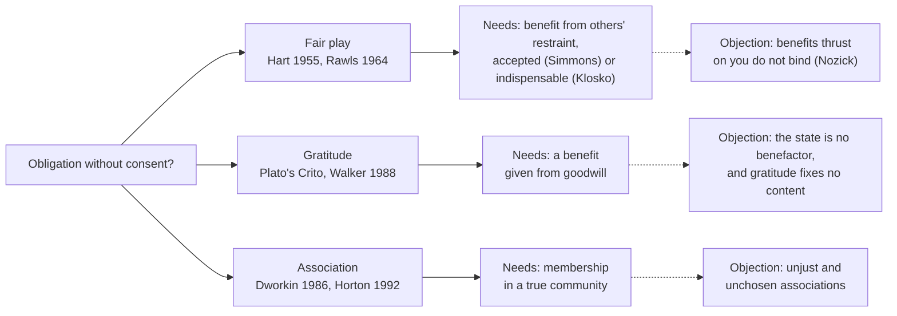

# Political Philosophy · Lesson 1.3: Fair play, gratitude and associative obligation

> ⏱ ~15 min · Module 1: Authority, legitimacy and obligation · Builds on: [1.1 The problem of political authority](01-01-the-problem-of-political-authority.md), [1.2 Consent: actual, tacit and hypothetical](01-02-consent-actual-tacit-and-hypothetical.md) · Unlocks: [1.4 Natural duty and philosophical anarchism](01-04-natural-duty-and-philosophical-anarchism.md)

## Why this matters

[1.2](01-02-consent-actual-tacit-and-hypothetical.md) found that almost no one has actually consented to the state, and that a hypothetical consent binds no one merely by being hypothetical. Yet "you can't take the benefits and refuse the burdens" persuades almost everyone. This lesson tests three grounds of [political obligation](../reference.md#political-obligation) that need no consent: **fairness** (you benefit from others' restraint), **gratitude** (you have been benefited), and **association** (you are a member). Each tries to deliver what consent could not: a duty that is general, content-independent and owed to *your own* state.

## The idea

**Fair play.** H. L. A. Hart ("Are There Any Natural Rights?", *Philosophical Review*, 1955) noticed a source of obligation that is neither promise nor natural duty. When people run a joint enterprise by rules that restrict their liberty, those who have submitted have a right to similar submission from those who benefited from their submission. Rawls named this the duty of fair play ("Legal Obligation and the Duty of Fair Play", 1964). The wrong it targets is free riding: taking the fruits of a scheme others pay for by their restraint. The free rider's *incentive* is a staple of [`public-economics` 1.2](../../public-economics/lessons/01-02-voluntary-provision-and-crowding-out.md); the [principle of fairness](../reference.md#principle-of-fairness) says the free rider also *wrongs* someone.

**Nozick's reply.** In *Anarchy, State, and Utopia* (1974, pp. 90-95) Nozick imagines that your neighbours, 364 other adults, find a public address system and set up a scheme of entertainment: each person runs it for one day of the year. After 138 days of enjoying the broadcasts, your day comes. Must you give it up? Nozick says plainly not; and if each day a different neighbour sweeps the whole street, you need not take your turn when you would rather not. The moral of the [public address objection](../reference.md#nozicks-public-address-objection): others cannot bind you merely by benefiting you and then sending the bill.

**Accepting vs receiving.** A. John Simmons (*Moral Principles and Political Obligations*, 1979) concedes Hart's principle but restricts it to benefits you [**accept**](../reference.md#accepting-and-receiving-benefits): you sought them out, or took them willingly and knowingly, aware they came from others' cooperation. Benefits you merely **receive**, like clean air or national defence, do not count. Simmons adds that most citizens think of what the state provides as bought with their taxes from an authority, not accepted from their fellow citizens' cooperation. On his view fairness binds few people to the state.

**Klosko's repair.** George Klosko (*The Principle of Fairness and Political Obligation*, 1992) answers that for some goods acceptance is beside the point. [Presumptive public goods](../reference.md#presumptive-public-goods), such as defence, law and order, and protection from environmental hazards, are needed for an acceptable life by anyone, whatever else they want. If a scheme provides such goods, its benefits are worth their cost, and the burdens are fairly shared, then everyone who receives them owes a share. You cannot decline what no one can live decently without.

**Gratitude.** The oldest version is the Laws' speech in Plato's *Crito*: the city bred and educated Socrates, so he may not destroy its laws by fleeing (the reconstruction is [`philosophical-method`](../../philosophical-method/syllabus.md)'s Module 1 boss problem). A. D. M. Walker ("Political Obligation and the Argument from Gratitude", *Philosophy & Public Affairs*, 1988) revived it. Whoever benefits from a benefactor should not act against the benefactor's interests; every citizen has benefited from the state; disobedience acts against its interests. So the [gratitude account](../reference.md#gratitude-account) yields a duty to comply.

**Association.** Ronald Dworkin (*Law's Empire*, 1986, ch. 6) and John Horton (*Political Obligation*, 1992) start from the family. You never chose your siblings, yet you owe them things because of the relationship itself. Being a member of a political community, on the [associative](../reference.md#associative-obligations) view, is a relationship of the same kind. Its obligations are part of what membership *is*. Dworkin limits this to a "true" community, one whose practices show equal concern for every member.

## The argument

**The fair-play argument (Hart, as extended to the state).**

1. **(Normative)** When people run a mutually beneficial scheme by rules that restrict their liberty, those who benefit from others' compliance owe a similar compliance to the others.
2. **(Conceptual + empirical)** A reasonably just legal order is such a scheme: citizens restrict their liberty by obeying the law, and that restraint produces security, order and the rest.
3. **(Empirical)** Each citizen benefits from it.

∴ **C.** Each citizen owes compliance with the law to fellow citizens.

*In words:* obedience is your share of a cooperative burden, and refusing it while keeping the benefits is free riding. The duty is owed to the cooperators of *this* scheme, which is why fair play answers the particularity requirement from [1.1](01-01-the-problem-of-political-authority.md) more easily than its rivals.

**Where the argument is weakest.** Premise 1, read as covering benefits merely received. Nozick and Simmons attack it there: a benefit thrust on you cannot create a debt you never took on. Klosko narrows the premise to presumptive goods and keeps it. Then the critic moves to premise 2. A modern state does far more than supply presumptive goods: it funds museums, regulates zoning, subsidizes industries. Klosko's argument binds you to contribute to defence and order. It does not by itself bind you to the law that pays for a concert hall. To cover these discretionary goods, Klosko (*Political Obligations*, 2005) adds natural duty and the common good in a **multiple principle** account. His critics say that is a concession that fairness alone cannot ground a *general* obligation.

## Map of positions

Each ground swaps consent for something else: accepted benefit, received benefit, or membership. The dashed edges are the objection each ground must survive.

**The objections to the second and third grounds, at full strength.** Against gratitude: gratitude is owed to a benefactor who acts from goodwill toward you, at some cost to itself. The state's benefits are paid for with your taxes and given from duty or policy. And even where gratitude is owed, it fixes no content: a fitting response to a benefactor is rarely "do whatever it says". As [`philosophy-of-debt` 6.4](../../philosophy-of-debt/lessons/06-04-debts-of-gratitude.md) shows with Seneca, gratitude is owed but not collectible, while the law is nothing if not collectible. Against association: Simmons asks about an association that is unjust, such as a racist family, a mafia "family" or an oppressive state. If membership alone binds, its members are bound to injustice. If only *just* associations bind, the obligation seems to come from justice, not membership. And the family analogy strains: the love, knowledge and interaction that ground family duties are absent between strangers in a state of millions. The associativist replies that Dworkin's conditions already exclude unjust communities, and that a sense of belonging to a polity is real, not a fiction.

## Worked examples

**Example 1 (clean): the quota co-op.** Invented case. The fishers of Merrow Bay form a cooperative: members cap their catch so the cod stock recovers, and in return they land at the co-op's dock and sell under its premium label. Ilse applies, joins, sells for three seasons at the premium price, then quietly lands twice her quota.

- **Hart:** a rule-governed scheme, others restrained, Ilse benefits. She owes the restraint the others show.
- **Simmons:** she *sought* the benefit and took it knowingly. This is acceptance, so fairness binds even on his strict view.
- **Nozick:** nothing was thrust on her. His objection never engages, and her application is close to consent anyway.

All three agree. Note *what* is established: an obligation owed to her fellow fishers to keep the quota rules. Nothing yet says the co-op may fine her, which is a question of [legitimacy](../reference.md#power-legitimacy-authority-obligation).

**Example 2 (hard): herd immunity.** Invented case. The town of Halden runs a voluntary measles vaccination scheme; 96 percent take part, and the resulting herd immunity protects everyone. Petra, with no medical reason, declines the shot. She cannot refuse the benefit: it reaches her whether she wants it or not.

- **Nozick and Simmons:** received, not accepted. Fairness gives Petra no obligation.
- **Klosko:** protection from epidemic disease looks like a presumptive public good, worth its small cost to anyone. So Petra owes her share.
- **Where the principle stops.** Two questions remain open. First, is herd immunity *indispensable* for an acceptable life? That turns partly on an empirical claim about the disease's severity, which philosophy cannot settle. Second, what is her "similar submission"? Fairness demands a fair share of the burden, but does not say whether that share must be the shot itself or could be an equivalent cost, such as paying for others' outreach or avoiding schools in an outbreak. Fairness grounds *some* duty here, but does not fix its content.

## Watch out

- **You might think a successful fair-play argument gives the state authority, but actually it gives, at most, an obligation.** And that obligation is owed to fellow cooperators and covers only the scheme's rules. Whether the state may *enforce* those rules, and whether it may command beyond them, are further questions ([1.1](01-01-the-problem-of-political-authority.md)'s four concepts).
- **You might think the case against Petra is a fair-play case, but actually much of its force may come from harm.** If declining the shot endangers infants who cannot be vaccinated, a natural duty not to harm ([1.4](01-04-natural-duty-and-philosophical-anarchism.md)) does the work. That holds whether or not she benefits from anyone. Keep the grounds apart.
- **You might think "citizens feel bound as members" shows associative obligation, but actually that is an empirical report.** Whether the feeling tracks a real obligation is the normative question; Horton's appeal to identity and belonging must bridge the two, not assume the bridge.

## One-liner

> Fair play binds those who accept a scheme's benefits, gratitude binds those benefited from goodwill, association binds members of a true community; each escapes consent's failure, but Nozick's unwanted benefits, the state's non-benefactor status and unjust associations show where each stops.

## Problems

**P1 (🟢) *(Exegetical (a) · Evaluative (b).)*** Invented case. Eight farms in the Orsa valley keep an irrigation channel open: each takes one week a year dredging silt. Bram buys a ninth farm at the channel's end. (i) He fits a sluice gate and draws channel water onto his fields. (ii) The channel's seepage also raises the water table under his land, which waters his orchard whether he likes it or not. (a) Classify (i) and (ii) as accepted or merely received in Simmons's sense, and say what Nozick's public address objection implies about each. Two sentences. (b) On (ii) alone, reach a verdict on whether Bram owes dredging under the principle of fairness, using either Nozick's or Klosko's view, and say where the principle stops determining a verdict. 120 words or fewer.

**P2 (🟡) *(Exegetical.)*** Diagnose. An **invented** speech by the mayor of an invented city, not the words of any real person:

> (i) "This city schooled you, healed you and lit your streets; the least you owe it is not to turn against its laws."
> (ii) "You are a Corvallan before you are anything else, and being a Corvallan means keeping faith with Corvallans."
> (iii) "Every driver who stops at a red light is giving something up so that you can cross safely. Pay it back."
> (iv) "So the council has every right to make you do whatever it decides."

For (i)-(iii), name the ground of obligation each uses and the standard objection it faces. One line each. For (iv), say what concept the mayor has slid into and why (i)-(iii) do not deliver it. Two sentences.

**P3 (🔴, optional) *(Exegetical.)*** Find the crux. Nozick holds that Petra in Halden owes nothing under fairness; Klosko holds that she owes her share. (a) Name the single premise one side affirms and the other denies. One sentence. (b) Say what consideration would move each side. Two sentences each.

Solutions

**P1** *(Exegetical (a), strict · Evaluative (b), graded on moves, not verdict)*

**Must hit, strict (a):**

- (i) is accepted: Bram takes active steps to get the benefit, knowing it comes from the others' dredging. Nozick's objection, aimed at benefits thrust on you, does not engage here, though Nozick doubts that acceptance without consent binds either.
- (ii) is merely received: it reaches him whatever he does. Nozick's objection applies: a benefit thrust on him creates no obligation.

**Must hit, any verdict (b):**

- State the view used precisely: Nozick, receipt does not bind; or Klosko, receipt binds if the good is presumptive, worth its cost, and the burdens are fairly shared.
- Run it on (ii): on Nozick, no obligation; on Klosko, it turns on whether groundwater for an orchard is a presumptive good (needed for an acceptable life) or a discretionary one.
- Where it stops: even granting an obligation, fairness does not fix Bram's share (a full week? a share in proportion to the water he gets?), or whether money could substitute for labour.

**Wrong turns:** treating (i) and (ii) as alike because both benefit Bram; that erases the accepting/receiving distinction the whole dispute turns on. Calling groundwater for an orchard obviously presumptive: it is a commercial benefit, not obviously a condition of an acceptable life.

**Model answer (b), one of several:** On Klosko's view, Bram owes a share for (ii) only if the seepage is a presumptive good. It is not: watering an orchard is a commercial benefit, and someone could live acceptably without it. So for (ii) alone Klosko, like Nozick, finds no fairness obligation, though for different reasons. The principle stops at the threshold question. If the seepage were his only water supply, it might count as indispensable, and Klosko's verdict would flip. Even then fairness would not say whether his share is a full dredging week or a share scaled to the water he gets.

---

**P2** *(Exegetical, strict)*

**Must hit, strict:**

- (i) **Gratitude** (the *Crito* / Walker form: not acting against a benefactor's interests). Objection: the state is not a benefactor acting from goodwill, and gratitude does not fix obedience as its content.
- (ii) **Association**: obligation as part of membership and identity (Dworkin, Horton). Objection: unjust associations would bind too, and membership was not chosen (Simmons).
- (iii) **Fair play**: others restrict their liberty in a rule-governed scheme you benefit from (Hart). Objection: Nozick's public address case, since benefits thrust on you do not bind unless accepted.
- (iv) slides from obligation (a duty to comply with fellow citizens' scheme) to authority and legitimacy: a right of the council to command and compel, with no limit on content. Even if (i)-(iii) succeeded, they would ground a duty owed to fellow citizens or benefactors. Fair play would cover only the scheme's rules, and gratitude no fixed content at all, so none yields a right to command "whatever it decides".

**Wrong turns:** filing (iii) under gratitude because it says "pay it back"; the mark of fair play is the others' *restraint* in a shared scheme, not a gift. Reading (iv) as a mere overstatement of obligation; the change is in *who holds the right*, from a duty in the citizen to a power in the council.

**Model answer:** (i) Gratitude; the state is not a goodwill benefactor and gratitude does not fix obedience. (ii) Association; unjust or unchosen associations would bind too. (iii) Fair play; Nozick's point that benefits thrust on you do not bind. (iv) moves from political obligation to authority and legitimacy, the council's right to command and enforce. The three grounds at most give citizens a duty owed to each other or to benefactors, and fair play covers only the scheme's own rules, so none yields an unlimited right to command.

---

**P3** *(Exegetical, strict)*

**Must hit, strict (a):**

- The crux: whether an obligation of fairness can arise from a benefit that was received but not voluntarily accepted, when the good is indispensable and its cost reasonable. Nozick denies it; Klosko affirms it.

**Must hit, strict (b):**

- Moving Nozick: cases where intuition says unaccepted indispensable benefits do bind (a resident of a town whose water is purified by a shared scheme), pressing that his public address case works only because entertainment is dispensable.
- Moving Klosko: cases where a good is indispensable yet the non-accepter still seems free of obligation (a scheme others imposed without asking, at a cost the receiver would not have chosen), or evidence that "indispensable" cannot be fixed without importing contested judgments of the good.

**Wrong turns:** naming "whether Petra benefits": both agree she does. Naming harm to others: that is a different ground, which neither side's fair-play claim relies on.

**Model answer:** (a) Nozick denies, and Klosko affirms, that a benefit received without being accepted can ground an obligation of fairness when the good is indispensable and worth its cost. (b) Nozick would be moved by showing that his public address case trades on the good being dispensable, for instance a case of water purification where nearly everyone judges the non-payer bound. Klosko would be moved by a case where an indispensable good is thrust on someone who still seems free, or by showing that "indispensable" cannot be fixed without a contested view of the good life.

## Flashback

**From Lesson [1.1](01-01-the-problem-of-political-authority.md) (The problem of political authority):** *(Exegetical (a)-(b).)* Apply to a new case. Invented case. The island council of Skarra, a decent elected body, issues two directives: (i) no one may set fire to another person's boat shed; (ii) every fishing boat must show its registration number on the port side of the bow (the starboard side would serve the harbour patrol equally well). (a) For which directive would a content-independent political obligation make a difference to what a Skarran fisher has reason to do, and why is it idle for the other? Two sentences. (b) Nell, a fisher from a neighbouring island who works Skarra's waters each summer, asks whether she is politically obligated to obey (ii). Which defining feature of political obligation does her question raise, and could Raz's normal justification thesis still give (ii) authority over her? Three sentences.

Solution

**Must hit, strict (a):**

- (ii) is where obligation would matter: port rather than starboard has no merit of its own, so the reason to choose port comes from the fact of the directive.
- (i) is idle: everyone had decisive reason not to burn a neighbour's shed before any directive existed, so obeying it adds nothing.

**Must hit, strict (b):**

- Particularity: political obligation is a duty owed to *your own* state, and Skarra is not Nell's, so whatever binds her is not political obligation in the course's sense.
- Raz's thesis is person- and domain-relative, not tied to membership: if Nell would better conform to reasons that already apply to her (being identifiable to the patrol, fitting the harbour's uniform scheme) by following (ii) than by deciding for herself, (ii) has authority over her.
- So Raz can grant her a content-independent reason while the particular, citizen's duty does not apply.

**Wrong turns:** picking (i) in (a) because burning sheds is the more serious matter (seriousness is about content; the test is where the directive itself supplies the reason); answering (b) with "she is in Skarra's waters, so she has consented", which changes the subject to 1.2's ground and skips the question of particularity.

**Model answer:** (a) Directive (ii): port and starboard are equally good, so a Skarran's only reason to choose port is that the council said so, whereas for (i) she already had decisive reason not to burn anyone's shed. (b) Nell's question raises particularity: political obligation is owed to one's own state, and Skarra is not hers. Raz's thesis does not depend on membership, though: if following (ii) would help her conform better to reasons she already has, such as being identifiable to the harbour patrol, then (ii) has authority over her in that domain. She can be subject to Skarra's authority on boat markings without owing Skarra a citizen's general duty.

## Connections

- **Backward:** [1.1](01-01-the-problem-of-political-authority.md) set the four concepts this lesson keeps apart; fair play, gratitude and association are all candidates for *obligation*, not authority. [1.2](01-02-consent-actual-tacit-and-hypothetical.md)'s failure of consent is what makes grounds without consent worth trying.
- **Forward:** [1.4](01-04-natural-duty-and-philosophical-anarchism.md) drops benefit and membership altogether for a natural duty of justice, which faces the particularity problem that fair play escapes. Rawls himself moved that way: in *A Theory of Justice* (1971) fairness binds only those who voluntarily accept benefits, and citizens generally are bound by natural duty.
- **Sideways:** the free rider's incentive is modelled in [`public-economics` 1.2](../../public-economics/lessons/01-02-voluntary-provision-and-crowding-out.md), and Kant's objection to free riding is in [`ethics` 2.2](../../ethics/lessons/02-02-the-formula-of-universal-law.md). Gratitude as owed but not collectible is [`philosophy-of-debt` 6.4](../../philosophy-of-debt/lessons/06-04-debts-of-gratitude.md), which ran Nozick's objection against a debt to the country that trained you.
