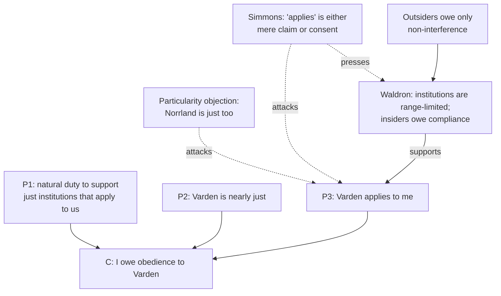

# Political Philosophy · Lesson 1.4: Natural duty and philosophical anarchism

> ⏱ ~15 min · Module 1: Authority, legitimacy and obligation · Builds on: [1.2 Consent](01-02-consent-actual-tacit-and-hypothetical.md), [1.3 Fair play, gratitude and associative obligation](01-03-fair-play-gratitude-and-associative-obligation.md) · Unlocks: [2.1 Utilitarianism as a principle for institutions](02-01-utilitarianism-as-a-principle-for-institutions.md)

## Why this matters

Consent and fair play ground [political obligation](../reference.md#political-obligation) in something *you did*: agreed, accepted a benefit. Both ran out of coverage, because most people never did the thing. The natural-duty theory cuts the knot: you owe support to just institutions simply because they are just, as you owe a drowning stranger help without having promised anything. That fixes coverage and creates a new problem: why *your* state? If that problem cannot be solved, we reach philosophical anarchism, a view far less wild than its name, and the test case that separates it from its rivals is civil disobedience.

## The idea

A **natural duty** is owed by everyone to everyone, whatever they have done: not to harm, to help when the cost is small. Rawls (*A Theory of Justice*, 1971, §19) adds the [natural duty of justice](../reference.md#natural-duty-of-justice): to support and comply with just institutions that exist and apply to us, and to help bring about just arrangements not yet established when that costs us little. Rawls thinks fair play binds only those who voluntarily take up special advantages, such as office; citizens generally are bound by the natural duty instead.

**The particularity requirement.** A. John Simmons (*Moral Principles and Political Obligations*, 1979) set the test every theory must pass: an account of political obligation must bind me to *one particular* state, my own, not to justice in general. Consent passes easily (I agreed to *this* one) and fails on coverage. Natural duty is the mirror image. Justice is not located anywhere. If Norrland's institutions are as just as Varden's, the bare duty to support just institutions gives a Vardener as much reason to support Norrland's. Everything rides on the clause "that apply to us", and the [particularity problem](../reference.md#particularity-problem) asks what makes an institution apply to me.

**Waldron's answer** ("Special Ties and Natural Duties", *Philosophy and Public Affairs*, 1993). Institutions of justice are by nature limited in range: a court, a land registry or a tax code works only by settling matters for a definite population and territory, because justice needs one authoritative settlement where people cannot avoid interacting. You are an *insider* to the institutions whose range includes you, an *outsider* to the rest. Outsiders owe a just institution only the duty not to undermine it; insiders owe compliance and support. Particularity comes from range, not from any act of yours.

**Raz's piecemeal alternative.** Joseph Raz (*The Authority of Law*, 1979; *The Morality of Freedom*, 1986) holds, on his [service conception](../reference.md#service-conception-of-authority), that a directive has authority over you when you would better conform to the reasons that already apply to you by following it than by acting on your own judgment. That varies by person and domain: the traffic code binds nearly everyone, while a pharmacologist may owe no deference to a drug-safety rule she understands better than its drafters. The upshot is real authority, but no *general* obligation to obey.

**Philosophical anarchism.** Robert Paul Wolff (*In Defense of Anarchism*, 1970) argued *a priori*: authority means a right to be obeyed because one commands, autonomy means acting only on one's own judgment, and since autonomy is our primary duty, no state could have authority, except under unanimous direct democracy. Simmons argues *a posteriori*: legitimate authority is possible in principle (unanimous genuine consent would supply it), but no actual state has been shown to have it, because every account so far fails. Neither is a call to resist. The [philosophical anarchist](../reference.md#philosophical-anarchism) still has strong moral reasons to keep most laws, since most laws forbid what is wrong anyway or coordinate in ways that protect people. What she denies is a *content-independent* duty: one that holds because the law says so.

## The argument

1. **(Normative)** Everyone has a natural duty to support and comply with just institutions that apply to them.
2. **(Empirical/normative)** Varden's institutions are just, or nearly just.
3. **(Conceptual)** Varden's institutions apply to me, and Norrland's do not, because I fall within Varden's range.

∴ **C.** I have a duty to support and comply with Varden's institutions: a political obligation to Varden in particular.

*In words:* the duty is universal; its object is fixed by which just scheme you live under.

**What it delivers, and what it does not.** The conclusion is an obligation, and it inherits P2's limits. Rawls holds that in a nearly just society we must comply even with some unjust laws, within limits, because no workable procedure produces only just outcomes. Where institutions are seriously unjust, P1 binds no one to them. So the theory yields a conditional obligation, and it leaves room for principled lawbreaking.

**Where the argument is weakest.** P3. Simmons replies that "applies to me" is either thin or borrowed. If it means only that an institution *claims* jurisdiction over where I live, any just body could bind me by announcing that it covers me, and claiming would make it so. If it means I accepted its jurisdiction, the theory has fallen back on consent. Waldron's defender answers that range is neither: it is fixed by the moral need for a single settlement among people who cannot avoid one another, a need the institution did not create by asserting it. The dispute is over whether that need picks out one institution, or only shows that *some* institution must exist.

## The argument map

The universal premise does the binding; the contested premise P3 does the picking-out. Every attack and defence in the literature lands on P3.

## Worked examples

**Example 1 (clean): Varden or Norrland?** Invented case. Ilse lives in Varden, whose institutions are reasonably just. Across the border, Norrland's are equally just and its public health service is better run. Ilse has 1,000 dollars she will give to one treasury or the other.

- *Bare natural duty (P1 without the range clause):* both schemes are just; if anything, Norrland converts money into justice more efficiently. Nothing makes Varden special. This is the particularity problem in miniature.
- *Waldron:* Ilse is an insider to Varden and an outsider to Norrland. She owes Norrland non-interference, Varden compliance. Her gift to Norrland would be generous, but her Varden taxes are owed.
- *What the case shows:* the voluntary gift is not where the theories diverge. They diverge over whether Ilse's Varden tax bill is owed because Varden is *hers*, which only P3 can explain.

**Example 2 (hard): civil disobedience.** Rawls defines [civil disobedience](../reference.md#civil-disobedience) (§55) as a public, nonviolent, conscientious yet political act contrary to law, usually aimed at changing a law or policy, which addresses the majority's sense of justice and stays within fidelity to law, shown by openness and willingness to accept the penalty. He separates **conscientious refusal** (§56): noncompliance with a direct legal order on grounds of conscience, which need not appeal to the majority or seek any change. Invented case: Varden bars resident non-citizens from forming trade unions. Arvo, an organizer, announces a sit-in at the Labour Ministry, holds it peacefully, and waits for arrest.

- *Natural-duty theorist (Rawls):* the act meets the definition. It is justified if the injustice is clear and substantial (freedom of association is an equal basic liberty), ordinary political appeals have been tried and failed, and the act does not threaten the order of a nearly just scheme. Fidelity to law matters *morally*: Arvo still owes the natural duty to the scheme as a whole and breaks one law in a way that affirms it.
- *Philosophical anarchist (Simmons):* there was no general duty to obey, so the lawbreaking as such needs no special justification. What needs justifying is the act's content: whom it burdens, what it risks. Accepting arrest is good tactics and good communication, not a moral requirement.
- *Natural law (Aquinas, ST I-II q.96 a.4; see [HPT 2.3](../../history-of-political-thought/lessons/02-03-aquinas-on-law.md)):* a law contrary to the common good does not bind in conscience, though one may keep it to avoid scandal or disturbance. King's "Letter from Birmingham Jail" (1963) drew on this tradition while insisting, as Rawls later would, on open disobedience and acceptance of the penalty.
- *Where the verdicts split:* change the case. Arvo instead wipes the union-registry database at night, unannounced. On Rawls's definition this is not civil disobedience, and the natural-duty theorist condemns it as a breach of duty to a nearly just scheme. The anarchist cannot condemn it *for being illegal*; she judges it by the harm to the clerks and the people whose records are lost. Both may condemn it, for different reasons.

**The payoff.** Suppose no account succeeds. Simmons's distinction between [justification and legitimacy](../reference.md#justification-and-legitimacy) shows what survives. A state can be *justified* (morally good to have, permissibly existing, even permissibly enforcing laws against murder) without being *legitimate* over you in the sense of holding a right to impose duties on you by directive. "No general obligation" is a claim about one of the four things from [1.1](01-01-the-problem-of-political-authority.md), not all of them.

## Watch out

- **You might think philosophical anarchism says the state should be resisted, but actually it denies only a general, content-independent obligation.** It is compatible with obeying almost every law for the law's own moral reasons, and with no duty to resist at all. Power, [legitimacy, authority and obligation](../reference.md#power-legitimacy-authority-obligation) come apart, and the anarchist denies the last.
- **You might think natural duty solves particularity because "apply to us" is written into the duty, but actually writing the clause in is not explaining it.** The work is done by an account of application, Waldron's range or something else, and that account is what critics attack.
- **You might think any principled lawbreaking is civil disobedience, but actually Rawls's definition excludes covert, violent and purely personal refusals.** And meeting the definition is not the same as being justified: that takes his further conditions.

## One-liner

> The natural duty of justice binds everyone without consent but struggles to bind you to *your* state; if nothing does, philosophical anarchism follows, and it denies only a general duty to obey, not the state's justification, not your reasons to keep most laws.

## Problems

**P1 (🟢) *(Exegetical (a)-(b).)*** Invented case. Varden requires adult men to do two weeks of annual reserve training. Joss, a pacifist, tells his commanding officer in writing that he will not report, explains that his conscience forbids it, says he does not seek any change in the law and only asks to be left alone, and accepts the fine. (a) Is this civil disobedience on Rawls's definition? Name the features that decide it, and say what Rawls would call it instead. Three sentences. (b) Describe the smallest change to Joss's act that would make it civil disobedience, and name the features your change adds. Two sentences.

**P2 (🟡) *(Exegetical (a)-(c).)*** Diagnose. An **invented** column from the *Varden Courier*, not the words of any real person:

> (i) "Every theory of political obligation has failed: consent is a fiction, fair play proves too much, and natural duty cannot say why I owe Varden rather than Norrland."
> (ii) "So I have no duty to keep to the speed limit on Route 9."
> (iii) "And a state that cannot show I owe it obedience has no right to fine me when I speed."
> (iv) "Two drivers in three speed on Route 9 anyway, which proves nobody really believes in this duty."

(a) Which sentence slides from a claim about obligation to a claim about something else, and which distinction does the slide ignore? What extra premise would it need? Three sentences. (b) Does (ii) follow from (i), as a philosophical anarchist like Simmons would understand it? Two sentences. (c) What kind of claim is (iv), and what is wrong with the inference it draws? One sentence.

**P3 (🔴, optional) *(Evaluative.)*** Counterexample. Build an invented case in which the natural duty of justice, read with Waldron's range clause, gives a verdict about *whom* a person owes support that seems wrong; then say in 150 words or fewer whether Waldron's defender can answer it. Any verdict passes.

Solutions

**P1** *(Exegetical (a)-(b), strict)*

**Must hit, strict (a):**

- Not civil disobedience: it is not a political act addressed to the majority's sense of justice, and it does not aim at changing the law. Joss asks only to be left alone.
- It is open, nonviolent, conscientious, and accepts the penalty, so it fails on the political, change-seeking element, not on publicity or fidelity.
- Rawls calls it **conscientious refusal**: noncompliance with a direct legal order on grounds of conscience.

**Must hit, strict (b):**

- The change must make the act address the public and aim at changing the law or policy, e.g. refusing in a public statement that calls on parliament to end compulsory training (or on all reservists to refuse), while staying nonviolent and accepting the penalty.
- Features added: a political justification addressed to the majority's sense of justice, and the aim of changing law or policy.

**Wrong turns:** saying it fails because it is private (he told his commander openly and accepted the fine, so it is not covert); counting acceptance of the penalty as enough to make it civil disobedience; adding violence or secrecy in (b), which moves the act further from the definition.

**Model answer:** (a) No. Joss's refusal is open, peaceful and accepts the penalty, but it is not addressed to the public's sense of justice and seeks no change in the law, only his own non-participation. Rawls would call it conscientious refusal. (b) Joss announces his refusal publicly, argues that compulsory training violates equal liberty of conscience, and calls for its repeal, still reporting for his fine. That adds the appeal to the majority's sense of justice and the aim of changing the law.

---

**P2** *(Exegetical (a)-(c), strict)*

**Must hit, strict (a):**

- Sentence (iii). It moves from "no obligation to obey" to "no right to coerce", i.e. from political obligation to the state's justification in enforcing.
- The ignored distinction: obligation vs justification/permission to enforce (Simmons's justification vs legitimacy). A state can be permitted to enforce a rule nobody is obliged to obey *because* the state says so.
- Missing premise: a state may permissibly coerce only those who have a duty to obey it. That premise is contestable: we may restrain an assailant who never agreed to anything.

**Must hit, strict (b):**

- No. Philosophical anarchism denies a general, content-independent duty, not all reasons to comply.
- The speed limit coordinates traffic and protects others, so the columnist may still have strong moral reason to keep to it, just not *because* Varden commands it.

**Must hit, strict (c):**

- (iv) is an empirical claim about behaviour; it cannot settle a normative claim about what anyone owes (and people may believe in a duty they break).

**Wrong turns:** picking (ii) as the slide in (a) (it stays within obligation; its fault is different, and that is what (b) tests); saying (iii) is fine because "anarchists reject the state", which reads philosophical anarchism as political anarchism; calling (iv) conceptual.

**Model answer:** (a) Sentence (iii) slides from "I have no duty to obey" to "the state may not fine me", conflating political obligation with the state's justification in enforcing. It needs the premise that the state may coerce only those obliged to obey it, which is false of restraining an assailant. (b) No: Simmons denies only a duty to obey because the law commands, and the speed limit protects other drivers, which gives the columnist content-based reasons to keep it. (c) Sentence (iv) is empirical, and how many people break a rule tells us nothing about whether they are bound by it.

---

**P3** *(Evaluative, graded on moves, not verdict)*

**Accept:** any invented case where the range clause assigns a person's duty of support to one institution while morally relevant facts (her actual ties, her dependence, where justice is advanced) point elsewhere, or where range seems fixed only by the institution's own claim; plus a reply that engages Waldron's need-for-a-single-settlement rationale.

**Must hit, any verdict:**

- State the range-limited natural duty precisely: insiders owe compliance and support; outsiders owe only non-interference.
- A case whose verdict on *whom* one owes is the target, not one where the institution is unjust (that attacks P2, not particularity).
- Name the premise attacked (P3: what makes an institution apply to someone) and run Waldron's best reply, that range tracks the need for one authoritative settlement among people who cannot avoid each other.
- Say whether the case generalizes or depends on an unusual feature.

**Wrong turns:** a case where the person consented to the foreign state, which changes the ground of obligation instead of testing natural duty; concluding that because the case strains Waldron, natural duty yields no obligations at all.

**Model answer, one of several:** Invented case. Hela lives in a border valley annexed by Varden after a fair referendum she voted against. Her family, work and courts have always been Norrland's across a footbridge; Varden's offices are a day's drive away. Waldron's clause makes her an insider to Varden and an outsider to Norrland, so she owes Varden compliance and Norrland only non-interference. That seems wrong about where her duty of support lies. The attack is on P3: range seems to follow a border Varden drew. Waldron's defender replies that the valley needs one settler of property and disputes, and the referendum fixed which; that her ties run elsewhere is a reason to change the border, not to treat herself as an outsider while it stands. Whether that answers the case depends on whether a single settlement must coincide with the state's border rather than with a community of interaction. The case generalizes to every border region.

## Flashback

**From Lesson [1.2](01-02-consent-actual-tacit-and-hypothetical.md) (Consent: actual, tacit and hypothetical):** *(Exegetical (a) · Evaluative (b).)* Invented case. The island state of Tarn makes two reforms. Reform 1: every school teaches, and every adult is reminded by letter each year, that whoever stays resident after turning 21 thereby consents to Tarn's authority. Reform 2: any adult who leaves gets a relocation grant covering a year's living costs, and a neighbouring federation guarantees residence and work permits to anyone who leaves Tarn. (a) Hume has two objections to residence as consent: the conceptual one (people do not take themselves to be choosing) and the ship (leaving costs too much). Say which objection each reform targets. One sentence each. (b) After both reforms, Nell, 30, stays in Tarn only because her father, who cannot move, depends on her daily care. Using Simmons's conditions, say whether her residence counts as consent. Then say what follows about her obligation, and about whether Tarn may coerce her. 100 words or fewer. Any verdict passes.

Solution

**Must hit, strict (a):**

- Reform 1 targets the conceptual objection. That objection rests on an empirical premise: people believe they owe allegiance by birth. Reform 1 changes that belief, so staying can be understood as a choice. It also supplies Simmons's condition (i), awareness that consent is being asked for.
- Reform 2 targets the ship. It lowers the cost of exit, which is the ship's empirical premise.

**Must hit, any verdict (b):**

- Locate the dispute at condition (v): the consequences of dissent, here leaving, must not be extremely detrimental. After the reforms, (i)-(iv) are plausibly met.
- Give a verdict with a reason. *No consent:* for Nell, leaving means abandoning a dependent father. That cost is extreme, and the grant does nothing to reduce it, so (v) fails for her. *Consent:* (v) concerns penalties the consent-seeker attaches to dissent. Nell's cost comes from her own circumstances, not from Tarn, so her staying is a real choice. Saying that the condition does not settle which reading is right is the depth point.
- Keep obligation and legitimacy apart. Consent would give Nell a consent-based obligation, and without it she lacks one. Either way, whether Tarn may tax or arrest her is a further question, which other grounds might answer (1.2's consent-day example).

**Wrong turns:** assigning Reform 1 to the ship. Treating the grant as answering Nell's case, when it lowers only the financial cost. Concluding that if Nell has not consented, Tarn may not coerce her: that slides from obligation to legitimacy.

**Model answer, one of several:** (a) Reform 1 answers the conceptual objection: once everyone is taught that staying is consent, staying can be a choice. Reform 2 answers the ship by making exit cheap. (b) Conditions (i)-(iv) now hold, so everything turns on (v). For Nell, leaving means abandoning her father. The grant cannot offset that cost, and it is extreme, so on the natural reading her residence is not consent and she has no consent-based obligation. A defender may reply that (v) concerns only costs Tarn attaches to dissent. Either way, whether Tarn may coerce her is a question about legitimacy, which consent does not settle.

## Connections

- **Backward:** [1.2](01-02-consent-actual-tacit-and-hypothetical.md) and [1.3](01-03-fair-play-gratitude-and-associative-obligation.md) grounded obligation in what you did; natural duty grounds it in what you are owed and owe as a person, and trades their coverage problem for particularity. The four-way vocabulary of [1.1](01-01-the-problem-of-political-authority.md) is what makes philosophical anarchism precise. [`ethics` 5.2](../../ethics/lessons/05-02-contractualism-what-no-one-could-reasonably-reject.md) grounds duties owed to each person, such as a duty of rescue, with no prior act of the person bound: the shape of a natural duty.
- **Forward:** the natural duty only binds if institutions are just, so Module 2 asks what justice in the [basic structure](../reference.md#basic-structure) requires, starting with [2.1](02-01-utilitarianism-as-a-principle-for-institutions.md); Rawls's own answer is [2.2](02-02-rawls-the-original-position.md)-[2.3](02-03-rawls-the-two-principles-and-maximin.md). Exemptions for conscientious objectors return in [6.3](06-03-conscience-and-exemptions.md). [`philosophy-of-law`](../../philosophy-of-law/syllabus.md) takes the question to law as law: content-independent reasons, and how a legal system should respond to civil disobedience.
- **Sideways:** Aquinas's q.96 a.4, on when human laws bind in conscience, belongs to the treatise on law set out in [`history-of-political-thought` 2.3](../../history-of-political-thought/lessons/02-03-aquinas-on-law.md). [`philosophical-method` 3.4](../../philosophical-method/lessons/03-04-intuitions-and-reflective-equilibrium.md) shows philosophical anarchism as a bullet bitten openly against the intuition that the assault law binds.
