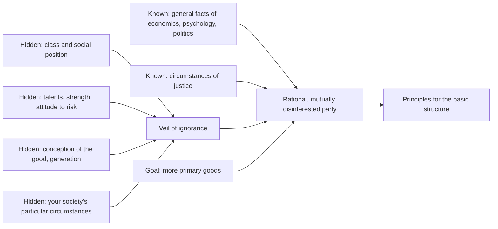

# Political Philosophy · Lesson 2.2: Rawls I: the original position

> ⏱ ~15 min · Module 2: Justice and distribution · Builds on: [2.1 Utilitarianism as a principle for institutions](02-01-utilitarianism-as-a-principle-for-institutions.md), [1.2 Consent: actual, tacit and hypothetical](01-02-consent-actual-tacit-and-hypothetical.md) · Unlocks: [2.3 Rawls II: the two principles and maximin](02-03-rawls-the-two-principles-and-maximin.md)

## Why this matters

[2.1](02-01-utilitarianism-as-a-principle-for-institutions.md) judged the [basic structure](../reference.md#basic-structure) (property, markets, taxes, the family, the constitution) by the welfare it produces. John Rawls's *A Theory of Justice* (1971) offers the main rival: judge it by whether its principles are ones free and equal people could agree to on fair terms. The device he built to model "fair terms", the original position behind a veil of ignorance, is the most borrowed thought experiment in political philosophy. This lesson takes the device apart before [2.3](02-03-rawls-the-two-principles-and-maximin.md) runs it, so you can see which of its features does which job.

## The idea

Two children must split a cake. The old rule: one cuts, the other chooses. The cutter cannot know which slice she will get, so her self-interest makes her cut fairly. Nobody had to make her generous. The ignorance did the moral work.

Rawls generalizes the trick. To choose principles for a whole society, imagine choosers who do not know who they will be in it: rich or poor, gifted or not, believer or unbeliever. Whatever they pick cannot be tilted toward their own case, because they have no case. Rawls calls the resulting theory **justice as fairness**. The name does not mean justice *is* fairness. It means the principles are those agreed in an initial situation that is fair, so their justice is inherited from the fairness of the procedure.

Five design choices, each with a job:

- **The [veil of ignorance](../reference.md#veil-of-ignorance)** (TJ §24). Hidden: your social position and class, your natural talents and strength, your conception of the good (your religion, your idea of a worthwhile life), the special features of your psychology such as your attitude to risk, the particular circumstances of your society (its economy, its level of development), and which generation you belong to. Known: the general facts of economics, psychology and political sociology, and that your society faces the circumstances of justice. *Job:* strip out every fact you could use to tailor principles to yourself, while leaving the choice informed.
- **[Primary goods](../reference.md#primary-goods)** (TJ §15). Since the parties do not know their aims, they reason about things any rational person wants whatever else she wants: basic rights and liberties; freedom of movement and choice of occupation; the powers of offices and positions; income and wealth; the social bases of self-respect. *Job:* a currency for comparing prospects without knowing anyone's conception of the good. (Whether it is the right currency is [2.5](02-05-equality-of-what.md).)
- **Mutual disinterest.** The parties take no interest in one another's interests, and they are not envious. This is not a claim that people are selfish. *Job:* keep strong moral motives out of the parties, so that the fairness comes from the constraints and is not smuggled in through their psychology. Mutual disinterest plus the veil does what benevolence would do, without assuming it.
- **The [circumstances of justice](../reference.md#circumstances-of-justice)** (TJ §22, borrowed from Hume): moderate scarcity and limited altruism. *Job:* say when justice is needed at all.
- **Representation.** In *Political Liberalism* (1993), Rawls calls the original position a "device of representation". Nobody was ever in it. It models conditions we already accept, on reflection, as fair conditions for choosing principles.

One consequence is easy to miss. Behind the veil every party is identically situated and reasons from the same information, so there is nothing to bargain over. The choice of all reduces to the choice of any one of them.

## Source

Rawls's §22 credits his account of when justice is needed to this passage. Hume, *A Treatise of Human Nature* (1739-40), Book III, Part II, Section 2, "Of the Origin of Justice and Property":

> "I have already observed, that justice takes its rise from human conventions; and that these are intended as a remedy to some inconveniences, which proceed from the concurrence of certain qualities of the human mind with the situation of external objects. The qualities of the mind are selfishness and limited generosity: And the situation of external objects is their easy change, joined to their scarcity in comparison of the wants and desires of men. … Encrease to a sufficient degree the benevolence of men, or the bounty of nature, and you render justice useless, by supplying its place with much nobler virtues, and more valuable blessings."

Read it as a conditional. Justice answers a problem with two ingredients: limited generosity and scarcity. Remove either and the problem goes away, and justice with it. Rawls keeps the structure and softens it to *moderate* scarcity: there must be enough to make cooperation worthwhile, but not so much that conflicting claims vanish. Notice what Hume does *not* say. He explains why justice exists. Rawls uses the same conditions to set up a choice of principles, which is a further step.

## The argument

**Rawls's route from the original position to principles**, reconstructed.

1. **(Normative)** Principles for the basic structure are justified if they would be chosen in a situation that is fair between persons regarded as free and equal. *In words:* a fair procedure confers justice on its outcome, a case of what Rawls calls pure procedural justice.
2. **(Normative)** A choice situation is fair only if no one can shape the principles using facts that are arbitrary from a moral point of view: social position, natural talents, bargaining strength, or a particular conception of the good. *In words:* your luck in the social and natural lottery should not buy you better terms.
3. **(Stipulation)** The veil hides exactly those facts, and leaves the parties general knowledge of how societies work.
4. **(Stipulation)** The parties are rational, mutually disinterested, and want more primary goods rather than fewer.
5. **(Conceptual)** Since the parties are identically situated, any principle one of them would rationally choose, all would choose.

∴ **C.** The principles a single rational party would choose in the original position are the principles of justice for the basic structure.

The conclusion is a schema; which principles fill it is [2.3](02-03-rawls-the-two-principles-and-maximin.md)'s work. Premise 2 is also where Rawls's claim that no one deserves his natural endowments enters, the root of the luck-egalitarian line in [`philosophy-of-economics` 5.4](../../philosophy-of-economics/lessons/05-04-markets-and-desert.md). [2.3](02-03-rawls-the-two-principles-and-maximin.md) gives it its full argument.

**Three neighbours, to place the device.**

- **Hobbesian contractarianism** ([`ethics` 5.1](../../ethics/lessons/05-01-contractarianism-morality-as-mutual-advantage.md)) also derives principles from self-interested agreement, but its parties know their strength and bargain from it, so the weak get little. Rawls's veil removes threat advantage; the contractarian replies that only an agreement rooted in each person's actual interests answers the sceptic who asks why he should comply.
- **Scanlonian contractualism** ([`ethics` 5.2](../../ethics/lessons/05-02-contractualism-what-no-one-could-reasonably-reject.md)) keeps the parties fully informed and asks what no one could reasonably reject. Rawls gets impartiality from ignorance, Scanlon from reasonableness. Both refuse to let power count.
- **Utilitarianism.** The separateness-of-persons objection ([`ethics` 1.3](../../ethics/lessons/01-03-justice-and-the-separateness-of-persons.md)) says utilitarianism treats society as one big person. The original position is built so that each party knows she has one life only. Why the parties would not simply maximize average utility is [2.3](02-03-rawls-the-two-principles-and-maximin.md) and [`decision-theory` 3.4](../../decision-theory/lessons/03-04-choosing-behind-the-veil-rawls-vs-harsanyi.md).

**Where the argument is weakest.** Premises 1 and 2 together, attacked from two sides. Dworkin argued that a [hypothetical](../reference.md#hypothetical-consent) agreement binds no one; that objection is set out in [1.2](01-02-consent-actual-tacit-and-hypothetical.md). If the device has force, the critic says, it comes entirely from premise 2, so the contract is idle. Rawls largely accepts this. The original position is a device of justification that makes vivid what we already think, and its description is itself adjusted until it fits our considered judgments, by [reflective equilibrium](../../philosophical-method/lessons/03-04-intuitions-and-reflective-equilibrium.md). The second attack follows: if the conditions are tuned to deliver the judgments, the critic asks what independent support premise 2 has. Communitarians press a third worry: that the self behind the veil, stripped of its ends, is no one we could be (Sandel, taken up in [4.3](04-03-perfectionism-and-the-common-good.md)).

## What the veil does

*What the parties cannot see on the left; what they can see and want feeds the single party who chooses for everyone.*

## Worked examples

**Example 1 (clean): hiring for the civil service.** The invented Republic of Varden must fix one rule for filling civil-service posts. Three candidates: (H) posts pass to officials' children; (E) open competitive examination; (L) a lottery among all applicants. Without the veil, each party's vote is predictable: an official's child wants H, a talented applicant wants E, an untalented one wants L. Each vote reports a fact about the voter.

Behind the veil those facts are gone. A party cannot argue from "I am an official's child" or "I test well". What she can use is general knowledge: that competent officials make everyone's rights and services more secure, that closed hereditary offices breed resentment and instability, and that she might be anyone. H is hard to defend from there: it stakes everything on being born into the right family. The veil does not finish the job, since E and L still compete and E rewards talent the veil says you might lack. That residue is fair equality of opportunity, which [2.3](02-03-rawls-the-two-principles-and-maximin.md) takes up. The lesson here is what the veil filters out: every argument whose force depends on who is making it.

**Example 2 (hard): why hide the conception of the good?** Varden's majority faith wants its holy days enforced as public law and dissenting worship restricted. A party who knew she held the majority faith might accept that rule. Behind the veil she does not know whether she is in the majority, a minority, or holds no faith. And her religious obligations, if she has them, are not things she can trade for more income. So she cannot gamble her liberty of conscience on turning out to belong to the dominant faith. The veil yields equal liberty of conscience.

Now the strain. A believer may object that hiding the conception of the good is not neutral: it treats her faith as one preference among others, so the device has decided before she arrives that truth about the good gives no public claim. Rawls's reply is that the veil does not deny her faith is true. It models the fact that citizens reasonably disagree, and that no one may use state power to impose a view others reasonably reject ([4.1](04-01-political-liberalism.md)). A further position reaches the same verdict from the other direction. Catholic teaching in *Dignitatis humanae* (1965) grounds religious freedom in the dignity of the person and the nature of faith as a free act, without any veil (one position, cited to [`catholic-social-teaching`](../../catholic-social-teaching/syllabus.md)). The two agree on the verdict and disagree about why, and so may diverge on harder cases.

## Watch out

- **You might think the original position shows we consented to the state, so we owe it obedience, but actually it justifies principles, not a duty to obey.** It says which basic structure would be just. Whether a state meeting those principles has [legitimacy](../reference.md#legitimacy), authority, or a claim on your [political obligation](../reference.md#political-obligation) is a further step: Rawls's own bridge is the natural duty of justice ([1.4](01-04-natural-duty-and-philosophical-anarchism.md)).
- **You might think mutual disinterest says people are selfish, but actually it is a modelling assumption, not an empirical claim about human nature.** The parties are disinterested so that the fairness sits in the veil, where you can inspect it.
- **You might think the veil is about choosing under risk, but actually its first job is to model fairness.** How the parties should handle their ignorance, by maximin or by expected utility, is a separate question that [2.3](02-03-rawls-the-two-principles-and-maximin.md) and [`decision-theory` 3.4](../../decision-theory/lessons/03-04-choosing-behind-the-veil-rawls-vs-harsanyi.md) settle on the stipulated facts.

## One-liner

> The [original position](../reference.md#original-position) makes self-interest do the work of impartiality: hide everything you could use to tilt the rules toward yourself, let rational parties pick principles for the basic structure, and those principles inherit their justice from the fairness of the choice.

## Problems

**P1 (🟢) *(Exegetical.)*** Diagnose. Four invented remarks by parties supposedly reasoning in Rawls's original position. For each, say whether it is permitted and, if not, which feature of the original position it violates. One line each.

(i) "I'd keep top tax rates low: I've just been offered a surgical residency."
(ii) "Societies whose rules are widely seen as rigged tend to be unstable, so we should avoid rules that look rigged."
(iii) "I'd accept a rule that makes me poorer if it makes the people above me poorer still."
(iv) "Our country is rich now, so we can afford generous welfare rights."

**P2 (🟡) *(Exegetical (a) · Evaluative (b).)*** Apply to a hard case. In the invented Republic of Varden, a citizen with a rare lifelong condition needs care costing about twenty times the average citizen's health spending. (a) Does the original position, as Rawls builds it, directly settle whether the basic structure owes her this care? Name the two features of the device that decide your answer. Two to three sentences. (b) Is that a defect of the device or a reasonable division of labour? Name the premise a critic attacks and say whether the criticism generalizes. 150 words or fewer. Any verdict passes.

**P3 (🔴, optional) *(Exegetical.)*** Find the crux. A Gauthier-style contractarian ([`ethics` 5.1](../../ethics/lessons/05-01-contractarianism-morality-as-mutual-advantage.md)) and Rawls both say principles of justice are what rational, self-interested parties would agree to. The contractarian's parties know their talents and strength; Rawls's do not. Name the single premise about why the parties are placed behind a veil that the contractarian denies, and say what consideration would move someone on it. 100 words or fewer.

Solutions

**P1** *(Exegetical — strict)*

**Must hit, strict:**

- (i) Violates the veil: it uses knowledge of the speaker's talents and social prospects.
- (ii) Permitted: a general fact of political sociology, which the parties know.
- (iii) Violates mutual disinterest's no-envy assumption: the parties are not moved by how others fare, so they would not pay to make others worse off.
- (iv) Violates the veil: the particular circumstances of one's own society, including its level of development, are hidden.

**Wrong turns:** treating (ii) as forbidden because it mentions society (general facts are exactly what the parties keep); calling (iii) a veil violation, when it uses no hidden fact, only a motive the parties lack.

**Model answer:** (i) veil: knowledge of one's own talents and prospects. (ii) permitted: a general fact. (iii) mutual disinterest: envy is excluded. (iv) veil: the society's particular circumstances.

---

**P2** *(Exegetical (a) — strict · Evaluative (b) — graded on moves, not verdict)*

**Must hit, strict (a):**

- No direct verdict.
- First feature: the [primary goods](../reference.md#primary-goods) index (rights, opportunities, income and wealth, the social bases of self-respect) does not include health; health is a natural good the basic structure influences but does not distribute.
- Second feature: Rawls models citizens as fully cooperating members of society over a complete life, and in *Political Liberalism* he sets severe permanent disability and special health needs aside for a later, legislative stage.

**Must hit, any verdict (b):**

- Name the premise attacked: that the primary-goods index, applied to idealized fully cooperating citizens, captures what matters for justice (Sen's and Nussbaum's line, [2.5](02-05-equality-of-what.md)).
- Give the defender's case: a theory must start somewhere; the legislative stage, with full information, is better placed to handle particular needs.
- Say whether it generalizes: to anyone the idealization leaves out (children, the very old, dependants and carers), so it is a structural objection, not a single hard case.

**Wrong turns:** answering (a) with "maximin protects the worst off, so yes", when the worst-off position is defined by primary goods, not health; treating the twenty-to-one cost as settling (b) either way.

**Model answer (b), one of several:** The critic attacks the premise that a primary-goods index for fully cooperating citizens captures what justice is about. Two people with equal income and rights are not equally placed if one needs twenty times the care to function; a currency blind to that misses the case. The defender replies that deferring the case is not ignoring it: the legislative stage applies the principles with full information, which suits needs that vary person by person. But the objection generalizes. It reaches children, the frail elderly and their carers, so if it succeeds it shows that the device's starting point leaves out a large share of real dependency. I think the deferral is a real gap, though not a refutation: the device stops giving a verdict exactly where need departs from the normal range.

---

**P3** *(Exegetical — strict)*

**Must hit, strict:**

- The premise: facts about one's bargaining position (talents, wealth, strength) are morally arbitrary and must not shape the terms of justice; justice is fairness among free and equal persons, not mutual advantage.
- The contractarian denies it: principles bind each person because they serve that person's actual interests from her actual position, so hiding her position removes the very thing that gives her a reason to comply.
- What would move someone: what a theory of justice is for. If it must answer the sceptic in his own currency (why should *I* comply?), the contractarian has the edge; if it must state fair terms among equals, including the powerless, Rawls does.

**Wrong turns:** naming maximin vs expected utility as the crux (both sides could adopt either rule); saying the contractarian thinks people are selfish and Rawls does not (both make the parties self-interested).

**Model answer:** The contractarian denies that bargaining advantages are morally arbitrary and must be screened out. For him, rules are justified to each person by the gain they bring her from where she actually stands; a veil that hides her standing removes the reason she has to comply, and it gives the weak a protection that their bargaining power never earned. For Rawls, letting strength shape the terms is the unfairness the veil exists to block. What moves you is your view of the theory's job: answering the sceptic's "why should I comply?" favours the contractarian; stating fair terms among equals favours Rawls.

## Flashback

**From Lesson [1.4](01-04-natural-duty-and-philosophical-anarchism.md) (Natural duty and philosophical anarchism):** *(Exegetical (a)-(b).)* Reconstruct. Invented case. The Harbour Street Mutual, a well-run and just residents' association in the Republic of Varden, announces that its rules for settling noise and parking disputes now apply to every household on the street, members or not. Tova, who never joined, wonders whether the natural duty of justice now requires her to comply. (a) Reconstruct Simmons's objection to the natural-duty theory's clause "institutions that apply to us" as a dilemma, in at most five numbered premises and a conclusion, using the Mutual as the illustration of one horn. (b) In two sentences, give the answer a defender of Waldron would give about the Mutual, and name the premise of your dilemma it denies.

Solution

**Must hit, strict (a):**

- An exhaustive-options premise: "applies to me" means either that the institution claims jurisdiction over me or that I accepted its jurisdiction.
- First horn: if claiming suffices, any just body could bind me just by announcing that it covers me, as the Mutual has; that is absurd.
- Second horn: if acceptance is required, the natural-duty theory has fallen back on consent, and inherits consent's coverage problem.
- Conclusion: the clause is either too thin to be plausible or borrowed from consent, so natural duty does not solve particularity on its own.

**Must hit, strict (b):**

- Waldron's defender denies the exhaustive-options premise: range is fixed by the moral need for one authoritative settlement among people who cannot avoid one another, a need the institution does not create by asserting it.
- Applied: Harbour Street's disputes already fall within the range of Varden's courts, which meet that need, so the Mutual's announcement gives it no range over Tova; she is an outsider who owes it only non-interference.

**Wrong turns:** answering (b) with "Tova never joined, so she owes nothing", which is the consent horn, not Waldron's reply; attacking the Mutual's justice, which targets the premise that the institution is just, not the "applies to us" clause.

**Model answer:**

(a) P1. An institution "applies to me" either because it claims jurisdiction over me or because I accepted its jurisdiction. P2. If claiming suffices, any just body could bind me by announcing that it covers me, as the Mutual has done to Tova. P3. That is absurd: an announcement cannot create a duty. P4. If acceptance is required, the natural-duty theory rests on consent after all. ∴ C. Either the clause is implausibly thin or the theory reduces to consent; natural duty does not solve particularity by itself.

(b) The Waldronian denies P1: an institution's range is fixed by the need for one authoritative settlement among people who must live together, not by its claim or by anyone's acceptance. Varden's courts already settle Harbour Street's disputes, so the Mutual has no range over Tova, who as an outsider owes it only the duty not to undermine it.

## Connections

- **Backward:** [2.1](02-01-utilitarianism-as-a-principle-for-institutions.md) introduced the basic structure as the subject of justice and utilitarianism's verdict on it; this lesson builds the rival's choice situation. [1.2](01-02-consent-actual-tacit-and-hypothetical.md) owns the objection that hypothetical consent binds no one. The veil as a thought experiment whose stipulations do the arguing is [`philosophical-method` 3.3](../../philosophical-method/lessons/03-03-thought-experiments.md).
- **Forward:** [2.3](02-03-rawls-the-two-principles-and-maximin.md) runs the device to the two principles and asks why the parties use maximin; [2.4](02-04-nozick-entitlement-and-the-challenge-to-patterns.md) attacks the whole idea of choosing a distributive pattern; [4.1](04-01-political-liberalism.md) recasts the veil's hiding of the conception of the good as the response to reasonable pluralism.
- **Sideways:** the parties' choice under ignorance is the Rawls vs Harsanyi dispute in [`decision-theory` 3.4](../../decision-theory/lessons/03-04-choosing-behind-the-veil-rawls-vs-harsanyi.md). Rawls's basic-structure answer to Hayek is in [`philosophy-of-economics` 5.5](../../philosophy-of-economics/lessons/05-05-hayek-knowledge-order-and-the-mirage-of-social-justice.md). Hobbesian bargaining and Scanlonian reasonable rejection, the device's two neighbours, are [`ethics` 5.1](../../ethics/lessons/05-01-contractarianism-morality-as-mutual-advantage.md) and [5.2](../../ethics/lessons/05-02-contractualism-what-no-one-could-reasonably-reject.md).
