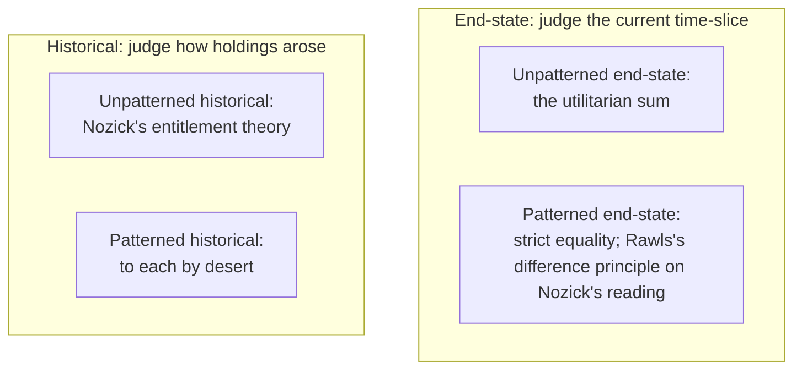

# Political Philosophy · Lesson 2.4: Nozick: entitlement and the challenge to patterns

> ⏱ ~15 min · Module 2: Justice and distribution · Builds on: [2.2 Rawls I](02-02-rawls-the-original-position.md), [2.3 Rawls II](02-03-rawls-the-two-principles-and-maximin.md) · Unlocks: [2.5 Equality of what?](02-05-equality-of-what.md), [6.4 Who should provide?](06-04-welfare-property-and-subsidiarity.md)

## Why this matters

Rawls asked which distribution of primary goods free and equal people would choose. Robert Nozick, in *Anarchy, State, and Utopia* (1974, ch. 7), answered that the question is malformed. Goods do not fall from the sky waiting to be shared out; they arrive already attached to people who made, found, bought or were given them. If he is right, the difference principle is not a mistaken pattern but a mistaken *kind* of principle, and the state that enforces it exceeds its legitimate authority. This lesson states his theory and its sharpest argument at full strength, then the three replies that matter.

## The idea

Ask two questions about a distribution of holdings.

**When do you look?** An **end-state** principle judges the current time-slice: who has what, now. Strict equality, the utilitarian sum and maximin are all of this kind. A **historical** principle asks how the holdings came about: two identical snapshots can differ in justice if one arose by theft.

**Does it follow a pattern?** A **patterned** principle says "to each according to ___": need, effort, merit, contribution. Nozick's point is that almost every principle anyone defends is patterned or end-state ([patterned and historical principles](../reference.md#patterned-and-historical-principles)).

His own [entitlement theory](../reference.md#entitlement-theory) is historical and unpatterned. It names no distribution. It says: if you started from a just position and moved only by just steps, wherever you ended up is just. Compare a game of poker played fairly. Nobody checks the final stacks against a formula; you check that no one cheated.

The background is the separateness of persons and rights as side constraints, owned by [`ethics` 1.3](../../ethics/lessons/01-03-justice-and-the-separateness-of-persons.md) and [2.4](../../ethics/lessons/02-04-constraints-and-options.md): there is no social entity whose good can outweigh one person's rights. Ch. 7 turns that moral structure into a theory of property.

## Source

Nozick's theory of acquisition keeps a version of Locke's proviso. Locke, *Second Treatise* (1690), ch. V, §33 (public domain):

> "Nor was this appropriation of any parcel of land, by improving it, any prejudice to any other man, since there was still enough, and as good left; and more than the yet unprovided could use. So that, in effect, there was never the less left for others because of his enclosure for himself… No body could think himself injured by the drinking of another man, though he took a good draught, who had a whole river of the same water left him to quench his thirst."

Notice what the river image proves: taking is harmless *when what is left is undiminished for use*. It does not say what happens when the river is a single spring. That gap is where Nozick's proviso lives. Locke's own theory of labour-mixing, and the dispute over whether "enough and as good" is a proviso at all, belong to [`history-of-political-thought` 4.1](../../history-of-political-thought/lessons/04-01-locke-against-filmer-and-property.md).

## The argument

**The entitlement theory, reconstructed.**

1. **(Normative)** A person who acquires an unowned thing in accordance with the principle of justice in acquisition is entitled to it.
2. **(Normative)** A person who acquires a thing in accordance with the principle of justice in transfer, from someone entitled to it, is entitled to it. *In words:* voluntary exchange and gift pass entitlements on.
3. **(Normative)** No one is entitled to a holding except by repeated applications of 1 and 2.
4. **(Normative)** Where holdings arose by violating 1 or 2 (theft, fraud, enslavement), the principle of rectification says how to undo the injustice.

∴ **C.** A distribution is just if and only if everyone is entitled to what they hold under it.

*In words:* justice is a property of the path, not the endpoint.

**Liberty upsets patterns.** Nozick's challenge, under that heading, runs as prose. Pick your favourite pattern and suppose it fully realized: call it D1. Wilt Chamberlain, the basketball star, signs a contract: 25 cents of every home-game ticket goes into a box with his name on it. A million fans, each spending their own just D1 share, drop in a quarter. Wilt ends the season with 250,000 dollars, far more than anyone else, and the pattern is broken: call the result D2. Was D2 unjust? Everyone started entitled to their D1 shares, by your own hypothesis. Each fan chose to spend 25 cents this way, and third parties still hold exactly their D1 shares. So, Nozick asks, where is the injustice? And if D2 is unjust, a patterned principle must either forbid such exchanges or keep taking from Wilt and returning to the fans. Either way, no pattern survives free people using what the pattern gave them without continual interference.

**Taxation and forced labor.** The same reasoning reaches tax. Taking a person's earnings, Nozick claims, is "on a par with forced labor" (ch. 7): if the state takes the earnings from some of your hours, it has in effect made you work those hours for others' purposes. The claim leans on [self-ownership](../reference.md#self-ownership), each person's full rights over her own body, labour and powers. That is the name his critics, above all G. A. Cohen, give the root of his view; Nozick himself mostly argues from side constraints.

**The proviso.** Acquisition has a limit. On Nozick's weak version of the [Lockean proviso](../reference.md#lockean-proviso), an appropriation that would otherwise make someone an owner does not do so if it leaves others, who can no longer use the thing, worse off than they would have been. Three features matter. The comparison is net welfare, so being outbid for the chance to appropriate does not count. The remedy is compensation, not surrender. And the baseline, how others would fare had the thing stayed in common, Nozick never pins down, which is why he can say a market economy satisfies the proviso easily. His own examples: you may not seize the only water hole in a desert and charge what you like, nor charge what you like if every other water hole happens to dry up; but a researcher who synthesizes a new drug from ordinary chemicals takes nothing anyone else would have had.

**The replies, each at strength.**

- **Background justice (Rawls).** Each transaction may be fair while their accumulated effect erodes the fair background that made them fair. So justice must apply first to the [basic structure](../reference.md#basic-structure), the rules within which the transactions happen; a tax schedule set in advance is one such rule, not a raid on finished transactions. The reply is stated against Hayek in [`philosophy-of-economics` 5.5](../../philosophy-of-economics/lessons/05-05-hayek-knowledge-order-and-the-mirage-of-social-justice.md).
- **Self-ownership without world-ownership (Cohen).** In *Self-Ownership, Freedom, and Equality* (1995), Cohen grants that self-ownership is hard to refute, then denies that it delivers Nozick's result. Unequal holdings need a further premise: that the external world starts unowned and open to appropriation under a weak proviso. Start it jointly owned instead, and self-owners get very different results. Cohen also presses Wilt's third parties: the fans did not consent to the power Wilt's fortune gives him over people who never bought a ticket.
- **The proviso's baseline.** Measured against a state of nature, nearly every appropriation passes. Measured against an equal share, or against what others would have had under a different property regime, many fail. The choice of baseline is a normative choice, and the proviso cannot make it for itself.

Rectification (premise 4) is applied in [`philosophy-of-debt` 5.4](../../philosophy-of-debt/lessons/05-04-jubilee-as-a-moral-principle.md). Nozick himself allowed that, failing a full theory, some end-state rule might serve as a rough guide to rectifying past injustice.

**Where the argument is weakest.** The step from "entitled to D1" to "entitled to transfer D1 on any terms, free of later claims". A critic says what a just pattern assigns need not be full ownership: it may be a bundle of rights that already includes the tax, so taxing Wilt takes nothing anyone was entitled to keep. Nozick's side answers that this makes the pattern decide in advance which uses of your share are allowed, which is the interference he predicted.

## Map of positions

Rawls would protest his placement: the difference principle governs the basic structure, and within fair rules whatever arises is just (pure procedural justice). Whether that moves it out of the top row is exactly the dispute.

## Worked examples

**Example 1 (clean): a village and a fiddler.** Invented numbers. A village of 100 holds D1, strict equality: 10,000 dollars each, 1,000,000 in all. Eighty villagers each pay a fiddler 25 dollars for a season of dances. D2: the fiddler holds $10{,}000+80\times25=12{,}000$; the 80 payers hold 9,975 each; 19 others hold 10,000. The total is unchanged, but the fiddler's share rises from 1.0% to 1.2%, and the lowest holding falls from 10,000 to 9,975. Restoring D1 means taking 2,000 from the fiddler and returning 25 to each payer: exactly undoing the transactions. Even a maximin principle on holdings ranks D2 below D1, though every payer chose it, since what they bought, the dances, is not counted as a holding. The defender of patterns must say what the payers were entitled to under D1, if not to spend it this way.

**Example 2 (hard): a well under a valley.** Invented case. The Halden Water Company drills the first deep well into an aquifer under a dry valley and sells water. If the villagers' shallow wells keep running, nobody's use is cut off, and the proviso is silent. Now suppose the pumping drops the water table and every village well fails. The villagers can no longer use what they used before: the water-hole case. But the company sells at a price they can pay, and piped water is cleaner than what they hauled. Are they worse off? Against the baseline "the aquifer left in common, our wells working", perhaps not on net. Against "anyone could have drilled, or the village could have drilled jointly", perhaps yes. The proviso tells you a comparison is needed; it does not tell you which world to compare with. And if the company owes compensation, it keeps the well.

## Watch out

- **You might think entitlement is desert, but actually Nozick needs no one to deserve anything.** Wilt's fortune is just because the transfers were free, not because he earned it; [`philosophy-of-economics` 5.4](../../philosophy-of-economics/lessons/05-04-markets-and-desert.md) makes the point. "To each by desert" is one of the patterns he attacks.
- **You might think "taxation is forced labor" is a claim about obligation, but actually it is a claim about legitimacy.** It says the state has no right to take earnings for redistribution, so a redistributive state exceeds its legitimate authority. Whether a citizen must still comply, as a matter of political obligation, is a separate question ([1.4](01-04-natural-duty-and-philosophical-anarchism.md)).
- **You might think Wilt shows patterns are inefficient, but actually its claim is conceptual and normative.** Nothing in it predicts that redistribution shrinks output; it says that preserving a pattern requires restricting what people may do with what is theirs.

## One-liner

> Nozick judges a distribution by its history, not its shape: if it arose by just acquisition and free transfer it is just, whatever pattern it shows, and any pattern can be kept only by interfering with free exchange; his critics reply that "just acquisition" hides a contestable baseline and that fair transactions need fair background rules.

## Problems

**P1 (🟢) *(Formal (a)-(b) · Exegetical (c).)*** Invented numbers. A town of 200 holds D1: 5,000 dollars each. Over a year, 160 residents each pay 15 dollars to watch Tamsin, a chess player, in exhibition matches; the other 39 do not. (a) Give the D2 holdings of Tamsin, a payer and a non-payer, the total, Tamsin's share of total wealth in D1 and in D2, and the ratio of the largest to the smallest holding in D2. (b) The town's charter caps any one person's holding at 0.6% of total wealth. What is the smallest tax on Tamsin that restores the cap if the revenue is shared among the other 199, and what fraction of her match income is that? (c) In two sentences: which claim of Nozick's does this tax test, and what does he say a town must do to keep the cap in force year after year?

**P2 (🟡) *(Exegetical (a) · Evaluative (b).)*** Apply the proviso. Invented case. A storm opens a sheltered lagoon on an uninhabited stretch of the Corran coast, with room for exactly one oyster farm. Nobody used the water before. Mara stakes the lagoon first and farms it, selling oysters in the nearby town, which had none. Pell, who arrived a week later with the same plan, complains that she has made him worse off. (a) Under Nozick's weak proviso, does Pell's complaint count, and does the town's position matter? Two sentences each. (b) A critic replies that Nozick's baseline is set too low. Name a rival baseline, say whether Mara's claim passes under it, and say where the proviso stops determining a verdict. 120 words or fewer. Any verdict passes.

**P3 (🔴, optional) *(Exegetical.)*** Diagnose. An **invented** op-ed on a proposed 60% tax on bank bonuses, not the words of any real person:

> (i) "Bankers don't deserve these bonuses; they work no harder than the nurses who earn a fraction of them." (ii) "But deserve has nothing to do with it: every bonus was paid under a contract both sides freely signed, so the money is theirs." (iii) "A 60% tax means three days of every five-day week worked for the state." (iv) "The one honest case for clawing anything back is that the banks' profits came from a bailout won by hiding their losses from regulators."

For each sentence, say whether it argues from desert, from entitlement, or neither, and name the principle or claim from this lesson it uses. One line each.

Solutions

**P1** *(Formal (a)-(b) · Exegetical (c))*

(a) Tamsin's income is $160\times15=2{,}400$, so she holds $5{,}000+2{,}400=7{,}400$. A payer holds $5{,}000-15=4{,}985$; a non-payer 5,000. Total: $7{,}400+160\times4{,}985+39\times5{,}000=7{,}400+797{,}600+195{,}000=1{,}000{,}000$, unchanged. Tamsin's share: $5{,}000/1{,}000{,}000=0.5\%$ in D1, $7{,}400/1{,}000{,}000=0.74\%$ in D2. Ratio of largest to smallest: $7{,}400/4{,}985\approx1.485$.

(b) The total stays 1,000,000 after redistribution, so the cap is $0.006\times1{,}000{,}000=6{,}000$. The tax is $7{,}400-6{,}000=1{,}400$, which is $1{,}400/2{,}400\approx58.3\%$ of her match income. Shared among 199, each gains about 7.04 dollars, so no one else approaches the cap.

**Must hit, strict (a)-(b):**

- 7,400 / 4,985 / 5,000; total 1,000,000; shares 0.5% and 0.74%; ratio about 1.485.
- Tax 1,400, about 58% of the 2,400 she was paid.

**Must hit, strict (c):**

- The tax tests "liberty upsets patterns" and the claim that taxing earnings is on a par with forced labor: it takes the fruits of hours she worked, paid by people spending their own just shares.
- To keep the cap, the town must keep interfering: either forbid such payments in advance or tax and redistribute each time free exchanges break the pattern.

**Wrong turns:** computing the cap on D1 wealth minus the tax (the total is unchanged by redistribution); dividing the 1,400 among the 160 payers only, which the question does not ask for.

**Model answer (c):** The tax tests Nozick's claim that liberty upsets patterns, and his claim that taking earnings is on a par with forced labor, since it takes over half of what free payers gave Tamsin from their just shares. He says the town can keep the cap only by continual interference: forbidding such transactions or repeatedly taking from those they enrich.

---

**P2** *(Exegetical (a) · Evaluative (b))*

**Must hit, strict (a):**

- Pell's complaint does not count: the weak proviso excludes worsening by loss of the *opportunity to appropriate*; it protects those who can no longer *use* the thing.
- The town matters, and it is not worsened: nobody used the lagoon, and the town now has oysters it lacked, so on net welfare it is better off than with the lagoon left in common. The proviso is satisfied.

**Must hit, any verdict (b):**

- A rival baseline stated precisely: for example, each person's equal share of the value of natural resources, or the outcome of a fair procedure for allocating the lagoon (a lottery, an auction whose proceeds are shared).
- The verdict under it: Mara's appropriation passes only if she pays something like the lagoon's rental value to others; a bare first claim fails.
- Where the proviso stops: it requires a comparison but does not choose the baseline; that choice is a further normative premise.

**Wrong turns:** saying Pell is worsened because he cannot farm "the thing", when he never used it and lost only the chance to appropriate it; treating compensation as requiring Mara to surrender the lagoon.

**Model answer (b), one of several:** Take as baseline each person's equal claim to the value of unowned nature, the view of left-libertarians and of Cohen's joint-ownership alternative. Then Mara's first claim is not enough: she may farm the lagoon, but owes the others its rental value, perhaps the price an auction would fetch. Nozick's baseline asks only whether anyone's use is worse than with the lagoon in common, and passes her. The proviso itself cannot choose between these: it says "not worse off than…" and leaves the blank to a prior theory of what people are owed from nature.

---

**P3** *(Exegetical)*

**Must hit, strict:**

- (i) **Desert**, on an effort basis: a patterned principle ("to each by effort"), which Nozick rejects as a ground of justice.
- (ii) **Entitlement**: justice in transfer; holdings from free contracts are just whatever anyone deserves. Historical and unpatterned.
- (iii) **Entitlement**: Nozick's claim that taxing earnings is on a par with forced labor; the arithmetic is $0.6\times5=3$ days.
- (iv) **Entitlement**: the principle of rectification; profits obtained by fraud were not justly transferred, so clawing them back is consistent with Nozick's own theory.

**Wrong turns:** filing (iv) as desert because it says the banks did not "earn" the profit; its ground is a defect in the transfer (deception), not a lack of merit. Filing (i) as end-state: effort is a pattern, and judging pay by past effort makes it historical-patterned.

**Model answer:** (i) desert, a patterned effort principle. (ii) entitlement, justice in transfer. (iii) entitlement, taxation as forced labor. (iv) entitlement, rectification of an unjust transfer.

## Flashback

**From Lesson [2.2](02-02-rawls-the-original-position.md) (Rawls I: the original position):** *(Exegetical (a) · Evaluative (b).)* Apply to a new case. The invented Republic of Orsen has one copper deposit that will run out in about sixty years. The question for the original position is what share of each generation's copper revenue must be saved in a fund for later generations. (a) A party argues: "We are the generation that found the copper, so it is ours to spend." Which feature of the device rules that argument out? One sentence. (b) In *A Theory of Justice*, Rawls's parties are mutually disinterested, and they are all contemporaries: members of the same generation, though they do not know which one. Explain why those two features together leave the parties with no reason to choose any saving at all. Then say whether the better repair is to change the parties' motives or to change the question they are asked, naming what each repair costs. 120 words or fewer. Any verdict passes.

Solution

**Must hit, strict (a):**

- The veil of ignorance: it hides which generation a party belongs to and the particular circumstances of her society, so "we found it" uses exactly the fact the veil removes.

**Must hit, any verdict (b):**

- The gap: whatever generation the parties turn out to be, earlier generations have already saved or not, and nothing chosen now changes that; saving now benefits only later people, and mutually disinterested parties take no interest in them. So the veil alone yields a zero savings rate.
- Repair by motives: give the parties concern for their descendants (Rawls's first move in *A Theory of Justice*, treating them as heads of families). Cost: it puts a benevolent motive into the parties, which is what mutual disinterest was meant to keep out, so the fairness no longer sits only in the veil.
- Repair by question: ask them to choose the savings principle they would want all earlier generations to have followed (Rawls's later move). Cost: the parties now reason about others' conduct toward them, so the choice is less purely self-interested and the stipulation is doing visible moral work.
- A verdict either way, with its cost acknowledged.

**Wrong turns:** answering (b) with "a party might be in a later generation, so she saves": the parties are contemporaries, so whoever they are, their saving goes to someone else. Reaching for maximin: how to handle risk is 2.3's question, and here there is no risk to the chooser at all.

**Model answer (b), one of several:** The parties share one generation, whichever it is. What earlier generations saved is fixed; what this one saves goes only to people who come later, in whom mutually disinterested parties take no interest. So they save nothing. Changing the motives (each party cares about her descendants) works but imports the benevolence the device was built to do without. Changing the question (choose the rule you would want every earlier generation to have followed) keeps the parties self-interested and makes them face the rule as its beneficiaries too. I prefer the second, though its cost is real: the reciprocity is stipulated, not chosen, so the device's moral content is plainly sitting in its design.

## Connections

- **Backward:** [2.2](02-02-rawls-the-original-position.md) and [2.3](02-03-rawls-the-two-principles-and-maximin.md) built the patterned, end-state view that ch. 7 attacks; the separateness of persons and side constraints come from [`ethics` 1.3](../../ethics/lessons/01-03-justice-and-the-separateness-of-persons.md) and [2.4](../../ethics/lessons/02-04-constraints-and-options.md), whose side constraints are the backbone of Nozick's minimal state.
- **Forward:** [2.5](02-05-equality-of-what.md) asks what egalitarians should equalize; [2.6](02-06-luck-relations-priority-and-sufficiency.md) builds luck egalitarianism partly as an answer to Nozick's respect for choice; [6.4](06-04-welfare-property-and-subsidiarity.md) revisits taxation as forced labor with basic income as the test case.
- **Sideways:** entitlement without desert in [`philosophy-of-economics` 5.4](../../philosophy-of-economics/lessons/05-04-markets-and-desert.md); Hayek's cousin view, justice as procedure, in [5.5](../../philosophy-of-economics/lessons/05-05-hayek-knowledge-order-and-the-mirage-of-social-justice.md); Paine's floor set beside Nozick's proviso (same test, disputed facts) in [`philosophy-of-debt` 6.2](../../philosophy-of-debt/lessons/06-02-public-debt-and-the-unborn.md); Locke's own proviso in [`history-of-political-thought` 4.1](../../history-of-political-thought/lessons/04-01-locke-against-filmer-and-property.md).
