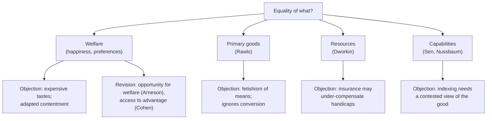

# Political Philosophy · Lesson 2.5: Equality of what?

> ⏱ ~15 min · Module 2: Justice and distribution · Builds on: [2.3 Rawls II: the two principles and maximin](02-03-rawls-the-two-principles-and-maximin.md), [2.4 Nozick: entitlement and the challenge to patterns](02-04-nozick-entitlement-and-the-challenge-to-patterns.md) · Unlocks: [2.6 Luck, relations, priority and sufficiency](02-06-luck-relations-priority-and-sufficiency.md)

## Why this matters

Suppose you are an egalitarian, or a Rawlsian who wants the worst off as well off as possible. You still have to say *what* is to be equalized or maximized: happiness, money, or what people can actually do. The answer is not a technicality. It decides whether a person with a disability gets more than an equal share, whether someone with champagne tastes gets a subsidy, and whether the state needs a view about what makes a life go well. Amartya Sen named the question in a 1979 Tanner Lecture, "Equality of What?" (published 1980). The literature calls it the [currency of justice](../reference.md#currency-of-justice).

## The idea

Four currencies are on the table.

- **Welfare.** Equalize how well lives go, measured by happiness or by satisfied preferences. This is the currency of [2.1](02-01-utilitarianism-as-a-principle-for-institutions.md)'s utilitarian, now with an equal distribution as the target rather than a maximal sum.
- **Primary goods.** Rawls's index of all-purpose means (rights, opportunities, income and wealth, the social bases of self-respect), reloaded from [2.2](02-02-rawls-the-original-position.md); the difference principle of [2.3](02-03-rawls-the-two-principles-and-maximin.md) ranks positions by it.
- **Resources.** Ronald Dworkin's answer: equalize the means each person has to pursue her own plans, and let her bear the consequences of what she chooses to do with them.
- **Capabilities.** Sen's answer: equalize what people are actually *able to do and be*, such as moving about, being nourished, taking part in the life of the community.

The debate runs by counterexample. Each currency is attacked with a case where equalizing it gives an absurd distribution.

**Against welfare: expensive tastes.** Dworkin's "What is Equality?" (two parts, *Philosophy & Public Affairs*, 1981) imagines a man who deliberately cultivates a taste for rare food and wine. Equal welfare would require transferring resources to him until he is as satisfied as everyone else, so the frugal subsidize the extravagant. The mirror case, which Sen presses: a person who has learned to be content with very little scores high on welfare, so a welfarist owes her nothing.

**Against primary goods and resources: conversion.** Sen's objection to Rawls is that two people with the same income and wealth may be able to do very different things with it. Think of a wheelchair user, a pregnant woman, someone in a cold climate: each needs more income to reach the same functioning. Measuring advantage by goods held, rather than by what goods do for people, Sen called a kind of *fetishism*: it mistakes the means for the end.

**Dworkin's construction.** [Equality of resources](../reference.md#equality-of-resources) is built to absorb both objections. Shipwreck survivors land on an island and each receives an equal stock of clamshells to bid in an auction for its resources. The auction is run until the outcome passes the [envy test](../reference.md#envy-test): no one prefers anyone else's bundle to her own. Then tastes are charged to their owners: wanting scarce things costs more clamshells. Handicaps cannot be auctioned, so Dworkin adds [hypothetical insurance](../reference.md#hypothetical-insurance): ask what cover the average person would buy against a handicap if everyone faced the same risk, and fund that cover by taxation. Talents get a parallel scheme, insurance against having low earning power.

**The later moves, one line each.** Richard Arneson (1989) proposes equal *opportunity* for welfare: equal prospects, so that welfare gaps arising from choice are not owed compensation. G. A. Cohen (1989) proposes equal *access to advantage*, where advantage includes welfare and resources both; he argues Dworkin drew the line in the wrong place, between preferences and resources, when the morally relevant line is between choice and luck. That line is [2.6](02-06-luck-relations-priority-and-sufficiency.md)'s subject.

**Nussbaum's list.** Martha Nussbaum turns Sen's approach into a theory of justice: ten central capabilities (life, bodily health, bodily integrity, practical reason and affiliation among them), each owed to every citizen up to a threshold (*Women and Human Development*, 2000; *Creating Capabilities*, 2011). Sen refuses a fixed list; which capabilities count should emerge from public reasoning. Capabilities as a *welfare metric*, and the Human Development Index, are taught in [`philosophy-of-economics` 1.3](../../philosophy-of-economics/lessons/01-03-capabilities-as-a-welfare-metric.md); here the question is what justice owes.

## The argument

**Sen's argument for capabilities as the currency, reconstructed.**

1. **(Normative)** The currency of justice should measure a person's real advantage: how well placed she is to live a life she has reason to value.
2. **(Conceptual)** Welfare measures advantage by mental states, which adapt to deprivation and inflate with cultivated tastes.
3. **(Empirical)** People differ widely in their ability to convert resources into functionings, because of bodies, ages, climates and social settings.
4. **(Conceptual)** So equal resources or primary goods can leave people with very unequal real advantage. *In words:* the same money buys different freedoms.
5. **(Conceptual)** What a person is able to do and be, her capability set, is not distorted by adaptation and tracks conversion directly.

∴ **C.** Justice should look to capabilities, not to welfare, primary goods or resources.

**The rivals at full strength.**

- **Dworkin.** Equality must be *sensitive to ambition*: people who choose to work harder or want less should not be levelled to those who choose otherwise. Resources are the right currency because a person can be held responsible for her tastes, which she identifies with as part of who she is, but not for her handicaps. Conversion is handled by treating bodily and mental powers as *internal* resources, covered by insurance. And resources need no theory of the good life: the envy test lets each person judge by her own lights.
- **Rawls.** Primary goods are what free and equal citizens need whatever their conception of the good, and an index of them is *public*: citizens can check whether the basic structure delivers. Rawls holds that his theory addresses citizens within the normal range of capacities, leaving severe impairment to be handled at a later, legislative stage.
- **Welfarists** of Arneson's stripe reply that welfare is what ultimately matters to people; the expensive-tastes objection shows only that *choices* must be screened out, not that welfare is the wrong currency.

**Where the argument is weakest.** Premise 5 into the conclusion: the [indexing problem](../reference.md#indexing-problem). A capability set has many dimensions. To say one person has *more* capability than another, or that a distribution equalizes it, you need weights: how much mobility trades for literacy or for affiliation. A critic (Dworkin and Rawlsians both press versions) says any such weighting is a view of what makes life valuable, which reasonable citizens reject, so the state would rank lives by a contested ideal. Sen's reply is that only a partial ordering is needed: where one person is worse off in every dimension, the verdict is clear, and public reasoning can settle much of the rest. Nussbaum's reply is that a short list of thresholds, not a full ranking, is all justice requires. Notice that primary goods face the same indexing problem: Rawls also has to weight income against opportunity and self-respect.

## Map of currencies

## Worked examples

**Example 1 (clean): expensive tastes, welfare vs resources.** Invented numbers. Two survivors share 12 units of grain and 12 of wine. Ines values grain at 2 per unit and wine at 1: $u_I = 2g + w$. Lucien has cultivated a taste for wine and values grain at only $\tfrac12$: $u_L = \tfrac12 g + w$. Assume, for the welfare view's sake, that these numbers are comparable across persons.

*Allocation A:* Ines gets $(10, 2)$, Lucien $(2, 10)$. Envy test:

- Ines: own bundle $2(10)+2=22$; Lucien's $2(2)+10=14$. No envy.
- Lucien: own $\tfrac12(2)+10=11$; Ines's $\tfrac12(10)+2=7$. No envy.

A is envy-free, so it counts as an equal division of resources. Welfare is 22 for Ines and 11 for Lucien.

*Allocation W* equalizes welfare. Give Lucien all the wine and grain $12-g$, Ines grain $g$: $2g = \tfrac12(12-g)+12$, so $5g=36$, $g=7.2$. Ines $(7.2,0)$ scores $14.4$; Lucien $(4.8,12)$ scores $2.4+12=14.4$. But Ines values Lucien's bundle at $2(4.8)+12=21.6 > 14.4$: she envies him.

The verdicts split. Equality of welfare demands W, in which Ines gives up 7.6 points of welfare to fund Lucien's taste. Equality of resources demands an envy-free allocation like A and lets Lucien bear the cost of what he chose to want. The welfarist who accepts Arneson's revision agrees with Dworkin here, *because the taste was cultivated*. Make it unchosen, and Cohen parts company with Dworkin.

**Example 2 (hard): same income, different functioning.** Invented numbers. Maya and Nils each earn 30,000 dollars a year. Maya uses a wheelchair; reaching work, the clinic and friends as easily as Nils costs her an extra 40,000 dollars a year in adapted transport and housing. On income, and on primary goods, they are equal. On capabilities, Maya's mobility is far below Nils's.

Dworkin's insurance: suppose 1 person in 20 faces Maya's condition, and the average person, not knowing her own risk, would buy 30,000 dollars of annual cover. The actuarially fair premium is

$$\text{premium} = p \times C = \tfrac{1}{20} \times 30{,}000 = 1{,}500.$$

So everyone is taxed 1,500 dollars, and each person with the condition receives 30,000 (in a town of 1,000, 50 claimants: $50 \times 30{,}000 = 1{,}000 \times 1{,}500$). Maya is still 10,000 dollars short of matching Nils's mobility.

Here the theories come apart, and each stops short of a verdict at a different place. The resource egalitarian says the shortfall is not an injustice: the insurance market sets what is owed, and full compensation might drain everyone else without limit. Why would the average person under-insure? If money does less for you once disabled, it can be rational to buy less than the full cost, and Dworkin's scheme inherits that choice. The capability theorist says the shortfall *is* the injustice, since Maya cannot do what Nils can. But how much Nils must give up to close it depends on how mobility is weighted against what he loses, which is the indexing problem again.

## Watch out

- **You might think equality of resources means everyone gets the same amounts of stuff, but actually the envy test compares bundles by each person's own valuation.** In Example 1, A gives Ines 12 units and Lucien 12, but an envy-free allocation can give one person more units than another.
- **You might think the currency question is empirical (which measure is easiest to collect), but actually it is normative:** which features of people's lives justice must answer for. Measurability is a real constraint, and it is one of Rawls's reasons for primary goods, but it is a separate argument.
- **You might think settling the currency settles what the state may do, but actually it settles only what a just basic structure would distribute.** Whether a state that fails to equalize capabilities is illegitimate, or whether citizens are obliged to obey its redistributive laws, are the different questions of [1.1](01-01-the-problem-of-political-authority.md).

## One-liner

> Welfare rewards expensive tastes and ignores contented deprivation, resources and primary goods ignore how differently people convert means into lives, and capabilities need a contested weighting to compare lives at all: every currency pays for its fix with a new problem.

## Problems

**P1 (🟢) *(Formal (a)-(b) · Exegetical (c).)*** Invented numbers. Three settlers divide 9 units of fish $f$ and 9 of timber $t$. Their valuations: Dara $u_D = 3f + t$, Emil $u_E = f + 2t$, Fen $u_F = 2f + t$. (a) Allocation X gives Dara $(5,1)$, Emil $(1,5)$, Fen $(3,3)$. Is X envy-free? Show each comparison. (b) Allocation Y gives Dara $(5,0)$, Emil $(0,6)$, Fen $(4,3)$. Is Y envy-free? (c) In Y, Fen holds 7 units and Dara 5. In one or two sentences, say why Dworkin would still count Y as an equal division, and whether it equalizes welfare.

**P2 (🟡) *(Exegetical (a)-(b).)*** Diagnose. An **invented** memo to the council of the town of Kellmoor, not the words of any real person or body:

> (i) "Every resident will receive an equal mobility voucher of 600 dollars a year."
> (ii) "Residents who use wheelchairs will receive an additional sum, set at what a typical resident would have paid to insure against needing one."
> (iii) "Our aim is that every resident can actually reach work, a clinic and the town square."
> (iv) "Residents who report being satisfied with their mobility will not receive the additional sum."

(a) Name the currency of justice each sentence assumes. One line each. (b) Two of the sentences can conflict. Name them and give a one-sentence case where they do.

**P3 (🔴, optional) *(Evaluative.)*** Build a counterexample to equality of welfare *or* to equality of resources (with Dworkin's insurance), different from Dworkin's cultivated taste for fine wine and from Example 2. Then give the strongest reply a defender of that currency can make. 150 words or fewer. Any verdict passes.

Solutions

**P1** *(Formal (a)-(b) · Exegetical (c))*

Totals check: X has $5+1+3=9$ fish and $1+5+3=9$ timber; Y has $5+0+4=9$ and $0+6+3=9$.

(a) X:

- Dara: own $3(5)+1=16$; Emil's $3(1)+5=8$; Fen's $3(3)+3=12$. No envy.
- Emil: own $1+2(5)=11$; Dara's $5+2(1)=7$; Fen's $3+2(3)=9$. No envy.
- Fen: own $2(3)+3=9$; Dara's $2(5)+1=11 > 9$. **Fen envies Dara.** Emil's $2(1)+5=7$.

X is not envy-free.

(b) Y:

- Dara: own $3(5)+0=15$; Emil's $0+6=6$; Fen's $3(4)+3=15$. A tie, not envy.
- Emil: own $0+2(6)=12$; Dara's $5+0=5$; Fen's $4+2(3)=10$. No envy.
- Fen: own $2(4)+3=11$; Dara's $2(5)+0=10$; Emil's $0+6=6$. No envy.

Y is envy-free.

**Must hit, strict (c):**

- The envy test measures equality by each person's own valuation of the bundles, not by counting units; no one prefers another's bundle, so Y is an equal division of resources.
- It does not equalize welfare: own valuations are 15, 12 and 11, and even reading them as comparable, equality of resources does not aim at equal welfare.

**Wrong turns:** treating Dara's tie with Fen's bundle as envy (envy needs strict preference); judging Y unequal because Fen holds more units.

**Model answer (c):** Dworkin's test asks only whether anyone would rather have someone else's bundle, and in Y no one would, so the division is equal whatever the unit counts. The settlers' own valuations of their bundles are 15, 12 and 11, so if those were comparable welfare levels, welfare would be unequal, which equality of resources does not count as a defect.

---

**P2** *(Exegetical (a)-(b))*

**Must hit, strict (a):**

- (i) Resources (or primary goods): equal means.
- (ii) Resources with Dworkin's hypothetical insurance for handicaps.
- (iii) Capabilities: what residents are actually able to do.
- (iv) Welfare: the test is satisfaction, a mental state.

**Must hit, strict (b):**

- Either (ii) or (iii) against (iv): a resident with a handicap who has adapted to her limits and reports satisfaction loses the additional sum, though insurance (ii) would pay her and the capability aim (iii) is unmet. Or (ii) against (iii): insurance set at the typical resident's cover may fall short of what reaching the clinic costs, leaving the capability aim unmet.

**Wrong turns:** filing (ii) as capabilities because it targets disability (its *measure* is an insurance sum, a resource); filing (iv) as resources because it concerns who gets money.

**Model answer (b):** Sentences (iii) and (iv) conflict: a wheelchair user who has stopped trying to reach the town square and reports she is satisfied loses the extra sum under (iv), though she still cannot do what (iii) aims to secure.

---

**P3** *(Evaluative: graded on moves, not verdict)*

**Accept:** a case where equalizing the chosen currency gives a verdict the reader can show is implausible, plus a reply that a defender would recognize.

**Must hit, any verdict:**

- The case is new (not cultivated wine, not the wheelchair commute) and actually turns on the currency named.
- Name the premise of the currency that the case attacks.
- A reply at full strength, and a sentence on whether the case survives it.

**Wrong turns:** a "counterexample" to welfare that is really about choice (Arneson's revision already handles chosen tastes, so say why it does not); against resources, ignoring that the insurance scheme exists.

**Model answer, one of several:** Against equality of resources. Pell was born with an intense love of photography; nothing else gives her life much point, and the equipment is costly. She did not choose this taste. Dworkin's scheme gives her no help, because tastes are charged to their owners. The case attacks the premise that responsibility follows the line between tastes and resources. Dworkin's reply: Pell identifies with her taste and would not take a pill to lose it; compensating it would treat part of who she is as a handicap, which disrespects her. If she would want to be rid of it, it counts as a craving and can be insured like a handicap. Cohen answers that identifying with a taste does not make it chosen, so the unfairness remains. The case survives if responsibility needs choice, not endorsement.

## Flashback

**From Lesson [2.3](02-03-rawls-the-two-principles-and-maximin.md) (Rawls II: the two principles and maximin):** *(Formal (a) · Exegetical (b).)* Invented numbers. A society has three positions: unskilled (50% of the population), skilled (30%) and professional (20%). Under the current basic structure S their primary-goods indices are (18, 30, 45). A reform R raises professional pay, drawing more people into training; afterwards the indices are (20, 27, 70). Basic liberties and fair equality of opportunity are equally secured under both. (a) Does the difference principle endorse moving from S to R? Give each structure's population-weighted average index. (b) Does the move satisfy "everyone gains"? Name the §13 assumption it violates, and say why the difference principle's verdict does not depend on it. Two sentences.

Solution

(a) Worst-off position: unskilled under both, 18 under S and 20 under R. The difference principle **endorses R**. Averages:

$$\bar S = 0.5(18)+0.3(30)+0.2(45)=9+9+9=27,$$

$$\bar R = 0.5(20)+0.3(27)+0.2(70)=10+8.1+14=32.1.$$

**Must hit, strict (b):**

- No: the skilled position falls from 30 to 27 while the unskilled rise by 2 and the professionals by 25.
- The violated assumption is chain connection: raising the top's prospects raises the bottom's here, but not those of the position in between.
- The difference principle looks only at the worst-off position, so it endorses R anyway; chain connection (with close-knitness) is only the condition under which its verdicts coincide with "everyone gains".

**Wrong turns:** rejecting R because the skilled lose, which applies a Pareto test the difference principle does not use; taking the plain average of the three entries (31 and 39) in place of the population-weighted one.

**Model answer (b):** No: the skilled lose 3 points, so chain connection, which says that raising the top's prospects in a way that helps the bottom also helps everyone in between, fails here. The difference principle still endorses R because it ranks structures by the worst-off position alone; chain connection only describes when that verdict is also an "everyone gains" verdict.

## Connections

- **Backward:** [2.2](02-02-rawls-the-original-position.md) introduced [primary goods](../reference.md#primary-goods), and [2.3](02-03-rawls-the-two-principles-and-maximin.md) ranks positions by them; this lesson asks whether that index is the right one. [2.1](02-01-utilitarianism-as-a-principle-for-institutions.md)'s welfare currency returns here with equality as the target. The objective-list theory of [`ethics` 1.2](../../ethics/lessons/01-02-what-is-good-for-a-person.md) is what a fixed capability list resembles.
- **Forward:** [2.6](02-06-luck-relations-priority-and-sufficiency.md) takes Cohen's choice-luck line into luck egalitarianism and asks what *shape* equality should have. [4.1](04-01-political-liberalism.md) returns to why a liberal state hesitates to weight lives by a contested view of the good.
- **Sideways:** [`philosophy-of-economics` 1.3](../../philosophy-of-economics/lessons/01-03-capabilities-as-a-welfare-metric.md) builds a capability index and meets the indexing problem in the arithmetic. [`philosophy-of-debt` 5.2](../../philosophy-of-debt/lessons/05-02-moral-hazard-and-fairness-to-those-who-paid.md) applies Dworkin's insurance test to debt relief. Rousseau's question whether inequality is unjust as such ([`history-of-political-thought` 4.3](../../history-of-political-thought/lessons/04-03-rousseau-discourse-on-inequality.md)) is taken up here and in 2.6.
