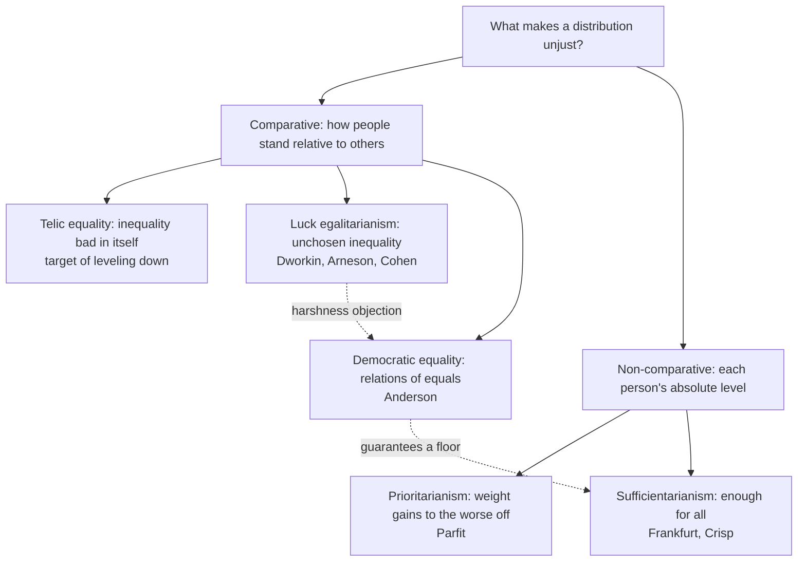

# Political Philosophy · Lesson 2.6: Luck, relations, priority and sufficiency

> ⏱ ~15 min · Module 2: Justice and distribution · Builds on: [2.5 Equality of what?](02-05-equality-of-what.md), [2.3 Rawls II](02-03-rawls-the-two-principles-and-maximin.md) · Unlocks: [3.1 Three concepts of liberty](03-01-three-concepts-of-liberty.md), [6.1 Global justice](06-01-global-justice-cosmopolitans-and-statists.md)

## Why this matters

[2.5](02-05-equality-of-what.md) asked *what* egalitarians want to equalize: welfare, resources or capabilities. This lesson asks *why* and *how much*. Two people can share a currency and still disagree about everything that matters in practice: whether the reckless driver gets emergency care, whether taking something from the rich that helps no one is an improvement, whether justice stops caring once everyone has enough. Four shapes answer differently, and by the end you should be able to build a case that pulls any two of them apart.

## The idea

Start with a question that sounds idle: **what is wrong with inequality?** Four answers.

1. **Luck egalitarianism.** Inequality is unjust when it reflects luck rather than choice. Dworkin's [brute and option luck](../reference.md#brute-and-option-luck) (reload from 2.5): option luck is the outcome of a gamble you chose and could have declined; brute luck is everything else. Arneson (1989) and Cohen ("On the Currency of Egalitarian Justice", *Ethics*, 1989) built rival versions. The shared core: neutralize brute luck, let people bear their option luck.
2. **Democratic (relational) equality.** Elizabeth Anderson ("What Is the Point of Equality?", *Ethics*, 1999), who introduced the label "luck egalitarianism" in order to attack it, says the point of equality is not a pattern of holdings but a *society of equals*: no one dominated, exploited or marginalized, everyone able to stand as an equal citizen.
3. **Prioritarianism.** Benefits matter more the worse off the recipient is. Equality as such does not matter at all.
4. **Sufficientarianism.** What matters is that everyone has *enough*. Frankfurt ("Equality as a Moral Ideal", *Ethics*, 1987) argued that equality is a distraction from this; Crisp ("Equality, Priority, and Compassion", *Ethics*, 2003) gave a refined version.

The first two are comparative: they care how people stand *relative to each other*. The last two are not: they look at each person's absolute level.

## The argument

**Anderson against luck egalitarianism**, reconstructed.

- **P1 (Normative).** An egalitarian theory must express equal respect and concern for every citizen.
- **P2 (Exegetical).** Luck egalitarianism withholds aid from victims of bad option luck because their loss was their own doing.
- **P3 (Exegetical).** It aids victims of brute luck because their endowments are inferior: less talent, worse health, worse looks.
- **P4 (Normative).** Abandoning citizens to their own mistakes, and having the state certify that some citizens' endowments are inferior, both fail equal respect.
- **∴ C.** Luck egalitarianism fails P1. Equality should instead be understood relationally.

*In words:* the view is too harsh to the imprudent (the [harshness objection](../reference.md#harshness-objection)) and insulting to the unlucky (the disrespect objection).

Anderson's harshness case is aimed at the hard-line version she finds in Eric Rakowski. An uninsured driver negligently makes an illegal turn and causes a crash. On that view the paramedics owe him nothing, and if he survives disabled, society owes him no accommodation. She extends the charge to people in dangerous jobs and to unpaid caregivers who become dependent because they did their moral duty. For the disrespect objection she imagines compensation cheques arriving with letters from a "State Equality Board", explaining to the untalented, the disabled and the unattractive that they are being paid for their deficiencies.

Her alternative, [democratic equality](../reference.md#democratic-equality), borrows Sen's capabilities (2.5) but restricts them. Each citizen is guaranteed, over a whole life and whatever their choices, effective access to the capabilities needed to function as a human being, as a participant in cooperative production, and as an equal citizen. Note what this guarantees: *enough* to stand as an equal, not equal shares of everything.

**Parfit's [leveling-down objection](../reference.md#leveling-down-objection)**, against a different target. Parfit ("Equality or Priority?", Lindley Lecture, 1991, published 1995) distinguished **telic** egalitarians, for whom inequality makes an outcome worse in itself, from **deontic** egalitarians, for whom inequality matters only when someone wrongs someone by producing it. Then:

- **L1.** If inequality is bad in itself, then removing it makes an outcome better in at least one respect.
- **L2.** We can remove inequality by making the better-off worse off while making no one better off ("leveling down").
- **L3 (Person-affecting claim).** An outcome cannot be better in any respect if it is better for no one.
- **∴** Telic egalitarianism is false.

Temkin (*Inequality*, 1993) bites the bullet: he denies L3, holding that leveling down is better *in one respect*, though usually worse all things considered. Parfit's own exit is [prioritarianism](../reference.md#prioritarianism), which [`ethics` 1.3](../../ethics/lessons/01-03-justice-and-the-separateness-of-persons.md) defines as maximizing $W=\sum_i f(u_i)$ with $f$ increasing and concave ($u_i$ is person $i$'s well-being). Here only the **priority weight** matters: the value of one extra unit to person $i$ is $f'(u_i)$. With $f(u)=\sqrt u$,

$$f'(u)=\frac{1}{2\sqrt u},$$

so a unit to someone at $u=4$ is weighted $0.25$, and to someone at $u=100$ only $0.05$: five times less. Leveling down lowers terms and raises none, so it can only lower $W$. Priority keeps the egalitarian's sympathy for the worse off with no comparative premise for leveling down to exploit.

[Sufficientarianism](../reference.md#sufficientarianism) does the same with a threshold $T$: priority (Crisp) or exclusive concern (strict Frankfurt) for those below $T$, no distributive concern for gaps above it. The standard objection (Casal, "Why Sufficiency Is Not Enough", *Ethics*, 2007) is its indifference above the line: a society where everyone clears $T$ but a few hold almost everything looks unjust to most egalitarians, and sufficientarianism cannot say why.

**Where the argument is weakest.** For Anderson, P3. A luck egalitarian replies that the theory says what justice *requires*, not what the state must announce: compensation can be paid through general schemes (disability benefits, progressive taxes) whose public rationale insults no one. Anderson's rejoinder is that the theory's own reasons, if they are the real ones, still rank citizens' worth, and a society that acts on them is not one of equals. For Parfit, L3: Temkin says it is the premise that begs the question against the egalitarian.

## Map of positions

The dashed edges show the two links that matter in this lesson. Anderson's harshness objection is aimed at luck egalitarianism, and her positive view guarantees what is *sufficient* to stand as an equal, so in practice it has a sufficientarian floor.

## Worked examples

**Example 1 (clean): leveling down on numbers.** Invented well-being levels for three households: $A=(25,64,100)$. A policy that destroys the surplus of the two better-off households and gives it to no one yields $L=(25,25,25)$. Take a threshold $T=20$.

| View | $A$ | $L$ | Verdict |
|---|---|---|---|
| Strict equality (range) | 75 | 0 | $L$ better |
| Utilitarian sum | 189 | 75 | $A$ better |
| Prioritarian $\sum\sqrt u$ | $5+8+10=23$ | $15$ | $A$ better |
| Sufficiency ($T=20$): number below | 0 | 0 | indifferent |

$L$ is better for no one and worse for two. A telic egalitarian must say $L$ is better in one respect. Temkin accepts this and adds that $A$ is better all things considered. Prioritarianism ranks $A$ strictly higher, because every term of the sum is at least as large. The sufficientarian finds no distributive difference, since everyone clears 20 in both. That indifference is exactly what the Casal objection targets, though here it does no harm, since other values (total well-being) can break the tie.

**Example 2 (hard): Anderson's negligent driver.** Run the hard-line luck egalitarian on her case. The crash was a foreseeable risk of a choice (the illegal turn), and insurance was available and declined: textbook option luck. Verdict: no claim of justice to care. Now the luck egalitarian's best replies:

- **Pluralism.** Justice is one value; compassion or the duty of rescue is another, and it overrides. The paramedics should treat him, though justice does not require it. *Cost:* the theory now concedes that an intuitively obvious requirement of how a state treats its citizens is not a matter of justice.
- **A sufficiency floor.** Luck-sensitivity applies only above a floor of basic needs, which no one forfeits. *Cost:* the floor is not derived from luck egalitarianism; it is borrowed from the sufficientarian or from Anderson herself.
- **Mandatory insurance.** Everyone is made to buy cover, so no one is uninsured. Anderson's reply: this is paternalism, justified by distrust of people's choices.

Where the principle stops: "was it a choice?" comes in degrees. The driver's carelessness may reflect fatigue or poor training, and Arneson himself holds that the capacity for responsible choice is partly luck. The more of the choice is credited to luck, the less harsh the view and the less work "responsibility" does. Luck egalitarianism alone does not fix where to draw the line.

## Watch out

- **You might think the disrespect objection is an empirical prediction that recipients will feel insulted, but actually it is a normative claim** about what the state's reasons express. Evidence that recipients do not mind would not answer it; showing that the theory need not rank anyone's worth would.
- **You might think prioritarianism is a kind of egalitarianism, but actually it is non-comparative.** It gives the same weight to a benefit for someone at level 9 whether everyone else is at 9 or at 900. That is why leveling down cannot touch it, and also why it says nothing against inequality as such.
- **You might think that showing a distribution is unjust shows the state that maintains it lacks [legitimacy](../reference.md#legitimacy), but actually those are separate questions** (1.1). Every view in this lesson is a claim about justice; a state can be legitimate, with the right to rule, while its distribution falls short.

## One-liner

> Luck egalitarians track choice, Anderson tracks standing as an equal, prioritarians weight the worse off, and sufficientarians count who has enough; leveling down sinks only the view that inequality is bad in itself, and harshness hits only the view that choices settle what people are owed.

## Problems

**P1 (🟢) *(Formal (a) · Exegetical (b).)*** Invented well-being levels for three people:
$X=(9,64,100)$, $Y=(25,36,49)$, $Z=(9,49,49)$. Sufficiency threshold $T=16$.
(a) Rank the three by strict equality (range, smaller is better), the utilitarian sum, the prioritarian sum $\sum\sqrt u$, and pure sufficiency (fewest people below $T$). Show the numbers. (b) Which pair is a leveling-down pair, and which of the four views prefers its more equal member? Two sentences.

**P2 (🟡) *(Exegetical (a) · Evaluative (b).)*** Invented case. In the Republic of Varden, Oskar is a self-employed crab fisher. The state offers subsidized disability insurance at a modest premium; he declined it to save money. He fished alone in a storm against a coastguard warning, was injured, and can no longer work. His two children, aged 6 and 9, now live in poverty with him. (a) Classify Oskar's loss and his children's loss as brute or option luck, one sentence each. (b) Give the hard-line luck egalitarian's verdict on whether Varden owes Oskar income support, then Anderson's, then the best reply a luck egalitarian can make to Anderson here, and say where that reply stops determining a verdict. 150 words or fewer. Any verdict passes.

**P3 (🔴, optional) *(Exegetical.)*** Find the crux. Two invented commissioners discuss a proposed grant paid to adults whose measured earning ability is low through no fault of their own.
*Commissioner Hale:* "Low earning ability is unchosen. It's brute luck, and justice requires that we neutralize it."
*Commissioner Imre:* "The question is whether these people can work, take part in public life and be treated as equals. If they can, the grant is no business of justice; if they can't, give them what they need, but not because they are less able."
(a) Name the single premise Imre must deny that Hale asserts. One sentence. (b) Describe a case where the two would reach the same verdict for different reasons. Two sentences. (c) What kind of consideration would move one of them? One sentence.

Solutions

**P1** *(Formal (a) · Exegetical (b))*

(a) Arithmetic (from the verification script):

- Range: $X=100-9=91$, $Y=49-25=24$, $Z=49-9=40$. Ranking: $Y \succ Z \succ X$.
- Sum: $X=173$, $Y=110$, $Z=107$. Ranking: $X \succ Y \succ Z$.
- Prioritarian: $X=3+8+10=21$, $Y=5+6+7=18$, $Z=3+7+7=17$. Ranking: $X \succ Y \succ Z$.
- Sufficiency at $T=16$: $X$ has one person below (at 9), $Y$ none, $Z$ one (at 9). Ranking: $Y \succ X \sim Z$. The shortfall is $16-9=7$ in both $X$ and $Z$, so even counting shortfall, $X$ and $Z$ tie.

(b) $X \to Z$ is the leveling-down pair: person 1 is at 9 in both, persons 2 and 3 fall (64 to 49, 100 to 49), and no one gains, while the range falls from 91 to 40. Only strict equality prefers $Z$; the sum and the prioritarian sum prefer $X$, and pure sufficiency is indifferent.

**Must hit, strict (a):** the four rankings above with their numbers; the sufficiency tie between $X$ and $Z$.

**Must hit, strict (b):** names $X$ and $Z$, checks that $Z$ is better for no one and worse for two, says only the range view prefers $Z$.

**Wrong turns:** calling $X \to Y$ leveling down (person 1 gains, from 9 to 25, so it is not); saying the sufficientarian prefers $X$ to $Z$ because $X$ has more well-being: pure sufficiency ignores levels above $T$, which is the indifference objection in action. (A version that also counts well-being above the threshold would break the tie; the problem asked for pure sufficiency.)

---

**P2** *(Exegetical (a) · Evaluative (b))*

**Must hit, strict (a):**

- Oskar: option luck. He declined available insurance and took a foreseeable risk against a warning.
- The children: brute luck. They chose nothing, so a luck egalitarian owes them compensation even if Oskar is owed none.

**Must hit, any verdict (b):**

- Hard-line luck egalitarian: no claim of justice to income support for Oskar.
- Anderson: Varden owes him lifelong access to the capabilities to function as an equal (subsistence, the means to take part in society), whatever his choices; this guarantee cannot be lost by bad option luck.
- One real luck-egalitarian reply (pluralism, a sufficiency floor, or support routed through the children's brute-luck claim), with its cost or limit named.
- Where it stops: the children's claim cannot be met without supporting the household, so the view cannot cleanly separate what Oskar is owed; or how much of the choice was truly his is a matter of degree the principle does not fix.

**Wrong turns:** calling the children's poverty option luck because their father chose; treating Anderson's view as "equal shares", when it guarantees sufficiency for standing as an equal.

**Model answer (b), one of several:** A hard-line luck egalitarian says Oskar has no claim of justice: insurance was offered and he took a foreseeable gamble. Anderson says Varden owes him effective access to what he needs to live and take part as an equal, since that guarantee is not forfeited by bad option luck. The luck egalitarian's best reply here is that the children's brute-luck claim requires support for the household, so justice pays out without rewarding Oskar's choice. But the reply stops there: it cannot say how much of the payment is the children's, and it gives Oskar nothing if he had no children. That leaves the single, imprudent man exactly where Anderson's objection began.

---

**P3** *(Exegetical (a)-(c))*

**Must hit, strict (a):** Imre denies that unchosen disadvantage as such is an injustice to be neutralized (the luck-egalitarian thesis about what the point of equality is). For Imre, injustice lies in whether people can stand and function as equals.

**Accept (b):** any case where both say "provide" or both say "don't", with Hale's reason being brute luck and Imre's being equal standing.

**Model answer (b):** A man born deaf needs interpreters to attend public meetings and hold a job. Hale funds them because deafness is brute luck; Imre funds them because without them he cannot function as an equal citizen.

**Must hit, strict (c):** an argument about the point of equality, not evidence about the grant's effects. For example, cases where the two come apart: compensating an unchosen difference that affects no one's standing (Imre says no) or abandoning someone through option luck (Hale says yes). Reflection on whether those verdicts are acceptable is what moves either side.

**Wrong turns:** naming the grant's cost or its effects on work incentives as the crux; that is empirical, and both commissioners could accept any finding about it. Treating Imre as rejecting all help to the less able: Imre explicitly funds what is needed.

## Flashback

**From Lesson [2.4](02-04-nozick-entitlement-and-the-challenge-to-patterns.md) (Nozick: entitlement and the challenge to patterns):** *(Exegetical.)* Counterexample, then classify. (a) Describe two invented situations with *identical* holdings (same people, same amounts) that Nozick's entitlement theory judges differently, and name the class of principles that must give both the same verdict. Two sentences. (b) Invented case: Ines gives her neighbour Jory 3,000 dollars from savings she justly holds, and Jory is now better off than his otherwise identical brother. Give Nozick's verdict on Jory's holding and the standard luck-egalitarian classification of his gain, one sentence each. (c) Place luck egalitarianism in Nozick's 2×2 (end-state or historical; patterned or unpatterned), with a one-clause reason for each coordinate.

Solution

**Must hit, strict:**

- (a) Any pair where the same final holdings arose once by just steps (work, free sale, gift) and once by a violation (theft, fraud). Entitlement theory calls the first just and the second a case for rectification. Every **end-state** principle (strict equality, the utilitarian sum, maximin) must judge the two alike, since it looks only at the time-slice.
- (b) Nozick: Jory's holding is just, by justice in transfer from someone entitled; whether he deserves it is irrelevant. Luck egalitarian: for Jory the gift is **brute luck**, since he took no gamble, so the inequality between him and his brother is a candidate for neutralization; the choice was Ines's, not his.
- (c) **Historical**: whether an inequality is unjust depends on how it arose (by choice or by luck). **Patterned**: holdings should track a dimension, responsibility, rather than whatever free transfers produce.

**Wrong turns:** calling Jory's gain option luck because a choice was involved: the chooser was Ines, just as the children's loss in this lesson's crab-fisher case is brute luck though their father chose. Calling luck egalitarianism unpatterned because it, like Nozick, respects choice: it respects choices about one's own risks, while free transfer of just holdings is exactly what it may override.

**Model answer:** (a) Two pairs of neighbours each end up holding 6,000 and 4,000 dollars; in one the richer sold the other furniture he wanted, in the other he took the money by fraud. Nozick calls the first just and the second unjust, while any end-state principle, from equality to maximin, must rate them the same. (b) For Nozick, Jory's holding is just because a gift from an entitled owner passes the entitlement. For the luck egalitarian, his gain is brute luck, so the gap with his brother is unchosen and open to correction. (c) Historical, because it asks whether the inequality came from choice or luck; patterned, because it wants holdings to vary with responsibility.

## Connections

- **Backward:** [2.5](02-05-equality-of-what.md) fixed the currency; this lesson fixes the shape. Dworkin's brute/option distinction comes from there. Rawls's [difference principle](../reference.md#difference-principle) ([2.3](02-03-rawls-the-two-principles-and-maximin.md)) is close to prioritarianism with infinite priority for the worst off, but applies to the basic structure, not to outcomes. [`ethics` 1.3](../../ethics/lessons/01-03-justice-and-the-separateness-of-persons.md) owns the prioritarian formula.
- **Forward:** [6.1](06-01-global-justice-cosmopolitans-and-statists.md) asks whether luck egalitarianism stops at the border, since where you are born is brute luck. [6.4](06-04-welfare-property-and-subsidiarity.md) runs basic income against the reciprocity objection, which is the harshness debate turned around.
- **Sideways:** [`decision-theory` 5.2](../../decision-theory/lessons/05-02-interpersonal-comparison-and-social-welfare-functions.md) gives the inequality-aversion family that runs from the utilitarian sum to maximin, and [`public-economics` 5.1](../../public-economics/lessons/05-01-the-linear-income-tax.md) feeds such weights into a tax; this lesson is where the choice of weights gets argued. Brute and option luck are applied to market pay in [`philosophy-of-economics` 5.4](../../philosophy-of-economics/lessons/05-04-markets-and-desert.md) and to student debt in [`philosophy-of-debt` 5.2](../../philosophy-of-debt/lessons/05-02-moral-hazard-and-fairness-to-those-who-paid.md).
