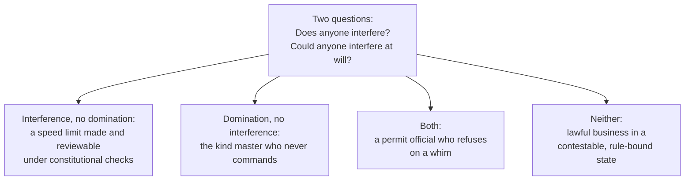

# Political Philosophy · Lesson 3.1: Three concepts of liberty

> ⏱ ~15 min · Module 3: Liberty and its limits · Builds on: [1.1 The problem of political authority](01-01-the-problem-of-political-authority.md), [2.5 Equality of what?](02-05-equality-of-what.md) · Unlocks: [3.2 Mill's harm principle](03-02-mills-harm-principle.md), [4.4 Feminist political philosophy](04-04-feminist-political-philosophy.md), [6.4 Who should provide?](06-04-welfare-property-and-subsidiarity.md)

## Why this matters

Module 3 asks what the state may stop you from doing. Before that question can be answered, you need to know what is lost when it stops you. "Freedom" is used for at least three different things, and the disagreement often hides inside the word. A libertarian says a tax on wages makes workers less free. A socialist says a worker who can be fired for no reason was never free. A Rousseauian says a citizen who lives under laws she helped make is free even when they compel her. All three may be using the word correctly. This lesson separates the three concepts so that later arguments can say which one they rely on.

## The idea

**[Negative liberty](../reference.md#negative-liberty).** Isaiah Berlin's Oxford inaugural lecture, "Two Concepts of Liberty" (1958), paraphrased: you are free to the extent that no other person interferes with what you could otherwise do. Unfreedom needs *human* prevention. If you cannot fly, or cannot afford a flight, that is inability, not unfreedom. It counts as unfreedom only when others deliberately stop you. The question it answers is *how large is the area in which I am left alone?* Hobbes and Bentham held versions of it, and on this view every law reduces someone's liberty, even a good law.

**[Positive liberty](../reference.md#positive-liberty).** The second question is *who governs me?* You are free to the extent that you are your own master: your choices come from your own reason rather than from compulsion, addiction or manipulation. Extend this to the group and you get collective self-government: a people is free when it makes its own laws. Charles Taylor (1979) put the contrast compactly. Negative liberty is an *opportunity* concept, about the options open to you. Positive liberty is an *exercise* concept: you are free only when you actually direct your own life.

**[Freedom as non-domination](../reference.md#freedom-as-non-domination).** Philip Pettit (*Republicanism*, 1997) and Quentin Skinner (*Liberty before Liberalism*, 1998) recovered an older, republican idea. You are unfree when someone has the *capacity* to interfere in your choices on an arbitrary basis, whether or not they ever use it. Interference is arbitrary when the person interfering is not forced to track the interests and judgments of the person interfered with. The test case is the **benevolent master**. A slave whose master is kind, and never gives an order, suffers no interference. Yet he lives at another's mercy, and he cannot speak his mind without first checking the master's mood. The republican says he is plainly unfree. On negative liberty, strictly read, he is free.

Two refinements cut across all three.

**[MacCallum's triadic analysis](../reference.md#triadic-analysis-of-freedom)** (Gerald MacCallum, "Negative and Positive Freedom", *Philosophical Review*, 1967). Every freedom claim has three places: *agent x is free from constraint y to do or become z*. "Freedom from" and "freedom to" are not two kinds of freedom. They are two slots in one relation. On this view the camps disagree about the variables. Who counts as the agent: the empirical self, or the "true" self? What counts as a constraint: only deliberate interference, or also inner compulsion, poverty, or a master's power? What counts as a z worth caring about?

**[Freedom vs the worth of freedom](../reference.md#worth-of-liberty).** Rawls (*A Theory of Justice*, §32) keeps liberty narrow. Lacking money does not shrink your liberty. It lowers the *worth* of your liberty to you. G. A. Cohen ("Freedom and Money", 2001) replies on negative liberty's own terms. Try to board the train to Glasgow without a ticket and the conductor will put you off, with the state behind him. Lacking money exposes you to interference, so poverty is negative unfreedom after all. This is the analytic form of the old charge, met in [Marx](../../history-of-political-thought/lessons/06-05-marx-from-hegel-to-historical-materialism.md), that formal rights can coexist with real unfreedom.

## The argument

Berlin did not reject positive liberty as a confusion. His charge is that it is dangerous. **The totalitarian-risk argument**, paraphrased:

1. **(Conceptual)** Positive liberty is self-mastery: being ruled by one's rational self rather than by passion or ignorance.
2. **(Conceptual)** This splits the self in two: a "higher", rational self and a "lower", empirical one.
3. **(Empirical-epistemic)** Others, such as a party, a church or a state, may claim to know what my rational self would choose better than I do.
4. **(Normative)** If freedom is acting on my rational self's will, then making me do what that self would choose does not violate my freedom. It realizes it. *In words:* coercion in the name of my true self is not coercion of *me*.
5. **∴ C.** Positive liberty, unlike negative liberty, can license unlimited coercion described as liberation. Rousseau's "forced to be free" ([`history-of-political-thought` 4.4](../../history-of-political-thought/lessons/04-04-rousseau-the-social-contract.md)) is Berlin's chief exhibit.

Berlin also describes a quieter path, **the retreat to the inner citadel**. If I cannot get what I want, I can make myself free by ceasing to want it, as the Stoic and the ascetic do. On the self-mastery view that counts as a gain in freedom. Berlin thinks that shows the view has gone wrong: by the same logic, a tyrant could free his subjects by teaching them to want nothing.

**The republican argument against both**, in short form: (P1) the kindly-mastered slave is unfree; (P2) he suffers no interference; (P3) his unfreedom need not involve any failure of self-mastery; ∴ freedom is neither non-interference nor self-mastery. The republican identifies the missing ingredient as *status*: being nobody's subject.

**Where the argument is weakest.** In Berlin's argument, the move from premise 3 to premise 4. A positive-liberty theorist such as Taylor accepts premises 1 and 2. He denies that anyone else's *claim* to know my rational will gives them a right to act on it. Self-mastery is something I must achieve myself, so it cannot be imposed from outside. If that is right, the slide is a historical abuse of the concept rather than something the concept entails, and the same could be said of negative liberty's abuses. Berlin's reply is that the abuse is not accidental: once freedom is located in a "true" self, *someone* will speak for it. Whether that is a conceptual point or a prediction about history is exactly what is in dispute.

## Map of positions

The negative theorist counts the top-left and the "both" cell as losses of freedom. The republican counts the kind-master and "both" cells. The two concepts disagree on exactly two cells. A just, contestable law limits your options but, on Pettit's terms, only *conditions* your freedom rather than compromising it. The kind master compromises it without lifting a finger.

## Worked examples

**Example 1 (clean): one case, three ways.** Invented case. In the Republic of Varden, employment is at will. Noor's employer may dismiss her for any reason, including her political posts online. He never has, and he seems decent. Noor has stopped posting anyway.

- **Negative liberty.** No one has interfered with Noor; there has not even been a threat. She is free to post. Her silence is a prudent choice, and her freedom is intact.
- **Positive liberty.** The question moves inside. Is her silence her own reasoned choice, or fear governing her? There is no clear verdict: a calm calculation that the job matters more looks like self-mastery. At the collective level, the question is whether Noor shares in making Varden's employment law.
- **Non-domination.** Noor is dominated. Her employer can interfere arbitrarily, and her self-censorship is the anticipatory deference Pettit predicts dominated people will show. It is the symptom, not a free choice that happens to coincide with what he wants.
- **MacCallum's diagnosis.** All three agree on x (Noor) and z (posting). They disagree on y: an actual act of interference, an inner compulsion, or an unchecked power.

The remedies differ too. A for-cause dismissal rule is *more* interference with the employer, so the negative theorist counts it as a trade of one liberty for another. The republican counts it as a net gain in freedom, because it removes a power, not just its use.

**Example 2 (hard): a benevolent, unchecked power.** Invented case. In the town of Halden, one commissioner issues street-vendor permits with unreviewable discretion. The current commissioner, Ms Arvo, is scrupulous: every competent applicant has been approved for a decade. A reform would replace her discretion with published criteria and an appeal board, at the cost of fees and months of delay.

- **Negative liberty** says the reform *reduces* vendors' freedom: more requirements and more delay, and no interference removed, because there was none.
- **The republican** says the reform increases freedom, because vendors no longer hold their livelihoods at one person's pleasure.
- **Where it strains.** The appeal board's final word is also unchecked. Every system ends somewhere in a power no one reviews. So "arbitrary" has to mean something like *not adequately controlled by those subject to it*, and the theory does not say how much control is enough. Pettit does not want to define arbitrariness as injustice, since then freedom would collapse into justice. Without that definition, though, it is unclear where the threshold sits.
- **The negative theorist's counter.** Ian Carter and Matthew Kramer (both 2008) argue that unchecked power *does* reduce negative liberty, because it makes interference more likely and removes combinations of options a vendor could otherwise count on. On this view the kind master's slave is less free in the negative sense too, and non-domination is just security against interference. Republicans reply that the *status* of living at someone's mercy is the wrong, whatever the probabilities.

Where the concepts stop: they tell you what the reform buys and what it costs. They do not tell you whether a decade of Ms Arvo's good behaviour is worth less than a reviewable rule with its fees and delays.

## Watch out

- **You might think a legitimate law cannot reduce your freedom, but actually that runs together two of 1.1's questions.** On negative liberty every law, legitimate or not, reduces someone's liberty. [Legitimacy](../reference.md#power-legitimacy-authority-obligation) asks whether the state *wrongs* you by imposing the law, not whether you lose liberty. Only the republican links the two, by saying that non-arbitrary law conditions freedom without compromising it. Do not infer "legitimate, so no loss of freedom", or "reduces freedom, so illegitimate".
- **You might think positive liberty means having the resources to act, but actually Berlin's positive liberty is self-mastery.** Resources belong to the worth-of-liberty debate (Rawls, Cohen) or to capabilities ([2.5](02-05-equality-of-what.md)). And after MacCallum, "freedom from" vs "freedom to" marks no real difference: every freedom is from something, to do something.
- **You might think Berlin proved that positive liberty leads to tyranny, but actually premise 3 is an empirical and historical claim about how the idea has been used.** It is not a logical consequence of self-mastery. Asking which kind of claim carries the argument is the first move against it.

## One-liner

> Negative liberty asks how far others leave you alone, positive liberty asks whether you govern yourself, and republican liberty asks whether anyone could interfere with you at will; MacCallum shows all three fill the same slots, x free from y to do z, with different y's.

## Problems

**P1 (🟢) *(Exegetical (a)-(b).)*** Diagnose. An **invented** speech at a Varden transport hearing, not the words of any real person:

> (i) "No one stops a family without a car from visiting the coast. The trains run for everyone."
> (ii) "A man ruled by his gambling is not free, and a law that helps him master it sets him free."
> (iii) "As long as landlords can end a lease at will, tenants live at their mercy, however decent most landlords are."

(a) For each sentence, name the concept of liberty it invokes (negative, positive, non-domination). One line each. (b) Give Cohen's reply to sentence (i), and say whether it accepts or rejects the concept (i) uses. Two sentences.

**P2 (🟡) *(Exegetical (a) · Evaluative (b).)*** Apply to a hard case. Invented case. Rina delivers for Halden's only delivery app. The app may deactivate any courier under rules that it writes, can change without notice, and does not publish. Rina has never been deactivated. (a) What do negative liberty and non-domination each say about Rina's freedom today? Two sentences each. (b) The company proposes to publish its rules and add an appeal panel staffed by its own employees. Does this end Rina's domination? Reach a verdict and say where non-domination stops determining one. 120 words or fewer.

**P3 (🔴, optional) *(Evaluative.)*** Counterexample. Build one invented case in which the republican account says a person is fully free (no domination) but she seems clearly unfree, in 80 words or fewer. Then give the republican's best reply in two sentences.

Solutions

**P1** *(Exegetical (a)-(b), strict)*

**Must hit, strict (a):**

- (i) Negative liberty: freedom is the absence of human prevention, and inability through lack of means is not unfreedom.
- (ii) Positive liberty as self-mastery, with the "true self" step Berlin warns about: coercion described as liberation.
- (iii) Freedom as non-domination: the capacity to interfere at will is the problem, whatever landlords actually do ("however decent").

**Must hit, strict (b):**

- Cohen: a family without fare money who boards the train will be removed by the conductor, backed by the state, so lack of money exposes them to interference.
- He accepts negative liberty and argues on its terms that poverty is unfreedom. He does not switch to positive liberty or to the worth of liberty.

**Wrong turns:** filing (ii) as negative liberty because the law removes an obstacle (the gambling compulsion is internal, which only the positive concept counts); filing (iii) as negative liberty because evictions are interference (the sentence locates the wrong in the power, "however decent"); presenting Cohen as Rawls, who says poverty lowers only the *worth* of liberty.

**Model answer:** (a) (i) negative; (ii) positive, self-mastery; (iii) non-domination. (b) Without a ticket the family would be put off the train by the conductor and, behind him, the state, so lacking money is being exposed to interference. Cohen accepts the speaker's negative concept and turns it against the conclusion.

---

**P2** *(Exegetical (a), strict · Evaluative (b), any verdict)*

**Must hit, strict (a):**

- Negative liberty: Rina has suffered no interference (and no threat aimed at her), so her freedom is not reduced. At most, on the Carter-Kramer reading, the risk of deactivation lowers her negative freedom probabilistically.
- Non-domination: she is dominated. The company has the capacity to interfere on an arbitrary basis, under rules it writes and changes unilaterally, and this holds even though it has never used that power.

**Must hit, any verdict (b):**

- A verdict, separate from the reasoning.
- State the test: interference is non-arbitrary when it is forced to track the interests and judgments of those subject to it.
- Run it on the proposal: publication makes the power rule-bound (procedural non-arbitrariness); an appeal panel answerable to the company leaves the rules under the company's sole control (no control by those subject to them).
- Say where the principle stops: how much external control is enough (an independent panel? a union? the ability to leave for another app?), which the theory does not fix without collapsing arbitrariness into injustice.

**Wrong turns:** answering (a) as "unfree on both views" (strict negative liberty needs actual interference); treating publication alone as settling (b) (published rules the company can still rewrite at will leave the capacity intact).

**Model answer (b), one of several:** Not fully. Publishing the rules makes deactivation predictable, which removes one kind of arbitrariness: Rina can now see what will trigger it. But the company still writes and changes the rules, and its own employees decide appeals, so its interference is not forced to track Rina's interests. It tracks them only so far as the company chooses. The domination is narrowed, not ended. Non-domination stops giving a verdict at the threshold: would an independent appeal body be enough, or must couriers share in setting the rules, or have a second app to move to? Pettit's account says control must run to the person subject to the power, but it does not say how much.

---

**P3** *(Evaluative, any verdict)*

**Accept:** any invented case where no one holds an arbitrary capacity to interfere (the power involved is contestable and forced to track the person's interests, or there is none), yet the person is heavily restricted, for example by a non-arbitrary law or by severe poverty with no one at fault. The reply must use the republican's own resources.

**Must hit, any verdict:**

- The case must make the absence of domination explicit: the restriction comes from a power under the subject's control, or from no agent at all.
- The intuition of unfreedom must rest on lost options, not on hidden domination.
- The reply uses the conditioning/compromising distinction, or argues that the case conceals domination after all.

**Wrong turns:** a case that secretly contains arbitrary power, such as a curfew a governor can extend at will, which the republican already counts as unfree; replying by redefining freedom as non-interference, which abandons the view.

**Model answer, one of several:** During an epidemic, Varden's parliament imposes a four-week stay-at-home order. It was enacted by fair procedures, it is subject to independent court review, and it expires automatically. Dana, healthy and law-abiding, may not leave home. No one holds arbitrary power over her, but she seems as unfree as anyone. *Reply:* Pettit grants that the order reduces her range of options. That *conditions* her freedom, as a mountain range would, without *compromising* her status as nobody's subject, and status is what republican freedom names. If the order could be extended at will, it would become domination, and the republican verdict would change.

## Flashback

**From Lesson [2.5](02-05-equality-of-what.md) (Equality of what?):** *(Formal (a) · Exegetical (b).)* Invented numbers. Two neighbours on the invented island of Lisk share 12 loaves. Assume, for the welfarist's sake, that their welfare levels are comparable. Tova's welfare from $x$ loaves is $u_T = x$. Wren grew up in long hardship and has learned to expect little: from $y$ loaves she reports $u_W = 6 + \tfrac12 y$, and 6 even with none. (a) Find the division that equalizes welfare, and run the envy test on it. Then give the only envy-free division and the welfare levels it yields. (b) Which objection to welfare as the currency does the case illustrate, and which premise of Sen's argument for capabilities does it support? Does Arneson's equal opportunity for welfare, as 2.5 states it, remove the problem? Two sentences.

Solution

**Worked arithmetic (a):** Equal welfare with $x + y = 12$:

$$x = 6 + \tfrac12(12 - x) \;\Rightarrow\; \tfrac32 x = 12 \;\Rightarrow\; x = 8,\; y = 4.$$

Both score 8: $u_T = 8$, $u_W = 6 + \tfrac12(4) = 8$. Envy test:

- Tova: own bundle 8; Wren's $4$. No envy.
- Wren: own $8$; Tova's $6 + \tfrac12(8) = 10 > 8$. **Wren envies Tova.** The welfare-equal division is not envy-free.

With one good that both always want more of, any unequal split leaves the smaller holder envying the larger, so the only envy-free division is $(6, 6)$: welfare $u_T = 6$, $u_W = 6 + \tfrac12(6) = 9$. Equality of welfare takes 2 loaves *from* Wren because she is content with less.

**Must hit, strict (b):**

- The objection is adapted contentment, the mirror image of expensive tastes that Sen presses: a person who has learned to want little scores high on welfare, so a welfarist owes her less.
- It supports premise 2: welfare measures advantage by mental states, which adapt to deprivation.
- Arneson's revision screens out welfare gaps that arise from *choice*. Wren's adaptation was not chosen, so that screen does not touch it; her prospects are still measured in welfare, which her adaptation inflates.

**Wrong turns:** reading the case as expensive tastes (Wren wants *less*, not more); calling $(8, 4)$ envy-free because Tova does not envy (the test needs no one to envy anyone); saying Arneson's view fixes the case because it concerns opportunity (the problem is the measure, not responsibility). Also accept, as a further point: a welfarist can measure welfare by informed or idealized preferences instead of reported satisfaction, but that is a change of measure, not the opportunity revision.

**Model answer (b):** This is Sen's adapted-contentment case, and it backs premise 2: Wren's reported welfare has adjusted to hardship, so equalizing welfare moves bread away from the person who has long had least. Arneson's revision only screens out gaps that come from choice, and Wren never chose to expect little, so a view that still counts advantage in welfare inherits the distortion.

## Connections

- **Backward:** [2.5](02-05-equality-of-what.md)'s capabilities are freedoms to achieve, which is close to the worth-of-liberty side of this lesson rather than Berlin's positive liberty. [1.1](01-01-the-problem-of-political-authority.md)'s four-way distinction is why "this law reduces freedom" and "this law is illegitimate" are different claims. Foot's negative versus positive duties in [`ethics` 3.1](../../ethics/lessons/03-01-doing-and-allowing.md) have the same shape (not to be interfered with vs to be helped), but the two distinctions are independent: the republican claim, for example, is about neither.
- **Forward:** [3.2](03-02-mills-harm-principle.md) asks when the state may interfere, which is a question posed in negative-liberty terms. [4.4](04-04-feminist-political-philosophy.md) takes the dependence of wives and carers as a central case of domination. [6.4](06-04-welfare-property-and-subsidiarity.md) defends basic income as non-domination: a worker who can walk away cannot be mastered.
- **Sideways:** the republican tradition as history is Machiavelli's *vivere libero* in [`history-of-political-thought` 3.2](../../history-of-political-thought/lessons/03-02-machiavelli-the-discourses.md) and Wollstonecraft's attack on arbitrary power in marriage in [5.4](../../history-of-political-thought/lessons/05-04-wollstonecraft-rights-virtue-and-education.md). The creditor who may cut you off at pleasure is the debt-thread case of domination, in [`philosophy-of-debt` 3.3](../../philosophy-of-debt/lessons/03-03-what-may-be-pledged.md). The negative/positive distinction as a tool for spotting verbal disputes is [`philosophical-method` 3.2](../../philosophical-method/lessons/03-02-distinctions-and-verbal-disputes.md).
