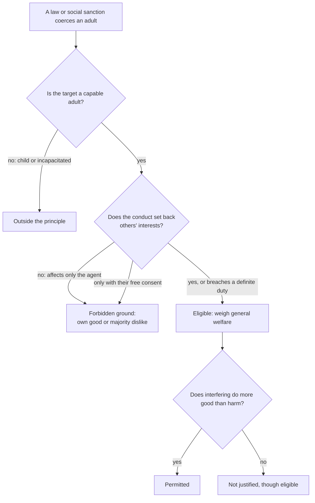

# Political Philosophy · Lesson 3.2: Mill's harm principle

> ⏱ ~15 min · Module 3: Liberty and its limits · Builds on: [3.1 Three concepts of liberty](03-01-three-concepts-of-liberty.md), [1.1 The problem of political authority](01-01-the-problem-of-political-authority.md) · Unlocks: [3.3 Paternalism and legal moralism](03-03-paternalism-and-legal-moralism.md), [3.4 Free speech](03-04-free-speech.md)

## Why this matters

[3.1](03-01-three-concepts-of-liberty.md) asked what liberty *is*. This lesson asks what may override it. Every law restricts somebody, so "is this law an infringement of liberty?" is always yes and never settles anything. What you need is a principle of *grounds*: a list of the reasons that can justify coercion and the reasons that never can. Mill's *On Liberty* (1859) offers the most famous one in the language, and most modern debate about drug laws, helmet laws and morals legislation is an argument about where it bends.

## The idea

Mill's claim is about **reasons, not outcomes**. It does not say which laws are good. It says which considerations are even admissible when society coerces an adult: preventing harm to *others* is admissible; the person's own good is not; the majority's dislike is not.

Three features to fix at once.

1. **Scope.** The principle governs "compulsion and control" by *anyone*: legal penalties, and also the "moral coercion of public opinion". It is not only a limit on the state. It does not limit advice, argument or avoidance; you may remonstrate with a drunk as much as you like.
2. **Self- vs other-regarding conduct.** Conduct that affects only the agent, or others only "with their free, voluntary, and undeceived consent and participation", is the agent's own business ([self- and other-regarding conduct](../reference.md#self-and-other-regarding-conduct)). Ch. 4 adds the working test: once conduct "affects prejudicially the interests of others", society has jurisdiction, and whether to interfere becomes a question of general welfare.
3. **Necessary, not sufficient.** Harm to others makes interference *eligible*; it does not make it right. Ch. 5's example: the winner of a competitive examination harms every loser, and society rightly lets that harm stand.

Mill also lets society compel some *positive* acts: giving evidence in court, a fair share of the common defence, and rescuing someone when that is obviously a duty (ch. 1). Failing to prevent harm can itself be a harm, though he says compulsion here needs more caution.

## Source

*On Liberty*, ch. 1 (1859; Gutenberg text).

> That the only purpose for which power can be rightfully exercised over any member of a civilised community, against his will, is to prevent harm to others. His own good, either physical or moral, is not a sufficient warrant. He cannot rightfully be compelled to do or forbear because it will be better for him to do so, because it will make him happier, because, in the opinions of others, to do so would be wise, or even right. These are good reasons for remonstrating with him, or reasoning with him, or persuading him, or entreating him, but not for compelling him, or visiting him with any evil in case he do otherwise. To justify that, the conduct from which it is desired to deter him must be calculated to produce evil to some one else. [...] Over himself, over his own body and mind, the individual is sovereign.

Three words carry the weight. **"Civilised"** builds in the exclusions. **"Against his will"** means consensual dealings fall outside. **"Even right"** is the radical bit: not even a *correct* moral judgment about his self-regarding conduct licenses coercion, which is what separates Mill from the [legal moralist](../reference.md#legal-moralism) of [3.3](03-03-paternalism-and-legal-moralism.md).

**The exclusions, stated accurately.** The next paragraph limits the doctrine to "human beings in the maturity of their faculties": not children, and not "backward states of society", for which Mill calls despotism legitimate *provided* the end is their improvement and the means actually achieve it. His stated criterion is a capacity: liberty applies once people can be improved "by free and equal discussion". Critics (Uday Singh Mehta, *Liberalism and Empire*, 1999) argue that the criterion was applied by an East India Company official to whole peoples, so the principle's universality was conditional on a civilizational verdict. Defenders reply that the capacity test can be detached from Mill's application of it, and that every liberal theory needs *some* line for children and the incapacitated. Either way, the exclusion is part of the text, not a later gloss.

## The argument

Mill disclaims "abstract right" and rests everything on utility: "utility in the largest sense, grounded on the permanent interests of man as a progressive being". Reconstructed:

- **P1 (Normative).** Utility in that large sense is the ultimate appeal on ethical questions.
- **P2 (Empirical).** Each adult is, in general, the best judge and most interested guardian of his own good; when society overrules him on self-regarding matters it usually acts on its own likes and dislikes, and usually gets it wrong.
- **P3 (Normative, ch. 3).** Choosing one's own plan of life develops the distinctive human faculties (judgment, discrimination, self-control), and that development is itself a principal part of well-being: the [argument from individuality](../reference.md#argument-from-individuality). People who let custom choose need only the "ape-like" faculty of imitation.
- **P4 (Empirical, ch. 3).** Varied "experiments of living" produce the new ideas on which everyone's progress depends, including the progress of those who never deviate.
- **∴ C.** Society should adopt, as a rule held *absolutely*, the [harm principle](../reference.md#harm-principle): coerce adults only to prevent harm to others.

*In words:* coercing people for their own good loses on three counts at once. It is usually mistaken (P2), it stunts the person (P3), and it starves society of experiments (P4).

**Two interpretive disputes.** (i) *Affecting others vs harming them.* Almost everything affects someone. J. C. Rees ("A Re-reading of Mill on Liberty", *Political Studies*, 1960) argued that Mill's real test is conduct that affects others' *interests*, not conduct that merely has effects on them. That is why a neighbour's disgust does not count. (ii) *Interests vs rights.* Ch. 4 distinguishes acts that violate others' "constituted rights" (punishable by law) from acts merely "wanting in due consideration" for them (punishable by opinion only). So "harm" may mean setback to interests (Feinberg's later analysis) or rights violation, and the legal sanction tracks the narrower reading.

**Where the argument is weakest.** The step from P1 to an *absolute* rule. James Fitzjames Stephen (*Liberty, Equality, Fraternity*, 1873) pressed it: if utility is the ultimate appeal, any case where coercing self-regarding conduct does more good than harm is a case where utility *requires* coercion, so the principle can be at most a rule of thumb. The indirect-utilitarian reply (John Gray, *Mill on Liberty: A Defence*, 1983) is that a rule held firmly does better than case-by-case calculation, because the calculators are the biased majorities of P2. The critic's rejoinder: then the principle is only as strong as that empirical bet, and wherever bias is absent the exceptions return. The alternative reading is that P3 does the real work. In that case Mill is defending a perfectionist ideal of autonomy, and the label "utility" is doing little.

## The argument map

The principle only does work at the second diamond. The third diamond is ordinary utilitarian weighing, which is why harm is necessary but not sufficient.

## Worked examples

**Example 1 (clean): three laws in the invented Republic of Varden.**

- *A noise ordinance* banning amplified music in residential streets from 11 p.m. to 7 a.m. Neighbours' sleep is a setback to their interests, not a matter of taste. **Eligible**, and plausibly permitted on welfare grounds.
- *A helmet law for adult motorcyclists.* The rider's risk is to himself. **Forbidden ground.** The usual reply, that crashes cost the public hospital, is what Mill calls "constructive injury". It violates no specific duty to the public and hurts no assignable person, and he says society "can afford to bear" it for the sake of freedom.
- *A ban on a harmless minority custom:* a minority eats horsemeat, and the majority finds it revolting. Revulsion is not harm. **Forbidden.** This is Mill's own ch. 4 case transposed (a Muslim majority banning pork). He notes that the majority's disgust is sincere and religiously grounded, and still gives it no weight.

**Example 2 (hard): a legal recreational stimulant.** Varden debates whether to ban, restrict or label it.

- *Use by adults:* self-regarding. A ban on use is forbidden.
- *Sale:* trade is a social act, so it falls within society's jurisdiction (ch. 5). But Mill says bans on selling a commodity infringe the *buyer's* liberty, so they cannot be justified as if only the seller were affected. A required warning label is permitted: no buyer can want not to know what he is buying, so the label overrides no one's will. Mill also says a dealer's financial interest in promoting excess justifies some restrictions and guarantees.
- *A user who neglects his children or debts:* Mill's ch. 4 rule is to punish the breach of a "distinct and assignable obligation", not the drug use. He would be punished identically if he had lost the money in a prudent investment.

Where the principle stops. First, *diffuse harm*: if each sale adds a tiny risk of, say, impaired driving, is the aggregate a "definite risk of damage" to the public or only constructive injury? The text gives the two categories but no threshold. Second, *consent*: harms consented to fall outside, but if the drug impairs later choice, whether continued use is "free, voluntary, and undeceived" is exactly the question of soft paternalism, taken up in [3.3](03-03-paternalism-and-legal-moralism.md). Both are empirical questions about the drug wrapped around a conceptual question about "harm", and the principle settles neither.

## Watch out

- **You might think the harm principle says preventing harm justifies coercion, but actually it says only that nothing else can.** Harm is necessary, not sufficient (the examination losers).
- **You might think a law that passes the harm principle thereby has [authority](../reference.md#power-legitimacy-authority-obligation) over you, but actually the principle is about which grounds can justify an exercise of power** ([1.1](01-01-the-problem-of-political-authority.md)). Whether the state that enacts a permitted law has the right to rule, or whether you have a duty to obey it, are separate questions that the harm principle does not answer.
- **You might think "drug use harms families" settles the case, but actually it bundles three claims.** That use leads to neglect is empirical. Whether the neglect is "harm" in Mill's sense or constructive injury is conceptual. Whether it warrants coercion of the user, rather than enforcement of the parent's duty, is normative.

## One-liner

> Mill's principle is a filter on reasons: only harm to others' interests makes coercion of an adult eligible, never his own good or the majority's distaste, and the whole thing rests on a utilitarian bet that its critics say cannot carry an absolute rule.

## Problems

**P1 (🟢) *(Exegetical.)*** Invented laws in Varden. For each, say whether the harm principle as Mill states it (chs. 1, 4) **forbids** the law or makes it **eligible**, with a one-line reason. (i) A ban on adults drinking spirits at home alone. (ii) A penalty for a train driver found drunk on duty. (iii) A law compelling a reluctant eyewitness to testify at a robbery trial. (iv) A fine on anyone who gambles more than 1,000 crowns a month. (v) Enforcement, with penalties, of child-maintenance orders against a parent whose gambling has left him unable to pay. Then, in one sentence, name the distinction in ch. 4 that separates (iv) from (v).

**P2 (🟡) *(Exegetical (a) · Evaluative (b).)*** Reconstruct. From *On Liberty* ch. 3:

> He who lets the world, or his own portion of it, choose his plan of life for him, has no need of any other faculty than the ape-like one of imitation. He who chooses his plan for himself, employs all his faculties. He must use observation to see, reasoning and judgment to foresee, activity to gather materials for decision, discrimination to decide, and when he has decided, firmness and self-control to hold to his deliberate decision. [...] It is possible that he might be guided in some good path, and kept out of harm's way, without any of these things. But what will be his comparative worth as a human being? It really is of importance, not only what men do, but also what manner of men they are that do it.

(a) Reconstruct the argument against coercing self-regarding conduct in 3–5 numbered premises and a conclusion, marking any premise you supply. (b) Flag the weakest premise and say in two sentences what a critic says against it.

**P3 (🔴, optional) *(Evaluative.)*** Steelman and reply. State the strongest objection to grounding an absolute harm principle in utility, then the best reply available to Mill, then say whether the reply succeeds. 150 words or fewer. Any verdict passes.

Solutions

**P1** *(Exegetical)*

**Must hit, strict:**

- (i) **Forbids.** Purely self-regarding; the drinker's own good is not a warrant.
- (ii) **Eligible.** He has disabled himself from a definite duty to the public; this is Mill's soldier or policeman "drunk on duty".
- (iii) **Eligible.** Giving evidence in court is one of the positive acts Mill explicitly says may be compelled (ch. 1).
- (iv) **Forbids.** The extravagance itself is self-regarding.
- (v) **Eligible.** The parent is punished for breaching a distinct and assignable obligation to his children, not for gambling.
- The distinction: conduct that violates a "distinct and assignable obligation" to others is taken out of the self-regarding class; the penalty attaches to the breach, not to its cause, which is the same whether the money went on gambling or a prudent investment.

**Wrong turns:** answering (i) or (iv) "eligible" because drinking or gambling *might* hurt the family; on Mill's view that is constructive injury until a definite obligation is breached. Saying the principle *requires* (ii), (iii) or (v): it makes them eligible, and whether to coerce is then a welfare judgment.

---

**P2** *(Exegetical (a) · Evaluative (b))*

**Must hit, strict (a):**

- A premise that choosing one's own plan of life exercises the distinctive faculties (observation, judgment, discrimination, self-control), and following others' choices does not.
- A premise that the development of those faculties is valuable in itself, a part of a person's worth or well-being, not only a means to good outcomes ("what manner of men").
- A supplied premise linking coercion to the loss: coercing self-regarding conduct substitutes others' choice for the agent's, so it denies exercise of the faculties in that domain.
- A conclusion against coercing self-regarding conduct even when it would keep the person "out of harm's way".

**Must hit, any verdict (b):**

- Names one premise and gives a critic's reason, for example: the value premise is perfectionist and contested (is self-development a part of utility, or a separate ideal?); or the link premise overgeneralizes (one narrow coercion, such as a helmet law, leaves almost all of a person's plan of life to his own choice).

**Wrong turns:** reconstructing ch. 1's harm-principle sentence instead of ch. 3's argument; treating the passage as claiming self-chosen lives always go better in outcome, when it explicitly concedes he "might be guided in some good path".

**Model answer (a):**

- **P1.** Choosing one's own plan of life exercises the distinctive human faculties; letting others choose exercises only imitation.
- **P2.** The development of these faculties is a principal part of a person's worth, independent of whether his choices turn out well.
- **P3** *(supplied)*. Coercing someone's self-regarding conduct puts others' choice in place of his, and so denies him that exercise.
- **∴ C.** Coercing self-regarding conduct costs a principal part of a person's worth, even when it improves his outcomes.

**Model answer (b), one of several:** P2 is weakest. A critic says it is a perfectionist ideal of the good life that many reasonable people (say, those who value fidelity to tradition) reject, so it cannot be the neutral ground of a principle meant to protect *their* choices too.

---

**P3** *(Evaluative)*

**Must hit, any verdict:**

- The objection, stated precisely: if utility is the ultimate appeal, then wherever coercing self-regarding conduct yields more utility, utility requires it, so the principle cannot be absolute (Stephen's line).
- A real reply: the indirect or rule-utilitarian defence (a firmly held rule beats case-by-case calculation by biased majorities, Gray), or the reading on which "utility in the largest sense" already includes individuality as a component, so coercion always costs something no calculation sees.
- A verdict with its reason, naming the premise the verdict turns on (the empirical bet about bias, or whether individuality is still "utility").

**Wrong turns:** answering that Mill was a rights theorist; he explicitly forgoes "abstract right". Treating the objection as "utilitarianism permits anything", which is not the point: the point is that an absolute rule and a maximizing foundation pull apart in particular cases.

**Model answer, one of several:** Objection: Mill makes utility the ultimate appeal, so any case where forbidding a self-regarding act does more good is a case where utility demands the ban; an absolute principle cannot rest on a maximizing foundation. Reply: what is evaluated is a *rule* for fallible, biased majorities. Granting case-by-case exceptions would hand coercive power to exactly the people who misjudge others' good, so the rule held without exceptions does better than any rule with them. Verdict: the reply partly succeeds. It explains why the rule should be firm in practice. But it makes the principle depend on an empirical claim about bias, so where an exception can be specified narrowly and checked independently, the foundation no longer forbids it. Mill's principle is then very strong, not absolute.

## Flashback

**From Lesson [2.6](02-06-luck-relations-priority-and-sufficiency.md) (Luck, relations, priority and sufficiency):** *(Formal (a) · Exegetical (b).)* Invented numbers. Three households have well-being $D=(16,49,81)$. A fixed budget can fund one of two programmes: $P_1$ raises household 1 from 16 to 25, giving $(25,49,81)$; $P_2$ raises household 2 from 49 to 81, giving $(16,81,81)$. Sufficiency threshold $T=20$. (a) For $D$, $P_1$ and $P_2$, compute the utilitarian sum, the prioritarian sum $\sum\sqrt u$, and the number of households below $T$, and say which programme each view prefers. Also give the priority weights $f'(u)=\frac{1}{2\sqrt u}$ at $u=16$ and $u=49$. (b) The prioritarian prefers the programme that gives the worst-off household nothing. Explain why, using your numbers, and name the view from the lesson that prefers the other programme. Two sentences.

Solution

**Worked arithmetic (a):**

- Utilitarian sum: $D=16+49+81=146$, $P_1=155$, $P_2=178$. Prefers $P_2$.
- Prioritarian sum: $D=4+7+9=20$, $P_1=5+7+9=21$, $P_2=4+9+9=22$. Prefers $P_2$.
- Households below $T=20$: $D$ one (at 16), $P_1$ none, $P_2$ one (at 16). Prefers $P_1$.
- Priority weights: $f'(16)=\frac{1}{8}=0.125$ and $f'(49)=\frac{1}{14}\approx 0.071$, so a unit to household 1 counts $\frac{7}{4}=1.75$ times a unit to household 2.

**Must hit, strict (b):**

- Priority weights are finite: household 1's units count 1.75 times as much, but $P_2$ delivers 32 units against $P_1$'s 9, and the exact gains in the prioritarian sum are 2 for $P_2$ against 1 for $P_1$.
- Sufficientarianism (counting who is below the threshold) prefers $P_1$, because only $P_1$ lifts household 1 over $T$. (Also accept: absolute priority for the worst off, maximin or the difference principle, prefers $P_1$, since the minimum rises from 16 to 25 only under $P_1$.)

**Wrong turns:** assuming prioritarianism always favours the worst off; that is absolute priority, and prioritarianism only weights. Even with the more concave $f(u)=\ln u$, $P_2$ still wins, raising the sum by about 0.50 against about 0.45 for $P_1$. Calling $P_2$ leveling down: no one loses under either programme.

**Model answer (b):** A unit to household 1 is weighted only 1.75 times a unit to household 2, and $P_2$ delivers 32 units to $P_1$'s 9, so it raises $\sum\sqrt u$ by 2 against 1. The sufficientarian prefers $P_1$, because it alone lifts everyone above the threshold of 20.

## Connections

- **Backward:** [3.1](03-01-three-concepts-of-liberty.md) gave three concepts of liberty; Mill works with the negative one and asks what may limit it. Utility as a moral theory, and Mill's proof of it, are owned by [`ethics` 1.1](../../ethics/lessons/01-01-classical-utilitarianism.md). The difference between justifying an exercise of power and having authority is [1.1](01-01-the-problem-of-political-authority.md).
- **Forward:** [3.3](03-03-paternalism-and-legal-moralism.md) takes the forbidden grounds one by one: soft and hard paternalism, Mill's own bridge and slavery-contract cases, the Hart-Devlin debate and Feinberg's offense principle. Mill allows offences against decency done in public to be prohibited (ch. 5), a concession 3.3 examines. [3.4](03-04-free-speech.md) applies the framework to speech, where ch. 2 gives liberty of discussion its own defence.
- **Sideways:** [`history-of-political-thought` 6.4](../../history-of-political-thought/lessons/06-04-mill-representative-government.md) places *On Liberty* beside *Representative Government*; the "active character" there is the individuality of ch. 3 here. [`philosophy-of-economics` 2.3](../../philosophy-of-economics/lessons/02-03-nudges-and-behavioural-welfare-economics.md) asks whether nudges, which coerce no one, escape the principle altogether. Rees's distinction between affecting others and affecting their interests is the same move as an economist's distinction between a technological externality and a pecuniary one: losing customers to a rival affects you through prices without wronging you, like Mill's examination losers.
