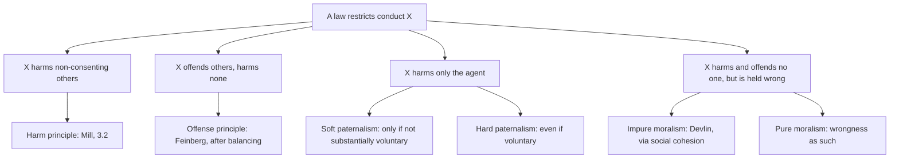

# Political Philosophy · Lesson 3.3: Paternalism and legal moralism

> ⏱ ~15 min · Module 3: Liberty and its limits · Builds on: [3.2 Mill's harm principle](03-02-mills-harm-principle.md), [3.1 Three concepts of liberty](03-01-three-concepts-of-liberty.md) · Unlocks: [3.4 Free speech](03-04-free-speech.md), [4.3 Perfectionism and the common good](04-03-perfectionism-and-the-common-good.md)

## Why this matters

Many laws that restrict adults prevent no harm to others: seat-belt rules, prescription-only medicines, decency ordinances, limits on what you may consent to. [3.2](03-02-mills-harm-principle.md) gave Mill's answer, that only harm to others licenses coercion. This lesson maps the three rival grounds that take over where the harm principle stops: harm to *self* (paternalism), *offense* to others, and *immorality* as such (legal moralism). The skill is diagnostic: say which ground a law actually rests on, because each faces a different objection.

## The idea

Run a restriction through four questions.

1. **Does the conduct harm, or seriously risk harming, people who have not consented?** If so, the [harm principle](../reference.md#harm-principle) is in play (3.2).
2. **Does it offend people, without harming them?** Then the question is whether the [offense principle](../reference.md#offense-principle) licenses it.
3. **Does it harm only the agent?** Then any restriction is **paternalism**: interference with a person's liberty for that person's own good. Gerald Dworkin's classic analysis ("Paternalism", *The Monist*, 1972) makes the justifying reason the mark: the reasons refer to the welfare of the person coerced.
4. **Does it harm or offend no one, but strike the community as wrong?** Then the restriction is **legal moralism**.

The most useful distinction inside paternalism is Joel Feinberg's (*Harm to Self*, 1986). [Soft and hard paternalism](../reference.md#soft-and-hard-paternalism):

- **Soft paternalism** may interfere with self-regarding conduct only when the conduct is not substantially voluntary, or to establish whether it is: ignorance, compulsion, delirium, a moment's panic.
- **Hard paternalism** may interfere even with a fully informed, voluntary choice, because the choice is bad for the chooser.

*In words:* soft paternalism protects your will from defects; hard paternalism protects you from your will. Feinberg held that soft paternalism is no real departure from liberalism, since it defends choices that are truly the person's own; hard paternalism is Mill's real rival. (Two further axes. Paternalism is **impure** when it restricts more people than it protects, as a ban on *selling* cigarettes restricts sellers to protect smokers. In Dworkin's later usage, **weak** paternalism interferes with chosen means, **strong** with chosen ends; older writers used "weak/strong" for soft/hard, so keep the pairs apart.)

**Mill's two anchors.** Both are in *On Liberty* ch. V. First, the unsafe bridge:

> "If either a public officer or any one else saw a person attempting to cross a bridge which had been ascertained to be unsafe, and there were no time to warn him of his danger, they might seize him and turn him back, without any real infringement of his liberty"

Liberty, Mill says, is doing what one desires, and the man does not desire to fall in. Where there is only a danger, not a certainty, he should be warned and left alone, unless he is a child, delirious, or too agitated to reflect. The bridge is soft paternalism's founding case: seize him only because he does not know.

Second, the slavery contract. A contract to sell oneself as a slave is void. Mill's reason is that we respect voluntary choice because it is evidence of what is good for the chooser, and a choice that ends all future choice defeats that very reason:

> "The principle of freedom cannot require that he should be free not to be free."

Whether this is soft paternalism, hard paternalism, or a separate principle about the inalienability of liberty is disputed. The slave-seller may be fully informed, which pushes it toward hard; Mill's reason concerns the value of future liberty, not a defect in the present choice.

**Nudges** sit off this map. A default or a reordered menu neither forbids a choice nor checks whether it is voluntary; it shapes the setting in which people choose. Libertarian paternalism is owned by [`philosophy-of-economics` 2.3](../../philosophy-of-economics/lessons/02-03-nudges-and-behavioural-welfare-economics.md); the point here is only that Feinberg's soft/hard axis concerns coercive interference, and a nudge is not coercive.

## The argument

The [Hart-Devlin debate](../reference.md#hart-devlin-debate) is the canonical clash over [legal moralism](../reference.md#legal-moralism). The Wolfenden Report (1957) recommended that private homosexual conduct between consenting adults stop being a crime, holding that there is a realm of private morality that is not the law's business. Patrick Devlin replied in his Maccabaean Lecture (1959), collected in *The Enforcement of Morals* (1965). His argument, reconstructed:

- **P1 (Conceptual).** A society is constituted by a community of ideas, including a shared morality; without one, there is no society, only individuals.
- **P2 (Empirical).** Deviation from that shared morality, if tolerated, loosens it, and a society whose morality loosens tends to disintegrate.
- **P3 (Normative).** A society may use law to preserve itself, as it may against treason.
- **∴ C1.** A society may use criminal law to enforce its shared morality, including against private conduct.
- **P4 (Normative-procedural).** The relevant morality is what the reasonable person (the juror; the law's stock man in the Clapham omnibus) would condemn after reflection, signalled by real intolerance, indignation and disgust.

*In words:* morality is the cement of society, and law may protect the cement. P1 and P2 together are the **disintegration thesis**. Devlin attached limits: maximum freedom consistent with society's integrity, respect for privacy, caution where moral feeling is shifting.

H. L. A. Hart (*Law, Liberty, and Morality*, 1963) replied in three moves.

1. **Against P1+P2.** Either "society" is *defined* as its current morality, in which case any moral change "destroys" society trivially, as a change in fashion does; or the claim is empirical, that tolerating private deviation produces social collapse, and Devlin offers no evidence for it.
2. **Positive vs critical morality.** P4 identifies the morality to enforce with what people actually feel. Hart separates *positive* morality (what a society accepts) from *critical* morality (the standards by which any society's morality is judged). Disgust tells you about the first.
3. **Distress is not harm.** Distress at the bare knowledge that others act as you think wrong cannot count as harm, or no liberty to do anything disapproved of could survive.

Hart also drew a distinction Devlin had blurred. Some laws that look moralistic, like the rule that consent is no defence to murder or serious assault, are better explained as paternalism. Hart accepted some paternalism while rejecting moralism, so the two grounds can be held apart.

Hart distinguished a **moderate thesis** (enforce morality because a shared morality holds society together: Devlin's main argument) from an **extreme thesis** (enforcing morality is valuable in itself, harm or no harm). Feinberg's later terms are close: **impure** legal moralism justifies enforcement by some further harm prevented; **pure** legal moralism counts wrongness alone. Natural-law theorists defend morals legislation as part of the state's care for the [common good](../reference.md#common-good), a position developed in [4.3](04-03-perfectionism-and-the-common-good.md) (the ethical theory is [`ethics` 4.5](../../ethics/lessons/04-05-the-new-natural-law-theory.md)).

**Feinberg's offense principle** (*Offense to Others*, 1985) occupies the middle ground. Its motivating device is a series of imagined episodes on a crowded bus you cannot leave, each one disgusting, shocking or embarrassing but harmless. Offense may be prohibited, Feinberg argued, only when it is serious enough, after **balancing**:

- the *seriousness* of the offense: its intensity, duration and extent; whether it was **reasonably avoidable**; whether the offended **consented**; and whether they are abnormally susceptible;
- against the *reasonableness* of the conduct: its importance to the actor, whether alternatives (another place or time) exist, whether it is done from malice, and the character of the neighbourhood.

**Where the argument is weakest.** For Devlin, P2. A critic says it is an empirical claim stated as if it were conceptual: it needs evidence that tolerating private deviance causes social breakdown, not merely that moral codes change. Devlin's defenders answer that P2 concerns a society's capacity to hold *any* common standards: a law that shrugs at what most people regard as grave wrongs teaches that nothing is shared. For Hart, the weak point is the third move: if offense counts for something, as Feinberg says it does, it is hard to say why mere knowledge of hidden wrongdoing counts for exactly nothing.

## Map of positions

Feinberg's liberal accepts the harm principle, the offense principle and soft paternalism, and rejects hard paternalism and both moralisms; critics of liberalism defend one or more of those.

## Worked examples

**Example 1 (clean): a prescription-only rule.** Invented law. The Republic of Varden makes a strong sleeping drug prescription-only: no adult may buy it without a doctor's authorization.

- *Harm to others?* Not in the ordinary case: an overdose harms the user.
- *Offense?* None.
- *Harm to self?* Yes, so the rule is paternalist. Is it soft? It binds the pharmacologist who knows the drug's risks exactly as it binds the confused, so for informed adults it is **hard** paternalism. It is also **impure**: it restricts sellers and doctors to protect buyers.
- A soft-paternalist alternative exists: a warning label and a pharmacist's question, after which anyone informed may buy. Mill himself, in ch. V, objected that requiring a medical certificate in every case makes a dangerous substance expensive and sometimes impossible to obtain for legitimate uses.

The diagnosis matters: if Varden instead says the drug is often used to harm *others*, the harm principle applies and the debate becomes empirical.

**Example 2 (hard): Devlin on an invented case.** The Isle of Carrow considers banning the private sale of steaks cultured from the eater's own cells. Nobody is harmed; buyers consent; nothing is done in public. Polls show widespread disgust, and a panel of randomly chosen citizens, after discussion, condemns the practice as degrading.

*Devlin's argument run:* the panel's reflective condemnation is the evidence P4 asks for. The shared morality includes a deep norm against treating human flesh as food. Tolerating a market in it loosens that norm (P2), and a society may defend its morality as it defends its institutions (P3). So the ban is permissible within Devlin's limits: it reaches only a commercial practice, and the feeling is not in flux.

*Hart's reply:* which reading of P1-P2 is meant? If Carrow's society *is* its current morality, then accepting the steaks only changes it. If the claim is that a market in self-cultured steaks will weaken trust, family or law-abidingness, that is an empirical prediction, and the panel's disgust is no evidence for it. The disgust is a fact of positive morality; whether the practice is wrong is a question of critical morality. And the distress of citizens who never see a steak is bare-knowledge distress, not harm.

*Where each stops giving a verdict.* Devlin's test cannot tell conviction from prejudice the panel would later disown. Hart says when disgust is *not* a reason, but not which practices really threaten social trust; that needs evidence neither side has.

## Watch out

- **You might think a statute's wrong ground makes the state illegitimate, but actually these are separate questions.** A legitimate state ([1.1](01-01-the-problem-of-political-authority.md)) may pass an unjustified moralistic law; whether citizens are obliged to obey it is a third question. And "most people are disgusted" is an empirical claim, never by itself a normative one.
- **You might think Devlin's argument is pure moralism, but actually it is impure.** It justifies enforcement by the harm of social disintegration, which is why its empirical premise carries the weight.
- **You might think "soft paternalism" means any gentle intervention, but actually Feinberg's term concerns voluntariness, not gentleness.** A mild fine on informed adults is hard paternalism; forcibly stopping the man on the bridge is soft. Behavioural economists sometimes use the phrase for non-coercive steering; that is a different axis.

## One-liner

> Where Mill's harm principle stops, three rivals take over: soft paternalism (protect choices that are not really voluntary), hard paternalism and legal moralism (protect people from their voluntary choices, or the community from its deviants), and Feinberg's balanced offense principle; Devlin defends moralism by a disintegration thesis that Hart reads as either trivially true or empirically unsupported.

## Problems

**P1 (🟢) *(Exegetical.)*** Diagnose. Four invented ordinances of the town of Marrowby. For each, name the ground it rests on (harm principle, offense principle, soft paternalism, hard paternalism, or legal moralism) and give the one feature that decides it. One line each.

(i) No tattoo parlour may tattoo a customer's face until 24 hours after the customer first requests it; after that the customer may proceed.
(ii) Wingsuit flying within 50 metres of terrain is banned for everyone, including licensed and experienced flyers, "for their own safety".
(iii) Nude sunbathing is banned in the town square and permitted on the signposted east beach.
(iv) A private, consensual practice is criminalized "because it is degrading, though no one is harmed and no one sees it".

**P2 (🟡) *(Exegetical (a)-(b).)*** Find the crux. Two invented commentators in the Republic of Andara debate a bill to ban keeping a deceased relative's body, preserved by taxidermy, at home, when the relative consented before death.

> **Commentator A:** "Whether anyone is harmed is beside the point. Reverence for the dead is part of the moral fabric that makes us one people. Once the law shrugs at this, the fabric frays, and a people without a common morality is no people at all."
>
> **Commentator B:** "Nobody has shown a single thread fraying. And the disgust of people who will never enter such a house is not an injury to them."

(a) Name the single premise in A's argument that B must deny, say which kind of claim it is (empirical, conceptual or normative), and give the two readings Hart says it admits. Three sentences. (b) Which further distinction of Hart's does B's second sentence use, and what kind of evidence would bear on the premise in (a)? Two sentences.

**P3 (🔴, optional) *(Exegetical (a) · Evaluative (b).)*** Apply to a hard case. The invented city of Carrow runs a gambling self-exclusion register. A person who signs up is barred from every casino for 12 months, and the bar cannot be lifted early. Ines signed after a ruinous night. Four months later, calm, solvent and fully informed, she asks to be removed so she can play at a friend's birthday evening. The register refuses. (a) Applying Feinberg's test to her *present* request, is the refusal soft or hard paternalism? One sentence with the reason. (b) Carrow's lawyer replies that the refusal is not paternalism at all: it enforces Ines's own earlier choice. Assess the reply, and say where Feinberg's test stops giving a verdict. 150 words or fewer. Any verdict passes.

Solutions

**P1** *(Exegetical — strict)*

**Must hit, strict:**

- (i) **Soft paternalism.** The delay screens out impulsive, not substantially voluntary choices, and anyone whose wish survives 24 hours gets the tattoo.
- (ii) **Hard paternalism.** It binds informed, experienced adults, and the stated reason is their own safety.
- (iii) **Offense principle.** Nudity harms no one; the rule targets offense to unconsenting onlookers, and the permitted beach makes the offense reasonably avoidable while leaving the conduct an alternative place.
- (iv) **Legal moralism (pure).** No harm, no offense, no self-harm cited: wrongness alone is the ground.

**Wrong turns:** calling (i) hard because it burdens the informed too: the burden is a delay that tests voluntariness, not a prohibition, which is what makes it soft. Calling (iii) moralism: the rule's spatial shape (allowed where onlookers choose to be) is the mark of an offense rule, balancing avoidability.

**Model answer:** (i) soft paternalism: a delay that filters impulse and then permits. (ii) hard paternalism: binds the fully informed for their own sake. (iii) offense principle: aimed at unconsenting onlookers, with an avoidable alternative venue. (iv) pure legal moralism: wrongness alone, with harm and offense expressly disclaimed.

---

**P2** *(Exegetical (a)-(b) — strict)*

**Must hit, strict (a):**

- The crux is the **disintegration thesis**: tolerating deviation from the shared morality loosens it, and a society whose morality loosens ceases to exist ("the fabric frays … no people at all").
- A presents it as if it were conceptual; as a claim that tolerance causes social breakdown it is empirical.
- Hart's two readings: if a society is *defined* by its current morality, the claim is true but trivial (moral change is just change, not destruction); if it is a causal claim about collapse, it needs evidence, and none is offered.

**Must hit, strict (b):**

- B's second sentence uses Hart's point that distress at the **bare knowledge** of others' conduct is not harm (closely tied to positive vs critical morality: the disgust is a fact about accepted morality, not proof of wrong).
- Bearing evidence: empirical evidence on whether societies that stopped criminalizing a widely condemned private practice showed declines in social cohesion (trust, cooperation, law-abidingness), compared with those that did not.

**Wrong turns:** naming "the practice is immoral" as the crux: B need not deny that, since A's argument is impure moralism and stands or falls with the disintegration step. Citing the offense principle for B's second sentence: offense requires perception, and these citizens never enter the house.

**Model answer:** (a) The crux is A's premise that tolerating the practice frays a shared morality without which the society ceases to exist, Devlin's disintegration thesis. A states it as conceptual, but as a claim about collapse it is empirical. Hart says it is either trivially true, if a society just is its current morality, or an unsupported causal claim. (b) B's second sentence uses Hart's denial that distress at the bare knowledge of others' private conduct counts as harm. What would bear on (a) is comparative evidence on whether decriminalizing condemned private practices was followed by measurable losses of social trust or cooperation.

---

**P3** *(Exegetical (a) — strict · Evaluative (b) — graded on moves, not verdict)*

**Must hit, strict (a):**

- Hard paternalism: her present request is stipulated to be informed and voluntary, and the refusal overrides it for her own good.

**Must hit, any verdict (b):**

- State the reply precisely: the restriction is self-imposed, so it is precommitment (like a contract the state enforces), not the state substituting its judgment for hers.
- Identify what it requires: that the earlier self's choice has authority over the later one, and say why that is contestable (the signing came after a ruinous night, arguably less voluntary than today's request).
- Say where Feinberg's test stops: it is indexed to the choice being overridden, and here two choices at two times conflict; the test does not say which time's voluntariness governs.
- Optional but strong: note the link to Mill's slavery contract, where Mill refused to enforce a self-binding that ends future liberty; a 12-month bar is limited and revocable in time, so the analogy may cut either way.

**Wrong turns:** calling the refusal soft because Ines is "a gambler": the case stipulates that her present choice is informed and calm. Treating the precommitment reply as obviously right or obviously wrong without saying which self's choice it privileges.

**Model answer (b), one of several:** The lawyer's reply has force: Ines bound herself, and enforcing a self-imposed rule looks like respecting her autonomy, as enforcing a contract does. But it works only if her earlier choice outranks her present one. The earlier choice was made after a ruinous night, and today's is calm and informed; on Feinberg's own standard, today's has the better claim to be substantially voluntary. Yet the register's value depends on being unbreakable in exactly the moments when a request *feels* calm. Feinberg's test stops here: it asks whether the overridden choice is voluntary, and with two voluntary-looking choices at two times it gives no verdict on which governs. Mill refused to enforce a self-binding that ended all future liberty; a 12-month bar is bounded, so on Mill's reasoning it is at least the easier case.

## Flashback

**From Lesson [3.1](03-01-three-concepts-of-liberty.md) (Three concepts of liberty):** *(Exegetical (a) · Evaluative (b).)* Find the crux. Invented case. Pavel, a student in the town of Brede, spends most evenings on a video app he calls a compulsion; he says he wants to study for his engineering exams, and doesn't. Three invented remarks, not the words of any real person:

> (i) "Nobody stops Pavel opening his books. He is perfectly free to study."
> (ii) "Pavel is not free to study: his compulsion, not Pavel, runs his evenings."
> (iii) "The real Pavel wants the degree. If the town blocks the app after 9 pm, it does not restrict Pavel; it frees him."

(a) Write each remark as a MacCallum triple (*x* is free from *y* to do *z*). Name the slot on which (ii) departs from (i), and the slot on which (iii) departs from (ii). Three lines and one sentence. (b) Does MacCallum's analysis show that Berlin's worry about positive liberty is a merely verbal dispute? Name the step in (iii) that Berlin's argument targets, and say whether the triadic form removes the danger or only relocates it. 100 words or fewer. Any verdict passes.

Solution

**Must hit, strict (a):**

- (i) *x* = Pavel as he is; *y* = deliberate interference by other people; *z* = studying. There is no such *y*, so he is free.
- (ii) *x* = Pavel; *y* now includes an inner compulsion; *z* = studying. It departs from (i) on *y*.
- (iii) *x* = Pavel's "real", rational self; *y* = the compulsion of his lower, empirical self; *z* = pursuing the degree. It departs from (ii) on *x*. Because the agent is now the rational self, the town's block stops counting as a constraint at all.

**Must hit, any verdict (b):**

- Berlin's target is the true-self step. Once the agent is identified with a rational self that others claim to know, coercing the empirical self in its name counts as realizing freedom, not violating it (premises 2 to 4; "forced to be free").
- MacCallum shows that the camps share one concept with different fillings. Say whether a dispute over how to fill *x* is still substantive. It is not verbal if the filling changes what the state may do.
- A verdict. *Removes:* you can accept (ii), that compulsion is a constraint, and reject (iii) with Taylor: self-mastery can't be imposed from outside, so the danger was never in the positive concept itself. *Relocates:* the danger now sits in the *x* slot, and Berlin's reply that someone will always speak for the true self applies there unchanged.

**Wrong turns:** reading (ii) as non-domination, when no one holds a power over Pavel; saying (iii) differs from (ii) only on *y* because it mentions the block, when the block drops out of *y* only because *x* has changed; concluding that MacCallum shows there is no disagreement at all.

**Model answer (b), one of several:** Berlin's target is (iii)'s move of identifying Pavel with a "real" self so that the town's block becomes liberation. MacCallum shows that (i)-(iii) use one relation with different fillings, but that does not make the dispute verbal. Whether *x* may be filled by a rational self that others speak for decides whether the block is coercion, and that is a normative question. So the triadic form relocates the danger rather than removing it: it shows exactly where the danger enters, in the agent slot. One can still endorse (ii) and refuse (iii), as Taylor does, but that refusal is a substantive premise that the triadic analysis does not supply.

## Connections

- **Backward:** [3.2](03-02-mills-harm-principle.md) gave the harm principle and its self-regarding sphere; this lesson maps the grounds that compete inside that sphere and at its edge. Mill's slavery contract turns on the value of future liberty, which [3.1](03-01-three-concepts-of-liberty.md) separated into negative, positive and republican forms.
- **Forward:** the offense principle is tested on its hardest case, hateful speech, in [3.4](03-04-free-speech.md). Morals legislation returns with natural-law perfectionism in [4.3](04-03-perfectionism-and-the-common-good.md), and exemptions from general laws in [6.3](06-03-conscience-and-exemptions.md).
- **Sideways:** nudges and libertarian paternalism are owned by [`philosophy-of-economics` 2.3](../../philosophy-of-economics/lessons/02-03-nudges-and-behavioural-welfare-economics.md); a usury cap as hard paternalism is [`philosophy-of-debt` 3.2](../../philosophy-of-debt/lessons/03-02-predatory-lending-and-usury-caps.md), and Mill's slavery contract applied to self-pledge is [`philosophy-of-debt` 3.3](../../philosophy-of-debt/lessons/03-03-what-may-be-pledged.md). Whether criminal law may enforce morality as a theory of criminalization belongs to [`philosophy-of-law`](../../philosophy-of-law/syllabus.md).
