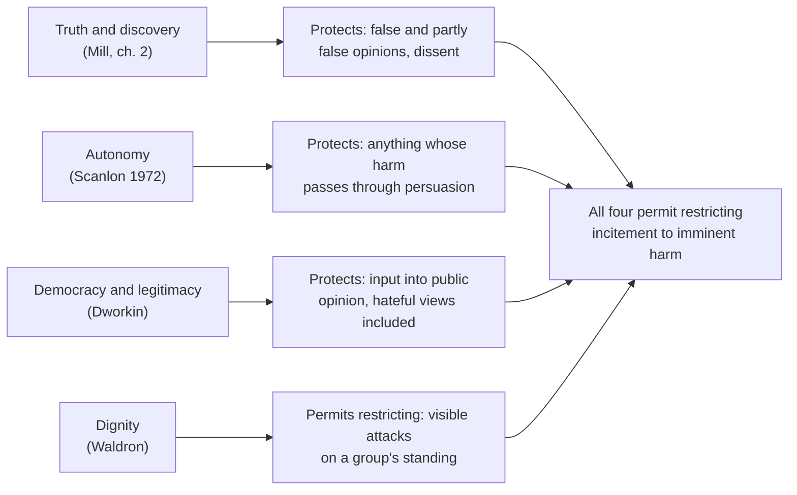

# Political Philosophy · Lesson 3.4: Free speech

> ⏱ ~15 min · Module 3: Liberty and its limits · Builds on: [3.2 Mill's harm principle](03-02-mills-harm-principle.md), [3.3 Paternalism and legal moralism](03-03-paternalism-and-legal-moralism.md) · Unlocks: [4.1 Political liberalism](04-01-political-liberalism.md), [4.2 Public reason and religious argument](04-02-public-reason-and-religious-argument.md)

## Why this matters

Speech is the hardest test of the liberty framework because it plainly *can* harm: it spreads falsehoods, stirs mobs, and tells some citizens they do not belong. If the [harm principle](../reference.md#harm-principle) of [3.2](03-02-mills-harm-principle.md) were the whole story, harmful speech would be fair game like any harmful act. Yet nearly every liberal tradition protects speech *more* than conduct, including speech that does damage. This lesson asks what could justify that extra protection, and what the strongest case for restricting hate speech says in reply.

## The idea

A free-speech principle is not the harm principle applied to words. It is a claim that some harms of expression **do not count** as reasons to restrict it, or count for less than the same harm caused another way. Four families of argument try to earn that claim ([four grounds for free speech](../reference.md#four-grounds-for-free-speech)):

- **Truth and discovery (Mill).** *On Liberty* ch. 2 closes by recapping four grounds. (1) A silenced opinion may be true, and to deny that is to assume we are infallible. (2) Even a false opinion often holds part of the truth, and the rest of the truth is supplied only by collision with rivals. (3) Even a wholly true received opinion, if never contested, is held as a prejudice, without grasp of its grounds. (4) Its very meaning then fades, and it becomes a formula that no longer shapes conduct. Grounds 1-2 concern *getting* the truth; 3-4 concern *holding* it well. Mill aims the argument at social pressure as much as at law, the "tyranny of the majority" he shares with Tocqueville ([`history-of-political-thought` 6.3](../../history-of-political-thought/lessons/06-03-tocqueville-tyranny-of-the-majority-and-soft-despotism.md)).
- **Autonomy (Scanlon).** In "A Theory of Freedom of Expression" (*Philosophy & Public Affairs*, 1972), T. M. Scanlon argued that a legitimate state must treat citizens as equal, autonomous, rational agents who make up their own minds. So it may not restrict expression on the ground that listeners will come to hold false beliefs, or will act on beliefs the expression persuaded them of. The listener's judgment stands between the speech and the harm, and that judgment is the listener's to exercise.
- **Democracy.** Self-government needs citizens who can hear every case. Ronald Dworkin's sharper version (his Foreword to Hare and Weinstein, eds., *Extreme Speech and Democracy*, 2009) is a *legitimacy* argument: a majority may enforce laws against a dissenter only if he had his say in forming the opinion behind them. Silence him upstream, and you lose part of your right to coerce him downstream.
- **Dignity (Waldron).** On the other side, Jeremy Waldron (*The Harm in Hate Speech*, 2012) argues that a well-ordered society gives each member a public **assurance** that they are a member in good standing, entitled to basic justice. Hate speech in the visible environment (posters, leaflets, signs, published material that stays up) attacks that assurance. The harm is to the target's standing, not to anyone's beliefs ([dignity argument for hate-speech laws](../reference.md#dignity-argument-for-hate-speech-laws)).

Every view draws one line all share: [incitement versus advocacy](../reference.md#incitement-and-advocacy). Arguing that an act would be good differs from setting a crowd to do it now. US doctrine draws this line in *Brandenburg v. Ohio* (1969), which protects advocacy unless it is aimed at producing imminent lawless action and likely to produce it; the doctrine belongs to [`constitutional-law`](../../constitutional-law/syllabus.md) 6.1.

## The argument

**The autonomy case for a speech principle, and the dignity reply.**

1. **(Normative)** Coercion is justified only by reasons a citizen could accept while regarding herself as an equal, autonomous, rational agent.
2. **(Conceptual)** Some harms of expression are *persuasion-mediated*: they occur only because a listener came to believe something, or decided on its basis to act.
3. **(Normative)** An autonomous agent could not accept a state that keeps her from hearing a view lest she be persuaded by it; that would make the state judge of what she may consider.

∴ **C1.** Persuasion-mediated harms cannot justify restricting expression. Incitement, where the crowd has no time to judge, is restrictable because the harm does not pass through judgment.

*In words:* the state may stop you from hitting someone; it may not stop you from convincing someone, even of something false.

**Waldron's reply** accepts C1 and denies that hate speech falls under it:

4. **(Conceptual)** The harm of a public poster saying a group is unfit for citizenship is not that passers-by are persuaded. It is that the group's members lose the assurance that they will be treated as equals, whether or not anyone is persuaded.
5. **(Normative)** That assurance is a public good, a feature of the shared environment, which a well-ordered society owes everyone.

∴ **C2.** C1 does not protect hate speech; the harm it does is not persuasion-mediated.

**Dworkin's counter** grants the harm and moves the argument to [legitimacy](../reference.md#legitimacy): a state that bans a view's expression weakens its claim to enforce anti-discrimination law against those who hold it. The cost of the ban falls on the state's right to rule, not on the speaker's welfare.

**Two kinds of claim are tangled here.** Whether counter-speech defeats hate speech, whether bans make martyrs, whether hate speech in fact precedes discrimination: these are *empirical*. Whether a harm that passes through judgment may count is *normative*. A ban's defenders and critics often trade the first while really disagreeing about the second.

**Where the argument is weakest.** Premise 3, and Scanlon was its first critic. In "Freedom of Expression and Categories of Expression" (*University of Pittsburgh Law Review*) he gave up the 1972 view as too strong: autonomy is not a side constraint but one interest to weigh. Listeners have interests in not being misled, and real listeners are not ideal judges. A defender replies that weighing interests gives officials exactly the power to rank opinions that the principle existed to deny them.

## Map of positions

Three arguments protect expression for its role in thought or politics; the fourth asks what the protected expression does to its targets' standing. All four meet at incitement.

## Worked examples

**Example 1 (clean): a contested scientific claim.** Invented case. The Health Ministry of the Republic of Varden proposes fines for publishing the claim that a common food preservative causes migraines, which the scientific consensus rejects. Run Mill's four grounds:

- **Ground 1:** the consensus may be wrong; fining dissent assumes it cannot be. Varden's ministry has changed its view before.
- **Ground 2:** the dissenters may hold a part-truth, say that the preservative triggers migraines in a small subgroup, which only open dispute would surface.
- **Grounds 3-4:** even if the consensus is wholly right, a public that never hears it challenged holds it as a prejudice, and cannot say *why* the preservative is safe.

Verdict: Mill's grounds tell against the fine. Scanlon's agree: the harm (people avoiding a safe food, or worrying) passes through readers' judgment. The case is clean because the claim is advocacy, not incitement, and its targets are a molecule, not a people.

**Example 2 (hard): a hate-speech ordinance.** Invented case. The town of Halbrook bans public posters and leaflets describing a named ethnic or religious group as "vermin" or as unfit to live in the town.

- **Waldron:** the ordinance protects exactly the assurance at stake. The posters stay up; every member of the group passes them daily. The harm is to standing, so C1 does not shield it. Waldron also separates dignity from offense: the law should protect a person's standing, not her feelings about her beliefs, so attacks on a religion's doctrines stay legal.
- **Scanlon (1972):** if the poster's harm runs through others coming to share its view, it is excluded. The autonomy theorist must say whether Waldron's assurance harm is real and distinct, or a persuasion harm redescribed.
- **Dworkin:** the town may ban the posters only by weakening its right to enforce its anti-discrimination ordinance against the people silenced.

Where the principles stop giving a verdict: "unfit to live in the town" is clearly within Waldron's target; a poster saying the group's immigration "has gone too far" is political advocacy, and no view above sorts it by formula. And whether the ban reduces discrimination or drives it underground is empirical, and none of the three arguments settles it.

## Watch out

- **You might think showing a speech ban is justified shows the state has authority to impose it, but actually Dworkin's argument trades on the gap.** He can grant that hate speech harms and still say the ban costs the state legitimacy. A justified restriction, a legitimate enactor and an obligation to obey are separate questions ([power, legitimacy, authority, obligation](../reference.md#power-legitimacy-authority-obligation)).
- **You might think "counter-speech works better than bans" is the core of the liberal case, but actually it is an empirical premise.** Scanlon's 1972 argument and Dworkin's do not depend on it; Mill's grounds 1-2 lean on it more. A study showing counter-speech fails would move some defenders and not others.
- **You might think the incitement line is about how dangerous an opinion is, but actually it is about circumstances.** The same opinion can be protected in print and punishable before a crowd ready to act on it now.

## One-liner

> A free-speech principle says some harms of expression do not count against it; Mill grounds that in truth, Scanlon in autonomy, Dworkin in legitimacy, and Waldron answers that hate speech harms its targets' standing, a harm that bypasses persuasion altogether.

## Problems

**P1 (🟢) *(Exegetical (a)-(b).)*** Close reading. Mill, *On Liberty* (1859), ch. 3 (public domain):

> "No one pretends that actions should be as free as opinions. On the contrary, even opinions lose their immunity, when the circumstances in which they are expressed are such as to constitute their expression a positive instigation to some mischievous act. An opinion that corn-dealers are starvers of the poor, or that private property is robbery, ought to be unmolested when simply circulated through the press, but may justly incur punishment when delivered orally to an excited mob assembled before the house of a corn-dealer, or when handed about among the same mob in the form of a placard."

(a) What turns a protected opinion into a punishable one, on this passage: its content, its truth, or something else? Name the words that decide it. Two sentences. (b) Does the passage require that the mob actually attack the house before the speaker may be punished? Point to the words. Then say in one sentence how the passage lines up with the advocacy/incitement distinction.

**P2 (🟡) *(Exegetical (a)-(b).)*** Diagnose. An **invented** op-ed, not the words of any real person, opposing the Republic of Varden's proposed Electoral Integrity Bill, which would fine anyone who publishes "false statements that an election was rigged":

> (i) "The Electoral Commission has been wrong before, and nothing makes it right this time by decree."
> (ii) "Citizens are adults entitled to weigh the case and judge it for themselves; a government that decides which claims they may consider treats them as wards."
> (iii) "A result the losers were forbidden to dispute is a result the losers have been given no reason to accept."
> (iv) "Ban a claim and it spreads faster, because the ban looks like proof of a cover-up."
> (v) "Even a true belief that our elections are clean, if never challenged, becomes a slogan rather than a conviction."

(a) For each sentence, name the justification it uses (Mill's ground 1, 2, 3 or 4; Scanlon's autonomy; Dworkin's legitimacy), or say it is an empirical premise rather than a justification. One line each. (b) Which sentence could the bill's defenders most directly answer with evidence, and why can no evidence settle (ii)? Two sentences.

**P3 (🔴, optional) *(Evaluative (a)-(b).)*** Steelman and reply. A critic says the dignity argument proves too much: a preacher who teaches publicly that members of another faith are spiritually lost, or that a way of life is gravely sinful, attacks his targets' standing too, so Waldron's argument would license banning ordinary religious teaching. (a) State this objection at its strongest, 80 words or fewer. (b) Reply for Waldron in 80 words or fewer, then say in one sentence whether your reply generalizes to a hard variant you name. Any verdict passes.

Solutions

**P1** *(Exegetical (a)-(b), strict)*

**Must hit, strict (a):**

- Not content and not truth: the *same* opinion ("corn-dealers are starvers of the poor") is protected in the press and punishable before the mob.
- What decides it is the circumstances of expression: "when the circumstances in which they are expressed are such as to constitute their expression a positive instigation to some mischievous act."

**Must hit, strict (b):**

- No actual attack is required: the speaker "may justly incur punishment when delivered orally to an excited mob assembled before the house"; the circumstances themselves make the speech an instigation. "Excited", "assembled before the house" and "positive instigation" carry the point.
- Alignment: press circulation is advocacy; speech to a crowd poised to act at the target's door is incitement, close to the imminence and likelihood the advocacy/incitement line requires.

**Wrong turns:** saying Mill objects to the opinion as false or inflammatory (he gives a second opinion, "private property is robbery", to show content is not the issue); reading "positive instigation" as requiring a riot to occur.

**Model answer:** (a) Neither content nor truth decides it, since the identical opinion is protected "when simply circulated through the press". What decides it is whether the circumstances "constitute their expression a positive instigation to some mischievous act". (b) No: the speech is punishable "when delivered orally to an excited mob assembled before the house", before anything happens, because the setting makes it an instigation. The press is advocacy; the mob at the door is incitement.

---

**P2** *(Exegetical (a)-(b), strict)*

**Must hit, strict (a):**

- (i) Mill's ground 1: the silenced claim may be true; silencing assumes infallibility.
- (ii) Scanlon's autonomy: the state may not decide which claims citizens may weigh.
- (iii) Dworkin's legitimacy argument: silencing losers upstream undercuts the right to hold them to the result downstream.
- (iv) An empirical premise (a backfire prediction), not a justification.
- (v) Mill's grounds 3-4: an unchallenged truth is held as prejudice and its meaning goes dead ("slogan rather than a conviction").

**Must hit, strict (b):**

- (iv) is directly answerable with evidence: whether bans speed or slow a claim's spread is an empirical question.
- (ii) is normative: it says what treating citizens as autonomous forbids, which holds even if the ban would work.

**Wrong turns:** filing (iii) under democracy as "more information makes better decisions" (that is instrumental; the sentence is about the losers' reason to accept, i.e. legitimacy); filing (v) as ground 1 because it mentions truth (it assumes the belief is true).

**Model answer (b):** Sentence (iv) is an empirical prediction, so the bill's defenders could answer it with data on whether banned claims spread faster. Sentence (ii) says what the state may do to autonomous citizens whatever the effects, so no finding about effects bears on it.

---

**P3** *(Evaluative (a)-(b), graded on moves, not verdict)*

**Accept:** any steelman that ties the religious teaching to the target's *standing* rather than offense, and any reply that names the distinction it relies on and tests it on a harder variant.

**Must hit, any verdict (a):**

- The objection grants Waldron's premise that harm to standing is restrictable, then argues that some religious teaching fits it: being publicly marked as lost or sinful can feel like exclusion, and the law cannot tell the cases apart.
- It is a parity argument: either the dignity argument reaches ordinary religious teaching, or it needs a line it has not drawn.

**Must hit, any verdict (b):**

- The reply uses Waldron's distinction between dignity and offense: a claim about the truth of someone's beliefs or the moral worth of their conduct is not a claim that they lack standing as citizens or equals.
- Generalization: name a variant where the line blurs (teaching that a group should lose civil rights, or be excluded from the town) and say whether it falls inside the ban.

**Wrong turns:** dismissing the objection because religious teaching is protected anyway (that assumes the answer); treating offense to believers as the harm Waldron targets.

**Model answer, one of several:** (a) Waldron says a group's members are owed public assurance of their standing. But a sermon that calls my faith damnable, posted on a church sign I pass daily, also tells me my community regards me as lost. If standing includes being regarded as fully a member, the sermon attacks it; and officials cannot reliably sort "vermin" from "damned". So the argument either reaches ordinary religious teaching or rests on a line it does not draw. (b) Waldron separates dignity from offense: the law protects a person's standing as an equal citizen, not her beliefs from criticism. "Your faith is false and your soul in danger" denies no civil standing; "your people are unfit to live here" does. The reply holds until teaching moves from doctrine to civil exclusion, for example that believers of a faith should be barred from office; that sentence attacks standing, and falls inside the ban.

## Flashback

**From Lesson [3.2](03-02-mills-harm-principle.md) (Mill's harm principle):** *(Exegetical (a) · Evaluative (b).)* Apply to a new case. Invented case. A discount chain opens a store in the Varden town of Ostby, and the town's one independent grocer, Maren, loses most of her customers. Three proposals reach the council: (i) bar the store's deliveries before 9 a.m., because its 6 a.m. lorries block the only road to the town clinic; (ii) ban the store's cut-price fried ready meals, because its customers "are eating themselves into ill health"; (iii) a special levy on the chain to keep Maren's shop open, because losing her livelihood is a real setback to her interests. (a) For each, say whether the harm principle makes the proposal eligible or rests it on a forbidden ground, one line each; for (iii), add what Mill's ch. 5 says about such losses. (b) Maren then shows that the chain priced goods below cost to drive her out and planned to raise prices once she closed. Does the harm principle settle whether Ostby may intervene? Say which step of the principle the case reaches and where the principle stops giving a verdict. 100 words or fewer. Any verdict passes.

Solution

**Must hit, strict (a):**

- (i) **Eligible.** Blocking the clinic road sets back the interests of assignable others (patients, staff); a timing rule is then a welfare judgment, and plausibly permitted.
- (ii) **Forbidden ground.** The reason given is the customers' own good. A ban on sale also restricts the buyers' liberty, so it cannot be defended as if it touched only the seller.
- (iii) **Eligible, but not thereby justified.** Maren's loss is damage to her interests, so the first filter is passed; but Mill says the winner in "an overcrowded profession" gains from others' loss, and "society admits no rights, either legal or moral, in the disappointed competitors, to immunity from this kind of suffering". Harm is necessary, not sufficient.

**Must hit, any verdict (b):**

- The case is already eligible (harm to Maren's interests); what is new is the *means* of success, not the harm.
- Mill's ch. 5 lets society interfere with competition only when success is won by means contrary to the general interest, and names fraud, treachery and force. Below-cost pricing is none of these on its face, so the text does not classify it.
- The verdict therefore comes from the general-welfare weighing: an empirical question (will prices actually rise, or will a new rival enter?) and a normative one (should predatory pricing be added to the list of illegitimate means?). That is where the principle stops.
- A verdict either way, with its reason.

**Wrong turns:** calling (iii) a forbidden ground because "only Maren's own good" is at stake; the forbidden ground is protecting a person from her *own* conduct, and here someone else's conduct sets her back. Saying the harm principle *requires* the levy once harm is shown. (Also accept, for (iii), the rights reading: her loss violates no right, so it is not the kind of harm that warrants legal penalty, provided the answer cites Mill's "no rights" line.)

**Model answer (b), one of several:** The case passed the first filter at (iii): Maren's loss sets back her interests. What (iii) also settled is that ordinary competitive loss is left to stand; Mill's stated exceptions are fraud, treachery and force, and below-cost pricing is none of them, so the text does not classify it. Whether Ostby should intervene is then the welfare weighing: will prices really rise once she closes, or will a new rival enter? If they rise, the tactic works against the general interest like the listed means, and intervention is defensible. The harm principle itself only made the question admissible.

## Connections

- **Backward:** [3.2](03-02-mills-harm-principle.md) gave the harm principle; this lesson shows a speech principle saying more, that some real harms do not count. [3.3](03-03-paternalism-and-legal-moralism.md)'s offense principle is the ground Waldron is careful *not* to rely on. The legitimacy/authority vocabulary is [1.1](01-01-the-problem-of-political-authority.md)'s.
- **Forward:** Scanlon's premise 1, that coercion needs reasons free and equal citizens could accept, becomes the liberal principle of legitimacy in [4.1](04-01-political-liberalism.md) and public reason in [4.2](04-02-public-reason-and-religious-argument.md). Dworkin's upstream/downstream argument returns in deliberative democracy, [5.3](05-03-deliberative-vs-aggregative-democracy.md).
- **Sideways:** US speech doctrine, from clear and present danger to *Brandenburg*, is [`constitutional-law`](../../constitutional-law/syllabus.md) Module 6, where the justifications appear as the opinions invoke them. Mill's fear of social, not only legal, silencing is Tocqueville's tyranny of the majority in [`history-of-political-thought` 6.3](../../history-of-political-thought/lessons/06-03-tocqueville-tyranny-of-the-majority-and-soft-despotism.md).
