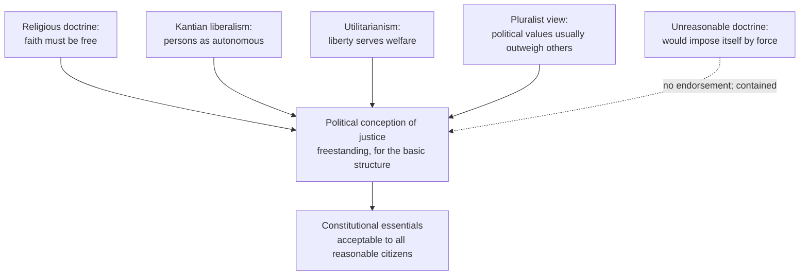

# Political Philosophy · Lesson 4.1: Political liberalism

> ⏱ ~15 min · Module 4: Legitimacy and public reason · Builds on: [2.2 Rawls I: the original position](02-02-rawls-the-original-position.md), [1.1 The problem of political authority](01-01-the-problem-of-political-authority.md) · Unlocks: [4.2 Public reason and religious argument](04-02-public-reason-and-religious-argument.md), [4.3 Perfectionism and the common good](04-03-perfectionism-and-the-common-good.md)

## Why this matters

Modules 2 and 3 asked what justice and liberty require. Module 4 asks a prior question: citizens disagree, deeply and permanently, about religion, morality and the good life, so on what terms may some of them coerce the others? John Rawls's *Political Liberalism* (1993) is the most influential answer, and every later lesson in this module either refines it ([4.2](04-02-public-reason-and-religious-argument.md)) or rejects it ([4.3](04-03-perfectionism-and-the-common-good.md), [4.4](04-04-feminist-political-philosophy.md)).

## The idea

Rawls changed course after *A Theory of Justice* (1971). Part III of that book argued that a just society would be stable: citizens raised under its institutions would come to affirm justice as fairness, and would see acting justly as part of their own good. By 1993 Rawls judged that argument unrealistic (PL, Introduction). It assumed everyone would hold justice as fairness as part of one shared philosophical outlook, a Kantian view of the person and the good. No free society will ever converge on that, or on any single outlook.

That is the **[fact of reasonable pluralism](../reference.md#reasonable-pluralism)**: under free institutions, people who reason well and in good faith end up holding different and incompatible religious, philosophical and moral doctrines. Rawls pairs it with the **fact of oppression**: continued agreement on one such doctrine could be kept only by the state's coercive power (his example is the Inquisition, needed to keep medieval Christendom Christian). Pluralism is not a disaster that will pass. It is what freedom produces.

Why is the disagreement *reasonable* and not just stubbornness? Rawls's answer is the **[burdens of judgment](../reference.md#burdens-of-judgment)** (PL Lecture II), six sources of disagreement among people who are fully rational:

1. The evidence is conflicting and complex, hard to assess.
2. Even when we agree on which considerations matter, we weigh them differently.
3. Our concepts are vague and have hard cases, so we must interpret.
4. How we assess evidence and weigh values is shaped by our whole life experience, which differs.
5. Different kinds of normative consideration, of different force, bear on both sides of a question.
6. No set of institutions can admit every value, so some must be selected and ranked (limited social space).

A **reasonable person**, in Rawls's sense, does two things: she proposes fair terms of cooperation and abides by them if others do, and she accepts the burdens of judgment and what follows from them. "Reasonable" is a moral idea here, not an epistemic grade. Someone can hold a well-reasoned doctrine and still be unreasonable in this sense, if he would use the state to impose it.

The response is to split two kinds of view ([comprehensive vs political](../reference.md#comprehensive-and-political-doctrines)). A **comprehensive doctrine** covers the whole of life: what is valuable, what a person is, how to live (Catholicism, Islam, Kantian autonomy, Mill's individuality, utilitarianism). A **political conception** of justice covers only the [basic structure](../reference.md#basic-structure), is **freestanding** (stated without relying on any comprehensive doctrine; Rawls calls it a "module" that fits into many), and is built from ideas already implicit in a democratic public culture: citizens as free and equal, society as fair cooperation.

The hope is an **[overlapping consensus](../reference.md#overlapping-consensus)** (PL Lecture IV): each reasonable comprehensive doctrine endorses the same political conception *from inside*, for its own reasons. The Catholic endorses religious liberty because faith must be free; the Kantian because persons are autonomous; the utilitarian because liberty serves welfare. They agree on the conclusion, not on the grounds.

## The argument

**From the burdens of judgment to toleration** (PL Lecture II, reconstructed).

1. **(Empirical)** Under free institutions, citizens come to hold many incompatible comprehensive doctrines, and this persists.
2. **(Epistemic)** The burdens of judgment explain that diversity without convicting anyone of irrationality, ignorance or bad faith. *In words:* good reasoners can end up far apart on the deepest questions.
3. **(Conceptual)** A reasonable person accepts premise 2 as applying to her own doctrine too: she may hold it true, but she cannot expect others who reason well to come to see it as true.
4. **(Normative)** It is unreasonable to use political power to repress a view that others hold reasonably, on grounds they could reasonably reject. *In words:* fair terms of cooperation cannot be terms one side imposes by force from premises the other side has good reason to deny. (The moral root is close to [Scanlon's contractualism](../../ethics/lessons/05-02-contractualism-what-no-one-could-reasonably-reject.md).)

∴ **C.** Reasonable persons will not use state power to repress reasonable comprehensive doctrines other than their own.

Rawls generalizes the conclusion into the **[liberal principle of legitimacy](../reference.md#liberal-principle-of-legitimacy)** (PL Lecture IV, paraphrased): coercive political power is properly exercised only in accordance with a constitution whose essentials all citizens, as free and equal, may reasonably be expected to endorse in the light of principles and ideals acceptable to their common human reason. Note what this governs: [legitimacy](../reference.md#legitimacy) in 1.1's sense, the right to coerce, and only at the level of constitutional essentials. It is a weaker standard than justice: a legitimate law can still be unjust.

The idea has a long root: Locke's *Letter Concerning Toleration* fenced salvation off from the magistrate's power ([`history-of-political-thought` 4.2](../../history-of-political-thought/lessons/04-02-locke-limited-government-and-toleration.md)). Rawls's extension is to apply the same restraint to secular philosophies, Kant's and Mill's included.

**Neutrality** (PL Lecture V). Rawls separates three ideas ([neutrality of aim and effect](../reference.md#neutrality-of-aim-and-effect)). *Procedural* neutrality: a procedure justified without appeal to any moral values at all; political liberalism is not neutral in this sense, since it rests on values such as fairness. *Neutrality of aim*: the state does nothing *intended* to favour or promote any particular comprehensive doctrine. *Neutrality of effect or influence*: the state's policies make no difference to which doctrines flourish. Rawls requires the second and abandons the third as impracticable: any basic structure will make some ways of life easier than others.

**Where the argument is weakest.** Premises 2 and 3, attacked from two sides. Joseph Raz ("Facing Diversity: The Case of Epistemic Abstinence", 1990) argues that the burdens of judgment either imply scepticism about comprehensive truth, which is itself a contested comprehensive claim, or give a believer no reason to hold back. If I am justified in believing my doctrine true, why may I not act on it? Rawls's reply is that premise 3 asks for no scepticism, only the recognition that others cannot be expected to share the belief. The second attack is the *asymmetry* objection: citizens disagree about justice as reasonably as about the good (Jeremy Waldron, *Law and Disagreement*, 1999), so why may the political conception take sides on justice? Rawls's partial answer is that legitimacy needs only reasonable acceptability at the level of constitutional essentials, leaving a family of liberal conceptions in play. Whether that answer is stable is the critics' question. The objection that the principle of legitimacy fails its own test, the self-defeat objection, is [4.2](04-02-public-reason-and-religious-argument.md)'s.

## Map of positions

*Four reasonable comprehensive doctrines each endorse the same political conception from inside, for different reasons; that is an overlapping consensus. An unreasonable doctrine does not join it, and the state contains it without needing its agreement. The four doctrines follow Rawls's own model case in Lecture IV.*

## Worked examples

**Example 1 (clean): the rest-day law.** The invented Republic of Varden requires most shops to close one day a week, and picks the day most workers already have off. Run neutrality of aim and of effect.

*Version A:* the statute's preamble says the closure exists "to honour the Lord's day". The aim is to favour one religious doctrine. That fails neutrality of aim, whatever the effects.

*Version B:* the preamble cites worker rest, family time and coordination (a shared day off is worth more than a random one). Those are political values that any citizen can be expected to accept. That passes neutrality of aim. Neutrality of effect still fails: the law suits citizens whose Sabbath falls on that day and burdens shopkeepers whose faith asks them to rest on another day as well. Rawls's verdict is that this effect does not make the law illegitimate, since neutrality of effect is not required. Whether the burdened shopkeepers are owed an exemption is a further question, and [6.3](06-03-conscience-and-exemptions.md) takes it up.

The lesson: the same law can be legitimate or not depending on the justification it can be given, which is why [4.2](04-02-public-reason-and-religious-argument.md) turns to the reasons citizens and officials offer.

**Example 2 (hard): a peace that looks like a consensus.** In the invented city of Ostmark, two churches fought for a generation, then agreed to a constitution guaranteeing freedom of worship. Fifty years on the clause is honoured and both churches' leaders praise it. Is this an overlapping consensus?

Rawls distinguishes it from a **[modus vivendi](../reference.md#modus-vivendi)**: a treaty-like settlement each side accepts because it cannot win, and would abandon if the balance of power shifted. An overlapping consensus is affirmed on moral grounds internal to each doctrine, so it survives such a shift. Rawls later called that "stability for the right reasons".

Here the case strains. The two arrangements produce *identical laws and identical behaviour* today. The difference is counterfactual: what each church would do if it became the large majority. Evidence bears on it only indirectly (has either church's own teaching come to ground religious liberty, or does it still describe toleration as a concession to necessity?). Rawls's own historical story makes the line dynamic: toleration after the Reformation began as a modus vivendi, which could deepen first into a constitutional consensus and then into an overlapping one. So "is it a consensus?" may have no answer at a single date.

Why care, if the peace holds? Two different answers. For Rawls, a liberal order held only by a balance of power is fragile and does not treat citizens as endorsing their own terms. For modus vivendi theorists such as John Gray (*Two Faces of Liberalism*, 2000), peaceful coexistence among rival ways of life is the most that politics should aim at, and the demand for endorsement asks too much.

## Watch out

- **You might think the liberal principle of legitimacy says when a law is just, but actually it states a weaker standard.** It concerns legitimacy (the right to coerce), applies first to constitutional essentials, and allows that legitimate laws can be unjust. It also does not by itself establish [political obligation](../reference.md#political-obligation): that is 1.1's distinction between legitimacy and obligation again.
- **You might think "reasonable pluralism" is a relativist claim that no doctrine is true, but actually it is partly empirical and partly moral.** The empirical part is that free institutions produce lasting diversity. The moral part is that reasonable citizens will not coerce over it. Neither part says the doctrines are equally true or that none is true; political liberalism deliberately takes no position on that.
- **You might think a neutral state is one whose laws affect all ways of life equally, but actually Rawls requires only neutrality of aim.** Neutrality of effect is impossible, and pointing to an uneven effect does not show a law is illegitimate.

## One-liner

> Since free people will always reasonably disagree about the good, political liberalism asks coercive law to rest on a freestanding political conception that every reasonable doctrine can endorse from its own premises, an overlapping consensus, rather than on any one doctrine's truth.

## Problems

**P1 (🟢) *(Exegetical.)*** Diagnose. Four invented measures in the Republic of Varden. For each, say whether it satisfies Rawls's neutrality of aim, and whether it is neutral in effect. One line each.

(i) A statute requires every courthouse to display a plaque reading "This nation trusts in divine providence", "to affirm the faith of our people".

(ii) A tax credit for opera and gallery subscriptions, "because a life devoted to high art is a fuller human life than one spent on popular entertainment".

(iii) A civics curriculum, compulsory in all schools, teaching children their constitutional rights, including that leaving one's religion is no crime, justified as preparing them to be free and equal citizens.

(iv) A zoning rule capping buildings in residential districts at 2,000 square metres, justified by traffic and noise; the only planned building it blocks is a large church.

**P2 (🟡) *(Exegetical (a) · Evaluative (b).)*** Apply to a hard case. Varden's citizens split over a 90 percent inheritance tax. One camp holds that bequest is part of a property right, the other that inherited wealth corrupts fair equality of opportunity. Both camps know the same economic studies and argue in good faith. (a) Name two of Rawls's burdens of judgment that explain this disagreement, and state one thing a citizen in either camp would have to do to count as *unreasonable* in Rawls's sense. Three sentences. (b) If disagreement about justice is as reasonable as disagreement about the good, what follows for political liberalism? Name the premise the objection attacks, give the political liberal's best reply, and say whether the objection generalizes. 150 words or fewer. Any verdict passes.

**P3 (🔴, optional) *(Exegetical.)*** Find the crux. In the invented Federation of Arnholt, three language communities settled a secession crisis with a constitution granting each its own schools and courts. Commentator A: "This is a mere modus vivendi, so it lacks full legitimacy: no community endorses the terms from its own values." Commentator B: "It keeps the peace on terms each community accepts. That is all legitimacy can ask." Name the single premise about legitimacy that B must deny and A must affirm, and say what kind of consideration would move someone on it. 100 words or fewer.

Solutions

**P1** *(Exegetical — strict)*

**Must hit, strict:**

- (i) Fails neutrality of aim: the stated aim is to affirm a religious doctrine. Its effects on worship are minor, but neutrality of aim fails regardless of effect.
- (ii) Fails neutrality of aim: the aim is to promote one conception of the good life over others (a perfectionist aim, the view [4.3](04-03-perfectionism-and-the-common-good.md) defends). Not neutral in effect either: it favours one set of tastes.
- (iii) Passes neutrality of aim: the justification is political (equal citizenship). Not neutral in effect: it may make it harder for insular communities to keep their children in the faith. Rawls accepts that kind of effect as unavoidable.
- (iv) Passes neutrality of aim: the justification is traffic and noise, political values. Not neutral in effect: its burden falls on one congregation.

**Wrong turns:** judging (iii) or (iv) illegitimate because of their uneven effects, when Rawls requires only neutrality of aim; treating (ii) as fine because it involves no religion, when neutrality of aim covers secular conceptions of the good too.

**Model answer:** (i) aim fails; effect roughly neutral, but that does not save it. (ii) aim fails (perfectionist); effect not neutral. (iii) aim passes; effect not neutral. (iv) aim passes; effect not neutral.

---

**P2** *(Exegetical (a) — strict · Evaluative (b) — graded on moves, not verdict)*

**Accept (a):** any two of the six burdens, each tied to the case.

**Must hit, strict (a):**

- Two burdens fitted to the case, for example: weighing (both camps accept liberty and opportunity but weigh them differently); conflicting normative considerations of different force on both sides; the vagueness of "property right" and "fair opportunity"; complex economic evidence on incentives; different life experience.
- Unreasonable means refusing to propose or abide by fair terms of cooperation (for instance, being willing to impose one's view by force or to ignore the outcome of a fair procedure), or refusing to accept the burdens of judgment (treating the other camp as irrational or corrupt merely because it disagrees). Holding a firm view is not unreasonable.

**Must hit, any verdict (b):**

- Name the premise attacked: the asymmetry that disagreement about the good is reasonable and must be bracketed while the political conception may take a side on justice (Waldron's objection).
- The political liberal's best reply: legitimacy requires reasonable acceptability only at the level of constitutional essentials; disagreement over a tax rate falls to ordinary democratic decision among a family of reasonable liberal conceptions, so pluralism about justice is accommodated, not ignored.
- Say whether it generalizes: if disagreement reaches constitutional essentials themselves (which liberties are basic, whether property in bequest is one), the reply is under pressure across the board, not just here.

**Wrong turns:** saying the inheritance dispute is "merely economic" and so not reasonable disagreement, when both camps hold normative views about property and opportunity; reading (b) as asking which tax is just.

**Model answer (b), one of several:** The objection attacks the asymmetry at the heart of political liberalism: the good is bracketed because disagreement about it is reasonable, yet the political conception takes positions on justice that are just as disputed. The political liberal replies that legitimacy and justice are different standards. Legitimacy needs only constitutional essentials that all reasonable citizens can accept; an inheritance rate is ordinary legislation, settled by fair majority procedures among reasonable liberal conceptions. So pluralism about justice is handled by democracy, not denied. The reply holds as long as the dispute stays below the constitution. But the objection generalizes upward: citizens also disagree reasonably about which liberties are basic, and there the reply has nowhere further to send the dispute. The principle stops determining a verdict at the point where disagreement reaches the essentials themselves.

---

**P3** *(Exegetical — strict)*

**Must hit, strict:**

- The premise: full legitimacy requires that citizens can endorse the terms of coercion from within their own reasonable views (stability for the right reasons), not merely accept them as the best available bargain.
- A affirms it (Rawls's position); B denies it (the modus vivendi position, for example Gray's).
- What would move someone: an argument about what treating citizens as free and equal requires, and an assessment of whether a bargain held by a balance of power is acceptably stable when power shifts. Evidence about the settlement's actual durability bears on the second, not on the first.

**Wrong turns:** naming the content of the settlement (schools, courts) as the crux, when A and B agree on what the constitution says; treating the dispute as purely empirical about whether the peace will last, when A's claim is that even a lasting modus vivendi falls short.

**Model answer:** The crux is whether legitimacy requires endorsement from within each party's own values or only fair terms that keep the peace. A says a settlement held by a balance of power lacks full legitimacy even if it lasts; B denies that any further endorsement is needed. What would move someone is an argument about what respecting citizens as free and equal requires, supplemented by evidence on whether bargains of this kind survive shifts in power.

## Flashback

**From Lesson [3.3](03-03-paternalism-and-legal-moralism.md) (Paternalism and legal moralism):** *(Exegetical (a) · Evaluative (b).)* Apply to a new case. Invented case. Every Saturday at noon, for twenty minutes, the artist Ilse Brand sits in a glass booth in the only market square of the town of Grenby. As a protest against food waste, she eats food taken from the town's rubbish skips, including visibly rotting meat. Assume she poses no health risk to anyone else. Many shoppers are disgusted, and the weekly market is the only place most residents buy fresh food. (a) Using Feinberg's offense principle, name from the facts two factors that make the offense more serious, one that makes her conduct more reasonable, and one that makes it less reasonable. One line each. (b) Instead of a ban, the council proposes moving the performance to weekday afternoons, when the market is closed, with a sign at the square's entrance. Ilse replies that the protest only works where food is being sold. Run Feinberg's balance on the move, reach a verdict, and say where the test stops giving one. 100 words or fewer. Any verdict passes.

Solution

**Accept (a):** any correctly placed factors drawn from the facts. The four below are the clearest.

**Must hit, strict (a):**

- Seriousness, any two of: *intensity* (rotting meat provokes strong disgust); *extent* (a crowded square, many people); *not reasonably avoidable* (shoppers must cross the only market to buy food); *no consent* from the shoppers. Disgust at rotting meat is not abnormal susceptibility, so that factor does not reduce the seriousness.
- More reasonable: the conduct matters to her as expression of a cause, with no malice; she aims to persuade, not to disgust for its own sake.
- Less reasonable: alternatives exist, another time or place; or the character of the setting, a food market, where disgust at rotting food is hardest to escape.

**Must hit, any verdict (b):**

- Run both sides of the balance on the move. Seriousness falls sharply: the sign makes the offense avoidable, those who enter despite it have in effect consented, and few people are present. Reasonableness depends on whether the alternative keeps the conduct's point.
- Take Ilse's reply seriously, as a claim that the alternative is not adequate because the setting is part of the message.
- A verdict, separate from the reasoning.
- Where the test stops: Feinberg's factors have no common scale. When an act's expressive value depends on exactly the setting that makes it unavoidable, the balance gives no verdict without a further weighting the principle does not supply.

**Wrong turns:** invoking the harm principle, since disgust is not harm and the case stipulates no health risk; treating the restriction as legal moralism, when the ground is offense to unconsenting onlookers, not the wrongness of her conduct; assuming that any available alternative settles the balance, without asking whether it preserves what she is doing.

**Model answer (b), one of several:** The move cuts the offense close to nothing. With the market closed and a sign at the entrance, anyone who sees the performance chose to, and few people pass. Ilse's reply is serious: a protest about food waste aimed at people buying food loses much of its point in an empty square. But Feinberg's alternatives factor asks whether a reasonable outlet exists, not whether the best one does. Weekday performances still reach the town, and news of them can travel. On balance the move is permissible. The test stops at the weighting itself, though: nothing in it says how much expressive point outweighs how much unavoidable disgust.

## Connections

- **Backward:** [2.2](02-02-rawls-the-original-position.md) hid the conception of the good behind the veil; this lesson explains why, as the response to reasonable pluralism. The legitimacy/obligation distinction is [1.1](01-01-the-problem-of-political-authority.md)'s. Whether persistent moral disagreement among peers should shake our confidence is [`ethics` 6.6](../../ethics/lessons/06-06-moral-knowledge-and-disagreement.md); political liberalism asks the political question that lesson pointed here: what the state may do given that disagreement.
- **Forward:** [4.2](04-02-public-reason-and-religious-argument.md) turns the principle of legitimacy into a duty about which reasons citizens and officials may offer, and meets the self-defeat objection; [4.3](04-03-perfectionism-and-the-common-good.md) states the perfectionist and natural-law case that the state may promote the good; [6.3](06-03-conscience-and-exemptions.md) asks what is owed to those a neutral-in-aim law burdens.
- **Sideways:** Locke's toleration is the historical root ([`history-of-political-thought` 4.2](../../history-of-political-thought/lessons/04-02-locke-limited-government-and-toleration.md)). The question of whether a welfare metric can avoid taking sides on the good, with Nussbaum's capabilities list offered as the object of an overlapping consensus, is [`philosophy-of-economics` 1.3](../../philosophy-of-economics/lessons/01-03-capabilities-as-a-welfare-metric.md).
