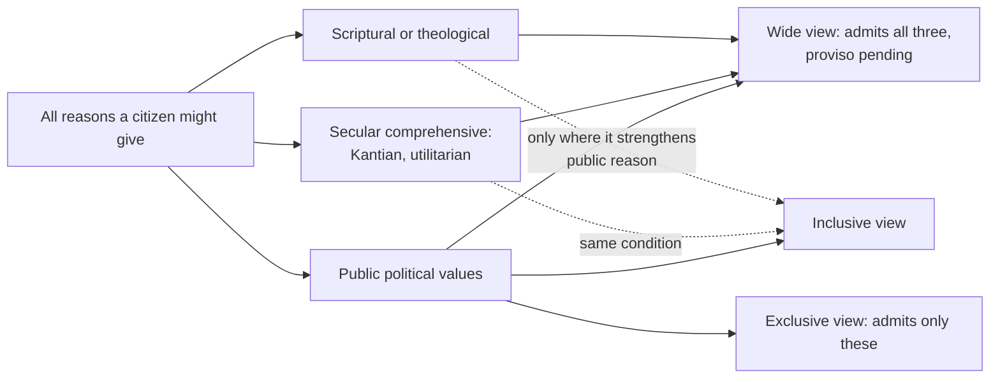

# Political Philosophy · Lesson 4.2: Public reason and religious argument

> ⏱ ~15 min · Module 4: Legitimacy and public reason · Builds on: [4.1 Political liberalism](04-01-political-liberalism.md), [3.4 Free speech](03-04-free-speech.md) · Unlocks: [4.3 Perfectionism and the common good](04-03-perfectionism-and-the-common-good.md), [5.3 Deliberative vs aggregative democracy](05-03-deliberative-vs-aggregative-democracy.md), [6.3 Conscience and exemptions](06-03-conscience-and-exemptions.md)

## Why this matters

[4.1](04-01-political-liberalism.md) ended with a test for coercive law: the [liberal principle of legitimacy](../reference.md#liberal-principle-of-legitimacy) says coercive power is properly exercised only in accordance with a constitution whose essentials all citizens, as free and equal, may reasonably be expected to endorse. That is a test for *laws*. This lesson asks what it demands of *people*: what a senator may say on the floor, what a judge may write, what reasons you may vote on. Religious argument is the hard case, because it is where the demand bites hardest and where the objections come from citizens who say the demand asks them to argue as someone they are not.

## The idea

**[Public reason](../reference.md#public-reason)** is the stock of reasons citizens can offer one another *as* free and equal despite [reasonable pluralism](../reference.md#reasonable-pluralism): political values (equal liberty, fair opportunity, the common good of citizens, public health, the security of the state) plus methods of reasoning nobody reasonably disputes (common sense, settled science). Rawls develops it in *Political Liberalism* (1993), Lecture VI, and revises it in "The Idea of Public Reason Revisited" (*University of Chicago Law Review*, 1997).

Three limits keep the idea narrower than it sounds:

- **Topic.** It governs constitutional essentials and matters of basic justice, not every bylaw.
- **Forum.** It binds speech in the *public political forum*: judges (most strictly), officials, candidates, and citizens when voting on fundamentals, who should reason as if they were legislators. It does not govern the *background culture*: churches, universities, families, associations.
- **Kind of duty.** The **duty of civility**, to be ready to explain how your positions on fundamentals can be supported by public reasons, is moral, not legal. No one is censored.

Note what public reason excludes: *every* [comprehensive doctrine](../reference.md#comprehensive-and-political-doctrines), secular ones included. A judge who rests an opinion on Kantian autonomy, or on utilitarianism as the whole truth about morality, breaks it as surely as one who cites scripture.

### Inclusive and exclusive public reason

Rawls distinguishes three views of when comprehensive reasons may enter public political argument.

- **Exclusive view.** Never, on fundamental questions: only public reasons may be given.
- **Inclusive view** (*Political Liberalism*, 1993). Comprehensive reasons may be given where doing so strengthens the ideal of public reason itself, especially in a society that is not well-ordered. Rawls's examples are the abolitionists and Martin Luther King Jr., who argued from religious premises to conclusions that public reason supports: equal citizenship.
- **Wide view** (1997). Reasonable comprehensive doctrines, religious or not, may be introduced at any time, provided that in due course proper public reasons are given that are sufficient to support whatever the comprehensive reasons were introduced to support. That condition is **[the proviso](../reference.md#the-proviso)**. Rawls leaves its details ("in due course", by whom) to be worked out in practice.

### Consensus and convergence

Rawls's is a **consensus** view: a justification must rest on reasons all reasonable citizens can share. Gerald Gaus (*The Order of Public Reason*, 2011) and Kevin Vallier (*Liberal Politics and Public Faith*, 2014) defend **convergence**: a law is publicly justified when *each* citizen has sufficient reason to endorse it from her own point of view, even if the reasons differ. Vallier sorts reasons by how much they must be held in common: *shareable* (all accept the reason), *accessible* (all can assess it by common standards), *intelligible* (others can see it is justified for her by her own standards). Consensus views demand one of the first two; convergence needs only intelligibility.

## The argument

From legitimacy to the duty of civility, reconstructed.

- **P1 (Normative, from 4.1).** Coercive power is legitimately exercised only in accordance with a constitution whose essentials all citizens, as free and equal, may reasonably be expected to endorse (the liberal principle of legitimacy).
- **P2 (Conceptual, from 4.1).** Because of the [burdens of judgment](../reference.md#burdens-of-judgment), reasonable citizens reasonably reject one another's comprehensive doctrines.
- **P3.** So a reason whose force depends on a comprehensive doctrine cannot be one all reasonable citizens could be expected to endorse.
- **P4 (Normative: reciprocity).** Citizens who exercise political power over one another, as voters, officials and judges, owe one another a justification that meets the standard in P1.
- **∴ C.** On fundamental questions, in the public political forum, citizens have a moral duty to be able to justify their positions by public reasons.

*In words:* if law must be acceptable to all, then the people making it owe each other reasons all can accept.

Three objections.

**The integrity objection.** Nicholas Wolterstorff (in Audi and Wolterstorff, *Religion in the Public Square*, 1997) says many religious citizens do not hold their faith as one input among others. It is the frame through which they see justice. Asking them to reach political decisions on independent, non-religious grounds asks them to divide themselves, which their convictions forbid.

**The fairness objection.** Christopher Eberle (*Religious Conviction in Liberal Politics*, 2002) accepts a demanding ethic, which he calls conscientious engagement: seek public justification, weigh critics, listen. He denies the further step to *restraint*. A citizen who has done all that and still has only a religious reason may vote on it. Requiring more singles out religious citizens' deepest commitments as unfit for politics. (Note: in the public-reason literature the "asymmetry objection" usually names a different point, from Sandel and Waldron: we disagree about justice as deeply as about the good, so why bracket only the good? That objection belongs with the perfectionists of [4.3](04-03-perfectionism-and-the-common-good.md).)

**The [self-defeat objection](../reference.md#self-defeat-objection).** Pressed by Steven Wall (2002) and Joseph Raz among others: the principle of public reason is itself contested among reasonable citizens, so by its own standard it may not be used to justify anything coercive. Jonathan Quong (*Liberalism without Perfection*, 2011) replies with an *internal* conception: political liberalism does not seek justification to everyone with actual views, only to citizens idealized as already accepting freedom, equality and fair cooperation. For them the principle is a presupposition of the project, not a contested conclusion. The cost is that the "reasonable" are partly defined by the theory, and critics say this makes the justification circular.

**Where the argument is weakest.** P4, the step from a test for *laws* to a duty on *citizens' reasons*. P1 could be satisfied whenever a law *has* a public justification, whoever voted for it and why. Eberle denies P4 exactly there: he grants that legitimacy needs a public case to exist, and denies that each voter must be moved by it or able to state it. The defender's reply is that respect is owed in the act of coercing, not only in the result, so a citizen who votes on reasons she knows others cannot share treats them as objects to be managed. Which of these is the right account of respect is the dispute.

## Picture

The views differ at one point: the comprehensive branches. Note that the secular comprehensive branch is treated exactly like the scriptural one by all three. The line public reason draws is public versus comprehensive, not secular versus religious.

## Worked examples

**Example 1 (clean): four speakers, one amendment.** Invented case. The Republic of Varden debates a constitutional amendment guaranteeing every resident a social minimum: a constitutional essential, so public reason applies.

| Speaker and argument | Exclusive | Inclusive | Wide with proviso |
|---|---|---|---|
| A bishop preaching to his congregation: scripture commands care for the poor | Not restricted: background culture | Not restricted | Not restricted |
| A columnist on television: a citizen who cannot afford food cannot take part in political life as an equal | Permitted: public value | Permitted | Permitted |
| A senator, on the floor: "My faith requires it; that is enough"; a week later she argues from fair opportunity | First speech violates | Violates, unless it strengthens public reason (nothing here suggests the society is not well-ordered) | Permitted: the proviso is met by her second speech |
| A judge applying the amendment, reasoning that scripture fixes the minimum's level | Excluded | Excluded | Excluded: judges give public reasons only |

The senator's row is where the views divide. The judge's row is where they agree.

**Example 2 (hard): Mara and conscription.** Invented case. Varden votes on an amendment authorizing a wartime draft. Mara, a pacifist from a peace church, believes God forbids taking human life. She has studied the public arguments (national defence, the fair sharing of burdens), finds them weighty, and has no public reason that defeats them. May she vote no?

- **Exclusive and wide views:** not on her religious ground alone. Under the wide view she may *say* it, but the proviso then requires public reasons sufficient for her conclusion, and she has none.
- **Eberle:** yes. She has engaged conscientiously; restraint would require her to vote for what she believes is grave wrong.
- **Convergence:** the question flips. Mara's reason is intelligible: others can see it is justified by her own standards. If it is, the draft is *not* publicly justified to her, and her religious reason works as a defeater, not merely a permitted vote. Convergence, the view friendliest to religious reasons, therefore makes coercion *harder* to justify.

Where the principles stop: none says whether Mara's convictions are reasonable enough to count. The consensus view needs a line between reasonable and unreasonable doctrines; convergence needs a standard of idealization for "her own point of view". Each places the hard judgement there. Whether the state should *exempt* her if the draft passes is a different question, for [6.3](06-03-conscience-and-exemptions.md).

## Watch out

- **You might think public reason restricts religious speech, but actually it restricts which reasons settle fundamentals in the public political forum, as a moral duty.** Sermons, op-eds outside campaigns and dinner-table argument are background culture. Nothing here is a speech law, which is why [3.4](03-04-free-speech.md)'s questions are separate.
- **You might think a law passed in breach of the duty of civility has no claim on anyone, but actually that runs legitimacy and obligation together.** Public reason is a test for the [legitimacy](../reference.md#legitimacy) of exercises of power; whether citizens owe obedience is the separate question of [political obligation](../reference.md#political-obligation) ([1.1](01-01-the-problem-of-political-authority.md), [1.4](01-04-natural-duty-and-philosophical-anarchism.md)). A senator who breaches the duty commits a moral fault; whether the law is illegitimate depends on whether a public case for it exists.
- **You might think the integrity objection is an empirical claim about how believers feel, but actually it is normative.** Survey data on religious citizens' comfort would not settle it; the claim is that a just demand cannot require a person to act against her conscience about where justice comes from.

## One-liner

> Public reason asks citizens deciding fundamentals to give reasons all reasonable people can share; the exclusive, inclusive and wide views differ only on when comprehensive reasons may enter, convergence asks only for reasons each can accept, and the integrity, fairness and self-defeat objections attack the step from legitimate laws to duties on citizens.

## Problems

**P1 (🟢) *(Exegetical.)*** Varden, a well-ordered society, debates constitutional amendments. For each argument, say whether the exclusive view, the inclusive view and the wide view with the proviso permit it, or whether it falls outside public reason's scope. One line each.
(i) A rabbi tells her synagogue that the Torah's laws on gleaning support a proposed amendment guaranteeing a social minimum.
(ii) A senator supports an amendment banning all gambling solely because his faith teaches it is sinful. Neither he nor anyone else ever offers another argument for it.
(iii) Elsewhere, in the neighbouring Kingdom of Ostra, a minority is barred from voting. A movement leader campaigns for an amendment extending the vote, arguing only that all are equal before God.
(iv) A judge on Varden's highest court rests an opinion solely on the claim that Kantian autonomy is the true foundation of all morality.

**P2 (🟡) *(Exegetical (a)-(b) · Evaluative (c).)*** Invented case. The town of Edrin bans commercial surrogacy. Some residents support the ban from natural-law premises about marriage and procreation; others from a feminist argument that it commodifies women's bodies; everyone else, for one reason or another, also endorses it. No single reason is accepted by all.
*Commissioner Lund:* "The ban is publicly justified: every resident has a sufficient reason to endorse it."
*Commissioner Saro:* "It isn't. No reason here is one we all share."
(a) Name the single premise Saro asserts and Lund denies. One sentence. (b) Describe a law that Saro's view would count as justified but Lund's view might not. Two sentences. (c) Say what kind of argument could move either commissioner. Two sentences.

**P3 (🔴, optional) *(Evaluative.)*** Counterexample. Build an invented case, drawing on the integrity objection, in which the exclusive view forbids a citizen's argument that most people would think admirable or plainly permissible. Do not use abolition or civil rights. Then give the best reply an exclusive-view defender can make, and say whether the case pushes toward the inclusive or wide view or against public reason altogether. 150 words or fewer.

Solutions

**P1** *(Exegetical)*

**Must hit, strict:**

- (i) Outside scope: a synagogue is background culture. None of the three views restricts it.
- (ii) Exclusive: violates. Inclusive: violates; in a well-ordered society a purely religious argument does not strengthen the ideal of public reason. Wide: violates; the proviso is never met.
- (iii) Exclusive: violates (no public reason is given). Inclusive: permitted; this is Rawls's abolitionist and King case, a non-ideal society where religious argument supports what public reason supports, equal citizenship. Wide: permitted, provided public reasons are given in due course; they are readily available (equal citizenship is a core political value), but someone must actually give them.
- (iv) Excluded under all three: the doctrine is comprehensive though secular, and judges must give public reasons only.

**Wrong turns:** treating (iv) as acceptable because it is secular; treating (i) as a violation because it concerns a constitutional amendment (the forum, not the topic, puts it outside scope); saying the wide view is satisfied in (iii) merely because public reasons *exist*.

---

**P2** *(Exegetical (a)-(b) · Evaluative (c))*

**Must hit, strict (a):** Saro asserts, and Lund denies, that a public justification must rest on reasons all can share (or at least assess by common standards); Lund holds it is enough that each person has a sufficient reason from her own point of view (convergence).

**Accept (b):** any law with a shared public rationale that some resident has an intelligible, sufficient reason to reject.

**Model answer (b):** A compulsory vaccination law justified by public health, a shared reason, satisfies Saro. Lund's convergence view may not count it justified if a resident with an intelligible religious objection has sufficient reason, by her own standards, to reject it: her reason defeats it.

**Must hit, any verdict (c):**

- An argument about what respect for persons as free and equal requires: being given reasons one can share, or being coerced only on terms one has reason to accept.
- Not evidence about the ban's effects; both commissioners could accept any finding about surrogacy outcomes.

**Wrong turns:** naming the moral status of surrogacy as the crux (both bracket it); assuming convergence always permits more law than consensus. It can permit less, as (b) shows.

---

**P3** *(Evaluative)*

**Accept:** any case where (1) the speaker is in the public political forum on a fundamental question, (2) her only argument is comprehensive, (3) the argument is one a reader would find admirable or obviously permissible, and (4) the integrity point is used: she cannot sincerely separate her reason from her faith.

**Must hit, any verdict:**

- The case meets the scope conditions, so the exclusive view really does forbid it.
- The best exclusive-view reply: the duty is to *be able* to give public reasons, not to have no others; or public reasons are available and someone should supply them; or the intuition tracks the conclusion's being right, not the argument's being proper.
- A judgement on direction: the inclusive view handles non-ideal cases, the wide view handles cases where public reasons exist, and only a case with no available public reason pushes against public reason as such.

**Wrong turns:** a case in the background culture (no view restricts it); a case where the comprehensive reason is secular-Kantian and the reader thinks that makes it public.

**Model answer, one of several:** In invented Tarlen, an amendment would allow police to search homes without warrants. A Mennonite candidate opposes it on a televised debate solely because, she says, God commands the stranger's home be respected as one's own; she cannot argue otherwise without, as she sees it, misrepresenting why she believes it. The exclusive view forbids her argument. The exclusive defender replies that nothing stops her *also* citing the privacy and liberty that public reason protects, and that her integrity is about motive, not about what she offers others. But that reply concedes public reasons are at hand, which is exactly the wide view's condition. So the case pushes from exclusive to wide, not against public reason: it would take a case with no public reason available, like Mara's, to go further.

## Flashback

**From Lesson [3.4](03-04-free-speech.md) (Free speech):** *(Exegetical (a)-(b) · Evaluative (c).)* Reconstruct. Invented case. The invented city of Arnsby bans leaflets describing members of a named religious minority as "a disease on the city". A year later, after a public debate, it passes a Fair Housing Ordinance forbidding landlords to refuse tenants because of their religion. Tobin, a landlord, had wanted to hand out such leaflets as part of his campaign against the housing ordinance, and was stopped. Prosecuted for refusing a tenant from the minority, he says: "You silenced me before the vote, so you have no right to enforce the result against me." (a) Reconstruct the argument Tobin borrows from Dworkin in at most four numbered premises and a conclusion, labelling each premise normative, conceptual or empirical. (b) Tobin adds: "So the ordinance does not bind me, and I may refuse whom I like." Using 1.1's four-way distinction, say what Dworkin's argument, if sound, establishes, and name the two further steps Tobin takes. Two sentences. (c) Name the premise of your reconstruction a defender of the leaflet ban is best placed to deny, and say why. Two sentences. Any verdict passes.

Solution

**Must hit, strict (a):** a reconstruction with these elements, in any wording:

1. **(Normative)** A majority may legitimately enforce a law against a citizen only if he had a fair opportunity to influence the public opinion that produced it.
2. **(Conceptual)** Banning a view's public expression takes away part of that opportunity from those who hold it.
3. **(Empirical)** Arnsby's leaflet ban stopped Tobin from expressing his view during the debate on the housing ordinance.
4. **(Normative)** The right to coerce weakens in proportion to the upstream input denied: silence upstream, lose part of the right downstream.

∴ **C.** Arnsby's right to enforce the Fair Housing Ordinance against Tobin is weakened.

**Must hit, strict (b):**

- Granted, the argument shows only that the city's *legitimacy* in enforcing the ordinance against Tobin is reduced: its right to coerce him, and in Dworkin's version a partial loss, not a total one.
- Step one: from *weakened* to *none* ("no right to enforce"). Step two: from the state's weakened right to coerce to Tobin's having no duty to comply and being free to refuse. That runs legitimacy into political obligation, and both into the separate moral question of whether refusing the tenant wrongs her, which does not depend on the city's standing at all.

**Must hit, any verdict (c):**

- Name one premise and give the reason a ban's defender would recognize. The strongest target is premise 2 (or 3): the ban restricts one *manner* of expression, not the view. Tobin could still argue against the ordinance in other terms (property rights, freedom of association), so he had his say upstream.
- Alternatively, premise 4: Waldron's dignity argument holds that the targets' public assurance of standing is itself owed, so whatever legitimacy the ban costs is a cost worth paying; or the loss is too small to defeat enforcement.
- Note what each denial costs: the manner/view line must be drawable by officials without ranking opinions, which is what the free-speech principle exists to prevent.

**Wrong turns:** reconstructing Scanlon's autonomy argument instead (that argument is about listeners' judgment, not the state's right to coerce); treating the conclusion as "the ban is unjustified" (Dworkin can grant the harm and still press the cost to legitimacy); in (b), saying Tobin's slide is from legitimacy to *power* (the city plainly has power to prosecute him).

**Model answer (b)-(c):** (b) If sound, the argument shows that Arnsby's right to enforce the ordinance against Tobin is weakened, a partial loss of legitimacy. Tobin then inflates that to no right at all, and slides from the city's right to coerce to his own freedom from any duty, ignoring that his tenant may have a moral claim against discrimination whatever the city's standing. (c) A ban's defender should deny premise 2: the ban bars calling people "a disease on the city", not opposing the housing ordinance, which Tobin was free to argue on property or association grounds. The cost of that reply is that someone must decide when a manner of speaking carries a distinct view, the very judgment the free-speech principle keeps from officials.

## Connections

- **Backward:** [4.1](04-01-political-liberalism.md) supplies the liberal principle of legitimacy and the burdens of judgment; this lesson turns them into a duty on citizens. The "reasonably reject" test descends from Scanlon's contractualism in [`ethics` 5.2](../../ethics/lessons/05-02-contractualism-what-no-one-could-reasonably-reject.md) and from Scanlon's autonomy argument in [3.4](03-04-free-speech.md). Locke's case for toleration, the historical root, is in [`history-of-political-thought` 4.2](../../history-of-political-thought/lessons/04-02-locke-limited-government-and-toleration.md).
- **Forward:** [4.3](04-03-perfectionism-and-the-common-good.md) asks whether the state may promote the good at all (the asymmetry objection, that we disagree about justice as deeply as about the good, is in [4.1](04-01-political-liberalism.md)). [5.3](05-03-deliberative-vs-aggregative-democracy.md) puts public reason inside a theory of democratic deliberation. [6.3](06-03-conscience-and-exemptions.md) asks what happens to Mara after the vote.
- **Sideways:** Religious liberty as Catholic doctrine is taught in [`catholic-social-teaching`](../../catholic-social-teaching/syllabus.md) 5.2, which names public reason as the secular rival it meets here. The epistemology of disagreement behind reasonable pluralism is in [`ethics` 6.6](../../ethics/lessons/06-06-moral-knowledge-and-disagreement.md).
