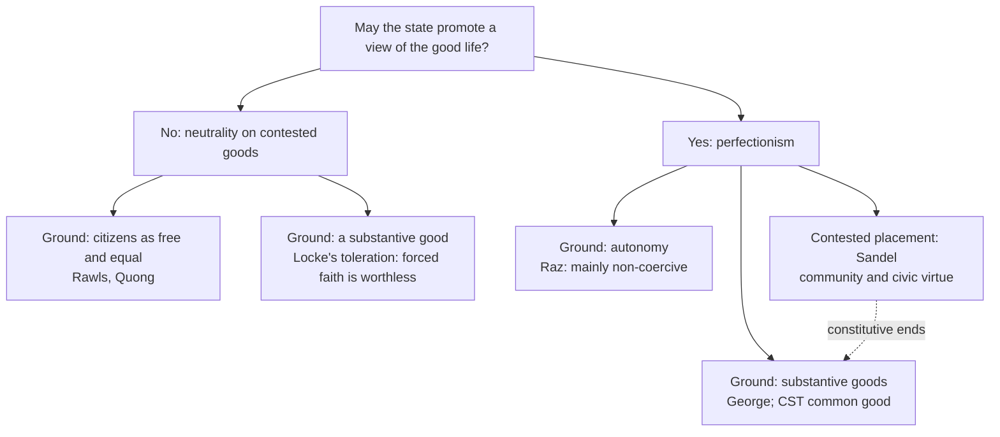

# Political Philosophy · Lesson 4.3: Perfectionism and the common good

> ⏱ ~15 min · Module 4: Legitimacy and public reason · Builds on: [4.1 Political liberalism](04-01-political-liberalism.md), [4.2 Public reason and religious argument](04-02-public-reason-and-religious-argument.md), [3.2 Mill's harm principle](03-02-mills-harm-principle.md) · Unlocks: [4.4 Feminist political philosophy](04-04-feminist-political-philosophy.md), [6.4 Who should provide?](06-04-welfare-property-and-subsidiarity.md)

## Why this matters

Every state funds some things and not others: museums but not casinos, parks but not pinball. Political liberalism ([4.1](04-01-political-liberalism.md)) says that when such choices are coercive and basic, they must rest on reasons every reasonable citizen can accept, not on a ranking of ways of life. This lesson presents the critics who say that rule is impossible, undesirable, or both. They come in secular and religious forms. Some are liberals who prize autonomy. Others think the state exists for a common good it may not pretend to be neutral about.

## The idea

**[Perfectionism](../reference.md#perfectionism)**, as a political view, says the state may act on judgments about what makes a human life go well: it may promote valuable ways of living and discourage worthless ones. Its denial is **anti-perfectionism**, or neutrality: the state must not aim to favour any conception of the good ([neutrality of aim](../reference.md#neutrality-of-aim-and-effect), from 4.1).

Two questions sort the positions, and they are independent.

1. **May the state promote the good at all?** Perfectionists say yes; political liberals say not on contested grounds where coercion or basic justice is involved.
2. **What grounds the answer: autonomy, or substantive goods?** Some views make self-direction the master value. Others name goods (knowledge, friendship, marriage, worship, community) that are good whether or not chosen, and treat autonomy as one good among them or as a condition of the rest.

A third question cuts across both: **by what means?** Coercion (bans, penalties) and non-coercive promotion (subsidies, tax incentives, public provision) can come apart. Several perfectionists accept the second and refuse the first.

## The argument

**Raz's liberal perfectionism** (Joseph Raz, *The Morality of Freedom*, 1986), reconstructed.

1. **(Normative)** Personal autonomy, being the author of one's own life, is a central ingredient of well-being in a society like ours.
2. **(Conceptual)** Autonomy requires an adequate range of options to choose among. *In words:* a person with one path open is not self-directing, however freely she walks it.
3. **(Normative)** Autonomy is valuable only when exercised in pursuit of valuable options. *In words:* choosing a worthless life autonomously adds nothing to its worth.
4. **(Empirical)** Many valuable options (serious art, demanding professions, forms of association) exist only if they are publicly supported and culturally sustained.
5. **(Normative)** Coercion invades the autonomy of the person coerced, and is justified only to prevent harm, where failing to secure the conditions of others' autonomy can itself count as harm. This is Raz's reading of the [harm principle](../reference.md#harm-principle) of [3.2](03-02-mills-harm-principle.md).

∴ **C.** The state may, and often should, promote valuable options and decline to support worthless ones, mainly by non-coercive means (subsidies, taxes, public provision); it may not coerce people into the good life.

*In words:* the liberal value itself, autonomy, is a perfectionist value. A state that cares about autonomy must care about which options exist, and so cannot be neutral.

**The rival positions, each at full strength.**

- **The [communitarian critique](../reference.md#communitarian-critique).** Michael Sandel (*Liberalism and the Limits of Justice*, 1982) argued that Rawls's original position presupposes an "unencumbered self", a chooser prior to its ends who could stand back from any attachment. But some attachments are *constitutive*: membership of a family, a people, a faith is part of who one is, not an option one picked. A politics that brackets such ends misdescribes its citizens and cannot sustain the solidarity justice needs. Alasdair MacIntyre (*After Virtue*, 1981) argued that virtues are defined within *practices* and *traditions*, and that a life makes sense as a narrative within one; liberal neutrality is itself a tradition that does not know it is one. Charles Taylor ("Atomism", 1979) gave the **social thesis**: the capacities that make rights worth having develop only within a certain kind of society, so whoever affirms rights is committed to sustaining that society, which the primacy of rights over obligations obscures. None of the three adopted the communitarian label; critics pinned it on them.
- **[Natural-law perfectionism](../reference.md#natural-law-perfectionism).** Robert P. George (*Making Men Moral*, 1993) defends the central tradition of morals legislation from Aristotle and Aquinas. Law cannot make anyone virtuous directly, since a moral good is realized only through the person's own choice. But law can play a subsidiary role in protecting the "moral ecology" of the environment in which people make character-forming choices, by suppressing inducements to vice. The underlying theory is the new natural law of [`ethics` 4.5](../../ethics/lessons/04-05-the-new-natural-law-theory.md): a plurality of incommensurable basic goods, which is why George calls his view a *pluralistic* perfectionism. Against Raz, he treats autonomy as valuable only as a condition for realizing those goods, so it cannot rule out all coercion for the sake of the good; prudence and the rights of persons limit coercion instead.
- **Catholic social teaching's [common good](../reference.md#common-good).** *Gaudium et spes* (1965) describes the common good as the sum of the conditions of social life that let groups and their members reach their fulfilment more fully and readily. The state serves that good, which includes moral and spiritual conditions, not an aggregate of preferences. Two limits come with it: subsidiarity, which reserves to families and smaller bodies what they can do themselves, and religious liberty (*Dignitatis humanae*, 1965), which forbids coercion in matters of faith. One position here; taught from within the tradition in [`catholic-social-teaching`](../../catholic-social-teaching/syllabus.md).

**The political liberal replies.** Rawls answered Sandel that the self of the original position is a *political* conception of the citizen, not a metaphysical claim about persons: one may hold constitutive attachments privately and still accept that, as citizens, no one may impose them. Against non-coercive perfectionism, Jonathan Quong (*Liberalism without Perfection*, 2011) argues that perfectionist policies are typically paternalistic: subsidizing the "better" option treats citizens as unable to judge their own good, which denies their equal standing even when no one is coerced. He also notes that subsidies are paid from taxes, which are coercive.

**Where the argument is weakest.** Premise 5 against the conclusion's "mainly by non-coercive means". The anti-perfectionist says the coercion/non-coercion line is thinner than Raz needs: a subsidy is coerced from taxpayers, and a punitive tax works like a ban. The natural-law critic attacks from the other side: if premise 3 holds and worthless options add nothing, Raz has given no principled reason why the state may tax a degrading pastime but never prohibit it. Raz replies that coercion expresses a distinctive disrespect and removes options wholesale, while incentives leave the choice with the person.

## Map of positions

The rows ask whether the state may promote the good; the second level asks what grounds the answer. Locke ([`history-of-political-thought` 4.2](../../history-of-political-thought/lessons/04-02-locke-limited-government-and-toleration.md)) shows neutrality can rest on a substantive good: coerced worship is worthless to God. Sandel's placement is contested. He criticizes neutrality and is usually read as a civic republican, but he offers no full theory of the good, so some readers file him as a critic of liberalism's self-image rather than a perfectionist.

## Worked examples

**Example 1 (clean): an arts subsidy.** Invented case. The Halden town council creates a Civic Arts Fund that pays for a chamber orchestra, a poetry prize and a free sculpture school, and expressly refuses to fund a proposed slot-machine arcade, on the ground that the arts "enrich a life" and the arcade does not.

- *Raz:* supports it. The fund widens the range of valuable options (premise 4) and declines a worthless one (premise 3) without coercing anyone; the arcade may still open privately.
- *George:* supports it. Aesthetic experience is a basic good, and the council protects the moral ecology by not subsidizing an inducement to compulsive gambling. He has no objection in principle to going further, which is Example 2.
- *Political liberal:* the stated ground fails neutrality of aim: it ranks ways of life. The council can keep the fund only on public grounds, such as preserving a culture in which citizens can form and revise their own conceptions of the good, or treating the orchestra as a public good. The policy may survive; the reason must change.

**Example 2 (hard): coercive vs non-coercive.** Invented case. Halden considers two measures against the arcade and its online equivalents: (a) an excise tax of 40 percent on stakes, or (b) an outright ban. Assume, for the example, that the harms are almost entirely to players themselves.

- *Raz:* (a) is a non-coercive incentive and acceptable; (b) coerces players for their own good and fails his harm principle. But the line strains. A tax high enough to close every arcade has the effect of a ban. Raz's principle says *how* the state may act, and at that point it stops giving a verdict on the tax rate.
- *George:* both are permissible in principle, since gambling corrupts the moral ecology. Whether to ban is a question of prudence: enforcement costs, black markets, and whether the ban teaches or merely drives the vice underground. His principle permits the ban and leaves the decision to prudential judgment.
- *Political liberal:* neither measure may rest on gambling being a worthless way to live. A ban or tax needs a public reason, such as harm to dependants or fraud.

Raz and George agree on (a) and diverge on (b). The divergence comes from premise 5 and from what each thinks autonomy is for.

## Watch out

- **You might think perfectionism means coercing people into virtue, but actually** the leading secular version (Raz) rejects coercion for that purpose, and George denies that law can make anyone virtuous directly. The live disputes are about means and limits.
- **You might think the communitarians proved the liberal state illegitimate, but actually** their claims are mostly conceptual (what a self is) and empirical (what sustains solidarity). Neither yields a normative claim about [legitimacy](../reference.md#legitimacy) without a further premise about what the state may do with those facts. Rawls accepts much of the conceptual picture and denies the political inference.
- **You might think "common good" means total welfare, but actually** in Catholic social teaching and natural law it names the conditions under which persons and groups can flourish. It is not a sum of utilities, and it is limited by subsidiarity and religious liberty.

## One-liner

> Perfectionists hold that the state may promote the good life: Raz because autonomy is valuable only among valuable options, George because law may protect a moral ecology of basic goods, Catholic social teaching because the state serves a common good; communitarians attack the unencumbered self behind neutrality, and political liberals reply that the self is political, not metaphysical, and that even subsidies can disrespect citizens.

## Problems

**P1 (🟢) *(Exegetical (a)-(b).)*** Diagnose. An **invented** op-ed in a regional paper, not the words of any real person, on a proposal to close the town of Varden's guild halls and replace them with an app for booking craft lessons:

> (i) "A guild is not a service you subscribe to; for the weavers of Varden it is part of who they are."
> (ii) "Weaving well means something only inside a craft with its own standards and history; an app can sell lessons but cannot hand down a tradition."
> (iii) "The freedom the app promises to liberate is a freedom you learned in the guild hall."
> (iv) "So the council must keep the halls open, because a guild life is a better life than an app life."

(a) For (i)-(iii), name which thinker's communitarian thesis each sentence uses (Sandel, MacIntyre or Taylor) and the thesis. One line each. (b) Does (iv) follow from (i)-(iii) alone? Say which kind of claim (i)-(iii) make, what (iv) adds, and whether a political liberal could keep the halls open without (iv). Three sentences.

**P2 (🟡) *(Exegetical (a)-(b).)*** Four invented policies from the Republic of Varden: (1) a state-funded national library and lending network; (2) a tax credit for married couples who complete a marriage-preparation course; (3) a criminal ban on commercial pornography, justified as protecting public morality; (4) free public sports leagues for adults. (a) For each, say whether Raz's view supports it and whether George's does, with the reason in a few words. (b) Name the single premise on which Raz and George disagree that explains the policy where they part. 100 words or fewer for (b).

**P3 (🔴, optional) *(Evaluative.)*** Apply to a hard case. Invented case. The Halden council offers a "Hearth Grant" of 3,000 crowns to any couple who marry, paid from general taxation, on the stated ground that married life is more fulfilling than cohabitation. No one is penalized for not marrying. Run Raz's view and Quong's paternalism objection on the grant, reach a verdict on whether it is permissible, and say where the principle you rely on stops giving a verdict. 150 words or fewer. Any verdict passes.

Solutions

**P1** *(Exegetical (a)-(b) — strict)*

**Must hit, strict (a):**

- (i) **Sandel:** constitutive attachments. Guild membership is part of the weavers' identity, not an end chosen by an unencumbered self.
- (ii) **MacIntyre:** practices and traditions. Excellence ("weaving well") is defined by the internal standards of a practice transmitted through a tradition.
- (iii) **Taylor:** the social thesis. The capacity for the freedom the app values was formed in the community the app would dissolve, so affirming that freedom commits you to sustaining its social conditions.

**Must hit, strict (b):**

- (i)-(iii) are conceptual and empirical claims about identity, practices and where capacities come from; (iv) adds a normative, perfectionist premise ranking ways of life.
- So (iv) does not follow from (i)-(iii) alone.
- A political liberal could keep the halls open on public grounds (for example, preserving an adequate range of options or the social conditions of citizens' capacities) without the ranking in (iv).

**Wrong turns:** filing (iii) under Sandel because it mentions identity-forming communities (its point is about the conditions of a capacity, Taylor's argument against the primacy of rights); treating (iv) as a communitarian thesis, when it is the perfectionist step the communitarians themselves often leave implicit.

**Model answer (b):** Sentences (i)-(iii) make conceptual and empirical claims: what the weavers' identity is, where the standard of good weaving comes from, and where the capacity for freedom comes from. Sentence (iv) adds a normative ranking, that a guild life is better, which is a perfectionist premise and does not follow from the other three. A political liberal could keep the halls open by citing the social conditions citizens need to form and pursue their own ends, without saying guild life is better.

---

**P2** *(Exegetical (a)-(b) — strict)*

**Must hit, strict (a):**

- (1) Library: Raz yes (widens valuable options, non-coercive); George yes (knowledge is a basic good).
- (2) Marriage credit: Raz yes if marriage is a valuable option that needs support, by incentive only; George yes (marriage is a basic good in later new natural law statements, and the credit supports the moral ecology).
- (3) Criminal ban: Raz no (coercion for a perfectionist end, with no harm to others given as the ground, fails his harm principle); George yes in principle, subject to prudence.
- (4) Sports leagues: Raz yes; George yes (play is a basic good).

**Must hit, strict (b):**

- They part on (3) only.
- The premise: whether coercion for the sake of the good is ruled out by the value of autonomy (Raz's harm principle, premise 5), or autonomy is valuable only as a condition for realizing basic goods, so coercion is limited by prudence and rights instead (George).

**Wrong turns:** saying Raz opposes (2) because it favours one way of life (Raz's view is exactly that the state may favour valuable options); locating the crux in the list of goods, when on these four policies their lists agree and the disagreement is about coercion.

**Model answer (b):** They agree on (1), (2) and (4) and part on (3). Raz holds that coercion invades the autonomy of the person coerced and is justified only to prevent harm, so the state may promote the good but not compel it. George holds that autonomy matters as a condition for pursuing basic goods, so it cannot by itself forbid coercion that protects the moral ecology; prudence and rights set the limits. The disputed premise is the status of autonomy as a constraint on coercion.

---

**P3** *(Evaluative — graded on moves, not verdict)*

**Accept:** any verdict that runs both views on the grant and names where the chosen principle stops determining the answer.

**Must hit, any verdict:**

- State Raz's verdict: a non-coercive incentive toward an option he can count as valuable; permissible if marriage is valuable and alternatives remain available.
- State Quong's objection: the stated ground (married life is more fulfilling) treats citizens as unable to judge their own good, denying their equal standing even without penalties; and the grant is funded by coercive taxation.
- Name the premise in dispute: whether non-coercive promotion of a way of life is disrespectful in itself.
- Say where the principle stops: for Raz, whether the size of the grant makes it effectively coercive, and whether privileging marriage shrinks the range of other valuable options; for Quong, whether the same policy on a public ground (child welfare) would be acceptable, which is an empirical question.

**Wrong turns:** calling the grant coercive because no one is penalized for refusing it (only the funding is coerced, and that point must be argued); treating Quong as objecting to marriage rather than to the reason given.

**Model answer, one of several:** On Raz's view the grant is permissible: it supports an option he can regard as valuable, leaves cohabitation open, and coerces no one into marrying. Quong objects to the stated ground. A council that pays people to choose the "more fulfilling" life treats them as unable to judge fulfilment for themselves, and it uses taxes coerced from everyone, the unmarried included. I find Quong's point decisive for the reason given but not for the policy: the same grant justified by evidence about children's welfare would pass. Raz's principle stops at the grant's size, since at some amount an incentive narrows the choice it claims to respect, and nothing in the principle fixes that amount.

## Flashback

**From Lesson [4.1](04-01-political-liberalism.md) (Political liberalism):** *(Exegetical (a) · Evaluative (b).)* Counterexample. Rawls's neutrality of aim says the state does nothing *intended* to favour or disfavour any particular comprehensive doctrine. (a) Build an invented law whose stated justification uses only political values, but which is intended to disadvantage one religious community. Include one fact that would let an observer suspect the stated reason is a pretext. 80 words or fewer. (b) Your case shows that neutrality of aim needs a reading of "intended". Name two candidate readings, say what each does with your law and what it costs, and give a verdict on which is better. 120 words or fewer. Any verdict passes.

Solution

**Accept (a):** any invented law whose official justification cites only political values (safety, public health, traffic, order) while its sponsors' purpose is to burden one comprehensive doctrine, plus a fact that betrays the pretext. Under-inclusiveness (the stated reason applies equally to cases the law leaves alone) or the sponsors' recorded purpose both work.

**Must hit, strict (a):**

- The stated justification must use only political values, so the law passes neutrality of aim if aim is read off the stated reasons.
- The actual purpose must be to disadvantage a doctrine, so it fails if aim means the lawmakers' real intention.
- The pretext signal must be a fact, not just an assertion that the lawmakers are biased.

**Must hit, any verdict (b):**

- Two readings, each run on the case. *Stated reasons:* the law passes, so neutrality of aim is trivially easy to game. *Actual motive:* the law fails, but motives are hard to establish and mixed across many legislators. On this reading the same text could be legitimate in one town and not another, and a sound law passed by hostile sponsors would fail.
- A third reading strengthens the answer: *available justification*, whether a public justification actually succeeds. This fits Rawls's legitimacy principle, which is about the justification a law can be given. Its cost: almost any law can be given some public rationale, unless the test asks whether the rationale actually fits the law. Under-inclusiveness is how it would fail to fit.
- A verdict, with its cost acknowledged.

**Wrong turns:** answering with neutrality of effect ("it burdens one group, so it fails"), when Rawls rejects effect-neutrality and the case turns on aim; treating the pretext fact as proof of motive rather than as evidence that the public justification does not fit.

**Model answer, one of several:** (a) The town of Dunmere bans entering the river within town limits "for public safety". The Stillwater Brethren are the only group who use the river, for outdoor baptisms. The sponsor campaigned on "getting the Brethren out of town". Two other swimming spots with identical currents, used by other residents, are left open. (b) On stated reasons, the ban passes, so the test is toothless against pretext. On actual motive, it fails, but proving motive is unreliable, and the reading makes a law's legitimacy depend on who voted for it. Better is the available-justification reading, applied strictly: is there a public reason that actually fits the law? The safety rationale does not, since identical spots stay open. The cost is that the test becomes an inquiry into fit, which judges must make case by case.

## Connections

- **Backward:** [4.1](04-01-political-liberalism.md) set out neutrality of aim and the liberal principle of legitimacy that perfectionists reject; [4.2](04-02-public-reason-and-religious-argument.md) asked which reasons may enter public justification, and this lesson asks whether the good itself may. Sandel's attack on the self behind the veil was flagged in [2.2](02-02-rawls-the-original-position.md). Raz's service conception of authority from [1.1](01-01-the-problem-of-political-authority.md) comes from the same book as his perfectionism.
- **Forward:** [4.4](04-04-feminist-political-philosophy.md) asks whether the family is a private sphere the state must leave alone, a question perfectionists and neutralists answer differently. Subsidiarity and the common good return as a position on welfare provision in [6.4](06-04-welfare-property-and-subsidiarity.md); religious liberty returns in [6.3](06-03-conscience-and-exemptions.md).
- **Sideways:** George's basic goods are the new natural law of [`ethics` 4.5](../../ethics/lessons/04-05-the-new-natural-law-theory.md). The perfectionism worry about a fixed list of capabilities is the same dispute in [`philosophy-of-economics` 1.3](../../philosophy-of-economics/lessons/01-03-capabilities-as-a-welfare-metric.md). Locke's toleration, neutrality grounded in a substantive good, is [`history-of-political-thought` 4.2](../../history-of-political-thought/lessons/04-02-locke-limited-government-and-toleration.md).
