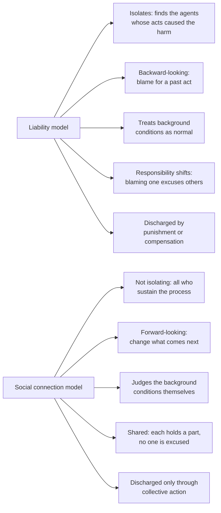

# Political Philosophy · Lesson 4.4: Feminist political philosophy

> ⏱ ~15 min · Module 4: Legitimacy and public reason · Builds on: [4.1 Political liberalism](04-01-political-liberalism.md), [2.2 Rawls I](02-02-rawls-the-original-position.md) · Unlocks: [5.1 Why democracy?](05-01-why-democracy.md), [6.4 Who should provide?](06-04-welfare-property-and-subsidiarity.md)

## Why this matters

Every theory in this course so far draws a line between what the state answers for and what it leaves alone. Contract theories imagine adults bargaining as equals; Rawls makes the [basic structure](../reference.md#basic-structure) the subject of justice and leaves associations to run themselves. Feminist political philosophy asks what that line hides: who raised the bargainers, who cares for those who cannot bargain, and who absorbs the costs of arrangements nobody chose. This lesson takes three of its arguments (the family, care, structure) and asks the course's question of each: can liberalism absorb the critique, or does the critique change what liberalism is?

## The idea

**The personal is political.** The slogan of second-wave feminism is usually traced to Carol Hanisch's 1970 essay of that title, though Hanisch has said the editors of *Notes from the Second Year* chose the title, not she. Its analytic content is a claim about the [public and private](../reference.md#public-and-private) line: relations within marriage and the household involve power, so they raise questions of justice, and calling them "private" does not make them so. That is a *conceptual* claim about where justice applies. It does not by itself say what the state may coerce, which is a *normative* question about [legitimacy](../reference.md#legitimacy). Keep the two apart; most bad arguments on both sides slide from one to the other.

Three critiques give the slogan content.

1. **The family (Okin).** Susan Moller Okin, *Justice, Gender, and the Family* (1989), argued that Rawls's theory, applied consistently, condemns the gender-structured family, and that Rawls had assumed rather than examined the justice of families.
2. **Care and dependency (Kittay).** Eva Feder Kittay, *Love's Labor* (1999), argued that dependency is inevitable: everyone is a dependent infant, most are dependent when ill or old, some always are. Someone does the *dependency work* of caring for them, and that work makes the carer dependent in turn, on whoever provides for her while she cares. A theory that models citizens as independent cooperators over a whole life has written both kinds of dependency out. Kittay proposes a principle she calls **doulia** (after the *doula*, who cares for the new mother): as we were cared for, society must support those who care, including caring for the carers ([dependency work and doulia](../reference.md#dependency-work-and-doulia)).
3. **Structure (Young).** Iris Marion Young, *Responsibility for Justice* (2011), argued that much injustice is [structural](../reference.md#structural-injustice): the normal working of social processes, each action within the rules, puts some groups under systematic threat of domination or deprivation. [`philosophy-of-economics` 5.5](../../philosophy-of-economics/lessons/05-05-hayek-knowledge-order-and-the-mirage-of-social-justice.md) used this against Hayek's claim that injustice needs a wrongdoer; here the question is what it implies for *responsibility*.

One line on contract: Carole Pateman's *The Sexual Contract* (1988) argued that the classic social contract presupposed a prior, unacknowledged contract securing men's political right over women. The contract theorists themselves are [`history-of-political-thought`](../../history-of-political-thought/syllabus.md)'s, and Wollstonecraft's attack on husbands' arbitrary power is its [5.4](../../history-of-political-thought/lessons/05-04-wollstonecraft-rights-virtue-and-education.md), which already read her as a theorist of domination ([3.1](03-01-three-concepts-of-liberty.md)).

## The argument

**Okin's argument, reconstructed** (paraphrased).

1. **(Normative, Rawls's own)** The principles of justice govern the basic structure: the institutions whose effects on people's prospects are profound and present from the start.
2. **(Empirical)** The family profoundly shapes prospects from the start: who does unpaid work, who builds earning power, who can afford to leave.
3. ∴ **C1.** The family is part of the basic structure.
4. **(Normative, Rawls's own)** A just society is stable only if citizens acquire a sense of justice, and they first learn it in the family.
5. **(Empirical)** A family organized by gender hierarchy teaches dependence and command, not reciprocity. It is a poor *school of justice*.
6. **(Empirical)** Gender-structured marriage makes women vulnerable at every stage: anticipating it shapes girls' choices, inside it the spouse with less earning power has less voice and worse exit options, and at divorce her income falls while his does not. Okin calls this *vulnerability by marriage*.
7. ∴ **C2.** Justice requires that the family's structure itself become just, and that public policy make an egalitarian family feasible: earnings shared between spouses, parental leave, childcare, work arranged around parenting.

*In words:* by Rawls's own standards the family is part of the basic structure, and the gendered family fails them twice, as a distributor of prospects and as the place citizens learn justice.

**Rawls's reply.** In "The Idea of Public Reason Revisited" (*University of Chicago Law Review*, 1997, §5) Rawls accepted C1 outright. But political principles apply *directly* to the basic structure and only *indirectly* to associations within it. A church need not elect its bishops or obey the difference principle; it may not jail heretics, and members may leave. Likewise the family: wives have all the rights of citizens, children are protected as future citizens, abuse is outlawed, and Rawls endorsed counting a wife's child-rearing as entitling her to an equal share of income earned during the marriage. A private sphere exempt from justice, he said, does not exist. But a gendered division of labor that is "fully voluntary" (adopted for religious reasons, say, not because wage discrimination makes it the rational choice) may persist; only *involuntary* division is to be reduced to zero, and equal division may not be mandated or penalized.

**Where the argument is weakest.** The step from C1 to C2's "the family's structure itself". Rawls grants that the family is in the basic structure and denies that this licenses governing its internal life, on grounds of liberty of conscience and association. Okin's side presses the word "voluntary": choices made inside a structure that rewards the gendered division are what that structure produces, so the test of voluntariness carries the whole dispute. Rawls's side answers that the test is applied by fixing the background (wages, leave, divorce law) and then respecting what people choose, which is what liberalism does everywhere. The disagreement is less about whether the family is a site of justice than about when a choice is one's own.

## The two models of responsibility

Young's further claim is that structural injustice needs its own model of responsibility.

Read across the rows. The [social connection model](../reference.md#social-connection-model) does not replace liability: where someone did wrong, blame them. It adds a responsibility for the harms no liable party explains. Young graded how much each agent owes by four parameters: **power** over the process, **privilege** from it, **interest** in changing it (victims have a strong one) and **collective ability** to act.

## Worked examples

**Example 1 (clean): leave quotas.** Invented case. The Republic of Ostrel offers 12 months of paid parental leave per child. Families now split it as they like, and mothers take 11 months on average. A bill reserves 4 months for each parent, use-it-or-lose-it; 4 remain shareable.

*Okin* supports it. The gendered split is not a private preference but the output of the structure (P6): the lower earner takes the leave, her earning power falls further, and the next choice is more lopsided. Reserved months change the default and the incentive, and they teach children the reciprocity of P5.

*A neutralist in Rawls's 1997 mould* asks what the bill aims at. If the aim is to make the remaining division voluntary (fathers who wanted leave were deterred by employers and by the earnings gap), it is a change to the background that Rawls's text allows. If the aim is to bring families to an egalitarian ideal, and a religious family that wants the mother home loses 4 months of benefit for its choice, he will ask whether that is a penalty on a protected choice. The case turns on the bill's justification, not its content. Same statute, two possible rationales.

**Example 2 (hard): a supply chain.** Invented case. A fire at a lawful garment factory in the invented port of Selmara kills workers; inspectors find no breach of local law, though wages are at subsistence and shifts run 12 hours. The factory sells to a brand, which sells to millions of buyers abroad.

*The liability model* looks for a wrongdoer and finds at most the owner's negligence. Everything else (wages, hours, pricing pressure from the brand) is lawful background, so it assigns no responsibility for that.

*The social connection model* says the background is the problem. The brand has great power and privilege; consumers have little power each but some privilege and real collective ability (organized campaigns); workers have the strongest interest, and their organizations a role in any remedy. Everyone connected owes a share in changing the process, without anyone being blamed.

Where it strains. How much does one shopper owe, and owes it to do what? The parameters rank agents but yield no quantity, and responsibility "discharged only through collective action" can leave each individual without a determinate duty. Critics add that responsibility without fault risks being sympathy under another name, the line [`philosophy-of-economics` 5.5](../../philosophy-of-economics/lessons/05-05-hayek-knowledge-order-and-the-mirage-of-social-justice.md) gave to Hayek. Young's reply is that political responsibility is meant to be open-ended: it tells you to join the effort, and the form is settled in public action, not in advance.

## Watch out

- **You might think "the personal is political" licenses state control of family life, but actually it is a claim about where justice applies.** Whether the state may coerce to correct an injustice is a further question of legitimacy. Rawls accepts the first claim and limits the second; Okin's remedies are mostly background policy (earnings sharing, leave, childcare), not supervision of households.
- **You might think Rawls's 1997 reply exempts the family from justice, but actually it says the opposite.** He calls the family part of the basic structure and protects every member's rights within it. The dispute is over direct versus indirect application, and over "voluntary".
- **You might think Young's model blames everyone, but actually it blames no one for the structure.** Social-connection responsibility is forward-looking and political, not guilt; liability for wrongful acts survives alongside it.

## One-liner

> Feminist political philosophy presses three questions liberalism thought it had settled: whether the family's internal order is a question of justice (Okin), who cares for the dependent and who cares for the carers (Kittay), and who answers for harms produced by everyone following the rules (Young).

## Problems

**P1 (🟢) *(Exegetical.)*** Diagnose. An **invented** speech by a fictional city councillor, not the words of any real person:

> (i) "Our pension rules count a year spent nursing a disabled parent as a year of zero contribution, as if the person doing it were idle and needed no one."
> (ii) "We are told that how couples divide the housework is their own business. But a marriage in which one partner cannot afford to leave is not a private matter."
> (iii) "No landlord in this city broke a law last year, and still the same neighbourhoods saw the evictions. We all keep that system running, and we all have to change it."

For each sentence, name which of the lesson's three critiques it uses (Okin's family argument, Kittay's care and dependency, Young's structural injustice) and the specific idea from that critique it invokes. One line each.

**P2 (🟡) *(Exegetical (a) · Evaluative (b).)*** Apply to a hard case. Invented case. In the town of Harrow Vale, home-care aides for the elderly, almost all women, are employed through agencies at the legal minimum wage, with unpaid travel between clients. Agencies bid for the town's contracts on price; the town council picks the lowest bid; families who pay top-ups choose cheaper agencies; nobody breaks any law. Many aides cannot afford care for their own children.

(a) Say what the liability model concludes about responsibility here, and rank the council, the agencies, the paying families and the aides by Young's parameters, naming the parameter that places each. 100 words or fewer. (b) Give the strongest objection to applying the social connection model here and say whether it generalizes beyond this case. 100 words or fewer. Any verdict passes.

**P3 (🔴, optional) *(Evaluative.)*** Counterexample and reply. Rawls's 1997 view: political principles apply to the family only indirectly, through the equal rights of its members as citizens and their freedom to leave, and a fully voluntary gendered division of labor may persist. Build an invented case in which every member's rights are respected and the division of labor looks voluntary, yet Okin would say an injustice remains. Then give the strongest Rawlsian reply. 150 words or fewer. Any verdict passes.

Solutions

**P1** *(Exegetical, strict)*

**Must hit, strict:**

- (i) **Kittay:** dependency work (care for an inevitably dependent parent) treated as non-contribution, and the carer's derivative dependency ("needed no one") ignored; the remedy direction is doulia, support for the carer.
- (ii) **Okin:** the family as part of the basic structure, through vulnerability by marriage (unequal exit options); also "the personal is political", the claim that calling the household private does not remove it from justice.
- (iii) **Young:** structural injustice (harm with no lawbreaker, patterned on groups) and the social connection model (all who sustain the process share forward-looking responsibility to change it).

**Wrong turns:** filing (iii) under Okin because it concerns housing and families; filing (i) under Okin because carers are often women, when its idea is dependency and support for carers, not the family's internal justice; reading (iii)'s "we all" as blame, which the speech does not assign.

**Model answer:** (i) Kittay: caring for a dependent is dependency work, and the carer becomes dependent herself. (ii) Okin: the family is a site of justice; unequal exit is vulnerability by marriage. (iii) Young: structural injustice without a wrongdoer, and shared, forward-looking responsibility under the social connection model.

---

**P2** *(Exegetical (a), strict · Evaluative (b), graded on moves)*

**Must hit, strict (a):**

- Liability model: no agent acted wrongfully (all lawful), so it assigns no responsibility for the aides' condition; it treats the bidding and wage rules as normal background.
- Council: most **power** (it sets the contract terms and could price in travel time), and collective ability.
- Agencies: **power** over wages and schedules within the contract, and **privilege** (they profit).
- Paying families: **privilege** (cheaper care) and some **collective ability**, little power individually.
- Aides: the strongest **interest** in change; their role is as agents of the remedy (organizing), not as bearers of blame.

**Must hit, any verdict (b):**

- A precise objection, e.g. indeterminacy (the parameters rank agents but give no one a determinate duty), dilution (shared by all, owed by none), or that "responsibility without fault" is sympathy under another name.
- Whether it generalizes: indeterminacy affects every application of the model, not just this case; or the reply that here a single agent (the council) has a clear lever, so the model is most determinate exactly where power is concentrated.

**Wrong turns:** blaming the agencies under the liability model when they broke no law; putting the aides at the bottom with "no responsibility", when Young gives victims a strong interest and a role in the remedy; answering (b) with a verdict and no objection.

**Model answer (a):** No one acted wrongfully, so the liability model finds no one responsible and treats lowest-bid contracting as background. On Young's model the council ranks first by power (it writes the contract), the agencies next by power and privilege, the paying families by privilege and collective ability, and the aides hold the strongest interest and a role in organizing the change.

**Model answer (b), one of several:** The strongest objection is indeterminacy: the model ranks agents but tells no family what it must do or how much, so "shared responsibility" may yield no duty anyone can fail. It generalizes to every structural case. Here, though, it bites less, since the council can change the contract terms directly; the model is most determinate where power is concentrated and weakest where it is diffuse.

---

**P3** *(Evaluative, graded on moves)*

**Accept:** any invented case in which (1) every member has full civil rights and could leave, (2) the gendered division is not coerced and looks chosen, and (3) the choice is shaped by the background in a way Okin would call unjust; then a Rawlsian reply at strength.

**Must hit, any verdict:**

- A case meeting all three conditions, with the mechanism stated (e.g. the wage gap or the absence of leave making the gendered split the rational choice).
- Okin's diagnosis: the choice is an output of the structure, so it is involuntary in the sense that matters, and the family's division compounds vulnerability (P6).
- The Rawlsian reply at strength: Rawls's own test already condemns a division adopted because discrimination elsewhere makes it rational; the remedy is to fix the background, not to govern the household, and once the background is just, the remaining choice is the family's.
- The crux named: what makes a division "fully voluntary".

**Wrong turns:** a case with a legal disability (no right to leave, no property rights), which Rawls's indirect view already condemns, so it is not a counterexample; presenting Rawls as saying the family is outside justice.

**Model answer, one of several:** Invented case. Ana and Ben, both teachers, expect a child. Ben earns 20 percent more because his school pays a seniority bonus she lost on a career break. They agree she will stay home; no one pressures her, and she could leave the marriage at will. Ten years on, her earnings and exit options have collapsed. Okin: every right was respected, but the choice was manufactured by the structure, and the family now teaches its children that care is women's work. Rawls's reply: his test already counts a division chosen because the wider system makes it rational as involuntary, and requires it be reduced to zero, by fixing pay rules, leave and divorce law, not the household. The crux is what "fully voluntary" means: Rawls fixes the background and then defers; Okin doubts the background can ever be fixed enough for deference to be safe.

## Flashback

**From Lesson [4.2](04-02-public-reason-and-religious-argument.md) (Public reason and religious argument):** *(Exegetical (a)-(b).)* Find the crux. Invented case. The Republic of Corvel holds a referendum on a constitutional amendment guaranteeing every employee one common weekly day of rest. A labour federation publishes a full public case for it: workers' health, time for family life, and fair bargaining power. Teodor studies that case carefully, discusses it with critics, and finds it weak. He votes yes anyway, solely because he believes God commands a weekly day of rest. The amendment passes.
*Commentator Hale:* "Teodor failed a moral duty he owed his fellow citizens, though the amendment is legitimate."
*Commentator Imre:* "Teodor did nothing wrong. Legitimacy needs a public case for the law to exist, and one does."
(a) Both commentators accept the liberal principle of legitimacy as a test for laws. Name the premise of 4.2's reconstruction that they divide on, say what each holds about it, and name the theorist whose view Imre takes. Three sentences. (b) Say what kind of argument could move either commentator, and why a survey showing how many yes voters shared Teodor's motive would not. Two sentences.

Solution

**Must hit, strict (a):**

- The premise is P4: citizens who exercise political power over one another owe one another a justification meeting the standard of the liberal principle of legitimacy, so each voter on fundamentals must be able to justify her position by public reasons (the duty of civility).
- Hale accepts P4: Teodor, having no public reason he sincerely holds, breaches the duty, but the law is still legitimate because a public case for it exists.
- Imre denies P4, holding that P1 is satisfied whenever the law *has* a public justification, whoever voted for it and why. This is Eberle's view: Teodor engaged conscientiously (sought the public case, weighed critics), and nothing further, such as restraint, is owed.

**Must hit, strict (b):**

- What would move either: an argument about what respect for persons requires, whether it is owed in the act of coercing (voting on reasons others cannot share treats them as objects to be managed) or only in the result (and whether demanding restraint unfairly singles out religious citizens' deepest commitments).
- The survey is empirical; both commentators can accept any finding about voters' motives, because their dispute is the normative one about what a voter owes.

**Wrong turns:** locating the disagreement in legitimacy (both grant the amendment is legitimate; that is why the crux is P4, not P1); saying Teodor's vote makes the law non-binding on others, which runs legitimacy and political obligation together; treating Teodor as covered by the background-culture exemption (he is a citizen voting on a constitutional essential, which is inside the public political forum).

**Model answer:** (a) They divide on P4, the step from a test for laws to a duty on citizens' reasons. Hale accepts it: a voter on fundamentals must be able to justify her vote by public reasons, so Teodor did wrong even though the law, which has a public case, is legitimate. Imre denies it with Eberle: conscientious engagement is owed, restraint is not, and Teodor engaged. (b) Only an argument about the respect citizens owe one another, in the act of coercing or only in the result, could move either. A survey of motives reports facts both already accept as possible; the question is what a voter owes, which no count of voters answers.

## Connections

- **Backward:** [2.2](02-02-rawls-the-original-position.md) made the basic structure the subject of justice; Okin's argument is that Rawls's own premises reach the family. [4.1](04-01-political-liberalism.md)'s split between political and comprehensive doctrines is what Rawls's 1997 reply uses to protect a religiously chosen division of labor. Anderson's harshness objection in [2.6](02-06-luck-relations-priority-and-sufficiency.md) already named unpaid caregivers made dependent by doing their duty, Kittay's derivative dependency.
- **Forward:** [6.4](06-04-welfare-property-and-subsidiarity.md) asks who should provide against need; doulia is one answer, and the reciprocity objection to basic income must say whether care work counts as contribution. [5.1](05-01-why-democracy.md) asks whether democracy is justified by what it produces or by the equality it expresses, which is where Young's political responsibility gets exercised.
- **Sideways:** Young's structural injustice against Hayek's mirage of social justice is [`philosophy-of-economics` 5.5](../../philosophy-of-economics/lessons/05-05-hayek-knowledge-order-and-the-mirage-of-social-justice.md). Wollstonecraft on husbands' arbitrary power, read as republican non-domination, is [`history-of-political-thought` 5.4](../../history-of-political-thought/lessons/05-04-wollstonecraft-rights-virtue-and-education.md); Pateman's sexual contract is a reading of the contract theorists that course teaches.
