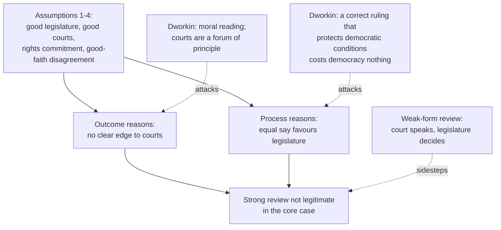

# Political Philosophy · Lesson 5.2: Majority rule vs rights: judicial review

> ⏱ ~15 min · Module 5: Democracy and its foundations · Builds on: [5.1 Why democracy?](05-01-why-democracy.md), [1.1 The problem of political authority](01-01-the-problem-of-political-authority.md) · Unlocks: [5.3 Deliberative vs aggregative democracy](05-03-deliberative-vs-aggregative-democracy.md), [5.4 Does social choice wound democracy?](05-04-does-social-choice-wound-democracy.md)

## Why this matters

In many democracies a handful of judges can set aside a statute passed by an elected legislature. If [5.1](05-01-why-democracy.md) is right that democracy has intrinsic value, because it gives each citizen an equal say, then that power needs a defence. If democracy is valuable mainly for its results, the defence may be easy: courts can protect rights that majorities trample. This lesson asks who should have the last word on rights when citizens disagree about them. That is a question about [legitimacy](../reference.md#legitimacy), not about which rulings are correct.

## The idea

Alexander Bickel (*The Least Dangerous Branch*, 1962) named the problem the **[counter-majoritarian difficulty](../reference.md#counter-majoritarian-difficulty)**. When a court strikes down a statute, it overrides the people's actual representatives. Bickel named the difficulty in order to answer it; he defended review. But he insisted the defence be made, not assumed.

Three ideas support entrenching rights beyond a majority's reach:

- **Tyranny of the majority.** Majorities can oppress through perfectly regular votes. Madison's majority faction ([`history-of-political-thought` 5.2](../../history-of-political-thought/lessons/05-02-the-federalist-faction-and-the-extended-republic.md)) and Tocqueville's majority that occupies every office ([6.3](../../history-of-political-thought/lessons/06-03-tocqueville-tyranny-of-the-majority-and-soft-despotism.md)) are the classic statements. A court, on this view, is one office the majority does not occupy.
- **[Precommitment](../reference.md#precommitment).** Ulysses has himself tied to the mast because he knows he will want to steer toward the Sirens. A people might likewise bind itself, in a calm moment, against the passions it expects to feel. Jon Elster developed the analogy (*Ulysses and the Sirens*, 1979), then questioned it (*Ulysses Unbound*, 2000): framers bind *other* people, later generations, and they often write in crisis, not calm.
- **The [moral reading](../reference.md#moral-reading).** Ronald Dworkin (*Freedom's Law*, 1996) argued that a constitution's abstract clauses, such as equal protection and free speech, state moral principles. Applying them means making moral judgments, and courts are one institution charged with making them.

Against all three stands Jeremy Waldron. His starting point (*Law and Disagreement*, 1999) is what he calls, borrowing Rawls's phrasing about justice, **the circumstances of politics**: we need a common decision even though we disagree about what it should be. Disagreement about rights is not the exception. Rights *are* among the things we disagree about.

## The argument

**[Waldron's case against strong judicial review](../reference.md#waldrons-case-against-judicial-review)** ("The Core of the Case Against Judicial Review", *Yale Law Journal*, 2006). The target is **strong-form** review: a court may decline to apply a statute, or rewrite its effect. **Weak-form** review lets a court say a statute violates rights while leaving the legislature the last word ([strong and weak review](../reference.md#strong-and-weak-judicial-review)).

The argument is conditional. It holds for a society meeting four assumptions:

1. **(Empirical)** Democratic institutions in reasonably good order, including a representative legislature elected by universal adult suffrage.
2. **(Empirical)** Courts also in reasonably good order, independent, deciding cases under the rule of law.
3. **(Empirical)** A commitment, by most citizens and most officials, to individual and minority rights.
4. **(Empirical)** Persistent, substantial, good-faith disagreement about what those rights are and what they require.

Then:

5. **(Normative)** An institution that settles disputes about rights can be defended by **outcome-related reasons** (it gets rights right more often) or **process-related reasons** (it decides in a way that is fair to those bound, whatever it decides).
6. **(Empirical and conceptual)** Outcome reasons do not clearly favour courts. Judges argue about legal texts and precedents. Legislators can debate the moral issue directly. And the record of each is mixed.
7. **(Normative)** Process reasons clearly favour the legislature. Where reasonable people disagree, a procedure that gives each citizen an equal say respects them as equals. Courts, too, decide split cases by majority vote, but among a few unelected people.

∴ **C.** In a society meeting 1-4, strong judicial review is not legitimate: it removes final decision on rights from the citizens without an outcome reason that justifies it.

*In words:* if we all care about rights and honestly disagree about them, the fair way to settle the disagreement is the one that counts everyone equally.

**Dworkin's reply** attacks premise 7 at its root. On what he called the **majoritarian premise**, an outcome is democratic only if a majority would endorse it. Dworkin replaced it with a **constitutional conception** of democracy, later renamed the **partnership conception**. Self-government is collective action by citizens who are free and equal partners. That status has preconditions, among them equal concern, a real say, and independence in matters of conscience. A decision that protects those preconditions is no defeat for democracy, whoever makes it. If the court rules correctly, nobody's democratic standing is lost. The only loss is the citizen's chance to vote on that one question, which is a small cost, borne equally by all.

**Where the argument is weakest.** Premise 6, and assumption 1's phrase "reasonably good order". A critic says premise 6 is an empirical claim argued from the armchair. Whether courts or legislatures protect minorities better is a question of history and institutional design. Also, "good order" may quietly assume the very protections whose absence makes review attractive. Waldron answers that his claim is comparative and modest: he needs only that courts show no clear advantage. A society whose legislature is broken falls outside his argument. He does not claim it supports him there.

## The argument map

Waldron's case rests on two pillars over four assumptions. Dworkin attacks both pillars. Weak-form review accepts the conclusion and offers a design that respects it.

## Worked examples

**Example 1 (clean): the same statute under two designs.** Invented case. Two neighbouring parliamentary states each pass a Public Assemblies Act requiring 30 days' notice before any demonstration. Spontaneous protest becomes illegal. Both have a bill of rights protecting peaceable assembly, and both satisfy assumptions 1-4. Citizens split in good faith on whether public order justifies the notice rule.

- **Strong form (Kestria).** The Constitutional Court holds the Act void. It stops applying, and the legislature can reverse the ruling only by constitutional amendment.
- **Weak form (Loma).** The High Court issues a declaration that the Act is incompatible with the bill of rights. The Act stays valid. Parliament must decide whether to amend it.

Run the views. **Waldron:** Kestria's ruling is the core case. Five judges settled a good-faith disagreement over the votes of an equally committed legislature, and nothing about the issue showed the court reasons better. Loma's design leaves the final say with equal citizens' representatives, so his process objection falls away. **Dworkin:** if spontaneous assembly is part of what free citizens need to be partners in self-government, Kestria's court protected a democratic condition. Kestria lost nothing democratic; Loma risks leaving the violation in place. Each verdict follows from the theory's own premises. The disagreement is about premise 7, not about the facts.

**Example 2 (hard): assumption 1 fails.** Invented case. In Corvaine, residents who do not speak the majority language must pass a fluency test to vote. In practice this excludes a fifth of adults, almost all from one minority. The legislature then closes the minority's state schools.

Waldron's argument does not reach this case. A legislature elected by a franchise that excludes a fifth of adults is not in "reasonably good order", and his conclusion was conditional on that. Other defences of review apply directly. John Hart Ely (*Democracy and Distrust*, 1980) argued that courts should police the channels of political change and protect minorities the process shuts out. On that view, striking down the fluency test makes Corvaine *more* democratic.

Now weaken the case. Remove the test, so the minority votes, but it is outvoted on every issue that matters to it, election after election. Assumption 1 now holds on paper. Whether a legislature is in "good order" when a permanent minority never wins is exactly where Waldron's framework stops giving a verdict. It needs an account of good order that the four assumptions do not supply.

## Watch out

- **You might think showing a ruling was correct shows the court was entitled to make it, but actually those are different questions.** That a decision protects rights is an outcome reason, a [justification](../reference.md#justification-and-legitimacy). Whether the court had the right to impose it over the legislature is a question of [legitimacy and authority](../reference.md#power-legitimacy-authority-obligation). Waldron's process argument lives entirely in the second. Dworkin's reply tries to close the gap: a correct ruling that protects democratic conditions is, for him, legitimate for that reason.
- **You might think "courts protect minorities better" is the normative core of the case for review, but actually it is an empirical claim.** It belongs to premise 6, and history can test it. The normative core is what a citizen is owed when she loses a vote on her rights: an equal say (Waldron), or a decision that treats her as a partner (Dworkin).
- **You might think Waldron opposes all judicial review, but actually his target is strong-form review of legislation, in societies meeting four assumptions.** Courts applying statutes, reviewing executive action, or issuing weak-form declarations are outside the core case.

## One-liner

> The counter-majoritarian difficulty asks who has the last word on rights when citizens disagree. Waldron says equal say favours the legislature wherever democracy and rights-commitment are in good order, Dworkin says a correct ruling protecting the conditions of partnership costs democracy nothing, and weak-form review splits the difference.

## Problems

**P1 (🟢) *(Exegetical (a)-(b).)*** Diagnose. Three invented societies, each with a bill of rights and a court that can strike down statutes.

> (i) **Arvel.** Elections are free and universal, and judges are independent. But most citizens and most legislators openly hold that the religious minority's members have no claims of conscience the state need respect, and say so in debate.
> (ii) **Brennic.** Elections are free and universal, and citizens are broadly committed to minority rights and disagree in good faith about their scope. But judges serve at the pleasure of the governing party and are routinely removed after ruling against it.
> (iii) **Castamere.** Elections are free and universal, and judges are independent. Citizens and officials alike profess commitment to equal rights, and after long public debate they remain divided, roughly 55 to 45, on whether the right to privacy covers a contested medical practice.

(a) For each, name which of Waldron's four assumptions fails, or say that none does. One line each. (b) In the society where the courts fail, does that failure weaken Waldron's conclusion against strong review there, or leave it standing? Two sentences.

**P2 (🟡) *(Exegetical (a)-(b).)*** Find the crux. Waldron and Dworkin agree that rights matter, that citizens disagree about them, and that judges decide split cases by majority vote. (a) State, as a single sentence, the premise about democratic legitimacy that Waldron affirms and Dworkin denies. (b) Say what kind of argument, not evidence, could move one of them on it, and why new data on court performance would not settle it. 100 words or fewer for (b).

**P3 (🔴, optional) *(Exegetical (a) · Evaluative (b).)*** Apply to a hard case. Invented case. The Republic of Tessaly's legislature passes a law letting towns ban street preaching within 100 metres of a school. Under Tessaly's Rights Act, the High Court may issue only a declaration of incompatibility. It does so, holding the ban violates religious expression. After a month of debate, the legislature re-enacts the law unchanged by 60 votes to 40, citing children's safety from harassment. (a) What legal effect did the court's declaration have, and who had the last word? Two sentences. (b) Does Tessaly's design meet Waldron's process objection, and does it satisfy Dworkin? Then name one way the design could fail in practice. 150 words or fewer. Any verdict passes.

Solutions

**P1** *(Exegetical (a)-(b), strict)*

**Must hit, strict (a):**

- (i) Arvel: assumption 3 fails. There is no general commitment to minority rights; the majority denies the minority has the claims at all.
- (ii) Brennic: assumption 2 fails. Courts are not independent, so not in reasonably good order.
- (iii) Castamere: none fails. This is the core case: working institutions, shared commitment to rights, persistent good-faith disagreement about their content.

**Must hit, strict (b):**

- Brennic's failure leaves Waldron's conclusion standing, and if anything strengthens it. Assumption 2 was a concession to the defender of review, setting up the fairest comparison.
- Captured courts weaken the outcome reasons for review. The process reasons for the legislature are untouched.

**Wrong turns:** calling (i) a failure of assumption 4. Arvel's majority does not disagree in good faith about the scope of a right it accepts; it rejects the right. Calling (iii) a failure because the split is close: closeness *is* substantial disagreement. Assuming any failed assumption helps the case for review, when only failures of 1 or 3 do.

**Model answer:** (a) Arvel breaks assumption 3, Brennic assumption 2, and Castamere breaks none: it is Waldron's core case. (b) In Brennic the conclusion still stands. Waldron granted good courts so that review would face its best comparison, and courts that bend to the governing party have even less claim to outcome reasons, while the legislature keeps its process reasons.

---

**P2** *(Exegetical (a)-(b), strict)*

**Must hit, strict (a):**

- The crux: whether removing a decision about rights from citizens' equal say is a loss of democratic legitimacy *even when the decision reached is correct*. Waldron affirms it; Dworkin denies it, because a correct ruling protecting the preconditions of partnership is itself democratic.

**Must hit, strict (b):**

- The premise is normative and conceptual: it concerns what democracy *is* and what citizens are owed, so it moves only by argument about the value of equal participation versus the conditions of partnership.
- Data on court performance bear on premise 6, the outcome reasons. Both sides can accept any such data and keep their view on process.

**Wrong turns:** naming "courts protect rights better" as the crux. That is an empirical premise, and Dworkin's reply does not rest on courts being generally better. Naming "rights matter" or "disagreement exists": both affirm those.

**Model answer:** (a) A decision on rights taken away from an equal-say procedure loses democratic legitimacy even if it is the right decision. (b) Only an argument about what democracy is could move either side. Examples: a case where equal participation seems worthless if it destroys someone's standing as a partner (pressing Waldron), or a case where a correct imposed ruling seems to insult citizens' agency (pressing Dworkin). Evidence that courts get more rulings right bears only on outcome reasons, and Waldron keeps his process reasons even if he grants it.

---

**P3** *(Exegetical (a), strict · Evaluative (b), any verdict)*

**Must hit, strict (a):**

- The declaration left the law valid and in force. It had no effect on the law's validity, only a formal finding that put the issue back to the legislature.
- The legislature had the last word, and used it. This is weak-form review.

**Must hit, any verdict (b):**

- Waldron's process objection is met on its own terms. The final decision rests with representatives elected on an equal franchise, after the court has had its say. His target was strong-form review.
- Dworkin is not satisfied if the court was right, since a rights violation now stands with the legislature's endorsement. Say whether the re-enactment was a good-faith disagreement (the safety rationale) or an override of a right the majority shares.
- One practical failure, labelled empirical: legislatures may defer automatically, so the design collapses into strong-form review in all but name; or ignore declarations routinely, so it gives no rights protection at all.

**Wrong turns:** saying the court "lost" so review failed. The design worked as built; the question is whether the design is right. Treating the 60-40 vote as proof the law is just: that is a process fact, not an outcome one.

**Model answer (b), one of several:** Tessaly answers Waldron's objection. The court gave its reasons, and the decision stayed with representatives of equal citizens, who debated the court's argument and disagreed on a safety rationale a reasonable person could hold. That is the core case resolved the way Waldron wants. Dworkin is not satisfied: if the court read religious expression correctly, the legislature has now knowingly entrenched a violation, and the minority's partnership is impaired whoever voted for it. The design's empirical risk runs both ways. If legislatures always yield to declarations, weak review becomes strong review in practice, and Waldron's objection returns. If they always re-enact, the declaration is a press release, and the case for any review weakens. Which happens is a fact about political culture, not settled by the design.

## Flashback

**From Lesson [4.4](04-04-feminist-political-philosophy.md) (Feminist political philosophy):** *(Exegetical (a)-(b).)* Diagnose. An **invented** op-ed from a newspaper in the invented city of Dunmere, not the words of any real person:

> "Feminists taught us that the personal is political: who cooks, who raises the children and who controls the money are questions of justice. It follows that the city should send inspectors into homes to check how couples divide the chores, and fine any household where one spouse does more than two-thirds of them."

(a) Name the step where the op-ed slides from one kind of claim to another, and name both kinds. Two sentences. (b) A supporter adds: "No division of chores is ever fully voluntary, so Rawls's exception never applies." Say which point of the Okin-Rawls dispute this targets, and what Rawls's 1997 view would do about involuntary division instead of inspectors and fines. Two sentences.

Solution

**Must hit, strict (a):**

- The premise ("the personal is political") is a *conceptual* claim about where justice applies: household relations involve power, so they raise questions of justice.
- The conclusion (inspect and fine households) is a *normative* claim about legitimate coercion. The slide is "this is a site of justice, therefore the state may supervise and penalize it directly"; whether the state may coerce to correct an injustice is a further question of legitimacy.

**Must hit, strict (b):**

- It targets the voluntariness test, the crux of the dispute: what makes a gendered division "fully voluntary" rather than an output of the structure.
- Rawls's answer: political principles apply to the family *indirectly*. He accepts the family is part of the basic structure, but would reduce involuntary division by fixing the background (wage discrimination, leave, divorce law, counting child-rearing toward an equal share of earnings), then respect what families choose; he holds that equal division may not be mandated or penalized, which is exactly what the fines do.

**Wrong turns:** calling the premise false or empirical, when the op-ed's error is the inference, not the slogan; saying Rawls exempts the family from justice (he says no private sphere is exempt); answering (b) with Okin's own remedies as if they were household inspection, when she mostly favoured background policy (earnings sharing, parental leave, childcare).

**Model answer:** (a) The op-ed moves from a conceptual claim, that household relations are a site of justice, to a normative claim about legitimacy, that the state may inspect and fine households to enforce an equal split; the first does not settle the second. (b) The supporter attacks the voluntariness test, the real crux between Okin and Rawls; Rawls would answer that involuntary division is reduced by changing the background (pay, leave, divorce and earnings-sharing rules) while the household's own choice of division, which may not be mandated or penalized, is left to its members.

## Connections

- **Backward:** [5.1](05-01-why-democracy.md) separated instrumental from intrinsic justifications of democracy. Waldron's outcome and process reasons are that split applied to an institution. The legitimacy/authority vocabulary is [1.1](01-01-the-problem-of-political-authority.md)'s. [`philosophical-method` 4.2](../../philosophical-method/lessons/04-02-steelmanning-and-the-burden-of-proof.md) steelmanned abolishing review; this lesson gives the argument its conditions and its reply.
- **Forward:** [5.3](05-03-deliberative-vs-aggregative-democracy.md) asks whether a court can be a forum of deliberation, as Dworkin hoped. [5.4](05-04-does-social-choice-wound-democracy.md) asks whether there is a coherent "majority will" for a court to override at all.
- **Sideways:** the designs (diffuse vs concentrated review, Canada's notwithstanding clause, the UK Human Rights Act's declarations of incompatibility) are compared in [`political-institutions`](../../political-institutions/syllabus.md) [5.3](../../political-institutions/lessons/05-03-judicial-review-compared.md)-[5.4](../../political-institutions/lessons/05-04-weak-form-review-appointments-and-independence.md). Hart vs Dworkin on law and interpretation is [`philosophy-of-law`](../../philosophy-of-law/syllabus.md); US doctrine is [`constitutional-law`](../../constitutional-law/syllabus.md). Tyranny of the majority ↔ Tocqueville in [`history-of-political-thought` 6.3](../../history-of-political-thought/lessons/06-03-tocqueville-tyranny-of-the-majority-and-soft-despotism.md).
