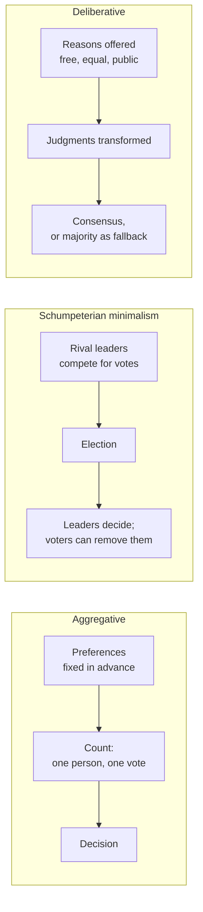

# Political Philosophy · Lesson 5.3: Deliberative vs aggregative democracy

> ⏱ ~15 min · Module 5: Democracy and its foundations · Builds on: [5.1 Why democracy?](05-01-why-democracy.md), [4.2 Public reason and religious argument](04-02-public-reason-and-religious-argument.md) · Unlocks: [5.4 Does social choice wound democracy?](05-04-does-social-choice-wound-democracy.md)

## Why this matters

[5.1](05-01-why-democracy.md) asked why the people should rule. This lesson asks what the people *do* when they rule. One answer: they count. Each citizen brings preferences, the procedure adds them up, the biggest pile wins. The other: they reason together, and the reasons change what they want before anything is counted. The choice decides what makes a democratic outcome legitimate, and it decides how much damage [5.4](05-04-does-social-choice-wound-democracy.md)'s social-choice results can do.

## The idea

**[Aggregative democracy](../reference.md#aggregative-democracy)** treats preferences as inputs, fixed before politics begins. Democracy is a fair machine for turning many preferences into one decision: one person, one vote, majority or some other rule. Nobody asks where the preferences came from or whether they are self-interested; the procedure's fairness lies in counting each equally. Iris Marion Young (*Inclusion and Democracy*, 2000) used "aggregative" and "deliberative" as the names of the two models, and the labels stuck.

The most austere aggregative view is **[Schumpeterian minimalism](../reference.md#schumpeterian-minimalism)**. Joseph Schumpeter (*Capitalism, Socialism and Democracy*, 1942) attacked what he called the classical doctrine, on which the people have a definite will about the common good and elect representatives to carry it out. He argued there is no such common good on which all could agree, and that ordinary voters reason poorly about remote political questions. His replacement: democracy is a method in which would-be leaders win the power to decide through a competitive struggle for the people's votes. Citizens do not decide issues; they choose, and can remove, who decides. The view is often called **competitive elitism**. It is deflationary but not anti-democratic: it values peaceful turnover of power and the voters' ability to throw the rascals out.

**[Deliberative democracy](../reference.md#deliberative-democracy)** denies that preferences are fixed inputs. In Joshua Cohen's formulation ("Deliberation and Democratic Legitimacy", 1989), outcomes are democratically legitimate when they could be the object of free and reasoned agreement among equals. His *ideal deliberative procedure* has four features:

1. **Free.** Participants are bound only by the results of their deliberation and its preconditions, not by any prior authority.
2. **Reasoned.** They must give reasons for their proposals, and only the force of reasons settles anything.
3. **Equal.** Each has an equal standing to propose, speak and vote, and neither power nor resources tilt the field.
4. **Aimed at rational consensus.** They seek reasons all can accept; when consensus fails, they vote by majority.

The ideal is a model, not a description of any assembly. Actual institutions are legitimate to the degree they mirror it. Jürgen Habermas (*Between Facts and Norms*, 1992; English 1996) gives a related account built on his **discourse principle**: a norm is valid only if everyone affected could agree to it as participants in rational discourse. He adds a *two-track* picture: opinion forms informally in a wide public sphere and is filtered into law by formal bodies such as parliaments.

The [public reason](../reference.md#public-reason) of [4.2](04-02-public-reason-and-religious-argument.md) returns here. Cohen's "reasoned" condition needs some account of which reasons count, and the natural candidate is reasons that free and equal citizens can accept, which is Rawls's idea moved from the constitution to everyday deliberation. Rawls himself described a well-ordered constitutional democracy as a deliberative one ("The Idea of Public Reason Revisited", 1997).

A useful contrast comes from [`history-of-political-thought` 4.4](../../history-of-political-thought/lessons/04-04-rousseau-the-social-contract.md): Rousseau's *will of all* is a sum of private wants, the aggregative output; his *general will* aims only at the common interest. The deliberativist's hope is that reasoning in public turns the first into something closer to the second. (Rousseau himself trusted silent, faction-free voting more than discussion.)

## The argument

**Cohen's argument for deliberative legitimacy** (reconstructed).

1. **(Normative)** Coercive political power over free and equal citizens is [legitimate](../reference.md#legitimacy) only if it can be justified to them. *In words:* the people coerced are owed reasons, not just a headcount.
2. **(Conceptual)** Justifying a decision to someone means offering reasons she could accept from a standpoint of freedom and equality, not merely showing that more people wanted it.
3. **(Normative)** A procedure in which equals exchange reasons and decide by their force is the institutional expression of mutual justification.
4. **(Conceptual)** Aggregation counts preferences without asking for their reasons, so a bare count justifies nothing to the outvoted beyond "there were more of them."

∴ **C.** Democratic outcomes are legitimate to the extent that they result from, or could result from, free reasoned deliberation among equals; aggregation is legitimate only as the fallback when deliberation runs out.

**The Schumpeterian reply** attacks premise 1 at the level of mass politics, and premise 3 as a description of anything achievable. If citizens cannot form reasoned views about policy (an *empirical* claim), then demanding justification to them asks for something no institution can supply. What legitimates government is that it was authorized by a fair, contested election and can be removed by the next one. That is a *normative* claim about what legitimacy requires, resting partly on the empirical one.

**The empirical worry.** Deliberation has to work as advertised. Cass Sunstein ("The Law of Group Polarization", *Journal of Political Philosophy*, 2002) argued that members of a deliberating group, through [group polarization](../reference.md#group-polarization), predictably move toward a more extreme position in the direction their pre-deliberation views already leaned. Two mechanisms drive this: a like-minded group hears a lopsided pool of arguments, and members shift to keep their standing among peers. Diana Mutz (*Hearing the Other Side: Deliberative versus Participatory Democracy*, 2006) reported a tension within democratic ideals: exposure to opposing views, which deliberation needs, tends to dampen political participation, while like-minded networks spur it. James Fishkin's *deliberative polls* (random samples, balanced briefing materials, moderated small groups, opinion measured before and after) are the deliberativist's main counter-exhibit: structured deliberation among a mixed group, under moderation. Critics argue that such conditions are rare in ordinary politics.

**Where the argument is weakest.** Premise 3, the bridge from ideal to actual. Cohen's procedure confers legitimacy under counterfactual conditions of freedom, equality and reason-responsiveness. A critic says real deliberation is unequal (the articulate and confident dominate) and prone to polarization, so actual deliberative bodies inherit none of the ideal's authority; and since the theory falls back on majority voting whenever consensus fails, which in a large polity is always, its practical verdicts collapse into aggregation's. The deliberativist answers that the ideal is a standard for criticizing and reforming institutions, not a claim that any existing one meets it, and that an outcome reached after reasons were demanded and answered is better justified to the outvoted even if the last step is a vote.

## Map of positions

*Aggregation counts what people already want; minimalism counts votes for who will decide; deliberation changes what people judge before anything is counted.*

## Worked examples

**Example 1 (clean): the Tolby crossing.** Invented case. The 60 voters of the town of Tolby must choose between a bridge and a car ferry. A first poll shows 34 for the bridge, 26 for the ferry.

*Aggregative verdict:* hold the vote; the bridge wins 34 to 26, and the outcome is legitimate because each voter counted once.

*Deliberative route:* a town meeting first. Some bridge voters give the reason that a bridge raises their house prices; that is a reason, but not one the ferry side has any reason to accept, so it carries little weight in public. A ferry supporter shows that the bridge's low span would close the harbour to the eight fishing families who use it. After discussion 9 bridge supporters switch to the ferry and 2 ferry supporters switch to the bridge. The vote is $34-9+2=27$ for the bridge and $26+9-2=33$ for the ferry. The ferry wins.

Neither theory says the ferry is the right answer. The aggregativist sees two equally legitimate counts at different times. Cohen sees the second as better justified, because it was reached by a process in which reasons were demanded and answered, and the outvoted bridge supporters were given an account they could engage with. Note what this shows: [legitimacy](../reference.md#power-legitimacy-authority-obligation) of the decision, not that any resident now has a [political obligation](../reference.md#political-obligation) to obey it.

**Example 2 (hard): the Kessel panel.** Invented case. Kessel County convenes a citizens' panel on a proposed ban on wind turbines. Recruitment is by volunteering, and all 12 volunteers come from the valley that would host the turbines. On a 1 to 7 scale (7 = strongly favour the ban), their pre-deliberation ratings sum to 58, a mean of $58/12\approx4.83$. After two days of discussion the ratings sum to 73, a mean of $73/12\approx6.08$; every member moved toward the ban.

This is Sunstein's pattern exactly: a group leaning one way became more extreme in that direction. Does it embarrass deliberative democracy? Three moves are available, and none is decisive.

- *The ideal was not met.* The panel failed Cohen's equality condition in spirit: one affected group, no one from the towns that would get the power. A deliberativist says this was enclave discussion, not deliberation among all affected (Habermas's condition).
- *Polarization is not error.* If the valley residents learned real facts about noise, a shift toward the ban may be learning, not distortion. A shift's direction says nothing about its accuracy.
- *But then the theory needs a standard.* To call the shift learning rather than conformity, one needs an independent standard of a correct answer, which is the epistemic question of [5.1](05-01-why-democracy.md). Purely procedural deliberativists cannot appeal to one.

The case shows where the theory stops giving a verdict: the procedure's legitimating power depends on conditions that the case's facts alone cannot certify.

## Watch out

- **You might think the polarization findings refute deliberative democracy, but actually they are empirical claims about actual groups, and Cohen's thesis is normative and partly counterfactual.** The findings attack the bridge from the ideal to real institutions (premise 3), not the claim about what legitimacy is. Keep the three kinds of claim apart: whether deliberation changes minds (empirical), what makes a reason public (conceptual), whether legitimacy is procedural (normative).
- **You might think deliberative democracy requires consensus, but actually Cohen's procedure aims at consensus and votes when it fails.** The difference from aggregation is in what precedes the vote and what the vote is taken to mean: a judgment about reasons, not a tally of fixed wants.
- **You might think aggregation means counting selfish preferences, but actually a preference can be a moral judgment.** The aggregative model is indifferent to content; what it does not do is ask for or test reasons. And Schumpeter's minimalism is not a rejection of democracy; it is a claim about what democracy can deliver.

## One-liner

> Aggregative democracy counts preferences as given and Schumpeter counts votes for leaders; deliberative democracy (Cohen, Habermas) makes legitimacy depend on reasons exchanged among equals before the count, and its weakest joint is the bridge from that ideal to actual, polarizing, unequal discussion.

## Problems

**P1 (🟢) *(Exegetical.)*** Diagnose. An **invented** memo to the council of the invented city of Varn, on whether to replace its annual budget referendum. Not the words of any real person.

> (i) "Residents should not be asked to rank seventy budget lines; they should choose a council and fire it if the budget fails them."
> (ii) "A budget is legitimate only if the council can explain to every resident, in terms she could accept, why her neighbourhood got what it got."
> (iii) "In last year's pilot, residents who discussed the budget in mixed groups were less likely to turn out for the vote afterwards."
> (iv) "The referendum simply adds up what each resident wants, and that is what fairness means."

For each sentence, name the model it expresses (aggregative, Schumpeterian, deliberative, or none) and the kind of claim it makes (empirical, conceptual, normative). One line each.

**P2 (🟡) *(Exegetical.)*** Find the crux. Commentator A (a Schumpeterian): "Elected government is legitimate because it won a fair contest and can be voted out; asking it to justify each law to every citizen is a fantasy." Commentator B (following Cohen): "Winning the contest gives power, not legitimacy; legitimacy requires that laws be justifiable to citizens by reasons they could accept." (a) Name the single premise about legitimacy that A must deny and B must affirm. (b) A's case leans on a claim of another kind. Say which kind, and what evidence would bear on it. 100 words or fewer in total.

**P3 (🔴, optional) *(Formal (a) · Evaluative (b).)*** Invented numbers. Two six-member citizens' panels rate a congestion charge on a 1 to 7 scale (7 = strongly favour). Panel A, recruited from one district: before 5, 5, 6, 4, 5, 5; after 6, 6, 7, 5, 6, 6. Panel B, recruited by stratified lottery: before 2, 6, 3, 6, 2, 5; after 3, 5, 4, 5, 3, 4. (a) Compute each panel's mean and range before and after, and say which panel, if either, shows group polarization in Sunstein's sense. (b) A critic says panel A shows that deliberation cannot confer legitimacy. Steelman the critic, then give the deliberativist's best reply, and say where the reply stops determining a verdict. 150 words or fewer. Any verdict passes.

Solutions

**P1** *(Exegetical — strict)*

**Must hit, strict:**

- (i) **Schumpeterian.** Citizens choose and remove leaders rather than decide issues. Normative (what citizens should be asked), resting on an implied empirical claim about their capacity.
- (ii) **Deliberative** (Cohen): legitimacy as justifiability to each citizen by acceptable reasons, the public-reason condition. Normative.
- (iii) **None;** it is evidence bearing on the debate, of the kind Mutz reported (cross-cutting discussion dampens participation). Empirical.
- (iv) **Aggregative:** the procedure adds fixed preferences, and fairness is equal counting. Conceptual and normative: a claim about what fairness *is*, used to justify the referendum.

**Wrong turns:** filing (iii) as an argument *for* deliberation, or as normative, when it reports an observation that cuts against one deliberative hope; filing (i) as aggregative without noting that what Schumpeter counts is votes for leaders, not preferences over policies.

**Model answer:** (i) Schumpeterian, normative (with an empirical premise about competence). (ii) Deliberative, normative. (iii) None, empirical. (iv) Aggregative, conceptual-normative.

---

**P2** *(Exegetical — strict)*

**Must hit, strict (a):**

- The premise: that legitimate coercion requires justifiability to those coerced by reasons they could accept (Cohen's premise 1), not merely authorization by a fair competitive procedure. B affirms; A denies.

**Must hit, strict (b):**

- A's case leans on an **empirical** claim: ordinary citizens cannot form reasoned views about policy, so justification to them is unachievable.
- Evidence: studies of what citizens know and how their views change under structured deliberation (deliberative polls, citizens' assemblies) versus in ordinary politics. This bears on feasibility; it does not by itself settle the normative premise in (a).

**Wrong turns:** naming "whether elections are fair" as the crux, when both grant fair elections; treating the dispute as purely empirical, when B would hold the standard even if no institution meets it.

**Model answer:** (a) The crux is whether legitimacy requires justifiability to the coerced by acceptable reasons, or only a fair, contestable route to power. B affirms the first; A denies it. (b) A also relies on an empirical claim, that citizens cannot reason well about policy, which evidence on deliberative polls and ordinary voter knowledge could move. That evidence bears on feasibility, not on what legitimacy requires.

---

**P3** *(Formal (a) — strict · Evaluative (b) — graded on moves, not verdict)*

(a) Panel A: before sum 30, mean $30/6=5.0$, range $6-4=2$; after sum 36, mean $36/6=6.0$, range $7-5=2$. Panel B: before sum 24, mean $24/6=4.0$, range $6-2=4$; after sum 24, mean $4.0$, range $5-3=2$.

**Must hit, strict (a):**

- The figures above.
- Panel A shows group polarization: it leaned toward the charge (mean 5 above the midpoint 4) and moved further that way (to 6).
- Panel B does not: no pre-deliberation lean (mean at the midpoint), no shift in mean, and the spread narrowed, which is convergence, the opposite pattern.

**Must hit, any verdict (b):**

- Steelman: Cohen's legitimacy flows from deliberation's tendency to track reasons; if real deliberation reliably amplifies prior leanings, it adds conformity, not justification, so the ideal confers nothing on actual bodies.
- Reply: panel A was one district, which fails the equality and inclusion of all affected the ideal requires; panel B, closer to the ideal, converged. And a shift toward the charge may be learning, not distortion.
- Where it stops: telling learning from conformity needs a standard of correctness independent of the procedure, which a purely procedural deliberativist lacks; and two panels are no evidence of a general pattern either way.

**Wrong turns:** treating Panel B's unchanged mean as "nothing happened" (the spread halved); concluding from Panel A alone that deliberation *never* confers legitimacy, an empirical overreach from one case.

**Model answer (b), one of several:** The critic: deliberation is supposed to legitimate by making outcomes track reasons, but panel A just amplified its starting lean, so what it adds is peer pressure, and actual deliberative bodies borrow authority from an ideal they never meet. The reply: panel A was an enclave of one district, so it fails the ideal's own conditions; panel B, chosen by lottery and closer to the ideal, converged instead. The findings tell us how to design deliberation, not that the ideal is wrong. And A's shift might be learning. But that last claim needs a standard of a correct answer outside the procedure; without one, the deliberativist cannot say whether A learned or conformed, and so cannot say whether its verdict deserves more weight than a vote.

## Flashback

**From Lesson [5.1](05-01-why-democracy.md) (Why democracy?):** *(Formal (a)-(b) · Exegetical (c).)* Invented case. The water board of the invented town of Ulmar must decide whether a well is contaminated. It can ask one hydrologist, who is right with probability $0.8$, or a panel of $n$ residents who vote by majority, each independently right with $p=0.6$. (a) Compute the majority's accuracy for $n=3$ and $n=5$, showing the terms. (b) A script gives $P_{15}=0.787$ and $P_{17}=0.801$. What is the smallest odd panel that beats the hydrologist, and what does the jury theorem say happens as $n$ keeps growing? One sentence. (c) The hydrologist's supporters say: "She beats the five-member panel, so she should decide instead of it." Name the step in Estlund's analysis this inference needs, and the objection he would press if the expert were instead a body of the best-informed citizens. Two sentences.

Solution

(a) Three residents: all three right, or exactly two:

$$P_3=0.6^3+3(0.6^2)(0.4)=0.216+0.432=0.648.$$

Five residents: 3, 4 or 5 right:

$$P_5=\tbinom{5}{3}0.6^3\,0.4^2+\tbinom{5}{4}0.6^4\,0.4+0.6^5$$

$$=0.3456+0.2592+0.07776=0.68256.$$

Both fall short of the hydrologist's $0.8$.

(b) $n=17$ ($0.801>0.8$, while $0.787<0.8$ at $n=15$). Since $p>1/2$ and votes are independent, $P_n\to1$, so every larger panel beats any single expert right with probability below 1.

**Must hit, strict (a)-(b):**

- $0.648$ and $0.683$ (to three places), with the binomial terms shown; both below $0.8$.
- Smallest panel $17$; accuracy tends to 1 as $n$ grows, conditional on $p>1/2$ and independence.

**Must hit, strict (c):**

- The inference needs the *authority tenet*: that knowing better gives a right to rule. Estlund grants the truth and knowledge tenets and denies this one (the expert/boss fallacy); "she is more reliable" is a reason to believe her, not a source of authority.
- For a body of the best-informed citizens, the *demographic objection* under the qualified acceptability requirement: a reasonable citizen could suspect that group shares biases no knowledge test detects, so its rule cannot be justified to every qualified view, whatever its accuracy.

**Wrong turns:** computing $P_5$ with only the $k=3$ term or dropping the binomial coefficients; saying the panel "always" beats the expert eventually without the independence and $p>1/2$ conditions; answering (c) by disputing the hydrologist's accuracy, when Estlund concedes it and attacks the step from knowledge to authority.

**Model answer (c):** The supporters need Estlund's authority tenet, that superior knowledge confers a right to rule, which he rejects as the expert/boss fallacy: being more reliable gives a reason to believe her, not authority to decide. Against an epistocratic body he would add the demographic objection: reasonable citizens could suspect the best-informed share biases a test cannot detect, so their rule fails qualified acceptability even if they are more accurate.

## Connections

- **Backward:** [5.1](05-01-why-democracy.md) sorted justifications of democracy into instrumental, epistemic and intrinsic; deliberative democracy can be defended on any of the three, and Example 2 shows it needs the epistemic one to call a shift learning. Cohen's "reasoned" condition generalizes the [public reason](../reference.md#public-reason) of [4.2](04-02-public-reason-and-religious-argument.md), and premise 1 is [4.1](04-01-political-liberalism.md)'s liberal principle of legitimacy extended to ordinary law. Rousseau's will of all and general will are [`history-of-political-thought` 4.4](../../history-of-political-thought/lessons/04-04-rousseau-the-social-contract.md).
- **Forward:** [5.4](05-04-does-social-choice-wound-democracy.md) asks whether Arrow's theorem and majority cycles wound democracy. They threaten the aggregative model most directly, since it treats the count as the whole of democratic choice; Schumpeter's minimalism, which needs only that voters can remove a government, and deliberation, which can reshape preference profiles, have different answers.
- **Sideways:** the formal theory of aggregation, including the proof of Arrow's theorem, is [`grad-game-theory` 5.1](../../grad-game-theory/lessons/05-01-social-choice-impossibility.md); [`social-choice`](../../social-choice/syllabus.md) treats the jury theorem and judgment aggregation. Positive models of elections and leader competition, Schumpeter's descendants, belong to [`political-economy`](../../political-economy/syllabus.md).
