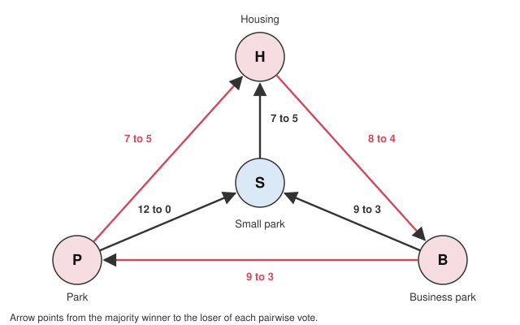

# Political Philosophy · Lesson 5.4: Does social choice wound democracy?

> ⏱ ~15 min · Module 5: Democracy and its foundations · Builds on: [5.1 Why democracy?](05-01-why-democracy.md), [5.3 Deliberative vs aggregative democracy](05-03-deliberative-vs-aggregative-democracy.md) · Unlocks: [6.1 Global justice: cosmopolitans and statists](06-01-global-justice-cosmopolitans-and-statists.md)

## Why this matters

"The people have spoken" is the most common phrase in democratic politics. Social choice theory says that, with three or more options, there may be nothing determinate for the people to have said: majorities can cycle, and the winner can depend on who set the order of votes. William Riker (*Liberalism against Populism*, 1982) drew the political moral: the idea of a popular will is incoherent, and democracy must be defended on thinner grounds. This lesson asks whether he was right, and whether democracy ever needed what the theorems deny.

## The idea

With two options, majority rule is about as good as aggregation gets: May's theorem (1952, cited to [`social-choice`](../../social-choice/syllabus.md)) shows it is the only rule that treats voters alike, treats options alike, and responds to votes in the right direction. Trouble starts at three.

An invented example. The 12-member council of Halden must decide what to build on a disused rail yard: **H**ousing, a **B**usiness park, a **P**ark, or a **S**mall park (the same park at half size). It has three factions:

| Faction | Members | Ranking |
|---|---|---|
| Builders | 5 | $H \succ B \succ P \succ S$ |
| Commerce | 4 | $B \succ P \succ S \succ H$ |
| Greens | 3 | $P \succ S \succ H \succ B$ |

Here $x \succ y$ means "ranks $x$ above $y$". Any two factions form a majority. Count the pairwise votes: $H$ beats $B$ 8 to 4, $B$ beats $P$ 9 to 3, and $P$ beats $H$ 7 to 5. That is a **[Condorcet cycle](../reference.md#condorcet-cycle)**: every member is consistent, yet the majority's "preferences" loop. No option beats all the others, so there is no Condorcet winner. *In words:* each faction is rational; the majority is not.

**[Arrow's theorem](../reference.md#arrows-theorem)** (*Social Choice and Individual Values*, 1951) generalizes the point. Take any rule that turns individual rankings of three or more options into a social ranking. Arrow shows no such rule satisfies all of:

- **Unrestricted domain:** it works for every possible profile of rankings.
- **Weak Pareto:** if everyone prefers $x$ to $y$, so does society.
- **Independence of irrelevant alternatives (IIA):** society's verdict on $x$ versus $y$ depends only on how each person ranks $x$ versus $y$.
- **Non-dictatorship:** no one person's ranking always becomes society's.
- **Transitivity:** the social ranking itself never loops.

The proof is [`grad-game-theory` 5.1](../../grad-game-theory/lessons/05-01-social-choice-impossibility.md)'s, and [`grad-micro` 6.5](../../grad-micro/lessons/06-05-social-choice-welfare.md) gives the welfare-economics reading; this lesson asks only what follows for democracy. Majority rule keeps the first four and gives up transitivity, which is the cycle above. Its companion, the Gibbard-Satterthwaite theorem, says every non-dictatorial rule over three or more options can be gamed by strategic voting.

Keep three kinds of claim apart. That cycles *can* occur is a formal result. How *often* they occur is empirical. Whether a cyclic majority means there is no "will of the people", and whether outcomes then lack legitimacy, are conceptual and normative questions. Riker's argument needs all three.

## The argument

**[Riker's argument](../reference.md#rikers-argument)**, reconstructed. Riker contrasts two conceptions of democracy. **Populism** (he traces it to Rousseau, [`history-of-political-thought` 4.4](../../history-of-political-thought/lessons/04-04-rousseau-the-social-contract.md)) holds that what the people want ought to be law, and voting reveals what they want. **Liberalism** (Madisonian, [`history-of-political-thought` 5.2](../../history-of-political-thought/lessons/05-02-the-federalist-faction-and-the-extended-republic.md)) holds only that periodic elections let voters remove officials.

1. **(Conceptual)** Populism needs a popular will: a determinate collective preference that exists prior to the vote and that the vote reveals.
2. **(Formal)** By Arrow and Condorcet, majority preference can cycle; when it does, which option wins depends on the procedure and the agenda, not on the profile alone.
3. **(Formal)** By Gibbard-Satterthwaite, every reasonable rule is open to strategic voting, so even a sincere-looking outcome may reflect manipulation.
4. **(Empirical)** In real politics we see only the outcomes, not the full profiles, so we cannot tell a Condorcet winner from an artefact of agenda control or manipulation. With two or more issue dimensions, McKelvey (1976) showed that majority cycles can typically wander across the whole space of options.
5. **(Conceptual)** So no voting outcome can be identified as the popular will.

∴ **C.** Populism is incoherent. Liberal democracy survives, because removing officials needs no popular will, only an electorate able to say no.

*In words:* if "the people" have no consistent preference to reveal, a democracy that claims to execute their will is executing nothing in particular.

**Three replies.** Each attacks a different premise.

- **Mackie's empirical reply** (Gerry Mackie, *Democracy Defended*, 2003) attacks premise 4. He re-examines the case studies Riker and others offered as real cycles, from a 1956 House vote on school-construction aid to the run-up to the American Civil War, and argues that almost every one rests on a factual or interpretive mistake. His wider claim is that cycling, agenda control and strategic voting are not harmful, frequent or irremediable enough to be of normative concern. He also argues that Arrow's conditions, IIA especially, demand more than a democrat must.
- **[Domain restriction](../reference.md#domain-restriction)** attacks the reach of premise 2. Arrow's rule must work on *every* profile, but real preferences are structured. If options lie on one line and each voter's ranking has a single peak (Black, 1948), majority rule cannot cycle and the median voter's favourite wins. Dryzek and List (2003) argue that deliberation ([5.3](05-03-deliberative-vs-aggregative-democracy.md)) can produce exactly this structure, by bringing voters to agree on what the issue's dimension is while still disagreeing about the answer.
- **The proceduralist reply** attacks premise 1. A democrat who values democracy for its fair procedure (equal votes, equal standing; the intrinsic justifications of [5.1](05-01-why-democracy.md)) never claimed the outcome expresses a pre-existing will. The outcome is legitimate because the procedure was fair, so a cycle shows only that a different fair procedure could have chosen otherwise. That is unsettling but not incoherent.

How big is the formal risk? Model, not data: if all six rankings of three options were equally likely ("impartial culture"), the chance of no Condorcet winner is $12/216 \approx 5.6\%$ with three voters and about $8.8\%$ in a large electorate, rising towards certainty as options multiply. Whether real electorates look like that model is the empirical question Mackie presses.

**Where the argument is weakest.** Premise 4, and the move from "can" to "does". Arrow's theorem is a claim about every possible profile; Riker needs cycles and manipulation to be common enough that no actual outcome can be trusted. A defender of Riker answers that the premise is about what we can *know*: since full profiles are almost never observed, the absence of documented cycles is weak evidence of their absence. A second weak point is the conclusion's asymmetry. Electing or removing an official is itself a choice among candidates, so a critic can ask why the theorems spare Riker's liberalism if they sink populism.

## The majority graph

*Halden's council. Every option loses at least one pairwise vote, so there is no Condorcet winner. The small park, which every member ranks below the full park, still beats housing.*

## Worked examples

**Example 1 (clean): the agenda decides.** Halden's chair sets an agenda: two options are voted on, the winner faces the next, and so on. Order $B, P, H, S$: $B$ beats $P$ 9 to 3; $B$ loses to $H$ 4 to 8; $H$ loses to $S$ 5 to 7. **The small park wins**, though all 12 members prefer the full park to it. Change the order and the result moves: $S, P, B, H$ ends with $H$; $H, S, B, P$ ends with $B$. Running all 24 orders, each of the four options wins under some agenda.

Riker reads this as his premise 2 made flesh: the outcome is the chair's, not the council's. A proceduralist asks a different question: was the power to set the agenda itself fairly allocated and checked? If it was, the outcome inherits the procedure's [legitimacy](../reference.md#legitimacy); if one faction controls the chair, the problem is unequal power, which democratic theory condemned before Arrow. Notice what neither reading licenses: an outcome that every member ranks below another option fails Pareto, and every view here counts that as a defect.

**Example 2 (hard): did Varden cycle?** Invented history. The Republic of Varden voted three times in three years on where to put a new capital, North (N), Coast (C) or Interior (I), each time a two-way referendum. Year 1: N beat C. Year 2: C beat I. Year 3: I beat N. Pundits announced a cycle: $N \succ C \succ I \succ N$. A university survey (invented numbers, 1,000 voters) asked for full rankings:

| Ranking | $N \succ C \succ I$ | $C \succ N \succ I$ | $C \succ I \succ N$ | $I \succ C \succ N$ | $N \succ I \succ C$ | $I \succ N \succ C$ |
|---|---|---|---|---|---|---|
| Voters | 300 | 150 | 200 | 250 | 60 | 40 |

Pairwise: C beats N 600 to 400; C beats I 650 to 350; N beats I 510 to 490. So the survey shows a **Condorcet winner, C**, and a transitive majority order $C \succ N \succ I$. Only 100 respondents rank Coast last, the rankings that break single-peakedness on the North-Coast-Interior line, too few to cause a cycle.

*Mackie's reading:* there was never one profile that cycled. Different referendums drew different turnouts on different dates, so the "cycle" is three snapshots of shifting electorates. *Riker's reply:* the survey is one more procedure, with its own question order and possible strategic answers, and the referendum sequence itself gave whoever chose the pairings power over the result. Here the principle stops giving a verdict: whether Varden "had a will" turns on whether the survey or the referendums better reveal preferences, which is an empirical question the theorems cannot settle.

## Watch out

- **You might think Arrow's theorem shows that majority voting usually produces incoherent results, but actually it shows that no rule *guarantees* coherence on every profile.** That is a formal claim about possibility. How often cycles occur is empirical, and that is where Riker and Mackie disagree.
- **You might think a cycle shows the winning law is illegitimate, or that citizens have no [political obligation](../reference.md#political-obligation) to obey it, but actually Riker's conclusion is conceptual: that outcomes cannot be read as a popular will.** Legitimacy, authority and obligation are separate questions ([1.1](01-01-the-problem-of-political-authority.md)). A proceduralist accepts the cycle and denies that legitimacy ever rested on a will.
- **You might think domain restriction cheats by excluding some voters, but actually no one is excluded.** It is an empirical hypothesis that actual preferences have structure, not a rule about who may vote. If the hypothesis fails, the cycles come back.

## One-liner

> Arrow shows that no fair rule can guarantee a consistent "will of the people"; whether that wounds democracy depends on whether cycles actually happen (Riker vs Mackie) and on whether democracy ever claimed to reveal a will rather than to decide fairly.

## Problems

**P1 (🟢) *(Formal (a)-(b) · Exegetical (c).)*** Invented numbers. A 7-member library board ranks four designs:

| Members | Ranking |
|---|---|
| 3 | $X \succ Y \succ Z \succ W$ |
| 2 | $W \succ Y \succ Z \succ X$ |
| 2 | $W \succ Y \succ X \succ Z$ |

(a) Find the Condorcet winner, if any, showing the pairwise counts you need. (b) Compute the Borda scores (3 points for a first place, 2, 1, 0) and the Borda winner. (c) The three $X$-first members now move $W$ from last to third, ranking $X \succ Y \succ W \succ Z$; no one changes how they rank $W$ against $Y$. Recompute the Borda scores of $W$ and $Y$, and name the Arrow condition the Borda count has violated. One sentence for the naming.

**P2 (🟡) *(Exegetical (a)-(b).)*** Diagnose. An **invented** op-ed, not the words of any real person, published after the (invented) Republic of Ostrel's parliament reversed a referendum result on a new rail line:

> (i) "Last spring the nation chose Route East over the status quo, 54 to 46. That is the will of the people, as clear as anything in politics." (ii) "MPs who now prefer Route West, which was never on the ballot, are substituting their will for the people's." (iii) "Voters elected these MPs; they can remove them in two years, and they should."

(a) For sentences (i) and (iii), say which of Riker's two conceptions of democracy each assumes. One line each. (b) Sentence (ii) assumes the referendum result settles how the people rank Route East against Route West. Say why a social choice theorist doubts this, and what Riker's argument does and does not imply about whether parliament's reversal is legitimate. 100 words or fewer.

**P3 (🔴, optional) *(Formal (a) · Exegetical (b).)*** Invented numbers. An 11-member town council chooses a speed limit of 20, 30, 40 or 50 km/h:

| Members | Ranking |
|---|---|
| 3 | $30 \succ 20 \succ 40 \succ 50$ |
| 2 | $40 \succ 50 \succ 30 \succ 20$ |
| 2 | $50 \succ 40 \succ 30 \succ 20$ |
| 2 | $20 \succ 50 \succ 30 \succ 40$ |
| 2 | $40 \succ 30 \succ 20 \succ 50$ |

(a) On the line 20-30-40-50, which group's ranking is not single-peaked, and why? Is there a Condorcet winner anyway? Show the pairwise counts that decide it. (b) Find the crux. Riker says that where a cycle *could* have occurred, the outcome cannot be called the people's will; a proceduralist says the outcome is legitimate whether or not a cycle occurred. Name the single premise about what makes a democratic outcome legitimate that one must affirm and the other deny. 60 words or fewer.

Solutions

**P1** *(Formal (a)-(b) — strict · Exegetical (c) — strict)*

(a) $W$ is first for $2+2=4$ of 7 members and last for the other 3. So $W$ beats $X$, $Y$ and $Z$ each 4 to 3. **$W$ is the Condorcet winner** (indeed a majority's first choice).

(b) Borda points 3, 2, 1, 0:

- $W$: $3\times0 + 2\times3 + 2\times3 = 12$
- $X$: $3\times3 + 2\times0 + 2\times1 = 11$
- $Y$: $3\times2 + 2\times2 + 2\times2 = 14$
- $Z$: $3\times1 + 2\times1 + 2\times0 = 5$

Check: $12+11+14+5 = 42 = 7 \times 6$. **Borda winner: $Y$**, though a majority ranks $W$ first.

(c) In the three changed ballots $W$ now gets 1 point instead of 0 and $Z$ gets 0 instead of 1. $W$: $3\times1 + 12 = 15$; $Y$ unchanged at 14 (and $Z$ falls to 2). Now $W$ beats $Y$ under Borda, though every member's $W$-versus-$Y$ ranking is unchanged (still 4 to 3 for $W$). The ranking of $W$ versus $Y$ moved because of where $Z$ sits: a violation of **independence of irrelevant alternatives**.

**Must hit, strict:**

- (a) $W$ beats each rival 4 to 3; $W$ is the Condorcet winner.
- (b) scores 12, 11, 14, 5; Borda picks $Y$.
- (c) $W$ 15, $Y$ 14; IIA is violated, because the $W$-$Y$ verdict flipped with no change in anyone's $W$-$Y$ ranking.

**Wrong turns:** naming unrestricted domain or Pareto in (c); giving 4, 3, 2, 1 points (the gaps are the same, so the winners match, but the stated scores do not); saying Borda violates non-dictatorship.

---

**P2** *(Exegetical (a)-(b) — strict)*

**Must hit, strict (a):**

- (i) Populism: the vote reveals a determinate popular will that ought to be law.
- (iii) Liberalism in Riker's sense: elections let voters remove officials they dislike.

**Must hit, strict (b):**

- The referendum was a two-way vote between East and the status quo. It says nothing about how voters rank East against West; with three options, pairwise majorities can cycle (for instance West beating East, the status quo beating West), so "the people's ranking" of East and West may not exist, and is in any case unobserved.
- Riker's argument is conceptual: no outcome, including the referendum's, can be certified as *the* popular will. It does not show that parliament's reversal is illegitimate or legitimate; that needs a further normative premise about what confers legitimacy.

**Wrong turns:** treating 54 to 46 as settling East against West; concluding from Riker that the reversal is illegitimate (or that the referendum was) when his conclusion concerns meaning, not legitimacy; calling (iii) populist because it mentions voters.

**Model answer (b):** The referendum compared East with the status quo only. With West added, majorities could cycle, and nothing in a two-way result reveals the East-West ranking, so (ii) assumes a popular will the vote never measured. Riker's argument concludes that no outcome can be identified as the people's will, so it undercuts the referendum's claim to be that will as much as it would undercut parliament's. It says nothing either way about legitimacy: whether parliament may reverse a referendum depends on a normative view of what makes outcomes legitimate, for example fair procedure, which social choice does not settle.

---

**P3** *(Formal (a) — strict · Exegetical (b) — strict)*

(a) The group ranking $20 \succ 50 \succ 30 \succ 40$ is not single-peaked: its peak is 20, so moving right along the line its rankings should fall steadily, but it ranks 50 above both 30 and 40. Every other group's ranking falls away from its peak on both sides.

The Condorcet winner is **40**, though the domain is not fully single-peaked:

Number the groups 1-5 from the top of the table.

- 40 vs 20: 40 above 20 for groups 2, 3 and 5 ($2+2+2=6$); 20 above 40 for groups 1 and 4 ($3+2=5$). 40 wins 6 to 5.
- 40 vs 30: 40 above 30 for groups 2, 3 and 5 ($2+2+2=6$); 30 above 40 for groups 1 and 4 ($3+2=5$). 40 wins 6 to 5.
- 40 vs 50: 40 above 50 for groups 1, 2 and 5 ($3+2+2=7$); 50 above 40 for groups 3 and 4 ($2+2=4$). 40 wins 7 to 4.

**Must hit, strict (a):**

- Group 4 is not single-peaked: 50 ranked above 30 and 40 while its peak is 20.
- 40 is the Condorcet winner: 6-5 over 20, 6-5 over 30, 7-4 over 50. Single-peakedness is sufficient for a Condorcet winner, not necessary.

**Must hit, strict (b):**

- The premise: an outcome is legitimate only if it expresses a collective preference that exists prior to the procedure. Riker (on behalf of populism) affirms that this is what populist legitimacy needs; the proceduralist denies it, locating legitimacy in the fairness of the procedure.

**Wrong turns:** answering (b) with an empirical premise (how often cycles occur), which is the Riker-Mackie dispute, not this one; saying no Condorcet winner can exist once one group is not single-peaked.

**Model answer (b):** The crux is whether democratic legitimacy requires that the outcome express a prior collective will. Riker's target, populism, assumes it does; the proceduralist denies it and grounds legitimacy in a fair procedure, so a possible cycle does not touch her.

## Flashback

**From Lesson [5.2](05-02-majority-rule-vs-rights-judicial-review.md) (Majority rule vs rights: judicial review):** *(Exegetical (a) · Evaluative (b).)* Diagnose. An **invented** memo from the constitutional commission of the invented Republic of Saltria, not the words of any real person or body:

> "In 1991, weeks after the junta fell, our founders tied the nation to the mast: the Charter forbids any law 'abridging the freedom of the press', and the Supreme Court may strike such laws down. Like Ulysses, we bound ourselves. When the Court enforces the Charter against today's Parliament, the people are simply keeping their own promise, so the counter-majoritarian difficulty does not arise."

(a) Name the two ways the memo's Ulysses analogy strains, on Elster's later critique. Two sentences. (b) Saltria meets Waldron's four assumptions. Parliament now bans publishing opinion polls in the last week before an election, and citizens disagree in good faith about whether that abridges the freedom of the press. Does the precommitment argument answer Waldron's objection to the Court striking the ban down? 100 words or fewer. Any verdict passes.

Solution

**Must hit, strict (a):**

- The binders are not the bound: the 1991 founders bound *later* citizens and Parliaments, whereas Ulysses bound himself.
- The binding was written in crisis, weeks after a junta fell, not in calm, so it may entrench that moment's passions rather than guard against later ones.

**Must hit, any verdict (b):**

- State Waldron's point on this case: the 1991 text commits Saltria to press freedom but does not settle whether a poll blackout abridges it. The live dispute is about what the right *requires*, which is his core case, so enforcing the clause is settling a good-faith disagreement among equals, not keeping a promise whose content is fixed. Ulysses knew exactly what he was binding himself against; Saltria's founders did not.
- State the strongest reply for review: on Dworkin's moral reading, an abstract clause commits the polity to a principle, and applying a principle takes moral judgment that courts are one institution charged with making. A precommitment can include a commitment about *who* interprets. (Also creditable: an Ely-style point that a blackout on election information regulates the channels of political change, where review is easiest to defend.)
- Say where it stops: the fact that Saltria committed itself does not settle which institution should interpret an abstract commitment under good-faith disagreement.

**Wrong turns:** treating the 1991 date as an empirical defect, when Elster's point is conceptual (who binds whom) as well as about timing; assuming the ban plainly abridges the press, which assumes away the disagreement the case stipulates; concluding the ruling would be illegitimate simply because the founders are dead, which is not Waldron's ground (his is equal say over a contested right).

**Model answer (b), one of several:** No, or not by itself. Ulysses bound himself against a known temptation. Saltria's clause binds later citizens to a phrase whose application to poll blackouts is exactly what they disagree about. A court striking the ban settles that disagreement over Parliament's vote, which is Waldron's core case, and the precommitment story does not tell us why the court's reading should win. A Dworkinian replies that the clause commits Saltria to a moral principle and that interpreting it is the court's job. Which institution interprets a contested commitment is the question neither the analogy nor the text settles.

## Connections

- **Backward:** [5.1](05-01-why-democracy.md) separated instrumental, epistemic and intrinsic justifications; the proceduralist reply here is the intrinsic one, and the jury theorem's epistemic case is stated for two options, where no cycle can arise. [5.3](05-03-deliberative-vs-aggregative-democracy.md)'s aggregative model is the one social choice targets, and its deliberative rival is where Dryzek and List look for structure. The legitimacy/obligation distinction is [1.1](01-01-the-problem-of-political-authority.md)'s. [5.2](05-02-majority-rule-vs-rights-judicial-review.md)'s question of when a court may overrule a majority looks different once "the majority's will" is in doubt.
- **Forward:** Module 6 applies the course's principles to hard cases, starting with [6.1](06-01-global-justice-cosmopolitans-and-statists.md).
- **Sideways:** Arrow's proof and the median voter theorem are [`grad-game-theory` 5.1](../../grad-game-theory/lessons/05-01-social-choice-impossibility.md); the welfare-economics reading is [`grad-micro` 6.5](../../grad-micro/lessons/06-05-social-choice-welfare.md). [`social-choice`](../../social-choice/syllabus.md) goes further (May's theorem, Sen's liberal paradox, judgment aggregation), and [`political-economy`](../../political-economy/syllabus.md) models what actual institutions do with cycles and agenda power.
