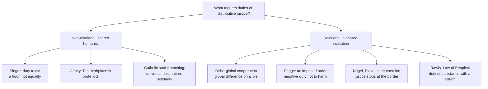

# Political Philosophy · Lesson 6.1: Global justice: cosmopolitans and statists

> ⏱ ~15 min · Module 6: Hard cases: borders, conscience and provision · Builds on: [2.3 Rawls II](02-03-rawls-the-two-principles-and-maximin.md), [2.6 Luck, relations, priority and sufficiency](02-06-luck-relations-priority-and-sufficiency.md), [1.1 The problem of political authority](01-01-the-problem-of-political-authority.md) · Unlocks: [6.2 Immigration](06-02-immigration-may-a-state-exclude.md), [6.4 Who should provide?](06-04-welfare-property-and-subsidiarity.md)

## Why this matters

Module 6 runs the theories of Modules 2-5 on four disputed questions. Each lesson states the live positions, religious and secular, at full strength, runs them on invented cases, and stops at the crux: the premise the rivals actually disagree about. No verdict is taught.

The first question: do principles of distributive justice stop at the border? Rawls's two principles ([2.3](02-03-rawls-the-two-principles-and-maximin.md)) were built for one society's [basic structure](../reference.md#basic-structure). Where you are born shapes your life prospects more than almost anything you do, which is exactly the kind of fact those principles were meant to tame. Yet Rawls himself declined to extend them to the world.

## The idea

Start with what nobody here denies. Peter Singer's argument, reconstructed in [`ethics` 1.4](../../ethics/lessons/01-04-integrity-and-demandingness.md), says that if you can prevent something very bad without sacrificing anything of comparable moral importance, you ought to, and distance makes no difference. That is a *duty of rescue or aid*, owed to persons as persons. Statists accept some version of it.

The dispute is about something else: **distributive justice**, the egalitarian standard (a difference principle, fair equality of opportunity, a luck-egalitarian norm) that asks whether *inequalities* can be justified, not merely whether anyone is destitute. Two families of answer say what makes such a standard apply between people.

- **Non-relational views:** shared humanity is enough. If birthplace is morally arbitrary, inequality that tracks it needs justification wherever it occurs.
- **Relational views:** the standard applies only among people who stand in some special relation: cooperation, coercion, a shared institution. Then the question becomes whether that relation exists globally.

**[Cosmopolitanism](../reference.md#cosmopolitanism)** here means that egalitarian distributive principles apply globally. **[Statism](../reference.md#statism)** means they apply within states, and something weaker applies between them.

**The cosmopolitans, at full strength.**

- **Charles Beitz** (*Political Theory and International Relations*, 1979) gave two arguments. First, natural resources are distributed as arbitrarily as talents, so the parties to a global original position would adopt a resource redistribution principle. Second, global trade and investment already form a scheme of social cooperation; if cooperation is what makes Rawls's principles apply, a global scheme calls for a global difference principle, maximizing the prospects of the world's worst-off.
- **Thomas Pogge** (*World Poverty and Human Rights*, 2002) grounds his case in a *negative* duty: not to impose an unjust institutional order on others. The rich countries shape and enforce global rules, among them the **international resource privilege** (whoever holds effective power over a territory can sell its resources with good legal title) and the **borrowing privilege** (that group can borrow in the country's name, binding later governments). These rules reward seizing power and foreseeably sustain severe poverty. Upholding them is not a failure to help; it is taking part in harm. ([Resource and borrowing privileges](../reference.md#resource-and-borrowing-privileges).)
- **Luck-egalitarian cosmopolitans** (Simon Caney, Kok-Chor Tan) press the point [2.6](02-06-luck-relations-priority-and-sufficiency.md) left open: birthplace is [brute luck](../reference.md#brute-and-option-luck) par excellence, so if justice neutralizes unchosen disadvantage at home, it cannot stop at the border.
- **Catholic social teaching** holds that the earth's goods are destined for all (the universal destination of goods), and that growing interdependence makes solidarity, a firm commitment to the common good of all peoples, a moral duty; *Populorum progressio* (1967) and *Sollicitudo rei socialis* (1987) apply both to international development. One position here, taught from within in [`catholic-social-teaching`](../../catholic-social-teaching/syllabus.md).

**The statists, at full strength.**

- **Rawls, *The Law of Peoples* (1999).** Principles between societies are chosen by representatives of *peoples*, not individuals. Well-ordered peoples owe a **[duty of assistance](../reference.md#duty-of-assistance)** to *burdened societies*, those lacking the institutions, culture or resources to be well-ordered. The duty has a *target* (helping them manage their own affairs justly or decently) and a *cut-off*: once reached, it ends, however poor the society stays. Rawls rejects a global difference principle because well-ordered peoples make different decisions about saving, education and population, and continuing transfers would override those decisions. He adds an empirical premise: political culture, more than resources, determines a people's wealth.
- **Thomas Nagel** ("The Problem of Global Justice", *Philosophy & Public Affairs*, 2005) and **Michael Blake** ("Distributive Justice, State Coercion, and Autonomy", same journal, 2001) locate the trigger in state coercion. Nagel's version is the argument below.

## The argument

**Nagel's statist argument**, reconstructed.

1. **(Normative)** Egalitarian standards of justice are owed only within relations that need a special justification to those inside them; beyond them, we owe a humanitarian minimum.
2. **(Normative)** A sovereign state's coercive law is such a relation. It is imposed in the name of the people it binds, who are expected to accept its authority and are treated as its co-authors. Arbitrary inequalities in rules you are made to co-author need justifying *to you*.
3. **(Empirical and conceptual)** No global institution imposes coercive law in the name of all the world's people. Treaties and trade bodies are made by states bargaining, and they bind states, not individuals as co-authors.

∴ **C.** Distributive justice stops at the state's border. Between states, humanitarian duties and fair bargaining remain; egalitarian justice does not apply.

*In words:* what triggers equality is not that we share a planet but that a state forces rules on us in our own name. Without a world sovereign, there is no one to whom global inequality must be justified as a matter of justice.

Blake's variant drops co-authorship: coercion invades autonomy and must be justified to the coerced, and only a state's legal system coerces people across the whole of their economic lives (property, contract, tax).

**Where the argument is weakest.** Two premises draw fire. Against premise 3, Joshua Cohen and Charles Sabel (2006) argue that bodies like the WTO make rules that bind people directly, with no real option to leave, and Arash Abizadeh argues that a state's border coerces outsiders, so the relation the statist needs already reaches beyond the state. Against premise 1, the non-relational cosmopolitan asks why a *relation* should matter at all: a child's unchosen disadvantage is the same whether or not anyone coerces her.

**The crux.** This is the lesson's spine. Statists and cosmopolitans divide over **[what triggers duties of distributive justice](../reference.md#relational-and-non-relational-accounts)**: shared humanity, or a relation (coercion, cooperation, imposition) that may or may not exist globally. Inside the relational family, a second dispute follows: whether that relation in fact holds across borders. Beitz and Nagel are both relationalists who disagree about the facts and which relation counts.

## Map of positions

Placement is partly contested. Pogge's duty arises from a relation (imposing an order) but protects human rights everyone has; Catholic social teaching grounds the destination of goods in creation and solidarity partly in interdependence. Beitz's resource argument is closer to the non-relational side.

## Worked examples

**Example 1 (clean): a trade rule.** Invented case. The Tessaly Trade Organization, set up by treaty among rich and poor states, adopts a rule giving 25-year patent protection on seed varieties, enforced by trade sanctions. Kessa, a poor member, signed because leaving the organization would close its export markets. Seed prices for Kessan farmers rise sharply.

- *Pogge:* ask whether the rule foreseeably contributes to severe poverty that a feasible alternative rule would avoid. If so, the rich states that designed and enforce it violate a negative duty. What is owed is reform or compensation, not charity.
- *Nagel:* the rule was made by states bargaining, not imposed in the name of Kessan farmers as co-authors, so the egalitarian standard does not govern it. The humanitarian minimum still binds, and so do standards of fair bargaining; Nagel does not say the rule is permissible, only that it is not a question of distributive justice.
- *Cohen and Sabel's objection* targets that last step: a rule-making body that binds people with no real exit is already the kind of relation premise 2 describes.

The two views can agree the rule is wrong and disagree about why, and so about what remedy is owed.

**Example 2 (hard): after the cut-off.** Invented case. Over twenty years, aid from Arlen helps the burdened society of Tolvane build a functioning legal system, honest courts and a decent consultation of its people. Tolvane is now well-ordered. Its average income is still one fifth of Arlen's (an invented figure).

- *Rawls:* the target is met; the duty of assistance ends. Further transfers may be generous, but justice does not require them.
- *Beitz:* if trade binds Arlen and Tolvane in one cooperative scheme, the difference principle applies as long as the gap does not work to the advantage of the world's worst-off, so transfers or rule changes continue.

The strain is that Rawls's verdict rests on an empirical premise. His respect-for-choices argument works if the gap reflects Tolvane's own decisions about saving and population; if it reflects poorer land or an inherited debt burden, Beitz's resource argument and Pogge's borrowing privilege bite. And "well-ordered" has no sharp edge, so the principle stops giving a verdict for a society that is nearly, but not quite, there.

## Watch out

- **You might think statists say we owe foreigners nothing, but actually** Nagel accepts a humanitarian minimum and Rawls a duty of assistance. The dispute is over *egalitarian* justice, not over whether famine relief is required.
- **You might think Nagel's trigger is coercion as raw power, but actually** it is coercion that claims [legitimacy](../reference.md#legitimacy) over the coerced, imposed in their name. A strong state bullying a weak one exercises power without claiming to rule its people. Keep [power, legitimacy, authority and obligation](../reference.md#power-legitimacy-authority-obligation) apart: Abizadeh's border argument works by showing that outsiders are subject to coercion that also needs a claim of legitimacy.
- **You might think the dispute is empirical, but actually** it has both layers. "The global order causes poverty" (Pogge) and "political culture determines wealth" (Rawls) are empirical; whether shared humanity is enough is normative. The facts decide how each view applies, not which trigger is right.

## One-liner

> Everyone accepts a duty to aid; cosmopolitans (Beitz, Pogge, the luck egalitarians) extend egalitarian justice to the world, statists (Nagel, Blake, Rawls's Law of Peoples) confine it to the coercive state, and the crux is what triggers justice: humanity, or a relation that may not exist globally.

## Problems

**P1 (🟢) *(Exegetical (a)-(b).)*** Diagnose. Five **invented** remarks from a debate in the parliament of Arlen, not the words of any real person:

> (i) "We owe the people of Kessa rescue from destitution, nothing more: our tax and property laws are not made in their name."
> (ii) "We must help Tolvane build institutions that let it run its own affairs; once it can, what it does with its wealth is its people's business."
> (iii) "Our rules let any junta that seizes Kessa sell its oil and borrow in its name. By upholding them we are not failing to help; we are taking part in harm."
> (iv) "Trade and investment already bind the world into one scheme of cooperation, so the principle that governs our own institutions should govern that scheme, for the sake of the world's worst-off."
> (v) "A child dying of a preventable disease in Kessa is no less our concern than one dying on our doorstep, and saving her would cost us little."

(a) Name the thinker whose view each remark states, and in a few words the ground it gives. (b) Suppose it were shown that Kessa's poverty would be exactly the same under any feasible alternative to the current trade and lending rules, while trade still ties the countries together. Which remark loses its force, and why? Two sentences.

**P2 (🟡) *(Exegetical (a)-(b).)*** Find the crux between Singer and Pogge. Both want rich Arlen to act on Kessa's poverty. (a) Name the premise on which they divide: what kind of duty each invokes, and what each needs to establish that the other does not. (b) A libertarian who accepts only negative duties ([2.4](02-04-nozick-entitlement-and-the-challenge-to-patterns.md)) rejects Singer's conclusion. Can she reject Pogge's on the same ground? Say what her answer hangs on. 120 words or fewer in total.

**P3 (🔴, optional) *(Evaluative.)*** Apply to a hard case. Invented case. The Northern Fisheries Authority, created by treaty among Arlen, Kessa and Varden, sets binding catch quotas on licensed fishers of all three countries, inspects their boats, and fines violators through its own tribunal; a member may leave only on ten years' notice. The quotas favour Arlen's large fleets. Should egalitarian distributive standards govern how the quotas are set? Run Nagel's view and the Cohen-Sabel objection, reach a verdict, and say where the principle you rely on stops giving one. 150 words or fewer. Any verdict passes.

Solutions

**P1** *(Exegetical (a)-(b) — strict)*

**Must hit, strict (a):**

- (i) **Nagel** (or Blake): egalitarian justice is owed only to those whose coercive law is made in their name; outsiders get a humanitarian minimum.
- (ii) **Rawls, *The Law of Peoples***: the duty of assistance to a burdened society, with a target (managing its own affairs) and a cut-off; respect for a people's own choices.
- (iii) **Pogge**: the resource and borrowing privileges; a negative duty not to impose an unjust order.
- (iv) **Beitz**: global interdependence as a scheme of cooperation, so a global difference principle.
- (v) **Singer**: a duty to aid grounded in shared humanity; distance is irrelevant and the cost is small.

**Must hit, strict (b):**

- (iii), Pogge's, loses its force: his duty is a negative duty not to harm, and it requires that the imposed order contributes to the poverty relative to a feasible alternative. Remove the causal contribution and there is no harm to stop doing.
- The others survive: (iv) rests on the existence of cooperation, which still holds; (v) on need and cost; (i) and (ii) never depended on causation.

**Wrong turns:** choosing (iv) because both Beitz and Pogge talk about global institutions (Beitz's trigger is cooperation, not causing harm); reading (ii) as a statist denial of any duty, when it states a duty with a limit.

**Model answer (b):** Remark (iii) loses its force, because Pogge's duty is the negative duty not to take part in imposing an order that harms, and the hypothesis removes the harm. Beitz's (iv) survives, since trade still forms a scheme of cooperation, and Singer's (v) never depended on who caused the poverty.

---

**P2** *(Exegetical (a)-(b) — strict)*

**Must hit, strict (a):**

- Singer invokes a **positive** duty to aid, grounded in need and low cost; he needs no causal link between Arlen and Kessa's poverty.
- Pogge invokes a **negative** duty not to harm through an imposed institutional order; he must establish the empirical claim that the order Arlen upholds contributes to the poverty relative to a feasible alternative, and needs no positive duty.

**Must hit, strict (b):**

- No, not on the same ground: a negative-duty-only libertarian accepts duties not to harm, and Pogge's argument uses only such a duty.
- Her answer hangs on the empirical premise (does the order cause the poverty?) and on whether upholding rules that others' juntas exploit counts as *doing* harm rather than allowing it ([`ethics` 3.1](../../ethics/lessons/03-01-doing-and-allowing.md)).

**Wrong turns:** saying they differ over whether Kessa's poor matter (both say they do); treating Pogge's claim as normative only, when its weight rests on a causal premise.

**Model answer:** Singer argues from a positive duty: we may prevent great harm at small cost, so we must, whoever caused it. Pogge argues from a negative duty: we must stop imposing an order that harms, which needs the causal claim that the resource and borrowing privileges sustain poverty a feasible alternative would avoid. The libertarian cannot reject Pogge as she rejects Singer, since she accepts negative duties. She can resist only by denying the causal claim or by classifying upholding the rules as allowing, not doing, harm.

---

**P3** *(Evaluative — graded on moves, not verdict)*

**Accept:** any verdict that states both views on this case and names where the chosen principle stops determining the answer.

**Must hit, any verdict:**

- State Nagel's trigger precisely: coercive law imposed in the name of those bound, who are treated as co-authors and expected to accept its authority.
- Run it: the Authority coerces individuals directly (inspection, fines, its own tribunal), but it was made by states bargaining and does not claim to act in the fishers' name; say which feature you think decides.
- State the Cohen-Sabel objection: a body that makes binding rules for individuals with no real exit is already the relation that needs justification, so egalitarian standards apply.
- Say where the principle stops: what counts as "in their name", and whether ten years' notice is a real exit; the principle does not fix either.

**Wrong turns:** treating Nagel as saying the quotas may be anything (the humanitarian minimum and fair-bargaining standards still bind); treating the coercion as merely power when the Authority claims the right to fine, which is a claim of legitimacy.

**Model answer, one of several:** Nagel's trigger is coercion imposed in the name of those it binds. The Authority fines Kessan fishers through its own tribunal, so it coerces individuals, but it acts as the agent of three bargaining states, not in the fishers' name, and Nagel would deny that its quotas fall under egalitarian justice. Cohen and Sabel reply that this misses what matters: a body that binds individuals directly, with exit ten years away, needs justifying to them. I side with the objection here, since the Authority claims the right to fine fishers, which is a claim of legitimacy over them, not mere power. The principle stops at "in their name": nothing in it says whether a treaty body's claim to authority is made in the name of those it binds or of their states.

## Flashback

**From Lesson [5.3](05-03-deliberative-vs-aggregative-democracy.md) (Deliberative vs aggregative democracy):** *(Exegetical (a) · Evaluative (b).)* Apply to a new case. Invented case. The neighbouring villages of Aldwick and Brenna, 60 voters each, must each decide whether to close the village school and bus its pupils to the market town. Aldwick holds a postal ballot with no meeting: 31 to close, 29 to keep. Brenna holds three evening assemblies at which each side must answer the other's reasons (cost per pupil, a long bus ride for six-year-olds, the school hall as the village's only meeting room), then votes: also 31 to close, 29 to keep. (a) What does an aggregativist say about the legitimacy of the two decisions, what does Cohen say, and which premise of Cohen's argument produces the difference? Three sentences. (b) A Brenna parent objects: "The assemblies started at 7 p.m.; parents of young children came once if at all, and retired residents did most of the talking." Name the condition of Cohen's ideal procedure the complaint targets and the kind of claim it makes; then say whether Brenna's decision is still better justified than Aldwick's, and where your answer stops. 100 words or fewer. Any verdict passes.

Solution

**Must hit, strict (a):**

- Aggregativist: the two decisions are equally legitimate. Each is the same fair count with each voter counted once, and the model does not ask what happened before the count or what reasons lay behind the preferences.
- Cohen: Brenna's decision is better justified, because reasons were demanded and answered, so the outvoted 29 were given an account they could engage with; Aldwick's bare count tells its 29 only that there were more on the other side.
- The premise: premise 4, that aggregation without reasons justifies nothing to the outvoted beyond numbers (resting on premises 1-2, that coercion must be justifiable to those coerced by reasons they could accept). The vote in Brenna is the fallback after deliberation; in Aldwick it is the whole procedure.

**Must hit, any verdict (b):**

- The target is the **equality** condition: equal standing to propose and speak, with neither power nor resources tilting the field. Free evening time is a resource, and the group shut out is the one most affected.
- The complaint is an **empirical** claim about who actually took part. It attacks premise 3, the bridge from the ideal to an actual body, not Cohen's account of what legitimacy is.
- Either verdict, argued. *Still better:* reasons were exchanged, including the parents' (the bus ride was aired), and the ideal is a standard of degree for reforming the assemblies, not a pass/fail test. *Not better:* a deliberation tilted against those most affected borrows authority from an ideal it did not meet, and on access Aldwick's postal ballot was the more equal procedure.
- Where it stops: actual bodies are legitimate "to the degree" they mirror the ideal, and the theory names no threshold at which a tilted assembly falls below a fair count; nor can the matching tallies show whether anyone was moved by reasons rather than by who was in the room.

**Wrong turns:** reading the identical 31-29 tallies as proof that deliberation changed nothing (individual judgments may have shifted in both directions); filing the parent's complaint as normative; saying Brenna's residents now have a stronger duty to obey the decision, when Cohen's claim concerns the decision's legitimacy, not political obligation.

**Model answer (b), one of several:** The complaint targets equality: evening time is a resource, and those most affected had the least of it. It is an empirical claim about participation, so it strikes premise 3, not the account of legitimacy. I still rank Brenna above Aldwick: the parents' strongest reason was put and answered, and an imperfect exchange of reasons justifies more to the outvoted than a bare count. But the theory sets no threshold. Had parents been wholly absent, Aldwick's ballot, equal in access, might justify more, and nothing in Cohen fixes where that line falls.

## Connections

- **Backward:** Rawls's basic structure and difference principle are [2.3](02-03-rawls-the-two-principles-and-maximin.md); birthplace as brute luck answers the question [2.6](02-06-luck-relations-priority-and-sufficiency.md) left open. Nagel's trigger is a claim about [legitimacy](01-01-the-problem-of-political-authority.md), the right to rule, from 1.1. Singer's argument and the demandingness worry are [`ethics` 1.4](../../ethics/lessons/01-04-integrity-and-demandingness.md).
- **Forward:** [6.2](06-02-immigration-may-a-state-exclude.md) asks whether the state may coerce outsiders at its border, Abizadeh's point turned into a question about exclusion. [6.4](06-04-welfare-property-and-subsidiarity.md) asks who owes provision inside the state, where statists and cosmopolitans agree justice applies.
- **Sideways:** Pogge vs Singer is the doing/allowing distinction of [`ethics` 3.1](../../ethics/lessons/03-01-doing-and-allowing.md) applied to institutions. The Hayekian worry that "social justice" needs a distributor ([`philosophy-of-economics` 5.5](../../philosophy-of-economics/lessons/05-05-hayek-knowledge-order-and-the-mirage-of-social-justice.md)) returns at global scale, where there is no basic structure to answer it, unless Beitz is right. The WTO as an organization is [`international-relations`](../../international-relations/syllabus.md).
